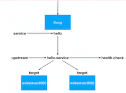
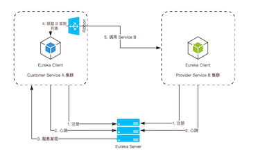

# 负载均衡

::: tip 此文为转载 （通常一篇文章会参考多处，也会添加自己的理解，引用地址如有遗漏，请指出）

- [https://segmentfault.com/a/1190000019789819](https://segmentfault.com/a/1190000019789819)
- [https://segmentfault.com/a/1190000018694867](https://segmentfault.com/a/1190000018694867)
- [https://blog.csdn.net/cywosp/article/details/38014581](https://blog.csdn.net/cywosp/article/details/38014581)
- [https://blog.csdn.net/yinwenjie/article/details/46605451](https://blog.csdn.net/yinwenjie/article/details/46605451)
- [https://blog.51cto.com/hzcto/2382282](https://blog.51cto.com/hzcto/2382282)
- [https://blog.csdn.net/qq_43011640/article/details/102690356](https://blog.csdn.net/qq_43011640/article/details/102690356)

:::

关于负载均衡，这里转载了多篇文章从不同的角度、叙述方式、知识点结构来共同帮助理解。旨在看完本文的所有点后，对负载均衡有个全面的认识。(*每个二级标题是单独的文章；所有文章并无关联，知识点可能有重复...*)

 

 

## **什么是负载均衡**

负载均衡（LB，Load Balance），是一种技术解决方案。用来在多个资源（一般是服务器）中分配负载，达到最优化资源使用，避免过载。

### **什么是高可用**

CAP 定理是分布式系统的基础，也是分布式系统的 3 个指标：

- Consistency（一致性）
- Availability（可用性）
- Partition tolerance（分区容错性）

那高可用（High Availability）是什么？高可用，简称 HA，是系统一种特征或者指标，通常是指，提供一定性能上的服务运行时间，高于平均正常时间段。反之，消除系统服务不可用的时间。衡量系统是否满足高可用，就是当一台或者多台服务器宕机的时候，系统整体和服务依然正常可用。

总而言之，负载均衡（Load Balance）是分布式系统架构设计中必须考虑的因素之一。一般通过负载均衡，冗余同一个服务实例的方式，解决分布式系统的大流量、高并发和高可用的问题。负载均衡核心关键：在于是否分配均匀。

### **常见的负载均衡案例**

场景1：微服务架构中，网关路由到具体的服务实例 hello：

- 两个相同的服务实例 hello service ，一个端口 8000 ，另一个端口 8082
- 通过 Kong 的负载均衡 LB 功能，让请求均匀的分发到两个 hello 服务实例
- Kong 的负载均衡策略算法很多：默认 weighted-round-robin 算法，还有 consumer: consumer id 作为 hash 算法输入值等

场景2：微服务架构中，A 服务调用 B 服务的集群。通过了 Ribbon 客户端负载均衡组件：

- 负载均衡策略算法并不高级，最简单的是随机选择和轮循

### **互联网分布式系统解决方案**

常见的互联网分布式系统架构分为几层，一般如下：

- 客户端层：比如用户浏览器、APP 端
- 反向代理层：技术选型 Nignx 或者 F5 等
- Web 层：前后端分离场景下， Web 端可以用 NodeJS 、 RN 、Vue
- 业务服务层：用 Java 、Go，一般互联网公司，技术方案选型就是 SC 或者 Spring Boot + Dubbo 服务化
- 数据存储层：DB 选型 MySQL ，Cache 选型 Redis ，搜索选型 ES 等

一个请求从第 1 层到第 4 层，层层访问都需要负载均衡。即每个上游调用下游多个业务方的时候，需要均匀调用。这样整体系统来看，就比较负载均衡.

**第 1 层：客户端层 -> 反向代理层 的负载均衡**

客户端层 -> 反向代理层的负载均衡如何实现呢？ - DNS负载均衡

答案是：DNS 的轮询。 DNS 可以通过 A （Address，返回域名指向的 IP 地址）设置多个 IP 地址。比如这里访问 bysocket.com 的 DNS 配置了 ip1 和 ip2 。为了反向代理层的高可用，至少会有两条 A 记录。这样冗余的两个 ip 对应的 nginx 服务实例，防止单点故障。

每次请求 bysocket.com 域名的时候，通过 DNS 轮询，返回对应的 ip 地址，每个 ip 对应的反向代理层的服务实例，也就是 nginx 的外网ip。这样可以做到每一个反向代理层实例得到的请求分配是均衡的。

**第 2 层：反向代理层 -> Web 层 的负载均衡**

反向代理层 -> Web 层 的负载均衡如何实现呢？

是通过反向代理层的负载均衡模块处理。比如 nginx 有多种均衡方法：

- 请求轮询。请求按时间顺序，逐一分配到 web 层服务，然后周而复始。如果 web 层服务 down 掉，自动剔除
- ip 哈希。按照 ip 的哈希值，确定路由到对应的 web 层。只要是用户的 ip 是均匀的，那么请求到 Web 层也是均匀的。

还有个好处就是同一个 ip 的请求会分发到相同的 web 层服务。这样每个用户固定访问一个 web 层服务，可以解决 session 的问题。

**第 3 层：Web 层 -> 业务服务层 的负载均衡**

Web 层 -> 业务服务层 的负载均衡如何实现呢？

比如 Dubbo 是一个服务治理方案，包括服务注册、服务降级、访问控制、动态配置路由规则、权重调节、负载均衡。其中一个特性就是智能负载均衡：内置多种负载均衡策略，智能感知下游节点健康状况，显著减少调用延迟，提高系统吞吐量。

为了避免避免单点故障和支持服务的横向扩容，一个服务通常会部署多个实例，即 Dubbo 集群部署。会将多个服务实例成为一个服务提供方，然后根据配置的随机负载均衡策略，在20个 Provider 中随机选择了一个来调用，假设随机到了第7个 Provider。LoadBalance 组件从提供者地址列表中，使用均衡策略，选择选一个提供者进行调用，如果调用失败，再选另一台调用。

Dubbo内置了4种负载均衡策略:

- RandomLoadBalance:随机负载均衡。随机的选择一个。是Dubbo的默认负载均衡策略。
- RoundRobinLoadBalance:轮询负载均衡。轮询选择一个。
- LeastActiveLoadBalance:最少活跃调用数，相同活跃数的随机。活跃数指调用前后计数差。使慢的 Provider 收到更少请求，因为越慢的 Provider 的调用前后计数差会越大。
- ConsistentHashLoadBalance:一致性哈希负载均衡。相同参数的请求总是落在同一台机器上。

同样，因为业务的需要，也可以实现自己的负载均衡策略

**第 4 层：业务服务层 -> 数据存储层 的负载均衡**

数据存储层的负载均衡，一般通过 DBProxy 实现。比如 MySQL 分库分表。

当单库或者单表访问太大，数据量太大的情况下，需要进行垂直拆分和水平拆分两个维度。比如水平切分规则：

- Range 、 时间
- hash 取模，订单根据店铺ID 等

但伴随着这块的负载会出现下面的问题，需要解决：

- 分布式事务
- 跨库 join 等

现状分库分表的产品方案很多：当当 sharding-jdbc、阿里的 Cobar 等

**所以：**

对外看来，负载均衡是一个系统或软件的整体。对内看来，层层上下游调用。只要存在调用，就需要考虑负载均衡这个因素。所以负载均衡（Load Balance）是分布式系统架构设计中必须考虑的因素之一。考虑主要是如何让下游接收到的请求是均匀分布的：

- 第 1 层：客户端层 -> 反向代理层 的负载均衡。通过 DNS 轮询
- 第 2 层：反向代理层 -> Web 层 的负载均衡。通过 Nginx 的负载均衡模块
- 第 3 层：Web 层 -> 业务服务层 的负载均衡。通过服务治理框架的负载均衡模块
- 第 4 层：业务服务层 -> 数据存储层 的负载均衡。通过数据的水平分布，数据均匀了，理论上请求也会均匀。比如通过买家ID分片类似

 

## **服务端、客户端负载均衡**

### **服务端负载均衡**

负载均衡是我们处理高并发、缓解网络压力和进行服务端扩容的重要手段之一，但是一般情况下我们所说的负载均衡通常都是指服务端负载均衡，服务端负载均衡又分为两种，一种是硬件负载均衡，还有一种是软件负载均衡。 硬件负载均衡主要通过在服务器节点之间安装专门用于负载均衡的设备，常见的如F5。 软件负载均衡则主要是在服务器上安装一些具有负载均衡功能的软件来完成请求分发进而实现负载均衡，常见的就是Nginx。 无论是硬件负载均衡还是软件负载均衡，它的工作原理都不外乎下面这张图：

无论是硬件负载均衡还是软件负载均衡都会维护一个可用的服务端清单，然后通过心跳机制来删除故障的服务端节点以保证清单中都是可以正常访问的服务端节点，此时当客户端的请求到达负载均衡服务器时，负载均衡服务器按照某种配置好的规则从可用服务端清单中选出一台服务器去处理客户端的请求。这就是服务端负载均衡。

### **客户端负载均衡**

我们在Spring Cloud中服务的发现与消费一文中涉及到了客户端负载均衡，在那篇文章中我们提到

“Ribbo是一个基于HTTP和TCP的客户端负载均衡器，当我们将Ribbon和Eureka一起使用时，Ribbon会从Eureka注册中心去获取服务端列表，然后进行轮询访问以到达负载均衡的作用，客户端负载均衡中也需要心跳机制去维护服务端清单的有效性，当然这个过程需要配合服务注册中心一起完成。”

从上面的描述我们可以看出，客户端负载均衡和服务端负载均衡最大的区别在于服务清单所存储的位置。在客户端负载均衡中，所有的客户端节点都有一份自己要访问的服务端清单，这些清单统统都是从Eureka服务注册中心获取的。在Spring Cloud中我们如果想要使用客户端负载均衡，方法很简单，开启@LoadBalanced注解即可，这样客户端在发起请求的时候会先自行选择一个服务端，向该服务端发起请求，从而实现负载均衡。具体小伙伴们可以参考Spring Cloud中服务的发现与消费这篇文章。

 

## **负载均衡分类 （分布式架构下的负载均衡）**

负载均衡可以根据网络协议的层数进行分类，我们这里以ISO模型为准，从下到上分为： 物理层，数据链路层，网络层，传输层，会话层，表示层，应用层。

当客户端发起请求，会经过层层的封装，发给服务器，服务器收到请求后经过层层的解析，获取到对应的内容。

### **二层负载均衡**

二层负债均衡是基于数据链路层的负债均衡，即让负债均衡服务器和业务服务器绑定同一个虚拟IP（即VIP），客户端直接通过这个VIP进行请求，那么如何区分相同IP下的不同机器呢？没错，通过MAC物理地址，每台机器的MAC物理地址都不一样，当负载均衡服务器接收到请求之后，通过改写HTTP报文中以太网首部的MAC地址，按照某种算法将请求转发到目标机器上，实现负载均衡。

这种方式负载方式虽然控制粒度比较粗，但是优点是负载均衡服务器的压力会比较小，负载均衡服务器只负责请求的进入，不负责请求的响应（响应是有后端业务服务器直接响应给客户端），吞吐量会比较高。

 

### **三层负载均衡**

三层负载均衡是基于网络层的负载均衡，通俗的说就是按照不同机器不同IP地址进行转发请求到不同的机器上。

这种方式虽然比二层负载多了一层，但从控制的颗粒度上看，并没有比二层负载均衡更有优势，并且，由于请求的进出都要经过负载均衡服务器，会对其造成比较大的压力，性能也比二层负载均衡要差。

 

### **四层负载均衡**

四层负载均衡是基于传输层的负载均衡，传输层的代表协议就是TCP/UDP协议，除了包含IP之外，还有区分了端口号，通俗的说就是基于IP+端口号进行请求的转发。相对于上面两种，控制力度缩小到了端口，可以针对同一机器上的不用服务进行负载。

这一层以LVS为代表。

### **七层负载均衡**

七层负载均衡是基于应用层的负载均衡，应用层的代表协议有HTTP，DNS等，可以根据请求的url进行转发负载，比起四层负载，会更加的灵活，所控制到的粒度也是最细的，使得整个网络更"智能化"。例如访问一个网站的用户流量，可以通过七层的方式，将对图片类的请求转发到特定的图片服务器并可以使用缓存技术；将对文字类的请求可以转发到特定的文字服务器并可以使用压缩技术。可以说功能是非常强大的负载。

这一层以Nginx为代表。

### 实践应用

在普通的应用架构中，使用Nginx完全可以满足需求，对于一些大型应用，一般会采用DNS+LVS+Nginx的方式进行多层次负载均衡，以上这些说明都是基于软件层面的负载均衡，在一些超大型的应用中，还会在前面多加一层物理负载均衡，比如知名的F5。

 

## **负载均衡算法**

负载均衡算法分为两类：一种是静态负载均衡，一种是动态负载均衡。

### **静态均衡算法**

**1、轮询法**

将请求按顺序轮流地分配到每个节点上，不关心每个节点实际的连接数和当前的系统负载。

- 优点：简单高效，易于水平扩展，每个节点满足字面意义上的均衡；
- 缺点：没有考虑机器的性能问题，根据木桶最短木板理论，集群性能瓶颈更多的会受性能差的服务器影响。

 

**2、随机法**

将请求随机分配到各个节点。由概率统计理论得知，随着客户端调用服务端的次数增多，其实际效果越来越接近于平均分配，也就是轮询的结果。

优缺点和轮询相似。

 

**3、源地址哈希法**

源地址哈希的思想是根据客户端的IP地址，通过哈希函数计算得到一个数值，用该数值对服务器节点数进行取模，得到的结果便是要访问节点序号。采用源地址哈希法进行负载均衡，同一IP地址的客户端，当后端服务器列表不变时，它每次都会落到到同一台服务器进行访问。

- 优点：相同的IP每次落在同一个节点，可以人为干预客户端请求方向，例如灰度发布；
- 缺点：如果某个节点出现故障，会导致这个节点上的客户端无法使用，无法保证高可用。当某一用户成为热点用户，那么会有巨大的流量涌向这个节点，导致冷热分布不均衡，无法有效利用起集群的性能。所以当热点事件出现时，一般会将源地址哈希法切换成轮询法。

 

**4、加权轮询法**

不同的后端服务器可能机器的配置和当前系统的负载并不相同，因此它们的抗压能力也不相同。给配置高、负载低的机器配置更高的权重，让其处理更多的请；而配置低、负载高的机器，给其分配较低的权重，降低其系统负载，加权轮询能很好地处理这一问题，并将请求顺序且按照权重分配到后端。

加权轮询算法要生成一个服务器序列，该序列中包含n个服务器。n是所有服务器的权重之和。在该序列中，每个服务器的出现的次数，等于其权重值。并且，生成的序列中，服务器的分布应该尽可能的均匀。比如序列{a, a, a, a, a, b, c}中，前五个请求都会分配给服务器a，这就是一种不均匀的分配方法，更好的序列应该是：{a, a, b, a, c, a, a}。

- 优点：可以将不同机器的性能问题纳入到考量范围，集群性能最优最大化；
- 缺点：生产环境复杂多变，服务器抗压能力也无法精确估算，静态算法导致无法实时动态调整节点权重，只能粗糙优化。

 

**5、加权随机法**

与加权轮询法一样，加权随机法也根据后端机器的配置，系统的负载分配不同的权重。不同的是，它是按照权重随机请求后端服务器，而非顺序。

**6、键值范围法**

根据键的范围进行负债，比如0到10万的用户请求走第一个节点服务器，10万到20万的用户请求走第二个节点服务器……以此类推。

- 优点：容易水平扩展，随着用户量增加，可以增加节点而不影响旧数据；
- 缺点：容易负债不均衡，比如新注册的用户活跃度高，旧用户活跃度低，那么压力就全在新增的服务节点上，旧服务节点性能浪费。而且也容易单点故障，无法满足高可用。

（注：以上所提到的单点故障，都可以用主从方式来解决，从节点监听主节点心跳，当发现主节点死亡，从节点切换成主节点顶替上去。这里可以思考一个问题，怎么设计集群主从可以最大程度上降低成本）

### **动态负债均衡算法**

**1、最小连接数法**

根据每个节点当前的连接情况，动态地选取其中当前积压连接数最少的一个节点处理当前请求，尽可能地提高后端服务的利用效率，将请求合理地分流到每一台服务器。俗称闲的人不能闲着，大家一起动起来。

- 优点：动态，根据节点状况实时变化；
- 缺点：提高了复杂度，每次连接断开需要进行计数；

实现：将连接数的倒数当权重值。

**2、最快响应速度法**

根据请求的响应时间，来动态调整每个节点的权重，将响应速度快的服务节点分配更多的请求，响应速度慢的服务节点分配更少的请求，俗称能者多劳，扶贫救弱。

- 优点：动态，实时变化，控制的粒度更细，跟灵敏；
- 缺点：复杂度更高，每次需要计算请求的响应速度；

实现：可以根据响应时间进行打分，计算权重。

**3、观察模式法**

观察者模式是综合了最小连接数和最快响应度，同时考量这两个指标数，进行一个权重的分配。

 

## **网站负载均衡技术-一些手段**

负载均衡的实现方式多种多样，从硬件到软件，从商业产品到开源产品，应有尽有。但是，实现负载均衡的基础技术不外乎以下几种：

### (1) HTTP重定向负载均衡　

评价：★★

此方案的优点是**简单易行**，缺点是：

- ①浏览器需要两次请求才能完成一次访问，**性能较差**；
- ②重定向服务器自身的处理能力有可能成为瓶颈，整个集群的**伸缩性规模有限**；
- ③使用HTTP 302重定向有可能使搜索引擎判断为**SEO作弊**，降低搜索排名；

### (2) DNS域名解析负载均衡

评价：★★★

此方案要求在DNS服务器中配置多个A记录，例如：

| www.mysite.com IN A | 114.100.80.1 |
| ------------------- | ------------ |
| www.mysite.com IN A | 114.100.80.2 |
| www.mysite.com IN A | 114.100.80.3 |

此方案的优点是将负载均衡的工作转交给了DNS，省掉了网站管理维护负载均衡服务器的麻烦。而缺点是：

- ①目前的DNS是**多级解析**，每一级DNS都可能缓存A记录，当某台服务器下线后，即使修改了DNS的A记录，要使其生效仍然需要较长时间。这段期间，会导致用户访问已经下线的服务器造成访问失败。
- ②DNS负载均衡的控制权在域名服务商那里，网站无法对其做更多改善和管理；

> **TIPS：**事实上，大型网站总是部分使用DNS域名解析，利用域名解析作为第一级负载均很手段，即域名解析得到的一组服务器不是实际的Web服务器，而是同样提供负载均衡的内部服务器，这组内部服务器再进行负载均衡，请求分发到真实的Web服务器上。

### (3) 反向代理负载均衡

评价：★★★★

Web服务器不需要使用外部IP地址，而反向代理服务器则需要配置双网卡和内外部两套IP地址。

此方案的优点是**和反向代理服务器功能集成在一起，部署简单**。缺点是**反向代理服务器是所有请求和响应的中转站，其性能可能会成为瓶颈**。

### (4) IP负载均衡

评价：★★★★

此方案优点在于在**内核进程**完成数据分发，较反向代理负载均衡（在应用程序中分发数据）有更好的处理性能。缺点是由于所有请求响应都需要经过负载均衡服务器，集群的最大响应数据吞吐量不得不**受制于负载均衡服务器网卡带宽**。

### (5) 数据链路层负载均衡

评价：★★★★★

此种方式又称作**三角传输模式**，负载均衡数据分发过程中不修改IP地址，只修改mac地址，由于实际处理请求的真实物理IP地址和数据请求目的IP地址一致，所以不需要通过负载均衡服务器进行地址转换，可将响应数据包直接返回给用户浏览器，避免负载均衡服务器网卡带宽成为瓶颈。这种负载均衡方式又称作**直接路由方式（DR）**。

**使用三角传输模式的链路层负载均衡是目前大型网站使用最广泛的一种负载均衡手段**。在Linux平台上最好的链路层负载均衡开源产品是LVS（Linux Virutal Server）。

### **LVS负载均衡机制**

1. LVS是**四层**负载均衡，也就是说建立在OSI模型的第四层——传输层之上，传输层上有我们熟悉的TCP/UDP，LVS支持TCP/UDP的负载均衡。因为LVS是四层负载均衡，因此它相对于其它高层负载均衡的解决办法，比如DNS域名轮流解析、应用层负载的调度、客户端的调度等，它的效率是非常高的。

2. LVS的转发主要通过**修改IP地址**（NAT模式，分为源地址修改SNAT和目标地址修改DNAT）、**修改目标MAC**（DR模式）来实现

   - **NAT模式：网络地址转换**

     

     - NAT（Network Address Translation）是一种**外网和内网地址映射**的技术。NAT模式下，网络数据报的进出都要经过LVS的处理。LVS需要作为RS（真实服务器）的网关。当包到达LVS时，LVS做目标地址转换（DNAT），将目标IP改为RS的IP。RS接收到包以后，仿佛是客户端直接发给它的一样。RS处理完，返回响应时，源IP是RS IP，目标IP是客户端的IP。这时RS的包通过网关（LVS）中转，LVS会做源地址转换（SNAT），将包的源地址改为VIP，这样，这个包对客户端看起来就仿佛是LVS直接返回给它的。客户端无法感知到后端RS的存在。

   - **DR模式：直接路由**

     

     - DR模式下需要LVS和RS集群绑定同一个VIP（RS通过将VIP绑定在loopback实现），但与NAT的不同点在于：请求由LVS接受，由真实提供服务的服务器（RealServer, RS）直接返回给用户，返回的时候不经过LVS。详细来看，一个请求过来时，LVS只需要将网络帧的MAC地址修改为某一台RS的MAC，该包就会被转发到相应的RS处理，注意此时的源IP和目标IP都没变，LVS只是做了一下移花接木。RS收到LVS转发来的包时，链路层发现MAC是自己的，到上面的网络层，发现IP也是自己的，于是这个包被合法地接受，RS感知不到前面有LVS的存在。而当RS返回响应时，只要直接向源IP（即用户的IP）返回即可，不再经过LVS。

3. **DR**负载均衡模式数据分发过程中不修改IP地址，只修改mac地址，由于实际处理请求的真实物理IP地址和数据请求目的IP地址一致，所以不需要通过负载均衡服务器进行地址转换，可将响应数据包直接返回给用户浏览器，避免负载均衡服务器网卡带宽成为瓶颈。因此，DR模式具有较好的性能，也是目前大型网站**使用最广泛**的一种负载均衡手段。

 

## **负载方案构想**

### **方案一：独立的Nginx/Haproxy方案**

很显然，第一个业务场景下，系统并没有多大的压力就是一套简单业务系统，日访问量也完全没有“有访问压力”这样的说法。但是客户有一个要求值得我们关注：要保证系统以后的功能和性能扩展性。为了保证功能和性能扩展性，在系统建立之初就要有一个很好的业务拆分规划，例如我们首先会把用户信息权限子系统和订单系统进行拆分，独立的车辆信息和定位系统可能也需要拆分出来。

这也是我们在系统建立时就要引入负载均衡层的一个重要原因。也是负载均衡层的重要作用之一。如下图所示：

可以看出，这时负载均衡层只有一个作用，**就是按照设定的访问规则，将访问不同系统的请求转发给对应的系统，并且在出现错误访问的情况下转发到错误提示页面**。

### **方案二：Nginx/Haproxy + Keepalived/Heartbeat方案**

此后，系统的访问压力进一步加大，系统的稳定性越来越受到我们的关注。所以在单节点处理还能满足业务要求的情况下，我们为负载层（还有各层）引入热备方案，以保证一个节点在崩溃的情况下，另一个节点能够自动接替其工作，为工程师解决问题赢得时间。如下图所示：

 

### **方案三：LVS(DR) + Keepalived/Heartbeat + Nginx/Haproxy方案**

在第三版本架构方案中，为了保证负载层足够稳定的状态下，适应更大的访问吞吐量还要应付可能的访问洪峰，我们加入了LVS技术。LVS负责第一层负载，然后再将访问请求转发到后端的若干台Nginx上。LVS的DR工作模式，只是将请求转到后端，**后端的Nginx服务器必须有一个外网IP，在收到请求并处理完成后，Nginx将直接发送结果到请求方，不会再经LVS回发**（具体的LVS工作原理介绍将在后文中详细介绍）。

这里要注意的是：

- 有了上层的LVS的支撑Nginx就不再需要使用Keepalived作为热备方案。因为首先Nginx不再是单个节点进行负载处理，而是一个集群多台Nginx节点；另外LVS对于下后端的服务器自带基于端口的健康检查功能；
- LVS是单节点处理的，虽然LVS是非常稳定的，但是为了保证LVS更稳定的工作，我们还是需要使用Keepalived为 LVS做一个热备节点，以防不时之需。

### **方案四：DNS轮询/智能DNS + LVS(DR) + Keepalived + Nginx方案**

场景四中，为了满足平均上亿的日PV访问，在对业务进行外网暴露的基础上，我们在互联网的最前端做了一个DNS轮询。然后将（对用户信息系统）访问压力首先分摊到两个对称LVS组上，再由每个组向下继续分拆访问压力。

注意上图的负载层方案的不同：

- 首先我们不在像前面的方案中，使用目录名分割业务系统了，而是直接将业务系统的访问使用不同的二级域名 (这里是 xxx.**user**.com)进行拆分。这样的变化有利于每个业务系统都拥有自己独立的负载均衡层。
- 请注意上图中的细节，**这个负载均衡层是专门为“用户信息子系统”提供负载均衡支撑的**，而可能还存在的“订单子系统”、“车辆信息子系统”都会有他们独立的负载均衡层。
- 在LVS下方的Nginx服务可以实现无限制的扩展，同样的就像场景三种所给出的解决方案一样，Nginx本身不在需要Keepalived保持热备，而是全部交由上层的LVS进行健康情况检查。而即使有一两台Nginx服务器出现故障，对整个负载集群来说问题也不大。

> 方案扩展到了这一步，LVS层就没有必要再进行扩展新的节点了。为什么呢？根据您的业务选择的合适的LVS工作模式，两个LVS节点的性能足以支撑地球上的所有核心WEB站点。如果您对LVS的性能有疑惑，请自行谷歌百度。

### **为什么没有独立的LVS方案**

如果用一句话说明其中的原因，那就是LVS为了保证其性能对配置性有所牺牲，单独使用的话往往无法满足业务层对负载层灵活分配请求的要求。

### **术语说明**

- **TPS**: 衡量业务层处理性能的重要指标（每秒钟request/事务的处理数量）。业务服务处理一个完整的业务过程，并向上层返回处理结果的过程就是一个 request/事务。那么在一秒钟内整个业务系统能够完成多少个这样的过程，其衡量单位就是TPS。TPS不但和系统架构有很大的关系（特别是业务层和业务通信层的架构祥泰），和物理环境、代码质量的关系也非常密切。
- **PV**: 网页浏览数是评价网站流量最常用的指标之一，简称为PV。Page Views中的Page一般是指普通的html网页，也包含php、jsp等动态产生的html内容。注意是完整的显示一个Page成为一个PV。但是一个PV，一般需要多次HTTP请求，以便获取多个静态资源，这是需要注意的。
- **UV**: Unique Visitor 一个独立IP，在一个单位时间内（例如一日/一小时）对系统的一个PV请求，成为一个UV（重复的PV不在进行计数）。
- **RUV**: Repeat User Visitor 一个独立用户，在一个单位时间内（例如一日/一小时）对系统的一个PV请求，并且重复的访问要进行计数。

### **硬件负载**

目前我们所提到的诸如Nginx、LVS等技术，没有详细讲述的Haproxy、Squid等技术，都是基于软件的负载技术。F5是一家公司，它的BIG-IP LTM技术是基于硬件负载的。硬件负载方案提供了软件负载技术无法提供了性能空间，并且集成了NAT映射功能、SSL加速、Cookie加密、高速缓存、攻击过滤、包过滤、动态Session保持等等很多软件负载无法提供的功能（或者需要多个软件组合使用才能提供的功能）。

但是硬件负载方案也有其缺点，主要就是建设费用比较高昂，它不像软负载可以根据系统的吞吐量的持续增加进行持续扩展。当然您可以根据系统的吞吐量需求，在前期采用软负载，后期采用硬件负载的方案。除了F5公司提供的硬件负载技术，还有Citrix公司的硬负载方案、A10公司的硬件负载方案。

 

## **nginx/keepalived/lvs/f5 架构设计**

**nginx、keepalived、lvs、f5可以很好的解决高可用、扩展性、反向代理+扩展均衡的问题**

### **单机**

 

- 浏览器通过DNS-server，域名解析到ip
- 浏览器通过ip访问web-server

缺点：

- 1）非高可用，web-server挂了整个系统就挂了
- 2）扩展性差，当吞吐量达到web-server上限时，无法扩容

### **DNS轮询**

DNS轮询：通过在DNS-server上对一个域名设置多个ip解析，来扩充web-server性能及实施负载均衡的技术

 

- 多部署几份web-server，1个tomcat抗1000，部署3个tomcat就能抗3000
- 在DNS-server层面，域名每次解析到不同的ip

优点：

- 1）零成本：在DNS-server上多配几个ip即可，功能也不收费
- 2）部署简单：多部署几个web-server即可，原系统架构不需要做任何改造
- 3）负载均衡：变成了多机，但负载基本是均衡的

缺点：

- 1）非高可用：DNS-server只负责域名解析ip，这个ip对应的服务是否可用，DNS是不保证的，假设有一个web-server挂了，部分服务会受到影响
- 2）扩容非实时：DNS解析有一个生效周期
- 3）暴露了太多的外网ip

### **nginx**

nginx：一个高性能的web-server和实施反向代理的软件

 

- 站点层与浏览器层之间加入了一个反向代理层，利用高性能的nginx来做反向代理
- nginx将http请求分发给后端多个web-server

优点：

- 1）DNS-server不需要动
- 2）负载均衡：通过nginx来保证
- 3）只暴露一个外网ip，nginx->tomcat之间使用内网访问
- 4）扩容实时：nginx内部可控，随时增加web-server随时实时扩容
- 5）能够保证站点层的可用性：任何一台tomcat挂了，nginx可以将流量迁移到其他tomcat

缺点：

- 1）时延增加+架构更复杂了：中间多加了一个反向代理层
- 2）反向代理层成了单点，非高可用

### **keepalived**

keepalived：一款用来检测服务状态存活性的软件，常用来做高可用

 

- 做两台nginx组成一个集群，分别部署上keepalived，设置成相同的虚IP，保证nginx的高可用
- 当一台nginx挂了，keepalived能够探测到，并将流量自动迁移到另一台nginx上，整个过程对调用方透明

优点：

- 1）解决了高可用的问题

缺点：

- 1）资源利用率只有50%
- 2）nginx仍然是接入单点

### **lvs/f5/nginx**

lvs/nginx：Linux Virtual Server，使用集群技术，实现在linux操作系统层面的一个高性能、高可用、负载均衡服务器 f5：一个高性能、高可用、负载均衡的硬件设备

 

- 可以通过lvs/nginx来扩展多个nginx和tomcat（上面的lvs可以用nginx代替）
- 通过keepalived+VIP的方案可以保证可用性

### **水平扩展**

水平扩展，才是解决性能问题的根本方案，能够通过加机器扩充性能的方案才具备最好的扩展性

 

- 通过DNS轮询来线性扩展入口lvs层的性能
- 通过keepalived来保证高可用
- 通过lvs来扩展多个nginx
- 通过nginx来做负载均衡，业务七层路由

 

## **四层 + 七层构建大规模集群架构使用场景**

**四层负载均衡应用场景**

1. 四层+七层来做负载均衡，四层可以保证七层的负载均衡的高可用性；如：nginx就无法保证自己的服务高可用，需要依赖LVS或者keepalive。
2. 如：tcp协议的负载均衡，有些请求是TCP协议的（mysql、ssh），或者说这些请求只需要使用四层进行端口的转发就可以了，所以使用四层负载均衡。

**四层负载均衡总结**

1. 四层负载均衡仅能转发TCP/IP协议、UDP协议、通常用来转发端口，如：tcp/22、udp/53；
2. 四层负载均衡可以用来解决七层负载均衡端口限制问题；（七层负载均衡最大使用65535个端口号）
3. 四层负载均衡可以解决七层负载均衡高可用问题；（多台后端七层负载均衡能同时的使用）
4. 四层的转发效率比七层的高得多，但仅支持tcp/ip协议，不支持http和https协议；
5. 通常大并发场景通常会选择使用在七层负载前面增加四层负载均衡。

