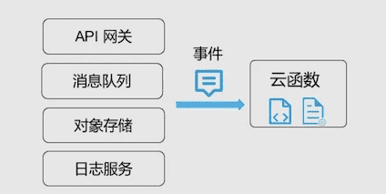

# Serverless 基本概念入门

::: tip 转载

- [Serverless 基本概念入门](https://mp.weixin.qq.com/s?__biz=MzU3OTc1MDM1Mg==&mid=2247484246&idx=1&sn=6f7fbc172ecc2edb73c8bdeb6b119446&chksm=fd6013e9ca179aff839f21d2754aa936694b846449a054d4e4dcb5fb7436703b2ab51540dd5e&scene=21#wechat_redirect)
- [看完这篇你就知道什么是无服务器架构了](https://blog.csdn.net/hollis_chuang/article/details/103825932)

:::

## 基本概念

2019 年，Serverless 被 Gartner 称为最有潜力的云计算技术发展方向，并被赋予是必然性的发展趋势。Serverless 从底层开始变革计算资源的形态，为软件架构设计与应用服务部署带来了新的设计思路。

### ▎什么是Serverless

Serverless ，按中文翻译，称为「无服务器」。 这究竟是一种什么样的形态或产品呢？无服务器，就是真的没有服务器吗？

其实，在行业内，目前对于 Serverless 有几种解读方法：

- 在某些场景可以解读为一种软件系统架构方法，通常称为 Serverless 架构
- 而在另一些情况下，又可以代表一种产品形态，称为 Serverless 产品

在说起 Serverless 架构时，Serverless 代表的是利用 Serverless 形态的产品实现的应用架构，这种架构完全依托于云厂商或云平台提供产品完成系统的组织及构建。在这种架构中，用户无需关注支撑应用服务运行的主机，而将关注点投入在系统架构，业务开发，业务支撑运维上。

而说起 Serverless 产品时，代表的是无需理解、管理服务器，按需使用，按使用付费的产品。Serverless 产品中，其实也可以包含存储、计算等多种类型的产品。而典型的计算产品，就是云函数这种形态。

云函数，或者称为**函数即服务 (Function as a Service)**，它和**后端即服务 (Backend as a Service)** 一起，都可以称为 Serverless 产品。通过组合使用这些产品，开发者可以构建自身的业务 Serverless 架构。

 

- FaaS（Function as a Service，Function 即服务）：包含服务器端业务逻辑的无状态 Function。这些 Function 运行在独立的容器里，基于事件驱动，并由第三方厂商托管，如 AWS Lambda 或者 Azure Functions。
- BaaS（Backend as a Service，后端即服务）：使用第三方服务（如 Firebase、Auth0）来达成目的。使用 BaaS 的应用程序通常是富客户端应用程序，如 SPA 或移动 App。客户端负责处理大部分的业务逻辑，其他部分则依赖外部服务，如认证、数据库、用户管理，等等。

### ▎Serverless 的价值

Serverless 技术为什么会获得越来越多的关注？我们可以从几个角度来看。

首先，从开发者使用的来说，不用更多地去考虑服务器的相关内容，无需再去考虑服务器的规格大小、存储类型、网络带宽、自动扩缩容问题。同时，也无需再对服务器进行运维，无需不断打系统补丁、应用补丁，无需进行数据备份、软件配置等工作。

其次，Serverless 产品是完全自动化的弹性扩缩容的。在业务高峰时，产品的计算能力、容量自动扩容，承载更多的用户请求，而在业务下降时，所使用的资源也会同时收缩，避免资源浪费。

再次，跟随着完全自动化的弹性所带来的，是全新的计量计费模式。开发者仅需根据使用量来付费，而在深夜无业务量的情况下，不会有空闲资源占用，因此也不会有费用产生。

随着如上提到的特性，Serverless 给开发者或用户带来了具体的商业价值：

**01 降低运维需求**

- Serverless 使得应用与服务器解耦，业务上线前无需预估资源，无需进行服务器购买、配置
- Serverless 也使得底层运维工作量进一步降低，业务上线后，也无需担忧服务器运维，而是全部交给了云平台或云厂商

**02 降低运营成本**

- Serverless 的应用是按需执行的。应用只在有请求需要处理或者事件触发时才会被加载运行，在空闲状态下 Serverless 架构的应用本身并不占用计算资源
- 在使用 Serverless 产品时，用户只需要为处理请求的计算资源付费，而无须为应用空闲时段的资源占用付费

**03 缩短迭代周期、上线时间**

- Serverless 架构带来的是进一步的业务解耦，应用功能被解构成若干个细颗粒度的无状态函数，开发可以聚焦在单功能的快速开发和上线
- 同时拆解后的云函数，也都可以进行独立的迭代升级，更快速的实现业务迭代，缩减功能的上市时间

**04 快速试错**

- 利用 Serverless 架构的简单运维、低成本及快速上线能力，可以来快速尝试业务的新形态、新功能
- 利用 Serverless 产品的强弹性扩容能力，在业务获得成功时，也无需为资源扩容而担心

### ▎Serverless 的技术特点

这里提到的技术特点的对象，**特指 Serverless 产品中的计算产品，也就是云函数**。云函数包含了如下的技术特性：

**01 事件驱动**

云函数的运行，是由事件驱动起来的，在有事件到来时，云函数会启动运行 Serverless 应用不会类似于原有的「监听 - 处理」类型的应用一直在线，而是按需启动 事件的定义可以很丰富，一次 http 请求，一个文件上传，一次数据库条目修改，一条消息发送，都可以定义为事件

 

**02 单事件处理**

- 云函数由事件触发，而触发启动的一个云函数实例，一次仅处理一个事件
- 无需在代码内考虑高并发高可靠性，代码可以专注于业务，开发更简单
- 通过云函数实例的高并发能力，实现业务高并发

**03 自动弹性伸缩**

- 由于云函数事件驱动及单事件处理的特性，云函数通过自动的伸缩来支持业务的高并发
- 针对业务的实际事件或请求数，云函数自动弹性合适的处理实例来承载实际业务量
- 在没有事件或请求时，无实例运行，不占用资源

**04 无状态开发**

- 云函数运行时根据业务弹性，可能伸缩到 0，无法在运行环境中保存状态数据
- 分布式应用开发中，均需要保持应用的无状态，以便于水平伸缩
- 可以利用外部服务、产品，例如数据库或缓存，实现状态数据的保存

### ▎Serverless 的应用场景

Serverless 架构或者技术，可以用在什么样的场景下，来充分发挥它的优势呢？如下的场景，都适合使用 Serverless 架构或产品，来实现所需的业务逻辑。

**01 WEB及移动后端**

通过结合使用云函数和 API 网关或 HTTP 触发器，可以对外提供 URL 访问地址，成为 Web、小程序、或移动应用等的后端服务。Serverless 架构既可以直接用于构建后台来服务应用，也可以通过类似 BFF 模式，构建中台和应用间的桥梁。 Serverless 架构提供的强弹性能力，使得可以支撑业务或应用的暴涨；而提供的低运维需求，使得开发者可以专注于业务实现和优化；同时，按实际使用量的付费方式，使得开发者无需预配置资源，无需担心预配置资源的浪费。

**02 消息处理**

Serverles 架构的应用本身是由事件触发的，因此极其适合于进行消息处理。无论是消息队列中传递的业务消息，还是 Kafka 中采集应用日志，均可以对接到云函数上，进行实时的消息处理、分析。

**03 对象存储文件处理**

在 Serverless 应用场景中，由对象存储中的文件上传事件，来触发云函数的运行，也是一种常见场景。 针对图片文件的上传，可以借助云函数完成图片的缩略图生成、二维码或水印标记、图片优化处理；而针对数据文件的上传，可以启动数据的自动化分析

**04 物联网**

物联网意味着成千上万的设备会连入网络，时刻在不断的产生数据，这对数据的分析、处理的及时性提出了很高的挑战。通过使用 Serverless 架构，物联网设备所采集的数据将可以作为云函数的触发事件，而实现数据的实时处理、分析和应用。 随着物联网设备计算能力的进一步提升，云函数作为最小粒度的计算单元，有机会被调度到设备端运行，实现边缘计算，达到「端 - 云」联合的 Serverless 架构。

**05 运维及集成**

通过对接云函数以及云上的各个产品、日志服务、监控告警系统，云时代的运维也都可以用云函数来构建。定时触发的云函数，将可以方便地替代需要在主机上来运行的定时任务；而日志或告警触发的云函数，将可以对云中的事件作出立刻回应及处理。

### ▎Serverless (Function) 的生命周期

*下图描述了一个 Function 的生命周期。*

### ▎Serverless 应用程序架构示例

假设有一个简单的线上汽车拍卖应用程序，用户可以登录并出价，拍卖时间结束时价高者得。

传统上，架构里会包含一个部署了应用程序和前端的单体服务器。

上述架构采用的是瘦客户端方式，所有的业务逻辑（如认证、回话管理、车辆管理等）都部署在服务器端。那么，在一个无状态的微服务架构中，这个应用程序又会是什么样子？

原来的单体应用程序被拆分成了多个服务器端组件。

- 认证 Function：这是一个用于管理用户认证（登录）的 Function（Function，FaaS）。
- 车辆管理服务：一个处理与车辆相关操作的微服务，如列出车辆、查看车辆信息、比较车辆，等等。这个服务可以使用任意的语言或框架来开发，它与数据库通信，并且独立运行。
- 车辆出价 Function：这是另外一个 Function，也与数据库通信，录入用户出价记录。
- API 网关：所有服务的入口点和反向代理。来自客户端的请求会先到达网关，网关根据路由规则将请求重定向到特定的服务。

在将服务拆分成微服务或 FaaS 时，需要考虑到业务逻辑、负载、规模等方面的因素。上述的例子描述了无服务器架构和基于无服务器架构设计微服务时的大致过程。

### ▎Serverless — 云原生时代的应用

云计算已经进入了新的时期，目前上云已经不是应不应该，而是如何上云的问题。在这种情况下，云原生的概念也随之而生。云原生的架构或应用，是基于云而设计的，充分利用现代云计算平台所具备的弹性和分布式特性来实现应用架构。

而 Serverless 架构、产品、以及应用，均是完全依托于云而构建的，是典型且完全的云原生的架构、产品或应用。Serverless 产品所具备的产品特性、技术、费用等优势，将成为新一代云产品的发展方向；而基于 Serverless 架构推进完成开发的应用或架构，将充分享受到云时代带来的强大助力，使得云计算能真正成为业务的助推器。

Serverless 的计算产品 —— 云函数，作为云虚拟机、容器技术之后的下一代计算形态，将引来云计算中新的热潮。围绕着云函数而建设的产品能力、工具、生态、以及应用开发，也将引来新的一轮发展。随着无服务器的产品和生态走向成熟，将逐步承载起企业核心业务。在这个持续向前高速发展的过程中，腾讯云的云函数，将作为腾讯云云原生的重点发力领域，跟随客户需求、行业发展、技术发展，为用户提供完整的 Serverless 解决方案。

### ▎Serverless 与 PaaS

平台即服务（Platform as a Service）是另一个不需要开发人员管理服务器（包括硬件和软件）的架构莫斯。正因为如此，开发人员容易把无服务器架构和 PaaS 混为一谈。接下来，我们来看一看它们之间的相似点和不同点。

相似点

- 开发人员不需要管理服务器。
- 开发人员只要关注应用程序代码本身。

不同点

- PaaS 提供了更为可控的部署方式，而无服务器的部署则更为严格。
- 无服务器架构可以自动伸缩，而 PaaS 的伸缩需要进行配置。
- 无服务器架构的成本是由事件驱动的，而 PaaS 是固定的。
- PaaS 应用程序在部署之后会一直运行，并马上开始处理请求，而无服务器需要等待第一个事件，具体取决于事件的发生频率。

## Serverless 学习路径

::: warning 查看原博客学习具体知识点！！！

- [Serverless 入门教程](https://ibyte.blog.csdn.net/article/details/108837555)

:::

### ▎Serverless 知识点

 

