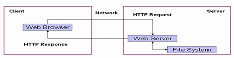

# Web服务器基础

## Web服务器原理

::: tip 转载

- [https://blog.csdn.net/qq_36359022/article/details/81666221](https://blog.csdn.net/qq_36359022/article/details/81666221)
- [https://zhuanlan.zhihu.com/p/149244060?utm_source=wechat_session](https://zhuanlan.zhihu.com/p/149244060?utm_source=wechat_session)

:::

概述：Web服务器概念较为广泛，我们最常说的Web服务器指的是网站服务器，它是建立在Internet之上并且驻留在某种计算机上的程序。Web服务器可以向Web客户端(如浏览器)提供文档或其他服务，只要是遵循HTTP协议而设计的网络应用程序都可以是Web客户端。

Web服务器和HTTP服务器可以说是同一个东西，当然非得细分的话，HTTP服务器是建立在HTTP协议之上的提供文档浏览的服务器，更多的是提供静态的文件。而Web服务器涵盖了HTTP服务器(这一点可以自行百度百科), Web服务器不仅能够存储信息，还能在用户通过Web浏览器提供的信息的基础上运行脚本和程序。
**Web服务器 约等于 HTTP服务器 + 其他服务**

目前所熟知的Web服务器有很多，其最主流的是 Apache, Nginx, IIS。各大Web服务器的实现细节都不同，是为了某种情形而设计开发的。但是它们的基础工作原理是相同的，这也是本次基础篇所讲解的内容。

### **Web服务器工作原理**

上面这幅图，就是一张web服务器的工作原理图。也许有同学很惊讶，这个图和之前说过的HTTP请求图差不多呀！

其实，在软件开发与使用过程中，web服务器就等同于HTTP服务器。虽然不同web服务器之间有细节上的不同，但是基础原理是一样的。下面，我们就根据上面这幅图来一一分析：

(1) 用户做出了一个操作，可以是填写网址敲回车，可以是点击链接，可以是点击按键等，接着浏览器获取了该事件。 
(2) 浏览器与对端服务程序建立TCP连接。 
(3) 浏览器将用户的事件按照HTTP协议格式打包成一个数据包，其实质就是在待发送缓冲区中的一段有着HTTP协议格式的字节流。 
(4) 浏览器确认对端可写，并将该数据包推入Internet，该包经过网络最终递交到对端服务程序。 
(5) 服务端程序拿到该数据包后，同样以HTTP协议格式解包，然后解析客户端的意图。 
(6) 得知客户端意图后，进行分类处理，或是提供某种文件、或是处理数据。 
(7) 将结果装入缓冲区，或是HTML文件、或是一张图片等。 
(8) 按照HTTP协议格式将(7)中的数据打包。 
(9) 服务器确认对端可写，并将该数据包推入Internet，该包经过网络最终递交到客户端。 
(10) 浏览器拿到包后，以HTTP协议格式解包，然后解析数据，假设是HTML文件。 
(11) 浏览器将HTML文件展示在页面。

以上为Web服务器工作基本原理。其实不难发现，这仅仅只是一个简单的网络通信。我们应该深信，作为一个服务器，其根本的工作无非有三个（1.接收数据 2. 发送数据 3. 数据处理）而Web服务器的本质就是：**接收数据 ⇒ HTTP解析 ⇒ 逻辑处理 ⇒ HTTP封包 ⇒ 发送数据** 
**高级的服务器无非就是将这三个部分更加细致的设计了。**

### Web服务器之提供静态文件工作原理

对于web服务器来说，它除了提供一些数据功能之外，另一个主要功能就是提供静态文件了。

上图就是一个以GET请求方式为模板的流程图，通过对图的观察，我们不难发现，整个静态文件处理过程与之前的动态数据处理基本保持一致，变化之处就在于红色&蓝色标注的位置。

(1) 当用户点击一个网页链接或浏览器加载一些资源(css,jpg …)时产生。 
(6) 服务程序解包后，确定其为GET请求，并且是对该服务器上的某一资源的请求。首先服务程序会去确认该路径是否存在，再确定该路径的文件是否可以获取。 
(7-1) 如果请求的路径有误，或者该资源不能被用户获取，则返回错误提示页面。很多服务器的错误页面只有404，更专业的应该是将错误分类并返回对应的错误代码页面。 
(7-2) 如果该路径合法且文件可以被获取，那么服务程序将根据该文件类型进行不同的装载过程，记录其类型作为(8)中HTTP协议中对应的返回类型，并加入响应头。

假设以点击一个页面链接为例，浏览器首先将HTML文件请求过来，再以同样的流程对HTML文件中包含的资源文件路径进行依次请求。

### Web服务器之数据提交工作原理

仅仅只是网页的浏览并不能满足所有人的需求，客户端与服务器应当是有数据交互的。即使单方面的资源请求仍然是网络的主力军。我们应该清楚的知道，数据提交对于用户来说有什么作用。

`(1) 资源上传 (2) 登陆验证 (3) API接口调用 (4) 远程指令等`

数据提交使得用户的操作性有了质的飞跃，它使得HTTP短连接获取静态文件的方式提升到了动态交互的层次上。该性质也催化出各式各样的编程语言、框架。例如PHP，JavaWeb。如果你留意目前主流的那些大型服务器，你会发现再高级再牛逼的东西实际是也是最基础的东西建造的。那么我们还可以顺便学习一下最古老的动态技术CGI。

其他流程基本不变，着重在于红色与蓝色部分。

(1) 用户提交数据，假设用户点击一个按键提交填好的信息。在(3)中将以POST格式写入，并填入提交至服务端的可执行程序的路径。 
(6) 服务端将参数与该CGI绑定，复制进程，用管道传递参数和接收结果。 
(7) 子进程执行CGI，接收(6)父进程传来的参数，运算完成返回结果。 
最后父进程将结果装入静态模板文件，放入缓冲区

### **Web服务器之动态技术**

通过上述内容的基本描述，我们可以得出一个结论，就是web服务器都是以短连接为主的，并且，获取到的数据在到达客户端的时候，一定是静态不变的。这好像与我们所说的动态数据又有一些出入，这是因为所谓的动态实际上指的是这两种情况：

**情况一：**

用户POST提交数据到某个程序，程序根据该数据作为运行参数，得出的结果装入静态的模板页中，返回该静态页。但是从用户的角度来看，同样一个页面，完成了一个操作后页面数据不一样，就会认为这是动态页面。(CGI原理)

**情况二：**

用户GET请求一个JavaScript文件，服务端不做任何处理，直接返回该文件，由负责解析该文件的浏览器负责执行，在本地刷新页面。 用户POST请求提交数据到服务端，服务端根据提交的数据返回静态文件，浏览器接收执行更新。

 

 

## 基本概念

::: tip 转载

- [https://www.cnblogs.com/xdp-gacl/p/3729033.html](https://www.cnblogs.com/xdp-gacl/p/3729033.html)

:::

### WEB开发的相关知识

WEB，在英语中web即表示网页的意思，它用于表示Internet主机上供外界访问的资源。Internet上供外界访问的Web资源分为：

1. **静态web资源（如html 页面）：指web页面中供人们浏览的数据始终是不变。**
2. **动态web资源：指web页面中供人们浏览的数据是由程序产生的，不同时间点访问web页面看到的内容各不相同**。

静态web资源开发技术：Html  
常用动态web资源开发技术：JSP/Servlet、ASP、PHP等 - 在Java中，动态web资源开发技术统称为Javaweb。

### **WEB应用程序**

WEB应用程序指供浏览器访问的程序，通常也简称为web应用。例如有a.html 、b.html…..多个web资源，这多个web资源用于对外提供服务，此时应把这多个web资源放在一个目录中，以组成一个web应用（或web应用程序）

一个web应用由多个静态web资源和动态web资源组成，如:html、css、js文件，Jsp文件、java程序、支持jar包、配置文件等等。 
**Web应用开发好后，若想供外界访问，需要把web应用所在目录交给web服务器管理，这个过程称之为虚似目录的映射**

### WEB发展史

WEB发展的两个阶段：静态、动态

### 静态WEB

*htm、*html，这些是网页的后缀，如果现在在一个服务器上直接读取这些内容，那么意味着是把这些网页的内容通过网络服务器展现给用户。整个静态WEB操作的过程图如下：

在静态WEB程序中，客户端使用WEB浏览器（IE、FireFox等）经过网络(Network)连接到服务器上，使用HTTP协议发起一个请求（Request），告诉服务器我现在需要得到哪个页面，所有的请求交给WEB服务器，之后WEB服务器根据用户的需要，从文件系统（存放了所有静态页面的磁盘）取出内容。之后通过WEB服务器返回给客户端，客户端接收到内容之后经过浏览器渲染解析，得到显示的效果。

**静态WEB中存在以下几个缺点：**

1. Web页面中的内容无法动态更新，所有的用户每时每刻看见的内容和最终效果都是一样的。

   为了可以让静态的WEB的显示更加好看，可以加入了JavaScript以完成一些页面上的显示特效，但是这些特效都是在客户端上借助于浏览器展现给用户的，所以在服务器上本身并没有任何的变化。

   实现静态WEB客户端动态效果的手段：

   - JavaScript
   - VBScript

   在实际的开发中JavaScript使用得最多。

2. 静态WEB无法连接数据库，无法实现和用户的交互。

   使用数据库保存数据是现在大多数系统的选择，因为数据库中可以方便地管理数据，增删改查操作可以使用标准的SQL语句完成。

### 动态WEB

所谓的动态不是指页面会动，主要的特性的是：“WEB的页面展示效果因时因人而变”，而且动态WEB具有交互性，WEB的页面的内容可以动态更新。整个动态WEB操作的过程图如下：

动态WEB中，程序依然使用客户端和服务端，客户端依然使用浏览器（IE、FireFox等），通过网络(Network)连接到服务器上，使用HTTP协议发起请求（Request），现在的所有请求都先经过一个WEB Server Plugin（服务器插件）来处理，此插件用于区分是请求的是静态资源(*.htm或者是*.htm)还是动态资源。 如果WEB Server Plugin发现客户端请求的是静态资源(*.htm或者是*.htm)，则将请求直接转交给WEB服务器，之后WEB服务器从文件系统中取出内容，发送回客户端浏览器进行解析执行。 如果WEB Server Plugin发现客户端请求的是动态资源（*.jsp、*.asp/*.aspx、*.php），则先将请求转交给WEB Container(WEB容器)，在WEB Container中连接数据库，从数据库中取出数据等一系列操作后动态拼凑页面的展示内容，拼凑页面的展示内容后，把所有的展示内容交给WEB服务器，之后通过WEB服务器将内容发送回客户端浏览器进行解析执行。

### 动态WEB应用的实现手段

动态WEB现在的实现手段非常多，较为常见的有以下几种：

- Microsoft ASP、ASP.NET
- PHP
- JAVA Servlet/JSP

### WEB服务器

WEB服务器简介:

1. Web服务器是指驻留于因特网上某种类型计算机的程序，是可以向发出请求的浏览器提供文档的**程序**。当Web浏览器（客户端）连到服务器上并请求文件时，服务器将处理该请求并将文件反馈到该浏览器上，附带的信息会告诉浏览器如何查看该文件（即文件类型）。
2. 服务器是一种被动程序：只有当Internet上运行在其他计算机中的浏览器发出请求时，服务器才会响应。

## 常用Web Server介绍

::: tip 转载

- [https://www.bilibili.com/video/BV1ra4y1t7rs](https://www.bilibili.com/video/BV1ra4y1t7rs)
- [https://blog.csdn.net/qq_41822345/article/details/106788715](https://blog.csdn.net/qq_41822345/article/details/106788715)

:::

### 基本概念

**服务器**：服务器就是一台性能、稳定性、扩展性比普通个人PC机要更强的一台机器。它也需要搭载操作系统，比如Linux、Windows Server等操作系统。

**服务器软件**：通常来说，只要是运行在服务器操作系统上，绑定了服务器特定的IP地址，并且在某一个端口监听用户的请求，提供服务的软件。

**静态服务**：不同用户，不同时间，只要访问同一个静态服务，返回的是一个静态资源，即看到的页面和内容是一样的。

**动态服务**：不同的用户的身份信息，不同权限，访问同一个动态资源，返回的是一个动态资源，即看到的页面和内容是不一样的。（需要应用服务器的承载部署）

### Web服务器

应用最广泛的服务器，提供Web化服务：网站页面服务、邮件服务、网络下载服务等。Web服务器就是一个响应用户需要，来提供相应服务的服务器。（所以从广义上来说，几乎所有的服务器软件都可以称之为Web服务器）。

### HTTP服务器

Web服务器应用层通讯协议主要用的是HTTP协议，所以基本上可以将HTTP服务器理解为Web服务器。（Web服务器与HTTP服务器区别不大，可以理解为**Web服务器即HTTP服务器**）。HTTP服务器只是把服务器上的资源通过HTTP协议的形式传输给客户端，它侧重于对静态资源的支持。也称作静态服务器。

- **①Nginx**：将服务端的静态资源或内容通过HTTP协议传输给客户端，除此之外，它还可用作反向代理、负载均衡等。最重要的应用是其可以与动态服务器（比如Tomcat）配合，Nginx在收到用户请求后转发给Tomcat应用服务器，以提供灵活稳定的Web服务。Nginx性能好、稳定性高、抗冲击、内存消耗低，所以常用来接收用户请求。它也可以在二次开发下做成提供动态服务的应用服务器OpenResty。
- **②Tengine**：是由淘宝发起的Web服务器，它是在Nginx的基础做了加强与封装，以针对大流量访问场景添加了很多高级功能和特性，性能强，稳定性高。
- **③Apache HTTP Server**：虽然在并发性、负载性、资源消耗等性能方面比不上Nginx的一个HTTP服务器。
- **④IIS**：是微软阵营的web服务器，只能运行于Windows系统下，不开源。是一个具有应用服务器能力的HTTP服务器。

### 应用服务器(容器)

一个特定应用的承载容器，一般来说，它需要有运行时环境的支持（比如Tomcat应用服务器），它侧重于对动态资源的支持。也称作动态服务器。

- **⑤Tomcat**：大名鼎鼎的应用服务器，SpringBoot内嵌的默认应用服务器。常用于与Nginx配合使用。
- **⑥Jetty**：也是SpringBoot支持的应用服务器之一。它是一个开源的HTTP服务器+应用容器，既可以提供静态服务，也可以提供动态服务，且支持HTTP2、WebSocket、JMX等。对比Tomcat是一个更轻量级、配置更简单的应用服务器。
- **⑦Undertow**：也是SpringBoot支持的应用服务器之一。是由RedHat公司开源的一款基于Java语言编写的应用服务器，是Widfly应用服务器默认的Web容器。

以上三款都符合Servlet标准规范。在并发量不高的情况下，这三款服务器的性能区别不大，并发量稍微增高的情况下，Undertow要优于Tomcat与Jetty。

还有其他几款重量级的应用服务器，它们基本以商用为主，它们的功能更加综合，体量更大，平台级别的软件，了解即可。

- **⑧JBoss**：不仅仅是Servlet应用容器，也是EJB应用容器，提供了一整套JavaEE框架部署的解决方案，在EJB时代发挥着巨大作用的动态服务器软件。
  - **Widfly**：由JBoss AS版本8更名而来，是RedHat公司开发维护的一款企业级应用服务器。它使用Undertow作为默认Web容器。
- **⑨WebLogic**：由Oracle研发的用于部署企业级Java应用的应用服务器，是一个全能型重量级的应用服务器软件，支持JavaEE几乎所以的应用规范。
- **⑩WebSphere**：是由IBM公司研发的JavaEE应用服务器软件，功能非常强大，且配套IBM开发工具，它支持更多的JavaEE，可靠性高，体量大，功能全，使用成本比较高。