# ES 原理-分词器 & 搜索相关性

::: tip 转载

- [https://www.yuque.com/xiongsanxiansheng/qfvqxo/fi2db2](https://www.yuque.com/xiongsanxiansheng/qfvqxo/fi2db2)
- [https://www.yuque.com/xiongsanxiansheng/qfvqxo/kq2d3x](https://www.yuque.com/xiongsanxiansheng/qfvqxo/kq2d3x)

:::

## 分词器

### 1. 分词和分词器

- Analysis 分词：把全文本转换成一系列单词
- Analyzer 是通过 Analysis 来实现的
  - 可使用 ElasticSearch 内置的分析器，或按需定制化分析器
- 除了在数据写入时转换词条，匹配 Query 语句时也需要用相同的分析器对查询语句进行分析

### 2. 分词器的组成

| **组成**          | **功能**                                                     |
| ----------------- | ------------------------------------------------------------ |
| Character Filters | 针对原始文本进行处理，比如去除 html 标记符                   |
| Tokenizer         | 将原始文本按照一定规则切分为单词                             |
| Token Filters     | 针对切分的单词进行加工，比如转为小写、删除 stopwords、增加同义词 |

分词器组成的调用是有顺序的

<div style="display:flex;">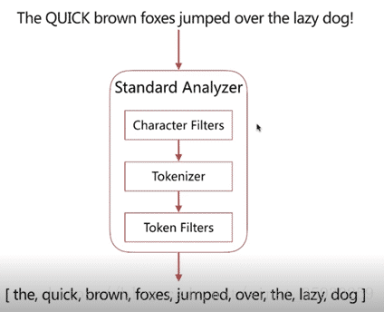</div>

### 3. Analyze API

es 提供了一个测试分词的 api 接口，方便验证分词效果，endpoint 是 _analyze；这个 api 具有以下特点：

- 可以直接指定 analyzer 进行测试；
- 可以直接指定索引中的字段进行测试；
- 可以自定义分词器进行测试；

#### 3.1 直接指定analyzer进行测试

```json
POST _analyze
{
    "analyzer": "standard",
    "text": "hello world"
}
```

analyzer 表示指定的分词器，这里使用 es 自带的分词器 standard，text 用来指定待分词的文本。

<div style="display:flex;">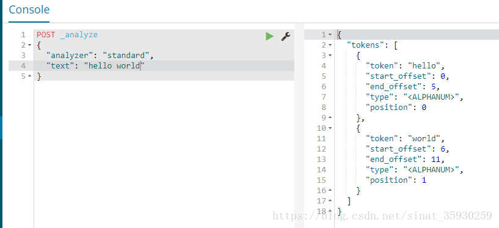</div>

从结果中可以看到，分词器将文本分成了 hello 和 world 两个单词。

#### 3.2 指定索引中的字段进行测试

应用场景：当创建好索引后发现某一字段的查询和预期不一样，就可以对这个字段进行分词测试。

```json
POST text_index/_analyze
{
  "field": "username",
  "text": "hello world"
}
```

<div style="display:flex;">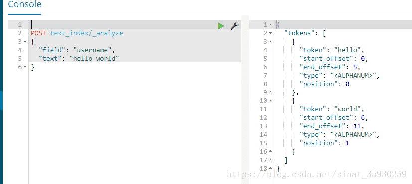</div>

当没有指定分词器的时候默认使用 standard。

#### 3.3 自定义分词器进行测试

```json
POST _analyze
{
  "tokenizer": "standard",
  "filter": [ "lowercase" ],
  "text": "Hello World"
}
```

根据分词的流程，首先通过 tokenizer 指定的分词方法 standard 进行分词，然后会经过 filter 将大写转化为小写。

<div style="display:flex;">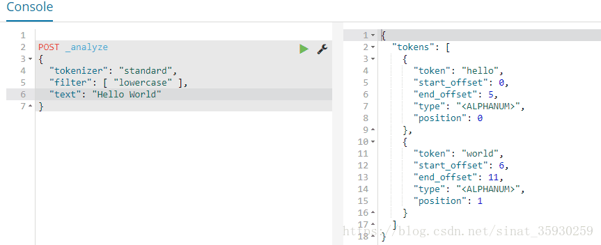</div>

### 4. ES 的内置分词器

具体使用可以参考 **[ES Index-Text Analysis](/BigData/ELK/ESIndex-TextAnalysis.html)**

#### 4.1 Standard Analyzer

默认分词器，具有按词切分、支持多语言、小写处理的特点。 

<div style="display:flex;">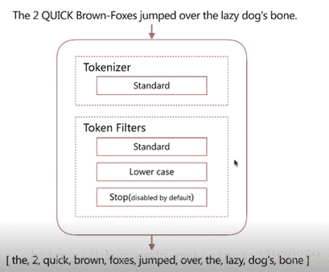</div>

可以看到，`standerd 将 stop word 默认关闭了`，也就是这些词还是会在分词后保留。<br>`stop word 就是例如 and、the、or 这种词`，可以通过配置将它打开。其实搜索引擎应该将这些 stop word 过滤掉，这样可以减少压力的同时保证搜索的准确性。

#### 4.2 Simple Analyzer

具有特性是：按照非字母切分（数字，符号被过滤掉）、小写处理。

<div style="display:flex;">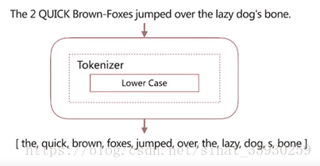</div>

可以看到它将非字母的字符切掉了，例如横线、标点、数字都被干掉了。

#### 4.3 Whitespace Analyzer

具有的特性是：按照空格切分，不转小写。

<div style="display:flex;">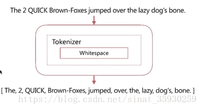</div>

可以看到它按照空格切分，并且没有进行小写转化。

#### 4.4 Stop Analyzer

具有的特性是：将 stop word 停用词过滤掉，小写处理。

<div style="display:flex;"></div>

#### 4.5 Keyword Analyzer

具有的特性是：不分词，直接将输入作为一个单词输出；

<div style="display:flex;">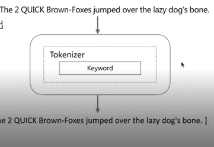</div>

#### 4.6 Pattern Analyzer

具有的特性是：通过正则表达式自定义分隔符，默认是 \W+，即非字词的符号作为分隔符，小写转化 。

<div style="display:flex;">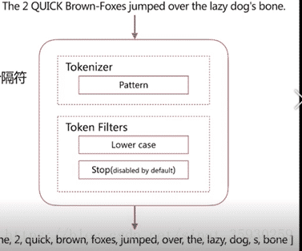</div>

#### 4.7 Language Analyzer

具有的特性是：提供了 30+ 常见语言的分词器。

### 5. 中文分词器

中文分词是指讲一个汉字序列切分成一个一个独立的词。在英文中，单词间以空格作为自然分界符，汉语中词没有一个形式上的分界符。而且根据上下文的不同，分析结果迥异。

#### 5.1 常见中文分词器

- IK
  - 可以实现中英文单词的分词，支持ik_smart、ik_maxword等模式；可以自定义词库，支持热更新分词词典。
- jieba
  - python中最流行的分词系统，支持分词和词性标注；支持繁体分词、自定义词典、并行分词。

基于自然语言的分词系统： 

这种分词系统可以通过创建一个模型，然后该模型经过训练可以通过根据上下文进行合理的分词，常见的有：

- Hanlp
  - 有一系列模型预算法组成的 Java 工具包，目标是普及自然语言处理在生产环境中的应用。
- THULAC
  - 清华大学推出，具有中文分词和词性标注的功能。

<br>

<br>

## **搜索相关性**

用户在使用搜索功能时，最关心的就是搜索引擎能否根据搜索关键字，找出最匹配的搜索结果；而搜索引擎可以根据调整搜索的相关性，来控制返回不同的搜索结果；

搜索结果的相关性，例如：

- 是否可以找到所有相关的内容；
- 有多少不想管的内容被返回了；
- 文档的打分是否合理；
- 结合业务需求，平衡结果排名；
- Web 搜索，不仅仅要考虑内容的相关性，更重要的是内容的可靠度，综合相关性更高的展示在前面；
- 电商搜索，不仅仅为用户提供搜索服务，搜索还扮演了销售的角色，向客户推荐新商品，去库存等；

### 1. 相关度指标

- Precision 查准率
  - 尽可能返回较少的无关文档；
- Recall 查全率
  - 尽量返回较多的相关文档；
- Ranking 排名
  - 是否能够按照相关度进行排序？

### 2. 相关度算分

- 搜索的相关性算分，描述了一个文档与查询语句匹配的程度。ES 会对每个匹配查询条件的结果进行算分 _score；
- 打分的本质就是排序，需要把最符合用户需求的文档排在前面。ES 5 之前，默认的相关性算分采用 TF-IDF，ES 6.0 起采用 BM 25；

<div style="display:flex;">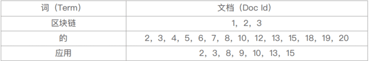</div>

#### 2.1 词频 TF

- Term Frequency：检索词在一篇文档中出现的频率
  - 词频 = 检索词出现的次数 / 文档的总字数；
- 度量一条查询和结果文档相关性的简单方法：简单将搜索中的每一个词的 TF 进行相加
  - TF(区块链) + TF(的) + TF(应用)；
- Stop Word
  - “的”在文档中出现了很多次，但是对贡献相关度几乎没有用处，不应该考虑它们的 TF；
  - 为了减少它在相关度上的算分比重，引入了 IDF，改为加权求和，一个词在所属有的文档记录中出现的太频繁，就会减轻它的重要程度；

#### 2.2 逆文档频率 IDF

- DF，Document Frequency：检索词在所有文档中出现的频率；
  - “区块链”在相对比较少的文档中出现
  - “应用”在相对比较多的文档中出现
  - “Stop Word”在大量的文档中出现
- IDF，Inverse Document Frequency：简单说 = log( 全部文档 / 检索词出现过的文档总数 )；
- TF-IDF 本质就是将 TF 求和变成了加权求和
  - TF(区块链)*IDF(区块链) + TF(的)*IDF(的) + TF(应用)*IDF(应用)；

<div style="display:flex;">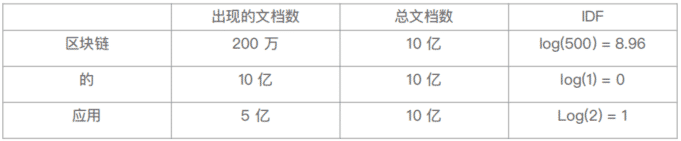</div>

#### 2.3 Lucene 中的 TF-IDF 评分公式

现代搜索引擎，对 TF-IDF 进行了大量细微的优化。ES 5 之前的版本就是采用的 TF-IDF。

<div style="display:flex;">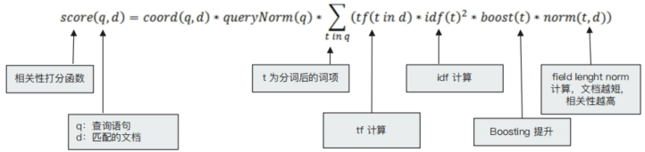</div>

<br>

#### 2.4 BM 25 评分算法

<br>

<div style="display:flex;">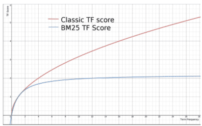</div>

<br>

<div style="display:flex;">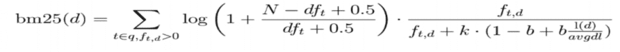</div>

<br>

- 从 ES 6.0 起，默认算法改为了 BM 25；
- 和经典的 TF-IDF 相比，当 TF 无限增加时，BM 25 算分会趋于一个数值；
- 在 Elasticsearch 中定制相关度算法的参数，定制 Similarity：
  - K 默认值是 1.2，数值越小饱和度越高，b 默认值是 0.75（取值范围 0-1），0 代表禁止 Normalization；

```json
PUT /my_index
{
  "settings": {
    "similarity": {
      "custom_similarity": {
        "type": "BM25",
        "b": 0,
        "k1": 2
      }
    }
  },
  "mappings": {
    "doc": {
      "properties": {
        "custom_text": {
          "type": "text",
          "similarity": "custom_similarity"
        },
        "default_text": {
          "type": "text"
        }
      }
    }
  }
}
```

#### 2.6 Boosting Relevance

- Boosting 是控制相关度的一种手段
  - ES 中可以对索引，字段，或查询子条件，分别设置 Boosting 参数
- 参数 boosting 的含义
  - 当 boost > 1 时，打分的相关度相对性提升；
  - 当 0 < boost <1 时，打分的权重相对性降低；
  - 当 boost < 0 时，贡献负分；

``` json
POST testscore/_search
{
	"query": {
  	"boosting": {
    	"positive": {
      	"term": {
        	"content": "elasticsearch"
        }
      },
      "negative": {
      	"term": {
        	"content": "like"
        }
      },
      "negative_boost": 0.2
    }
  }
}
```

