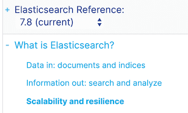
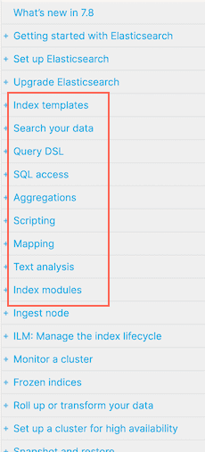
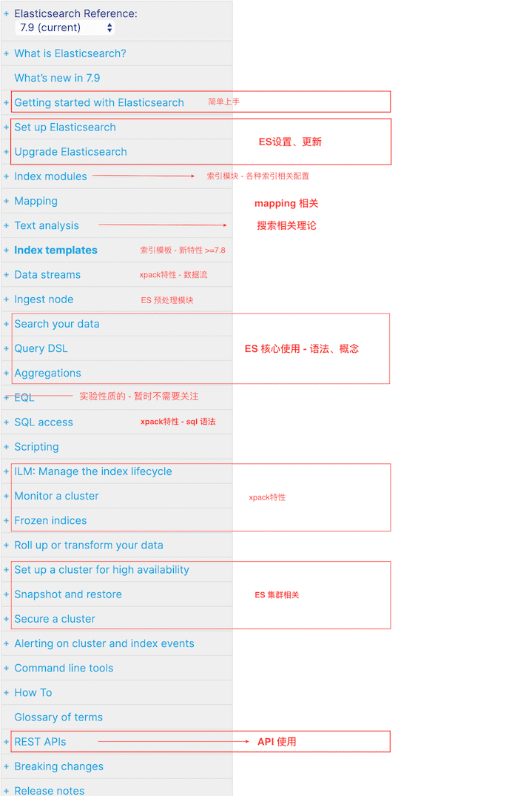
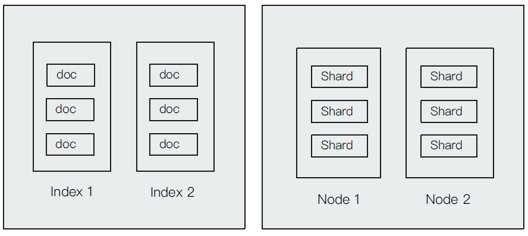
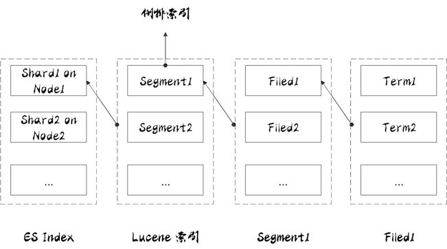
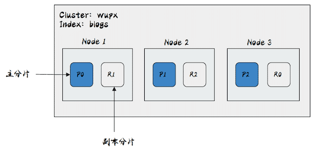
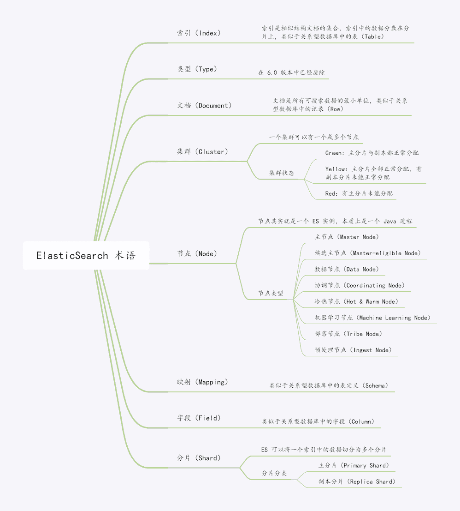
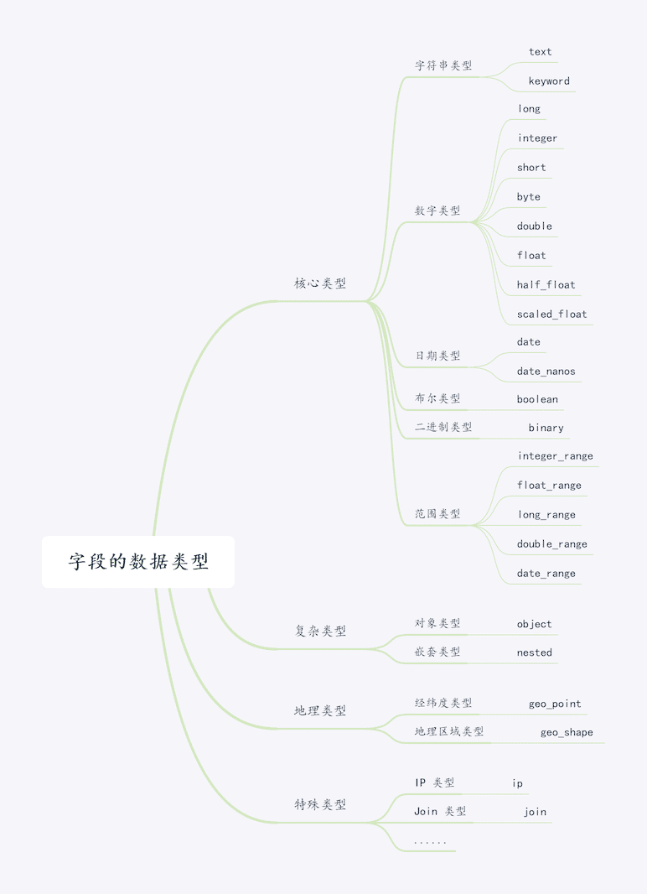
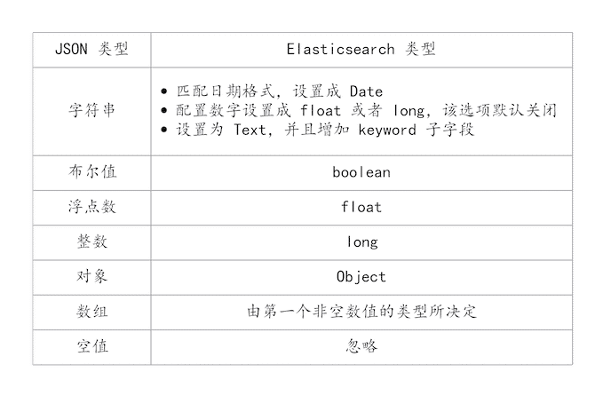

# Elasticsearch 基本概念

::: tip 官网参考部分

- [Elasticsearch: 权威指南](https://www.elastic.co/guide/cn/elasticsearch/guide/current/index.html) 
- [Elasticsearch Reference - version 6.7](https://www.elastic.co/guide/en/elasticsearch/reference/6.7/query-dsl-match-query.html)
- [Elasticsearch Reference - (current)](https://www.elastic.co/guide/en/elasticsearch/reference/current/index.html)

:::

***里面的三个链接都是官网的文档地址，为什么不直接看最新的文档？***

随着版本的演进，ES文档的目录结构也在发生变化。从老版本一直到6.7版本，基本结构差不多；而之后的版本在有些概念性的章节上，发生了调整，新文档在结构上更加倾向于初次使用的人能够更容易的上手体验。“Elasticsearch: 权威指南” 是官方唯一的中文文档，基于ES 2.x，里面包含了很多ES核心原理细节的讲解。所以从全面学习的角度，需要结合新老版本。

<br>


## ES 是什么

关于ES的介绍，可以参考另外一篇文章进行扩展阅读：[(转)ES 既是搜索引擎又是数据库？真的有那么全能吗？](https://heyan.site:8003/blogs/2020/0704-whatisES.html)

这里我们再看下最新的官方文档中关于这部分的内容

<div style="display:flex;"></div>

官方有意想将ES简化为一个这样的引擎：它能够存储数据 (documents & indices)，然后对数据进行 (search & analyze) ；并且这个引擎具有高扩展性和弹性（分布式）。【权威指南的一句话概括就是：Elasticsearch 是一个分布式、可扩展、实时的搜索与数据分析引擎。】

后续的文档似乎也主要是围绕这个定义，细分具体的部分：如何去存储数据，如何search数据，如何对数据进行分析...

<div style="display:flex;"></div>

<br>

## ES 官网文档结构

我们来再看下整个文档结构，将重点关注下面几点：

- ES安装、设置
- Mapping
- 文档搜索相关 （文档搜索理论）
- ES核心使用、语法
- API调用

<div style="display:flex;"></div>

<br>

## ES 基本概念

基本上我们搜ES教程，通常文章会从这些基本概念讲起。在官方文档中，这个"Basic Concepts"出现在老版本（例如我上面的6.7），但在6.8之后的新版里面并不包含这些。【ES官网似乎更希望ES能被使用者开箱即用，而不是先去关心太多的理论方面的知识...】不过作为使用者，还是必须要知道这些概念的。

- Near Realtime (NRT)
- Cluster
- Node
- Index
- Type - (*Deprecated in 6.0.0*)
- Document
- Shards & Replicas

这里主要有两方面：一个是集群相关的（Cluster、Node、Shards&Replicas）；一个是数据结构相关（Index、Document）。集群相关的后面会详细讲到，这里先说说数据结构相关的，网上很多文章都讲到，可将这个对应到传统关系型数据库去帮助我们理解，例如这里将Index理解为传统的表，document理解为每行数据即可（在之前Type存在的时候，大家习惯把index比喻成数据库，Type当成表。当鉴于ES已经废弃type类型，所以就直接把index类比成表就行了。。）

另外，还有：

- Field -（文档中的属性，类比关系型数据库的column）
- Mapping - （映射配置：Mapping is the process of defining how a document, and the fields it contains, are stored and indexed）
- etc ...


下面转载一篇文章详细点介绍ES的基本术语、概念

::: tip 转载

- [一篇文章带你搞定 ElasticSearch 术语]([https://www.tianheyu.top/archives/elasticsearch-term#elasticsearch-%E6%9C%AF%E8%AF%AD](https://www.tianheyu.top/archives/elasticsearch-term#elasticsearch-术语))

:::

这篇文章主要介绍 ElasticSearch 的基本概念，学习文档、索引、集群、节点、分片等概念，同时会将 ElasticSearch 和关系型数据库做简单的类比，还会简单介绍 REST API 的使用用法。

<div style="display:flex;"></div>

索引和文档是偏向于逻辑上的概念，节点和分片更偏向于物理上的概念。

首先来说下什么是文档：

### 文档（Document）

ElasticSearch（简称 ES） 是面向文档的，**文档是所有可搜索数据的最小单位**。

给大家举几个例子，让大家更形象地理解什么是文档：

- 日志文件中日志项
- 一本电影的具体信息、一张唱片的详细信息
- MP3 播放器里的一首歌、一篇 PDF 文档中的具体内容
- 一条客户数据、一条商品分类数据、一条订单数据

大家可以把文档理解为关系型数据库中的一条记录。

**在 ES 中文档会被序列化成 JSON 格式**，保存在 ES 中，JSON 对象由字段组成，其中每个字段都有对应的字段类型（字符串/数组/布尔/日期/二进制/范围类型）。在 ES 中，每个文档都有一个 Unique ID，可以**自己指定 ID** 或者通过 **ES 自动生成**。

每一个文档都有对应的元数据，用于标注文档的相关信息，我们来了解下元数据都有什么内容：

```json
{
    "_index" : "movies",
    "_type" : "_doc",
    "_id" : "2035",
    "_score" : 1.0,
    "_source" : {
        "title" : "Blackbeard's Ghost",
        "genre" : [
        "Children",
        "Comedy"
        ],
        "id" : "2035",
        "@version" : "1",
        "year" : 1968
    }
}
```

其中，`_index` 代表文档所属的索引名；`_type` 表示文档所属的类型名；`_id` 为文档唯一 id；`_source` 为文档的原始 JSON 数据，**当搜索文档的时候默认返回的就是 `_source` 字段**；`@version`为文档的版本信息，可以很好地来解决版本冲突的问题；`_score` 为相关性打分，是这个文档在这次查询中的算分。

### 索引（Index）

**索引简单来说就是相似结构文档的集合**，比如可以有一个客户索引，商品分类索引，订单索引，索引有一个名称，**一个索引可以包含很多文档**，一个索引就代表了一类类似的或者相同的文档，比如说建立一个商品索引，里面可能就存放了所有的商品数据，也就是所有的商品文档。每一个索引都是自己的 `Mapping` 定义文件，用来去描述去包含文档字段的类型，分片（Shard）体现的是物理空间的概念，**索引中的数据分散在分片上**。

在一个的索引当中，可以去为它设置 `Mapping` 和 `Setting`，`Mapping` 定义的是索引当中所有**文档字段的类型结构**，`Setting` 主要是指定要用多少的分片以及**数据是怎么样进行分布**的。

索引在不同的上下文会有不同的含义，比如，在 ES 当中，**索引是一类文档的集合**，这里就是名词；同时**保存一个文档到 ES 的过程也叫索引（indexing）**，抛开 ES，提到索引，还有可能是 **B 树索引或者是倒排索引**，倒排索引是 ES 中一个重要的数据结构，会在以后的文章进行讲解。


### 类型（Type）

> 在 7.0 之前，每一个索引是可以设置多个 Types 的，每个 Type 会拥有相同结构的文档，但是在 6.0 开始，Type 已经被废除，在 7.0 开始，一个索引只能创建一个 Type，也就是 `_doc`。
>
> 每个索引里都可以有一个或多个 Type，Type 是索引中的一个逻辑数据分类，一个 Type 下的文档，都有相同的字段（Field），比如博客系统，有一个索引，可以定义用户数据 Type，博客数据 Type，评论数据 Type 等。


### 集群（Cluster）

ES 集群其实是一个分布式系统，要满足高可用性，高可用就是当集群中有节点服务停止响应的时候，整个服务还能正常工作，也就是**服务可用性**；或者说整个集群中有部分节点丢失的情况下，不会有数据丢失，即**数据可用性**。

当用户的请求量越来越高，数据的增长越来越多的时候，系统需要把数据分散到其他节点上，最后来实现水平扩展。当集群中有节点出现问题的时候，整个集群的服务也不会受到影响。

ES 的分布架构当中，**不同的集群是通过不同的名字来区分的**，默认的名字为 `elasticsearch`，可以在配置文件中进行修改，或者在命令行中使用 `-E cluster.name=wupx` 进行设定，一个集群中可以有一个或者多个节点。

一个 ES 集群有三种颜色来表示健康程度：

- Green：主分片与副本都正常分配
- Yellow：主分片全部正常分配，有副本分片未能正常分配
- Red：有主分片未能分配（例如，当服务器的磁盘容量超过 85% 时，去创建了一个新的索引）


### 节点（Node）

节点其实就是一个 ES 实例，**本质上是一个 Java 进程**，一台机器上可以运行多个 ES 进程，但是生产环境一般**建议一台机器上只运行一个 ES 实例**。

每一个节点都有自己的名字，节点名称很重要（在执行运维管理操作的时候），可以通过配置文件进行配置，或者启动的时候 `-E node.name=node1` 指定。每一个节点在启动之后，会分配一个 UID，保存在 data 目录下。

默认节点会去加入一个名称为 `elasticsearch` 的集群，如果直接启动很多节点，那么它们会自动组成一个 `elasticsearch` 集群，当然一个节点也可以组成一个 `elasticsearch` 集群。

#### 候选主节点（Master-eligible Node） & 主节点（Master Node）

每一个节点启动后，默认就是一个 Master-eligible 节点，可以通过在配置文件中设置 `node.master: false` 禁止，Master-eligible 节点可以参加选主流程，成为 Master 节点。当第一个节点启动时候，它会将自己选举成 Master 节点。

**每个节点上都保存了集群的状态，只有 Master 节点才能修改集群的状态信息**，如果是任意节点都能修改信息就会导致数据的不一致性。集群状态（Cluster State），维护一个集群中必要的信息，主要包括如下信息：

- 所有的节点信息
- 所有的索引和其相关的 Mapping 与 Setting 信息
- 分片的路由信息

#### 数据节点（Data Node） & 协调节点（Coordinating Node）

顾名思义，可以保存数据的节点叫作 Data Node，负责保存分片上存储的所有数据，当集群无法保存现有数据的时候，可以通过增加数据节点来解决存储上的问题，在数据扩展上有至关重要的作用。

Coordinating Node 负责接收 Client 的请求，将请求分发到合适的节点，最终把结果汇集到一起返回给客户端，每个节点默认都起到了 Coordinating Node 的职责。

#### 其他节点类型

- 冷热节点（Hot & Warm Node） ：热节点（Hot Node）就是配置高的节点，可以有更好的磁盘吞吐量和更好的 CPU，那冷节点（Warm Node）存储一些比较久的节点，这些节点的机器配置会比较低。不同硬件配置的 Data Node，用来实现 Hot & Warm 架构，降低集群部署的成本。
- 机器学习节点（Machine Learning Node）：负责跑机器学习的工作，用来做异常检测。
- 部落节点（Tribe Node）：连接到不同的 ES 集群，并且支持将这些集群当成一个单独的集群处理。
- 预处理节点（Ingest Node）：预处理操作允许在索引文档之前，即写入数据之前，通过事先定义好的一系列的 processors（处理器）和 pipeline（管道），对数据进行某种转换、富化。

每个节点在启动的时候会通过读取 `elasticsearch.yml` 配置文件决定自己承担什么样的角色，那么让我们看下配置节点类型吧！


#### 配置节点类型

开发环境中一个节点可以承担多种角色。生产环境中，应该设置单一的角色的节点（dedicated node）。

| 节点类型          | 配置参数    | 默认值                                                       |
| :---------------- | :---------- | :----------------------------------------------------------- |
| master-eligible   | node.master | true                                                         |
| data              | node.data   | true                                                         |
| ingest            | node.ingest | true                                                         |
| coordinating only | 无          | 每个节点默认都是 coordinating 节点，设置其他类型全部为 false |
| machine learning  | node.ml     | true（需 enable x-pack）                                     |


### 分片（Shard）

由于单台机器无法存储大量数据，ES 可以将一个索引中的数据切分为多个分片（Shard），分布在多台服务器上存储。有了分片就可以横向扩展，存储更多数据，让搜索和分析等操作分布到多台服务器上去执行，提升吞吐量和性能。

<div style="display:flex;"></div>

索引与分片的关系如上图所示，**一个 ES 索引包含很多分片，一个分片是一个 Lucene 的索引**，它本身就是一个完整的搜索引擎，可以独立执行建立索引和搜索任务。**Lucene 索引又由很多分段组成，每个分段都是一个倒排索引。** ES 每次 refresh 都会生成一个新的分段，其中包含若干文档的数据。在每个分段内部，文档的不同字段被单独建立索引。**每个字段的值由若干词（Term）组成，Term 是原文本内容经过分词器处理和语言处理后的最终结果**（例如，去除标点符号和转换为词根）。

分片分为两类，一类为**主分片（Primary Shard）**，另一类为**副本分片（Replica Shard）**。

主分片主要用以**解决水平扩展**的问题，通过主分片，就可以将数据分布到集群上的所有节点上，一个主分片就是一个运行的 Lucene 实例，当我们在创建 ES 索引的时候，可以指定分片数，但是**主分片数在索引创建时指定，后续不允许修改，除非使用 Reindex 进行修改**。

副本分片用以**解决数据高可用**的问题，也就是说集群中有节点出现硬件故障的时候，通过副本的方式，也可以保证数据不会产生真正的丢失，因为副本分片是主分片的拷贝，在索引中副本分片数可以动态调整，通过增加副本数，可以在一定程度上提高服务查询的性能（读取的吞吐）。

下面通过一个例子来理解下主分片和副本分片是怎么样把数据分散在集群不同的节点上的：

```json
PUT /blogs
{
    "settings" :{
        "number_of_shards" : 3,
        "number_of_repicas" : 1
    }
}
```

上面是 blogs 索引的定义，其中 `settings` 中的 `number_of_shards` 表示主分片数为 3，`number_of_repicas` 表示副本只有 1 份。

<div style="display:flex;"></div>


上图为 wupx 的一个集群，里面总共有 3 个节点，通过上面对索引 blogs 的配置，当有数据进来的时候，ES 内部就会把主分片分散在三个节点上，同时把每个分片的副本分散到其他节点上，当集群中有节点出现故障，ES 内部就会产生故障转移的机制，故障转移机制会在以后的文章进行讲解，在上图中可以看到三个主分片被分散到三个节点上，若在这个时候为集群增加一个节点，是否可以增加系统的可用性呢？带着这个问题，我们先看下分片的设定：

#### 分片的设定

分片的设定在生产环境中是十分重要的，很多时候需要提前做好容量规划，因为主分片在索引创建的时候需要预先设定的，并且在事后无法修改，**在前面的例子中，一个索引被分成了 3 个主分片，这个集群即便增加再多节点，索引也只能分散在 3 个节点上。**

分片设置过大的时候，也会带来副作用，一方面来说会**影响搜索结果的打分**，影响统计结果的准确性，另外，单个节点上过多的分片，也会**导致资源浪费，同时也会影响性能**。从 7.0 版本开始，ES 的默认主分片数设置从 5 改为了 1，从这个方面也可以解决 over-sharding 的问题。

在了解完 ES 的术语后，来和我们熟悉的关系型数据库做个类比，以便于我们理解。

### RDBMS & ES

我相信大家对**关系型数据库**（简称 **RDBMS**）应该比较了解，因此接下来拿关系型数据库和 ES 做一个类比，让大家更容易理解：

| RDBMS  | ElasticSearch |
| :----- | :------------ |
| Table  | Index（Type） |
| Row    | Document      |
| Column | Filed         |
| Schema | Mapping       |
| SQL    | DSL           |

从表中，不难看出，关系型数据库和 ES 有如下对应关系：

- 关系型数据库中的**表（Table）\**对于 ES 中的\**索引（Index）**
- 关系型数据库中的每条**记录（Row）\**对应 ES 中的\**文档（Document）**
- 关系型数据库中的**字段（Column）\**对应 ES 中的\**字段（Filed）**
- 关系型数据库中的**表定义（Schema）\**对应着 ES 中的\**映射（Mapping）**
- 关系型数据库中可以通过 SQL 进行查询等操作，在 ES 中也提供了 DSL 进行查询等操作

当进行全文检索或者对搜索结果进行算分的时候，ES 比较合适，但如果对数据事务性要求比较高的时候，会把关系型数据库和 ES 结合使用。

为了方便其他语言的整合，ES 提供了 **REST API** 来给其他程序进行调用，当我们的程序要和 ES 进行集成的时候，只需要发出 HTTP 的请求就会得到相应的结果，接下来对基本的 API 进行介绍

### REST API

打开 Kibana 的开发工具（Dev Tools），movies 为索引，现在输入 `GET movies` 点击执行，就可以查看电影索引相关的信息，主要包含索引的 Mapping 和 Setting。

输入 `GET movies/_count` 点击执行，就可以看到**索引的文档总数**，运行结果

``` json
{
  "count" : 9743,
  "_shards" : {
    "total" : 1,
    "successful" : 1,
    "skipped" : 0,
    "failed" : 0
  }
}
```

输入如下代码

``` json
POST movies/_search
{

}
```

点击执行，就可以查看前 10 条文档，了解文档格式。

还可以对索引的名字进行通配符查询，使用 `GET /_cat/indices/mov*?v&s=index` ，可以查看匹配的索引。<br>使用 `GET /_cat/indices?v&s=docs.count:desc`，可以按照文档个数排序。<br>使用 `GET /_cat/indices?v&health=green`，可以查看状态为 green 的索引。<br>使用 `GET /_cat/indices?v&h=i,tm&s=tm:desc`，可以查看每个索引占用的内存。<br>ES 还提供了 API 去查看集群的健康状况，使用 `GET _cluster/health` 可以集群的健康状况，返回结果如下：

``` json
{
  "cluster_name" : "wupx",
  "status" : "green",
  "timed_out" : false,
  "number_of_nodes" : 2,
  "number_of_data_nodes" : 2,
  "active_primary_shards" : 10,
  "active_shards" : 10,
  "relocating_shards" : 0,
  "initializing_shards" : 0,
  "unassigned_shards" : 0,
  "delayed_unassigned_shards" : 0,
  "number_of_pending_tasks" : 0,
  "number_of_in_flight_fetch" : 0,
  "task_max_waiting_in_queue_millis" : 0,
  "active_shards_percent_as_number" : 100.0
}
```

可以看到集群名字叫 wupx，集群状态是 green，一共有 2 个节点，这两个节点都是承担 Data Node 角色，另外还有 10 个主分片。

REST API 就介绍到这里，其余的大家可以自己去摸索下。

> 细心的小伙伴会发现 Kibana 怎么变成中文界面了，其实 Kibana 在 7.0 版本之后，官方自带汉化资源文件（位于 Kibana 目录下的 `node_modules/x-pack/plugins/translations/translations/`），大家可以在 config 目录下修改 `kibana.yml`文件，在文件中加上配置项 `i18n.locale: "zh-CN"`，然后重新启动 Kibana 就汉化完成了。

### 总结

<br>

<div style="display:flex;"></div>

<br>

## ES Mapping

::: tip 转载

- [一文搞懂 Elasticsearch 之 Mapping](https://www.cnblogs.com/wupeixuan/p/12514843.html)

:::

这篇文章主要介绍 Mapping、Dynamic Mapping 以及 ElasticSearch 是如何自动判断字段的类型，同时介绍 Mapping 的相关参数设置。首先来看下什么是 Mapping：

### 什么是 Mapping？

Mapping 类似于数据库中的表结构定义 `schema`，它有以下几个作用：

- **定义索引中的字段的名称**
- **定义字段的数据类型**，比如字符串、数字、布尔
- **字段，倒排索引的相关配置**，比如设置某个字段为不被索引、记录 position 等

在 ES 早期版本，一个索引下是可以有多个 Type 的，从 7.0 开始，一个索引只有一个 Type，也可以说一个 Type 有一个 Mapping 定义。在了解了什么是 Mapping 之后，接下来对 Mapping 的设置做下介绍：

### Mapping 设置

``` json
PUT users
{
	"mappings": {
		"_doc": {
			"dynamic": false
		}
	}
}
```

在创建一个索引的时候，可以对 `dynamic` 进行设置，可以设成 `false`、`true` 或者 `strict`。

<div style="display:flex;"></div>

比如一个新的文档，这个文档包含一个字段，当 Dynamic 设置为 `true` 时，这个文档可以被索引进 ES，这个字段也可以被索引，也就是这个字段可以被搜索，Mapping 也同时被更新；当 dynamic 被设置为 `false` 时候，存在新增字段的数据写入，该数据可以被索引，但是新增字段被丢弃；当设置成 `strict` 模式时候，数据写入直接出错。

另外还有 `index` 参数，用来控制当前字段是否被索引，默认为 `true`，如果设为 `false`，则该字段不可被搜索。参数 `index_options` 用于控制倒排索引记录的内容，有如下 4 种配置：

- doc：只记录 `doc id`
- freqs：记录 `doc id` 和 `term frequencies`
- positions：记录 `doc id`、`term frequencies` 和 `term position`
- offsets：记录 `doc id`、`term frequencies`、`term position` 和 `character offects`

另外，`text` 类型默认配置为 `positions`，其他类型默认为 `doc`，记录内容越多，占用存储空间越大。<br>`null_value` 主要是当字段遇到 `null` 值时的处理策略，默认为 `NULL`，即空值，此时 ES 会默认忽略该值，可以通过设定该值设定字段的默认值，另外只有 KeyWord 类型支持设定 `null_value`。<br>`copy_to` 作用是将该字段的值复制到目标字段，实现类似 `_all` 的作用，它不会出现在 `_source` 中，只用来搜索。

除了上述介绍的参数，还有许多参数，大家感兴趣的可以在官方文档中进行查看。在学习了 Mapping 的设置之后，让我们来看下字段的数据类型有哪些吧！

### 字段数据类型

ES 字段类型类似于 MySQL 中的字段类型，ES 字段类型主要有：核心类型、复杂类型、地理类型以及特殊类型，具体的数据类型如下图所示：

<div style="display:flex;"></div>

<br>

#### 核心类型

从图中可以看出核心类型可以划分为字符串类型、数字类型、日期类型、布尔类型、基于 BASE64 的二进制类型、范围类型。

<u>**字符串类型**</u>

其中，在 ES 7.x 有两种字符串类型：`text` 和 `keyword`，在 ES 5.x 之后 `string` 类型已经不再支持了。

`text` 类型适用于需要被全文检索的字段，例如新闻正文、邮件内容等比较长的文字，`text` 类型会被 Lucene 分词器（Analyzer）处理为一个个词项，并使用 Lucene 倒排索引存储，**text 字段不能被用于排序**，如果需要使用该类型的字段只需要在定义映射时指定 JSON 中对应字段的 `type` 为 `text`。

`keyword` 适合简短、结构化字符串，例如主机名、姓名、商品名称等，**可以用于过滤、排序、聚合检索，也可以用于精确查询**。

<u>**数字类型**</u>

数字类型分为 `long、integer、short、byte、double、float、half_float、scaled_float`。

数字类型的字段在满足需求的前提下应当尽量选择范围较小的数据类型，字段长度越短，搜索效率越高，对于浮点数，可以优先考虑使用 `scaled_float` 类型，该类型可以通过缩放因子来精确浮点数，例如 12.34 可以转换为 1234 来存储。

<u>**日期类型**</u>

在 ES 中日期可以为以下形式：

- 格式化的日期字符串，例如 2020-03-17 00:00、2020/03/17
- 时间戳（和 1970-01-01 00:00:00 UTC 的差值），单位毫秒或者秒

> 即使是格式化的日期字符串，ES 底层依然采用的是时间戳的形式存储。

<u>**布尔类型**</u>

JSON 文档中同样存在布尔类型，不过 JSON 字符串类型也可以被 ES 转换为布尔类型存储，前提是字符串的取值为 `true` 或者 `false`，布尔类型常用于检索中的过滤条件。

<u>**二进制类型**</u>

二进制类型 `binary` 接受 BASE64 编码的字符串，默认 `store` 属性为 `false`，并且不可以被搜索。

<u>**范围类型**</u>

范围类型可以用来表达一个数据的区间，可以分为5种：`integer_range、float_range、long_range、double_range` 以及 `date_range`。

#### 复杂类型

复合类型主要有对象类型（object）和嵌套类型（nested）：

<u>**对象类型**</u>

JSON 字符串允许嵌套对象，一个文档可以嵌套多个、多层对象。可以通过对象类型来存储二级文档，不过由于 Lucene 并没有内部对象的概念，ES 会将原 JSON 文档扁平化，例如文档：

```json
Copy{
	"name": {
		"first": "wu",
		"last": "px"
	}
}
```

实际上 ES 会将其转换为以下格式，并通过 Lucene 存储，即使 `name` 是 `object` 类型：

```json
Copy{
	"name.first": "wu",
	"name.last": "px"
}
```

<u>**嵌套类型**</u>

嵌套类型可以看成是一个特殊的对象类型，可以让对象数组独立检索，例如文档：

```json
Copy{
  "group": "users",
  "username": [
	{ "first": "wu", "last": "px"},
	{ "first": "hu", "last": "xy"},
	{ "first": "wu", "last": "mx"}
  ]
}
```

`username` 字段是一个 JSON 数组，并且每个数组对象都是一个 JSON 对象。如果将 `username` 设置为对象类型，那么 ES 会将其转换为：

```json
Copy{
  "group": "users",
  "username.first": ["wu", "hu", "wu"],
  "username.last": ["px", "xy", "mx"]
}
```

可以看出转换后的 JSON 文档中 `first` 和 `last` 的关联丢失了，如果尝试搜索 `first` 为 `wu`，`last` 为 `xy` 的文档，那么成功会检索出上述文档，但是 `wu` 和 `xy` 在原 JSON 文档中并不属于同一个 JSON 对象，应当是不匹配的，即检索不出任何结果。

嵌套类型就是为了解决这种问题的，嵌套类型将数组中的每个 JSON 对象作为独立的隐藏文档来存储，每个嵌套的对象都能够独立地被搜索，所以上述案例中虽然表面上只有 1 个文档，但实际上是存储了 4 个文档。

#### 地理类型

地理类型字段分为两种：经纬度类型和地理区域类型：

<u>**经纬度类型**</u>

经纬度类型字段（geo_point）可以存储经纬度相关信息，通过地理类型的字段，可以用来实现诸如查找在指定地理区域内相关的文档、根据距离排序、根据地理位置修改评分规则等需求。

<u>**地理区域类型**</u>

经纬度类型可以表达一个点，而 `geo_shape` 类型可以表达一块地理区域，区域的形状可以是任意多边形，也可以是点、线、面、多点、多线、多面等几何类型。

#### 特殊类型

特殊类型包括 IP 类型、过滤器类型、Join 类型、别名类型等，在这里简单介绍下 IP 类型和 Join 类型，其他特殊类型可以查看官方文档。

<u>**IP 类型**</u>

IP 类型的字段可以用来存储 IPv4 或者 IPv6 地址，如果需要存储 IP 类型的字段，需要手动定义映射：

```json
Copy{
  "mappings": {
	"properties": {
	  "my_ip": {
	    "type": "ip"
	  }
	}
  }
}
```

<u>**Join 类型**</u>

Join 类型是 ES 6.x 引入的类型，以取代淘汰的 `_parent` 元字段，用来实现文档的一对一、一对多的关系，主要用来做父子查询。

Join 类型的 Mapping 如下：

```json
CopyPUT my_index
{
  "mappings": {
    "properties": {
      "my_join_field": { 
        "type": "join",
        "relations": {
          "question": "answer" 
        }
      }
    }
  }
}
```

其中，`my_join_field` 为 Join 类型字段的名称；`relations` 指定关系：`question` 是 `answer` 的父类。

例如定义一个 ID 为 1 的父文档：

```json
CopyPUT my_join_index/1?refresh
{
  "text": "This is a question",
  "my_join_field": "question" 
}
```

接下来定义一个子文档，该文档指定了父文档 ID 为 1：

```json
CopyPUT my_join_index/_doc/2?routing=1&refresh 
{
  "text": "This is an answer",
  "my_join_field": {
    "name": "answer", 
    "parent": "1" 
  }
}
```

再了解完字段数据类型后，再让我们看下什么是 Dynamic Mapping？

### 什么是 Dynamic Mapping？

Dynamic Mapping 机制使我们不需要手动定义 Mapping，ES 会**自动根据文档信息来判断字段合适的类型**，但是有时候也会推算的不对，比如地理位置信息有可能会判断为 `Text`，当类型如果设置不对时，会导致一些功能无法正常工作，比如 Range 查询。

#### 类型自动识别

ES 类型的自动识别是基于 JSON 的格式，如果输入的是 JSON 是字符串且格式为日期格式，ES 会自动设置成 `Date` 类型；当输入的字符串是数字的时候，ES 默认会当成字符串来处理，可以通过设置来转换成合适的类型；如果输入的是 `Text` 字段的时候，ES 会自动增加 `keyword` 子字段，还有一些自动识别如下图所示：

<div style="display:flex;"></div>

下面我们通过一个例子是看看是怎么类型自动识别的，输入如下请求，创建索引：

```json
CopyPUT /mapping_test/_doc/1
{
  "uid": "123",
  "username": "wupx",
  "birth": "2020-03-16",
  "married": false,
  "age": 18,
  "heigh": 180,
  "tags": [
    "java",
    "boy"
  ],
  "money": 999.9
}
```

然后使用 `GET /mapping_test/_mapping` 可以查看mapping情况。。 

-> 可以从结果中看出，ES 会根据文档信息自动推算出合适的类型。哦豁，万一我想修改 Mapping 的字段类型，能否更改呢？让我们分以下两种情况来探究下。

#### 修改 Mapping 字段类型？

如果是新增加的字段，根据 Dynamic 的设置分为以下三种状况：

- 当 Dynamic 设置为 `true` 时，一旦有新增字段的文档写入，Mapping 也同时被更新。
- 当 Dynamic 设置为 `false` 时，索引的 Mapping 是不会被更新的，新增字段的数据无法被索引，也就是无法被搜索，但是信息会出现在 `_source` 中。
- 当 Dynamic 设置为 `strict` 时，文档写入会失败。

另外一种是字段已经存在，这种情况下，ES 是不允许修改字段的类型的，因为 ES 是根据 Lucene 实现的倒排索引，一旦生成后就不允许修改，如果希望改变字段类型，必须使用 Reindex API 重建索引。

不能修改的原因是如果修改了字段的数据类型，会导致已被索引的无法被搜索，但是如果是增加新的字段，就不会有这样的影响。


<style scoped>
  h3 {
      text-decoration: underline;
  }
  h4{
    	color: #00578a;
  }
</style>