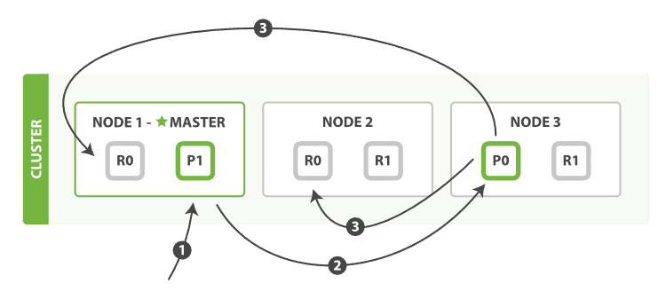

# Elasticsearch 原理-分布式特性

::: tip 转载参考

- [Elasticsearch: 权威指南](https://www.elastic.co/guide/cn/elasticsearch/guide/current/index.html) 
- [Elasticsearch Reference - version 6.7](https://www.elastic.co/guide/en/elasticsearch/reference/6.7/query-dsl-match-query.html)
- [Elasticsearch Reference - (current)](https://www.elastic.co/guide/en/elasticsearch/reference/current/index.html)

:::


::: warning

这部分主要参考官网的【Elasticsearch: 权威指南】，而此文档基于的版本是非常老的2.x，所以有些内容可能已经过时或改动。不过基本的核心理论部分还是可以作为了解ES的非常好的教材！

<br>

:::


Elasticsearch 可以横向扩展至数百（甚至数千）的服务器节点，同时可以处理PB级数据。Elasticsearch 天生就是分布式的，并且在设计时屏蔽了分布式的复杂性。Elasticsearch 在分布式方面几乎是透明的。基本使用时并不要求了解分布式系统、分片、集群发现或其他的各种分布式概念。Elasticsearch 尽可能地屏蔽了分布式系统的复杂性。这里列举了一些在后台自动执行的操作：

- 分配文档到不同的容器 或 *分片* 中，文档可以储存在一个或多个节点中
- 按集群节点来均衡分配这些分片，从而对索引和搜索过程进行负载均衡
- 复制每个分片以支持数据冗余，从而防止硬件故障导致的数据丢失
- 将集群中任一节点的请求路由到存有相关数据的节点
- 集群扩容时无缝整合新节点，重新分配分片以便从离群节点恢复

> *来自 [Elasticsearch: 权威指南](https://www.elastic.co/guide/cn/elasticsearch/guide/current/index.html)*
>
> <br>
>
> 当阅读本书时，将会遇到有关 Elasticsearch 分布式特性的补充章节。这些章节将介绍有关集群扩容、故障转移([*集群内的原理*](https://www.elastic.co/guide/cn/elasticsearch/guide/current/distributed-cluster.html)) 、应对文档存储([*分布式文档存储*](https://www.elastic.co/guide/cn/elasticsearch/guide/current/distributed-docs.html)) 、执行分布式搜索([*执行分布式检索*](https://www.elastic.co/guide/cn/elasticsearch/guide/current/distributed-search.html)) ，以及分区（shard）及其工作原理([*分片内部原理*](https://www.elastic.co/guide/cn/elasticsearch/guide/current/inside-a-shard.html)) 。
>
> 这些章节并非必读，完全可以无需了解内部机制就使用 Elasticsearch，但是它们将从另一个角度帮助你了解更完整的 Elasticsearch 知识。可以根据需要跳过它们，或者想更完整地理解时再回头阅读也无妨。

## 集群内的原理

> 如前所述，这是补充章节中第一篇介绍 Elasticsearch 在分布式环境中的运行原理。 在这个章节中，我们将会介绍 *cluster* 、 *node* 、 *shard* 等常用术语，Elastisearch 的扩容机制， 以及如何处理硬件故障的内容。
>
> 虽然这个章节不是必读的—您完全可以在不关注分片、副本和失效切换等内容的情况下长期使用Elasticsearch-- 但是这将帮助你了解 Elasticsearch 的内部工作过程。您可以先快速阅览该章节，将来有需要时再次查看。

ElasticSearch 的主旨是随时可用和按需扩容。 而扩容可以通过购买性能更强大（ *垂直扩容* ，或 *纵向扩容* ） 或者数量更多的服务器（ *水平扩容* ，或 *横向扩容* ）来实现。<br>虽然 Elasticsearch 可以获益于更强大的硬件设备，但是垂直扩容是有极限的。 真正的扩容能力是来自于水平扩容—为集群添加更多的节点，并且将负载压力和稳定性分散到这些节点中。<br>对于大多数的数据库而言，通常需要对应用程序进行非常大的改动，才能利用上横向扩容的新增资源。 与之相反的是，ElastiSearch天生就是 *分布式的* ，它知道如何通过管理多节点来提高扩容性和可用性。 这也意味着你的应用无需关注这个问题。<br>本章将讲述如何按需配置集群、节点和分片，并在硬件故障时确保数据安全。

### 空集群

如果我们启动了一个单独的节点，里面不包含任何的数据和索引，那我们的集群看起来就是一个**包含空内容节点的集群**

<div style="display:flex;"></div>

一个运行中的 Elasticsearch 实例称为一个节点，而集群是由一个或者多个拥有相同 `cluster.name` 配置的节点组成， 它们共同承担数据和负载的压力。当有节点加入集群中或者从集群中移除节点时，集群将会重新平均分布所有的数据。当一个节点被选举成为 `主`节点时， 它将负责管理集群范围内的所有变更，例如增加、删除索引，或者增加、删除节点等。 而主节点并不需要涉及到文档级别的变更和搜索等操作，所以当集群只拥有一个主节点的情况下，即使流量的增加它也不会成为瓶颈。 任何节点都可以成为主节点。我们的示例集群就只有一个节点，所以它同时也成为了主节点。

作为用户，我们可以将请求发送到 *集群中的任何节点* ，包括主节点。 每个节点都知道任意文档所处的位置，并且能够将我们的请求直接转发到存储我们所需文档的节点。 无论我们将请求发送到哪个节点，它都能负责从各个包含我们所需文档的节点收集回数据，并将最终结果返回給客户端。 Elasticsearch 对这一切的管理都是透明的。

### 集群健康

Elasticsearch 的集群监控信息中包含了许多的统计数据，其中最为重要的一项就是 *集群健康* ， 它在 `status` 字段中展示为 `green` 、 `yellow` 或者 `red` 。

``` json
GET /_cluster/health
```

在一个不包含任何索引的空集群中，它将会有一个类似于如下所示的返回内容：

``` json
{
   "cluster_name":          "elasticsearch",
   "status":                "green", 
   "timed_out":             false,
   "number_of_nodes":       1,
   "number_of_data_nodes":  1,
   "active_primary_shards": 0,
   "active_shards":         0,
   "relocating_shards":     0,
   "initializing_shards":   0,
   "unassigned_shards":     0
}
```

> `status` 字段是我们最关心的。

`status` 字段指示着当前集群在总体上是否工作正常。它的三种颜色含义如下：

- **`green`** - 所有的主分片和副本分片都正常运行。
- **`yellow`** - 所有的主分片都正常运行，但不是所有的副本分片都正常运行。
- **`red`** - 有主分片没能正常运行。

在本节后面部分，我们将解释什么是 *主* 分片和 *副本* 分片，以及上面提到的这些颜色的实际意义。

### 添加索引

我们往 Elasticsearch 添加数据时需要用到 *索引* —— 保存相关数据的地方。 索引实际上是指向一个或者多个物理 *分片* 的 *逻辑命名空间* 。

一个 *分片* 是一个底层的 *工作单元* ，它仅保存了全部数据中的一部分。 在[`分片内部机制`](https://www.elastic.co/guide/cn/elasticsearch/guide/current/inside-a-shard.html)中，我们将详细介绍分片是如何工作的，而现在我们只需知道一个分片是一个 Lucene 的实例，以及它本身就是一个完整的搜索引擎。 我们的文档被存储和索引到分片内，但是应用程序是直接与索引而不是与分片进行交互。Elasticsearch 是利用分片将数据分发到集群内各处的。分片是数据的容器，文档保存在分片内，分片又被分配到集群内的各个节点里。 当你的集群规模扩大或者缩小时， Elasticsearch 会自动的在各节点中迁移分片，使得数据仍然均匀分布在集群里。

> 技术上来说，一个主分片最大能够存储 Integer.MAX_VALUE - 128 个文档，但是实际最大值还需要参考你的使用场景：包括你使用的硬件， 文档的大小和复杂程度，索引和查询文档的方式以及你期望的响应时长。

一个副本分片只是一个主分片的拷贝。副本分片作为硬件故障时保护数据不丢失的冗余备份，并为搜索和返回文档等读操作提供服务。

在索引建立的时候就已经确定了主分片数，但是副本分片数可以随时修改。

让我们在包含一个空节点的集群内创建名为 `blogs` 的索引。 索引在默认情况下会被分配5个主分片， 但是为了演示目的，我们将分配3个主分片和一份副本（每个主分片拥有一个副本分片）：

``` json
PUT /blogs
{
   "settings" : {
      "number_of_shards" : 3,
      "number_of_replicas" : 1
   }
}
```

我们的集群现在是 [“拥有一个索引的单节点集群”]。所有3个主分片都被分配在 `Node 1` 。

<div style="display:flex;"></div>

如果我们现在查看[`集群健康`](https://www.elastic.co/guide/cn/elasticsearch/guide/current/cluster-health.html)，我们将看到如下内容：

``` json
{
  "cluster_name": "elasticsearch",
  "status": "yellow", 
  "timed_out": false,
  "number_of_nodes": 1,
  "number_of_data_nodes": 1,
  "active_primary_shards": 3,
  "active_shards": 3,
  "relocating_shards": 0,
  "initializing_shards": 0,
  "unassigned_shards": 3, 
  "delayed_unassigned_shards": 0,
  "number_of_pending_tasks": 0,
  "number_of_in_flight_fetch": 0,
  "task_max_waiting_in_queue_millis": 0,
  "active_shards_percent_as_number": 50
}
```

>  集群 `status` 值为 `yellow` 。
>
>  没有被分配到任何节点的副本数。
>
> <br>
>
> 集群的健康状况为 `yellow` 则表示全部 *主* 分片都正常运行（集群可以正常服务所有请求），但是 *副本*分片没有全部处在正常状态。 实际上，所有3个副本分片都是 `unassigned` —— 它们都没有被分配到任何节点。 在同一个节点上既保存原始数据又保存副本是没有意义的，因为一旦失去了那个节点，我们也将丢失该节点上的所有副本数据。
>
> 当前我们的集群是正常运行的，但是在硬件故障时有丢失数据的风险。

### 添加故障转移

当集群中只有一个节点在运行时，意味着会有一个单点故障问题——没有冗余。 幸运的是，我们只需再启动一个节点即可防止数据丢失。

> **启动第二个节点**
>
> 为了测试第二个节点启动后的情况，你可以在同一个目录内，完全依照启动第一个节点的方式来启动一个新节点（参考[安装并运行 Elasticsearch](https://www.elastic.co/guide/cn/elasticsearch/guide/current/running-elasticsearch.html)）。多个节点可以共享同一个目录。
>
> 当你在同一台机器上启动了第二个节点时，只要它和第一个节点有同样的 `cluster.name` 配置，它就会自动发现集群并加入到其中。 但是在不同机器上启动节点的时候，为了加入到同一集群，你需要配置一个可连接到的单播主机列表。 详细信息请查看[最好使用单播代替组播](https://www.elastic.co/guide/cn/elasticsearch/guide/current/important-configuration-changes.html#unicast)

如果启动了第二个节点，我们的集群将会如下图 [“拥有两个节点的集群——所有主分片和副本分片都已被分配”] 所示。

<div style="display:flex;"></div>

当第二个节点加入到集群后，3个 *副本分片* 将会分配到这个节点上——每个主分片对应一个副本分片。 这意味着当集群内任何一个节点出现问题时，我们的数据都完好无损。

所有新近被索引的文档都将会保存在主分片上，然后被并行的复制到对应的副本分片上。这就保证了我们既可以从主分片又可以从副本分片上获得文档。`cluster-health` 现在展示的状态为 `green` ，这表示所有6个分片（包括3个主分片和3个副本分片）都在正常运行。

``` json
{
  "cluster_name": "elasticsearch",
  "status": "green", 
  "timed_out": false,
  "number_of_nodes": 2,
  "number_of_data_nodes": 2,
  "active_primary_shards": 3,
  "active_shards": 6,
  "relocating_shards": 0,
  "initializing_shards": 0,
  "unassigned_shards": 0,
  "delayed_unassigned_shards": 0,
  "number_of_pending_tasks": 0,
  "number_of_in_flight_fetch": 0,
  "task_max_waiting_in_queue_millis": 0,
  "active_shards_percent_as_number": 100
}
```

> 集群 `status` 值为 `green` 。

我们的集群现在不仅仅是正常运行的，并且还处于 *始终可用* 的状态。

### 水平扩容

怎样为我们的正在增长中的应用程序按需扩容呢？ 当启动了第三个节点，我们的集群将会看起来如 [“拥有三个节点的集群——为了分散负载而对分片进行重新分配”] 所示。

<div style="display:flex;"></div>

`Node 1` 和 `Node 2` 上各有一个分片被迁移到了新的 `Node 3` 节点，现在每个节点上都拥有2个分片，而不是之前的3个。 这表示每个节点的硬件资源（CPU, RAM, I/O）将被更少的分片所共享，每个分片的性能将会得到提升。<br>分片是一个功能完整的搜索引擎，它拥有使用一个节点上的所有资源的能力。 我们这个拥有6个分片（3个主分片和3个副本分片）的索引可以最大扩容到6个节点，每个节点上存在一个分片，并且每个分片拥有所在节点的全部资源。

#### **更多的扩容**

但是如果我们想要扩容超过6个节点怎么办呢？

主分片的数目在索引创建时就已经确定了下来。实际上，这个数目定义了这个索引能够 *存储* 的最大数据量。（实际大小取决于你的数据、硬件和使用场景。） 但是，读操作——搜索和返回数据——可以同时被主分片 *或* 副本分片所处理，所以当你拥有越多的副本分片时，也将拥有越高的吞吐量。<br>在运行中的集群上是可以动态调整副本分片数目的，我们可以按需伸缩集群。让我们把副本数从默认的 `1` 增加到 `2` ：

```json
PUT /blogs/_settings
{
   "number_of_replicas" : 2
}
```

如 [“将参数 `number_of_replicas` 调大到 2”] 所示， `blogs` 索引现在拥有9个分片：3个主分片和6个副本分片。 这意味着我们可以将集群扩容到9个节点，每个节点上一个分片。相比原来3个节点时，集群搜索性能可以提升 *3* 倍。

<div style="display:flex;"></div>

> 当然，如果只是在相同节点数目的集群上增加更多的副本分片并不能提高性能，因为每个分片从节点上获得的资源会变少。 你需要增加更多的硬件资源来提升吞吐量。
>
> 但是更多的副本分片数提高了数据冗余量：按照上面的节点配置，我们可以在失去2个节点的情况下不丢失任何数据。

### 应对故障

我们之前说过 Elasticsearch 可以应对节点故障，接下来让我们尝试下这个功能。 如果我们关闭第一个节点，这时集群的状态为 [ “关闭了一个节点后的集群”]

<div style="display:flex;"></div>

我们关闭的节点是一个主节点。而集群必须拥有一个主节点来保证正常工作，所以发生的第一件事情就是选举一个新的主节点： `Node 2` 。

在我们关闭 `Node 1` 的同时也失去了主分片 `1` 和 `2` ，并且在缺失主分片的时候索引也不能正常工作。 如果此时来检查集群的状况，我们看到的状态将会为 `red` ：不是所有主分片都在正常工作。幸运的是，在其它节点上存在着这两个主分片的完整副本， 所以新的主节点立即将这些分片在 `Node 2`和 `Node 3` 上对应的副本分片提升为主分片， 此时集群的状态将会为 `yellow` 。 这个提升主分片的过程是瞬间发生的，如同按下一个开关一般。

为什么我们集群状态是 `yellow` 而不是 `green` 呢？ 虽然我们拥有所有的三个主分片，但是同时设置了每个主分片需要对应2份副本分片，而此时只存在一份副本分片。 所以集群不能为 `green` 的状态，不过我们不必过于担心：如果我们同样关闭了 `Node 2` ，我们的程序 *依然* 可以保持在不丢任何数据的情况下运行，因为 `Node 3` 为每一个分片都保留着一份副本。

如果我们重新启动 `Node 1` ，集群可以将缺失的副本分片再次进行分配，那么集群的状态也将如 [“*将参数 `number_of_replicas` 调大到 2*”] 所示。 如果 `Node 1` 依然拥有着之前的分片，它将尝试去重用它们，同时仅从主分片复制发生了修改的数据文件。

到目前为止，你应该对分片如何使得 Elasticsearch 进行水平扩容以及数据保障等知识有了一定了解。 接下来我们将讲述关于分片生命周期的更多细节。


## 分布式文档存储

通过基本使用，我们可以知道如何索引和查询数据，不过忽略了很多底层的技术细节， 例如文件是如何分布到集群的，又是如何从集群中获取的。 Elasticsearch 本意就是隐藏这些底层细节，让我们好专注在业务开发中，所以其实你不必了解这么深入也无妨。

在这个小节中，我们将深入探索这些核心的技术细节，这能帮助你更好地理解数据如何被存储到这个分布式系统中。

### 路由一个文档到一个分片中

当索引一个文档的时候，文档会被存储到一个主分片中。 Elasticsearch 如何知道一个文档应该存放到哪个分片中呢？当我们创建文档时，它如何决定这个文档应当被存储在分片 `1` 还是分片 `2` 中呢？

首先这肯定不会是随机的，否则将来要获取文档的时候我们就不知道从何处寻找了。实际上，这个过程是根据下面这个公式决定的：

```json
shard = hash(routing) % number_of_primary_shards
```

`routing` 是一个可变值，默认是文档的 `_id` ，也可以设置成一个自定义的值。 `routing` 通过 hash 函数生成一个数字，然后这个数字再除以 `number_of_primary_shards` （主分片的数量）后得到 **余数** 。这个分布在 `0` 到 `number_of_primary_shards-1` 之间的余数，就是我们所寻求的文档所在分片的位置。

这就解释了为什么我们要在创建索引的时候就确定好主分片的数量 并且永远不会改变这个数量：因为如果数量变化了，那么所有之前路由的值都会无效，文档也再也找不到了。

> 你可能觉得由于 Elasticsearch 主分片数量是固定的会使索引难以进行扩容。实际上当你需要时有很多技巧可以轻松实现扩容。我们将会在[*扩容设计*](https://www.elastic.co/guide/cn/elasticsearch/guide/current/scale.html)一章中提到更多有关水平扩展的内容。

所有的文档 API（ `get` 、 `index` 、 `delete` 、 `bulk` 、 `update` 以及 `mget` ）都接受一个叫做 `routing` 的路由参数 ，通过这个参数我们可以自定义文档到分片的映射。一个自定义的路由参数可以用来确保所有相关的文档——例如所有属于同一个用户的文档——都被存储到同一个分片中。我们也会在[*扩容设计*](https://www.elastic.co/guide/cn/elasticsearch/guide/current/scale.html)这一章中详细讨论为什么会有这样一种需求。

### 主分片和副本分片如何交互

为了说明目的, 我们 假设有一个集群由三个节点组成。 它包含一个叫 `blogs` 的索引，有两个主分片，每个主分片有两个副本分片。相同分片的副本不会放在同一节点，所以我们的集群看起来像 [*“有三个节点和一个索引的集群”*]。

<div style="display:flex;"></div>

我们可以发送请求到集群中的任一节点。 每个节点都有能力处理任意请求。 每个节点都知道集群中任一文档位置，所以可以直接将请求转发到需要的节点上。 在下面的例子中，将所有的请求发送到 `Node 1`，我们将其称为 *协调节点(coordinating node)* 。

> 当发送请求的时候， 为了扩展负载，更好的做法是轮询集群中所有的节点。

### 新建、索引和删除文档

新建、索引和删除 请求都是 *写* 操作， 必须在主分片上面完成之后才能被复制到相关的副本分片，如下图所示 [“新建、索引和删除单个文档”].

<div style="display:flex;"></div>

以下是在主副分片和任何副本分片上面 成功新建，索引和删除文档所需要的步骤顺序：

1. 客户端向 `Node 1` 发送新建、索引或者删除请求。
2. 节点使用文档的 `_id` 确定文档属于分片 0 。请求会被转发到 `Node 3`，因为分片 0 的主分片目前被分配在 `Node 3` 上。
3. `Node 3` 在主分片上面执行请求。如果成功了，它将请求并行转发到 `Node 1` 和 `Node 2` 的副本分片上。一旦所有的副本分片都报告成功, `Node 3` 将向协调节点报告成功，协调节点向客户端报告成功。

在客户端收到成功响应时，文档变更已经在主分片和所有副本分片执行完成，变更是安全的。

有一些可选的请求参数允许您影响这个过程，可能以数据安全为代价提升性能。这些选项很少使用，因为Elasticsearch已经很快，但是为了完整起见，在这里阐述如下：

> **`consistency`**
>
> consistency，即一致性。在默认设置下，即使仅仅是在试图执行一个_写_操作之前，主分片都会要求 必须要有 *规定数量(quorum)*（或者换种说法，也即必须要有大多数）的分片副本处于活跃可用状态，才会去执行_写_操作(其中分片副本可以是主分片或者副本分片)。这是为了避免在发生网络分区故障（network partition）的时候进行_写_操作，进而导致数据不一致。_规定数量_即：
>
> ```
> int( (primary + number_of_replicas) / 2 ) + 1
> ```
>
> `consistency` 参数的值可以设为 `one` （只要主分片状态 ok 就允许执行_写_操作）,`all`（必须要主分片和所有副本分片的状态没问题才允许执行_写_操作）, 或 `quorum` 。默认值为 `quorum` , 即大多数的分片副本状态没问题就允许执行_写_操作。
>
> 注意，*规定数量* 的计算公式中 `number_of_replicas` 指的是在索引设置中的设定副本分片数，而不是指当前处理活动状态的副本分片数。如果你的索引设置中指定了当前索引拥有三个副本分片，那规定数量的计算结果即：
>
> ```
> int( (primary + 3 replicas) / 2 ) + 1 = 3
> ```
>
> 如果此时你只启动两个节点，那么处于活跃状态的分片副本数量就达不到规定数量，也因此您将无法索引和删除任何文档。
>
> **`timeout`**
>
> 如果没有足够的副本分片会发生什么？ Elasticsearch会等待，希望更多的分片出现。默认情况下，它最多等待1分钟。 如果你需要，你可以使用 `timeout` 参数 使它更早终止： `100` 100毫秒，`30s`是30秒。

> 新索引默认有 `1` 个副本分片，这意味着为满足 `规定数量` *应该* 需要两个活动的分片副本。 但是，这些默认的设置会阻止我们在单一节点上做任何事情。为了避免这个问题，要求只有当 `number_of_replicas` 大于1的时候，规定数量才会执行。

### 取回一个文档

可以从主分片或者从其它任意副本分片检索文档 ，如下图所示 [“取回单个文档”].

<div style="display:flex;"></div>

以下是从主分片或者副本分片检索文档的步骤顺序：

1. 客户端向 `Node 1` 发送获取请求。
2. 节点使用文档的 `_id` 来确定文档属于分片 `0` 。分片 `0` 的副本分片存在于所有的三个节点上。 在这种情况下，它将请求转发到 `Node 2` 。
3. `Node 2` 将文档返回给 `Node 1` ，然后将文档返回给客户端。

在处理读取请求时，协调结点在每次请求的时候都会通过轮询所有的副本分片来达到负载均衡。<br>在文档被检索时，已经被索引的文档可能已经存在于主分片上但是还没有复制到副本分片。 在这种情况下，副本分片可能会报告文档不存在，但是主分片可能成功返回文档。 一旦索引请求成功返回给用户，文档在主分片和副本分片都是可用的。

### 局部更新文档

如 下图[“局部更新文档”] 所示，`update` API 结合了先前说明的读取和写入模式。

<div style="display:flex;"></div>

以下是部分更新一个文档的步骤：

1. 客户端向 `Node 1` 发送更新请求。
2. 它将请求转发到主分片所在的 `Node 3` 。
3. `Node 3` 从主分片检索文档，修改 `_source` 字段中的 JSON ，并且尝试重新索引主分片的文档。 如果文档已经被另一个进程修改，它会重试步骤 3 ，超过 `retry_on_conflict` 次后放弃。
4. 如果 `Node 3` 成功地更新文档，它将新版本的文档并行转发到 `Node 1` 和 `Node 2` 上的副本分片，重新建立索引。 一旦所有副本分片都返回成功， `Node 3` 向协调节点也返回成功，协调节点向客户端返回成功。

`update` API 还接受在 [**新建、索引和删除文档**] 章节中介绍的 `routing` 、 `replication` 、 `consistency` 和 `timeout` 参数。

> **基于文档的复制**
>
> 当主分片把更改转发到副本分片时， 它不会转发更新请求。 相反，它转发完整文档的新版本。请记住，这些更改将会异步转发到副本分片，并且不能保证它们以发送它们相同的顺序到达。 如果Elasticsearch仅转发更改请求，则可能以错误的顺序应用更改，导致得到损坏的文档。

### 多文档模式

`mget` 和 `bulk` API 的模式类似于单文档模式。区别在于协调节点知道每个文档存在于哪个分片中。 它将整个多文档请求分解成 *每个分片* 的多文档请求，并且将这些请求并行转发到每个参与节点。

协调节点一旦收到来自每个节点的应答，就将每个节点的响应收集整理成单个响应，返回给客户端，如 [“使用 `mget` 取回多个文档”] 所示。

<div style="display:flex;"></div>

以下是使用单个 `mget` 请求取回多个文档所需的步骤顺序：

1. 客户端向 `Node 1` 发送 `mget` 请求。
2. `Node 1` 为每个分片构建多文档获取请求，然后并行转发这些请求到托管在每个所需的主分片或者副本分片的节点上。一旦收到所有答复， `Node 1` 构建响应并将其返回给客户端。

可以对 `docs` 数组中每个文档设置 `routing` 参数。

bulk API， 如 [“使用 `bulk` 修改多个文档”] 所示， 允许在单个批量请求中执行多个创建、索引、删除和更新请求。

<div style="display:flex;"></div>

`bulk` API 按如下步骤顺序执行：

1. 客户端向 `Node 1` 发送 `bulk` 请求。
2. `Node 1` 为每个节点创建一个批量请求，并将这些请求并行转发到每个包含主分片的节点主机。
3. 主分片一个接一个按顺序执行每个操作。当每个操作成功时，主分片并行转发新文档（或删除）到副本分片，然后执行下一个操作。 一旦所有的副本分片报告所有操作成功，该节点将向协调节点报告成功，协调节点将这些响应收集整理并返回给客户端。

`bulk` API 还可以在整个批量请求的最顶层使用 `consistency` 参数，以及在每个请求中的元数据中使用 `routing` 参数。

>  **为什么是有趣的格式？**
>
> <br>
>
> 了解批量请求时，您可能会问自己， "为什么 `bulk` API 需要有换行符的有趣格式，而不是发送包装在 JSON 数组中的请求，例如 `mget` API？" 。
>
> 为了回答这一点，我们需要解释一点背景：在批量请求中引用的每个文档可能属于不同的主分片， 每个文档可能被分配给集群中的任何节点。这意味着批量请求 `bulk` 中的每个 *操作* 都需要被转发到正确节点上的正确分片。
>
> 如果单个请求被包装在 JSON 数组中，那就意味着我们需要执行以下操作：
>
> - 将 JSON 解析为数组（包括文档数据，可以非常大）
> - 查看每个请求以确定应该去哪个分片
> - 为每个分片创建一个请求数组
> - 将这些数组序列化为内部传输格式
> - 将请求发送到每个分片
>
> 这是可行的，但需要大量的 RAM 来存储原本相同的数据的副本，并将创建更多的数据结构，Java虚拟机（JVM）将不得不花费时间进行垃圾回收。
>
> 相反，Elasticsearch可以直接读取被网络缓冲区接收的原始数据。 它使用换行符字符来识别和解析小的 `action/metadata` 行来决定哪个分片应该处理每个请求。
>
> 这些原始请求会被直接转发到正确的分片。没有冗余的数据复制，没有浪费的数据结构。整个请求尽可能在最小的内存中处理。


## 执行分布式检索

::: tip

先去参考ES搜索的基本使用, 在回过头来了解是如何在分布式环境中实现的。

<br>

:::

一个 CRUD 操作只对单个文档进行处理，文档的唯一性由 `_index`, `_type`, 和 [`routing` values](https://www.elastic.co/guide/cn/elasticsearch/guide/current/routing-value.html) （通常默认是该文档的 `_id` ）的组合来确定。 这表示我们确切的知道集群中哪个分片含有此文档。

搜索需要一种更加复杂的执行模型因为我们不知道查询会命中哪些文档: 这些文档有可能在集群的任何分片上。 一个搜索请求必须询问我们关注的索引（index or indices）的所有分片的某个副本来确定它们是否含有任何匹配的文档。

但是找到所有的匹配文档仅仅完成事情的一半。 在 `search` 接口返回一个 `page` 结果之前，多分片中的结果必须组合成单个排序列表。 为此，搜索被执行成一个两阶段过程，我们称之为 *query then fetch*。

### 查询阶段

在初始 *查询阶段* 时， 查询会广播到索引中每一个分片拷贝（主分片或者副本分片）。 每个分片在本地执行搜索并构建一个匹配文档的 *优先队列*。

> **优先队列**
>
> 一个 *优先队列* 仅仅是一个存有 *top-n* 匹配文档的有序列表。优先队列的大小取决于分页参数 `from` 和 `size` 。例如，如下搜索请求将需要足够大的优先队列来放入100条文档。
>
> ```js
> GET /_search
> {
>     "from": 90,
>     "size": 10
> }
> ```

这个查询阶段的过程如下图 [“查询过程分布式搜索”] 所示。

<div style="display:flex;"></div>

查询阶段包含以下三个步骤:

1. 客户端发送一个 `search` 请求到 `Node 3` ， `Node 3` 会创建一个大小为 `from + size` 的空优先队列。
2. `Node 3` 将查询请求转发到索引的每个主分片或副本分片中。每个分片在本地执行查询并添加结果到大小为 `from + size` 的本地有序优先队列中。
3. 每个分片返回各自优先队列中所有文档的 ID 和排序值给协调节点，也就是 `Node 3` ，它合并这些值到自己的优先队列中来产生一个全局排序后的结果列表。

当一个搜索请求被发送到某个节点时，这个节点就变成了协调节点。 这个节点的任务是广播查询请求到所有相关分片并将它们的响应整合成全局排序后的结果集合，这个结果集合会返回给客户端。

第一步是广播请求到索引中每一个节点的分片拷贝。就像 [document `GET` requests](https://www.elastic.co/guide/cn/elasticsearch/guide/current/distrib-read.html) 所描述的， 查询请求可以被某个主分片或某个副本分片处理， 这就是为什么更多的副本（当结合更多的硬件）能够增加搜索吞吐率。 协调节点将在之后的请求中轮询所有的分片拷贝来分摊负载。

每个分片在本地执行查询请求并且创建一个长度为 `from + size` 的优先队列—也就是说，每个分片创建的结果集足够大，均可以满足全局的搜索请求。 分片返回一个轻量级的结果列表到协调节点，它仅包含文档 ID 集合以及任何排序需要用到的值，例如 `_score` 。

协调节点将这些分片级的结果合并到自己的有序优先队列里，它代表了全局排序结果集合。至此查询过程结束。

> 一个索引可以由一个或几个主分片组成， 所以一个针对单个索引的搜索请求需要能够把来自多个分片的结果组合起来。 针对 *multiple* 或者 *all* 索引的搜索工作方式也是完全一致的—仅仅是包含了更多的分片而已。

### 取回阶段

查询阶段标识哪些文档满足搜索请求，但是我们仍然需要取回这些文档。这是取回阶段的任务, 正如 [“分布式搜索的取回阶段”] 所展示的。

<div style="display:flex;"></div>

分布式阶段由以下步骤构成：

1. 协调节点辨别出哪些文档需要被取回并向相关的分片提交多个 `GET` 请求。
2. 每个分片加载并 *丰富* 文档，如果有需要的话，接着返回文档给协调节点。
3. 一旦所有的文档都被取回了，协调节点返回结果给客户端。

协调节点首先决定哪些文档 *确实* 需要被取回。例如，如果我们的查询指定了 `{ "from": 90, "size": 10 }` ，最初的90个结果会被丢弃，只有从第91个开始的10个结果需要被取回。这些文档可能来自和最初搜索请求有关的一个、多个甚至全部分片。<br>协调节点给持有相关文档的每个分片创建一个 [multi-get request](https://www.elastic.co/guide/cn/elasticsearch/guide/current/distrib-multi-doc.html) ，并发送请求给同样处理查询阶段的分片副本。<br>分片加载文档体-- `_source` 字段—如果有需要，用元数据和 [search snippet highlighting](https://www.elastic.co/guide/cn/elasticsearch/guide/current/highlighting-intro.html) 丰富结果文档。 一旦协调节点接收到所有的结果文档，它就组装这些结果为单个响应返回给客户端。

> **深分页（Deep Pagination）**
>
> <br>
>
> 先查后取的过程支持用 `from` 和 `size` 参数分页，但是这是 *有限制的* 。 要记住需要传递信息给协调节点的每个分片必须先创建一个 `from + size` 长度的队列，协调节点需要根据 `number_of_shards * (from + size)` 排序文档，来找到被包含在 `size` 里的文档。
>
> 取决于你的文档的大小，分片的数量和你使用的硬件，给 10,000 到 50,000 的结果文档深分页（ 1,000 到 5,000 页）是完全可行的。但是使用足够大的 `from` 值，排序过程可能会变得非常沉重，使用大量的CPU、内存和带宽。因为这个原因，我们强烈建议你不要使用深分页。
>
> 实际上， “深分页” 很少符合人的行为。当2到3页过去以后，人会停止翻页，并且改变搜索标准。会不知疲倦地一页一页的获取网页直到你的服务崩溃的罪魁祸首一般是机器人或者web spider。
>
> 如果你 *确实* 需要从你的集群取回大量的文档，你可以通过用 `scroll` 查询禁用排序使这个取回行为更有效率，我们会在后面进行讨论。

### 搜索选项

有几个 查询参数可以影响搜索过程。

**偏好**

偏好这个参数 `preference` 允许 用来控制由哪些分片或节点来处理搜索请求。 它接受像 `_primary`, `_primary_first`, `_local`, `_only_node:xyz`, `_prefer_node:xyz`, 和 `_shards:2,3` 这样的值, 这些值在 [search `preference`](https://www.elastic.co/guide/en/elasticsearch/reference/5.6/search-request-preference.html) 文档页面被详细解释。

但是最有用的值是某些随机字符串，它可以避免 *bouncing results* 问题。

> **Bouncing Results**
>
> 想象一下有两个文档有同样值的时间戳字段，搜索结果用 `timestamp` 字段来排序。 由于搜索请求是在所有有效的分片副本间轮询的，那就有可能发生主分片处理请求时，这两个文档是一种顺序， 而副本分片处理请求时又是另一种顺序。
>
> 这就是所谓的 *bouncing results* 问题: 每次用户刷新页面，搜索结果表现是不同的顺序。 让同一个用户始终使用同一个分片，这样可以避免这种问题， 可以设置 `preference` 参数为一个特定的任意值比如用户会话ID来解决。

**超时问题**

通常分片处理完它所有的数据后再把结果返回给协同节点，协同节点把收到的所有结果合并为最终结果。这意味着花费的时间是最慢分片的处理时间加结果合并的时间。如果有一个节点有问题，就会导致所有的响应缓慢。

参数 `timeout` 告诉 分片允许处理数据的最大时间。如果没有足够的时间处理所有数据，这个分片的结果可以是部分的，甚至是空数据。搜索的返回结果会用属性 `timed_out` 标明分片是否返回的是部分结果：

``` json
    ...
    "timed_out":     true,  
    ...

//	这个搜索请求超时了。
```

> 
> 超时仍然是一个最有效的操作，知道这一点很重要； 很可能查询会超过设定的超时时间。这种行为有两个原因：
>
> 1. 超时检查是基于每文档做的。 但是某些查询类型有大量的工作在文档评估之前需要完成。 这种 "setup" 阶段并不考虑超时设置，所以太长的建立时间会导致超过超时时间的整体延迟。
> 2. 因为时间检查是基于每个文档的，一次长时间查询在单个文档上执行并且在下个文档被评估之前不会超时。 这也意味着差的脚本（比如带无限循环的脚本）将会永远执行下去

**路由**

在 [*路由一个文档到一个分片中*] 中, 我们解释过如何定制参数 `routing` ，它能够在索引时提供来确保相关的文档，比如属于某个用户的文档被存储在某个分片上。 在搜索的时候，不用搜索索引的所有分片，而是通过指定几个 `routing` 值来限定只搜索几个相关的分片：

``` json
GET /_search?routing=user_1,user2
```

这个技术在设计大规模搜索系统时就会派上用场，我们在 [*扩容设计*](https://www.elastic.co/guide/cn/elasticsearch/guide/current/scale.html) 中详细讨论它。

**搜索类型**

缺省的搜索类型是 `query_then_fetch` 。 在某些情况下，你可能想明确设置 `search_type` 为 `dfs_query_then_fetch` 来改善相关性精确度：

```json
GET /_search?search_type=dfs_query_then_fetch
```

搜索类型 `dfs_query_then_fetch` 有预查询阶段，这个阶段可以从所有相关分片获取词频来计算全局词频。 我们在 [被破坏的相关度](https://www.elastic.co/guide/cn/elasticsearch/guide/current/relevance-is-broken.html) 会再讨论它。

### 游标查询 *Scroll*

`scroll` 查询 可以用来对 Elasticsearch 有效地执行大批量的文档查询，而又不用付出深度分页那种代价。

游标查询允许我们 先做查询初始化，然后再批量地拉取结果。 这有点儿像传统数据库中的 *cursor* 。<br>游标查询会取某个时间点的快照数据。 查询初始化之后索引上的任何变化会被它忽略。 它通过保存旧的数据文件来实现这个特性，结果就像保留初始化时的索引 *视图* 一样。<br>深度分页的代价根源是结果集全局排序，如果去掉全局排序的特性的话查询结果的成本就会很低。 游标查询用字段 `_doc` 来排序。 这个指令让 Elasticsearch 仅仅从还有结果的分片返回下一批结果。

启用游标查询可以通过在查询的时候设置参数 `scroll` 的值为我们期望的游标查询的过期时间。 游标查询的过期时间会在每次做查询的时候刷新，所以这个时间只需要足够处理当前批的结果就可以了，而不是处理查询结果的所有文档的所需时间。 这个过期时间的参数很重要，因为保持这个游标查询窗口需要消耗资源，所以我们期望如果不再需要维护这种资源就该早点儿释放掉。 设置这个超时能够让 Elasticsearch 在稍后空闲的时候自动释放这部分资源。

``` json
GET /old_index/_search?scroll=1m //保持游标查询窗口一分钟。
{
    "query": { "match_all": {}},
    "sort" : ["_doc"], 	//关键字 _doc 是最有效的排序顺序。
    "size":  1000
}
```

这个查询的返回结果包括一个字段 `_scroll_id`， 它是一个base64编码的长字符串 。 现在我们能传递字段 `_scroll_id` 到 `_search/scroll` 查询接口获取下一批结果：

``` json
GET /_search/scroll
{
    "scroll": "1m", 	//注意再次设置游标查询过期时间为一分钟。
    "scroll_id" : "cXVlcnlUaGVuRmV0Y2g7NTsxMDk5NDpkUmpiR2FjOFNhNnlCM1ZDMWpWYnRROzEwOTk1OmRSamJHYWM4U2E2eUIzVkMxalZidFE7MTA5OTM6ZFJqYkdhYzhTYTZ5QjNWQzFqVmJ0UTsxMTE5MDpBVUtwN2lxc1FLZV8yRGVjWlI2QUVBOzEwOTk2OmRSamJHYWM4U2E2eUIzVkMxalZidFE7MDs="
}
```

这个游标查询返回的下一批结果。 尽管我们指定字段 `size` 的值为1000，我们有可能取到超过这个值数量的文档。 当查询的时候， 字段 `size` 作用于单个分片，所以每个批次实际返回的文档数量最大为`size * number_of_primary_shards` 。

> 注意游标查询每次返回一个新字段 `_scroll_id`。每次我们做下一次游标查询， 我们必须把前一次查询返回的字段 `_scroll_id` 传递进去。 当没有更多的结果返回的时候，我们就处理完所有匹配的文档了。


## 分片内部原理

在 [*集群内的原理*] 中, 我们介绍了 *分片*, 并将它 描述成最小的 *工作单元* 。但是究竟什么 *是* 一个分片，它是如何工作的？ 在这个章节，我们回答以下问题:

- 为什么搜索是 *近* 实时的？
- 为什么文档的 CRUD (创建-读取-更新-删除) 操作是 *实时* 的?
- Elasticsearch 是怎样保证更新被持久化在断电时也不丢失数据?
- 为什么删除文档不会立刻释放空间？
- `refresh`, `flush`, 和 `optimize` API 都做了什么, 你什么情况下应该使用他们？

最简单的理解一个分片如何工作的方式是上一堂历史课。 我们将要审视提供一个带近实时搜索和分析的 分布式持久化数据存储需要解决的问题。

### 使文本可被搜索

必须解决的第一个挑战是如何使文本可被搜索。 传统的数据库每个字段存储单个值，但这对全文检索并不够。文本字段中的每个单词需要被搜索，对数据库意味着需要单个字段有索引多值(这里指单词)的能力。

最好的支持 *一个字段多个值* 需求的数据结构是*倒排索引* 。 倒排索引包含一个有序列表，列表包含所有文档出现过的不重复个体，或称为 *词项* ，对于每一个词项，包含了它所有曾出现过文档的列表。

```
Term  | Doc 1 | Doc 2 | Doc 3 | ...
------------------------------------
brown |   X   |       |  X    | ...
fox   |   X   |   X   |  X    | ...
quick |   X   |   X   |       | ...
the   |   X   |       |  X    | ...
```

> 当讨论倒排索引时，我们会谈到 *文档* 标引，因为历史原因，倒排索引被用来对整个非结构化文本文档进行标引。 Elasticsearch 中的 *文档* 是有字段和值的结构化 JSON 文档。事实上，在 JSON 文档中， 每个被索引的字段都有自己的倒排索引。

这个倒排索引相比特定词项出现过的文档列表，会包含更多其它信息。它会保存每一个词项出现过的文档总数， 在对应的文档中一个具体词项出现的总次数，词项在文档中的顺序，每个文档的长度，所有文档的平均长度，等等。这些统计信息允许 Elasticsearch 决定哪些词比其它词更重要，哪些文档比其它文档更重要，这些内容在 [什么是相关性?](https://www.elastic.co/guide/cn/elasticsearch/guide/current/relevance-intro.html) 中有描述。

为了能够实现预期功能，倒排索引需要知道集合中的 *所有* 文档，这是需要认识到的关键问题。

早期的全文检索会为整个文档集合建立一个很大的倒排索引并将其写入到磁盘。 一旦新的索引就绪，旧的就会被其替换，这样最近的变化便可以被检索到。

**不变性**

倒排索引被写入磁盘后是 *不可改变* 的:它永远不会修改。 不变性有重要的价值：

- 不需要锁。如果你从来不更新索引，你就不需要担心多进程同时修改数据的问题。
- 一旦索引被读入内核的文件系统缓存，便会留在哪里，由于其不变性。只要文件系统缓存中还有足够的空间，那么大部分读请求会直接请求内存，而不会命中磁盘。这提供了很大的性能提升。
- 其它缓存(像filter缓存)，在索引的生命周期内始终有效。它们不需要在每次数据改变时被重建，因为数据不会变化。
- 写入单个大的倒排索引允许数据被压缩，减少磁盘 I/O 和 需要被缓存到内存的索引的使用量。

当然，一个不变的索引也有不好的地方。主要事实是它是不可变的! 你不能修改它。如果你需要让一个新的文档 可被搜索，你需要重建整个索引。这要么对一个索引所能包含的数据量造成了很大的限制，要么对索引可被更新的频率造成了很大的限制。

### 动态更新索引

下一个需要被解决的问题是怎样在保留不变性的前提下实现倒排索引的更新？答案是: 用更多的索引。

通过增加新的补充索引来反映新近的修改，而不是直接重写整个倒排索引。每一个倒排索引都会被轮流查询到—从最早的开始—查询完后再对结果进行合并。<br>Elasticsearch 基于 Lucene, 这个 java 库引入了 *按段搜索* 的概念。 每一 *段* 本身都是一个倒排索引， 但 *索引* 在 Lucene 中除表示所有 *段* 的集合外， 还增加了 *提交点* 的概念 — 一个列出了所有已知段的文件，就像下图所示

<div style="display:flex;"></div>

> **索引与分片的比较**
>
> 被混淆的概念是，一个 *Lucene 索引* 我们在 Elasticsearch 称作 *分片* 。 一个 Elasticsearch *索引* 是分片的集合。 当 Elasticsearch 在索引中搜索的时候， 他发送查询到每一个属于索引的分片(Lucene 索引)，然后像 [*执行分布式检索*](https://www.elastic.co/guide/cn/elasticsearch/guide/current/distributed-search.html) 提到的那样，合并每个分片的结果到一个全局的结果集。

逐段搜索会以如下流程进行工作：

1. 新文档被收集到内存索引缓存， 见下图。
2. 不时地, 缓存被 *提交* ：
   - 一个新的段—一个追加的倒排索引—被写入磁盘。
   - 一个新的包含新段名字的 *提交点* 被写入磁盘。
   - 磁盘进行 *同步* — 所有在文件系统缓存中等待的写入都刷新到磁盘，以确保它们被写入物理文件。
3. 新的段被开启，让它包含的文档可见以被搜索。
4. 内存缓存被清空，等待接收新的文档。

<div style="display:flex;"></div>

如上图所示，新的文档首先被添加到内存索引缓存中，然后写入到一个基于磁盘的段，如下图所示。

<div style="display:flex;"></div>

当一个查询被触发，所有已知的段按顺序被查询。词项统计会对所有段的结果进行聚合，以保证每个词和每个文档的关联都被准确计算。 这种方式可以用相对较低的成本将新文档添加到索引。

#### 删除和更新

段是不可改变的，所以既不能从把文档从旧的段中移除，也不能修改旧的段来进行反映文档的更新。 取而代之的是，每个提交点会包含一个 `.del` 文件，文件中会列出这些被删除文档的段信息。<br>当一个文档被 “删除” 时，它实际上只是在 `.del` 文件中被 *标记* 删除。一个被标记删除的文档仍然可以被查询匹配到， 但它会在最终结果被返回前从结果集中移除。

文档更新也是类似的操作方式：当一个文档被更新时，旧版本文档被标记删除，文档的新版本被索引到一个新的段中。 可能两个版本的文档都会被一个查询匹配到，但被删除的那个旧版本文档在结果集返回前就已经被移除。在后面**段合并**, 我们会展示一个被删除的文档是怎样被文件系统移除的。

### 近实时搜索

随着按段（per-segment）搜索的发展，一个新的文档从索引到可被搜索的延迟显著降低了。新文档在几分钟之内即可被检索，但这样还是不够快。磁盘在这里成为了瓶颈。提交（Commiting）一个新的段到磁盘需要一个 [`fsync`](http://en.wikipedia.org/wiki/Fsync) 来确保段被物理性地写入磁盘，这样在断电的时候就不会丢失数据。 但是 `fsync` 操作代价很大; 如果每次索引一个文档都去执行一次的话会造成很大的性能问题。

我们需要的是一个更轻量的方式来使一个文档可被搜索，这意味着 `fsync` 要从整个过程中被移除。

在Elasticsearch和磁盘之间是文件系统缓存。 像之前描述的一样， 在内存索引缓冲区（*在内存缓冲区中包含了新文档的 Lucene 索引*）中的文档会被写入到一个新的段中（*缓冲区的内容已经被写入一个可被搜索的段中，但还没有进行提交*），但是这里新段会被先写入到文件系统缓存—这一步代价会比较低，稍后再被刷新到磁盘—这一步代价比较高。不过只要文件已经在缓存中就可以像其它文件一样被打开和读取了。

*在内存缓冲区中包含了新文档的 Lucene 索引*

<div style="display:flex;"></div>

Lucene 允许新段被写入和打开—使其包含的文档在未进行一次完整提交时便对搜索可见。 这种方式比进行一次提交代价要小得多，并且在不影响性能的前提下可以被频繁地执行。

*缓冲区的内容已经被写入一个可被搜索的段中，但还没有进行提交*

<div style="display:flex;"></div>

#### refresh API

在 Elasticsearch 中，写入和打开一个新段的轻量的过程叫做 *refresh* 。 默认情况下每个分片会每秒自动刷新一次。这就是为什么我们说 Elasticsearch 是 *近* 实时搜索: 文档的变化并不是立即对搜索可见，但会在一秒之内变为可见。

这些行为可能会对新用户造成困惑: 他们索引了一个文档然后尝试搜索它，但却没有搜到。这个问题的解决办法是用 `refresh` API 执行一次手动刷新:

```json
POST /_refresh 
POST /blogs/_refresh 

# 刷新（Refresh）所有的索引。
# 只刷新（Refresh） blogs 索引。
```

> 尽管刷新是比提交轻量很多的操作，它还是会有性能开销。当写测试的时候， 手动刷新很有用，但是不要在生产环境下每次索引一个文档都去手动刷新。 相反，你的应用需要意识到 Elasticsearch 的近实时的性质，并接受它的不足。

并不是所有的情况都需要每秒刷新。可能你正在使用 Elasticsearch 索引大量的日志文件， 你可能想优化索引速度而不是近实时搜索， 可以通过设置 `refresh_interval` ， 降低每个索引的刷新频率：

```json
PUT /my_logs
{
  "settings": {
    "refresh_interval": "30s" 	# 每30秒刷新 my_logs 索引。
  }
}
```

`refresh_interval` 可以在既存索引上进行动态更新。 在生产环境中，当你正在建立一个大的新索引时，可以先关闭自动刷新，待开始使用该索引时，再把它们调回来：

```json
PUT /my_logs/_settings
{ "refresh_interval": -1 } 	# 关闭自动刷新。

PUT /my_logs/_settings
{ "refresh_interval": "1s" } 	# 	每秒自动刷新。
```

> `refresh_interval` 需要一个 *持续时间* 值， 例如 `1s` （1 秒） 或 `2m` （2 分钟）。 一个绝对值 *1* 表示的是 *1毫秒* --无疑会使你的集群陷入瘫痪。

### 持久化变更

如果没有用 `fsync` 把数据从文件系统缓存刷（flush）到硬盘，我们不能保证数据在断电甚至是程序正常退出之后依然存在。为了保证 Elasticsearch 的可靠性，需要确保数据变化被持久化到磁盘。

在 [动态更新索引]，我们说一次完整的提交会将段刷到磁盘，并写入一个包含所有段列表的提交点。Elasticsearch 在启动或重新打开一个索引的过程中使用这个提交点来判断哪些段隶属于当前分片。即使通过每秒刷新（refresh）实现了近实时搜索，我们仍然需要经常进行完整提交来确保能从失败中恢复。但在两次提交之间发生变化的文档怎么办？我们也不希望丢失掉这些数据。

Elasticsearch 增加了一个 *translog* ，或者叫事务日志，在每一次对 Elasticsearch 进行操作时均进行了日志记录。通过 translog ，整个流程看起来是下面这样：

1. 一个文档被索引之后，就会被添加到内存缓冲区，*并且* 追加到了 translog ，正如 "*新的文档被添加到内存缓冲区并且被追加到了事务日志*" 描述的一样。

   *新的文档被添加到内存缓冲区并且被追加到了事务日志*

   <div style="display:flex;"></div>

2. 刷新（refresh）使分片处于 "*刷新（refresh）完成后, 缓存被清空但是事务日志不会*" 描述的状态，分片每秒被刷新（refresh）一次：

   - 这些在内存缓冲区的文档被写入到一个新的段中，且没有进行 `fsync` 操作。
   - 这个段被打开，使其可被搜索。
   - 内存缓冲区被清空。

   *刷新（refresh）完成后, 缓存被清空但是事务日志不会* 

   <div style="display:flex;"></div>

3. 这个进程继续工作，更多的文档被添加到内存缓冲区和追加到事务日志（见 "*事务日志不断积累文档*"）。

   *事务日志不断积累文档*

   <div style="display:flex;"></div>

4. 每隔一段时间—例如 translog 变得越来越大—索引被刷新（flush）；一个新的 translog 被创建，并且一个全量提交被执行（见 "*在刷新（flush）之后，段被全量提交，并且事务日志被清空*"）：

   - 所有在内存缓冲区的文档都被写入一个新的段。
   - 缓冲区被清空。
   - 一个提交点被写入硬盘。
   - 文件系统缓存通过 `fsync` 被刷新（flush）。
   - 老的 translog 被删除。

   translog 提供所有还没有被刷到磁盘的操作的一个持久化纪录。当 Elasticsearch 启动的时候， 它会从磁盘中使用最后一个提交点去恢复已知的段，并且会重放 translog 中所有在最后一次提交后发生的变更操作。

   translog 也被用来提供实时 CRUD 。当你试着通过ID查询、更新、删除一个文档，它会在尝试从相应的段中检索之前， 首先检查 translog 任何最近的变更。这意味着它总是能够实时地获取到文档的最新版本。

   *在刷新（flush）之后，段被全量提交，并且事务日志被清空*

   <div style="display:flex;"></div>

#### flush API

这个执行一个提交并且截断 translog 的行为在 Elasticsearch 被称作一次 *flush* 。 分片每30分钟被自动刷新（flush），或者在 translog 太大的时候也会刷新。请查看 [`translog` 文档](https://www.elastic.co/guide/en/elasticsearch/reference/2.4/index-modules-translog.html#_translog_settings) 来设置，它可以用来 控制这些阈值：

[`flush` API](https://www.elastic.co/guide/en/elasticsearch/reference/5.6/indices-flush.html) 可以被用来执行一个手工的刷新（flush）:

```json
POST /blogs/_flush 	# 刷新（flush） blogs 索引。

POST /_flush?wait_for_ongoing  # 刷新（flush）所有的索引并且并且等待所有刷新在返回前完成。
```

你很少需要自己手动执行 `flush` 操作；通常情况下，自动刷新就足够了。这就是说，在重启节点或关闭索引之前执行 [flush](https://www.elastic.co/guide/cn/elasticsearch/guide/current/translog.html#flush-api) 有益于你的索引。当 Elasticsearch 尝试恢复或重新打开一个索引， 它需要重放 translog 中所有的操作，所以如果日志越短，恢复越快。

> **Translog 有多安全?**
>
> <br>
>
> translog 的目的是保证操作不会丢失。这引出了这个问题： Translog 有多安全？
>
> 在文件被 `fsync` 到磁盘前，被写入的文件在重启之后就会丢失。默认 translog 是每 5 秒被 `fsync` 刷新到硬盘， 或者在每次写请求完成之后执行(e.g. index, delete, update, bulk)。这个过程在主分片和复制分片都会发生。最终， 基本上，这意味着在整个请求被 `fsync` 到主分片和复制分片的translog之前，你的客户端不会得到一个 200 OK 响应。
>
> 在每次请求后都执行一个 fsync 会带来一些性能损失，尽管实践表明这种损失相对较小（特别是bulk导入，它在一次请求中平摊了大量文档的开销）。
>
> 但是对于一些大容量的偶尔丢失几秒数据问题也并不严重的集群，使用异步的 fsync 还是比较有益的。比如，写入的数据被缓存到内存中，再每5秒执行一次 `fsync` 。
>
> 这个行为可以通过设置 `durability` 参数为 `async` 来启用：
>
> ```json
> PUT /my_index/_settings
> {
>     "index.translog.durability": "async",
>     "index.translog.sync_interval": "5s"
> }
> ```
>
> 这个选项可以针对索引单独设置，并且可以动态进行修改。如果你决定使用异步 translog 的话，你需要 *保证* 在发生crash时，丢失掉 `sync_interval` 时间段的数据也无所谓。请在决定前知晓这个特性。
>
> 如果你不确定这个行为的后果，最好是使用默认的参数（ `"index.translog.durability": "request"` ）来避免数据丢失。

### 段合并

由于自动刷新流程每秒会创建一个新的段 ，这样会导致短时间内的段数量暴增。而段数目太多会带来较大的麻烦。 每一个段都会消耗文件句柄、内存和cpu运行周期。更重要的是，每个搜索请求都必须轮流检查每个段；所以段越多，搜索也就越慢。

Elasticsearch通过在后台进行段合并来解决这个问题。小的段被合并到大的段，然后这些大的段再被合并到更大的段。

段合并的时候会将那些旧的已删除文档从文件系统中清除。被删除的文档（或被更新文档的旧版本）不会被拷贝到新的大段中。

启动段合并不需要你做任何事。进行索引和搜索时会自动进行。这个流程像在 " *两个提交了的段和一个未提交的段正在被合并到一个更大的段*" 中提到的一样工作：

1. 当索引的时候，刷新（refresh）操作会创建新的段并将段打开以供搜索使用。
2. 合并进程选择一小部分大小相似的段，并且在后台将它们合并到更大的段中。这并不会中断索引和搜索。

*两个提交了的段和一个未提交的段正在被合并到一个更大的段*

<div style="display:flex;"></div>

3. "*一旦合并结束，老的段被删除*" 说明合并完成时的活动：

   - 新的段被刷新（flush）到了磁盘。  ** 写入一个包含新段且排除旧的和较小的段的新提交点。
   - 新的段被打开用来搜索。
   - 老的段被删除。

   *一旦合并结束，老的段被删除*

   <div style="display:flex;"></div>

   合并大的段需要消耗大量的I/O和CPU资源，如果任其发展会影响搜索性能。Elasticsearch在默认情况下会对合并流程进行资源限制，所以搜索仍然 有足够的资源很好地执行。

#### optimize API

`optimize` API大可看做是 *强制合并* API。它会将一个分片强制合并到 `max_num_segments` 参数指定大小的段数目。 这样做的意图是减少段的数量（通常减少到一个），来提升搜索性能。

> `optimize` API *不应该* 被用在一个活跃的索引————一个正积极更新的索引。后台合并流程已经可以很好地完成工作。 optimizing 会阻碍这个进程。不要干扰它！

在特定情况下，使用 `optimize` API 颇有益处。例如在日志这种用例下，每天、每周、每月的日志被存储在一个索引中。 老的索引实质上是只读的；它们也并不太可能会发生变化。

在这种情况下，使用optimize优化老的索引，将每一个分片合并为一个单独的段就很有用了；这样既可以节省资源，也可以使搜索更加快速：

```json
POST /logstash-2014-10/_optimize?max_num_segments=1 	# 合并索引中的每个分片为一个单独的段
```

> 请注意，使用 `optimize` API 触发段合并的操作不会受到任何资源上的限制。这可能会消耗掉你节点上全部的I/O资源, 使其没有余裕来处理搜索请求，从而有可能使集群失去响应。 如果你想要对索引执行 `optimize`，你需要先使用分片分配（查看 [迁移旧索引](https://www.elastic.co/guide/cn/elasticsearch/guide/current/retiring-data.html#migrate-indices)）把索引移到一个安全的节点，再执行。