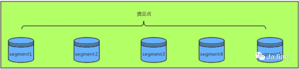
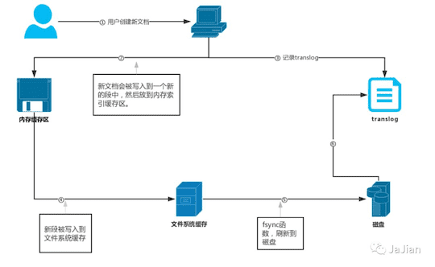
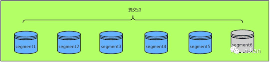
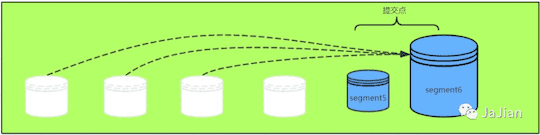

# Elasticsearch 索引

## ES 索引原理1

::: tip 转载

- [Elasticsearch 技术分析：剖析 Elasticsearch 的索引原理](https://juejin.im/post/6844903858041257998) 

:::

创建索引的时候，我们通过Mapping 映射定义好索引的基本结构信息，接下来我们肯定需要往 ES 里面新增业务文档数据了，例如用户，日志等业务数据。新增的业务数据，我们根据 Mapping 来生成对应的**倒排索引**信息 。

我们一直说，Elasticsearch是一个基于Apache Lucene 的开源搜索引擎。Elasticsearch的搜索高效的原因并不是像Redis那样重依赖内存的，而是通过建立特殊的索引数据结构--**倒排索引**实现的。由于它的使用场景：处理PB级结构化或非结构化数据，数据量大且需要持久化防止断电丢失，所以 Elasticsearch 的数据和索引存储是依赖于服务器的硬盘。这也是为什么我们在ES性能调优的时候可以将使用SSD硬盘存储作为其中一个优化项来考虑。

倒排索引的概念，我相信大家都已经知道了，这里就不在赘述，倒排索引可以说是Elasticsearch搜索高效和支持非结构化数据检索的主要原因了，但是**倒排索引被写入磁盘后是\*不可改变\* 的：它永远不会修改**。

### 段和提交点

倒排索引的不可变性，这点主要是因为 Elasticsearch 的底层是基于 Lucene，而在 Lucene 中提出了**按段搜索**的概念，将一个索引文件拆分为多个子文件，则每个子文件叫作**段**，每个段都是一个独立的可被搜索的数据集，并且段具有不变性，一旦索引的数据被写入硬盘，就不可再修改。

***段*** 的概念提出主要是因为：在早期全文检索中为整个文档集合建立了一个很大的倒排索引，并将其写入磁盘中。如果索引有更新，就需要重新全量创建一个索引来替换原来的索引。这种方式在数据量很大时效率很低，并且由于创建一次索引的成本很高，所以对数据的更新不能过于频繁，也就不能保证时效性。

而且在底层采用了分段的存储模式，使它在读写时几乎完全避免了锁的出现，大大提升了读写性能。说到这，你们可能会想到 ConcurrentHashMap 的分段锁 的概念，其实原理有点类似。

**而且 Elasticsearch 中的倒排索引被设计成不可变的，有以下几个方面优势**：

> - 不需要锁。如果你从来不更新索引，你就不需要担心多进程同时修改数据的问题。
> - 一旦索引被读入内核的文件系统缓存，便会留在哪里。由于其不变性，只要文件系统缓存中还有足够的空间，那么大部分读请求会直接请求内存，而不会命中磁盘。这提供了很大的性能提升。
> - 其它缓存(像filter缓存)，在索引的生命周期内始终有效。它们不需要在每次数据改变时被重建，因为数据不会变化。
> - 写入单个大的倒排索引允许数据被压缩，减少磁盘 I/O 和 需要被缓存到内存的索引的使用量。

每一个**段**本身都是一个倒排索引，但**索引**在 Lucene 中除表示所有段的集合外，还增加了**提交点**的概念。

为了提升写的性能，Lucene并没有每新增一条数据就增加一个段，而是采用延迟写的策略，每当有新增的数据时，就将其先写入内存中，然后批量写入磁盘中。若有一个段被写到硬盘，就会生成一个提交点，**提交点就是一个列出了所有已知段和记录所有提交后的段信息的文件**。

 

 

### 写索引的流程

上面说过 ES 的索引的不变性，还有段和提交点的概念。那么它的具体实现细节和写入磁盘的过程是怎样的呢？

 

- 用户创建了一个新文档，新文档被写入到一个新段中，然后首先被添加到内存索引缓存中。
- 不时地, 缓存被提交，这时缓存中新段会被先写入到文件缓存系统而不是直接被刷到磁盘。 这是因为，提交一个新的段到磁盘需要一个`fsync` 来确保段被物理性地写入磁盘，这样在断电的时候就不会丢失数据。 但是 `fsync` 操作代价很大；如果每次索引一个文档都去执行一次的话会造成很大的性能问题，但是这里新段会被先写入到文件系统缓存，这一步代价会比较低。
- 新的段被写入到文件缓存系统，这时内存缓存被清空。在文件缓存系统会存在一个未提交的段。虽然新段未被提交（刷到磁盘），但是文件已经在缓存中了， 此时就可以像其它文件一样被打开和读取了。
- 到目前为止索引的段还未被刷新到磁盘，如果没有用 `fsync` 把数据从文件系统缓存刷（flush）到硬盘，我们不能保证数据在断电甚至是程序正常退出之后依然存在。Elasticsearch 增加了一个 translog ，或者叫事务日志，在每一次对 Elasticsearch 进行操作时均进行了日志记录。如上图所示，一个文档被索引之后，就会被添加到内存缓冲区，并且同时追加到了 translog。
- 每隔一段时间，更多的文档被添加到内存缓冲区和追加到事务日志（translog），之后新段被不断从内存缓存区被写入到文件缓存系统，这时内存缓存被清空，但是事务日志不会。随着 translog 变得越来越大，达到一定程度后索引被刷新，在刷新（flush）之后，段被全量提交，一个提交点被写入硬盘，并且事务日志被清空

从整个流程我们可以了解到以下几个问题：

- **为什么说 ES 搜索是近实时的？** 因为文档索引在从内存缓存被写入到文件缓存系统时，虽然还没有进行提交未被 flush 到磁盘，但是缓冲区的内容已经被写入一个段（segment6）中且新段可被搜索。这就是为什么我们说 Elasticsearch 是**近实时**搜索: 文档的变化并不是立即对搜索可见，但会在一秒之内变为可见。
- **Elasticsearch 是怎样保证更新被持久化在断电时也不丢失数据?** 新索引文档被写入到内存缓存时，同时会记录一份到事务日志（translog）中，translog 提供所有还没有被刷到磁盘的操作的一个持久化纪录。当 Elasticsearch 启动的时候， 它会从磁盘中使用最后一个提交点去恢复已知的段，并且会重放 translog 中所有在最后一次提交后发生的变更操作。 translog 也被用来提供实时 CRUD 。当你试着通过ID查询、更新、删除一个文档，它会在尝试从相应的段中检索之前， 首先检查 translog 任何最近的变更。这意味着它总是能够实时地获取到文档的最新版本。

### 段合并

 

 

由于自动刷新流程每秒会创建一个新的段 ，这样会导致短时间内的段数量暴增。而段数目太多会带来较大的麻烦。 每一个段都会消耗文件句柄、内存和cpu运行周期。更重要的是，每个搜索请求都必须轮流检查每个段；所以段越多，搜索也就越慢。

Elasticsearch通过在后台进行段合并来解决这个问题。小的段被合并到大的段，然后这些大的段再被合并到更大的段。

 

 

段合并的时候会将那些旧的已删除文档 从文件系统中清除。 被删除的文档（或被更新文档的旧版本）不会被拷贝到新的大段中。

### 如何更新索引

上文阐述了索引的持久化流程和倒排索引被设定为不可修改以及这样设定的好处。因为它是不可变的，你不能修改它。但是如果你需要让一个新的文档可被搜索，这就涉及到索引的更新了，索引不可被修改但又需要更新，这种看似矛盾的要求，我们需要怎么做呢？

ES 的解决方法就是：**用更多的索引**。什么意思？就是原来的索引不变，我们对新的文档再创建一个索引。这样说完不知道大家有没有疑惑或者没理解，我们通过图表的方式说明下。

假如我们现有两个日志信息的文档，信息如下：

- Doc 1：the request param is name = 'zhang san' and age is 20.
- Doc 2：the response result is code = 0000 and msg =  'success'.

这时候我们得到的倒排索引内容（省略一部分）是：

| 词项（term） | 文档（Doc）  |
| :----------: | :----------: |
|     the      | doc 1，doc 2 |
|   request    |    doc 1     |
|    param     | doc 1，doc 2 |
|      is      | doc 1，doc 2 |
|     name     |    doc 1     |
|   response   |    doc 2     |
|    result    |    doc 2     |
|     ...      |     ...      |

如果我们这时新增一个文档 doc 3：the request param is name = 'li si' and sex is femal，或者修改文档 doc 2的内容为：the response result is code = 9999 and msg =  'false'。这时 ES 是如何处理的呢？

正如上文所述的，为了保留索引不变性，ES 会创建一个新的索引，对于新增的文档索引信息如下：

| 词项（term） | 文档（Doc） |
| :----------: | :---------: |
|     the      |    doc 3    |
|   request    |    doc 3    |
|    param     |    doc 3    |
|      is      |    doc 3    |
|     name     |    doc 3    |
|     sex      |    doc 3    |
|     ...      |     ...     |

对于修改的文档索引信息如下；

| 词项（term） | 文档（Doc） |
| :----------: | :---------: |
|     the      |    doc 2    |
|   response   |    doc 2    |
|    result    |    doc 2    |
|      is      |    doc 2    |
|     code     |    doc 2    |
|     sex      |    doc 2    |
|     ...      |     ...     |

通过增加新的补充索引来反映新近的修改，而不是直接重写整个倒排索引。每一个倒排索引都会被轮流查询到（从最早的开始），查询完后再对结果进行合并。

正如上文所述那样，对于修改的场景来说，同一个文档这时磁盘中同时会有两个索引数据一个是原来的索引，另一个是修改之后的索引。

以正常逻辑来看，我们知道搜索的时候肯定以新的索引为标准，但是段是不可改变的，所以既不能从把文档从旧的段中移除，也不能修改旧的段来进行反映文档的更新。 取而代之的是，每个提交点会包含一个 `.del`文件，文件中会列出这些被删除文档的段信息。

当一个文档被 “删除” 时，它实际上只是在`.del` 文件中被 标记 删除。一个被标记删除的文档仍然可以被查询匹配到， 但它会在最终结果被返回前从结果集中移除。

文档更新也是类似的操作方式：当一个文档被更新时，旧版本文档被标记删除，文档的新版本被索引到一个新的段中。 可能两个版本的文档都会被一个查询匹配到，但被删除的那个旧版本文档在结果集返回前就已经被移除。

## ES 索引原理2

::: tip 转载

- [Elasticsearch－基础介绍及索引原理分析](https://www.cnblogs.com/dreamroute/p/8484457.html) 

:::

