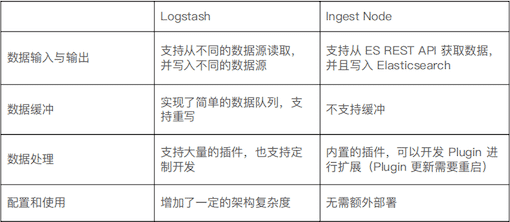
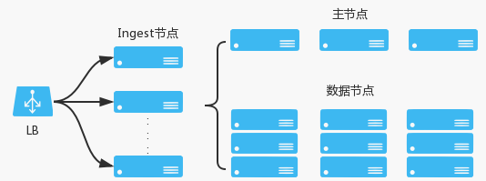
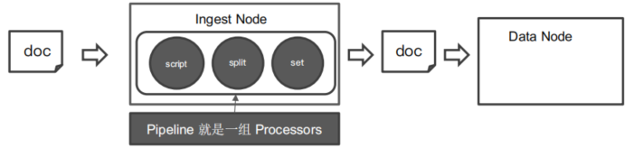
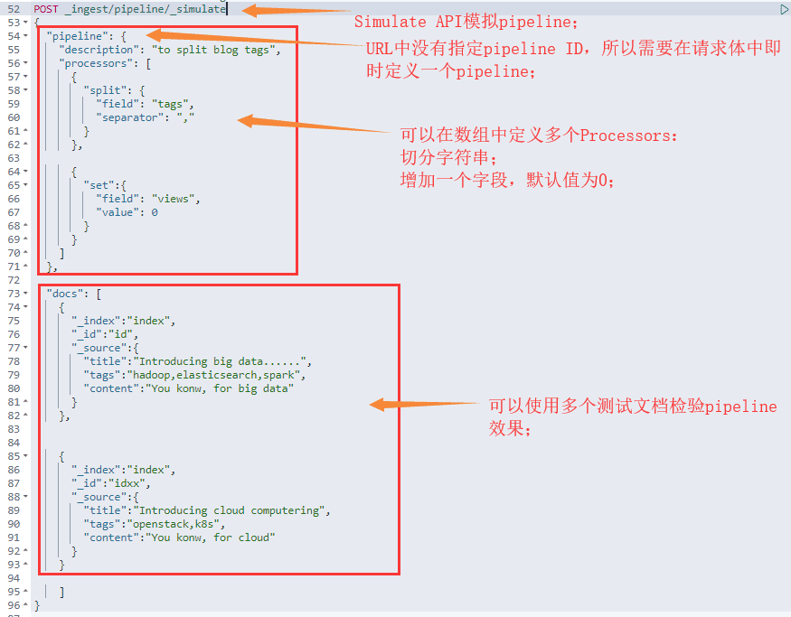

# ES Index-Ingest|Script

::: tip 转载

- [https://www.yuque.com/xiongsanxiansheng/qfvqxo/hgfsk5](https://www.yuque.com/xiongsanxiansheng/qfvqxo/hgfsk5)
- [https://www.yuque.com/xiongsanxiansheng/qfvqxo/egqcvg](https://www.yuque.com/xiongsanxiansheng/qfvqxo/egqcvg)
- [https://www.elastic.co/guide/en/elasticsearch/reference/7.9/ingest.html](https://www.elastic.co/guide/en/elasticsearch/reference/7.9/ingest.html)
- [https://www.elastic.co/guide/en/elasticsearch/reference/7.9/modules-scripting.html](https://www.elastic.co/guide/en/elasticsearch/reference/7.9/modules-scripting.html)

:::

***为什么把Ingest和Script放在一起？***

在ES中，这两种方式都是对数据进行处理。Ingest Node(Pipeline)可以实现对数据进行预处理，功能类似ELK中的logstash。而Script则使可以写在脚本中，对数据进行加工处理。


## **使用Ingest Pipeline进行数据预处理**

Elasticsearch 可以使用自身的 Ingest Pipeline 功能进行数据预处理, 无须借助 Logstash。

举例，有一个需求，修复与增强写入的数据：

- Tags 字段中，逗号分隔的文本应该是数组，而不是一个字符串
- 需求：后期需要对 Tags 进行 Aggregation 分析

### 1. Ingest Node 预处理节点

- ES 5.0 后，引入的一种新的节点类型。默认配置下，每个节点都是 Ingest Node。
  - 具有预处理数据的能力，可拦截 Index 或 Bulk API 的请求；
  - 对数据进行转换，并重新返回给 Index 或 Bulk API；
- Ingest Node v.s Logstash

<div style="display:flex;"></div>

- 控制节点的 ingest 开关在其 elasticsearch.yml 中的参数：

  ```json
  ## 关闭ingest
  node.ingest: false
  ```

- 无需 Logstash，就可以进行数据的预处理，例如:

  - 为某个字段设置默认值、重命名某个字段的字段名、对字段值进行 Split 操作
  - 支持设置 Painless 脚本，对数据进行更加复杂的加工

- Ingest 节点对数据的处理主要是通过管道（pipeline），在索引和请求中指定 Pipeling Uid，这样 Ingest 节点在拦截请求后就指定使用哪条管道进行处理。

<div style="display:flex;"></div>

- 使用场景
  - 通过上图我们很容易看到 Ingest Node 可以在数据被索引前，通过预定义好的处理管道对其进行治理；
  - 存在一个局限性：只能通过一条管道；

> 为了应对这个局限性，一直以来的应对方案就是把所有需要的处理器和细节全部配置到当前管道下。
>
> 这个方案带来的问题也很明显：
>
> 1. 复制、粘贴很多相同的管道配置在不同数据管道里；
> 2. 非常难管理、维护冗长的管道；
> 3. 如果要更新一个处理细节的话要找到定位所有使用过这个逻辑的管道；
>
> 
>
> 这个问题最合适的解决办法就是，使用管道处理器，它提供了一个允许在一个管道内调用其他管道的方案。（具体内容参考：**管道委托**，或者 **Pipeline Processor**）

### 2. Pipeline & Processor

#### 2.1 介绍

- Pipeline：管道会对通过的数据（文档），按照顺序进行加工，比如：修改文档的某个字段值、修改某个字段的类型等；
- Processor：Elasticsearch 对该加工行为进行的抽象包装
  - ES 有很多内置的 Processors；
  - 也支持通过插件的方式，实现自己的 Processor；

<br>

<div style="display:flex;"></div>

<br>

### 2.2 Simulate Pipeline API

- ES 提供了相关的 API，来让我们对这些预处理操作进行测试。
- Simulate API 可以模拟 Pipeline，辅助我们深入理解 pipeline 和 processors 的使用。
- 下面是一个比较简单的 Simulate Pipeline API 的例子，使用 pipeline 切分字符串：

<br>

<div style="display:flex;"></div>

<br>

- 也可以在 URL 中指定 pipeline ID：

```json
POST _ingest/pipeline/my-pipeline-id/_simulate
{
  "docs" : [
    { "_source": {/** first document **/} },
    { "_source": {/** second document **/} },
    // ...
  ]
}
```

### 2.3 Pipeline API

#### 1) 创建一个 pipeline：

- 对文档中的 tags 字段切分字符串；
- 为文档增加一个 views 字段，默认值 0；

```json
# 为ES添加一个 Pipeline，blog_pipeline 为 Pipeline Uid
PUT _ingest/pipeline/blog_pipeline
{
  "description": "a blog pipeline",
  "processors": [
      {
        "split": {
          "field": "tags",
          "separator": ","
        }
      },
      {
        "set":{
          "field": "views",
          "value": 0
        }
      }
    ]
}
```

#### 2) 获取某个 pipleline 内容：

```json
#根据 Pipleline Uid 查看
GET _ingest/pipeline/blog_pipeline
```

#### 3) 删除某个 pipeline：

```json
#清楚指定的 Pipeline
DELETE _ingest/pipeline/blog_pipeline

#清楚所有的 Pipeline
DELETE _ingest/pipeline/*
```

#### 4) 写入数据时，pipeline 预处理：

```json
#使用 pipeline 预处理数据
PUT tech_blogs/_doc/2?pipeline=blog_pipeline
{
  "title": "Introducing cloud computering",
  "tags": "openstack,k8s",
  "content": "You konw, for cloud"
}
#####返回结果的部分内容
"hits" : [
      {
        "_index" : "tech_blogs",
        "_type" : "_doc",
        "_id" : "2",
        "_score" : 1.0,
        "_source" : {
          "title" : "Introducing cloud computering",
          "content" : "You konw, for cloud",
          "views" : 0,
          "tags" : [
            "openstack",
            "k8s"
          ]
        }
      }
    ]
```

#### 5) 对已有数据，使用 pipeline 进行处理：

```json
#update_by_query 会导致错误
POST tech_blogs/_update_by_query?pipeline=blog_pipeline
{
}

#增加update_by_query的条件
POST tech_blogs/_update_by_query?pipeline=blog_pipeline
{
    "query": {
        "bool": {
            "must_not": {
                "exists": {
                    "field": "views"
                }
            }
        }
    }
}
```

#### 6) 访问引用文档中元数据

- 经过 pipeline 的返回结果中，ES 会增加一个 _ingest 属性，可以使用 _ingest.timestamp 来提取其时间戳；
- 如果我们需要获取到文档或 ES 的元素进行操作，可以使用 {{field}} 的方式进行访问；

```json
# 获取_ingest中的时间戳赋值给received
{
  "set": {
    "field": "received",
    "value": "{{_ingest.timestamp}}"
  }
}

# 简单的文档中字段拼接
{
  "set": {
    "field": "field_c",
    "value": "{{field_a}} {{field_b}}"
  }
}
```

#### 7) 添加执行条件

- 简单条件：每个处理器都允许一个可选的if条件来决定应该执行还是跳过该处理器。if 的值需要将其计算为 true 或 false。

```json
#创建一个管道, 当遇见area为中国华东的数据时就不进行操作
PUT _ingest/pipeline/not_save
{
  "processors": [
    {
      "drop": {
        "if": "ctx.area=='中国华东'"
      }
    }
  ]
}

#然后尝试保存下面数据，并且使用not_save管道
POST city_info/_doc/1?pipeline=not_save
{
    "name": "无锡",
    "desc": "大城市",
    "province": "江苏",
    "gdp": "1143800000000",
    "area": "中国华东",
    "carNumPrefix": "苏B"
}

#尝试查询ID为1的文档,此时会发现数据并没有插入。
GET city_info/_doc/1
```

- 复杂条件：除了简单条件，ES 也支持多个 if 操作，比如下面是官方提供的一个复杂条件 Demo。

```json
PUT _ingest/pipeline/not_prod_dropper
{
  "processors": [
    {
      "drop": {
        "if": "Collection tags = ctx.tags;if(tags != null){for (String tag : tags) {if (tag.toLowerCase().contains('prod')) { return false;}}} return true;"
      }
    }
  ]
}
```

> 因为受限制于 JSON 解析的原因执行条件被写在了一行之中，把条件单独拿出来是下面的样子，其实本质就是 JAVA 代码中的循环判断。

```json
Collection tags = ctx.tags;
if(tags != null){
    for (String tag : tags) {
        if (tag.toLowerCase().contains('prod')) {
            return false;
        }
    }
}
return true;
```

> 假如使用 Postman 进行接口调试的时候因为限制无法将判断内容格式化，这对于开发调试来说是非常难受的。但是使用 Kibana 可以使用其`"""`语法，在其内部可以显示格式化后的条件代码。

```json
PUT _ingest/pipeline/not_prod_dropper
{
  "processors": [
    {
      "drop": {
        "if": """
            Collection tags = ctx.tags;
            if(tags != null){
              for (String tag : tags) {
                  if (tag.toLowerCase().contains('prod')) {
                      return false;
                  }
              }
            }
            return true;
        """
      }
    }
  ]
}
```

#### 8) 管道委托

- 之前操作都是通过管道设置其中数据的值，而使用下面操作可以将数据的操作转移到另外一个管道中：

```json
{
  "pipeline": {
    "if": "ctx.foo == 'foo1'",
    "name": "last_pipeline"
  }
}

############ 管道委托 demo ###########
# 1. 下面例子中创建了一个last_pipeline的管道，其将foo参数设置为last_foo_value
PUT _ingest/pipeline/last_pipeline
{
  "processors": [
    {
      "set": {
        "field": "foo",
        "value": "last_foo_value"
      }
    }
  ]
}
# 2. 然后使用_simulate来模拟数据操作被转移的行为
# 下面请求中当"ctx.foo == 'foo1'条件被满足后，将用last_pipeline来处理数据
POST _ingest/pipeline/_simulate
{
  "pipeline": {
    "description": "_description",
    "processors": [
      {
        "pipeline": {
          "if": "ctx.foo == 'foo1'",
          "name": "last_pipeline"
        }
      }
    ]
  },
  "docs": [
    {
      "_index": "index",
      "_id": "id",
      "_source": {
        "foo": "foo1",
        "boo": "boo1"
      }
    },
    {
      "_index": "index",
      "_id": "id",
      "_source": {
        "foo": "foo2",
        "boo": "boo2"
      }
    }
  ]
}
```

#### 9) 条件中的嵌套数据

- 当需要访问的字段是文档的嵌套字段，如果父级对象不存在的时候去调用其子对象，在 JAVA 中会抛出 NullPointerException，而对于 ES 同样存在此风险，所以为了应对此类问题 ES 提供了 ? 符号，使用此符号可以安全的进行子集访问。

```json
# 如果network字段不曾存在，则不进行子字段name值的比较
PUT _ingest/pipeline/drop_guests_network
{
  "processors": [
    {
      "drop": {
        "if": "ctx.network?.name == 'Guest'"
      }
    }
  ]
}
```

#### 10) 处理管道异常

- 正常使用中，管道定义的处理列表是按照顺序执行的，当处理过程中存在异常时处理便会停止。让异常直接终止处理的方法显然不合理。当我们预期到某些异常的存在时，我们应该有另外一种方式去处理而不是停止程序。
- `on_failure `参数定义了在发生故障的处理器之后立即执行的处理器列表。`on_failure` 参数可以设置在管道中也可以设置在管道内的处理器中。
- 如果处理器指定了 `on_failure` 配置，不管它是否为空，处理器抛出的任何异常都会被捕获。
- 如果管道指定了 `on_failure` 配置，而管道将继续执行其余的处理器。

```json
# 1.将foo字段修改为bar字段，但是当foo的字段不存在的时候会发生异常，这个时候会执行on_failure内部的逻辑
POST _ingest/pipeline/_simulate
{
  "pipeline": {
    "description": "_description",
    "processors": [
      {
        "rename": {
          "field": "foo",
          "target_field": "bar",
          "on_failure": [
            {
              "set": {
                "field": "error",
                "value": "field \"foo\" does not exist, cannot rename to \"bar\""
              }
            }
          ]
        }
      }
    ]
  },
  "docs": [
    {
      "_index": "index",
      "_id": "id",
      "_source": {
        "boo": "boo1"
      }
    },
    {
      "_index": "index",
      "_id": "id",
      "_source": {
        "foo": "foo2",
        "boo": "boo2"
      }
    }
  ]
}

#其执行后的结果，可以看到第一条数据已经存在error的信息
{
  "doc" : {
    "_index" : "index",
    "_type" : "_doc",
    "_id" : "id",
    "_source" : {
      "boo" : "boo1",
      "error" : """field "foo" does not exist, cannot rename to "bar""""
    },
    "_ingest" : {
      "timestamp" : "2020-06-28T02:59:34.544Z"
    }
  }
}
```

- **指向新的索引：**这是官方提供的一个异常处理的应用方式。将错误数据指向到一个新的索引中是个非常好的处理方式，当我们批量执行操作遇见错误的数据被保存到一个错误索引表中，我们就可以专门针对这张索引进行分析和处理。

```json
# 修改这条数据的索引名字段值，将错误数据导入新的索引中
"on_failure" : [
  {
    "set" : {
      "field" : "_index",
      "value" : "failed-{{ _index }}"
    }
  }
]
```

- **忽略异常：**有的时候我们可能并不关系异常的内容和原因，仅仅是想完成一些操作，这个时候可以使用 `"ignore_failure" : true` 配置来让系统忽略掉所有异常。

```json
{
  "description" : "my first pipeline with handled exceptions",
  "processors" : [
    {
      "rename" : {
        "field" : "foo",
        "target_field" : "bar",
        "ignore_failure" : true
      }
    }
  ]
}
```

- **获取异常信息：**类似 try-catch 中的逻辑，我们可以获取异常中的信息，而 ES 也提供了获取异常信息的方式。其异常信息放在 `_ingest`，此参数可以获取的内容为 `on_failure_message`、`on_failure_processor_type` 和 `on_failure_processor_tag` 的元数据字段。需要注意的上面的内容只能在on_failure 代码块中访问；

```
"on_failure" : [
  {
    "set" : {
      "field" : "error",
      "value" : "{{ _ingest.on_failure_message }}"
    }
  }
]
```

### 2.3 Processors 详解

目前在 7.x 版本中一共存在 32 个不同的处理器，除去两个属于 X-Pack 的一共是 30 个。

具体查看参考文档/官网文档：

[https://www.elastic.co/guide/en/elasticsearch/reference/7.9/ingest-processors.html](https://www.elastic.co/guide/en/elasticsearch/reference/7.9/ingest-processors.html)

[https://www.yuque.com/xiongsanxiansheng/qfvqxo/hgfsk5](https://www.yuque.com/xiongsanxiansheng/qfvqxo/hgfsk5)


## 使用Script加工数据

### 1. 介绍

With scripting, you can evaluate custom expressions in Elasticsearch. For example, you could use a script to return "script fields" as part of a search request or evaluate a custom score for a query.

默认语言是：[`Painless`](https://www.elastic.co/guide/en/elasticsearch/reference/7.9/modules-scripting-painless.html).

**其他语言**

These languages are less flexible, but typically have higher performance for certain tasks.

| Language                                                     | Sandboxed | Required plugin | Purpose                         |
| ------------------------------------------------------------ | --------- | --------------- | ------------------------------- |
| [`expression`](https://www.elastic.co/guide/en/elasticsearch/reference/7.9/modules-scripting-expression.html) | yes       | built-in        | fast custom ranking and sorting |
| [`mustache`](https://www.elastic.co/guide/en/elasticsearch/reference/7.9/search-template.html) | yes       | built-in        | templates                       |
| [`java`](https://www.elastic.co/guide/en/elasticsearch/reference/7.9/modules-scripting-engine.html) | n/a       | you write it!   | expert API                      |

### 2. 基本使用

#### 2.1 脚本语法

``` json
"script": {
  "lang":   "...",  					
  "source" | "id": "...", 		
  "params": { ... } 				
}
```

解释

- **`lang`**
  - Specifies the language the script is written in. Defaults to `painless`.
- **`source`, `id`**
  - Specifies the source of the script. An `inline` script is specified `source` as in the example above. A `stored` script is specified `id` and is retrieved from the cluster state (see [Stored Scripts](https://www.elastic.co/guide/en/elasticsearch/reference/7.9/modules-scripting-using.html#modules-scripting-stored-scripts)).
- **`params`**
  - Specifies any named parameters that are passed into the script as variables.


例：

```json
PUT my-index-000001/_doc/1
{
  "my_field": 5
}

#返回结果中会对索引下的所有文档进行 my_field*2 的计算，返回结果保存在 _source.my_doubled_field 中
GET my-index-000001/_search
{
  "script_fields": {
    "my_doubled_field": {
      "script": {
        "lang":   "expression",
        "source": "doc['my_field'] * multiplier",
        "params": {
          "multiplier": 2
        }
      }
    }
  }
}

#####返回结果的部分内容
"hits" : [
  {
    "_index" : "my_index",
    "_type" : "_doc",
    "_id" : "1",
    "_score" : 1.0,
    "fields" : {
      "my_doubled_field" : [
        10.0
      ]
    }
  }
]
```

> ES 遇到一个新脚本时，将对其进行编译并将编译后的版本存储在缓存中。编译可能是一个繁重的过程。如果我们有相同逻辑的脚本只是参数不一样的时候，应该将它们以参数的形式传入脚本，而不是将值硬编码到脚本本身中。

- 例如，如果你想让一个字段值乘以不同的乘数，不要在脚本中硬编码乘数，每一次乘数的改变都必须重新编译；

```json
"source": "doc['my_field'] * 2"
```

- 更推荐的方式是，命名一个参数，在 params 选项中以参数的形式传递进脚本，这样脚本只会编译一次，然后保存在 Script Cache 中；
  - ES 默认一分钟最多编译 15 个脚本，如果在短时间内编译了太多的脚本，ES 会抛出 circuit_breaking_exception 错误，并拒绝编译新的脚本；
  - 可以通过修改 script.max_compilations_rate 配置，改变每分钟最大允许编译的脚本个数；

```json
"source": "doc['my_field'] * multiplier",
"params": {
  "multiplier": 2
}
```

#### Short script form

####  Stored scripts

#### Search Template

#### Script caching

... ... 

***<其他相关内容，参考[官网](https://www.elastic.co/guide/en/elasticsearch/reference/7.9/modules-scripting-using.html)>***


​              