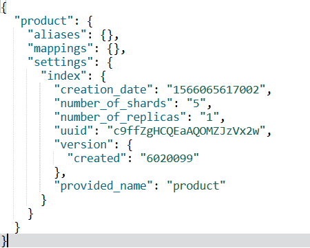
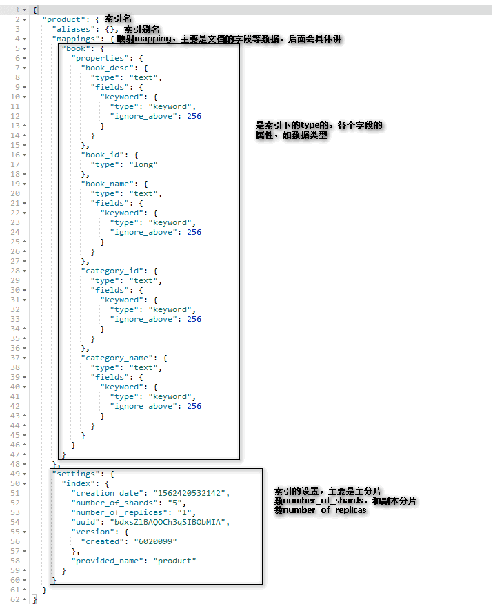
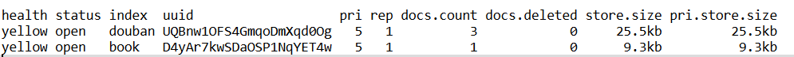
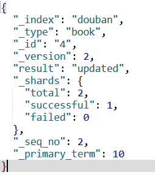

# ES 使用-基本CRUD

::: tip 转载

- [https://www.cnblogs.com/progor/archive/2004/01/13/11548269.html](https://www.cnblogs.com/progor/archive/2004/01/13/11548269.html)

:::

## 索引Index

### 创建索引

语法：

```json
// 语法：
PUT /索引名
{
    index的配置（primary shard的数量等）
}
```

例子：

``` json
// 例子（不带配置信息的话以默认配置创建）【请不要复制这个注释！】：
PUT /product

// 例子（带配置信息的话以配置信息创建）【请不要复制这个注释！】
PUT /product
{
    "settings":{
        "index":{
            "number_of_shards":3,
            "number_of_replicas":1
          }
     }
}
```

在上述的例子中：number_of_shards是主分片的数量；number_of_replicas是副本分片的数量(这里提一下，number_of_replicas副本分片的数量是面向主分片的，所以这个值为1时代表每一个主分片有一个副本分片)。

返回结果：

```json
{
  "acknowledged": true,
  "shards_acknowledged": true,
  "index": "product"
}
```

【在插入一个文档的时候，如果index还没有创建，那么会自动创建，**这时候index的一些配置会采用默认的配置，默认的主分片数量是5，副本分片数量是1**】

### 查看索引

#### 查看单个索引

语法：`GET /索引名`<br />
效果：返回指定索引的信息<br />
例子：`GET /product`<br />
返回结果解析：<br />

<div style="display:flex;"></div>

- aliases：是索引的别名，由于我们没有定义索引别名所以没有数据（索引别名后面再讲）
- mappings：是索引中存储的数据的结构信息，由于上图的索引product中并没有存储document，而且我们也没有指定，所以也为空。mappings定义了文档的字段的数据类型和搜索策略等信息。【后面的知识点】
- settings：索引的配置信息
  - creation_date是创建日期（毫秒级别的时间戳）
  - number_of_shards是主分片数量
  - number_of_replicas是副本分片的数量
  - uuid是索引的id
  - version是索引的版本信息
  - provided_name是索引名

*一个包含了mappings的结果图：*

<div style="display:flex;"></div>

#### 查看所有索引

命令：`GET /_cat/indices?v` <br />
效果：查看所有索引，显示索引的健康状态等信息。<br />
【如果没有v选项，那么就不会有第一行关于该列意义的头部】<br />
返回结果解析：<br />

<div style="display:flex;"></div>

- health: 索引的健康状态（受分片的运行状态影响）【集群管理的知识点】
- status: 索引是开启的还是关闭的
- index: index的名称
- uuid：索引的UUID
- pri: primary shared的数量
- rep: replicated shared的数量
- docs.count: 文档document的数量
- docs.deleted: 被删除的文档document的数量
- store.size：总数据的大小
- pri.store.size：主分片上的数据的大小（这里因为只运行了一个服务节点，所以没有可运行的副本分片，所以总数据大小等于主分片的数据大小）

### 删除索引

语法：`DELETE /索引名`【支持同时删除多个索引，以逗号分割，如DELETE /testindex1,testindex2】<br />
语法例子：`DELETE /product`<br />
返回结果：【当acknowledged为true的时候代表删除成功】<br />

``` json
{
  "acknowledged": true
}
```

### 修改索引

【修改索引主要是修改分片数量、mapping、分词器，*关于mapping和分词器，参考对应文章*】

#### 修改副本分片数量

直接看例子：

```json
PUT /product/_settings
{
  "index":{
    "number_of_replicas":2
  }
}
```

### 关闭索引

关闭索引是为了**避免修改索引的配置时他人进行文档读写**。关闭索引后，就只能获取索引的配置信息，而不能读写索引中的document。有时候也用于关闭一些无用的索引来减少资源消耗。<br />
语法：

- 关闭索引：`POST /索引名/_close`
- 打开索引：`POST /索引名/_open`


### 索引别名

索引别名是一个“别名”，但能够像索引名那样使用，它的使用场景一方面是“使用更简洁的索引名来获取数据”，另一个方面是“通过索引别名来指向索引（别名B指向索引A），方便修改指向的索引，用于解决可能的更换索引的场景（比如你需要统一修改原有索引的信息，那你可以新建索引C，C存储了修改后的数据，更改指向原本索引A的索引别名B指向C）。”

#### 增加索引别名

语法：

```json
POST /_aliases
{
    "actions":[
        {
            "add":{
                "index":"索引名",
                "alias":"索引别名"
            }
        }
    ]
}
```

例子：

```json
POST /_aliases
{
  "actions":[
    {
      "add":{
        "index":"product",
        "alias":"pdt"
      }
    }
    ]
}
```

#### 查看索引别名

- 方法一：通过查看索引来查看索引别名:`GET /product`
- 方式二：通过命令`GET /product/_alias`
- 【索引别名有了就会生效，不信你在`GET /product`的时候直接用上别名】

#### 删除索引别名

语法：

```json
POST /_aliases
{
    "actions":[
        {
            "remove":{
                "index":"索引名",
                "alias":"索引别名"
            }
        }
    ]
}
```

例子：

```json
POST /_aliases
{
  "actions":[
    {
      "remove":{
        "index":"product",
        "alias":"pdt"
      }
    }
    ]
}
```

【你应该看到了，actions里面是一个数组，所以你是可以同时进行多个操作的。】


### 其他

>- 有很多关于index的配置。由于也是一个比较大的知识点（需要一些前置知识，单独在这里讲的话会很空白），将会单独列出来。 - 具体查看  [ES Index-Mapping & Setting](/BigData/ELK/ESIndex-mapping.html#es-mapping) 中的 [Index modules](/BigData/ELK/ESIndex-mapping.html#index-modules)
>- index有个mapping配置，mapping定义整体的index的document的结构，和影响分词策略。由于会影响搜索，所以把这个归为搜索的分支知识点，将留到搜索篇再谈。 - 具体查看  [ES Index-Mapping & Setting](/BigData/ELK/ESIndex-mapping.html#es-mapping) 中的 [ES Mapping](/BigData/ELK/ESIndex-mapping.html#es-mapping)


### 总结

本小节讲了如何创建索引，如何查看索引、如何删除索引、如何修改索引（修改副本分片数量）、如何关闭/开启索引、如何定义索引别名。
目的在于介绍如何创建存储document的逻辑结构--索引，虽然我们有时候是不需要手动显示创建索引的，但手动创建是个必须了解的知识，因为mapping和分词器有时候需要手动来指定。


## 文档document

文档的格式是json式的。对于文档，有几个主要的标识信息：`_index(插入到哪个索引中)`, `_type(插入到哪个类型中)`（*废弃*）, `_id(文档的id是多少)`，在插入一个文档的时候，这几个信息也是必须的。

### 插入文档

语法：

```json
PUT /index/type/id
json格式的数据
```

例子：

```json
PUT /douban/book/4
{
	"book_id":4,
	"book_name":"Other Voices, Other Rooms",
	"book_author":"Truman Capote",
	"book_pages":240,
	"book_express":"Vintage",
	"publish_date":"1994-02-01",
	"book_summary":"""
  Truman Capote’s first novel is a story of almost supernatural intensity and inventiveness, an audacious foray into the mind of a sensitive boy as he seeks out the grown-up enigmas of love and death in the ghostly landscape of the deep South.
  
  At the age of twelve, Joel Knox is summoned to meet the father who abandoned him at birth. But when Joel arrives at the decaying mansion in Skully’s Landing, his father is nowhere in sight. What he finds instead is a sullen stepmother who delights in killing birds; an uncle with the face—and heart—of a debauched child; and a fearsome little girl named Idabel who may offer him the closest thing he has ever known to love."""
}
```

结果解析：

<div style="display:flex;"></div>

- `_index`：插入到哪个index中。
- `_type`：插入到哪个type中。
- `_id`：插入的文档的id是多少。
- `_version`：版本，对这个ID的文档的操作次数
- result：操作结果，第一次操作时created，上图中因为我忘记截图了，所以重新插入了一次，所以时updated
- _shards：
  - total:总共有多少个shard
  - successful:成功多少个，【由于写操作只会发生在primary shard中，所以这里为1，另一个shard时replica shard，不发生写操作】
  - failed:失败多少个

### 查询指定文档

语法：

```json
GET /index/type/id
```

例子：

```json
GET /douban/book/1
```

结果解析：

<div style="display:flex;"></div>

### 更新文档

语法：

```json
// 全替换(覆盖)式更新：会使用新的json数据直接覆盖原有的【请不要复制注释】
PUT /index/type/id
json数据

// 部分替换式更新：只会覆盖指定数据
POST /index/type/id/_update
{
  "doc": {
    "需要修改的字段": "修改值"
    [,"需要修改的字段": "修改值"]
  }
}
```

例子：

```json
【全替换语句与插入差不多，所以不举例了】

POST /douban/book/4/_update
{
  "doc": {
    "book_pages":241,
    "publish_date":"1994-02-02"
  }
}
```

结果解析：

返回结果与插入时大概一致，不同的时result变成了updated

### 删除文档

语法：

```json
DELETE /index/type/id
```

例子：
【删除后可以重新执行插入语句恢复数据】

```json
DELETE /douban/book/4
```

结果解析：

返回结果与插入时大概一致，不同的时result变成了deleted.

### 查询所有文档

语法：

```json
GET /index/type/_search

GET /index/type/_search
{
  "query":{
    "match_all": {}
  }
}
```

例子:

```json
GET /douban/book/_search

GET /douban/book/_search
{
  "query":{
    "match_all": {}
  }
}
```

### 说明

> 上面知识介绍了关于文档的CRUD基本操作，很多相关的其他操作在单独的章节里面，例如文档的数据类型、文档的搜索等 。。。


<style scoped>
  h3 {
      text-decoration: underline;
  }
  h4{
    	color: #00578a;
  }
</style>