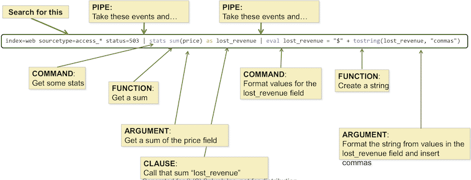
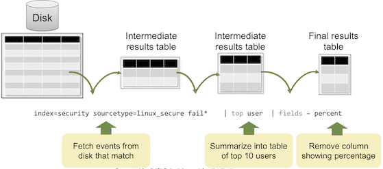
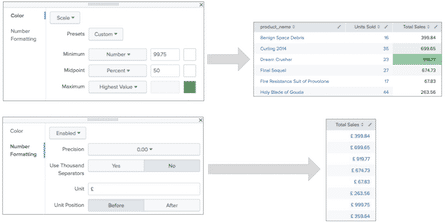

# Splunk Start

::: tip 官网Trainning
https://www.splunk.com/en_us/training.html
:::

Splunk作为一款商业软件，市面上学习的文档并不多，主要还是靠官方的learning课程。所以本文旨在根据官网的学习视频/文档，梳理并翻译知识要点。

官网的[Trainning](https://www.splunk.com/en_us/training.html)页面，根据使用者的不同需求有一系列的“**Learning Paths**”（但基本上所有path的前几部分基础课程都是一样的） - 这里我们以“**For Splunk Users**”的课程为我们的入门基础。主要包括下面几个部分course：
- Splunk Fundamentals 1
- Splunk Fundamentals 2
- Creating Dashboards with Splunk
- Splunk Fundamentals 3
- Advanced Searching and Reporting with Splunk
- Infastructure Overview


<br>

## Splunk Fundamentals 1 要点梳理

官方的Course Topics包括：
- Introduction to Splunk's interface
- Basic searching
- Using fields in searches
- Search fundamentals
- Transforming commands
- Creating reports and dashboards
- Datasets
- The Common Information Model (CIM)
- Creating and using lookups
- Scheduled Reports
- Alerts
- Using Pivot


具体请看：[官网pdf教程文档](http://heyan.site/download/Splunk%207.x%20Fundamentals%20Part%201%20%28eLearning%29-unlock.pdf)


### Splunk 介绍

#### How is Splunk deployed?

- Splunk Enterprise
  - Splunk components installed and administered on-promises
- Splunk Cloud
  - Splunk Enterprise as a scalable service
  - No infrastructure required
- Splunk Lite
  - Solution for small IT environments

#### What are Splunk Enhanced Solutions ？

- Splunk IT Service Intelligence (ITSI)
  - Next generation monitoring and analytics solution for IT Ops
  - Uses machine learning and event analytics to simplify operations and prioritize problem resolution
- Splunk Enterprise Security (ES)
  - Comprehensive Security Information and Event Management (SIEM) solution
  - Quickly detect and respond to internal and external attacks 
- Splunk User Behavior Analytics (UBA)
  - Finds known, unknown, and hidden threats by analyzing user behavior and flagging unusual activity

#### Users and Roles

- Splunk users are assigned roles, which determine their capabilities and data access
- Out of the box, there are 3 main roles: 
  - Admin
  - Power
  - User
- Splunk admins can create additional roles


### Splunk Components

Splunk由三个主要组件构成：**Indexer**, **Search Head**, **Forwarder**

#### Indexer

- Processes machine data, storing the results in indexes as events, enabling fast search and analysis
- As the Indexer indexes data, it creates a number of files organized in sets of directories by age
  - Contains raw data (compressed) and indexes (points to the raw data)

<div style="display:flex;"></div>

#### Search Heads

- Allows users to use the Search language to search the indexed data
- Distributes user search requests to the Indexers
- Consolidates the results and extracts field value pairs from the events to the user
- Knowledge Objects on the Search Heads can be created to extract additional fields and transform the data without changing the underlying index data

<div style="display:flex;"></div>

Search Heads also provide tools to enhance the search experience such as reports, dashboards and visualizations

<div style="display:flex;"></div>

#### Forwarders

- Splunk Enterprise instances that consume and send data to the index
- Require minimal resources and have little impact on performance
- Typically reside on the machines where the data originates
- Primary way data is supplied for indexing

<div style="display:flex;"></div>

<br>

#### 其他Splunk组件

In addition to the three main Splunk processing components, there are some less-common components including :

- **Deployment**
- **Cluster Master** 
- **License Master Server**

### Splunk Deployment

#### Standalone

- Single Server
  - All functions in a single instance of Splunk
  - For testing, proof of concept, personal use, and learning
  - This is what you get when you download Splunk and install with default settings

<div style="display:flex;"></div>

#### Basic

- **Splunk server**
  - Similar to server in standalone configuration
  - Manage deployment of forwarder configurations

- **Forwarders**
  - Forwarders collect data and send it to Splunk servers
  - Install forwarders at data source (usually production servers)

<div style="display:flex;"></div>

#### Multi-Instance

- Increases indexing and searching capacity
- Search management and index functions are split across multiple machines

<div style="display:flex;"></div>

#### Increasing Capacity

- Adding a Search Head Cluster:
  - Services more users for increased search capacity
  - Allows users and searches to share resources
  - Coordinate activities to handle search requests and distribute the requests across the set of indexers
- Search Head Clusters require a minimum of three Search Heads
- A Deployer is used to manage and distribute apps to the members of the Search Head Cluster

<div style="display:flex;"></div>

#### Index Cluster

- Traditional Index Clusters
  - Configured to replicate data
  - Prevent data loss
  - Promote availability
  - Manage multiple indexers
- Non-replicating Index Clusters
  - Offer simplified management
  - Do not provide availability or data recovery

<div style="display:flex;"></div>


### Splunk 安装

There are multiple Splunk components installed from the Splunk Enterprise package

<div style="display:flex;"></div>


### Getting Data In

#### Splunk Index Time Process

Splunk index time process (data ingestion) can be broken down into three phases:

- **Input phase**: handled at the source (usually a forwarder)
  - The data sources are being opened and read
  - Data is handled as streams and any configuration settings are applied to the entire stream
- **Parsing phase**: handled by indexers (or heavy forwarders)
  - Data is broken up into events and advanced processing can be performed
- **Indexing phase**
  - License meter runs as data and is initially written to disk, prior to compression
  - After data is written to disk, it **cannot** be changed

<div style="display:flex;"></div>

#### Data Input Types

- Splunk supports many types of data input
  - Files and directories; Network data; Script output; Windows logs; HTTP; And more ...
- You can add data inputs with
  - Apps and add-ons from Splunkbase
  - Splunk Web
  - CLI
  - Directly editing **inputs.conf**


### Splunk’s Search Language

#### Search Language Syntax - 语法

This diagram represents a search, broken into its syntax components:

<div style="display:flex;"></div>

Searches are made up of 5 basic components：

- **Search terms** – what are you looking for? 
  - Keywords, phrases, Booleans, etc.
- **Commands** – what do you want to do with the results?
  - Create a chart, compute statistics, evaluate and format, etc.
- **Functions** – how do you want to chart, compute, or evaluate the results? 
  - Get a sum, get an average, transform the values, etc.
- **Arguments** – are there variables you want to apply to this function?
  - Calculate average value for a specific field, convert milliseconds to seconds, etc.
- **Clauses –** how do you want to group or rename the fields in the results?
  - Give a field another name or group values by or over

#### The Search Pipeline

<br >

<div style="display:flex;"></div>

**Making the Pipeline More Readable**

- Put each pipe in the pipeline on a separate line as you type by turning on auto-formatting
- Go to **Preferences > SPL Editor** and turn on Search auto-format

#### 语法颜色

- By default, some parts of the search string are automatically colored as you type
- The color is based on the search syntax
- The rest of the search string remains black

规则：

- **BOOLEAN OPERATORS** and **COMMAND MODIFIERS** are in **orange**
- **COMMANDS** are in **blue**
- **COMMAND ARGUMENTS** are in **green**
- **FUNCTIONS** are in **purple**

> Example: 
>
> index=web (sourcetype=acc* <font color="orange" style="font-weight:bold">OR</font> sourcetype=ven*) action=purchase status<400 | <font color="blue" style="font-weight:bold">timechart</font> <font color="green" style="font-weight:bold">span</font>=1h <font color="purple" style="font-weight:bold">sum</font>(price) <font color="orange" style="font-weight:bold">by</font> sourcetype

另外：

> - You can turn off automatic syntax coloring
>   1. Go to **Preferences** > **SPL Editor**
>   2. Choose the Themes tab and select Black on White instead of the Light Theme default
>   3. Click Apply
> - You can also display colored text against a black background by selecting Dark Theme

#### Creating a Table

- table command returns a table formed by only fields in the argument list
- Columns are displayed in the order given in the command
  - Column headers are field names
  - Each row represents an event
  - Each row contains field values for that event

> *Scenario*:
>
> Display the clientip, action, productId, and status of customer interactions in the online store for the last 4 hours
>
> ```sql
> index=web sourcetype=access_combined
> | table clientip, action, productId, status
> ```

#### Renaming Fields in a Table

> *Scenario*:
>
> Display the clientip, action, productId, and status of customer interactions in the online store for the last 4 hours
>
> ```sql
> index=web sourcetype=access_combined
> | table clientip, action, productId, status 
> | rename productId as ProductID, 
>   action as "Customer Action", 
>   status as "HTTP Status"
> | table "Customer Action", "HTTP Status"
> ```

#### fields Command

- Field extraction is one of the most costly parts of a search
- fields command allows you to include or exclude specified fields in your search or report
- To include, use fields + (default) 
  - Occurs before field extraction
  - Improves performance
- To exclude, use fields -
  - Occurs after field extraction
  - No performance benefit
  - Exclude fields used in search to make the table/display easier to read

> **Using command improves performance—only specified fields extracted**
>
> *Scenario*:
>
> Display network failures during the previous week. Retrieve only user, app, and src_ip.
>
> ```sql
> index=security
> sourcetype=linux_secure
> (fail* OR invalid)
> | fields user, app, src_ip
> ```

#### dedup Command

Use dedup to remove duplicates from your results

> *sample:*
>
> ``` sql
> index=sales sourcetype=vendor_sales Vendor=Bea* 
> | dedup Vendor	-- 如果vendor数据相同而其他列有不同，只会保留此vendor的第一条数据
> | table Vendor, VendorCity, VendorStateProvince, VendorCountry
> ```

#### sort Command

- Use sort to order your results in + ascending (default) or – descending
- To limit the returned results, use the limit option

> ``` sql
> ... | sort limit=20 –categoryId, product_name
> ... | sort 20 count
> ```

- sort -/+{*fieldname*} sign followed by fieldname sorts results in the sign's order
- sort -/+ {*fieldname*} sign followed by **space** and then fieldname applies sort order to **all** following fields without a different explicit sort order

> ``` sql
> index=sales sourcetype=vendor_sales
> Vendor=Bea*
> | dedup Vendor, VendorCity
> | table Vendor, VendorCity, VendorStateProvince, VendorCountry
> | sort –Vendor, VendorCity --没有空格的,相当于：order by (Vendor，VendorCity) desc
> ```
>
> ```sql
> index=sales sourcetype=vendor_sales
> Vendor=Bea*
> | dedup Vendor, VendorCity
> | table Vendor, VendorCity, VendorStateProvince, VendorCountry
> | sort – Vendor, VendorCity --有空格的,相当于：order by Vendor desc, VendorCity asc
> ```


### Transforming Commands

#### top Command

- By default, returns top 10 results
- Automatically returns count and percent columns (自动添加并返回count和百分比这两列)
- Common constraints: **limit** **countfield** **showperc**
- top command with limit=20 is automatically added to your search string when you click Top values in a field window

#### top Command – Single Field

- Control # of results displayed using limit
- limit=*#* returns this number of results
- limit=0 returns unlimited results

> *Scenario:*
>
> During the last hour, display the top 5 IPs that generated the most attacks.
>
> ``` sql
> index=security sourcetype=linux_secure
> (fail* OR invalid)
> | top limit=5 src_ip
> ```

#### top Command – Multiple Fields

- If the showperc is not included – or it is included and set to t – a percent column is displayed (*如果语句中没有写showperc约束，或者写了这个约束同时设置为t(true)，那么列：percent会显示在返回结果中*)
- If showperc=f, then a percent column is NOT displayed (*如果设置了showperc=f，则不会显示percent列*)

> *Scenario:*
>
> Display the top 3 common values for users and web categories browsed during the last 24 hours.
>
> ``` sql
> index=network sourcetype=cisco_wsa_squid
> | top cs_username x_webcat_code_full limit=3
> -- 结果会显示三行数据，包含四列:cs_username,x_webcat_code_full,count,percent
> ```

#### top Command – Single Field with by Clause

> *Scenario 1:*
>
> Display the top 3 web categories browsed by each user during the last 24 hours.
>
> ``` sql
>  index=network sourcetype=cisco_wsa_squid
>  | top x_webcat_code_full by cs_username limit=3
> ```

> *Scenario 2:*
>
> Display the top 3 users for each web category during the last 24 hours.
>
> ``` sql
> index=network sourcetype=cisco_wsa_squid
> | top cs_username by x_webcat_code_full limit=3
> ```

#### top Command – Renaming countfield Display

- By default, the display name of the countfield is count
- countfield=*string* renames the field for display purposes

> *Scenario*:
>
> Display the top 3 user/web categories combinations during the last 24 hours. Rename the count field and show count, but not the percentage.
>
> ``` sql
> index=network sourcetype=cisco_wsa_squid
> | top cs_username x_webcat_code_full limit=3
> countfield="Total Viewed" showperc=f		--就是修改count的显示名
> ```

#### rare Command

- The rare command returns the least common field values of a given field in the results
- Options are identical to the top command

> *Scenario*:
>
> Identify which product is the least sold by Buttercup Games vendors over the last 60 minutes.
>
> ``` sql
> index=sales sourcetype=vendor_sales
> | rare product_name showperc=f limit=1 --显示最新的一条数据
> ```

#### stats Command

- stats enables you to calculate statistics on data that matches your search criteria
- Common functions include:
  - count – returns the number of events that match the search criteria
  - distinct_count, dc – returns a count of unique values for a given field - sum – returns a sum of numeric values
  - avg – returns an average of numeric values
  - list – lists all values of a given field
  - values – lists unique values of a given field

**stats Command – count**

- count returns the number of matching events based on the current search criteria

> *Scenario*:
>
> Count the invalid or failed login attempts during the last 60 minutes.
>
> ``` sql
> index=security sourcetype=linux_secure
> (invalid OR failed)
> | stats count
> ```
>
> ``` sql
> index=security sourcetype=linux_secure
> (invalid OR failed)
> | stats count as "Potential Issues"
> ```

**stats Command – count(*field*)**

- Adding a *field* as an argument to the count function returns the number of events where a value is present for the specified field

> *Scenario*:
>
> Count the number of events during the last 15 minutes that contain a vendor action field. Also count the total events.
>
> ``` sql
> index=security sourcetype=linux_secure
> | stats count(vendor_action) as ActionEvents,
> count as TotalEvents
> ```

**stats Command – by *fields***

- by clause returns a count for each value of a named field or set of fields

> *Scenario*:
>
> Count the number of events by user, app, and vendor action during the last 15 minutes.
>
> ``` sql
> index=security sourcetype=linux_secure
> | stats count by user, app, vendor_action --相当于sql的count(1) group by xxx
> ```

**stats Command – distinct_count(*field*)**

- distinct_count() or dc() provides a count of how many unique values there are for a given field in the result set

> *Scenario*:
>
> How many unique websites have employees visited in the last 4 hours?
>
> ``` sql
> index=network sourcetype=cisco_wsa_squid
> | stats dc(s_hostname) as "Websites visited:"
> ```

**stats Command – sum(*field*)**

> *Scenario*:
>
> How much bandwidth did employees consume at each website during the past week?
>
> ``` sql
> index=network sourcetype=cisco_wsa_squid
> | stats sum(sc_bytes) as Bandwidth by s_hostname
> | sort -Bandwidth
> ```

> *Scenario*:
>
> Report the number of retail units sold and sales revenue for each product during the previous week.
>
> ``` sql
> index=sales sourcetype=vendor_sales
> | stats count(price) as "Units Sold"
> sum(price) as "Total Sales" by product_name  --相当于sql的 count(),sum() group by xxx
> | sort -"Total Sales"
> ```

**stats Command – avg(*field*)**

> *Scenario*:
>
> What is the average bandwidth used for each website usage type?
>
> ``` sql
> index=network sourcetype=cisco_wsa_squid
> | stats avg(sc_bytes) as "Average Bytes" by usage
> ```

**stats Command – list(*field*)**

- list function lists all field values for a given field

> Which websites has each employee accessed during the last 60 minutes?
>
> ``` sql
> index=network sourcetype=cisco_wsa_squid
> | stats list(s_hostname) as "Websites visited:"
>   by cs_username
> ```
>
> <div style="display:flex;"></div>

**stats Command – values(*field*)**

- values function lists unique values for the specified field

> *Scenario*:
>
> Display by IP address the names of users who have failed access attempts in the last 60 minutes.
>
> ``` sql
>  index=security sourcetype=linux_secure fail*
>  | stats values(user) as "User Names",
>   count(user) as Attempts by src_ip
> ```
>
> <div style="display:flex;"></div>

#### Formatting stats Tables

- Tables created with stats commands can be formatted
- Color code data in each column, based on rules you define
- Add number formatting (e.g. currency symbols, thousands separators)
- Can also format data on a per- column basis by clicking the icon above that column (没个列名上的笔一样的图标)

<div style="display:flex;"></div>


### Creating Reports and Dashboards

查看原文 - [官网pdf教程文档](http://heyan.site/download/Splunk%207.x%20Fundamentals%20Part%201%20%28eLearning%29-unlock.pdf)

### Pivot & Datasets

查看原文 - [官网pdf教程文档](http://heyan.site/download/Splunk%207.x%20Fundamentals%20Part%201%20%28eLearning%29-unlock.pdf)

### Creating and Using Lookups

查看原文 - [官网pdf教程文档](http://heyan.site/download/Splunk%207.x%20Fundamentals%20Part%201%20%28eLearning%29-unlock.pdf)

### Creating Scheduled Reports and Alerts

查看原文 - [官网pdf教程文档](http://heyan.site/download/Splunk%207.x%20Fundamentals%20Part%201%20%28eLearning%29-unlock.pdf)


###  Other Resources

- Splunk App Repository
  - [https://splunkbase.splunk.com/](https://splunkbase.splunk.com/)
- Splunk Answers
  - [http://answers.splunk.com/](http://answers.splunk.com/)
- Splunk Blogs
  - [http://blogs.splunk.com/](http://blogs.splunk.com/)
- Splunk Wiki
  - [http://wiki.splunk.com/](http://wiki.splunk.com/)
- Splunk Docs
  - [http://docs.splunk.com/Documentation/Splunk](http://docs.splunk.com/Documentation/Splunk)
- Splunk User Groups
  - [http://usergroups.splunk.com/](http://usergroups.splunk.com/)