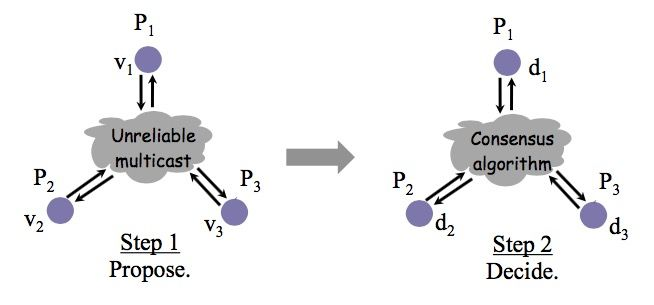
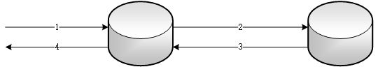
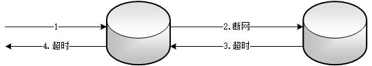
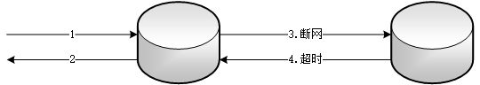
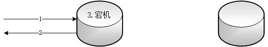

# 一致性算法(... Paxos、Raft、ZAB)

::: tip 此文为转载 （通常一篇文章会参考多处，也会添加自己的理解，引用地址如有遗漏，请指出）

- https://www.zhihu.com/question/29001093?sort=created
- https://www.cnblogs.com/binyue/p/8645565.html
- https://zhuanlan.zhihu.com/p/31727291
- https://blog.csdn.net/chao2016/article/details/81087923
- https://www.cnblogs.com/smileIce/p/11221765.html
- https://www.cnblogs.com/cac2020/p/9481121.html
- Others ... 

:::

 

## 关于一致性算法的延伸

:::warning 延伸阅读 - 一致性算法

**(1)**

分布式一致算法需要考虑场景。

一般计算机系统做状态管理或者多副本，假设是系统组件的行为不是任意的，通俗的说，你可以宕机可以断网可以延时，但是不能撒谎。这种场景下主要是Paxos及其变种，Raft经常被单拿出来是因为它的形式相对更容易理解。从软件角度说，etcd, zookeeper，都是采用此类一致性算法。

上述场景也其实是非拜占庭场景，想了解拜占庭是什么请GOOGLE拜占庭将军问题。在拜占庭场景下，简单地说，参与一致性共识的节点可以任意行为，那么几乎所有的协议都可以说是PBFT的变种，PBFT是实用拜占庭容错的简写。具体实现也很多。

其它答案提到了比特币的POW，Proof-Of-Work，是一种思路简单但是效果拔群的一致性算法，它的假设符合拜占庭将军假设，但是解决思路不是典型PBFT的思路。其它的还有Proof-Of-Stake，也是一种。它们各自有优缺点，实用的场景也不一样。

随着最近区块链技术的火热，拜占庭场景下的一致性算法有了很多实际的应用或者论文，提几个最近比较火的，Ripple协议，Tendermint协议，Stellar协议，有兴趣可以下载论文去看。就说这么多了。

**(2)**

个人觉得叫容错分布式一致性协议更合适，当然这里容错俩字很关键，而且暗含是通常所说的复制状态机的强一致性需求(比如线性一致性)。

一致性本身是个应用广泛的概念，比如并发编程、数据库事务处理、缓存一致性等等。其他很多算法也可以解决某些场景下(对系统模型的假设条件强弱)、对一致性的不同要求(比如线性、序列、因果、最终等等)。比如：2PC无法容错但能解决强一致性；并发编程中的内存序通常来说保证happen-before的因果序。所以不同应用场景对一致性的要求是不同的。

Paxos这个名字应该是被普遍当做了类Paxos算法。其实在Paxos之前类似多数派等概念就已经有了，而且像vsync中的gbcast、view stamped replication等等其实也是在Leslie Lamport的Basic Paxos算法之前的。并且gbcast和Basic Paxos虽然可以互相转化，但是是有本质区别的，所以严格来说不能叫做"Paxos算法"。当然，后续的Multi-Paxos、Zab、Raft可以看做是在异步网络、crash failure的系统模型下对强一致性的需求在Basic Paxos上做的一些演进与优化吧。

所以，我觉得对于一致性相关的问题，还是需要从问题本身的场景需求和解决这个场景需求下的相关算法历史来更客观地理解。包括其他回答中提到的应用逐渐多起来的拜占庭将军问题的应用。

**(3)**

一致性这个翻译是有问题的， 应该用共识比较好:	consistency vs consensus

一致性容易混淆使用replication 方法多备份数据来防止数据丢失的情况。共识系统则很清晰， 就是多个参与者针对某一个议题达成一致意见。

:::

 

## **分布式一致性 (Consensus)**

### 理解1

分布式一致性问题，简单的说，就是在一个或多个进程提议了一个值应当是什么后，使系统中所有进程对这个值达成一致意见。 这样的协定问题在分布式系统中很常用，比如：

- 领导者选举（leader election）：进程对leader达成一致；
- 互斥（mutual exclusion）：进程对进入临界区的进程达成一致；
- 原子广播（atomic broadcast）：进程对消息传递（delivery）顺序达成一致。

对于这些问题有一些特定的算法，但是，分布式一致性问题试图探讨这些问题的一个更一般的形式，如果能够解决分布式一致性问题，则以上的问题都可以解决。 分布式一致性问题的定义如下图所示：

为了达成一致，每个进程都提出自己的提议（propose），最终通过分布式一致性算法，所有正确运行的进程决定（decide）相同的值。

如果在一个不出现故障的系统中，很容易解决分布式一致性问题。但是实际分布式系统一般是基于消息传递的异步分布式系统，进程可能会慢、被杀死或者重启，消息可能会延迟、丢失、重复、乱序等。 在一个可能发生上述异常的分布式系统中如何就某个值达成一致，形成一致的决议，保证不论发生以上任何异常，都不会破坏决议的一致性，这些正是一致性算法要解决的问题。

### 理解2

**分布式一致性处理的是节点失效情况（即可能消息丢失或重复，但无错误消息）的共识达成（Consensus）问题**。

> 关于无错误消息，延伸：
>
> 区块链首先是一个大规模分布式系统，共识问题本质就是分布式系统的一致性问题，但是又有很大的不同。
>
> 工程开发中，认为系统中存在故障（fault），但不存在恶意（corrupt）节点，而区块链，特别是公开链是落地到物理世界中，涉及到人性和利益关系，不可避免的存在信任以及恶意攻击问题。

## **分布式一致性算法典型应用场景**

### 多副本一致性

这是分布式一致性算法的一个典型应用场景。在分布式存储系统中经常使用多副本的方式实现容错，这样部分副本的失效不会导致数据的丢失。当然，前提是每次更新操作都需要更新数据的所有副本，使多个副本的数据保持一致。

> 那么，如何在一个可能出现各种故障的异步分布式系统中保证同一数据的多个副本的一致性 (Consistency) 呢？

### 两副本的例子

我们在分布式存储系统中经常使用多副本的方式实现容错，每一份数据都保存多个副本，这样部分副本的失效不会导致数据的丢失。每次更新操作都需要更新数据的所有副本，使多个副本的数据保持一致。那么问题来了，如何在一个可能出现各种故障的异步分布式系统中保证同一数据的多个副本的一致性 (Consistency) 呢？ **以最简单的两副本为例，首先来看看传统的主从同步方式。**

写请求首先发送给主副本，主副本同步更新到其它副本后返回。这种方式可以保证副本之间数据的强一致性，写成功返回之后从任意副本读到的数据都是一致的。但是可用性很差，只要任意一个副本写失败，写请求将执行失败。主从同步的弱可用性： 

 

**如果采用主从异步复制的方式，主副本写成功后立即返回，然后在后台异步的更新其它副本。**

写请求首先发送给主副本，主副本写成功后立即返回，然后异步的更新其它副本。这种方式可用性较好，只要主副本写成功，写请求就执行成功。但是不能保证副本之间数据的强一致性，写成功返回之后从各个副本读取到的数据不保证一致，只有主副本上是最新的数据，其它副本上的数据落后，只提供最终一致性。可能出现以下两种失效的情况：

1) 如果出现断网导致后台异步复制失败，则主副本和其它副本将长时间不一致，其它副本上的数据一直无法更新，直到网络重新连通。

2) 如果主副本在写请求成功返回之后和更新其它副本之前宕机失效，则会造成成功写入的数据丢失，一致性被破坏。

 

### **Oracle中的应用**

熟悉Oracle的朋友应该对上述同步方式非常熟悉，上述同步和异步复制方式分别对应Oracle Data Guard的一种数据保护模式。

- 同步复制为最高保护模式 (Maximum Protection)；
- 异步复制为最高性能模式 (Maximum Performance)；
- 还有一种最高可用性模式 (Maximum Availability) 介于两者之间，在正常情况下，它和最高保护模式一样，但一旦同步出现故障，立即切换成最高性能模式。

### CAP理论

传统的主从同步无法同时保证数据的一致性和可用性，此问题是典型的分布式系统中一致性和可用性不可兼得的例子，分布式系统中著名的CAP理论从理论上证明了这个问题。 而Paxos、Raft等分布式一致性算法则可在一致性和可用性之间取得很好的平衡，在保证一定的可用性的同时，能够对外提供强一致性，因此Paxos、Raft等分布式一致性算法被广泛的用于管理副本的一致性，提供高可用性。

## 再谈CAP

关于定义，参考前文。

### **理解CAP理论**

最简单的方式是想象两个副本处于分区两侧，即两个副本之间的网络断开，不能通信。1）如果允许其中一个副本更新，则会导致数据不一致，即丧失了C性质。2）如果为了保证一致性，将分区某一侧的副本设置为不可用，那么又丧失了A性质。3）除非两个副本可以互相通信，才能既保证C又保证A，这又会导致丧失P性质。

### **注意CAP误区**

- 首先，CAP理论不是一个“三选二”的公式。一般来说使用网络通信的分布式系统，无法舍弃P性质，那么就只能在一致性和可用性上做一个艰难的选择。 
- 再者，CAP理论也不是“二选一”的选择题，它提示分布式系统设计者应该根据实际需求在一致性和可用性上做一个平衡。

这么说的原因，是这三种性质都是可以在程度上衡量的，并不是非黑即白的有或无。1）可用性显然是在0%到100%之间连续变化的；2）一致性分很多级别；3）分区也可以细分为不同含义，如系统内的不同部分对于是否存在分区可以有不一样的认知。

所以一致性和可用性并不是水火不容，非此即彼的。Paxos、Raft等分布式一致性算法就是在一致性和可用性之间做到了很好平衡的见证。

## 一致性模型

关于其理论分类参考[事务、ACID、CAP、一致性、BASE](https://heyan.site:8001/DistributedSystem/ACID-CAP-%E4%B8%80%E8%87%B4%E6%80%A7-BASE.html)

这里简单归类：

- 弱一致性
  - 最终一致性
    - DNS（Domain Name System）
    - Gossip（Cassandra的通信协议）
- 强一致性
  - 同步
  - Paxos
  - Raft（Mutiple Paxos）
  - ZAB（Mutiple Paxos）

somethings to be added ...

## **两阶段和三阶段提交**

to be added ...

## **Paxos 算法**

to be added ...

## **Raft算法	(简化版multi paxos)**

to be added ...

## **ZAB算法	(也是实现了简化版multi paxos)**

to be added ...