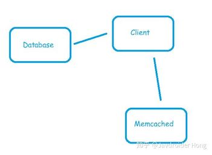
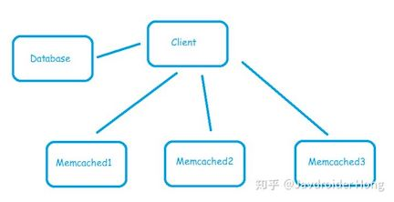
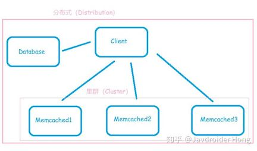
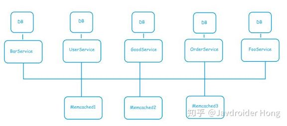

# 分布式与集群

::: tip 此文为转载 （通常一篇文章会参考多处，也会添加自己的理解，引用地址如有遗漏，请指出）

- https://juejin.im/post/5b83466b6fb9a019b421cecc
- https://blog.csdn.net/u013755520/article/details/99693705
- https://www.zhihu.com/question/20004877

:::

 

此处引用了三处文章，帮助从不同的角度和例子来理解分布式和集群。

## 理解1

### **什么是集群**

**集群技术特点：**

- 通过多台计算机完成同一个工作，达到更高的效率。
- 两机或多机内容、工作过程等完全一样。如果一台死机，另一台可以起作用。

*举个例子：*

> 小周在公司写Java程序，但公司业务在发展，一个Java开发者可能忙不过来，小周有的时候也得请个假呀。于是请了3y过去一起做Java开发。平时小周和3y就写Java程序，但3y可能有事要回学校一趟。没事，公司还有小周做Java开发呢，公司开发还能继续运作。 3y跟小周都是做Java开发。 3y来了，小周的工作可以分担一些。 3y请假了，还有小周在呢。 
>
> 我写了一个910便利网发布到服务器去了，现在越来越多的人访问了，访问有点慢，怎么办？？？很简单，(只有充钱才能变强)，加配置吧(加cpu，加内存)。升级完配置之后，访问人数越来越多，于是发现又不禁用啦，在这台机器上加配置已经解决不了了，怎么办？？？很简单，(只有充钱才能变强)，我再买一台服务器，将910便利网也发布到新买的这台服务器上去。
>
> **特点: 这两台服务器都是运行同一个系统--->910便利网**
>
> **好处:**
>
> 本来只有一台机器处理访问，现在有两台机器处理访问了，分担了压力。
>
> 如果其中一台忘记缴费了，暂时用不了了。没关系，还有另一台可以用呢。

**集群：同一个业务，部署在多个服务器上(不同的服务器运行同样的代码，干同一件事)**

### **什么是分布式**

分布式系统是一组计算机，通过网络相互连接传递消息与通信后并协调它们的行为而形成的系统。组件之间彼此进行交互以实现一个共同的目标。

*举个例子：*

> 现在公司有小周和3y一起做Java开发，做Java开发一般jQuery，AJAX都能写一点，所以这些活都由我们来干。可是呢，3y对前端不是很熟，有的时候调试半天都调不出来。老板认为3y是真的菜！于是让小周专门来处理前端的事情。这样3y就高兴了，可以专心写自己的Java，前端就专门交由小周负责了。于是，小周和3y就变成了协作开发。 3y对前端不熟(能写出来)，但在调试的时候可能会花费很多时间 小周来专门做前端的事，3y可以专心写自己的Java程序了。 都是为了项目正常运行以及迭代。 
>
> 我的910便利网已经部署到两台服务器去了，但是越来越多的人去访问。现在也逐渐承受不住啦。那现在怎么办啊？？那继续充钱变强？？作为一个理智的我，肯定得想想是哪里有问题。现在910便利网的模块有好几个，全都丢在同一个Tomcat里边。 其实有些模块的访问是很低的(比如后台管理)，那我可不可以这样做：将每个模块抽取独立出来，访问量大的模块用好的服务器装着，没啥人访问的模块用差的服务器装着。这样的好处是：一、资源合理利用了(没人访问的模块用性能差的服务器，访问量大的模块单独提升性能就好了)。二、耦合度降低了：每个模块独立出来，各干各的事(专业的人做专业的事)，便于扩展
>
> **特点：**
>
> 将910便利网的功能拆分，模块之间独立，在使用的时候再将这些独立的模块组合起来就是一个系统了。
>
> **好处：**
>
> 模块之间独立，各做各的事，便于扩展，复用性高
>
> 高吞吐量。某个任务需要一个机器运行10个小时，将该任务用10台机器的分布式跑(将这个任务拆分成10个小任务)，可能2个小时就跑完了

**分布式：一个业务分拆多个子业务，部署在不同的服务器上(不同的服务器，运行不同的代码，为了同一个目的)**

### **总结**

- **分布式**：不同模块部署在不同服务器上 	
  - 作用：分布式解决网站高并发带来问题
- **集群**：多台服务器部署相同应用构成一个集群 	
  - 作用：通过负载均衡设备共同对外提供服务
- **SOA**：业务系统分解为多个组件，让每个组件都独立提供离散，自治，可复用的服务能力，通过服务的组合和编排来实现上层的业务流程 	
  - 作用：简化维护,降低整体风险,伸缩灵活
- **微服务**：架构设计概念,各服务间隔离（分布式也是隔离）,自治（分布式依赖整体组合）其它特性(单一职责,边界,异步通信,独立部署)是分布式概念的跟严格执行SOA到微服务架构的演进过程 	
  - 作用：各服务可独立应用，组合服务也可系统应用

## 理解2

其实分布式不一定就是不同的组件，同一个组件也可以，关键在于**是否通过交换信息的方式进行协作**。比如说Zookeeper的节点都是对等的，但它自己就构成一个分布式系统。

也就是说，分布式是指通过网络连接的多个组件，通过交换信息协作而形成的系统。而集群，是指同一种组件的多个实例，形成的逻辑上的整体。

可以看出这两个概念并不完全冲突，分布式系统也可以是一个集群，例子就是前面说的zookeeper等，它的特征是服务之间会互相通信协作。是分布式系统不是集群的情况，就是多个不同组件构成的系统；是集群不是分布式系统的情况，比如多个经过负载均衡的HTTP服务器，它们之间不会互相通信，如果不带上负载均衡的部分的话，一般不叫做分布式系统。

## 理解3

不得不说，分布式和集群都是为了解决两个问题：

- 高吞吐量（throughput）
- 高可用（availability）

那既然他们俩都能解决这两个问题，那择其一为我所用就好啦，可为什么我们的架构通常既是分布式，又是集群呢？这不矛盾了吗？

### 首先聊聊**集群**

什么是集群，就是我开饭店，雇了好多个水平一模一样的厨师，既可以同时帮我做菜（高吞吐量），而且万一有一个厨师回家娶媳妇了，我饭店里还有别的厨师（他们可能会比平时忙），不至于要关门停业（高可用） 我们常用的缓存服务器，比如Memcached和Redis，都是集群架构，以Memcached为例，一开始我们只有一个Memcached节点：

Client把一些数据放到Memcached中，省的每次都是数据库查，如果只有一个Memcached，那一旦请求压力大了，Memcached很快就忙不过来（虽然Memcached是多线程），而且一旦Memcached挂了，那就没有缓存可以用了，全部请求都会走数据库，数据库的压力会骤然增加！

所以我们加多了两个Memcached节点，形成**Memcached集群**：

Memcached集群实现了开头提到的两个特性：

- 高吞吐量：通过负载均衡算法（通常是借助一致性Hash和虚拟节点），我们把Client的请求均匀分配到三台Memcached服务器上，不至于只让一台Memcached疲于处理全部请求。
- 高可用：一旦一台Memcached节点挂了，比如说Memcached1，那借助一致性Hash算法和它的虚拟节点机制，我们可以将原本发给Client的Memcached1的请求均匀分配到Memcached2和3上，缓存功能依旧可用。

**有人说，请求会被分布到各个Memcached节点，这不就是分布式吗？** **严格来说，这只能算是“分布的”（distributed）**，正如Memcached官网的介绍说的：

> memcached is a high-performance, distributed memory object caching system

### **那什么才算是分布式呢？**

还是我开饭店的例子，饭店不能只有厨师啊，总不能让客人来了直接跑到后厨跟厨师说他要吃什么吧？所以还要前台负责接待，要服务员负责送菜，还要收银员负责结账...... **这样一个各司其职，最后共同完成一件大事的系统，就形成了分布式。**

还是上面那张图，换个角度去看，就是分布式了，之前我们只看到了三台Memcached节点，上面说了，这只是集群，那要怎么看才是分布式呢？**把眼睛睁大！看整张图！**

为什么说整张图就是分布式了？因为这些节点各司其职，有专门负责数据持久化存储的（Database），有对外提供业务访问的（Client，姑且认为是一个商品查询服务吧），也有负责数据缓存的（Memcached） 什么？你说这样还不够分布式？那就这样吧（画的有点ugly...）：

够分布式了吧 (￣▽￣)~* 分布式同样实现了开头提到的两个特性：

- 高吞吐量：我们把不同业务拆分到不同的机器上，比如用户信息查询和订单信息查询都是非常频繁的业务操作，现在我们拆成了UserService和OrderService，放在不同的机子上运行，自然比都放在一台机器上，吞吐量要高得多。
- 高可用：我改了一行UserService的代码，部署过去，编译失败，节点挂掉了，最多就影响需要依赖UserService的业务，不会影响其他的，整个系统整体上还是可用的，而如果所有业务都放在一起，那就危险多了！一行代码编译失败，整个系统垮掉，整段垮掉！

可能有同学觉得这样的分布式，和之前提到的Memcached将请求分散给各个节点进行处理，不都一样吗？Memcached集群也是每个节点各司其职，每个节点负责一小部分请求，共同实现缓存这个功能，这不也是分布式吗？

再啰嗦一句你们就清楚了。

我们常说的分布式，或者说分布式（Distribution）这个术语，指的是各个**异构**的节点形成的系统，所谓异构，就是结构不同、功能不同的节点。

而Memcached集群的各个节点呢？他们是**同构**的，一个缓存的请求过来，比如说Set xxKey xxValue，那这个请求最终只会被一个Memcached节点处理，不会需要多个节点来共同完成这个请求。

而分布式呢，假设我有一个下单的请求，请求发给了OrderService，OrderService需要根据请求里头的userId补充用户信息，那就需要调用UserService提供的接口，然后我还要查询这比订单里头的商品信息，所以又得去调用GoodService接口，最后，才能完成下单这个操作。

OrderService、UserService和GoodService共同完成了下单这件事，这才是分布式（Distribution），而Memcached集群最多只能算是“分布的”（Distributed）。