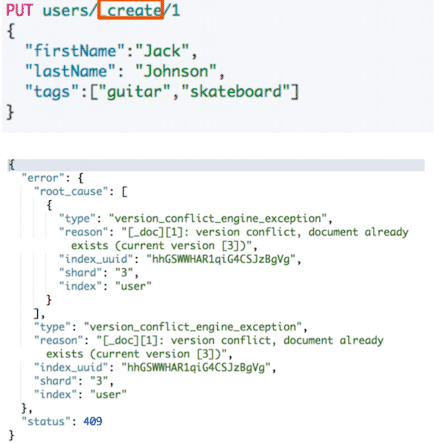
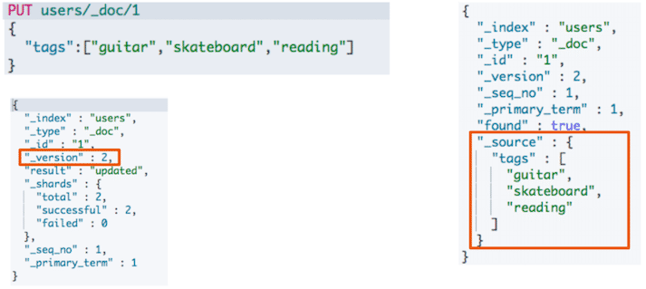
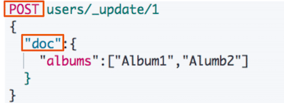
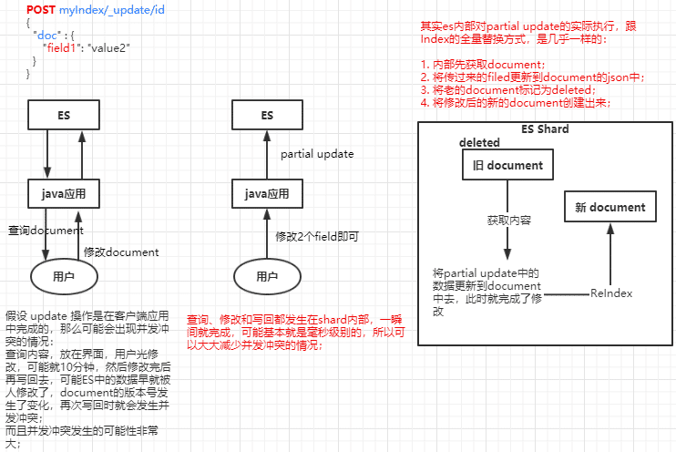
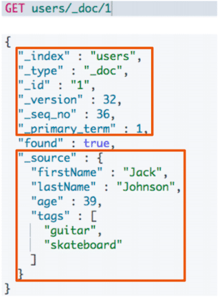
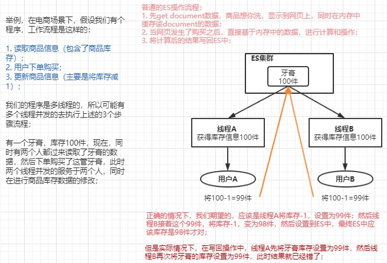
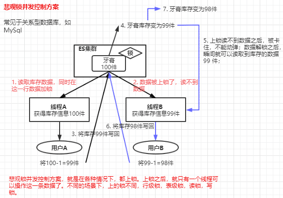
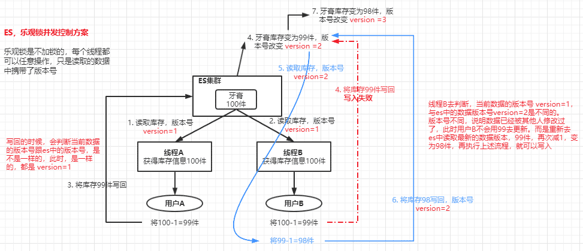
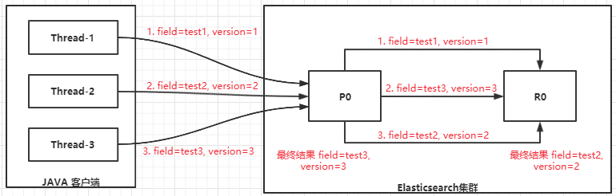
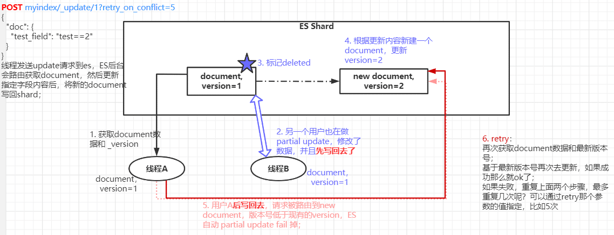

# ES Index-基本操作与并发

::: tip 转载

- [https://www.yuque.com/xiongsanxiansheng/qfvqxo/asntd2](https://www.yuque.com/xiongsanxiansheng/qfvqxo/asntd2)

:::

## **数据的基本操作**

### 1. 文档的 CURD

| **Index**  | **PUT my_index/_doc/1**{"user": "mike", "comment": "You know, for search"} |
| :--------- | :----------------------------------------------------------- |
| **Create** | **PUT my_index/_create/1**{"user": "mike", "comment": "You know, for search"} **POST** **my_index/_doc （不指定 ID，自动生成）**{"user": "mike", "comment": "You know, for search"} |
| **Read**   | **GET** **my_index/_doc/1**                                  |
| **Update** | **POST** **my_index/_update/1**{ "doc": {"user": "mike", "comment": "You know, ElasticSearch"} } |
| **Delete** | **DELETE** **my_index/_doc/1**                               |

- Type 名，7.x 以后，约定都用 _doc；
- Create，如果 ID 已经存在，会失败；
- Index，如果 ID 不存在，创建新的文档。否则，先删除现有文档，再创建新的文档，版本会增加；
- Update，文档必须已经存在，更新只会对相应字段做增量修改；
- Delete，不会立刻物理删除，只会将其标记为 deleted 状态，当数据越来越多的时候，在后台自动删除（细节内容参考：“*分片内部原理*”）

#### 1.1 Create 一个文档

<br>

<div style="display:flex;"></div>

<br>

- 支持自动生成文档 ID 和指定文档 ID 两种方式；
- 通过调用 "POST my_index/_doc"，系统会自动生成 document id；
- 使用 PUT my_index/**_create**/1 创建时，URI 中显示指定 _create，此时如果该 id 的文档已经存在，操作失败；

#### 1.2 Index 一个文档

<br>

<div style="display:flex;"></div>

<br>

- Index 和 Create 不一样的地方：如果文档不存在，就索引新的文档。否则现有文档会被删除，新的文档被索引。版本信息+1
- document 一旦被索引是不可变的，如果要修改 document 的内容，可以使用 Index 对 document 重新建立索引，相当于全量替换，旧的 document 被标记为 deleted，ES 会在后台适当的时候自动删除；
- Index 全量替换修改 document，每次的执行流程是这样的：
  - 应用程序先发起一个 get 请求，获取到 document，展示到前台界面，供用户查看和修改；
  - 用户在前台界面修改数据，发送到后台；
  - 后台代码，会将用户修改的数据在内存中进行执行，然后封装好修改后的全量数据；
  - 然后发送 PUT 请求，到 es 中，进行全量替换；
  - es 将老的 document 标记为 deleted，然后重新创建一个新的 document；

#### 1.3 Update 一个文档

<br>

<div style="display:flex;"></div>

<br>

- Update，文档必须已经存在，更新只会对相应字段做增量修改；
- Update 方法不会删除原来的文档，而是实现真正的数据更新；
- POST 方法 / Payload 需要包含在 "doc" 中；
- Update 可以在原文档的基础上增加字段；

```json
POST users/_update/1/
{
   "doc":{
       "post_date" : "2019-05-15T14:12:12",
       "message" : "trying out Elasticsearch"
   }
}
```

看起来，好像比较方便，每次就传递少数几个发生修改的 field 即可，不需要将全量的 document 数据发过去；

> 那么 **Partial Update** 的实际内部原理是怎样的，它的优点是什么呢？

<div style="display:flex;"></div>

<br>

- Partial Update 相较于全量替换的优点：
  - 所有的查询、修改和写回操作，都发生在 ES 中的一个 shard 内部，避免了所有的网路数据传输的开销（减少了2次网络请求），大大提升了性能；
  - 减少了查找和修改中的时间间隔，可以有效减少并发冲突的情况；

#### 1.4 Get 一个文档

<br>

<div style="display:flex;"></div>

<br>

- 找到文档，返回 HTTP 200
  - 文档源信息
    - _index / _type /
    - 版本信息，同一个 ID 的文档，即使被删除，Version 号也会不断增加；
    - _source 中默认包含了文档的所有原始信息；
- 找不到文档，返回 HTTP 404；

### 2. Bulk API 批量增、删、改

- 支持再一次 API 调用中，对不同的索引进行操作；
- 支持四种类型操作
  - Index，普通的 put 操作，可以是创建文档，也可以是全量替换文档；
  - Create，PUT /index/_create/id 操作，强制创建文档；
  - Update，执行的 partial update 部分更新操作；
  - Delete，删除一个文档，只要一个 json 串就可以了；
- 可以在 URI 中指定 Index，也可以在请求的 Payload 中进行；
- 操作中单挑操作失败，并不会影响其他操作；
- 返回结果包括了每一条操作执行的结果

**POST** **_bulk**

```json
{ "index" : { "_index" : "test", "_id" : "1" } }
{ "field1" : "value1" }

{ "create" : { "_index" : "test2", "_id" : "2"} }
{ "field1" : "value3" }

{ "update" : { "_index" : "test2", "_id" : "2"} }
{ "doc" : { "field2" : "value2"} }

{ "delete" : { "_index" : "test2", "_id": "2" } }
```

- 除了 delete 操作，其他每一个操作需要两行，要两个 JSON 串，语法如下：
  - 元素据：{ "action" : { "metadata" }}
  - document 中的真实数据：{ "data" }
- Bulk API 对 JSON 的语法，有严格的要求：
  - 每个 JSON 不能像 JSON 对象那样进行格式换行，一个 JSON 只能作为一个字符串只能放在一行；
  - 同时一个 JSON 串和一个 JSON 串之间，必须有一个换行；
- Bulk Size 最佳大小
  - bulk request 会加载到内存里，如果太大的话，性能反而会下降，因此需要反复尝试一个最佳的 bulk size；
  - 一般从 1000~5000 条数据开始，尝试逐渐增加。
  - 另外，如果看大小的话，最好是在 5~15 MB 之间；

### 3. mget 批量读取

- 批量查询的好处：
  - 就是一条一条的查询，比如说要查询100条数据，那么就要发送100次网络请求，这个开销还是很大的；
  - 如果进行批量查询的话，查询100条数据，就只要发送1次网络请求，网络请求的性能开销缩减100倍；

- GET 请求进行查询，在 Body 中的 docs 数组里面，用 _index、_id 来定位 document；

  ```json
  GET _mget
  {
    "docs": [
      {
        "_index": "user",
        "_id": 1
      },
      {
        "_index": "comment",
        "_id": 1
      }
    ]
  }
  
  #URI中指定index
  GET /test/_mget
  {
      "docs" : [
          {
              "_id" : "1"
          },
          {
              "_id" : "2"
          }
      ]
  }
  
  #指定返回的document内容部分
  GET /_mget
  {
      "docs" : [
          {
              "_index" : "test",
              "_id" : "1",
              "_source" : false
          },
          {
              "_index" : "test",
              "_id" : "2",
              "_source" : ["field3", "field4"]
          },
          {
              "_index" : "test",
              "_id" : "3",
              "_source" : {
                  "include": ["user"],
                  "exclude": ["user.location"]
              }
          }
      ]
  }
  ```

- mget 的重要性
  - 一般来说，在进行查询的时候，如果一次性要查询多条数据的话，那么一定要用 batch 批量操作的 api；
  - 尽可能减少网络开销次数，可能可以将性能提升数倍，甚至数十倍，非常非常之重要；

### 4. msearch 批量条件查询

```json
### msearch 操作
POST kibana_sample_data_ecommerce/_msearch
{}
{"query" : {"match_all" : {}},"size":1}
{"index" : "kibana_sample_data_flights"}
{"query" : {"match_all" : {}},"size":2}
```

### 5. 常见的错误返回

| **问题**     | **原因**           |
| ------------ | ------------------ |
| 无法连接     | 网络故障或集群挂了 |
| 连接无法关闭 | 网络故障或节点出错 |
| 429          | 集群过于繁忙       |
| 4xx          | 请求体格式有错     |
| 500          | 集群内部错误       |

<br>

<br>

## **读写文档的并发操作**

### 1. 图解ElasticSearch并发冲突问题

<br>

<div style="display:flex;"></div>

上面说的这个过程，其实就是 ES 中的并发冲突问题，会导致数据不准确：

- 有些场景下，其实是无所谓的，不关注这个数据不准确的事情，比如说，我们如果就只是简单的将数据写入ES，无论数据是什么样的，都可以；还有些情况下，即使是算错了，也可以；（比如文章阅读数量统计，评论数量统计）
- 当并发操作 ES 的线程越来越多，或者并发请求越多；或者是读取一份数据，供用户查阅和操作的时间越长，因为这段时间里很可能数据在 ES 中已经被修改了，那么我们拿到的就是旧数据，基于旧数据去操作，后面结果肯定就错了；

### 2. 图解悲观锁和乐观锁两种并发控制方案

<br>

<div style="display:flex;"></div>

<br>

<div style="display:flex;"></div>

<br>

<font color=blue> --> ES 使用乐观锁并发控制方案；</font>

**总结：**

- **悲观锁并发控制**
  - 悲观锁的含义：我认为每次更新都有冲突的可能，并发更新这种操作特别不靠谱，我只相信只有严格按我定义的粒度进行串行更新，才是最安全的，一个线程更新时，其他的线程等着，前一个线程更新完成后，下一个线程再上。
  - 关系型数据库中广泛使用该方案，常见的表锁、行锁、读锁、写锁，依赖redis或memcache等实现的分布式锁，都属于悲观锁的范畴。明显的特征是后续的线程会被挂起等待，性能一般来说比较低，不过自行实现的分布式锁，粒度可以自行控制（按行记录、按客户、按业务类型等），在数据正确性与并发性能方面也能找到很好的折衷点。
- **乐观锁并发控制**
  - 乐观锁的含义：我认为冲突不经常发生，我想提高并发的性能，如果真有冲突，被冲突的线程重新再尝试几次就好了。
  - Elasticsearch 默认使用的是乐观锁方案，前面介绍的 _version 字段，记录的就是每次更新的版本号，只有拿到最新版本号的更新操作，才能更新成功，其他拿到过期数据的更新失败，由客户端程序决定失败后的处理方案，一般是重试。

### 3. 图解ElasticSearch内部如何基于_version进行乐观锁并发控制

#### 3.1 Replica Shard 数据同步并发控制

在 Elasticsearch 内部，每当 primary shard 收到新的数据时，都需要向 replica shard 进行数据同步，这种同步请求特别多，并且是异步的。如果同一个 document 进行了多次修改，Shard 同步的请求是无序的，可能会出现"后发先至"的情况，如果没有任何的并发控制机制，那结果将无法相像。

Shard 的数据同步也是基于内置的 _version 进行乐观锁并发控制的。

例如 Java 客户端向 Elasticsearch 某条 document 发起更新请求，共发出3次，Java 端有严谨的并发请求控制，在 ElasticSearch 的 primary shard 中写入的结果是正确的，但 Elasticsearch 内部数据启动同步时，顺序不能保证都是先到先得，情况可能是这样，第三次更新请求比第二次更新请求先到，如下图：

<div style="display:flex;"></div>

如果 Elasticsearch 内部没有并发的控制，这个 document 在 replica 的结果可能是 test2，并且与 primary shard 的值不一致，这样肯定错了。<br>预期的更新顺序应该是 test1-->test2-->test3，最终的正确结果是 test3。那 Elasticsearch 内部是如何做的呢？<br>Elasticsearch 内部在更新 document 时，会比较一下 version，如果请求的 version 与 document 的 version 相等，就做更新，如果 document 的 version 已经大于请求的 version，说明此数据已经被后到的线程更新过了，此时会丢弃当前的请求，最终的结果为 test3。<br>此时的更新顺序为 test1-->test2，最终结果也是对的。

#### 3.2 Partial Update 乐观锁并发控制

<br>

<div style="display:flex;"></div>

<br>

- partial update 内置乐观锁并发控制
  - 如果拿到的  _version 低于 partial update 操作时现有 document 的 _version，那么 es 会自动把此次 partial update fail 掉，让 partial update 失效；
- retry_on_conflict
  - partial update 并发冲突时，如果 _version 低于现有的 document 的 _version，默认内置乐观锁会让此操作不生效；
  - 如果要保证此次 partial update 操作尽可能的执行成功，可以添加 retry_on_conflict 参数，进行多次更新尝试；
  - retry 策略：
    - 再次获取 document 数据和最新版本号；
    - 基于最新版本号再次去更新，如果成功那么就 ok 了；
    - 如果失败，重复1和2两个步骤，最多重复几次呢？可以通过 retry 那个参数的值指定，比如5次；

``` json
POST myindex/_update/1?retry_on_conflict=0
{
  "doc": {
    "test_field": "test==2"
  }
}
#也可以指定_version，如果于我们要求的version不一致，就会返回错误，再根据需求自己决定下一步操作
POST myindex/_update/1?version=2&retry_on_conflict=0
{
  "doc": {
    "test_field": "test==2"
  }
}
```


### 4. ES基于_version进行乐观锁并发控制

**旧版本**的 elasticsearch 是用 version 来解决并发问题，采用乐观锁的方式，比较更新时的 version 是否相同来决定能不能更新。但是在新版本 elasticsearch **7.x** 再使用 version 就会报上述问题；

> **新版本**用的是 _seq_no 和 _primary_term 两个字段来代替 version 处理并发问题，在查询文档时，这两个字段会返回。

``` json
GET myindex/_doc/1
#返回结果
{
  "_index" : "myindex",
  "_type" : "_doc",
  "_id" : "1",
  "_version" : 4,
  "_seq_no" : 3,
  "_primary_term" : 1,
  "found" : true,
  "_source" : {
    "test_field" : "test==2"
  }
}
#新版本使用 if_seq_no、if_primary_term 参数来代替version做版本控制
PUT myindex/_doc/1?if_seq_no=3&if_primary_term=1
{
  "test_field": "test test333"
}
```


### 5. ES基于external version进行乐观锁并发控制

- external version：
  - es 提供了一个 feature，就是说，你可以不用它提供的内部 _version 版本号来进行并发控制，可以基于你自己维护的一个版本号来进行并发控制。
  - 举个列子，假如你的数据在 mysql 里也有一份，然后你的应用系统本身就维护了一个版本号，无论是什么，如自己生成的、或程序控制的。这个时候，你进行乐观锁并发控制的时候，可能并不是想要用 es 内部的 _version 来进行控制，而是用你自己维护的那个 version 来进行控制。

**基于 _version**：`?version=1`<br>**基于 external version**：`?version=1&version_type=external`

- 两者的区别在
  - _version：只有当你提供的 version 与 es 中的 _version 一模一样的时候，才可以进行修改，只要不一样，就报错；
  - 当 version_type=external 的时候，只有当你提供的 version 比 es 中的 _version 大的时候，才能完成修改；

es，_version=1，?version=1，才能更新成功；<br>es，_version=1，?version>1&version_type=external，才能成功，比如 version=2；

> 经过测试，external version 版本控制方案在新老版本中都可以使用。

