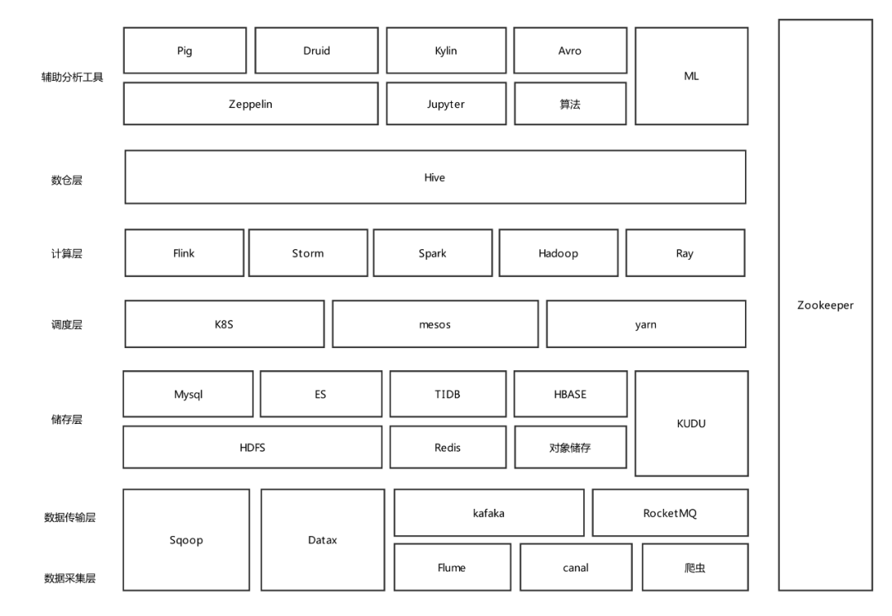
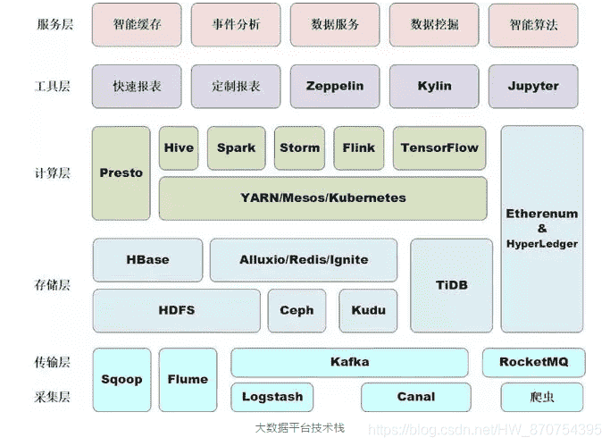
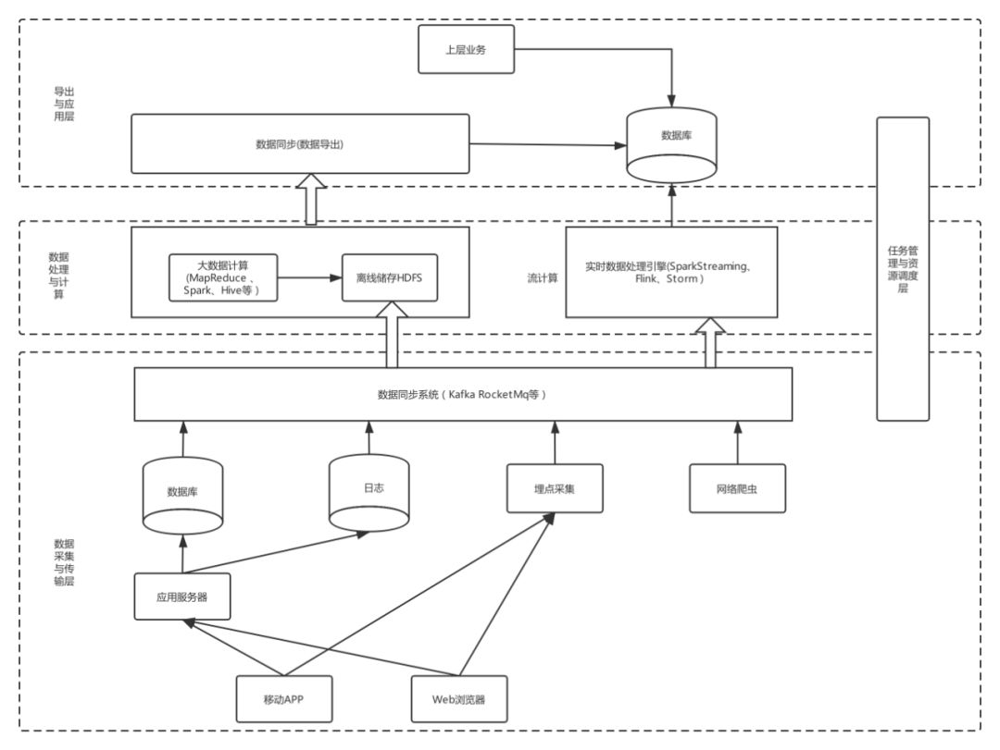
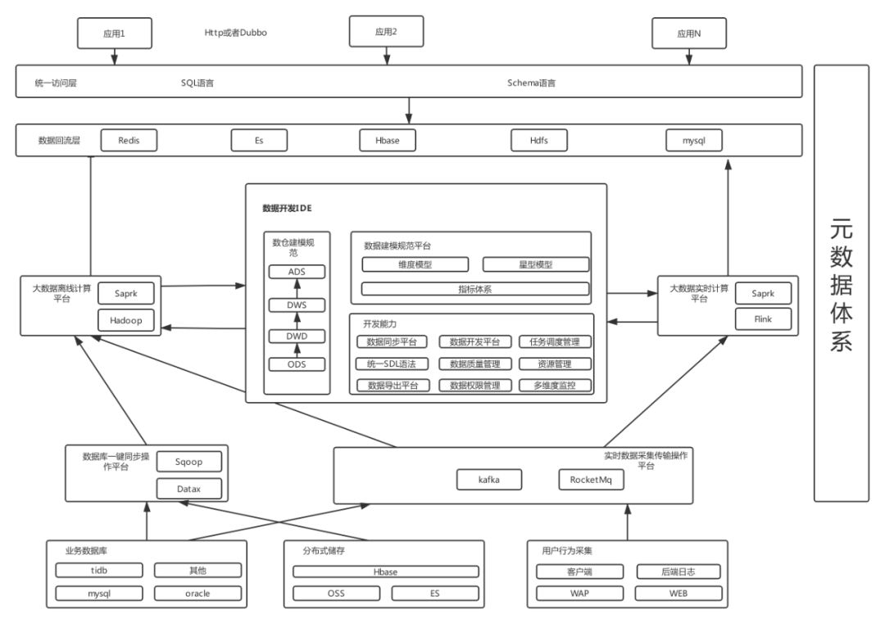
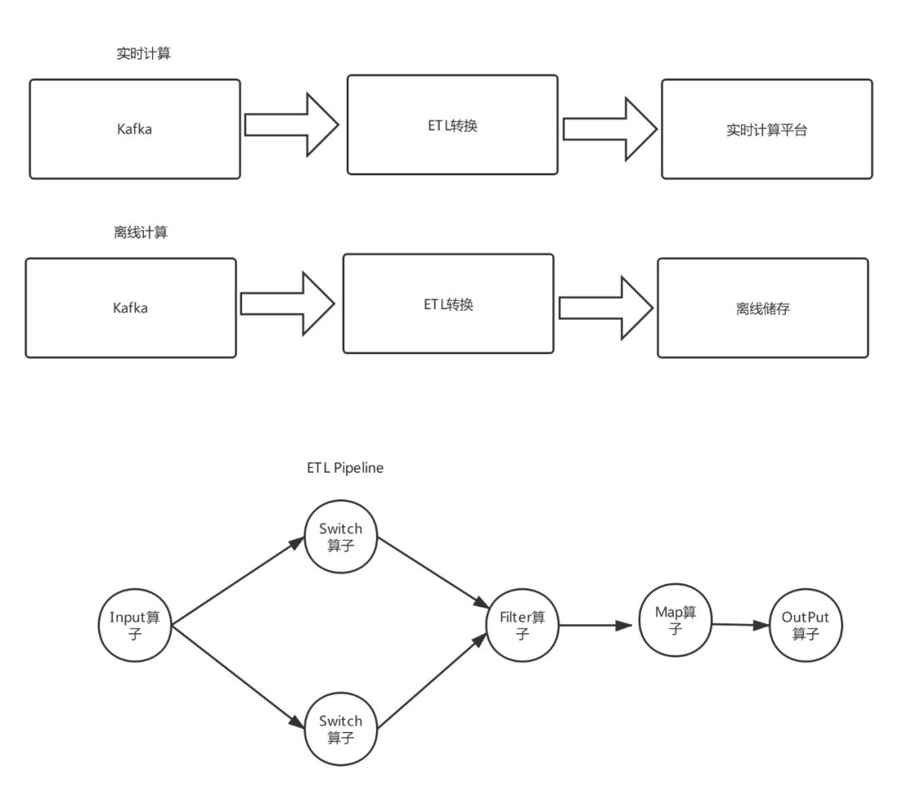
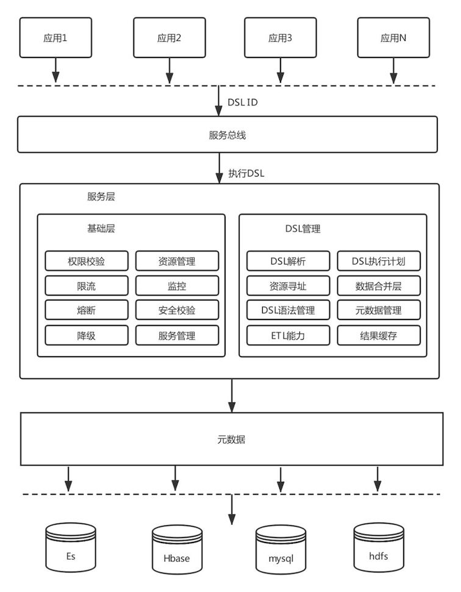

# 大数据平台(分布式)-总览

> 大数据和分布式相辅相成，现如今绝大部分大数据技术栈都是支持分布式的 - 所以此专题将它们合二为一

::: warning 注意

随着时代的发展，在不同阶段，大数据(分布式)平台、架构、技术等也在不停的演进。所以以下内容权作参考，如有需要，请参考最新技术文档。

 

:::

::: tip 参考

- [https://blog.csdn.net/wypblog/article/details/104351876](https://blog.csdn.net/wypblog/article/details/104351876)
- [https://blog.csdn.net/HW_870754395/article/details/96422539](https://blog.csdn.net/HW_870754395/article/details/96422539)
- [https://medium.com/cloud-believers/big-data-technology-stack-2b604f2138da](https://medium.com/cloud-believers/big-data-technology-stack-2b604f2138da)
- others ... ...

:::

## 大数据技术栈

::: danger 仅供参考

 

:::

### 理解

> 自己的理解总结

### 参考

一些图或文章帮助理解各种技术大概所处的位置：

> 理解图-1

 

> 理解图-2

 

> 文章转载帮助理解

The following describes each technology in different layers. Of course, each layer is not strictly divided in the literal sense. For example, Hive provides both data processing functions and data storage functions, but it is classified as a data analysis layer here.

**1. Data acquisition and transmission layer**

- **Flume**
  Flume is a distributed, reliable, and highly available system for data collection, aggregation, and transmission. Commonly used in log collection systems, it supports customizing various data senders to collect data, simple pre-processing of data through custom interceptors, and transmission to various data receivers such as HDFS, HBase, and Kafka. Previously developed by Cloudera, later incorporated into Apache
- **Sqoop**
  Sqoop is a tool for data import and export through a set of commands. The underlying engine relies on MapReduce and is mainly used for data import and export between Hadoop (such as HDFS, Hive, HBase) and RDBMS (such as MySQL, oracle)
- **Kafka**
  It is a Distributed messaging system. Producer (producer)-consumer (consumer) model. Provides features similar to JMS, but is completely different in design and does not follow JMS specifications. For example, Kafka allows multiple consumers to actively pull data, while only peer-to-peer consumers in JMS will actively pull data. Mainly used in data buffering, asynchronous communication, data collection, system coupling, etc.
- **The Pulsar**
  It is similar to Kafka, but Pulsar supports multi-tenancy and has the concept of assets and namespaces. Assets represent tenants in the system. Assuming a Pulsar cluster is used to support multiple applications, each asset in the cluster can represent an organization’s team, a core function, or a product line. An asset can contain multiple namespaces, and a namespace can contain any number of topics

**2. Data storage layer**

- **HBase**
  It is a NoSQL database system with high reliability, high performance, column-oriented, scalability, and typical key/value distributed storage. It is mainly used for massive structured and semi-structured data storage. . It is between NoSQL and RDBMS. Data can only be retrieved through the row key and the range of the row key. Row data storage is atomic and only supports single-row transactions (multiple table joins can be realized through hive support, etc.) Complex operation). HBase query data function is very simple, does not support complex operations such as join, does not support cross-row and cross-table transactions
- **Kudu**
  It is a distributed database based on columnar storage between HDFS and HBase. Kudu support the real-time performance of HBase, the high throughput of HDFS, and the SQL support of traditional databases
- **The HDFS**
  It is a distributed file storage system that has the characteristics of high fault-tolerant, high throughput, and high availability. HDFS is very suitable for applications on large-scale data sets, provides high-throughput data access, and can be deployed on inexpensive machines. It relaxes the requirements of POSIX so that it can achieve stream access (data in the file system. It mainly provides massive data storage services for various distributed computing frameworks such as Spark, MapReduce, etc., while the underlying data storage of HDFS and HBase also depends on HDFS

**3. Data analysis layer**

- **Spark**
  Spark is a fast, versatile, scalable, fault-tolerant, memory iterative computing big data analysis engine. The current ecosystem mainly includes SparkRDD and SparkSQL for batch data processing, SparkStreaming and Structured-Streaming for stream data processing, Spark MLLib for machine learning, Graphx for graph computing, and SparkR for statistical analysis. Support Java, Scala, Python, R multiple data languages
- **Flink**
  A great distributed big data processing(compute) engine can do calculations on limited data streams and wireless data streams. Flink was developed on the basis of streaming at the beginning of its design and then entered the batch processing field. Compared with spark, it is a real-time computing engine in the true sense.
- **Storm**
  It is a distributed real-time computing system managed by Apache after being open-sourced by Twitter. The storm is a data stream processing computing engine without batch processing capabilities. Storm provides a low-level API. Users need to implement a lot of complex logic by themselves.
- **Hive**
  It is a data warehouse tool that depends on Hadoop. It can map structured data files to a database table and provide an HQL statement (SQL-like language) query function. Storage depends on HDFS. Support multiple computing engines, such as Spark, MapReduce (default), Tez; support multiple storage formats, such as TextFile, SequenceFile, RCFile, ORC, Parquet (commonly used); support multiple compression formats, such as gzip, lzo, snappy (commonly used) ), bzip2
- **Tez**
  Tez supports an open-source computing framework for DAG operations. Compared with MapReduce, the performance is better, mainly because it describes the job as a DAG (directed acyclic graph), which is similar to Spark
- **Pig**
  This application is based on Hadoop’s large-scale data analysis platform. It contains a scripting language called Pig Latin to describe data flow, an engine that executes data flow processing in parallel, and provides a simple operation and parallel computing for complex massive data. Programming interface. Pig Latin itself provides many traditional data operations and allows users to develop some custom functions to read, process, and write data. The language’s compiler will convert SQL-like data analysis requests into a series of optimized processing MapReduce operation
- **Phoenix** 
  It is built on a SQL layer on HBase, allowing us to manipulate data in HBase through standard JDBC API. Completely ​​written in Java like JDBC driver embedded in HBase. It will generate standard JDBC result sets by transforming queries into HBase scans

**4. OLAP Engine**

- **Druid is an**
  It is an open-source, column-based, distributed, storage system suitable for real-time data analysis, capable of rapid aggregation, flexible filtering, millisecond-level queries, and low-latency data import. By using Bitmap indexing to accelerate the query speed of column storage, and using the CONCISE algorithm to compress bitmap indexing, the generated segments are much smaller than the original text file, and the coupling between its various components is low. If real-time data is not required Real-time nodes can be completely ignored
- **Kylin**
  It was originally developed by eBay Inc and contributed to the distributed analysis engine of the open-source community. Provides SQL query interface and multidimensional analysis (OLAP) capabilities on Hadoop/Spark to support ultra-large-scale data, which can query huge Hive tables in sub-seconds. The user needs to have a deep understanding of the data warehouse model and build a cube. It can work with a variety of visualization tools so that users can use BI tools to analyze Hadoop data.
- **Impala** A big data query and analysis engine that provides high-performance, low-latency interactive SQL query functions for HDFS, HBase, and other data is open-sourced by Cloudera. It is based on Hive, uses Hive metadata to calculate in memory, and has the advantages of real-time, batch processing, high concurrency, etc.
- **Presto’s**
  It is an open-source distributed big data SQL query engine is suitable for interactive analysis and query. Data from multiple data sources can be merged, and data can be read directly from HDFS, without a lot of ETL operations.

**5. Resource Management**

- **Yarn**
  Yarn is a resource scheduling platform, responsible for allocating resources and scheduling for computing programs, and does not participate in the internal work of user programs. Core components include ResourceManager (global resource manager, responsible for resource management and allocation of the entire system), NodeManager (resource and task manager on each node)
- **Kubernetes,**
  It is also known as K8s, it is an open-source platform for automated container operations that provides resource scheduling, deployment and operation, balanced disaster tolerance, service registration, capacity expansion and contraction, and other functions for containerized applications. It is specifically embodied in automated container deployment and replication, expansion or contraction of the container scale at any time, organization of containers into groups, and provision of load balancing among containers. Kubernetes supports docker and Rocket, and Docker can be regarded as a low-level component used internally by Kubernetes
- **Mesos**
  It is similar to Yarn and is also a distributed resource management platform that runs in a unified resource management environment for MPI and Spark jobs. It supports Hadoop2.0.

**6. Workflow Scheduler**

- **Oozie**
  It is a task scheduling framework based on a workflow engine that can provide scheduling and coordination of MapReduce and Pig tasks
- **Azkaban**
  It is open-sourced by LinkedIn and is more lightweight than Oozie. Used to run a set of tasks in a specific order within a workflow, establish dependencies between tasks through a kV file format and provide users with an easy-to-use web interface to maintain and track the workflow of allowed tasks

**7. Other**

- **Ambari**
  A web-based installation and deployment tool supports the management and monitoring of most Hadoop components, such as HDFS, MapReduce, Hive, Pig, HBase, etc.
- **Zookeeper**
  It is a distributed coordination service is to provides coordination services for users ’ distributed applications, such as master-slave coordination, dynamic online and offline server nodes, unified configuration management, distributed shared locks, etc. It is also a distributed program (deploy an odd number of units, As long as more than half of the zookeeper nodes survive, the zookeeper cluster can provide services normally), an open-source implementation of Google Chubby

## 大数据架构理论

讲述主流大数据架构：**Lambda**，**Kappa**，**Unified Lambda** 等

详见 [大数据架构(理论)](/BigDataAndDistributedSystem/BigDataArchitecture.html)

## 常见的大数据平台架构设计思路

### kappa架构和lambda架构下的大数据架构

目前各大公司基本上都是使用kappa架构或者lambda架构模式，这两种模式下大数据整体架构在早期发展阶段可能是下面这样的：

### 数据端到端痛点

虽然上述架构看起来将多种大数据组件串联起来实行了一体化管理，但是接触过数据开发的人会感受比较强烈，这样的裸露架构业务数据开发需要关注很多基础工具的使用，实际数据开发中存在很多痛点与难点，具体表现在下面一些方面。

1. 缺乏一套数据开发IDE来管理整个数据开发环节，长远的流程无法管理起来。
2. 没有产生标准数据建模体系，导致不同数据工程师对指标理解不同计算口径有误。
3. 大数据组件开发要求高，普通业务去直接使用Hbase、ES等技术组件会产生各种问题。
4. 基本上每个公司大数据团队都会很复杂，涉及到很多环节，遇到问题难以定位难以找到对应负责人。
5. 难以打破数据孤岛，跨团队跨部门数据难以共享，互相不清楚对方有什么数据。
6. **需要维护两套计算模型批计算和流计算**，难以上手开发，需要提供一套流批统一的SQL。
7. **缺乏公司层面的元数据体系规划**，同一条数据实时和离线难以复用计算，每次开发任务都要各种梳理。

基本上大多数公司在数据平台治理上和提供开放能力上都存在上述问题和痛点。在复杂的数据架构下，对于数据适用方来说，每一个环节的不清晰或者一个功能的不友好，都会让复杂链路变更更加复杂起来。想要解决这些痛点，就需要精心打磨每一个环节，将上面技术组件无缝衔接起来，让业务从端到端使用数据就像写SQL查询数据库一样简单。

### 优秀的大数据整体架构设计

提供多种平台以及工具来助力数据平台：多种数据源的数据采集平台、一键数据同步平台、数据质量和建模平台、元数据体系、数据统一访问平台、实时和离线计算平台、资源调度平台、一站式开发IDE。

 

### 元数据-大数据体系基石

元数据是打通数据源、数据仓库、数据应用，记录了数据从产生到消费的完整链路。元数据包含静态的表、列、分区信息(也就是MetaStore)。动态的任务、表依赖映射关系；数据仓库的模型定义、数据生命周期；以及ETL任务调度信息、输入输出等元数据是数据管理、数据内容、数据应用的基础。例如可以利用元数据构建任务、表、列、用户之间的数据图谱；构建任务DAG依赖关系，编排任务执行序列；构建任务画像，进行任务质量治理；提供个人或BU的资产管理、计算资源消耗概览等。

可以认为整个大数据数据流动都是依靠元数据来管理的，没有一套完整的元数据设计，就会出现上面的数据难以追踪、权限难以把控、资源难以管理、数据难以共享等等问题。很多公司都是依靠hive来管理元数据，但是个人认为在发展一定阶段还是需要自己去建设元数据平台来匹配相关的架构。

> 关于元数据可以参考饿了么一些实战:

[饿了么元数据管理实践之路](https://www.jianshu.com/p/f60b2111e414)

### 流批一体化计算

如果维护两套计算引擎例如离线计算Spark和实时计算Flink，那么会对使用者造成极大困扰，既需要学习流计算知识也需要批计算领域知识。如果实时用Flink离线用Spark或者Hadoop，可以开发一套自定义的DSL描述语言去匹配不同计算引擎语法，上层使用者无需关注底层具体的执行细节，只需要掌握一门DSL语言，就可以完成Spark和Hadoop以及Flink等等计算引擎的接入。

### 实时与离线ETL平台

ETL 即 Extract-Transform-Load，用来描述将数据从来源端经过抽取（extract）、转换（transform）、加载（load）至目的端的过程。ETL 一词较常用在数据仓库，但其对象并不限于数据仓库。一般而言ETL平台在数据清洗、数据格式转换、数据补全、数据质量管理等方面有很重要作用。作为重要的数据清洗中间层，一般而言ETL最起码要具备下面几个功能:

1. 支持多种数据源，例如消息系统、文件系统等
2. 支持多种算子，过滤、分割、转换、输出、查询数据源补全等算子能力
3. 支持动态变更逻辑，例如上述算子通过动态jar方式提交可以做到不停服发布变更。

 

### 智能统一查询平台

大多数数据查询都是由需求驱动，一个需求开发一个或者几个接口，编写接口文档，开放给业务方调用，这种模式在大数据体系下存在很多问题：

1. 这种架构简单，但接口粒度很粗，灵活性不高，扩展性差，复用率低.随着业务需求的增加，接口的数量大幅增加，维护成本高企。
2. 同时，开发效率不高，这对于海量的数据体系显然会造成大量重复开发，难以做到数据和逻辑复用，严重降低业务适用方体验。
3. 如果没有统一的查询平台直接将Hbase等库暴露给业务，后续的数据权限运维管理也会比较难，接入大数据组件对于业务适用方同样很痛苦，稍有不慎就会出现各种问题。

通过一套智能查询解决上述大数据查询痛点问题

### 数仓建模规范体系

随着业务复杂度和数据规模上升，混乱的数据调用和拷贝，重复建设带来的资源浪费，数据指标定义不同而带来的歧义、数据使用门槛越来越高。以笔者见证实际业务埋点和数仓使用为例，同一个商品名称有些表字段是good_id,有些叫spu_id，还有很多其他命名，对于想利用这些数据人会造成极大困扰。因此没有一套完整的大数据建模体系，会给数据治理带来极大困难，具体表现在下面几个方面：

1. 数据标准不一致，即使是同样的命名，但定义口径却不一致。例如，仅uv这样一个指标，就有十几种定义。带来的问题是：都是uv，我要用哪个？都是uv，为什么数据却不一样？
2. 造成巨大研发成本，每个工程师都需要从头到尾了解研发流程的每个细节，对同样的“坑”每个人都会重新踩一遍，对研发人员的时间和精力成本造成浪费。这也是目标笔者遇到的困扰，想去实际开发提取数据太难。
3. 没有统一的规范标准管理，造成了重复计算等资源浪费。而数据表的层次、粒度不清晰，也使得重复存储严重。

因此大数据开发和数仓表设计必须要坚持设计原则，数据平台可以开发平台来约束不合理的设计，例如阿里巴巴的OneData体系。

> 有兴趣的可以参考阿里巴巴的OneData设计体系

### 数据开发IDE-高效的端到端工具

高效的数据开发一站式解决工具，通过IDE可以完成实时计算与离线计算任务开发，将上述平台全部打通提供一站式解决方案。数据开发IDE提供数据集成、数据开发、数据管理、数据质量和数据服务等全方位的产品服务，一站式开发管理的界面，通过数据IDE完成对数据进行传输、转换和集成等操作。从不同的数据存储引入数据，并进行转化和开发，最后将处理好的数据同步至其他数据系统。通过高效率的大数据开发IDE，基本上让大数据工程师可以屏蔽掉各种痛点，将上述多种平台能力结合起来，让大数据开发可以向写SQL一样简单。

> 关于数据开发工具可以参考阿里云的DataWorks。

### 其他

完整的数据体系研发还包括**告警与监控中心**、**资源调度中心**、**资源计算隔离**、数据质量检测、一站式数据加工体系，这里就不再继续讨论了。

