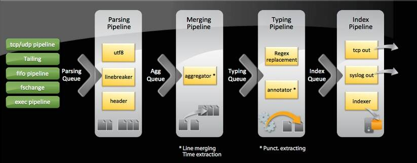
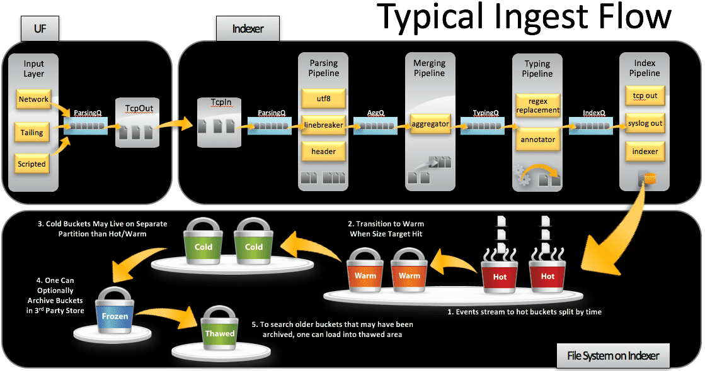
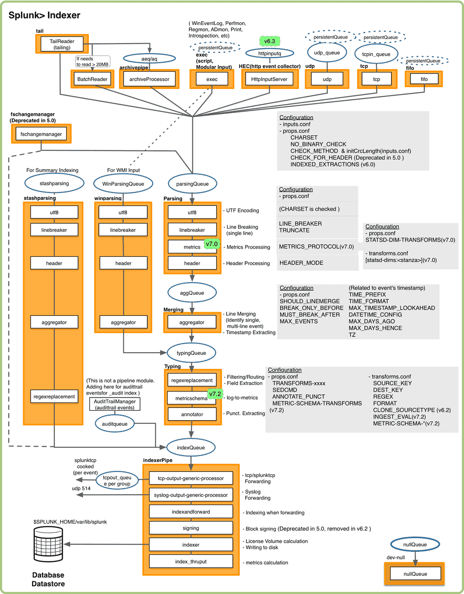
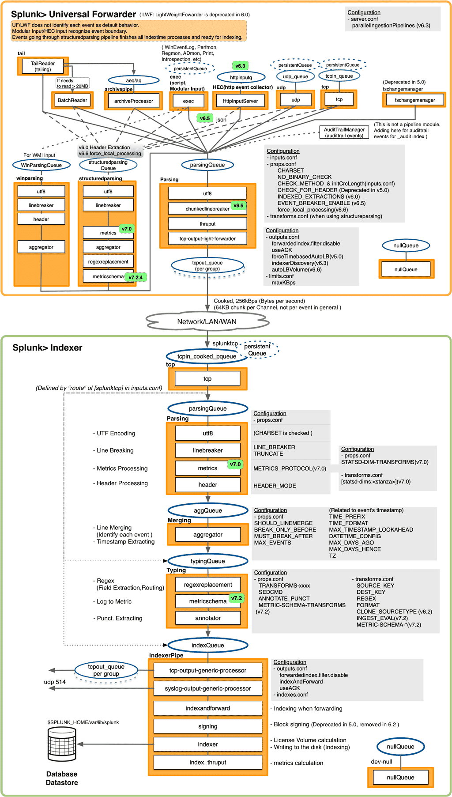

# Splunk 相关知识

::: tip 参考

- [https://docs.splunk.com/](https://docs.splunk.com/)
- [https://wiki.splunk.com/Community:HowIndexingWorks](https://wiki.splunk.com/Community:HowIndexingWorks)

::: 

主要还是以官方文档为主要学习源，摘选一些片段来加深对Splunk的理解


## Get Data In - Overview

### ▎Data Pipeline

The data pipeline has these segments:

- **[Input](https://docs.splunk.com/Splexicon:Input)**
- **[Parsing](https://docs.splunk.com/Splexicon:Parsing)**
- **[Indexing](https://docs.splunk.com/Splexicon:Index)**
- **[Search](https://docs.splunk.com/Splexicon:Search)**

The correspondence between the three typical processing tiers and the four data pipeline segments is this:

- The data input tier handles the input segment.
- The indexing tier handles the parsing and indexing segments.
- The search management tier handles the search segment.

<div style="display:flex;"></div>

> **Note:** The diagram represents a simplified view of the indexing architecture. It provides a functional view of the architecture and does not fully describe Splunk software internals. In particular, the parsing pipeline actually consists of three pipelines: **parsing**, **merging**, and **typing**, which together handle the parsing function. The distinction can matter during troubleshooting, but does not ordinarily affect how you configure or deploy Splunk Enterprise components. For a more detailed diagram of the data pipeline, see "[How Indexing Works](http://wiki.splunk.com/Community:HowIndexingWorks)" in the Community Wiki.

### ▎The data pipeline segments in depth

This section provides more detail about the segments of the data pipeline. For more information on the parsing and indexing segments, see also ["How indexing works"](http://docs.splunk.com/Documentation/Splunk/8.2.1/Indexer/Howindexingworks) in the *Managing Indexers and Clusters of Indexers* manual.

> #### Input
>
> In the input segment, Splunk software consumes data. It acquires the raw data stream from its source, breaks it into 64K blocks, and annotates each block with some metadata keys. The keys apply to the entire input source overall. They include the **[host](https://docs.splunk.com/Splexicon:Host)**, **[source](https://docs.splunk.com/Splexicon:Source)**, and **[source type](https://docs.splunk.com/Splexicon:Sourcetype)** of the data. The keys can also include values that are used internally, such as the character encoding of the data stream, and values that control later processing of the data, such as the index into which the events should be stored.
>
> During this phase, Splunk software does not look at the contents of the data stream, so the keys apply to the entire source, not to individual events. In fact, at this point, Splunk software has no notion of individual events at all, only of a stream of data with certain global properties.
>
> #### Parsing
>
> During the parsing segment, Splunk software examines, analyzes, and transforms the data. This is also known as **[event processing](https://docs.splunk.com/Splexicon:Eventprocessing)**. It is during this phase that Splunk software breaks the data stream into individual events.The parsing phase has many sub-phases:
>
> - Breaking the stream of data into individual lines.
> - Identifying, parsing, and setting timestamps.
> - Annotating individual events with metadata copied from the source-wide keys.
> - Transforming event data and metadata according to regex transform rules.
>
> #### Indexing
>
> During indexing, Splunk software takes the parsed events and writes them to the index on disk. It writes both compressed raw data and the corresponding index files.
>
> For brevity, parsing and indexing are often referred together as the indexing process. At a high level, that makes sense. But when you need to examine the actual processing of data more closely or decide how to allocate your components, it can be important to consider the two segments individually.
>
> #### Search
>
> The search segment manages all aspects of how the user accesses, views, and uses the indexed data. As part of the search function, Splunk software stores user-created **[knowledge objects](https://docs.splunk.com/Splexicon:Knowledgeobject)**, such as reports, event types, dashboards, alerts, and field extractions. The search function also manages the search process itself.

### ▎Event processing

Event processing occurs in two stages, parsing and indexing. All data enters through the parsing pipeline as large chunks. During parsing, the Splunk platform breaks these chunks into events. It then hands off the events to the indexing pipeline, where final processing occurs. <br>During both parsing and indexing, the Splunk platform transforms the data. You can configure most of these processes to adapt them to your needs.

> In the parsing pipeline, the Splunk platform performs a number of actions. The following table shows some examples in addition to related information:
>
> | Action                                                       | Related information                                          |
> | :----------------------------------------------------------- | :----------------------------------------------------------- |
> | Extracting a set of default fields for each event, including `host`, `source`, and `sourcetype`. | [About default fields](http://docs.splunk.com/Documentation/Splunk/8.2.1/Data/Aboutdefaultfields) |
> | Configuring character set encoding.                          | [Configure character set encoding](http://docs.splunk.com/Documentation/Splunk/8.2.1/Data/Configurecharactersetencoding) |
> | Identifying line termination using line breaking rules. You can also modify line termination settings interactively, using the Set Source Type page in Splunk Web. | [Configure event line breaking](http://docs.splunk.com/Documentation/Splunk/8.2.1/Data/Configureeventlinebreaking)  [Assign the correct source types to your data](http://docs.splunk.com/Documentation/Splunk/8.2.1/Data/Setsourcetype) |
> | Identifying or creating timestamps. At the same time that it processes timestamps, Splunk software identifies event boundaries. You can modify timestamp settings interactively, using the Set Source Type page in Splunk Web. | [How timestamp assignment works](http://docs.splunk.com/Documentation/Splunk/8.2.1/Data/HowSplunkextractstimestamps)  [Assign the correct source types to your data](http://docs.splunk.com/Documentation/Splunk/8.2.1/Data/Setsourcetype) |
> | Anonymizing data, based on your configuration. You can mask sensitive data (such as credit card or social security numbers) at this stage. | [Anonymize data](http://docs.splunk.com/Documentation/Splunk/8.2.1/Data/Anonymizedata) |
> | Applying custom metadata to incoming events, based on your configuration. | [Assign default fields dynamically](http://docs.splunk.com/Documentation/Splunk/8.2.1/Data/Assignmetadatatoeventsdynamically) |
>
> In the indexing pipeline, the Splunk platform performs additional processing. For example:
>
> - Breaking all events into segments that can then be searched. You can determine the level of segmentation, which affects indexing and searching speed, search capability, and efficiency of disk compression. See [About event segmentation](http://docs.splunk.com/Documentation/Splunk/8.2.1/Data/Abouteventsegmentation).
> - Building the index data structures.
> - Writing the raw data and index files to disk, where post-indexing compression occurs.
>
> The distinction between parsing and indexing pipelines matters mainly for forwarders. Heavy forwarders can parse data locally and then forward the parsed data on to receiving indexers, where the final indexing occurs. Universal forwarders offer minimal parsing in specific cases such as handling structured data files. Additional parsing occurs on the receiving Splunk Enterprise indexer.
>
> For information about events and what happens to them during the indexing process, see [Overview of event processing](http://docs.splunk.com/Documentation/Splunk/8.2.1/Data/Overviewofeventprocessing).
>
> > **Overview of event processing**
> >
> > <br>
> >
> > The Splunk platform indexes events, which are records of activity that reside in machine data. Events provide information about the systems that produce the machine data. The term **[event data](https://docs.splunk.com/Splexicon:Eventdata)** refers to the contents of a Splunk platform index. 
> >
> > Here is a sample event:
> >
> > `172.26.34.223 - - [01/Jul/2017:12:05:27 -0700] "GET /trade/app?action=logout HTTP/1.1" 200 2953`
> >
> > <br>
> >
> > When Splunk software indexes events, it does the following tasks:
> >
> > | Task                                                         | Link                                                         |
> > | :----------------------------------------------------------- | :----------------------------------------------------------- |
> > | Configures character set encoding                            | [Configure character set encoding](http://docs.splunk.com/Documentation/Splunk/8.2.1/Data/Configurecharactersetencoding) |
> > | Configures line breaking for multi-line events               | [Configure event line breaking](http://docs.splunk.com/Documentation/Splunk/8.2.1/Data/Configureeventlinebreaking) |
> > | Identifies event timestamps and applies timestamps to events if they don't exist | [Configure event timestamps](http://docs.splunk.com/Documentation/Splunk/8.2.1/Data/Handleeventtimestamps) |
> > | Extracts a set of useful standard fields, such as `host`, `source`, and `sourcetype` | [About default fields](http://docs.splunk.com/Documentation/Splunk/8.2.1/Data/Aboutdefaultfields) |
> > | Segments events                                              | [About event segmentation](http://docs.splunk.com/Documentation/Splunk/8.2.1/Data/Abouteventsegmentation) |
> > | Dynamically assigns metadata to events, if specified         | [Assign default fields dynamically](http://docs.splunk.com/Documentation/Splunk/8.2.1/Data/Assignmetadatatoeventsdynamically) |
> > | Anonymizes data, if specified                                | [Anonymize data](http://docs.splunk.com/Documentation/Splunk/8.2.1/Data/Anonymizedata) |

### ▎Components and the data pipeline

| Data pipeline segment                                     | Components                                                   |
| :-------------------------------------------------------- | :----------------------------------------------------------- |
| **[Data input](https://docs.splunk.com/Splexicon:Input)** | **[indexer](https://docs.splunk.com/Splexicon:Indexer)**<br>**[universal forwarder](https://docs.splunk.com/Splexicon:Universalforwarder)**<br>**[heavy forwarder](https://docs.splunk.com/Splexicon:Heavyforwarder)** |
| **[Parsing](https://docs.splunk.com/Splexicon:Parsing)**  | indexer <br>heavy forwarder <br>light/universal forwarder (in conjunction with the `INDEXED_EXTRACTIONS` attribute only) |
| **[Indexing](https://docs.splunk.com/Splexicon:Index)**   | indexer                                                      |
| **[Search](https://docs.splunk.com/Splexicon:Search)**    | indexer <br>**[search head](https://docs.splunk.com/Splexicon:Searchhead)** |

> Parsing can also occur on other components under limited circumstances:
>
> - Various components, such as search heads and **[indexer cluster manager nodes](https://docs.splunk.com/Splexicon:Managernode)**, process their own internal data. When doing so, they perform parsing locally.
> - When a universal forwarder ingests structured data, it performs the parsing locally. The indexer does not further parse the structured data. See [Extract fields from files with structured data](http://docs.splunk.com/Documentation/Splunk/8.2.1/Data/Extractfieldsfromfileswithstructureddata) in *Getting Data In*.

> #### Some typical interactions between components
>
> These are examples of some of the ways that you can distribute and manage Splunk Enterprise functionality.
>
> 1. **Forward data to an indexer**
>
> In most deployments, **[forwarders](https://docs.splunk.com/Splexicon:Forwarder)** handle data input only, collecting data and sending it on to a Splunk Enterprise indexer. The indexer then performs both parsing and indexing. In some deployments, however, the forwarders also parse the data before sending it to the indexer, which then only indexes. 
>
> See [How data moves through Splunk Enterprise: The data pipeline](http://docs.splunk.com/Documentation/Splunk/8.2.1/Deploy/Datapipeline) for the distinction between parsing and indexing. 
>
> Forwarders come in two flavors:
>
> - **Universal forwarders.** These maintain a small footprint on their host machine. They perform minimal processing on the incoming data streams before forwarding them on to an indexer. The indexer then parses and indexes the data.
> - **Heavy forwarders.** These retain much of the functionality of a full Splunk Enterprise instance. They can parse data before forwarding it to the receiving indexer. When a heavy forwarder parses the data, the indexer handles only the indexing segment.
>
> Both types of forwarders tag data with metadata, such as host, source, and source type, before forwarding it on to the indexer.
>
> Forwarders allow you to use resources efficiently while processing large quantities or disparate types of data. They also enable a number of interesting deployment topologies, by offering capabilities for **[load balancing](https://docs.splunk.com/Splexicon:Loadbalancing)**, data **[filtering](https://docs.splunk.com/Splexicon:Filtering)**, and **[routing](https://docs.splunk.com/Splexicon:Datarouting)**.
>
> For an extended discussion of forwarders, including configuration and detailed use cases, see [About forwarding and receiving](http://docs.splunk.com/Documentation/Splunk/8.2.1/Forwarding/Aboutforwardingandreceivingdata) in *Forwarding Data*.
>
> 2. **Search across multiple indexers**
>
> In **[distributed search](https://docs.splunk.com/Splexicon:Distributedsearch)**, you separate the indexing/parsing and search segments. Search heads send search requests to indexers and merge the results back to the user. This topology is particularly useful for horizontal scaling. To expand your deployment beyond the departmental level, you will likely employ distributed search.
>
> For an extended discussion of distributed search, including configuration and detailed use cases, see [About distributed search](http://docs.splunk.com/Documentation/Splunk/8.2.1/DistSearch/Whatisdistributedsearch) in *Distributed Search*.


### ▎Configuration parameters and the data pipeline

**How configuration parameters correlate to phases of the pipeline**

This is a non-exhaustive list of configuration parameters and the pipeline phases that use them. By combining this information with an understanding of which Splunk component in your particular deployment performs each phase, you can determine where to configure each setting. <br>For example, if you are using universal forwarders to consume inputs, you need to configure `inputs.conf` parameters on the forwarders. If, however, your indexer is directly consuming network inputs, you need to configure those network-related `inputs.conf` parameters on the indexer.<br>The following items in the phases below are listed in the order Splunk applies them (ie `LINE_BREAKER` occurs before `TRUNCATE`).

> #### Input phase
>
> - inputs.conf
> - props.conf
>   - `CHARSET`
>   - `NO_BINARY_CHECK`
>   - `CHECK_METHOD`
>   - `CHECK_FOR_HEADER` (deprecated)
>   - `PREFIX_SOURCETYPE`
>   - sourcetype
> - wmi.conf
> - regmon-filters.conf
>
> #### Structured parsing phase
>
> - props.conf
>   - `INDEXED_EXTRACTIONS`, and all other structured data header extractions
>
> #### Parsing phase
>
> - props.conf
>   - `LINE_BREAKER`, `TRUNCATE`, `SHOULD_LINEMERGE`, `BREAK_ONLY_BEFORE_DATE`, and all other line merging settings
>   - `TIME_PREFIX`, `TIME_FORMAT`, `DATETIME_CONFIG` (datetime.xml), `TZ`, and all other time extraction settings and rules
>   - `TRANSFORMS` which includes per-event queue filtering, per-event index assignment, per-event routing
>   - `SEDCMD`
>   - `MORE_THAN`, `LESS_THAN`
> - transforms.conf
>   - stanzas referenced by a `TRANSFORMS` clause in props.conf
>   - `LOOKAHEAD`, `DEST_KEY`, `WRITE_META`, `DEFAULT_VALUE`, `REPEAT_MATCH`
>
> #### Indexing phase
>
> - props.conf
>   - `SEGMENTATION`
> - indexes.conf
> - segmenters.conf
>
> #### Search phase
>
> - props.conf
>   - `EXTRACT`
>   - `REPORT`
>   - `LOOKUP`
>   - `KV_MODE`
>   - `FIELDALIAS`
>   - `EVAL`
>   - `rename`
> - transforms.conf
>   - stanzas referenced by a `REPORT` clause in props.conf
>   - `filename`, `external_cmd`, and all other lookup-related settings
>   - `FIELDS`, `DELIMS`
>   - `MV_ADD`
> - lookup files in the lookups folders
> - search and lookup scripts in the bin folders
> - search commands and lookup scripts
> - savedsearches.conf
> - eventtypes.conf
> - tags.conf
> - commands.conf
> - alert_actions.conf
> - macros.conf
> - fields.conf
> - transactiontypes.conf
> - multikv.conf
>
> #### Other configuration settings
>
> There are some settings that don't work well in a distributed Splunk environment. These tend to be exceptional and include:
>
> - props.conf
>   - `CHECK_FOR_HEADER` (deprecated), `LEARN_MODEL`, `maxDist`. These are created in the parsing phase, but they require generated configurations to be moved to the search phase configuration location.


## How Indexing Works

上面官网doc中介绍 - for a more detailed diagram of the data pipeline, see "[How Indexing Works](http://wiki.splunk.com/Community:HowIndexingWorks)" in the Community Wiki. 这里站在此wiki中的内容帮助理解。

### ▎How Splunk processes data through pipelines and processes

::: danger 注意

Please keep in mind that if Splunk official documents do not explain attributes or features described here, then potentially this page is not accurate or not fully supported feature. Or, simply the diagram is wrong..

(此文章比较老，如有不一致，一切以最新的官方文档为准)

:::

This page shares information about how data travels through Splunk pipeline/processes to be indexed.

When we think about log events life cycle in Splunk, we can think about **how to collect data(Input stage)**, then **processes to parse data and ingest them to Splunk Database(Indexing stage)**, then, **how to keep data in database(hot->Warm->Cold->Freezing)**. In Splunk's doc or presentations, Input and Indexing stages are often explained as a topic of **Getting Data In**.

Splunk processes data through pipelines. A pipeline is a thread, and each pipeline consists of multiple functions called processors. There is a queue between pipelines. With these pipelines and queues, index time event processing is parallelized.

his flow chart information is helpful to understand which configuration should be done in which process stage(input, parsing, routing/filtering or indexing). Also, for troubleshooting, it is helpful to understand which processors or queues would be influenced when a queue is filling up or when a processor's CPU time is huge. For real troubleshooting, we used to recommend to use **Splunk On Splunk(SoS)** app. [[Download page](http://splunk-base.splunk.com/apps/29008/sos-splunk-on-splunk|SoS)]. Unfortunately, SoS development was stopped at v6.2. Great news is that a built-in management feature,**[Monitoring Console](http://docs.splunk.com/Documentation/Splunk/latest/DMC/DMCoverview)**, inherited original idea of SoS app and greatly expanded monitoring and management features. 

For a high-level overview of the data pipeline (consolidated to highlight the components relevant for planning a Splunk deployment: input, parsing, indexing, and search), see [How data moves through Splunk](http://docs.splunk.com/Documentation/Splunk/latest/Deploy/Datapipeline) in the Distributed Deployment Manual.

For more about configurations for UF/Heavyweight Forwarders/Indexers/Search heads, please also visit ["**Where do I configure my Splunk settings?**"](https://wiki.splunk.com/Where_do_I_configure_my_Splunk_settings) in this community wiki and [Splunk Doc: Configuration and pipeline](http://docs.splunk.com/Documentation/Splunk/7.0.0/Admin/Configurationparametersandthedatapipeline)


### ▎Brief Diagram - Pipelines and Queues

Data in Splunk moves through the data pipeline in phases. Input data originates from inputs such as files and network feeds. As it moves through the pipeline, processors transform the data into searchable events that encapsulate knowledge.

The following figure shows how input data traverses event-processing pipelines (which are the containers for processors) at index-time. Upstream from each processor is a queue for data to be processed.

<div style="display:flex;"></div>

<br>

The next figure is a different version of how input data traverses pipelines with buckets life-cycle concepts. It shows the concept of hot buckets, warm buckets, cold buckets and freezing buckets. How data are stored in buckets and indexes is another good topic you should learn.

<div style="display:flex;"></div>

> #### What is...
>
> ```
>  - Pipeline : A thread. Splunk creates a thread for each pipeline. Multiple pipelines run in parallel.
>  - Processor: Processes in pipeline
>  - Queue    : Memory space to store data between pipelines
> ```
>
> #### What Pipelines do...
>
> ```
>  - Input    : Inputs data from source. Source-wide keys, such as source/sourcetypes/hosts, are annotated here. 
>               The output of these pipelines are sent to the parsingQueue.
>  - Parsing  : Parsing of UTF8 decoding, Line Breaking, and header is done here. 
> 				This is the first place to split data stream into a single line event. 
>               Note that in a UF/LWF, this parsing pipeline does "NOT" do parsing jobs. 
>  - Merging  : Line Merging for multi-line events and Time Extraction for each event are done here.
>  - Typing   : Regex Replacement, Punct. Extractions are done here.
>  - IndexPipe: Tcpout to another Splunk, syslog output, and indexing are done here.
>               In addition, this pipeline is responsible for bytequota, block signing, and indexing metrics such as thruput etc.
> ```
> 
>
> 
>#### Main queues and processors for indexing events
> 
>```
>    [inputs] 
>    -> parsingQueue 
>    -> [utf8 processor, line breaker, header parsing] 
>    -> aggQueue 
>    -> [date parsing and line merging] 
>    -> typingQueue 
>    -> [regex replacement, punct:: addition] 
>    -> indexQueue 
>    -> [tcp output, syslog output, http output, block signing, indexing, indexing metrics]
>    -> Disk
>    *NullQueue could be connected from any queueoutput processor by configuration of outputs.conf
> ```


### ▎Detail Diagram - Standalone Splunk

> Note: v7.3 does not have large pipeline changes. So, the diagram was not updated for the v7.3.0 
>
> （所以此图是基于v7.x版本，新版本仅供参考）

<div style="display:flex;"></div>

### ▎Detail Diagram - UF/LWF to Indexer

<br>

<div style="display:flex;"></div>

## Where do I configure my Splunk settings?

Here are how some common Splunk server configurations correspond to these phases:

| Universal/Light Forwarder | →    | Indexer                   |
| ------------------------- | ---- | ------------------------- |
| Input                     | →    | Parsing, Indexing, Search |

======================================================

| Heavy Forwarder | →    | Indexer          |
| --------------- | ---- | ---------------- |
| Input, Parsing  | →    | Indexing, Search |

======================================================

| Universal/Light Forwarder | →    | Indexer           | →    | Search Head |
| ------------------------- | ---- | ----------------- | ---- | ----------- |
| Input                     | →    | Parsing, Indexing | →    | Search      |

======================================================

| Universal/Light Forwarder | →    | Heavy Forwarder | →    | Indexer          |
| ------------------------- | ---- | --------------- | ---- | ---------------- |
| Input                     | →    | Parsing         | →    | Indexing, Search |

======================================================

| Universal/Light Forwarder | →    | Heavy Forwarder | →    | Indexer  | →    | Search Head |
| ------------------------- | ---- | --------------- | ---- | -------- | ---- | ----------- |
| Input                     | →    | Parsing         | →    | Indexing | →    | Search      |


#### Which configuration parameters go with which phases

more details about the configure list, please reference to above section:  [components-and-the-data-pipeline](/BigDataAndDistributedSystem/Splunk/SplunkAdvance.html#▎components-and-the-data-pipeline)

<br>

## 参考知识

### ▎What is role of transforms.conf vs. props.conf for field extraction?

The high-level answer is that props.conf says what rules are applied to any event and when they are applied, and transforms.conf actually defines those rules.

So in props.conf, you say "events with the sourcetype XXX has the extraction YYY applied to it at parse time" or "events from host HHH has lookup JJJ applied at search time". transforms.conf would specify exactly how extraction XXX worked, or where lookup JJJ comes from.

This is generally true, though it's a little muddied because some of the rules are specified directly in props.conf. Some of these (e.g., rules for parsing timestamps or line breaks) are only specified in props.conf, while others (search time field extractions) can be either directly defined in props.conf, or referenced back to transforms.conf


### ▎search-time versus index-time field extractions

(1)

In general, we recommend search-time extractions rather than index-time extractions. There are relatively few cases where index-time extractions are better, and they come at the cost of brittleness of configuration and an increase in index size (which in turn makes searches slower).

The distinction in the UI of "uses transform" vs. inline doesn't have anything to do with search-time vs index-time. It is referring to where the regex itself is stored: in an EXTRACT- line in props.conf (for inline) as opposed to in a REPORT- line that refers to a stanza in transforms.conf (for uses transform).

Index time extractions are also set in props.conf and transforms.conf by means of the TRANSFORM- line. Again, they should rarely be used. They are appropriate when the heuristic of search for the value of the field fails (either because the value is ubiquitous outside of cases where the field equals the value, or because the value isn't an indexed token) or when you commonly search for field!=value without other terms to constrain the search.

(2)

There are 2 different transform things.

One is transforms.conf which contains transform definitions and the word transform only occurs in the file name, not in the contents of the file. That is one thing.

Then there is the TRANFORMS- definition inside of props.conf that is part of the REPORT-, EXTRACT-, and TRANSFORMS- triad. The first two are search-time things that are really the same thing (just that REPORT-definitions will reference transforms defined in transforms.conf whereas EXTRACT- definitions are inlined completely in props.conf). The last, TRANSFORMS- is how index-time extractions are configured.

I agree that this is a bit confusing.


### ▎**What is the difference of results between verbose and fast mode?**

> Refer to the documentation on the different search modes
>
> https://docs.splunk.com/Documentation/Splunk/latest/Search/Changethesearchmode

**Using the Fast mode**

The Fast mode prioritizes the performance of the search and does not return nonessential field or event data. This means that the search returns what is essential and required.

- Disables field discovery. Field discovery is the process Splunk software uses to extract fields aside from default fields such as host, source, and sourcetype. The Splunk software only returns information on default fields and fields that are required to fulfill your search. If you are searching on specific fields, those fields are extracted.
- Only depicts search results as report result tables or visualizations when you run a reporting search. A reporting search is a search that includes transforming commands. Under the Fast mode you will see only event lists and event timelines for searches that do not include transforming commands.

**Verbose**

The Verbose mode returns all of the field and event data it possibly can, even if it means the search takes longer to complete, and even if the search includes reporting commands.

- Discovers all of the fields it can. This includes default fields, automatic search-time field extractions, and all user-defined index-time and search-time field extractions. Discovered fields are displayed in the left-hand fields sidebar in the Events results tab.
- Returns an event list view of results and generates the search timeline. It also generates report tables and visualizations if your search includes reporting commands

Depending on how the fields you are interested in (Closed_Date Incident_Number Description Up Overal IDno) are determined/extracted, they may or may not be present in fast mode.

If you use *smart mode*, you should get a good balance of speed and the fields you need.


### **▎Index time Vs Search time Processing**

Pending...


### ▎Config文件执行顺序

`/etc/apps/xxx/local` -> `/etc/apps/xxx/system` -> `/etc/local` -> `/etc/system`


