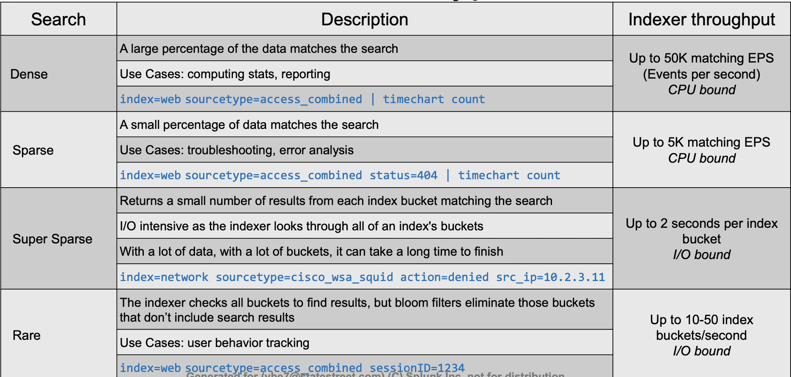
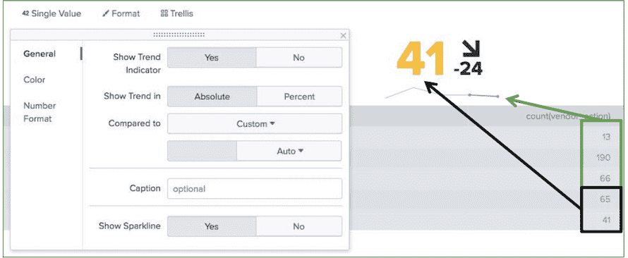
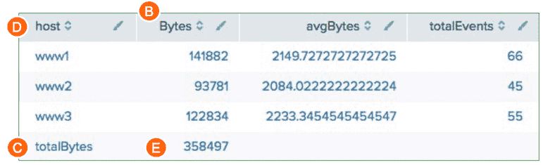
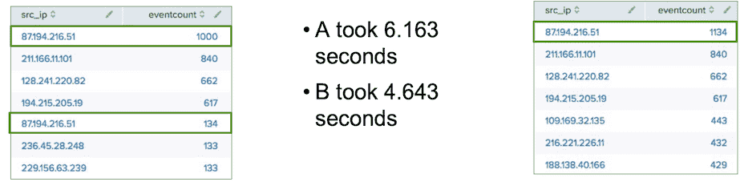
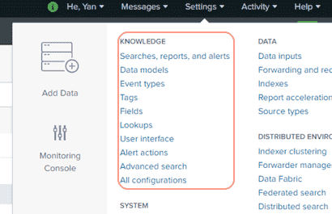
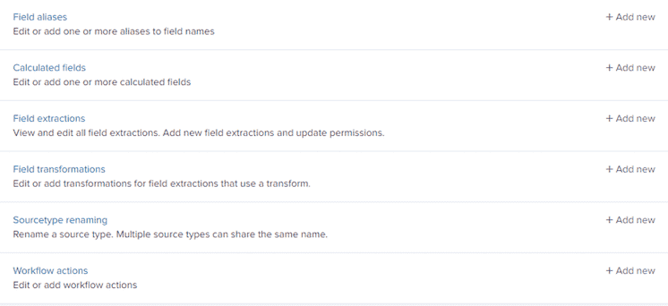
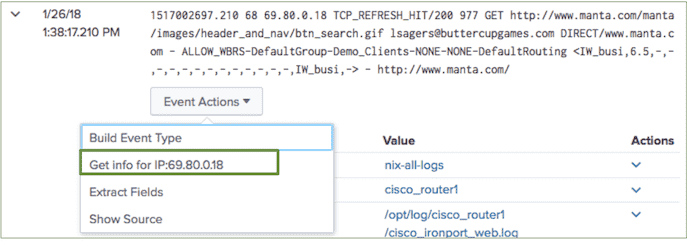

# Splunk Fundamentals 2

::: tip 参考

- 官网付费Course (*based on version: 7.x*)

::: 

## Beyond Search Fundamentals

### Basic Search Review

- **Keywords** : For example, search for a single word (e.g., error) or group of words (e.g., error password)
- **Booleans** : NOT, OR, AND; AND is implied; MUST be uppercase; can use ( )’s to force precedence sourcetype=vendor_sales OR (sourcetype=access_combined action=purchase)
- **Phrases** : "web error" (different than web AND error)
- **Field searches** : status=404, user=admin
- **Wildcard (\*)** 
	- status=40* matches 40, 40a, 404, etc.
	- Starting keywords with a wildcard is very inefficient, e.g. ***dmin**
- **Comparisons** : =, !=, <, <=, >=, > status>399, user!=admin

#### Basic Search Review (cont.)

- **table**: returns table containing only specified fields in result set • rename: renames a field in results
- **fields**: includes or excludes specified fields
- **dedup**: removes duplicates from results
- **sort**: sorts results by specified field
- **lookup**: adds field values from external source (e.g., csv files)

### Transforming Search Commands

- A transforming command:
	- Massages raw data into a data table
	- 'Transforms' specified cell values for each event into numerical values that you can use for statistical purposes
	- Is required to 'transform' search results into visualizations
- Transforming commands include:
	- **top**
	- **rare**
	- **chart**
	- **timechart – stats**
	- **geostats**

### Case Sensitivity – Sensitive

| Case sensitive                                       | Examples                                                     |
| ---------------------------------------------------- | ------------------------------------------------------------ |
| Boolean operators (uppercase)                        | AND, OR, NOT (Boolean operators) and, or, not (literal keywords) |
| Field names                                          | productId vs. productid  eval cs_username = "Total Access"   |
| Field values from lookup (default, but configurable) | product_name="Tulip Bouquet" vs. product_name="tulip bouquet" |
| Regular expressions ]                                | \d\d\d vs. \D\D\D                                            |
| eval and where commands                              | eval action=if(action=="view",...) where action="Purchase"  stats count(eval(action="view") as... |
| Tags                                                 | tag=DMZ vs. tag=dmz                                          |

### Case Sensitivity – Insensitive

| Case insensitive      | Examples                                                     |
| --------------------- | ------------------------------------------------------------ |
| Command names         | `STATS, stats, sTaTs `                                       |
| Command clauses       | `AS used by stats, rename, ...; BY used by stats, chart, top, ...; WITH used by replace ` |
| Search terms          | `failed, FAILED, Failed `                                    |
| Statistical functions | `avg, AVG, Avg used by stats, chart, ... `                   |
| Field values          | `host=www1, host=WWW1 ` 							(unless coming from a lookup) |

### How Splunk Searches – Buckets

- As events come in, Splunk places them into an index's hot bucket (only writable bucket)
- As buckets age, they roll from the hot to warm to cold
- Each bucket has its own raw data, metadata, and index files
- Metadata files track source, sourcetype, and host
- Admins can add more

### How Splunk Searches – Searching

- When you search, Splunk uses the time range to choose which buckets to search and then uses the bucket indexes to find qualifying events
- When you search for `index=web password fail*` during the last 24 hours:
  - Splunk identifies the buckets for the last 24 hours
    - And searches the indexes of those buckets for the search terms

| Hot: Now to -3h                              | index | raw events |
| -------------------------------------------- | ----- | ---------- |
| <font color=red>Hot: -3 to -6h</font>        | index | raw events |
| <font color=red>Hot: -5 to -8h</font>        | index | raw events |
| <font color=orange>Warm: -9 to -12h</font>   | index | raw events |
| <font color=orange>Warm: -12 to -15h</font>  | index | raw events |
| <font color=orange>Warm: -14 to -17h</font>  | index | raw events |
| .....                                        | index | raw events |
| <font color=orange>Warm: -42 to -45h</font>  | index | raw events |
| <font color=orange>Warm: -45 to -48h</font>  | index | raw events |
| <font color=blue>Cold: -48 to -51h</font>    | index | raw events |
| <font color=blue>Cold: -51 to -54h</font>    | index | raw events |
| <font color=blue>Cold: -54 to -57h...</font> | index | raw events |

### General Search Practices (推荐)

- As events are stored by time, time is the most efficient filter
- After time, most powerful keywords are host, source, sourcetype
- To make searches more efficient, include as many terms as possible - e.g., searching for sourcetype=*x* failure is better than failure
- Use the fields command to extract (discover) only fields you need
	> Example: Search last 365 days, scans 566,720 events (in secs): 
	>
	> `index=web sourcetype=access_combined` 	15.16 
	>
	> `index=web sourcetype=access_combined | fields clientip bytes referrer` 	4.49
- Inclusion is generally better than exclusion
- Searching for "access denied" is faster than
	```
	   NOT "access granted"
	```
- Filter as early in your search as possible
- Removing duplicates then sorting is faster than sorting then removing duplicates
- Use the appropriate search mode
	- Fast - performance over completeness
	- Smart [default]
	- Verbose - completeness over performance

**Wildcards**

- Splunk only searches for whole words, but wildcards allowed
- Only *trailing* wildcards make efficient use of index
	- Wildcards at *beginning* of string scan all events within time frame
	- Wildcards in *middle* of string may return inconsistent results – So use fail* (not *fail or *fail* or f*il)
- Wildcards tested after all other terms

### Reviewing Search Mode – Fast/Smart/Verbose

#### Fast Mode

- Emphasizes performance, returning only essential and required data
- For non-transforming searches:
	- ✓ Events – fields sidebar displays only those fields required for the search
	- ✓ Patterns
	- ✗ Statistics or visualizations
- Contents of interesting fields sidebar are lost
- For transforming searches: 
	- ✗ Events
	- ✗ Patterns
	- ✓ Statistics or visualizations

#### Smart Mode (Default)

- Designed to give you the best results for your search
- Combination of Fast and Verbose modes
- For non-transforming searches [Verbose]: 
	- ✓ Events – fields sidebar displays all fields 
	- ✓ Patterns
	- ✗ Statistics or visualizations
- For transforming searches: 
	- ✗ Events
	- ✗ Patterns
	- ✓ Statistics or visualizations

#### Verbose Mode

- Emphasizes completeness by returning all possible field and event data
- For non-transforming searches:
	- ✓ Events – fields sidebar displays all fields 
	- ✓ Patterns
	- ✗ Statistics or visualizations
- For transforming searches: 
	- ✓ Events
	- ✓ Patterns
	- ✓ Statistics or visualizations

#### Modes Summary

- Use the most appropriate search mode:
```
  index=web sourcetype=access_combined
  | chart count by product_name
```
- Time range: last 365 days
| Mode     | Returned Results | Events Scanned | Time |
| ----------------------- | ---------- |---------- | ---------- |
|   Fast  | 14 | 566,731 | 1.82 |
|   Smart  | 14 | 566,731 | 1.91 |
|   Verbose  | 14 | 566,731 | 15.21 |

### Search Performance – Types of Searches

<div style="display:flex;"></div>


### Search Job Inspector

- Tool allows you to examine:
	- Overall stats of search (e.g., records processed and returned, processing time)
	- How search was processed – Where Splunk spent its time
- Use to troubleshoot search’s performance and understand impact of knowledge objects on processing (e.g., event types, tags, lookups)
- Any existing (i.e., not expired) search job can be inspected

#### 3 Components

- Header
	- Top of Search job inspector provides basic information, including time to run and # of events scanned
- Execution costs
	- Provides details on cost to retrieve results, such as:
		- `command.search.index`: Time to search the index for the location to read in rawdata files
		- `command.search.filter`: Time to filter out events that do not match
		- `command.search.rawdata`: Time to read events from the rawdata files
- Search job properties
	- Example: `index=sales sourcetype=vendor_sales VendorID>=7000 AND VendorID<9000`
	- Produces scanCount of 127,201 events
	- Returns resultCount of 2,144 in 3.01 seconds
	- To calculate performance:
		- Do not use resultCount/time 2,144 / 3.01 = 712 EPS* (* EPS= events per second)
		- Rather, calculate scanCount/time 127,201/ 3.01 = 40,892 EPS

## Commands for Visualizations

### Visualization Types

When a search returns statistical values, results can be viewed with a wide variety of visualization types

- Statistics table
- Charts: Line, column, pie, etc 
- Single value, gauges
- Maps
- Many more

### chart Command

- chart command can display any series of data that you want to plot
- You decide which field to plot on the x-axis
	- The function defines the value of the y-axis, therefore it should be numeric – The first field after the over clause is the x-axis
	- Using the over and by clauses divides the data into sub-groupings
		- The values from the by clause display in the legend

```sql
chart avg(bytes) over host
– The host values display over the x-axis

chart avg(bytes) over host by product_name
– The host field is the x-axis and the series is further split by product_name
```

examples:

``` sql
/* over field */

index=security sourcetype=linux_secure
| chart count over vendor_action


/* over field by field */

//- You can use the by clause with the over clause to split results (over vendor_action by user)
//- Alternatively, you can just use two by clauses (by vendor_action, user)
//- You can only split chart results over TWO dimensions (unlike stats results)

index=security sourcetype=linux_secure
| chart count over vendor_action by user
 
```

#### Including NULL and OTHER Values

- chart and timechart commands automatically filter results to include the ten highest values
	- Surplus values are grouped into OTHER
- In this example, the results are skewed by NULL and OTHER
	- These values are shown by default
``` sql
index=web sourcetype=access_combined status>399
| chart count over host by itemId
```

#### Omitting NULL and OTHER Values

- To remove empty (NULL) and OTHER field values from the display, use these options:
	- useother=f
	- usenull=f
``` sql
index=web sourcetype=access_combined status>399
| chart count over host by itemId useother=f usenull=f
```

#### Limiting the Number of Values

- To adjust the number of plotted series, use the limit argument 
- For unlimited values, use limit=0
``` sql
index=web sourcetype=access_combined action=purchase status=200
| chart sum(price) over host by product_name limit=5 useother=f
```

### timechart Command
- timechart command performs statistical aggregations against time
- Plots and trends data over time
- _time is always the x-axis
- You can optionally split data using the by clause for one other field - Each distinct value of the split by field is a separate series in the chart
- Timecharts are best represented as line or area charts

Examples:

``` sql
index=network sourcetype=cisco_wsa_squid usage=Violation
| timechart count

/* Multiple Values */
index=network sourcetype=cisco_wsa_squid
| timechart count by usage

/* other settings: 

    Multi-series: No
    Multi-series: Yes

*/
```

#### Adjusting the Sampling Interval

- The timechart command "buckets" the values of the _time field
	- This provides dynamic sampling intervals, based upon the time range of the search
- Example defaults:
	- Last 60 minutes uses span=1m 
	- Last 24 hours uses span=30m
- Adjust the interval using the span argument, e.g. span=15m
``` sql
index=security sourcetype=linux_secure vendor_action=*
| timechart span=15m count by vendor_action

/* other settings:

    Trellis Layout - 
    • Display multiple charts based on one result set
    • Allows visual comparison between different categories
    • Data only fetched once
    
    Visualization Formatting   【图表菜单里的各种设置】
    	...
    	Chart Overlay  
    	... 
*/
(index=web sourcetype=access_combined action=purchase status<400) OR (index=sales sourcetype=vendor_sales)
| timechart span=1h sum(price) by sourcetype
| rename access_combined as webSales, vendor_sales as retailSales
```

### Transforming Command Summary

**some comparation** 

| Feature                           | stats | chart                  | timechart              |
| --------------------------------- | ----- | ---------------------- | ---------------------- |
| Multi-level breakdown [by clause] | Many  | 2                      | 1                      |
| Limit # series shown              | NA    | limit=*n* *Default=10* | limit=*n* *Default=10* |
| Filter other series               | NA    | useother=f             | useother=f             |
| Filter null values                | NA    | usenull=f              | usenull=f              |
| Set time value on x axis          | NA    | NA                     | span                   |

**To count the frequency of a field(s), use top/rare**

``` sql
index=security sourcetype=linux_secure
| top src_ip, user, vendor_action, app

index=security sourcetype=linux_secure
| rare src_ip, user, vendor_action, app
```

**Use stats to calculate statistics for two or more by fields (non time-based)**

``` sql
index=security sourcetype=linux_secure
| stats count by src_ip, user, vendor_action, app
```

**To calculate statistics with an arbitrary field as the x-axis (not _time), use chart**
- When you use a by field, the output is a table
- Each column represents a distinct value of the split-by field

``` sql
index=security sourcetype=linux_secure
| chart count over src_ip
  by vendor_action
```

**Use timechart to calculate statistics with _time as the x-axis**

- If a by field is used, the output is a table
- Each column represents a distinct value of the split-by field

``` sql
... |  timechart span=1h count by itemId limit=3 useother=f
```

## Advanced Visualizations

### trendline Command

- Allows you to overlay a computed moving average on a chart 
- trendline computes the moving averages of a field<br>
	`trendline <trendtype><period>(field) [AS newfield]`
	>  *trendtype*:
	>
	> – sma - simple moving average<br>– ema - exponential moving average<br>– wma - weighted moving average
- Must define the period over which to compute the trend
- period must be an integer between 2 and 10000
	- For example, `sma2(sales) `is valid
	- But `sma(sales)` would fail as it is missing an integer, the defining period

``` sql
index=web sourcetype=access_combined action=purchase status=200 
| timechart span=2h sum(price) as sales
| trendline sma2(sales) as trend
```


### iplocation Command

- Use iplocation to look up and add location information to an event
	- This information includes `city`,`country`,`region`,`latitude` and `longitude`
- Not all of the information is available for all ip address ranges
- Automatically defines the default lat and lon fields required by `geostats` （自动产生geostats命令所需要的经度、纬度）

``` sql
index=security sourcetype=linux_secure (fail* OR invalid)
| iplocation src_ip
```

### geostats Command

- Use geostats to compute statistical functions and render a cluster map <br>
	`geostats [latfield=string] [longfield=string] [stats-agg- term]* [by-clause]`
- Data must include latitude and longitude values
- Define the latfield and longfield only if they differ from the default lat and lon fields
- To control the column count:
	- On a global level, use the globallimit argument
	- On a local level, depending on where your focus is (i.e., where you’ve zoomed in), use the locallimit argument

``` sql
index=security sourcetype=linux_secure
(fail* OR invalid)
| iplocation src_ip
| geostats globallimit=5 count by user
```

### Choropleth Map

- Uses shading to show relative metrics, such as sales, network intruders, etc. for predefined geographic regions
- To define regional boundaries, you must have either a: 
	- KML (Keyhole Markup Language) file
	- KMZ (compressed Keyhole Markup Language) file
- Splunk ships with:
	- geo_us_states, United States
	- geo_countries, countries of the world

`...| geom [*featureCollection*] [featureIdField=*string*]`

### geom Command

> Display the previous week’s retail sales in EMEA.

``` sql
index=sales sourcetype=vendor_sales
VendorID > 4999 AND VendorID < 6000
| stats count as Sales by VendorCountry
| geom geo_countries featureIdField=VendorCountry
```

### Viewing Results as a Single Value

> some examples - you can change the format in the configuration options

``` sql
index=security sourcetype=linux_secure vendor_action=failed
| stats count
```

``` sql
sourcetype=access_combined action=purchase
| stats sum(price) as count
| gauge count 0 5000 10000 15000
```

``` sql
index=security sourcetype=linux_secure (fail* OR invalid)
| stats count(vendor_action)
```

``` sql
index=security sourcetype=linux_secure
 (fail* OR invalid)
| chart count by src_ip 
| sort -count
```

``` sql
index=security sourcetype=linux_secure (fail* OR invalid)
| stats count
```

#### Single Value Visualizations: timechart

- With the timechart command, you can add a sparkline and a trend
- A **sparkline** is an inline chart
  - It is designed to display time- based trends associated with the primary key
- The **trend** shows the direction in which values are moving
  - It appears to the right of the single value

``` sql
index=security sourcetype=linux_secure 
fail* OR invalid
| timechart span=15m count(vendor_action)
```

<div style="display:flex;"></div>

### Adding Totals (Auto & Command)

#### Using Format Options

> 选择 statistic -> Format -> Summary  打开 Totals/Percentages
>
> 此方法会自动对所有column添加 totals/百分比， 无法定制化

- Automatically total every column using the Format options
- When using this approach, you:
	- Cannot indicate which column to total; all columns are always totaled
	- Cannot add labels

``` sql
index=web sourcetype=access_combined
| stats sum(bytes) as Bytes,
  avg(bytes) as avgBytes,
  count as totalEvents by host
```

#### Using addtotals Command

- Alternatively, use the addtotals command to:
	- Compute the sum of all **or selected** numeric fields for each column and place the total in the last row
	- Compute the sum of all **or selected** numeric fields for each **row** and place the total in the last column

`addtotals [row=*bool*] [fieldname=*field*] [col=*bool*][labelfield=*field*] [label=*string*] *field-list*`

| **Row Options**                   | **Row Options**                                              | **Column Options**              | **Column Options**                                           |
| --------------------------------- | ------------------------------------------------------------ | ------------------------------- | ------------------------------------------------------------ |
| row=true/false (Default= true)    | A column is created that contains numeric totals for each row. | col=true/false (Default= false) | A row is created that contains numeric totals for each column. |
| fieldname=*field* (Default=Total) | Defines a string used to create a field name for the totals column. | label=*string* (Default=Total)  | Defines a string used to name the totals row.                |
|                                   |                                                              | labelfield= *fieldname*         | Defines where the label string is placed. (Generally, you should make this the first column.) |

| **General Options**                                          | **General Options**                       |
| ------------------------------------------------------------ | ----------------------------------------- |
| *field-list*=one or more numeric fields. (Default: all numeric fields) | Defines the numeric fields to be totaled. |

>  Examples:  (具体参考官方pdf： [Splunk 7.X Fundamentals Part 2 (IOD)-unlock.pdf](http://heyan.site/download/Splunk%207.X%20Fundamentals%20Part%202%20%28IOD%29-unlock.pdf))

``` sql
index=sales sourcetype=vendor_sales
| chart count over product_name by VendorCountry
| addtotals
fieldname="Total Per Product" 
col=t 
label="Total Per Country" labelfield=product_name
```

- row=t (default) counts the fields in each row under a column named "Total Per Product”
- col=t counts the fields in each row in a row named "Total Per Country"

``` sql
index=web sourcetype=access_combined
| stats sum(bytes) as Bytes,
	avg(bytes) as avgBytes,
	count as totalEvents by host
| addtotals row=f *A* col=t *B* label=totalBytes *C*
	labelfield=host *D* Bytes *E*
	
// *A* *B* ... 是注释序号 
```

- A - Do not total rows
- B - Total columns
- C - Add the label totalBytes
- D - Place the label under the host column
- E - Only total the Bytes column

<div style="display:flex;"></div>

## Filtering and Formatting Data

### eval Command (overview)

- eval allows you to calculate and manipulate field values in your report<br>`eval *fieldname1* = *expression1 [, fieldname2 = expression2...]*`
- Supports a variety of functions
- Results of eval written to either new or existing field you specify
  - If the destination field exists, the values of the field are replaced by the results of eval
  - Indexed data is not modified, and no new data is written into the index 
  - Field values are treated in a case-sensitive manner
- The eval command allows you to: 
  - Calculate expressions
  - Place the results in a field
  - Use that field in searches or other expressions
- Type & Operators
  - Arithmetic `+ - * / %`
  - Concatenation `+ .`
  - Boolean `AND OR NOT XOR`
  - Comparison `< > <= >= != = == LIKE`

### eval Command – Convert Values

``` sql
index=network sourcetype=cisco_wsa_squid 
| stats sum(sc_bytes) as Bytes by usage 
| eval bandwidth = Bytes/(1024*1024)
```

> In this example:
>
> - Calculate the number of bytes for each usage type
> - Create a new field named "bandwidth"
> - Convert the values of the Bytes field into MB by dividing Bytes field values by (1024*1024)

### eval Command – Round Values

``` sql
index=network sourcetype=cisco_wsa_squid
| stats sum(sc_bytes) as Bytes by usage
| eval bandwidth = round(Bytes/(1024*1024), 2) 
| sort -bandwidth
| rename bandwidth as "Bandwidth (MB)"
```

**Removing Fields**

``` sql
index=network sourcetype=cisco_wsa_squid
| stats sum(sc_bytes) as Bytes by usage
| eval bandwidth = round(Bytes/(1024*1024), 2) | sort -bandwidth
| rename bandwidth as "Bandwidth (MB)"
| fields - Bytes
```

### eval Command – Calculating Values

``` sql
index=web sourcetype=access_combined product_name=* action=purchase
| stats sum(price) as tp, sum(sale_price) as tsp by product_name
| eval Discount = round(((tp - tsp)/ tp)*100)
| sort -Discount
| eval Discount = Discount."%"
| rename tp as "Total List Price", tsp as "Total Sale Price", product_name as Product
```

### eval Command – tostring Function

- tostring converts a numeric field value to a string <br> `tostring(field,"*option*") `
- Options:
	- "commas": applies commas
		- If the number includes decimals, it rounds to two decimal places
 	- "duration": formats the number as "hh:mm:ss"
	- "hex": formats the number in hexadecimal

``` sql
index=web sourcetype=access_combined
action=purchase status=503
| stats count(price) as NumberOfLostSales,
  avg(price) as AverageLostSales,
  sum(price) as TotalLostRevenue
| eval AverageLostSales = "$" + tostring(AverageLostSales, "commas"),
  TotalLostRevenue = "$" + tostring(TotalLostRevenue, "commas")
```

> with duration option

``` sql
index=web sourcetype=access_combined
| stats range(_time) as sessionTime by JSESSIONID | sort 5 -sessionTime
| eval duration = tostring(sessionTime,"duration")
```

### eval Example - Formatting and Sorting Values

- eval with added characters converts numeric field values to strings
- To order numerically, first sort, then use eval

``` sql
index=web sourcetype=access_combined price=*
| stats values(price) as price by product_name
| sort -price
| eval price = "$".price
```

### eval Commands with Multiple Expressions

- Multiple expressions can be combined into one eval command
- Each subsequent expression references the results of previous expressions
- Expressions must be separated by commas

``` sql
eval fieldname1 = expression1, 
		 fieldname2 = expression2,
     fieldname3 = expression3...
```

*example*:

``` sql
index=web sourcetype=access_combined price=*
| stats values(price) as list_price, values(sale_price)
  as current_sale_price by product_name
| eval current_discount = round((list_price – current_sale_price)/list_price*100,2), 
	new_discount = (current_discount - 5),
	new_sale_price = list_price - (list_price * (new_discount/100))
```

### eval Command – if Function Syntax

`if(*X*,*Y*,*Z*)`

- The if function takes three arguments
- Thefirstargument,X, isaBooleanexpression
	- If it evaluates to TRUE, the result evaluates to the second argument, Y 
	- If it evaluates to FALSE, the result evaluates to the third argument, Z
- Non-numeric values must be enclosed in "double quotes" • Field values are treated in a case-sensitive manner

``` sql
example:

index=sales sourcetype=vendor_sales
| eval SalesTerritory =
| stats sum(price) as TotalRevenue by SalesTerritory
| eval TotalRevenue = "$" + tostring(TotalRevenue, "commas")
```

### eval Command – case Function

`case(X1,Y1,X2,Y2...)`

- Thefirstargument,X1, isaBooleanexpression
- If it evaluates to TRUE, the result evaluates to Y1
- If it evaluates to FALSE, the next Boolean expression, X2, is evaluated, etc.
- If you want an “otherwise” clause, just test for a condition you know is true at the end (e.g., 0=0)

``` sql
index=web sourcetype=access_combined
| eval rating = case(productId LIKE "WC%", "Teen", productId LIKE "FS%", Mature", 0=0, "Unrated")
```

### eval function

- Used within a transforming command, such as stats
- Requires an as clause
- Double quotes are required for character field values
- Field values are case-sensitive

``` sql
index=security sourcetype=linux_secure vendor_action=*
| stats
	count(eval(vendor_action="Accepted")) as Accepted, 
	count(eval(vendor_action="Failed")) as Failed, 
	count(eval(vendor_action="session opened")) as SessionOpened
```

### Filtering Results – search and where

-  The search and where commands both filter results
	- search
		- May be easier if you’re familiar with basic search syntax
		- Treats field values in a case-insensitive manner 
		- Allows searching on keyword
		- Can be used at any point in the search pipeline
	- where
		- Can compare values from two different fields
		- Functions are available, such as isnotnull() 
		- Treats field values in a case-sensitive manner
		- Can’t appear before first pipe in search pipeline

### search Command

- To filter results, use search at any point in the search pipeline
- Behaves exactly like search strings before the first pipe
	- Uses the "\*" wildcard
	- Treats field values in a case-insensitive manner

``` sql
index=web sourcetype=access_combined
action=purchase status=200
| stats sum(price) as sales by product_name
| search sales>500
| sort –sales
| eval sales="$"+sales
| rename sales as "Popular Products",
  product_name as "Product Name"
```

### where Command

`where eval-expression`

- Uses same expression syntax as eval command
- Uses boolean expressions to filter search results and only keeps results that are True
	- Double quoted strings are interpreted as field values
- Treats field values in a case-sensitive manner
	- Unquoted or single-quoted strings are treated as fields

``` sql
index=web sourcetype=access_combined
| timechart count(eval(action="changequantity"))
  as changes, count(eval(action="remove")) as removals
| where removals > changes
```

### where Command With like Operator

- Can do wildcard searches with where command
- Use (_) for one character and (%) for multiple characters
- Must use the like operator with wildcards

``` sql
index=security sourcetype=linux_secure
| stats count by src_ip
| where src_ip like "10_.%"
```

### fillnull Command

- Use fillnull to replace null values in fields
- Use value=string to specify a string you want displayed instead <br> Example: `fillnull value=NULL`
- If no value= clause, **default replacement value is 0**
- Optionally, restrict which fields fillnull apply to by listing them at end of command<br>Example: `fillnull VALUE=“N/A” discount refund`

``` sql
index=sales sourcetype= vendor_sales
| chart sum(price) over product_name by VendorCountry
| fillnull

// null will be replaced as default value 0
```

``` sql
index=sales sourcetype= vendor_sales
| chart sum(price) over product_name by VendorCountry
| fillnull value="No Value"
```

## Correlating Events

### What is a Transaction?

- A transaction is any group of related events that span time
- Events can come from multiple applications or hosts
	- Events related to a single purchase from an online store can span across an application server, database, and e-commerce engine
	- One email message can create multiple events as it travels through various queues
	- Each event in the network traffic logs represents a single user generating a single http request
	- Visiting a single website normally generates multiple http requests
		- HTML, JavaScript, CSS files
		- Flash, images, etc.

### transaction Command

- transaction `field-list`
	- `field-list` **can be one field name or a list of field names**
	- Events are **grouped** into transactions based on the values of these fields (结果自动被group了)
	- If multiple fields are specified and a relationship exists between those fields, events with related field values are grouped into a single transaction
-  Common constraints: <br> `maxspan`   `maxpause`  `startswith`   `endswith`

*example*:

``` sql
index=web sourcetype=access_combined
| transaction JSESSIONID
```

``` sql
index=web sourcetype=access_combined
| transaction JSESSIONID
| search status=404
| highlight JSESSIONID, 404

//– search uses the "*" wildcard and treats field values in a case-insensitive manner
//– status=404 finds the errors – highlight highlights the terms you specify
```

``` sql
index=security sourcetype=linux_secure failed
| transaction src_ip

// 结果会根据 src_ip 进行分组显示
```

### transaction Command – Specific Fields

The transaction command produces additional fields, such as: 
- **duration** – the difference between the timestamps for the first and last event in the transaction
- **eventcount** – the number of events in the transaction

### transaction Command – maxspan/maxpause

You can also define a max overall time span and max gap between events

- maxspan=10m
	- Maximum total time between the *earliest* and *latest* events
	- If not specified, default is -1 (or no limit)
- maxpause=1m
	- Maximum total time *between* events 
	- If not specified, default is -1 (or no limit)

``` sql
// Assumptions: Transactions spanning more than 10 minutes with the same client IP are considered unrelated. 
// Also, there can be no more than one minute between any two related events.

index=web sourcetype=access_combined
| transaction clientip maxspan=10m maxpause=1m
| eval duration = tostring(duration,"duration")
| sort -duration
| table clientip duration action
| rename  clientip as "Client IP",
  action as "Client Actions"
```

### transaction Command – startswith/endswith

- To form transactions based on terms, field values, or evaluations, use startswith and endswith options
- In this example:
	- The first event in the transaction includes addtocart
	- The last event includes purchase

``` sql
//Scenario: 
//Determine the length of time spent to complete a purchase by customers in the online store over the last 24 hours.

index=web sourcetype=access_combined
| transaction clientip JSESSIONID
  startswith=eval(action="addtocart")
  endswith=eval(action="purchase")
| table clientip, JSESSIONID, duration, eventcount
```

### transaction sample case - Investigating with Transactions

> - Transactions can be useful when a single event does not provide enough information
> - This example searches email logs for the term “REJECT” <br> `index=network sourcetype=cisco_esa REJECT`
> - Events that include the term do not provide much information about the rejection
> - By creating a transaction, you can then search and see additional events related to the rejection, such as:
>   - IP address of sender
>   - Reverse DNS lookup results
>   - Action taken by the mail system following the rejection
> - mid – Message ID
> - dcid – Delivery Connection ID
> - icid – Incoming Connection

``` sql
// 如果直接如上搜索REJECT - 单个event不能提供更多的有效信息。
// 所以可以先根据一些关键信息进行有效分组，再搜索关键字，如下

index=network sourcetype=cisco_esa
| transaction mid dcid icid
| search REJECT
```

### transaction sample case - Reporting on Transactions

*Scenario: Create a chart to show the number of purchase transactions based on their duration.*

``` sql
index=web sourcetype=access_combined
status=200 action=purchase
| transaction clientip maxspan=10m
| chart count BY duration span=log2
```

### transaction vs. stats

- When you have a choice, use stats—**it’s faster and more efficient, especially in large Splunk environments**
- Only use transaction when you:
	- Need to **see events correlated together** （需要看`correlate events`的时候）
	- **Must define event grouping based on start/end values or segment on time**
- Use stats when you:
	- Want to **see the results of a calculation** （只需要看计算结果的时候）
	- Can group events based on a field value (e.g., by src_ip)
- **By default, there’s a limit of 1,000 events per transaction**
	- No such limit applies to stats
	- Admins can change limit by configuring max_events_per_bucket in `limits.conf`

*Example1*:

``` sql
// Scenario: Find online purchase transactions over the past year.

// A:
index=web
sourcetype=access_combined earliest=-1y@y latest=@y
| transaction JSESSIONID
| table JSESSIONID, action, product_name
| sort JSESSIONID
 
 
// B:
index=web
sourcetype=access_combined
earliest=-1y@y latest=@y
| stats values(action)
    as "action",
    values(product_name)
    as "product_name”
    by JSESSIONID
| sort JSESSIONID
 
```

> • Searches produce same result
>
> • A took 23.381 seconds
>
> • B took 2.077 seconds
>
> • stats faster than transaction

*Example2*:

``` sql

// A:
index=security
sourcetype=linux_secure failed
| transaction src_ip
| table src_ip, eventcount
| sort - eventcount


// B:
index=security
sourcetype=linux_secure failed
| stats count as eventcount by src_ip
| sort - eventcount

/*
Note
1. transaction has a limit of 1,000
2. Count of transactions vs. count of IPs
*/
//结果如下
```

<div style="display:flex;"></div>

## Introduction to Knowledge Objects

我们能够在“**Settings**”里面看到权限内的“**KNOWLEDGE**”,如下

<div style="display:flex;"></div>


### What are Knowledge Objects?

**Knowledge objects** are **tools** you use to discover and analyze various aspects of your data (如上图)

- Data interpretation – Fields and field extractions
- Data classification – Event types
- Data enrichment – Lookups and workflow actions
- Normalization – Tags and field aliases
- Datasets – Data models

**Shareable** – Can be shared between users

**Reusable** – Persistent objects that can be used by multiple people or apps, such as macros and reports

**Searchable** – Since the objects are persistent, they can be used in a search

### What is a Knowledge Manager?

- Oversees knowledge object creation and usage for a group or deployment
- Normalizes event data
- Creates data models for Pivot users

### Defining Naming Conventions

This course uses simple names for lab exercises, but using a naming convention in your production environment is recommended. For example:

- **Group:** Corresponds to the working group(s) of the user saving the object (examples: SEG. NEG. OPS. NOC)
- **Object Type:** Indicates the type of object (alert, report, summary- index-populating) (examples: Alert, Report, Summary)
- **Description:** A meaningful description of the context and intent of the search, limited to one or two words if possible;
   ensures the search name is unique

So, for example: SEG_Alert_WinEventlogFailures

### Reviewing Permissions

|                   | **Description**                                              | **Create**               | **Read**                       | **Edit (write)**                |
| :---------------- | ------------------------------------------------------------ | ------------------------ | ------------------------------ | :------------------------------ |
| **Private**       | Only the person who created the object can use it and edit it | User <br>Power <br>Admin | Person who created it<br>Admin | Person who created it<br/>Admin |
| **This app only** | Object persists in the context of a specific app             | Power <br/>Admin         | User\* <br/>Power\* <br/>Admin | User\* <br/>Power\* <br/>Admin  |
| **All apps**      | Object persists globally across all apps                     | Admin                    | User\* <br/>Power\* <br/>Admin | User\* <br/>Power\* <br/>Admin  |

\* Permission to read and/or write if creator gives permission to that role

在object创建时，默认权限是给Owner的，我们可以在此时修改设置 - 具体参考文档

### Managing Knowledge Objects

可以在 **Settings > Knowledge  > All configurations** 下管理所有的 `knowledge objects`


## Creating and Managing Fields

在 **Settings > Knowledge > fields - [Field extractions]** 下，我们可以创建并管理 fields

<div style="display:flex;"></div>

> Field Extractor 方法 - Regex / Delimiter

## Creating Field Aliases and Calculated Fields

**Settings > Knowledge > fields - [Field aliases] / [Calculated fields]** 

具体参考官方pdf： [Splunk 7.X Fundamentals Part 2 (IOD)-unlock.pdf](http://heyan.site/download/Splunk%207.X%20Fundamentals%20Part%202%20%28IOD%29-unlock.pdf)

<br>

<br>

## Working with Tags and Event Types

具体参考官方pdf： [Splunk 7.X Fundamentals Part 2 (IOD)-unlock.pdf](http://heyan.site/download/Splunk%207.X%20Fundamentals%20Part%202%20%28IOD%29-unlock.pdf)

<br>

<br>

## Creating and Using Macros

具体类似函数，同样可以定义参数

**Settings > Advanced search > Search Macros** > Add new

*请参考文档查看*：

- 怎么使用一个基本的macro
- 怎么添加参数
- 怎么使用参数（调用）
- 怎么去验证你的macro

*example*:

> 基本使用，example:
>
> <br>
>
> 定义：
>
> Name: **US_sales**
>
> Definition: <br>
>
> ```sql
> sourcetype=vendor_sales VendorCountry="United States"
> | stats sum(price) as USD by product_name 
> | eval USD = "$" + tostring('USD’,"commas")
> ```
> <br>
>
> 使用:  直接在搜索里面输入 带特殊单引号的 macro名字即可<br>\``US_sales`\`

> 带参数的使用，example:
>
> <br>
>
> 定义：
>
> Name: montly_sales(3)      -- 3 代表参数的个数
>
> Definition:<br>
>
> ```sql
> stats sum(price) as USD by product_name
> | eval $currency$ = "$symbol$" + tostring(USD*$rate$, "commas")
> | USD = "$" + tostring(USD, "commas")
> ```
>
> Arguments:<br>`currency,symbol,rate`
>
> <br>
>
> 使用：<br>
>
> ```sql
> sourcetype=vendor_sales VendorCountry=Germany
> OR VendorCountry=France OR VendorCountry=Italy
> | `monthly_sales(euro,€,0.79)`
> ```
>
> > 相当于:
> >
> > ``` sql
> >  sourcetype=vendor_sales VendorCountry=Germany 
> >  OR VendorCountry=France OR VendorCountry=Italy | 
> >  ------
> >  stats sum(price) as USD by product_name
> >  | eval euro = "€" + tostring(USD*0.79, "commas") 
> >  | eval USD = "$" + tostring(USD, "commas")
> >  ------
> > ```


## Creating and Using Workflow Actions

Execute workflow actions from an event in your search results to interact with external resources or run another search
- **GET** - retrieve information from an external resource
- **POST** - send field values to an external resource
- **Search** - use field values to perform a secondary search （新开一个search）

<div style="display:flex;"></div>

**create workflow actions:**

**Settings > Fields > Workflow actions > New Workflow Action**

> 具体参考官方pdf： [Splunk 7.X Fundamentals Part 2 (IOD)-unlock.pdf](http://heyan.site/download/Splunk%207.X%20Fundamentals%20Part%202%20%28IOD%29-unlock.pdf)

<br>

<br>

## Creating Data Models

<br>

<br>

to be added 

<br>

<br>

## Using the Common Information Model (CIM) Add-On

<br>

<br>

to be added 

<br>

<br>