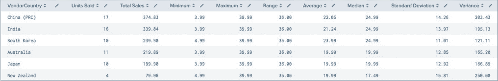
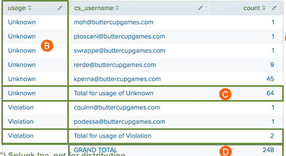
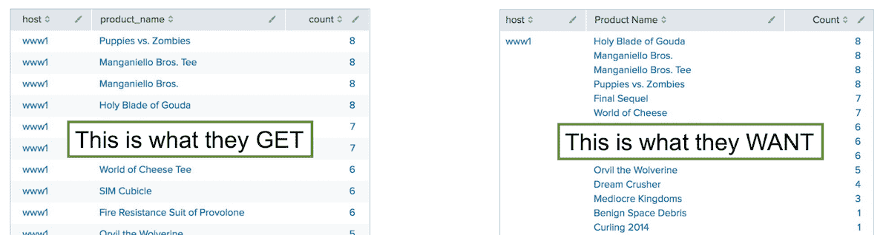
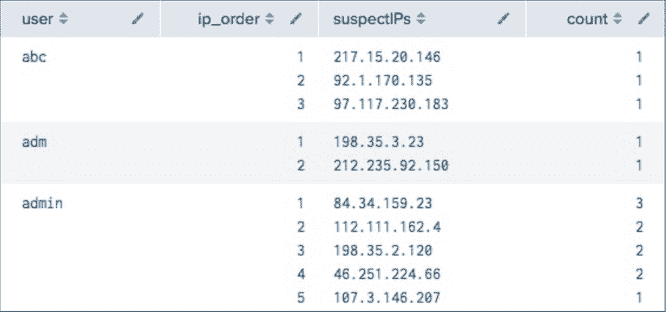

# Splunk Fundamentals 3

::: tip 参考

- 官网付费Course (*based on version: 7.x*)

::: 


## Exploring Statistical Commands

### Reviewing the stats Command

- Enables you to calculate statistics on data that match your search criteria
- stats functions you’ve seen in previous courses include:
  - **count**: returns the number of events that match the search criteria
  - **distinct_count** or **dc**: returns a count of unique values for a given field - sum: returns a sum of numeric values
  - **list**: lists all values of a given field
  - **values**: lists unique values of a given field

### Performing Statistical Analysis with stats Functions

A variety of other stats functions are available for more detailed statistical information, including:

- **min**: minimum value
- **max**: maximum value
- **avg** or **mean**: average value
- **median**: “middle” value
- **range**: difference between minimum and maximum values
- **stdev**（标准差）: standard deviation (measure of the extent of deviation of the values)
- **var**（方差）: variance (measure of how far the values are spread out)

``` sql
index=sales sourcetype=vendor_sales VendorID>=7000 AND VendorID<9000

| stats count(price) as count, sum(price) as sum, min(price) as Minimum, max(price) as Maximum, 
range(price) as Range, mean(price) as Average, median(price) as Median, 
stdev(price) as sdev, var(price) as Variance by VendorCountry

| eval Average = round(Average,2), sdev = round(sdev,2), Variance = round(Variance,2)
| sort -sum
| rename count as "Units Sold", sum as "Total Sales", sdev as
"Standard Deviation"
```

> 标准差：是离均差平方的算术平均数（即：方差）的算术平方根
>
> 方差=标准差的平方

<div style="display:flex;"></div>

### fieldsummary Command

- Calculates a variety of summary stats for all or a subset of fields 
- Displays summary info as results table
- Syntax: `... | fieldsummary [maxvals=num] [field-list]`
- Takes optional arguments
	- maxvals: maximum distinct values to return for each field 
	- field-list: list of fields to calculate statistics for

### fieldsummary Results Table Contents

- **field**: field name
- **count**: number of events with that field
- **distinct_count**: number of unique values in field
- **is_exact**: Boolean (0 or 1) indicating whether distinct_count is exact
- **mean** (if field numeric)
- **min** (if field numeric)
- **numeric_count**: count of numeric values in field
- **stdev** (if field numeric) 
- **values**: distinct values of field and count of each value - 如果distinct值很多，可使用maxval限制
- **max** (if field numeric)

> if no maxvals is specified, then is_exact will always equal 1.

``` sql
/* Scenario:
A data scientist at Buttercup Games wants to study the variance of data in all 
Web events collected over the past 15 minutes.
*/

index=web earliest=-15m latest=now 
| fieldsummary
```

``` sql
/* Scenario:
SecOps manager wants to compare a sampling of IP addresses from 
the security index over the past 24 hours.
*/

index=security earliest=-24h latest=now
| fieldsummary maxvals=10 bcg_ip src_ip
```

### appendpipe Command

- appendpipe
	1. Takes the existing results and pushes them into the sub-pipeline
	2. Then, appends the result of the sub-pipeline as new lines to the outer search
- Results are displayed in-line
- Example: appendpipe [stats sum(count) as count by usage]

### appendpipe Command – Subtotals

``` sql
/* Scenario:
IT wants to find the number of non-business related connections 
to the Internet for the last 24 hours, by user and total attempts by usage.
*/

/*
• Look for usage other than
Business
• Count number of connections by usage and user
• Add a subtotal below each group of usage values
*/

index=network sourcetype=cisco_wsa_squid usage!=Business 
| stats count by usage, cs_username 
| appendpipe [stats sum(count) as count by usage] 
| sort usage
```

``` sql
/*Use eval to provide a description for the accumulated field*/

index=network sourcetype=cisco_wsa_squid usage!=Business 
| stats count by usage, cs_username
| appendpipe [stats sum(count) as count by usage 
	| eval cs_username="Total for usage of ".usage] 
| sort usage
```

### appendpipe Command – Grand Total

- Can use multiple appendpipe commands
- The second appendpipe adds a grand total to the end of the report
- If there is more than one page, the grand total displays on the last page

``` sql
/* Scenario: 
Sec Ops wants the number of non- business related connections to the Internet for the last 4 hours, 
by user and total attempts by usage. They also want a subtotal of total attempts by usage and a grand total.
*/

index=network sourcetype=cisco_wsa_squid usage!=Business 
| stats count by usage, cs_username
| appendpipe [stats sum(count) as count by usage 
	| eval cs_username = "Total for usage of ".usage] 
| appendpipe [search cs_username="Total for*"
| stats sum(count) as count
| eval cs_username = "GRAND TOTAL"] 
| sort usage, count
```

<div style="display:flex;"></div>

### Using count and list Functions

``` sql
index=web sourcetype=access_combined
	action=purchase status=200
| stats count by host, product_name
```

使用上面的语句，我们会得到下图左边的结果。

<div style="display:flex;"></div>

要想得到右边这种更加友好的结果，使用如下语句

``` sql
index=web sourcetype=access_combined action=purchase status=200 
| stats count by host, product_name
| sort -count
| stats list(product_name) as "Product Name", 
		list(count) as Count  by host
```

``` sql
/* Scenario:
Sorted descending by count, per host
*/

/*sum(count) as total sums the count values for each host into a new field called total
– Used to sort
– Removed from results
*/

index=web sourcetype=access_combined product_name=* | stats count by host, product_name
| sort -count
| stats list(product_name) as "Product Name",
  list(count) as Count, sum(count) as total by host
| sort -total
| fields - total
```

### eventstats Command

- Generates summary statistics of all existing fields in your search results （也就是eventstats 是对最初search的结果进行统计，而不是对上一个pipline的结果）
- Saves them as values in new fields
- Both original fields and summary stats are then available for calculations

``` sql
/* Scenario:
For a new campaign, 
the online sales manager wants a display of products that 
are losing more sales than the average during the last 24 hours.
*/

index=web sourcetype=access_combined action=remove
| chart sum(price) as lostSales by product_name
| eventstats avg(lostSales) as averageLoss
| where lostSales > averageLoss
| sort -lostSales
| fields - averageLoss

/*
• Find the aggregate ‘lost sales’ by product
• Use eventstats to calculate the average loss
*/
```

``` sql
/* Scenario:
The sales team want to know the lowest and highest sales totals during the previous week 
– and on which days they occurred.
*/

index=web sourcetype=access_combined
| timechart sum(price) as totalSales
| eventstats max(totalSales) as highest, 
	min(totalSales) as lowest 
| where totalSales=highest OR totalSales=lowest 
| eval Outcome = if(totalSales=highest,"Highest","Lowest") 
| eval Day = strftime(_time,"%A") 
| table Day, Outcome, totalSales
| eval totalSales = "$".tostring(totalSales,"commas")

/*
result:
----------------------------------------
|Day		|Outcome	|totalSales|
|Monday		|Lowest		|$46,994.83|
|Saturday	|Highest	|$51,616.77|
----------------------------------------

- Using min, determine the lowest value
- Using max, determine the highest value
- Label highest and lowest values
- Label day of the week
*/
```

### streamstats Command

- Like eventstats command, calculates summary stats on search results and aggregates stats to original data (和eventstats一样，对search后的源结果进行总结统计)
- But:
  - stats and eventstats work on the entire results
  - streamstats calculates statistics *for each result row at the time the command encounters it*

``` sql
/* Scenario:
Sales wants to monitor a moving average of the price of a purchase on the Buttercup Games website 
over the previous 20 purchases during the last 24 hours.
*/
index=web sourcetype=access_combined
action=purchase status=200 productId=*
| table _time, price
| sort _time
| streamstats avg(price) as averageOrder
current=f window=20

/*
• Calculate the average price over the past 20 events (window=20)
• Do not include current event in summary calculations (current=f)
*/
```

``` sql
/* Scenario:
SecOps manager wants the network failures for the last 4 hours by user with the IPs, rank and number of failures.
*/

index=security sourcetype=linux_secure fail*
| stats count by user, src_ip
| sort -count
| streamstats count as ip_order by user
| stats list(ip_order) as ip_order,
  list(src_ip) as suspectIPs,
  list(count) as count by user
```

<div style="display:flex;"></div>

## Exploring eval Command Functions

### Ways to Write Multiple evals

``` sql
/*
Separate eval commands
– The way multiple evals were written prior to Splunk 7.0
– Still works, but no longer necessary
*/
index=network sourcetype=cisco_wsa_squid
| stats sum(sc_bytes) as bytes by usage
| eval bandwidth = bytes/(1024*1024)
| eval bandwidth = round(bandwidth, 2)

/*
Combined eval command 
– Syntax allowed starting with Splunk 7.0
– Easier and more concise
*/
index=network sourcetype=cisco_wsa_squid
| stats sum(sc_bytes) as bytes by usage
| eval bandwidth = bytes/(1024*1024),
bandwidth = round(bandwidth, 2)

/*
Nested eval command
– If same field is the target of multiple eval commands, you can nest them
*/
index=network sourcetype=cisco_wsa_squid
| stats sum(sc_bytes) as bytes by usage
| eval bandwidth = round(bytes/(1024*1024), 2)
 
/*All 3 statements produce same results*/
```

### eval Command – Conversion Functions

- **tostring**: converts a numeric field value to a string
- **tonumber**: converts a field or string value to numeric
- **printf**: builds a string value based on a string format and optional arguments

**tostring**

``` sql
/*
tostring(field,"option")
Options:
- "commas": applies commas
	If the number includes decimals, rounds to two decimal places 
- "duration": formats the number as "hh:mm:ss"
- "hex": formats the number in hexadecimal
*/

index=web sourcetype=access_combined
action=purchase status=503
| stats count(price) as NumberOfLostSales,
  avg(price) as AverageLostSales,
  sum(price) as TotalLostRevenue
| eval AverageLostSales =
	"$" + tostring(AverageLostSales, "commas"), 
	TotalLostRevenue =
	"$" + tostring(TotalLostRevenue, "commas")
```

**tonumber**

``` sql
/*
tonumber(numstr[,base])
- numstr may be field name or literal string value
- Optional base may be 2 to 36
*/

// – Convert string values for the field store_sales to numeric
| eval numeric_store_sales=tonumber(store_sales)

//– Convert the octal number (base-8) 244 and the hexadecimal number (base-16)
A4 to decimal
| eval n1=tonumber("244",8), n2=tonumber("A4",16)
```

**printf**

``` sql
/*
`printf("format",[arguments])`

- Print formatting function, similar to printf used in C, C++, Java, etc.
- format: character string with one or more format conversion specifiers, such as:
    – %d or %i: integers
    – %f or %F: floating point numbers
    – %s or %z: strings
    – %o: octal numbers (base-8)
    – %x or %X or %p: hexadecimal numbers (base-16)
- arguments: optional parameters that can control the width, precision, and value of format
*/

index=web sourcetype=access_combined
action=purchase price=*
| stats sum(price) as TotalRevenue by categoryId
| eval FormattedTotalRevenue=
printf("%.4f %-30s",TotalRevenue,"Dollars")
| table categoryId, FormattedTotalRevenue

/*
Formats floating point number with 4 digits after decimal point
Left-justifies the value in a string field 30 spaces long (左对齐字符串字段中的值，长度为30个空格)
Appends another value to the end of the string (在结果字符串后面 追加 “Dollars” - 例： “624.7000 Dollars”)
*/
```

### eval Command – Date and Time Functions

- now(): returns the time a search was started
- time(): returns the time an event was processed by the eval command
- strftime: converts a timestamp to a string format
- strptime: converts a time in string format and parses it into a timestamp
- relative_time: returns a timestamp relative to a supplied time

### eval Command – strftime Function

`strftime(X,Y)`

- strftime converts epoch time to a readable format
- Uses variables such as:

> **Time**<br>
> %H 24 hour (00 to 23)<br>%T 24 hour (HMS) <br>%I 12 hour (01 to 12) <br>%M Minute (00 to 59) <br>%p AM or PM
>
> <br>
>
> **Days**<br>
> %d Day of month (01 to 31)<br>%w Weekday (0 to 6)<br>%F %Y-%m-%d<br>%a Abbreviated weekday (Sun)<br>%A Weekday (Sunday)
>
> <br>
>
> **Month**<br>
> %b Abbr month name (Jan)<br>%B Month name (January) <br>%m Month number (01 to 12)

- Use strftime with the now() function to display the date on which the search is executed

  ```sql
   | eval searchDate=strftime(now(),"%B-%d-%Y")
  ```

- Use strftime with the time() function to display the time at which the event is processed by the eval command

  ``` sql
  | eval eventTime=strftime(time(),"%I:%M %p")
  ```

``` sql
/* Scenario:
SalesOps wants to know what hourly retail sales were during the past 24 hours.
*/

index=sales sourcetype=vendor_sales
| timechart span=1h sum(price) as h_sales
| eval h_sales ="$" + tostring(h_sales,"commas")
| eval Hour=strftime(_time, "%b %d, %I %p")
| table Hour, h_sales
| rename h_sales as "Hourly Sales"
```

### eval Command – relative_time Function

`relative_time(x,y)`

- x = a time value and y = a relative time specifier
- Relative time specifiers use time unit abbreviations such as:<br/>
  `s=seconds m=minutes h=hours d=days w=week mon=months y=year`
- Example: return a timestamp one day prior to when the search was started and convert it into a string format
  ``` sql
  | eval yesterday=relative_time(now(),"-1d@h") 
  | eval yesterday=strftime(yesterday,"%F %H:%M")
  ```

### eval Command – strptime Function

`strptime(x,y)`

- x = a time represented by a string
- y = a timestamp format (using same variables as strftime)

``` sql
/* Scenario:
Admin wants to find any web events that are lagging between when the event occured and when it was indexed in Splunk within the last 60 minutes.
*/

index=web sourcetype=access_combined
| eval unix_req_time=strptime(req_time, "%d/%b/%Y:%H:%M:%S"),
delta=_indextime - unix_req_time
| rename _indextime as index_time
| where delta > 0
| table clientip, index_time, req_time, unix_req_time, delta 
```

### eval Command – lower, upper, substr

- lower(X): converts string to lower-case
- upper(X): converts string to upper-case
- substr(X,Y,Z) <br>
  – X is a string, Y and Z numerics<br>– Returns a substring of X, starting at the index specified by Y, with a length of Z <br>– If no Z specified, returns the rest of string starting with the index specified by Y

``` sql
/* Scenario:
User wants to create a new field with 3 first letters of categoryId, uppercase product name, and last digits of the itemId.
*/

index=web sourcetype=access_combined
| dedup product_name, categoryId, itemId
| eval lowercase_product=lower(product_name),
  uppercase_product=upper(product_name),
  substr_category=substr(categoryId, 1, 3),
  substr_item=if(match(itemId,"EST-\d {2}"),
  substr(itemId, -2), substr(itemId, -1))
| table lowercase_product, uppercase_product,
  categoryId, substr_category, itemId, substr_item
```

### eval Command – replace Function

`replace(X,Y,Z)`

- X, Y, and Z are all strings
- Y contains a **regex**
- Returns a string formed by substituting Z for every occurrence of Y in X
- Useful for masking data such as account numbers and IP addresses
- As with all eval commands, doesn’t alter the indexed data nor write any new data to the index

*Example*:

``` sql
/* Scenario:
The Legal department wants to be sure customer account number data is not exposed. Find the count of sales in the last hour by account number. Mask the account number in the result.

- In this example, the customer account numbers in the indexed data is formatted: 9999-9999
*/

/*
The regex masks the account code by:
– Retaining the first 4 digits and the hyphen (\d{4}-), and
– Replacing what follows, .*, with xxxx
*/

index=sales sourcetype=sales_entries
| top AcctCode
| eval AcctCode = replace(AcctCode,"(\d{4}-).*","\1xxxx")
```

``` sql
/* Scenario:
Show sales information for the 3 best-selling products of the last 24 hours. Mask the middle octets of the customer IP addresses.
*/

 index=web sourcetype=access_combined
| chart sum(price) as totalSales over clientip by product_name
  limit=3 useother=f
| eval clientip = 
	replace(clientip, "(\d+\.)\d+\.\d+(\.\d+)","\1xxx.xxx\2")
| fillnull
```


### eval Command – if Function Review

`if(X,Y,Z)`

- The if function takes three arguments
- Thefirstargument,X, isaBooleanexpression<br>\- If it evaluates to TRUE, the result evaluates to the second argument, *Y* <br>- If it evaluates to FALSE, the result evaluates to the third argument, *Z*
- Non-numeric values must be enclosed in double quotes
- Field values are treated in a case-sensitive manner

``` sql
/* Scenario:
Display retail sales for the previous week, broken down by Asia and the Rest of the World.
*/

/*
• Create a new field, SalesTerritory 
• Evaluate VendorID
	– If >= 7000 AND < 8000 is TRUE, set result to "Asia"
		-Remember, arguments must be enclosed in quotes
	– If it evaluates to FALSE, set result to "Rest of the World"
*/

index=sales sourcetype=vendor_sales
| eval SalesTerritory =
 	if((VendorID >= 7000 AND VendorID < 8000), "Asia", "Rest of the World")
| stats sum(price) as TotalRevenue by SalesTerritory
| eval TotalRevenue = "$" + tostring(TotalRevenue, "commas")
```

