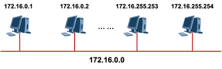

# 网络基础知识

## TCP/IP概述

to be added ...

## IP地址和网络划分

::: tip 参考

- [https://space.bilibili.com/46533719/channel/detail?cid=59969](https://space.bilibili.com/46533719/channel/detail?cid=59969)
- [https://www.cnblogs.com/maybe2030/p/4781555.html#_label0](https://www.cnblogs.com/maybe2030/p/4781555.html#_label0)

:::

### IP地址的网络部分和主机部分

IP地址由**网络号（包括子网号）**和**主机号**组成

- **网络地址**：主机号为全0，网络地址代表着整个网络。
- **广播地址**：（广播地址通常称为直接广播地址，是为了区分受限广播地址。）广播地址与网络地址的主机号正好相反，广播地址中，主机号为全1。当向某个网络的广播地址发送消息时，该网络内的所有主机都能收到该广播消息。
- **可用地址**：可以分配给网络中的节点或网络设备的地址。网络地址及广播地址不能直接被节点或网络设备所使用。

> 网络部分用于标识该IP所处的“空间”，**路由器**只关心IP的网络部分。而主机部分则在这个空间中表示该节点。

*例：192.168.1.0 这个C类网络的网络地址、广播地址及可分配给节点使用的IP地址分别是？*

 

### IP网络通信类型

- 单播
- 广播
- 组播

### IP地址分类

- A类地址以0开头，**第一个字节作为网络号**，地址范围为：0.0.0.0~127.255.255.255；
- B类地址以10开头，**前两个字节作为网络号**，地址范围是：128.0.0.0~191.255.255.255;
- C类地址以110开头，**前三个字节作为网络号**，地址范围是：192.0.0.0~223.255.255.255。
- D类地址以1110开头，地址范围是224.0.0.0~239.255.255.255，D类地址作为**组播地址**（一对多的通信）；
- E类地址以1111开头，地址范围是240.0.0.0~255.255.255.255，E类地址为保留地址，供以后使用。

> 注：
>
> - **只有A,B,C有网络号和主机号之分**，D类地址和E类地址没有划分网络号和主机号。
> - **255.255.255.255**: 该IP地址指的是受限的广播地址。受限广播地址与一般广播地址（直接广播地址）的区别在于，受限广播地址只能用于本地网络，路由器不会转发以受限广播地址为目的地址的分组；一般广播地址既可在本地广播，也可跨网段广播。例如：主机192.168.1.1/30上的直接广播数据包后，另外一个网段192.168.1.5/30也能收到该数据报；若发送受限广播数据报，则不能收到。
> - **0.0.0.0**: 常用于寻找自己的IP地址，例如在我们的RARP，BOOTP和DHCP协议中，若某个未知IP地址的无盘机想要知道自己的IP地址，它就以255.255.255.255为目的地址，向本地范围（具体而言是被各个路由器屏蔽的范围内）的服务器发送IP请求分组。
> - **回环地址**：127.0.0.0/8被用作回环地址，回环地址表示本机的地址，常用于对本机的测试，用的最多的是127.0.0.1。
> - **A、B、C类私有地址**: 私有地址(private address)也叫专用地址，它们不会在全球使用，只具有本地意义。（如果私有IP地址用户需要访问公网，则需使用NAT网络地址转换技术。）
>   - A类私有地址：10.0.0.0/8，范围是：10.0.0.0~10.255.255.255
>   - B类私有地址：172.16.0.0/12，范围是：172.16.0.0~172.31.255.255
>   - C类私有地址：192.168.0.0/16，范围是：192.168.0.0~192.168.255.255

### 子网掩码及网络划分

#### **什么是子网掩码**

子网掩码是标志两个IP地址是否同属于一个子网的，也是32位二进制地址，其每一个为1代表该位是网络位，为0代表主机位。它和IP地址一样也是使用点式十进制来表示的。如果两个IP地址在子网掩码的按位与的计算下所得结果相同，即表明它们共属于同一子网中。

- 网络掩码为32比特，与IP地址的位数是一样的。
- 网络掩码在二进制的表示上是一堆连续的1、后面接一堆连续的0。
- 网络掩码中值为1的比特对应IP地址中的网络位；为0的比特对应IP地址中的主机位，以此来辅助我们识别一个IP地址中的网络与主机位。

> **192.168.1.1 255.255.255.0** **等同于** **192.168.1.1/24**

#### 为什么要划分IP子网？

随着互连网应用的不断扩大，原先的IPv4的弊端也逐渐暴露出来，即网络号占位太多，而主机号位太少，所以其能提供的主机地址也越来越稀缺，目前除了使用NAT在企业内部利用保留地址自行分配以外，通常都对一个高类别的IP地址进行再划分，以形成多个子网，提供给不同规模的用户群使用。

这里主要是为了在网络分段情况下有效地利用IP地址，通过对主机号的高位部分取作为子网号，从通常的网络位界限中扩展或压缩子网掩码，用来创建某类地址的更多子网。但创建更多的子网时，在每个子网上的可用主机地址数目会比原先减少。

 

- 一个B类地址用于一个广播域，地址浪费。
- 广播域太庞大，一旦发生广播，内网不堪重负。

 

- 将一个网络号划分成多个子网，每个子网分配给一个独立的广播域。
- 如此一来广播域的规模更小、网络规划更加合理。
- IP地址得到了合理利用。

#### 如何进行子网划分

例如我们有如下IP地址：

将其划分为两个子网：

**计算方法**

- m为所借的位数

- n为原主机位剔除被借位后的剩余位数。
- -2的原因是，**每个子网中的网络号及广播号不可用** （所以划分子网后，实际可用的ip数其实变少了！）