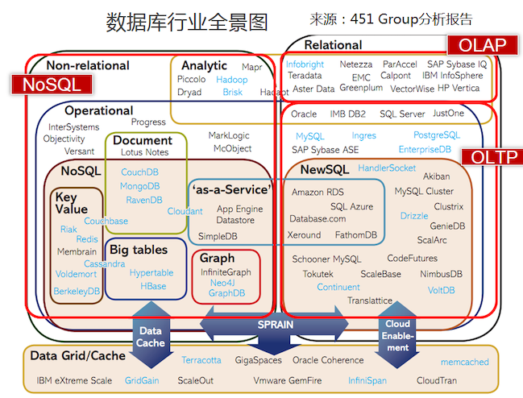

# 快速理解数据库全景图

::: tip 此文为转载 （通常一篇文章会参考多处，也会添加自己的理解，引用地址如有遗漏，请指出）

- https://blog.csdn.net/icycode/article/details/81008607

:::

:::warning

数据库行业发展很快，细分领域产品层出不穷。尤其是NewSQL，都还未大规模使用，未来还未定数。此文的全景图只针对当前行业有个大概的了解，细节还需要随时跟踪学习。

:::

 

以下我们引用"451Group"分析报告中对数据库的分类，来对数据库做一个概览。

## **关系型数据库(RDBMS,即SQL数据库)**

- 商业软件： Oracle，DB2，MSSQL ...
- 开源软件：MySQL，PostgreSQL ...
  - 单机版本已经很难满足海量数据的需求

## **NoSQL**

- NoSQL = Not Only SQL，意即“不仅仅是SQL，提倡运用非关系型的数据存储
- 普遍选择牺牲掉复杂 SQL 的支持及 ACID 事务换取弹性扩展能力
- 通常不保证强一致性的(支持最终一致)

主要分类

- 键值（Key-Value）数据库：如 MemcacheDB，Redis
- 文档存储：如 MongoDB
- 列存储，方便存储结构化和半结构化数据，方便做数据压缩，对针对某一列或者某几列的查询有非常大的IO优势： 如 HBase，Cassandra
- 图数据库，存储图形关系(注意：不是图片)。如 Neo4J

## **NewSQL**

### **为什么需要NewSQL**

- NoSQL 不能完全取代 RDBMS
- 单机RDBMS 无法满足性能需求
- 使用“单机RDBMS + 中间件”方式，在中间件层很难解决分布式事务、高可用问题

### **NewSQL定义**

- 针对OLTP的读写，提供与NOSQL相同的可扩展性和性能，同时能支持满足ACID特性的事务
- 即保持NoSQL的高可扩展和高性能，并且保持关系模型

### **NewSQL设计架构**

- 可以基于全新的数据库平台，也可以基于现有的SQL引擎优化。
- 无共享存储(MPP架构)是比较常见的架构
- 基于多副本实现高可用和容灾
- 分布式查询
- 数据Sharding机制
- 通过2PC，Paxos/Raft等协议实现数据一致

### **代表产品**

- Google Spanner
- Cockroach DB
- TiDB
- OceanBase
- X-DB

## **OLTP和OLAP**

### **OLTP**

- 强调支持短时间内大量并发的小型操作（增删改查）能力，每个查询涉及的数据量都很小（比如几十到几百字节）
- 强调事务的强一致性（想想银行转账交易，容不得差错）

举例：“双十一”期间，可能有几十万用户在同一秒内下订单。后台数据库要能够并发的、以近乎实时的速度处理这些订单请求（如果下了订单，十几分钟还没有反应，用户肯定要骂人了）

### **OLAP**

- 偏向于复杂的只读查询，读取海量数据进行分析计算，查询时间往往很长

举例：“双十一”结束，淘宝的运营人员对订单进行分析挖掘，找出一些市场规律、分析刷单行为等等。这种分析可能需要读取所有的历史订单进行计算，耗时几十秒甚至几十分钟都有可能。

代表产品：

- Greenplum
- TeraData
- 阿里 AnalyticDB