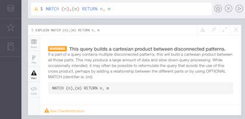

# Cypher

Neo4j's Cypher language is purpose built for working with graph data.

- uses patterns to describe graph data
- familiar SQL-like clauses
- declarative, describing what to find, not how to find it

see more from link "https://neo4j.com/docs/developer-manual/3.2/"

## Offical Document

### CREATE

Create a node

Let's use Cypher to generate a small social graph.

```sql
CREATE (ee:Person { name: "Emil", from: "Sweden", klout: 99 })
```
- CREATE clause to create data
- ( ) parenthesis to indicate a node
- ee:Person a variable 'ee' and label 'Person' for the new node
- brackets to add properties to the node

### MATCH

Finding nodes

Now find the node representing Emil:
```sql
MATCH (ee:Person) WHERE ee.name = "Emil" RETURN ee;
```
- MATCH clause to specify a pattern of nodes and relationships
- (ee:Person) a single node pattern with label 'Person' which will assign matches to the variable 'ee'
- WHERE clause to constrain the results
- ee.name = "Emil" compares name property to the value "Emil"
- RETURN clause used to request particular results


### CREATE more

Nodes and relationships

`CREATE` clauses can create many nodes and relationships at once.
```sql
MATCH (ee:Person) WHERE ee.name = "Emil"
CREATE (js:Person { name: "Johan", from: "Sweden", learn: "surfing" }),
(ir:Person { name: "Ian", from: "England", title: "author" }),
(rvb:Person { name: "Rik", from: "Belgium", pet: "Orval" }),
(ally:Person { name: "Allison", from: "California", hobby: "surfing" }),
(ee)-[:KNOWS {since: 2001}]->(js),(ee)-[:KNOWS {rating: 5}]->(ir),
(js)-[:KNOWS]->(ir),(js)-[:KNOWS]->(rvb),
(ir)-[:KNOWS]->(js),(ir)-[:KNOWS]->(ally),
(rvb)-[:KNOWS]->(ally)
```

### Pattern matching

Describe what to find in the graph

For instance, a pattern can be used to find Emil's friends:
```sq;
MATCH (ee:Person)-[:KNOWS]-(friends)
WHERE ee.name = "Emil" RETURN ee, friends
```
- MATCHclause to describe the pattern from known Nodes to found Nodes
- (ee)starts the pattern with a Person (qualified by WHERE)
- -[:KNOWS]-matches "KNOWS" relationships (in either direction)
- (friends)will be bound to Emil's friends

### Recommend

Using patterns

Pattern matching can be used to make recommendations. Johan is learning to surf, so he may want to find a new friend who already does:
```sql
MATCH (js:Person)-[:KNOWS]-()-[:KNOWS]-(surfer)
WHERE js.name = "Johan" AND surfer.hobby = "surfing"
RETURN DISTINCT surfer
```
- ()empty parenthesis to ignore these nodes
- DISTINCTbecause more than one path will match the pattern
- surferwill contain Allison, a friend of a friend who surfs


### Analyze

Using the visual query plan

Understand how your query works by prepending EXPLAIN or PROFILE:
```sql
PROFILE MATCH (js:Person)-[:KNOWS]-()-[:KNOWS]-(surfer)
WHERE js.name = "Johan" AND surfer.hobby = "surfing"
RETURN DISTINCT surfer
```

### Live Cypher warnings

Identify query problems in real time

As you type, the query editor notifies you about deprecated features and potentially expensive queries.

<div style="display:flex;"></div>

<br>
<br>
<br>

## Not offical Document

Cypher是一种用来处理图数据库的语言，语法比较简单。

### 1 查询数据库里的数据
```sql
match(n) return n
```
match是匹配规则，(n)表示所有节点，语法要求加上小括号。
return n表示返回匹配到的所有节点

### 2 创建一个节点
```sql
CREATE (p1:Person { name: "Liu Da", age: 20})
```
p1是变量名，Person是节点名，{}内包含了节点的两个属性。

### 3 删除单节点
```sql
match(p1:Person) detach delete p1
```

### 4 创建两个节点并建立关系
```sql
create 
(p1:Person{name:"Liu Da", age:20}),
(p2:Person{name:"Chen Er", age:22}),
(p1)-[:KNOWS]->(p2)
```
这里创建了两个节点，并且Liu Da知道Chen Er，但Chen Er不知道Liu Da; 查询这两个节点及关系:
```sql
MATCH (p1: Person)-[KNOWS]-(p2: Person) return p1,KNOWS,p2
```

### 5 删除两个节点和它们的关系

注意，neo4j删除节点时，要求把关系一并删除掉。不能只删除节点，不删除关系。
```sql
MATCH (p1: Person)-[KNOWS]-(p2: Person) 
DELETE p1, KNOWS, p2
```

### 6 为节点增加属性
```sql
create(p1:Person{name:"Liu Da"})
```
```sql
match(p1) set p1.age = 20
```
使用上面两种方式添加属性后，查询数据可以看到结果：
```sql
match(p1) return p1
```

### 7 修改节点属性
```sql
match(p1) set p1.age = 33
```

### 8 查找节点的共有属性
```sql
CREATE
(p2:Person { name: "Liu Er", age: 15, learn: "Muay Thai" }),
(p3:Person { name: "Zhang San", age: 25, sex: “Male” }),
(p4:Person { name: "Li Si", age: 30, hobby: "Muay Thai" }),
(p2)-[:KNOWS]->(p3),
(p3)-[:KNOWS]->(p2),
(p3)-[:KNOWS]->(p4)
```

Liu Er和Zhang San互相认识，
Zhang San认识Li Si，
Li Si不认识Zhang San和Liu Er，
Liu Er正在学习泰拳，
Li Si的爱好是泰拳。

```sql
MATCH (x) - [:KNOWS]- () - [:KNOWS] - (fighter)
WHERE x.name = "Liu Er" and fighter.hobby = "Muay Thai"
RETURN fighter
```
这里先找出p2认识的人，因为这个人不是最终要找的人，所以（）里不用填写变量名，再通过这个人找出业余爱好为泰拳的人，这个人用变量fighter来表示。

### 9 删除所有节点

先看数据库里有多少个节点
```sql
match(a) return a
```
删除所有节点和关系
```sql
match(b) detach delete b
```

### 10 导入csv数据

example: 下载电影相关的五个csv文件
将五个csv文件放到neo4j的import目录中; 利用neo4j的语句，将import中的五个csv文件的数据加载到neo4j数据库中
逐步执行下面的五个Load语句
```sql
找到neo4j的安装路径，并在D:\neo4j-community-3.4.0\目录下创建import目录
完整路径如下D:\neo4j-community-3.4.0\import
因为neo4j支持导入csv文件，其默认目录入口是 ...\import
 
 
//导入节点 电影类型  == 注意类型转换
LOAD CSV WITH HEADERS  FROM "file:///genre.csv" AS line
MERGE (p:Genre{gid:toInteger(line.gid),name:line.gname})
    
 
//导入节点 演员信息 
LOAD CSV WITH HEADERS FROM 'file:///person.csv' AS line
MERGE (p:Person { pid:toInteger(line.pid),birth:line.birth,
death:line.death,name:line.name,
biography:line.biography,
birthplace:line.birthplace})
 
 
//导入节点 电影信息
LOAD CSV WITH HEADERS  FROM "file:///movie.csv" AS line  
MERGE (p:Movie{mid:toInteger(line.mid),title:line.title,introduction:line.introduction,
rating:toFloat(line.rating),releasedate:line.releasedate})
 
 
//导入关系 actedin  电影是谁参演的 1对多
LOAD CSV WITH HEADERS FROM "file:///person_to_movie.csv" AS line 
match (from:Person{pid:toInteger(line.pid)}),(to:Movie{mid:toInteger(line.mid)})  
merge (from)-[r:actedin{pid:toInteger(line.pid),mid:toInteger(line.mid)}]->(to)


//导入关系  电影是什么类型 == 1对多
LOAD CSV WITH HEADERS FROM "file:///movie_to_genre.csv" AS line
match (from:Movie{mid:toInteger(line.mid)}),(to:Genre{gid:toInteger(line.gid)})  
merge (from)-[r:is{mid:toInteger(line.mid),gid:toInteger(line.gid)}]->(to)
```

导完之后，可看到数据里多了一些节点和关系<br>
查询 "章子怡演了哪些电影"
```sql
match(n:Person)-[:actedin]->(m:Movie) where n.name='章子怡' return m.title
```