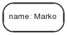

# Neo4j 基础入门 

原文参考 [Neo4j学习](https://www.jianshu.com/p/53dfcae6331c)

图形数据库（Graph Database）是NoSQL数据库家族中特殊的存在，用于存储丰富的关系数据，Neo4j 是目前最流行的图形数据库，支持完整的事务，在属性图中，图是由顶点（Vertex），边（Edge）和属性（Property）组成的，顶点和边都可以设置属性，顶点也称作节点，边也称作关系，每个节点和关系都可以由一个或多个属性。Neo4j创建的图是用顶点和边构建一个有向图，其查询语言cypher已经成为事实上的标准。

模型规则
- 表示节点，关系和属性中的数据
- 节点和关系都包含属性
- 关系连接节点
- 属性是键值对
- 节点用圆圈表示，关系用方向键表示。
- 关系具有方向：单向和双向。
- 每个关系包含“开始节点”或“从节点”和“到节点”或“结束节点”

在属性图数据模型中，关系应该是定向的。如果我们尝试创建没有方向的关系，那么它将抛出一个错误消息。<br>
在Neo4j中，关系也应该是有方向性的。如果我们尝试创建没有方向的关系，那么Neo4j会抛出一个错误消息，“关系应该是方向性的”。<br>
Neo4j图数据库将其所有数据存储在节点和关系中。我们不需要任何额外的RRBMS数据库或No-SQL数据库来存储Neo4j数据库数据。它以图形的形式存储其数据的本机格式。<br>
Neo4j使用本机GPE（图形处理引擎）引擎来使用它的本机图存储格式。


## 图数据库模型

### 节点
构成一张图的基本元素是节点和关系。在Neo4j中，节点和关系都可以包含属性
<div style="display:flex;"></div>
<br>
下面让我们认识一个最简单的节点，他只有一个属性，属性名是name,属性值是Marko：
<div style="display:flex;"></div>
### 关系
节点之间的关系是图数据库很重要的一部分。通过关系可以找到很多关联的数据，比如节点集合，关系集合以及他们的属性集合。
<div style="display:flex;"></div>
<br>
一个关系连接两个节点，必须有一个开始节点和结束节点。
<div style="display:flex;"></div>
<br>
因为关系总是直接相连的，所以对于一个节点来说，与他关联的关系看起来有输入/输出两个方向，这个特性对于我们遍历图非常有帮助：
<div style="display:flex;"></div>
<br>
关系在任一方向都会被遍历访问。这意味着我们并不需要在不同方向都新增关系。而关系总是会有一个方向，所以当这个方向对你的应用没有意义时你可以忽略方向。特别注意一个节点可以有一个关系是指向自己的：
<div style="display:flex;"></div>
<br>
为了将来增强遍历图中所有的关系，我们需要为关系设置类型。注意 关键字 type 在这可能会被误解，你其实可以把他简单的理解为一个标签而已。

例1：有两种关系的最简单的社会化网络图
<div style="display:flex;"></div>
### 属性

节点和关系都可以设置自己的属性。属性是由Key-Value键值对组成。

例2：包含两个属性的节点
<div style="display:flex;"></div>
<br>
例3：包含属性的关系
<div style="display:flex;"></div>
<br>
这里Emil->Johan的关系，包含了属性“since:2001”，Emil->Ian的关系，包含了属性”rating:5”

### 路径

路径由至少一个节点，通过各种关系连接组成，经常是作为一个查询或者遍历的结果。
<div style="display:flex;"></div>
<br>
最短的路径是0长度的像下面这样：
<div style="display:flex;"></div>
<br>
长度为1的路径如下:
<div style="display:flex;"></div>
### 遍历（Traversal）
遍历一张图就是按照一定的规则，跟随他们的关系，访问关联的的节点集合。最多的情况是只有一部分子图被访问到，因为你知道你对那一部分节点或者关系感兴趣。

Neo4j提供了遍历的API，可以让你指定遍历规则。最简单的设置就是设置遍历是宽度优先还是深度优先。


## 安装
这里以windows为例（linux也类似，请参考官网）

1. If it is not already installed, get OpenJDK 8 or Oracle Java 8, recommended for Neo4j 3.0.x Version 7 is recommended for releases prior to 2.3.0.
2. Find the zip file you just downloaded and right-click, extract all.
3. Place the extracted files in a permanent home on your server, for example D:\neo4j\. The top level directory is referred to as `<NEO4J_HOME>`.
    - To run Neo4j as a console application, use: `<NEO4J_HOME>\bin\neo4j console`
    - To install Neo4j as a service use: `<NEO4J_HOME>\bin\neo4j install-service`.
    - Start the service: `<NEO4J_HOME>\bin\neo4j start`
    - For additional commands and to learn about the Windows PowerShell module included in the Zip file, see the [Windows installation documentation](https://neo4j.com/docs/operations-manual/current/installation/windows/).
4. Visit http://localhost:7474 in your web browser.
5. Connect using the username 'neo4j' with default password 'neo4j'. You'll then be prompted to change the password.

**配置Neo4j服务器允许远程访问**<br>
找到`<NEO4J_HOME>\conf\neo4j.conf`文件，修改<br>
`#dbms.connector.http.listen_address=:7474` <br>
改为：<br>
`dbms.connector.http.listen_address=0.0.0.0:7474`

**远程bolt连接：**<br>
`#dbms.connector.bolt.listen_address=:7687`<br>
改为：<br>
`dbms.connector.bolt.listen_address=0.0.0.0:7687`

> neo4j支持三种网络协议，默认情况下，不需要配置就可以在本地直接运行。<br>
> 分别是Bolt，HTTP和HTTPS，默认的连接器配置有三种，为了使用这三个端口，允许通过端口7687，7474和7473访问本机。<br>
> 所以在访问web的时候,可以使用默认的`bolt://hz4dw3225:7687`;也可以改为`http://hz4dw3225:7474`


## Qucik Start Demo - 官方

The Movie Graph is a mini graph application containing actors and directors that are related through the movies they've collaborated on.

This guide will show you how to:

- Create: insert movie data into the graph
- Find: retrieve individual movies and actors
- Query: discover related actors and directors
- Solve: the Bacon Path

### Create

To the right is a giant code block containing a single Cypher query statement composed of multiple CREATE clauses. This will create the movie graph.

- Click on the code block
- Notice it gets copied to the editor above ↑
- Click the editor's play button to execute
- Wait for the query to finish
    - WARNING: This adds data to the current database, each time it is run!

```sql
CREATE (TheMatrix:Movie {title:'The Matrix', released:1999, tagline:'Welcome to the Real World'})
CREATE (Keanu:Person {name:'Keanu Reeves', born:1964})
CREATE (Carrie:Person {name:'Carrie-Anne Moss', born:1967})
... ...
(Keanu)-[:ACTED_IN {roles:['Neo']}]->(TheMatrix),
(Carrie)-[:ACTED_IN {roles:['Trinity']}]->(TheMatrix),
(Laurence)-[:ACTED_IN {roles:['Morpheus']}]->(TheMatrix),
... ...
...
...
...
```
<div style="display:flex;"></div>
### Find

Example queries for finding individual nodes.

- Click on any query example
- Run the query from the editor
- Notice the syntax pattern
- Try looking for other movies or actors

Find the actor named "Tom Hanks"...
```sql
MATCH (tom {name: "Tom Hanks"}) RETURN tom
```
Find the movie with title "Cloud Atlas"...
```sql
MATCH (cloudAtlas {title: "Cloud Atlas"}) RETURN cloudAtlas
```
Find 10 people...
```sql
MATCH (people:Person) RETURN people.name LIMIT 10
```
Find movies released in the 1990s...
```sql
MATCH (nineties:Movie) WHERE nineties.released >= 1990 AND nineties.released < 2000 RETURN nineties.title
```

### Query

Finding patterns within the graph.

- Actors are people who acted in movies
- Directors are people who directed a movie
- What other relationships exist?

List all Tom Hanks movies...
```sql
MATCH (tom:Person {name: "Tom Hanks"})-[:ACTED_IN]->(tomHanksMovies) RETURN tom,tomHanksMovies
```
Who directed "Cloud Atlas"?
```sql
MATCH (cloudAtlas {title: "Cloud Atlas"})<-[:DIRECTED]-(directors) RETURN directors.name
```
Tom Hanks' co-actors...
```sql
MATCH (tom:Person {name:"Tom Hanks"})-[:ACTED_IN]->(m)<-[:ACTED_IN]-(coActors) RETURN coActors.name
```
How people are related to "Cloud Atlas"...
```sql
MATCH (people:Person)-[relatedTo]-(:Movie {title: "Cloud Atlas"}) RETURN people.name, Type(relatedTo), relatedTo
```

### Solve

You've heard of the classic "Six Degrees of Kevin Bacon"? That is simply a shortest path query called the "Bacon Path".

- Variable length patterns
- Built-in shortestPath() algorithm

Movies and actors up to 4 "hops" away from Kevin Bacon
```sql
MATCH (bacon:Person {name:"Kevin Bacon"})-[*1..4]-(hollywood)
RETURN DISTINCT hollywood
```
Bacon path, the shortest path of any relationships to Meg Ryan
```sql
MATCH p=shortestPath(
(bacon:Person {name:"Kevin Bacon"})-[*]-(meg:Person {name:"Meg Ryan"})
)
RETURN p
```
Note you only need to compare property values like this when first creating relationships

### Recommend

Let's recommend new co-actors for Tom Hanks. A basic recommendation approach is to find connections past an immediate neighborhood which are themselves well connected.

For Tom Hanks, that means:
- Find actors that Tom Hanks hasn't yet worked with, but his co-actors have.
- Find someone who can introduce Tom to his potential co-actor.

Extend Tom Hanks co-actors, to find co-co-actors who haven't worked with Tom Hanks...
```sql
MATCH (tom:Person {name:"Tom Hanks"})-[:ACTED_IN]->(m)<-[:ACTED_IN]-(coActors),
  (coActors)-[:ACTED_IN]->(m2)<-[:ACTED_IN]-(cocoActors)
WHERE NOT (tom)-[:ACTED_IN]->()<-[:ACTED_IN]-(cocoActors) AND tom <> cocoActors
RETURN cocoActors.name AS Recommended, count(*) AS Strength ORDER BY Strength DESC
```
Find someone to introduce Tom Hanks to Tom Cruise
```sql
MATCH (tom:Person {name:"Tom Hanks"})-[:ACTED_IN]->(m)<-[:ACTED_IN]-(coActors),
  (coActors)-[:ACTED_IN]->(m2)<-[:ACTED_IN]-(cruise:Person {name:"Tom Cruise"})
RETURN tom, m, coActors, m2, cruise
```

### Clean up

When you're done experimenting, you can remove the movie data set.

Note:

Nodes can't be deleted if relationships exist
Delete both nodes and relationships together
WARNING: This will remove all Person and Movie nodes!

Delete all Movie and Person nodes, and their relationships
```sql
MATCH (n) DETACH DELETE n
```
> Note you only need to compare property values like this when first creating relationships
Prove that the Movie Graph is gone
```sql
MATCH (n) RETURN n
```