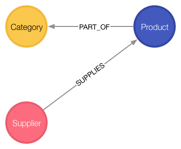
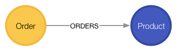

# How to migrate from a relational database to Neo4j

## Northwind Graph 

The Northwind Graph demonstrates how to migrate from a relational database to Neo4j. The transformation is iterative and deliberate, emphasizing the conceptual shift from relational tables to the nodes and relationships of a graph.

This guide will show you how to:

- Load: create data from external CSV files
- Index: index nodes based on label
- Relate: transform foreign key references into data relationships
- Promote: transform join records into relationships

<br>

## Product Catalog

Northwind sells food products in a few categories, provided by suppliers. Let's start by loading the product catalog tables.

The load statements to the right require public internet access.LOAD CSV will retrieve a CSV file from a valid URL, applying a Cypher statement to each row using a named map (here we're using the name `row`).
<div style="display:flex;"></div>

### Load records
```sql
LOAD CSV WITH HEADERS FROM "http://data.neo4j.com/northwind/products.csv" AS row
CREATE (n:Product)
SET n = row,
n.unitPrice = toFloat(row.unitPrice),
n.unitsInStock = toInteger(row.unitsInStock), n.unitsOnOrder = toInteger(row.unitsOnOrder),
n.reorderLevel = toInteger(row.reorderLevel), n.discontinued = (row.discontinued <> "0")
```
```sql
LOAD CSV WITH HEADERS FROM "http://data.neo4j.com/northwind/categories.csv" AS row
CREATE (n:Category)
SET n = row
```
```sql
LOAD CSV WITH HEADERS FROM "http://data.neo4j.com/northwind/suppliers.csv" AS row
CREATE (n:Supplier)
SET n = row
```

### Create indexes
```sql
CREATE INDEX ON :Product(productID)
```
```sql
CREATE INDEX ON :Category(categoryID)
```
```sql
CREATE INDEX ON :Supplier(supplierID)
```

<br>

## Product Catalog Graph

The products, categories and suppliers are related through foreign key references. Let's promote those to data relationships to realize the graph.
<div style="display:flex;"></div>

### Create data relationships
```sql
MATCH (p:Product),(c:Category)
WHERE p.categoryID = c.categoryID
CREATE (p)-[:PART_OF]->(c)
```
Note you only need to compare property values like this when first creating relationships
-  Calculate join, materialize relationship. (See importing guide for more details)

```sql
MATCH (p:Product),(s:Supplier)
WHERE p.supplierID = s.supplierID
CREATE (s)-[:SUPPLIES]->(p)
```
Note you only need to compare property values like this when first creating relationships


### Query using patterns
```sql
MATCH (s:Supplier)-->(:Product)-->(c:Category)
RETURN s.companyName as Company, collect(distinct c.categoryName) as Categories
```
*List the product categories provided by each supplier.*

```sql
MATCH (c:Category {categoryName:"Produce"})<--(:Product)<--(s:Supplier)
RETURN DISTINCT s.companyName as ProduceSuppliers
```
*Find the produce suppliers.*

<br>

## Customer Orders

Northwind customers place orders which may detail multiple products.
<div style="display:flex;"></div>

### Load and index records

```sql
LOAD CSV WITH HEADERS FROM "http://data.neo4j.com/northwind/customers.csv" AS row
CREATE (n:Customer)
SET n = row
```
```sql
LOAD CSV WITH HEADERS FROM "http://data.neo4j.com/northwind/orders.csv" AS row
CREATE (n:Order)
SET n = row
```
```sql
CREATE INDEX ON :Customer(customerID)
```
```sql
CREATE INDEX ON :Order(orderID)
```

### Create data relationships

```sql
MATCH (c:Customer),(o:Order)
WHERE c.customerID = o.customerID
CREATE (c)-[:PURCHASED]->(o)
```
Note you only need to compare property values like this when first creating relationships

<br>

## Customer Order Graph

Notice that Order Details are always part of an Order and that they relate the Order to a Product — they're a join table. Join tables are always a sign of a data relationship, indicating shared information between two other records.

Here, we'll directly promote each OrderDetail record into a relationship in the graph.

<div style="display:flex;"></div>

### Load and index records
```sql
LOAD CSV WITH HEADERS FROM "http://data.neo4j.com/northwind/order-details.csv" AS row
MATCH (p:Product), (o:Order)
WHERE p.productID = row.productID AND o.orderID = row.orderID
CREATE (o)-[details:ORDERS]->(p)
SET details = row,
details.quantity = toInteger(row.quantity)
```
Note you only need to compare property values like this when first creating relationships

### Query using patterns
```sql
MATCH (cust:Customer)-[:PURCHASED]->(:Order)-[o:ORDERS]->(p:Product),
  (p)-[:PART_OF]->(c:Category {categoryName:"Produce"})
RETURN DISTINCT cust.contactName as CustomerName, SUM(o.quantity) AS TotalProductsPurchased
```

