# Java基础-IO流1

::: tip 此文为转载 （通常一篇文章会参考多处，也会添加自己的理解，引用地址如有遗漏，请指出）

- https://www.cnblogs.com/xdp-gacl/p/3634409.html
- https://www.cnblogs.com/dukc/p/4776868.html

:::

<br />

## Java编码相关

实例：

```java
package com.demo;
public class EncodeDemo {

    public static void main(String[] args) throws Exception{

        String s = "测试类ABC";

        byte[] bytes1 = s.getBytes(); //转换成字节序列用的是项目默认的编码UTF-8
        //UTF-8编码中文占用三个字节，英文占用一个字节
        for (byte b : bytes1){
            //把字节（转换成int）以16进制的方式显示
            System.out.print(Integer.toHexString(b & 0xff)+" ");
        }
        System.out.println();

        byte[] bytes2 = s.getBytes("gbk");
        //gbk编码中文占用两个字节，英文占用一个字节
        for (byte b : bytes2){
            //把字节（转换成int）以16进制的方式显示
            System.out.print(Integer.toHexString(b & 0xff)+" ");
        }
        System.out.println();
        
        //java是双字节编码 utf-16be
        byte[] bytes3 = s.getBytes("utf-16be");
        //utf-16be编码中文占用两个字节，英文占用两个字节
        for (byte b : bytes3){
            //把字节（转换成int）以16进制的方式显示
            System.out.print(Integer.toHexString(b & 0xff)+" ");
        }
        System.out.println();

        /*
         * 当你的字节序列是某种编码时，这个时候想把字节序列变成字符串，也需要用这种编码方式，否则会出现乱码
         */
        String str1 = new String(bytes3); //例如，bytes3是utf-16be编码的，用项目默认的编码utf-8转换，出现乱码
        System.out.println(str1);

        String str2 = new String(bytes3,"utf-16be");
        System.out.println(str2);

    }
}
```

```java
e6 b5 8b e8 af 95 e7 b1 bb 41 42 43 
b2 e2 ca d4 c0 e0 41 42 43 
6d 4b 8b d5 7c 7b 0 41 0 42 0 43 
mK��|{ABC
测试类ABC
```

<br />

## **File类的使用**

File类是对文件系统中文件以及文件夹进行封装的对象，可以通过对象的思想来操作文件和文件夹。 File类保存文件或目录的各种元数据信息，包括文件名、文件长度、最后修改时间、是否可读、获取当前文件的路径名，判断指定文件是否存在、获得当前目录中的文件列表，创建、删除文件和目录等方法。

<font color=red>File类不能用于文件内容的访问。</font>

```java
import java.io.File;
import java.io.IOException;

public class FileDemo {

	/**
	 * @param args
	 */
	public static void main(String[] args) {
		// 了解构造函数的情况  查帮助
		File file = new File("E:\\javaio\\imooc");
		//System.out.println(file.exists());
		if(!file.exists())
			file.mkdir(); //file.mkdirs()
		else
			file.delete();
		//是否是一个目录  如果是目录返回true,如果不是目录or目录不存在返回的是false
		System.out.println(file.isDirectory());
		//是否是一个文件
		System.out.println(file.isFile());
		
		//File file2 = new File("e:\\javaio\\日记1.txt");
		File file2 = new File("e:\\javaio","日记1.txt");
		if(!file2.exists())
			try {
				file2.createNewFile();
			} catch (IOException e) {
				// TODO Auto-generated catch block
				e.printStackTrace();
			}
		else 
			file2.delete();
         //常用的File对象的API
		System.out.println(file);//file.toString()的内容
		System.out.println(file.getAbsolutePath());
		System.out.println(file.getName());
		System.out.println(file2.getName());
		System.out.println(file.getParent());
		System.out.println(file2.getParent());
		System.out.println(file.getParentFile().getAbsolutePath());
	}
```

<br />

## **RandomAccessFile的使用**

Java提供的对文件内容的访问，既可以读文件，也可以写文件。RandomAccessFile支持随机访问文件，可以访问文件的任意位置。

- java文件模型<br>在硬盘上的文件是byte byte byte存储的，是数据的集合
- 打开文件<br>有两种模式“rw”（读写） “r”（只读）<br>`RandomAccessFile raf = new RandomAccessFile(file, "rw")` <br>文件指针，打开文件时指针在开头pointer = 0；
- 写方法<br>raf.write(int) -> 只写一个字节（后八位），同时指针指向下一个位置，准备再次写入
- 读方法<br>int b = raf.read() -> 读一个字节
- 文件读写完成以后一定要关闭，调用close()的方法。

```java
		//创建相对路径的文件，就是在这个项目中创建一个文件夹
        File file=new File("random");
        if(!file.exists()) {
            file.mkdir();
        }
        File fileName=new File(file,"javaio.txt");
        if(!fileName.exists()) {
            fileName.createNewFile();//创建文件
        }
        //创建一个RandomAccessFile的对象,并指定模式rw，能读能写，
        //注意：必须是文件，不能是路径
        RandomAccessFile raf=new RandomAccessFile(fileName,"rw");
        //获取此时的文件指针的位置，起始位置为0
        System.out.println(raf.getFilePointer());
        //向文件中写入字符A，字符类型有两个字节，但她写入的是后八位的字节
        //字符A正好可以用后八位的字节表示出来
        raf.write('A');
        //字符的位置会自动向后移动,文件指针会向后自动移动
        System.out.println("输入一个字符之后，文件指针的位置"+raf.getFilePointer());
        raf.write('B');
        
        
        //每次write只能写入一个字节，如果要把i写进去，就需要写四次
        int i=0x7fffffff;
        raf.write(i>>>24 & 0xff);//写入高八位的
        raf.write(i>>>16 & 0xff);
        raf.write(i>>>8   & 0xff);
        raf.write(i);//写入低八位
        System.out.println("写入整数的时候文件指针的位置是"+raf.getFilePointer());
        
        
        /**
         * writeInt()的内置方法
        public final void writeInt(int v) throws IOException {
          write((v >>> 24) & 0xFF);
          write((v >>> 16) & 0xFF);
          write((v >>>  8) & 0xFF);
          write((v >>>  0) & 0xFF);
        	//written += 4;
    	}
         */
        
        //也可以直接写入int整数
        raf.writeInt(i);
        
        //写入一个汉字,汉字为两个字节
        String str="欢迎学习java";
        byte[] b=str.getBytes("gbk");
        raf.write(b);
        System.out.println("此时的长度为"+raf.length());
        
        
        //读文件必须将文件指针放在开头位置
        raf.seek(0);
        byte[] buf=new byte[(int)raf.length()];
        raf.read(buf);//将内容写入buf字节数组中
        
        String  str1=new String(buf,"gbk");
        System.out.println("文件中的内容为"+str1);
        raf.close();
```

<br />

## IO流

### 概览

<div style="display:flex;">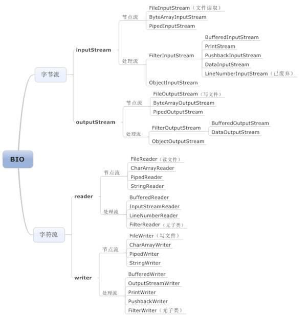</div>

### **输入输出流分类**

<div style="display:flex;">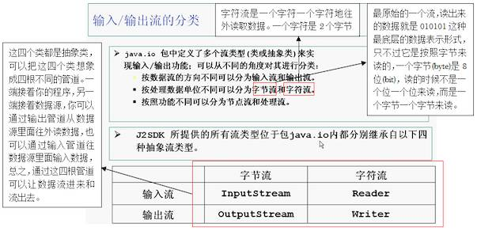</div>

### **节点流和处理流**

<div style="display:flex;"></div>

你要是对原始的流不满意，你可以在这根管道外面再套其它的管道，套在其它管道之上的流叫处理流。

- **节点流类型**

  <div style="display:flex;"></div>

  节点流就是一根管道直接插到数据源上面，直接读数据源里面的数据，或者是直接往数据源里面写入数据。典型的节点流是文件流：文件的字节输入流（FileInputStream），文件的字节输出流（FileOutputStream），文件的字符输入流（FileReader），文件的字符输出流（FileWriter）。

- **处理流类型**

  <div style="display:flex;">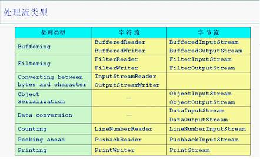</div>

### **InputStream(输入流)**

<div style="display:flex;">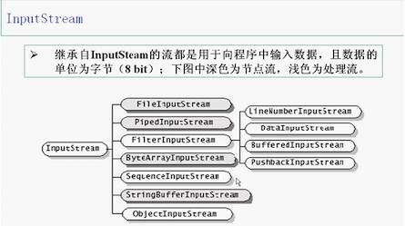</div>

我们看到的具体的某一些管道，凡是以InputStream结尾的管道，都是以字节的形式向我们的程序输入数据。

- **InputStream的基本方法**

  <div style="display:flex;">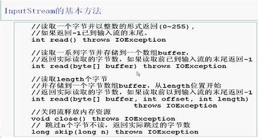</div>

  read()方法是一个字节一个字节地往外读，每读取一个字节，就处理一个字节。read(byte[] buffer)方法读取数据时，先把读取到的数据填满这个byte[]类型的数组buffer(buffer是内存里面的一块缓冲区)，然后再处理数组里面的数据。这就跟我们取水一样，先用一个桶去接，等桶接满水后再处理桶里面的水。如果是每读取一个字节就处理一个字节，这样子读取也太累了

### **OutputStream(输出流)**

<div style="display:flex;">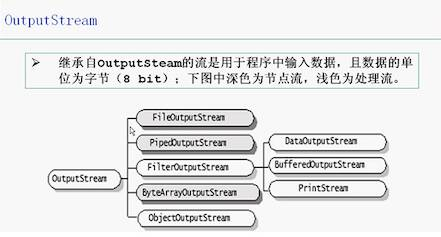</div>

- **OutputStream的基本方法**

  <div style="display:flex;"></div>

### **Reader流**

<div style="display:flex;"></div>

- **Reader的基本方法**

  <div style="display:flex;">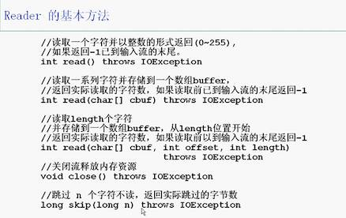</div>

### **Writer流**

<div style="display:flex;">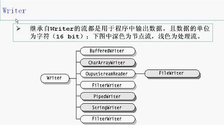</div>

- **Writer的基本方法**

  <div style="display:flex;">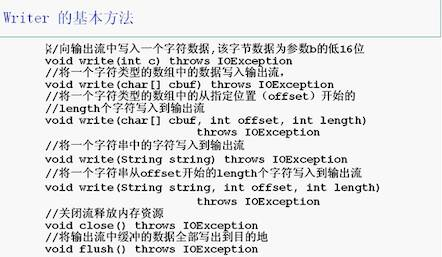</div>

<br>

###**节点流讲解**

以File(文件)这个类型作为讲解节点流的典型代表

<div style="display:flex;">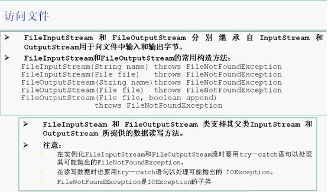</div>

范例：使用FileInputStream流来读取FileInputStream.java文件的内容

```java
package cn.galc.test;

import java.io.*;

public class TestFileInputStream {
    public static void main(String args[]) {
        int b = 0;// 使用变量b来装调用read()方法时返回的整数
        FileInputStream in = null;
        // 使用FileInputStream流来读取有中文的内容时，读出来的是乱码，因为使用InputStream流里面的read()方法读取内容时是一个字节一个字节地读取的，而一个汉字是占用两个字节的，所以读取出来的汉字无法正确显示。
        // FileReader in = null;//使用FileReader流来读取内容时，中英文都可以正确显示，因为Reader流里面的read()方法是一个字符一个字符地读取的，这样每次读取出来的都是一个完整的汉字，这样就可以正确显示了。
        try {
            in = new FileInputStream("D:\\Java\\MyEclipse 10\\Workspaces\\AnnotationTest\\src\\cn\\galc\\test\\FileInputStream.java");
            // in = new FileReader("D:/java/io/TestFileInputStream.java");
        } catch (FileNotFoundException e) {
            System.out.println("系统找不到指定文件！");
            System.exit(-1);// 系统非正常退出
        }
        long num = 0;// 使用变量num来记录读取到的字符数
        try {// 调用read()方法时会抛异常，所以需要捕获异常
            while ((b = in.read()) != -1) {
                // 调用int read() throws Exception方法时，返回的是一个int类型的整数
                // 循环结束的条件就是返回一个值-1，表示此时已经读取到文件的末尾了。
                // System.out.print(b+"\t");//如果没有使用“(char)b”进行转换，那么直接打印出来的b就是数字，而不是英文和中文了
                System.out.print((char) b);
                // “char(b)”把使用数字表示的汉字和英文字母转换成字符输入
                num++;
            }
            in.close();// 关闭输入流
            System.out.println();
            System.out.println("总共读取了" + num + "个字节的文件");
        } catch (IOException e1) {
            System.out.println("文件读取错误！");
        }
    }
}
```

范例：使用FileOutputStream流往一个文件里面写入数据package cn.galc.test;

```java
import java.io.*;

public class TestFileOutputStream {
    public static void main(String args[]) {
        int b = 0;
        FileInputStream in = null;
        FileOutputStream out = null;
        try {
            in = new FileInputStream("D:\\Java\\MyEclipse 10\\Workspaces\\AnnotationTest\\src\\cn\\galc\\test\\MyMouseAdapter.java");
            out = new FileOutputStream("D:/java/TestFileOutputStream1.java");
            // 指明要写入数据的文件，如果指定的路径中不存在TestFileOutputStream1.java这样的文件，则系统会自动创建一个
            while ((b = in.read()) != -1) {
                out.write(b);
                // 调用write(int c)方法把读取到的字符全部写入到指定文件中去
            }
            in.close();
            out.close();
        } catch (FileNotFoundException e) {
            System.out.println("文件读取失败");
            System.exit(-1);// 非正常退出
        } catch (IOException e1) {
            System.out.println("文件复制失败！");
            System.exit(-1);
        }
        System.out
                .println("TestFileInputStream.java文件里面的内容已经成功复制到文件TestFileOutStream1.java里面");
    }
}
```

<font color=red>FileInputStream和FileOutputStream这两个流都是字节流，都是以一个字节为单位进行输入和输出的。所以对于占用2个字节存储空间的字符来说读取出来时就会显示成乱码。</font>

范例：使用FileWriter（字符流）向指定文件中写入数据

```java
package cn.galc.test;

/*使用FileWriter（字符流）向指定文件中写入数据
写入数据时以1个字符为单位进行写入*/
import java.io.*;
public class TestFileWriter{
    public static void main(String args[]){
        /*使用FileWriter输出流从程序把数据写入到Uicode.dat文件中
        使用FileWriter流向文件写入数据时是一个字符一个字符写入的*/
        FileWriter fw = null;
        try{
                fw = new FileWriter("D:/java/Uicode.dat");
                //字符的本质是一个无符号的16位整数
                //字符在计算机内部占用2个字节
                //这里使用for循环把0～60000里面的所有整数都输出
                //这里相当于是把全世界各个国家的文字都0～60000内的整数的形式来表示
                for(int c=0;c<=60000;c++){
                    fw.write(c);
                    //使用write(int c)把0～60000内的整数写入到指定文件内
                    //调用write()方法时，我认为在执行的过程中应该使用了“(char)c”进行强制转换，即把整数转换成字符来显示
                    //因为打开写入数据的文件可以看到，里面显示的数据并不是0～60000内的整数，而是不同国家的文字的表示方式
            }
            /*使用FileReader(字符流)读取指定文件里面的内容
            读取内容时是以一个字符为单位进行读取的*/
                int b = 0;
                long num = 0;
                FileReader fr = null;
                fr = new FileReader("D:/java/Uicode.dat");
                while((b = fr.read())!= -1){
                    System.out.print((char)b + "\t");
                    num++;
                }
                System.out.println();
                System.out.println("总共读取了"+num+"个字符");
        }catch(Exception e){
            e.printStackTrace();
        }
    }
}
```

FileReader和FileWriter这两个流都是字符流，都是以一个字符为单位进行输入和输出的。所以读取和写入占用2个字节的字符时都可以正常地显示出来，以上是以File(文件)这个类型为例对节点流进行了讲解，所谓的节点流指定就是直接把输入流或输出插入到数据源上，直接往数据源里面写入数据或读取数据。

### **处理流讲解**

- **第一种处理流——缓冲流(Buffering)**

  <div style="display:flex;"></div>

  带有缓冲区的，缓冲区(Buffer)就是内存里面的一小块区域，读写数据时都是先把数据放到这块缓冲区域里面，减少io对硬盘的访问次数，保护我们的硬盘。可以把缓冲区想象成一个小桶，把要读写的数据想象成水，每次读取数据或者是写入数据之前，都是先把数据装到这个桶里面，装满了以后再做处理。这就是所谓的缓冲。先把数据放置到缓冲区上，等到缓冲区满了以后，再一次把缓冲区里面的数据写入到硬盘上或者读取出来，这样可以有效地减少对硬盘的访问次数，有利于保护我们的硬盘。

  缓冲流测试代码：

  ```java
  package cn.gacl.test;
  
  import java.io.*;
  
  public class TestBufferStream {
      public static void main(String args[]) {
          FileInputStream fis = null;
          try {
              fis = new FileInputStream("D:/java/TestFileInputStream.java");
              // 在FileInputStream节点流的外面套接一层处理流BufferedInputStream
              BufferedInputStream bis = new BufferedInputStream(fis);
              int c = 0;
              System.out.println((char) bis.read());
              System.out.println((char) bis.read());
              bis.mark(100);// 在第100个字符处做一个标记
              for (int i = 0; i <= 10 && (c = bis.read()) != -1; i++) {
                  System.out.print((char) c);
              }
              System.out.println();
              bis.reset();// 重新回到原来标记的地方
              for (int i = 0; i <= 10 && (c = bis.read()) != -1; i++) {
                  System.out.print((char) c);
              }
              bis.close();
          } catch (FileNotFoundException e) {
              e.printStackTrace();
          } catch (Exception e1) {
              e1.printStackTrace();
          }
      }
  }
  ```

  ```java
  package cn.gacl.test;
  
  import java.io.*;
  public class TestBufferStream1{
      public static void main(String args[]){
          try{
          BufferedWriter bw = new BufferedWriter(new FileWriter("D:\\java\\dat.txt"));
              //在节点流FileWriter的外面再套一层处理流BufferedWriter
              String s = null;
              for(int i=0;i<100;i++){
                  s = String.valueOf(Math.random());//“Math.random()”将会生成一系列介于0～1之间的随机数。
                  // static String valueOf(double d)这个valueOf()方法的作用就是把一个double类型的数转换成字符串
                  //valueOf()是一个静态方法，所以可以使用“类型.静态方法名”的形式来调用 
                  bw.write(s);//把随机数字符串写入到指定文件中
                  bw.newLine();//调用newLine()方法使得每写入一个随机数就换行显示
              }
              bw.flush();//调用flush()方法清空缓冲区
              
          BufferedReader br = new BufferedReader(new FileReader("D:/java/dat.txt"));
                  //在节点流FileReader的外面再套一层处理流BufferedReader
              while((s = br.readLine())!=null){
                  //使用BufferedReader处理流里面提供String readLine()方法读取文件中的数据时是一行一行读取的
                  //循环结束的条件就是使用readLine()方法读取数据返回的字符串为空值后则表示已经读取到文件的末尾了。
                  System.out.println(s);
                  
              }
          bw.close();
          br.close();
          }catch(Exception e){
              e.printStackTrace();
          }
      }
  }
  ```

  <div style="display:flex;">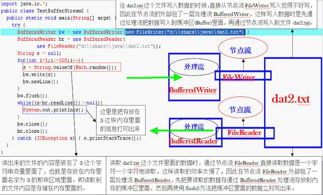</div>

  程序的输入指的是把从文件读取到的内容存储到为程序分配的内存区域里面去。流，什么是流，流无非就是两根管道，一根向里，一根向外，向里向外都是对于我们自己写的程序来说，流分为各种各样的类型，不同的分类方式又可以分为不同的类型，根据方向来分，分为输入流和输出流，根据读取数据的单位的不同，又可以分为字符流和字节流，除此之外，还可以分为节点流和处理流，节点流就是直接和数据源连接的流，处理流就是包在其它流上面的流，处理流不是直接和数据源连接，而是从数据源读取到数据以后再通过处理流处理一遍。缓冲流也包含了四个类：BufferedInputStream、BufferedOutputStream、BufferedReader和BufferedWriter。流都是成对的，没有流是是不成对的，肯定是一个in，一个out。

- **第二种处理流——转换流**

  <div style="display:flex;">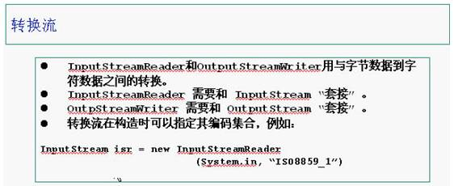</div>

  转换流非常的有用，它可以把一个字节流转换成一个字符流，转换流有两种，一种叫InputStreamReader，另一种叫OutputStreamWriter。InputStream是字节流，Reader是字符流，InputStreamReader就是把InputStream转换成Reader。OutputStream是字节流，Writer是字符流，OutputStreamWriter就是把OutputStream转换成Writer。把OutputStream转换成Writer之后就可以一个字符一个字符地通过管道写入数据了，而且还可以写入字符串。我们如果用一个FileOutputStream流往文件里面写东西，得要一个字节一个字节地写进去，但是如果我们在FileOutputStream流上面套上一个字符转换流，那我们就可以一个字符串一个字符串地写进去。

  转换流测试代码：

  ```java
  package cn.gacl.test;
  
  import java.io.*;
  
  public class TestTransform1 {
      public static void main(String args[]) {
          try {
              OutputStreamWriter osw = new OutputStreamWriter(
                      new FileOutputStream("D:/java/char.txt"));
              osw.write("MircosoftsunIBMOracleApplet");// 把字符串写入到指定的文件中去
              System.out.println(osw.getEncoding());// 使用getEncoding()方法取得当前系统的默认字符编码
              osw.close();
              osw = new OutputStreamWriter(new FileOutputStream(
                      "D:\\java\\char.txt", true), "ISO8859_1");
              // 如果在调用FileOutputStream的构造方法时没有加入true，那么新加入的字符串就会替换掉原来写入的字符串，在调用构造方法时指定了字符的编码
              osw.write("MircosoftsunIBMOracleApplet");// 再次向指定的文件写入字符串，新写入的字符串加入到原来字符串的后面
              System.out.println(osw.getEncoding());
              osw.close();
  
          } catch (Exception e) {
              e.printStackTrace();
          }
      }
  }
  ```

  <div style="display:flex;">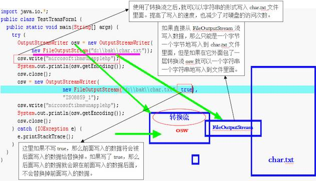</div>

  ```java
  package cn.gacl.test;
  
  import java.io.*;
  public class TestTransform2{
      public static void main(String args[]){
          try{
              InputStreamReader isr = new InputStreamReader(System.in);
              //System.in这里的in是一个标准的输入流，用来接收从键盘输入的数据
              BufferedReader br = new BufferedReader(isr);
              String s = null;
              s = br.readLine();//使用readLine()方法把读取到的一行字符串保存到字符串变量s中去
              while(s != null){
                  System.out.println(s.toUpperCase());//把保存在内存s中的字符串打印出来
                  s = br.readLine();//在循环体内继续接收从键盘的输入
                  if(s.equalsIgnoreCase("exit")){
                      //只要输入exit循环就结束，就会退出
                      break;
                  }
              }
          }catch(Exception e){
              e.printStackTrace();
          }
      }
  }
  ```

  <div style="display:flex;">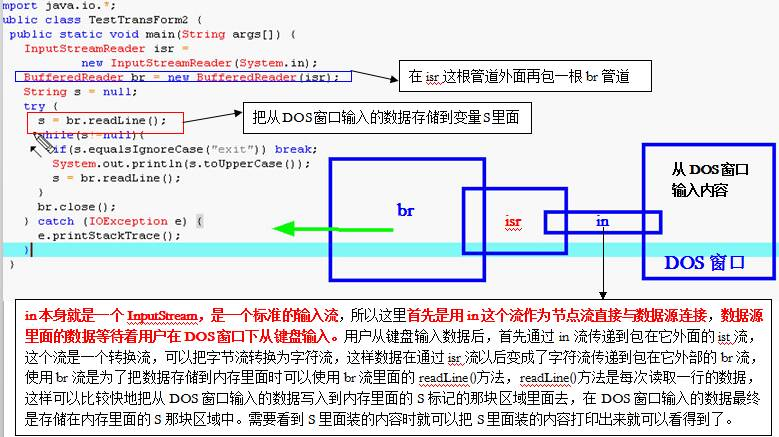</div>

- **第三种处理流——数据流**

  <div style="display:flex;">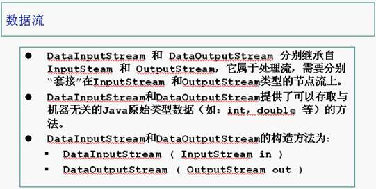</div>

  数据流测试代码：

  ```java
  package cn.gacl.test;
  
  import java.io.*;
  public class TestDataStream{
      public static void main(String args[]){
          ByteArrayOutputStream baos = new ByteArrayOutputStream();
          //在调用构造方法时，首先会在内存里面创建一个ByteArray字节数组
          DataOutputStream dos = new DataOutputStream(baos);
          //在输出流的外面套上一层数据流，用来处理int，double类型的数
          try{
              dos.writeDouble(Math.random());//把产生的随机数直接写入到字节数组ByteArray中
              dos.writeBoolean(true);//布尔类型的数据在内存中就只占一个字节
          ByteArrayInputStream bais = new ByteArrayInputStream(baos.toByteArray());
              System.out.println(bais.available());
              DataInputStream dis = new DataInputStream(bais);
              System.out.println(dis.readDouble());//先写进去的就先读出来，调用readDouble()方法读取出写入的随机数
              System.out.println(dis.readBoolean());//后写进去的就后读出来，这里面的读取顺序不能更改位置，否则会打印出不正确的结果
              dos.close();
              bais.close();
          }catch(Exception e){
                  e.printStackTrace();
              }
      }
  }
  ```

  通过baos这个流往外读取数据的时候，是一个字节一个字节地往外读取的，因此读出来的数据无法判断是字符串还是bool类型的值，因此要在它的外面再套一个流，通过dataInputStream把读出来的数据转换就可以判断了。注意了：读取数据的时候是先写进去的就先读出来，因此读ByteArray字节数组数据的顺序应该是先把占8个字节的double类型的数读出来，然后再读那个只占一个字节的boolean类型的数，因为double类型的数是先写进数组里面的，读的时候也要先读它。这就是所谓的先写的要先读。如果先读Boolean类型的那个数，那么读出来的情况可能就是把double类型数的8个字节里面的一个字节读了出来。

- **打印流——Print**

  <div style="display:flex;"></div>

  测试代码：

  ```java
  package cn.gacl.test;
  
  /*这个小程序是重新设置打印输出的窗口，
   * 把默认在命令行窗口输出打印内容设置成其他指定的打印显示窗口
   */
  import java.io.*;
  public class TestPrintStream{
      public static void main(String args[]){
          PrintStream ps = null;
          try{
                  FileOutputStream fos = new FileOutputStream("D:/java/log.txt");
                  ps = new PrintStream(fos);//在输出流的外面套接一层打印流，用来控制打印输出
                  if(ps != null){
                      System.setOut(ps);//这里调用setOut()方法改变了输出窗口，以前写System.out.print()默认的输出窗口就是命令行窗口.
                      //但现在使用System.setOut(ps)将打印输出窗口改成了由ps指定的文件里面，通过这样设置以后，打印输出时都会在指定的文件内打印输出
                      //在这里将打印输出窗口设置到了log.txt这个文件里面，所以打印出来的内容会在log.txt这个文件里面看到
                  }
              for(char c=0;c<=60000;c++){
                      System.out.print(c+"\t");//把世界各国的文字打印到log.txt这个文件中去
                  }
          }catch(Exception e){
              e.printStackTrace();
          }
      }
  }
  ```

  <div style="display:flex;"></div>

- **对象流——Object**

  <div style="display:flex;">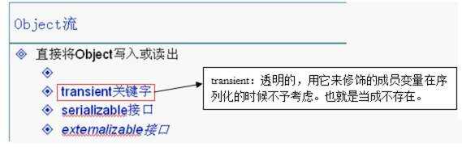</div>

  测试代码:

  ```java
  package cn.gacl.test;
  
  import java.io.*;
  
  public class TestObjectIo {
      public static void main(String args[]) {
          T t = new T();
          t.k = 8;// 把k的值修改为8
          try {
              FileOutputStream fos = new FileOutputStream(
                      "D:/java/TestObjectIo.txt");
              ObjectOutputStream oos = new ObjectOutputStream(fos);
              // ObjectOutputStream流专门用来处理Object的，在fos流的外面套接ObjectOutputStream流就可以直接把一个Object写进去
              oos.writeObject(t);// 直接把一个t对象写入到指定的文件里面
              oos.flush();
              oos.close();
              FileInputStream fis = new FileInputStream(
                      "D:/java/TestObjectIo.txt");
              ObjectInputStream ois = new ObjectInputStream(fis);
              // ObjectInputStream专门用来读一个Object的
              T tRead = (T) ois.readObject();
              // 直接把文件里面的内容全部读取出来然后分解成一个Object对象，并使用强制转换成指定类型T
              System.out.print(tRead.i + "\t" + tRead.j + "\t" + tRead.d + "\t"
                      + tRead.k);
              ois.close();
          } catch (Exception e) {
              e.printStackTrace();
          }
      }
  }
  
  /*
   * 凡是要将一个类的对象序列化成一个字节流就必须实现Serializable接口
   * Serializable接口中没有定义方法，Serializable接口是一个标记性接口，用来给类作标记，只是起到一个标记作用。
   * 这个标记是给编译器看的，编译器看到这个标记之后就可以知道这个类可以被序列化 如果想把某个类的对象序列化，就必须得实现Serializable接口
   */
  class T implements Serializable {
      // Serializable的意思是可以被序列化的
      int i = 10;
      int j = 9;
      double d = 2.3;
      int k = 15;
      // transient int k = 15;
      // 在声明变量时如果加上transient关键字，那么这个变量就会被当作是透明的，即不存在。
  }
  ```

  直接实现Serializable接口的类是JDK自动把这个类的对象序列化，而如果实现public interface Externalizable extends Serializable的类则可以自己控制对象的序列化，建议能让JDK自己控制序列化的就不要让自己去控制。

## **IO流总结**

<div style="display:flex;"></div>

<div style="display:flex;">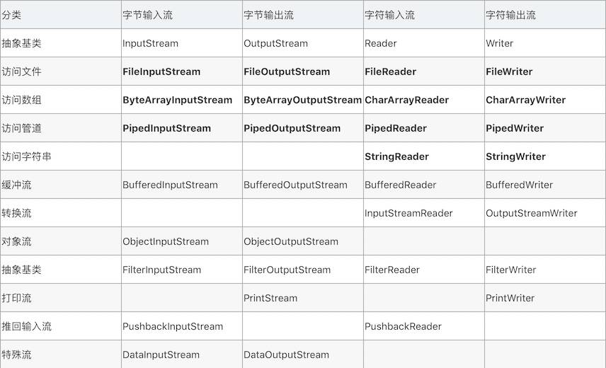</div>

### 在开发中正确使用IO流

了解了IO的整体类结构和每个类的特性后，我们可以在开发的过程中根据需要灵活的使用不同的IO流进行开发。下面是整理的2点原则:

- 如果是操作二进制文件那我们就使用字节流，如果操作的是文本文件那我们就使用字符流。
- 尽可能的多使用处理流，这会使我们的代码更加灵活，复用性更好。


## **对象的序列化和反序列化**

序列化：指把堆内存中的 Java 对象数据，通过某种方式把对象存储到磁盘文件中或者传递给其他网络节点（在网络上传输）。这个过程称为序列化。通俗来说就是将数据结构或对象转换成二进制串的过程

反序列化：把磁盘文件中的对象数据或者把网络节点上的对象数据，恢复成Java对象模型的过程。也就是将在序列化过程中所生成的二进制串转换成数据结构或者对象的过程

### **为什么要做序列化？**

- 在分布式系统中，此时需要把对象在网络上传输，就得把对象数据转换为二进制形式，需要共享的数据的 JavaBean 对象，都得做序列化。
- 服务器钝化：如果服务器发现某些对象好久没活动了，那么服务器就会把这些内存中的对象持久化在本地磁盘文件中（Java对象转换为二进制文件）；如果服务器发现某些对象需要活动时，先去内存中寻找，找不到再去磁盘文件中反序列化我们的对象数据，恢复成 Java 对象。这样能节省服务器内存。

### **Java 怎么进行序列化？**

- 需要做序列化的对象的类，必须实现序列化接口：Java.lang.Serializable 接口（这是一个标志接口，没有任何抽象方法），Java 中大多数类都实现了该接口，比如：String，Integer
- 底层会判断，如果当前对象是 Serializable 的实例，才允许做序列化，Java对象 instanceof Serializable 来判断。
- 在 Java 中使用对象流来完成序列化和反序列化
  - **ObjectOutputStream**:通过 writeObject()方法做序列化操作
  - **ObjectInputStream**:通过 readObject() 方法做反序列化操作

**第一步：创建一个 JavaBean 对象**

```java
public class Person implements Serializable{
    private String name;
    private int age;
     
    public String getName() {
        return name;
    }
    public void setName(String name) {
        this.name = name;
    }
    public int getAge() {
        return age;
    }
    public void setAge(int age) {
        this.age = age;
    }
    @Override
    public String toString() {
        return "Person [name=" + name + ", age=" + age + "]";
    }
    public Person(String name, int age) {
        super();
        this.name = name;
        this.age = age;
    }
}　　
```

**第二步：使用 ObjectOutputStream 对象实现序列化**

```java
		//在根目录下新建一个 io 的文件夹
        OutputStream op = new FileOutputStream("io"+File.separator+"a.txt");
        ObjectOutputStream ops = new ObjectOutputStream(op);
        ops.writeObject(new Person("vae",1));
         
        ops.close();
```

我们打开 a.txt 文件，发现里面的内容乱码，注意这不需要我们来看懂，这是二进制文件，计算机能读懂就行了。

错误一：如果新建的 Person 对象没有实现 Serializable 接口，那么上面的操作会报错：

<div style="display:flex;"></div>

**第三步：使用ObjectInputStream 对象实现反序列化** - **反序列化的对象必须要提供该对象的字节码文件.class**

```java
InputStream in = new FileInputStream("io"+File.separator+"a.txt");
ObjectInputStream os = new ObjectInputStream(in);
byte[] buffer = new byte[10];
int len = -1;
Person p = (Person) os.readObject();
System.out.println(p);  //Person [name=vae, age=1]
os.close();
```

问题1：如果某些数据不需要做序列化，比如密码，比如上面的年龄？<br>解决办法：在字段面前加上 transient

```java
private String name;//需要序列化
transient private int age;//不需要序列化
```

那么我们在反序列化的时候，打印出来的就是Person [name=vae, age=0]，整型数据默认值为 0 

问题2：序列化版本问题，在完成序列化操作后，由于项目的升级或修改，可能我们会对序列化对象进行修改，比如增加某个字段，那么我们在进行反序列化就会报错：

<div style="display:flex;"></div>

解决办法：在 JavaBean 对象中增加一个 serialVersionUID 字段，用来固定这个版本，无论我们怎么修改，版本都是一致的，就能进行反序列化了

```java
private static final long serialVersionUID = 8656128222714547171L;
```

