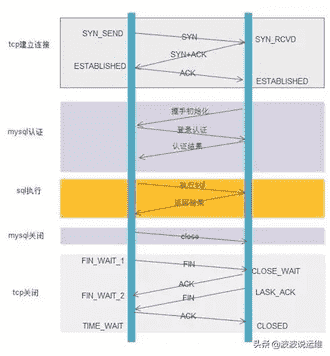
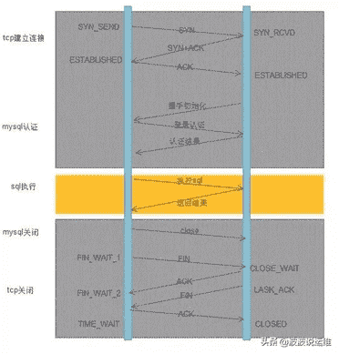
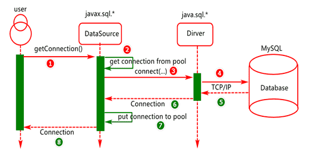

# Java基础-JDBC与连接池

::: tip 此文为转载 （通常一篇文章会参考多处，也会添加自己的理解，引用地址如有遗漏，请指出）

- [https://blog.csdn.net/qq_33956536/article/details/107195051](https://blog.csdn.net/qq_33956536/article/details/107195051)
- [https://blog.csdn.net/qq_38425976/article/details/106945454](https://blog.csdn.net/qq_38425976/article/details/106945454)
- [https://www.cnblogs.com/cocoxu1992/p/11031908.html](https://www.cnblogs.com/cocoxu1992/p/11031908.html)
- [https://blog.csdn.net/s_zero/article/details/105936671](https://blog.csdn.net/s_zero/article/details/105936671)
- [https://www.cnblogs.com/hongdada/p/9360155.html](https://www.cnblogs.com/hongdada/p/9360155.html)
- [https://segmentfault.com/a/1190000038351949](https://segmentfault.com/a/1190000038351949)

:::

<br />

## JDBC

### 数据库驱动

我们的程序会通过数据库驱动，和数据库打交道！

`应用程序 --> 数据库驱动 (oracle / mysql ...) --> 数据库`

### JDBC

SUN 公司为了简化开发人员的（对数据库的统一）操作，提供了一个(Java操作数据库的)规范，JDBC。这些规范的实现由具体的厂商去做对于开发人员来说，我们只需要掌握JDBC的接口操作即可。

`应用程序 --> JDBC --> 数据库驱动 (oracle / mysql ...) --> 数据库`

> 引入：
>
> - java.sql包
> - javax.sql包
> - 还需要导入数据库驱动包

### 第一个JDBC程序

测试代码

```java
package com.kuang.lesson01;
//我的第一个JDBC程序

import java.sql.Connection;
import java.sql.DriverManager;
import java.sql.ResultSet;
import java.sql.Statement;

public class JdbcFirstDemo {
    public static void main(String[] args) throws Exception {
        //1. 加载驱动
        Class.forName("com.mysql.jdbc.Driver");//固定写法
        //2. 用户信息和url
        //useUnicode=true&characterEncoding=utf8&&useSSL=true
        String url = "jdbc:mysql://localhost:3306/jdbcstudy?useSSL=false&useUnicode=true&characterEncoding=utf8";
        String name = "root";
        String password = "123456";

        //3. 连接成功，返回数据库对象  connection代表数据库
        Connection connection= DriverManager.getConnection(url,name,password);
        //4. 执行SQL的对象 statement 执行SQL的对象
        Statement statement = connection.createStatement();

        //5. 执行SQL的对象 去执行SQL   可能存在结果，查看返回结果
        String sql="SELECT * FROM users";
        ResultSet resultSet = statement.executeQuery(sql);//返回的结果集,结果集中封装了我们全部查询的结果
        while(resultSet.next()){
            System.out.println("id+"+resultSet.getObject("id"));
            System.out.println("name+"+resultSet.getObject("NAME"));
            System.out.println("password+"+resultSet.getObject("PASSWORD"));
            System.out.println("email+"+resultSet.getObject("email"));
            System.out.println("birthday+"+resultSet.getObject("birthday"));
        }
        //6. 释放连接
        resultSet.close();
        statement.close();
        connection.close();
    }
}
```

步骤：

1. 加载驱动
2. 链接数据库DriverManager
3. 获得执行sql的对象 statement
4. 获得返回的结果集
5. 释放连接

- DriverManager

```java
//DriverManager.registerDriver(new com.mysql.jdbc.Driver());
Class.forName("com.mysql.jdbc.Driver");//固定写法
```

- url

```java
String url = "jdbc:mysql://localhost:3306/jdbcstudy?useSSL=false&useUnicode=true&characterEncoding=utf8";
//mysql--3306
// 协议://主机地址:端口号/数据库名?参数1&参数2...
//oracle--1521
//jdbc:oracle:thin:@localhost:1521:sid
```

- Connection

```java
Connection connection= DriverManager.getConnection(url,name,password);
//***这里connection代表数据库***，所以相应的有如下特性
//数据库设置自动提交
//事务提交
//事务回滚
connection.rollback();
connection.commit();
connection.setAutoCommit();
```

- Statement

```java
statement.executeQuery();//查询操作 返回结果集ResultSet
statement.execute();//可以执行任何sql
statement.executeUpdate();//更新 插入 删除都是用这个，返回受影响的行数
... ...
```

- ResultSet

```java
//不知道类型就用Object
resultSet.getObject();
//知道类型可以直接使用对应类型获取
resultSet.getString();
resultSet.getInt();
resultSet.getFloat();
resultSet.getDouble();
resultSet.next();//移动到下一行数据
resultSet.beforeFirst();//移动到最前
resultSet.afterLast();//移动到最后
resultSet.previous();//移动到前一行
resultSet.absolute(i);//移动到第i行
```

- close

```java
resultSet.close();
statement.close();
connection.close();//耗资源
```

### Statement对象

**Jdbc中的statement对象用于向数据库发送SQL语句，想完成对数据库的增删改查，只需要通过这个对象向数据库发送增删改查语句即可。**

Statement对象的executeUpdate方法，用于向数据库发送增、删、改的sq|语句， executeUpdate执行完后， 将会返回一个整数(即增删改语句导致了数据库几行数据发生了变化)。Statement.executeQuery方法用于向数据库发生查询语句，executeQuery方法返回代表查询结果的ResultSet对象。

- CRUD操作-create

``` java
Statement statement = connection.createStatement();
String sql = "insert into user(...) values(...)";
int num = statement.executeUpdate(sql);
if(num>0){
  System.out.println("插入成功");
}
```

- CRUD操作-delete

```java
Statement statement = connection.createStatement();
String sql = "delete from user where id =1";
int num = statement.executeUpdate(sql);
if(num>0){
  System.out.println("删除成功");
}
```

- CURD操作-update

```java
Statement statement = connection.createStatement();
String sql = "update user set name ='' where name = ''";
int num = statement.executeUpdate(sql);
if(num>0){
  System.out.println("修改成功");
}
```

- CURD操作-read

```java
Statement statement = connection.createStatement();
String sql = "select * from  user where id =1";
ResultSet rs= statement.executeQuery(sql);
if(rs.next()){
  System.out.println("");
}
```

### 代码实现

- 工具类

``` java
import java.io.IOException;
import java.io.InputStream;
import java.sql.*;
import java.util.Properties;

public class JdbcUtils {
    private static String driver = null;
    private static String url = null;
    private static String username = null;
    private static String password = null;
    static {
        try{
            InputStream in = JdbcUtils.class.getClassLoader().getResourceAsStream("db.properties");
            Properties properties = new Properties();
            properties.load(in);
            driver=properties.getProperty("driver");
            url=properties.getProperty("url");
            username=properties.getProperty("username");
            password=properties.getProperty("password");

            //1.驱动只用加载一次
            Class.forName(driver);

        } catch (IOException e) {
            e.printStackTrace();
        } catch (ClassNotFoundException e) {
            e.printStackTrace();
        }
    }


    //2.获取连接
    public static Connection getConnection() throws Exception{
        return DriverManager.getConnection(url, username, password);
    }
    //3.释放资源
    public static void release(Connection conn, Statement st, ResultSet rs) throws SQLException {

        if(rs!=null){
            rs.close();
        }
        if (st!=null){
            st.close();
        }
        if(conn!=null){
            conn.close();
        }

    }
}
```

- 具体操作

```java
import utils.JdbcUtils;

import java.sql.Connection;
import java.sql.ResultSet;
import java.sql.Statement;

public class Test2 {
    public static void main(String[] args) throws Exception {
        Connection connection=null;
        Statement statement=null;
        ResultSet resultSet=null;
        try {
            connection= JdbcUtils.getConnection();
            statement=connection.createStatement();
            String sql="insert into users(id,name,password,email,birthday)" +
                    "values(100,'tzt','123456','123456@qq.com','1998-08-08');";
            int i=statement.executeUpdate(sql);
            if (i>0){
                System.out.println("插入成功！");
            }
        }catch (Exception e){
            e.printStackTrace();
        }finally {
            JdbcUtils.release(connection,statement,resultSet);
        }
    }
}
```

### SQL注入问题

> SQL注入即是指web应用程序对用户输入数据的合法性没有判断或过滤不严，攻击者可以在web应用程序中事先定义好的查询语句的结尾上添加额外的SQL语句，在管理员不知情的情况下实现非法操作，以此来实现欺骗数据库服务器执行非授权的任意查询，从而进一步得到相应的数据信息。

sql存在漏洞，会被攻击导致数据泄露<br />比如登录业务中，需要查询账号密码所对应的用户（比对），可能用到如下sql语句：

```sql
select * from users where name='name' and password ='password'
```

其中name和password两个变量都是用户所传入的数据，如果用户构造合适的输入，比如：

```java
String name=" ' or  1=1 -- ";
String password ="12412r1";//password在此例中的值不重要
```

那么如上sql语句拼接成了：

```sql
select * from users where name='  ' or  1=1 -- password ='12412r1'
```

就可以匹配到表中所有用户的信息

### PreparedStatement

PreparedStatement 可以防止SQL注入 ，且效率更高。示例程序：

```java
import utils.JdbcUtils;

import java.sql.*;

public class Test2 {
    public static void main(String[] args) throws Exception {
        Connection connection=null;
        PreparedStatement statement=null;
        ResultSet resultSet=null;
        try {
            connection= JdbcUtils.getConnection();
            //？占位符
            String sql="insert into users(id,name,password,email,birthday)" +
                    "values(?,?,?,?,?);";
            //和Statement的区别！！！！！！！！！
            statement=connection.prepareStatement(sql);
            //手动给参数赋值
            statement.setInt(1,99);
            statement.setString(2,"hhh");
            statement.setString(3,"12312313");
            statement.setString(4,"15612318@qq.com");
            statement.setDate(5,new java.sql.Date(new Date(1231).getTime()));
            int i=statement.executeUpdate();
            if (i>0){
                System.out.println("插入成功！");
            }
        }catch (Exception e){
            e.printStackTrace();
        }finally {
            JdbcUtils.release(connection,statement,resultSet);
        }
    }
}
```

### JDBC事务

> ACID原则
>
> - 原子性：要么全部完成，要么都不完成
> - 一致性：结果总数不变
> - 隔离性：**多个进程互不干扰**
> - 持久性：一旦提交不可逆，持久化到数据库了
>
> <br />
>
> 隔离性的问题：
>
> - 脏读： 一个事务读取了另一个没有提交的事务
> - 不可重复读：在同一个事务内，重复读取表中的数据，表发生了改变
> - 虚读(幻读)：在一个事务内，读取到了别人插入的数据，导致前后读出来的结果不一致

**代码实现**

1. 开启事务`conn.setAutoCommit(false);`
2. 一组业务执行完毕，提交事务
3. 可以在catch语句中显示的定义回滚，但是默认失败会回滚

```java
package com.kuang.lesson04;

import com.kuang.lesson02.utils.JdbcUtils;

import java.sql.Connection;
import java.sql.PreparedStatement;
import java.sql.ResultSet;
import java.sql.SQLException;

public class Action {
    public static void main(String[] args) {

        Connection conn =null;
        PreparedStatement ps = null;
        ResultSet rs = null;

        try {
            conn = JdbcUtils.getConnection();
            //关闭数据库的自动提交功能， 开启事务
            conn.setAutoCommit(false);
            //自动开启事务
            String sql = "update account set money = money-500 where id = 1";
            ps =conn.prepareStatement(sql);
            ps.executeUpdate();
            String sql2 = "update account set money = money-500 where id = 2";
            ps=conn.prepareStatement(sql2);
            ps.executeUpdate();

            //业务完毕，提交事务
            conn.commit();
            System.out.println("操作成功");
        } catch (Exception e) {
            try {
                //如果失败，则默认回滚
                conn.rollback();//如果失败，回滚
            } catch (SQLException throwables) {
                throwables.printStackTrace();
            }
            e.printStackTrace();
        }finally {
            try {
                JdbcUtils.release(conn,ps,rs);
            } catch (SQLException throwables) {
                throwables.printStackTrace();
            }
        }
    }
}
```

## 数据库连接池

### 为什么使用连接池

不使用连接池流程，下面以访问MySQL为例，执行一个SQL命令，如果不使用连接池，需要经过哪些流程。

<div style="display:flex;"></div>

使用连接池流程:

<div style="display:flex;"></div>

第一次访问的时候，需要建立连接。 但是之后的访问，均会复用之前创建的连接，直接执行SQL语句。

### 连接池的要考虑的问题

> 以下为原作者的个人理解，帮助理解。<br />
>
> <font color="red">**深入学习建议查看开源源码**</font>

(1) 

思考:假如现在是让你去设计一个连接池,你会从什么角度进行设计? <br />
第一:物理存储结构(基于什么结构去存储数据)<br />
第二:基于什么算法从池中取连接?<br />
第三:基于什么算法从池中移除连接?<br />
第四:当池中没有连接时,基于什么方式处理连接请求?<br />
第五:池是可以共享,我们需要考虑池在访问的时并发安全?<br />

(2)

- 并发问题

为了使连接管理服务具有最大的通用性，必须考虑多线程环境，即并发问题。这个问题相对比较好解决，因为Java语言自身提供了对并发管理的支 持，使用synchronized关键字即可确保线程是同步的。使用方法为直接在类方法前面加上synchronized关键字，如：`public synchronized Connection getConnection()`

- 多数据库服务器和多用户

对于大型的企业级应用，常常需要同时连接不同的数据库（如连接oracle和sybase）。如何连接不同的数据库呢？我们采用的策略是：设计一个符合单例模式的连接池管理类，在连接池管理类的唯一实例被创建时读取一个资源文件，其中资源文件中存放着多个数据库的url地址等信息。根据资源文件提供的信息，创建多个连接池类的实例，每一个实例都是一个特定数据库的连接池。连接池管理类实例为每个连接池实例取一个名字，通过不同的名字来管理不同的连接池。<br />对于同一个数据库有多个用户使用不同的名称和密码访问的情况，也可以通过资源文件处理，即在资源文件中设置多个具有相同url地址，但具有不同用户名和密码的数据库连接信息。

- 事务处理

我们知道，事务具有原子性，此时要求对数据库的操作符合“all-all-nothing”原则即对于一组sql语句要么全做，要么全不做。<br />在java语言中，connection类本身提供了对事务的支持，可以通过设置connection的autocommit属性为false 然后显式的调用commit或rollback方法来实现。但要高效的进行connection复用，就必须提供相应的事务支持机制。可采用每一个事务独占一个连接来实现，这种方法可以大大降低事务管理的复杂性。

- 连接池的分配与释放

连接池的分配与释放，对系统的性能有很大的影响。合理的分配与释放，可以提高连接的复用度，从而降低建立新连接的开销，同时还可以加快用户的访问速度。<br />对于连接的管理可使用空闲池。即把已经创建但尚未分配出去的连接按创建时间存放到一个空闲池中。每当用户请求一个连接时，系统首先检查空闲池内有没有空闲连接。如果有就把建立时间最长（通过容器的顺序存放实现）的那个连接分配给他（实际是先做连接是否有效的判断，如果可用就分配给用户，如不可用就把这个连接从空闲池删掉，重新检测空闲池是否还有连接）；如果没有则检查当前所开连接池是否达到连接池所允许的最大连接数（maxconn）如果没有达到，就新建一个连接，如果已经达到，就等待一定的时间（timeout）。如果在等待的时间内有连接被释放出来就可以把这个连接分配给等待的用户，如果等待时间超过预定时间timeout 则返回空值（null）。系统对已经分配出去正在使用的连接只做计数，当使用完后再返还给空闲池。对于空闲连接的状态，可开辟专门的线程定时检测，这样会花费一定的系统开销，但可以保证较快的响应速度。也可采取不开辟专门线程，只是在分配前检测的方法。

- 连接池的配置与维护

连接池中到底应该放置多少连接，才能使系统的性能最佳？系统可采取设置最小连接数（minconn）和最大连接数（maxconn）来控制连接池中的连接。最小连接数是系统启动时连接池所创建的连接数。如果创建过多，则系统启动就慢，但创建后系统的响应速度会很快；如果创建过少，则系统启动的很快，响应起来却慢。这样，可以在开发时，设置较小的最小连接数，开发起来会快，而在系统实际使用时设置较大的，因为这样对访问客户来说速度会快些。最大连接数是连接池中允许连接的最大数目，具体设置多少，要看系统的访问量，可通过反复测试，找到最佳点。<br />如何确保连接池中的最小连接数呢？有动态和静态两种策略。动态即每隔一定时间就对连接池进行检测，如果发现连接数量小于最小连接数，则补充相应数量的新连接以保证连接池的正常运转。静态是发现空闲连接不够时再去检查。

### Java中的连接池

Java官方，为了在应用程序中更好的应用连接池技术，定义了一套数据源规范，例如javax.sql.DataSource接口，基于这个接口，很多团队或个人创建了不同的连接池对象。然后我们的应用程序中通过耦合与DataSource接口，便可以方便的切换不同厂商的连接池。Java项目中通过连接池获取连接的一个基本过程，如下图所示：

<div style="display:flex;"></div>

在上图中，用户通过DataSource对象的getConnection()方法，获取一个连接。假如池中有连接，则直接将连接返回给用户。假如池中没有连接，则会调用Dirver（驱动，由数据库厂商进行实现）对象的connect方法从数据库获取，拿到连接以后，可以将连接在池中放一份，然后将连接返回给调用方。连接需求方再次需要连接时，可以从池中获取，用完以后再还给池对象。


### 编写简单连接池

> 下面为转载的简单实现以帮助理解，有些方面代码考虑并不全面（如上面的并发问题等），所以<br />
>
> <font color="red">**深入学习建议查看开源源码**</font>

1. 读取外部配置信息

```java
//外部配置文件信息
public class DbBean {

	/* 链接属性 */
	private String driverName = "com.mysql.jdbc.Driver";

	private String url = "jdbc:mysql://localhost:3306/test";

	private String userName = "root";

	private String password = "root";

	private String poolName = "thread01";// 连接池名字

	private int minConnections = 1; // 空闲池，最小连接数

	private int maxConnections = 10; // 空闲池，最大连接数

	private int initConnections = 5;// 初始化连接数

	private long connTimeOut = 1000;// 重复获得连接的频率

	private int maxActiveConnections = 100;// 最大允许的连接数，和数据库对应 

	private long connectionTimeOut = 1000 * 60 * 20;// 连接超时时间，默认20分钟

	//getter setter
}
```

其中较为关键的参数为空闲池数量，当有线程获取连接时，会首先判断创建的连接数是否小于maxActiveConnections ，大于线程将进行等待，小于将会从空闲池中进行取，如果能取到，则会放入活动池中，如果取不到，则新建连接，然后再放入活动池中。
释放连接时会首先判断 空闲连接池是否已满，如果已满则直接释放，如果未满则会将连接从活动池转入空闲池中。

2. 创建接口

```java
//连接数据库池
public interface IConnectionPool {

	// 获取连接(重复利用机制)
	public Connection getConnection();

	// 释放连接(可回收机制)
	public void releaseConnection(Connection connection);
}
```

3. 创建数据库连接池

```java
/**
 * ####核心参数######
 * 1.空闲线程 容器 没有被使用的连接存放
 * 2.活动线程 容器 正在使用的连接
 * ###核心步骤#####
 * 1. 初始化线程池(初始化空闲线程)
 * 2. 调用getConnection方法 --- 获取连接
 * ## 2.1先去freeConnection获取当前连接,存放在activeConnection
 * 3.调用releaseConnection方法 ----释放连接----资源回收
 * ## 3.1获取activeConnection集合连接,转移到 freeConnection集合中
 */
public class ConnectionPool implements IConnectionPool {
	// 使用线程安全的集合 空闲线程 容器 没有被使用的连接存放
	private List<Connection> freeConnection = new Vector<Connection>();
	// 使用线程安全的集合 活动线程 容器 容器正在使用的连接
	private List<Connection> activeConnection = new Vector<Connection>();
	private DbBean dbBean;
	private static AtomicInteger countConne = new AtomicInteger();


	public ConnectionPool(DbBean dbBean) {
		// 获取配置文件信息
		this.dbBean = dbBean;
		init();
	}

	// 初始化线程池(初始化空闲线程)
	private void init(){
		if (dbBean == null) {
			try {
				throw new Exception("配置文件初始化失败");
			} catch (Exception e) {
				e.printStackTrace();
			}
		}
		// 1.获取初始化连接数
		for (int i = 0; i < dbBean.getInitConnections(); i++) {
			// 2.创建Connection连接
			Connection newConnection = newConnection();
			if (newConnection != null) {
				// 3.存放在freeConnection集合
				freeConnection.add(newConnection);
			}
		}

	}

	// 创建Connection连接
	private  Connection newConnection() {
		try {
			Class.forName(dbBean.getDriverName());
			Connection connection = DriverManager.getConnection(dbBean.getUrl(), dbBean.getUserName(),
					dbBean.getPassword());
			countConne.incrementAndGet();
			return connection;
		} catch (Exception e) {
			return null;
		}

	}

	// 调用getConnection方法 --- 获取连接
	public  Connection getConnection() {

		try {
			Connection connection = null;
			if (countConne.get() < dbBean.getMaxActiveConnections()) {
				// 小于最大活动连接数
				// 1.判断空闲线程是否有数据
				if (freeConnection.size() > 0) {
					// 空闲线程有存在连接
					// ==freeConnection.get(0);freeConnection.remove(0)
					// 拿到在删除
					connection = freeConnection.remove(0);
				} else {
					// 创建新的连接
					connection = newConnection();
				}
				// 判断连接是否可用
				boolean available = isAvailable(connection);
				if (available) {
					// 存放在活动线程池
					activeConnection.add(connection);
				} else {
					countConne.decrementAndGet();
					connection = getConnection();// 怎么使用重试？ 递归算法
				}

			} else {
				// 大于最大活动连接数，进行等待
				wait(dbBean.getConnTimeOut());
				// 重试
				connection = getConnection();
			}
			return connection;
		} catch (Exception e) {
			return null;
		}

	}

	// 判断连接是否可用
	public boolean isAvailable(Connection connection) {
		try {
			if (connection == null || connection.isClosed()) {
				return false;
			}
		} catch (Exception e) {

			// TODO: handle exception
		}
		return true;

	}

	// 释放连接 回收
	public void releaseConnection(Connection connection) {
		try {
			// 1.判断连接是否可用
			if (isAvailable(connection)) {
				// 2.判断空闲线程是否已满
				if (freeConnection.size() < dbBean.getMaxConnections()) {
					// 空闲线程没有满
					freeConnection.add(connection);// 回收连接
				} else {
					// 空闲线程已经满
					connection.close();
				}
				activeConnection.remove(connection);
				countConne.decrementAndGet();
				notifyAll();
			}
		} catch (Exception e) {
			// TODO: handle exception
		}

	}

}
```

创建管理类

```java
// 管理线程池
public class ConnectionPoolManager {
	private static DbBean dbBean = new DbBean();
	private static ConnectionPool connectionPool = new ConnectionPool(dbBean);

	// 获取连接(重复利用机制)
	public static Connection getConnection() {
		return connectionPool.getConnection();
	}

	// 释放连接(可回收机制)
	public static void releaseConnection(Connection connection) {
		connectionPool.releaseConnection(connection);
	}
}
```

测试运行结果

```java
public class Test01 {

	public static void main(String[] args) {
		ThreadConnection threadConnection = new ThreadConnection();
		for (int i = 0; i < 2; i++) {
			Thread thread = new Thread(threadConnection, "线程i:" + i);
			thread.start();
		}
	}

}

class ThreadConnection implements Runnable {

	public void run() {
		for (int i = 0; i < 101; i++) {
			Connection connection = ConnectionPoolManager.getConnection();
			System.out.println(Thread.currentThread().getName() + ",connection-"+i+"：" + connection);
      
      //2、创建状态  
      Statement state =con.createStatement();             
      //3、查询数据库并返回结果  
      ResultSet result =state.executeQuery("select * from users");             
      //4、输出查询结果  
      while(result.next()){  
        System.out.println(result.getString("email"));  
      }
      //5、断开数据库连接  
      result.close();  
      state.close(); 
      
      //释放
			ConnectionPoolManager.releaseConnection(connection);
		}
	}

}
```


### 开源实现

> 开源数据源实现:
>
> - DBCP - (更新速度很慢，基本处于不活跃状态)
> - C3P0 - (很久没有更新)
> - Druid：阿里巴巴
> - HikariCP

**Springboot整合HikariCP示例**

1. Spring Boot 2.x之后我们不需要去单独在pom.xml文件中引入HikariCP依赖。因为默认情况下spring-boot-starter-jdbc 或者 spring-boot-starter-data-jpa 会依赖进来（*我们不需要在我们的pom.xml或build.gradle中包含HikariCP依赖项*）

   ```xml
   <dependency>
       <groupId>org.springframework.boot</groupId>
       <artifactId>spring-boot-starter-jdbc</artifactId>
       <version>2.0.3.RELEASE</version>
   </dependency> 
   ```

   或者

   ```xml
   <dependency>
       <groupId>org.springframework.boot</groupId>
       <artifactId>spring-boot-starter-data-jpa</artifactId>
       <version>2.0.3.RELEASE</version>
   </dependency>   
   ```

2. 配置`application.properties`

   ```properties
   spring.datasource.url=jdbc:mysql://localhost:3306/concretepage
   spring.datasource.username=root
   spring.datasource.password=cp
   
   #Spring Boot 2.0 includes HikariDataSource by default
   #spring.datasource.type = com.zaxxer.hikari.HikariDataSource
   
   # 额外配置 （具体参考官网）
   spring.datasource.hikari.connection-timeout=20000
   spring.datasource.hikari.minimum-idle=5
   spring.datasource.hikari.maximum-pool-size=12
   spring.datasource.hikari.idle-timeout=300000
   spring.datasource.hikari.max-lifetime=1200000
   spring.datasource.hikari.auto-commit=true
   
   spring.jpa.properties.hibernate.dialect=org.hibernate.dialect.MySQLDialect
   spring.jpa.properties.hibernate.id.new_generator_mappings=false
   spring.jpa.properties.hibernate.format_sql=true 
   ```

3. 测试代码

   ```java
   package springbootguides.datasourceconfig;
    
   import org.springframework.beans.factory.annotation.Autowired;
   import org.springframework.boot.CommandLineRunner;
   import org.springframework.boot.SpringApplication;
   import org.springframework.boot.autoconfigure.SpringBootApplication;
    
   import javax.sql.DataSource;
   import java.sql.Connection;
    
   @SpringBootApplication
   public class DatasourceConfigApplication implements CommandLineRunner {
    
       @Autowired
       private DataSource datasource;
    
       @Override
       public void run(String... args) throws Exception {
           try(Connection conn = datasource.getConnection()) {
               System.out.println(conn);
           }
       }
    
       public static void main(String[] args) {
           SpringApplication.run(DatasourceConfigApplication.class, args);
       }
    
   }
   ```

**基于HikariCP实现JDBC操作(练习)**

1. 第一步：定义GoodsDao接口，例如：

   ```java
   package com.cy.pj.goods.dao;
   import java.util.List;
   import java.util.Map;
   /**
    * 商品模块数据访问层接口
    */
   public interface GoodsDao {
       /**
    * 查询所有商品信息,将每一行记录存储到一个map对象,然后将多个存储到list集合.
    */ List<Map<String,Object>> findGoods();
   }
   ```

   

2. 第二步：创建GoodsDao接口实现类，代码如下：

   ```java
   package com.cy.pj.goods.dao;
   /**
    * 此对象为一个商品数据层访问对象,现在要求在此类中定义一个方法,这个方法基于JDBC从从数据库获取商品信息,并将其封装到map集合,要求一个行记录一个map对象(key为表中字段名,值为字段名对应的值),多个map存储到list集合. @Repository此注解通常用于描述数据层实现类对象,本质上就是一个特殊的@Component, 都是要交给spring框架管理的一个Bean对象
    */
   @Repository
   public class DefaultGoodsDao implements  GoodsDao{
          @Autowired
          private DataSource dataSource;//hikariCP
          /**查询商品信息,一行记录映射为内存中的一个map对象*/
          public List<Map<String,Object>> findGoods(){
              Connection conn=null;//java.sql.*
              Statement stmt=null;
              ResultSet rs=null;
              String sql="select * from tb_goods";
              //1.获取连接(从连接池获取)
              try {
                  conn=dataSource.getConnection();
                  //2.创建statement对象
                  stmt=conn.createStatement();
                  //3.发送sql
                  rs=stmt.executeQuery(sql);
                  //4.处理结果
                  List<Map<String,Object>> list=new ArrayList<>();
                  while(rs.next()){//循环一次取一行,一行记录映射为一个map对象
                     list.add( rowMap(rs));//将存储了一行记录的map对象再存储到list集合
                  }
                  return list;
              }catch (SQLException e){
                  e.printStackTrace();
                  throw new RuntimeException(e);//转换为非检查异常(编译时不检测的异常)
              }finally{
                  //5. 释放资源
                  close(rs,stmt,conn);
              }
          }
   ```

   定义行映射方法

   ```java
         private Map<String,Object> rowMap(ResultSet rs)throws SQLException{
             Map<String,Object> rowMap=new HashMap<>();
             //方法1映射
             //rowMap.put("id",rs.getInt("id"));
             //rowMap.put("name",rs.getString("name"));
             //rowMap.put("remark",rs.getString("remark"));
             //rowMap.put("createdTime",rs.getTimestamp("createdTime"));
             //方法2映射
             ResultSetMetaData rsmd=rs.getMetaData();//获取元数据(包括表中的字段名)
             int columnCount=rsmd.getColumnCount();//获取列的数量
             for(int i=0;i<columnCount;i++){
               rowMap.put(rsmd.getColumnLabel(i+1),rs.getObject(rsmd.getColumnLabel(i+1)));
               //getColumnLabel(i+1);获取表中字段名或字段名对应的别名
             }
             return rowMap;
          }
   ```

   定义释放资源的方法

   ```java
         private void close(ResultSet rs,Statement stmt,Connection conn){
             if(rs!=null)try{rs.close();}catch(Exception e){e.printStackTrace();}
             if(stmt!=null)try{stmt.close();}catch(Exception e){e.printStackTrace();}
             //这里的连接是返回到了池中
             if(conn!=null)try{conn.close();}catch(Exception e){e.printStackTrace();}
         }
   }
   ```

3. 测试

   ```java
   package com.cy.pj.goods.dao;
   
   @SpringBootTest
   public class GoodsDaoTests {
   
         @Autowired
         private GoodsDao goodsDao;
   
         @Test
         void testFindGoods(){
             List<Map<String,Object>> list= goodsDao.findGoods();
             for(Map<String,Object> map:list){
                 System.out.println(map);
             }
         }
   
   }
   ```

   