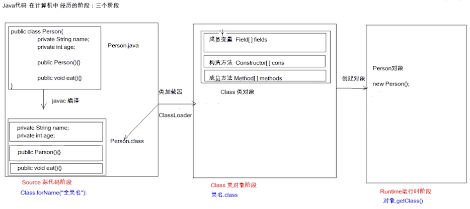

# Java基础-反射

::: tip 转载、参考

- to be added

:::

## java代码在计算机中经历的三个阶段

> to be confirm

<div style="display:flex;"></div>

- **第一个阶段（源代码阶段）**：
  - 先从java文件按成员变量，构造方法，成员方法通过javac编译成class文件。如上图Person.java-->Person.class。如果使用反射就是用"包名.类名"方式得到。
- **第二个阶段（Class类对象阶段）**：
  - 通过类加载器把class文件中的成员变量，构造方法，成员方法加载到内存中。反射通过 类名.class 得到。
- **第三个阶段（Runtime运行时阶段）**：
  - 该阶段就可以创建对象和调用对象里的方法了。对象已经有了，可以通过对象.getClass（）得到
    

一般架构上，我们前两个使用较多。三种反射得到的对象，内存地址相同，都是同一个对象(如下代码所示)。

## **Class对象获取方式**

``` java
Class cls1 = Person.class;
System.out.println(cls1);

Person p = new Person();
Class cls2 = p.getClass();
System.out.println(cls2);

//cls1,cls2 表示Person类的类类型(class type)
//万事万物皆对象， 类也是对象，是Class类的实例对象， 这个对象称之为该类的类类型

Class cls3 = Class.forName("com.test.Person");
System.out.println(cls3);

//三种反射得到的对象，内存地址相同，都是同一个对象
System.out.println(cls1 == cls2); //true
System.out.println(cls1 == cls3); //true
```

任何一个类都是Class的实例对象，这个实例对象有下面几种表示方式：

- Class.forName("全类名")： 将字节码文件加载进内存，返回class对象
  - 多用于配置文件，将类名定义在配置文件中，读取文件，加载类
- 类名.class: 通过类名的属性class获取 -- 任何一个类都有一个隐含的静态成员变量class
  - 多用于参数的传递
- 对象.getClass(): getClass()方法在Object类中定义着
  - 多用于对象的获取字节码的方式

## **Class对象功能**

### 获取成员变量

``` java
Field[]	getFields()				#获取所有public的成员变量
Field	getField(String name)		#指定名称
Field[]	getDeclaredFields()
Field	getDeclaredField(String name)
```

``` java
Field:成员变量
操作：
  设置值
  		void set(Object obj, Object value)
  获取值
  		get(Object obj)
  忽略访问权限修饰符的安全检查
  		setAccessible(true) 暴力反射
```


### 获取构造函数

``` java
Constructor<T>	getConstructor(Class<?>... parameterTypes)
Constructor<?>[]	getConstructors()
Constructor<T>	getDeclaredConstructor(Class<?>... parameterTypes)
Constructor<?>[]	getDeclaredConstructors()
```

``` java
Constructor:构造方法
创建对象 （先获得构造器对象）：
		T newInstance(Object ... initargs)

		如果使用空参数构造方法创建对象，操作可以直接简化（不需要先获得构造器对象）：	Class对象的newInstance方法
```


### 获取成员方法

``` java
Method	getMethod(String name, Class<?>... parameterTypes)
Method[]	getMethods()
Method	getDeclaredMethod(String name, Class<?>... parameterTypes)
Method[]	getDeclaredMethods()
```

``` java
Methond:方法对象
执行方法：
		Object invoke (Object obj, Object ... args)
```


### 获取注解

``` java
<A extends Annotation> A	getAnnotation(Class<A> annotationClass)
Annotation[] 	getAnnotations()
getDeclaredAnnotation(Class<A> annotationClass)
getDeclaredAnnotations()
```


### 获取相关方法

<br />

| 方法                        | 用途                                                   |
| --------------------------- | ------------------------------------------------------ |
| asSubclass(Class<U\> clazz) | 把传递的类的对象转换成代表其子类的对象                 |
| Cast                        | 把对象转换成代表类或是接口的对象                       |
| getClassLoader()            | 获得类的加载器                                         |
| getClasses()                | 返回一个数组，数组中包含该类中所有公共类和接口类的对象 |
| getDeclaredClasses()        | 返回一个数组，数组中包含该类中所有类和接口类的对象     |
| forName(String className)   | 根据类名返回类的对象                                   |
| getName()                   | 获得类的完整路径名字                                   |
| newInstance()               | 创建类的实例                                           |
| getPackage()                | 获得类的包                                             |
| getSimpleName()             | 获得类的名字                                           |
| getSuperclass()             | 获得当前类继承的父类的名字                             |
| getInterfaces()             | 获得当前类实现的类或是接口                             |

### 实例

**需求**： 写一个“框架”，不能改变类的任何代码的前提下，可以帮我们创建任意类的对象，并且执行其中任意方法

**实现**：

- 配置文件
- 反射

**步骤**：

- 将需要创建的对象的全类名和需要执行的方法定义在配置文件中
- 在程序中加载读取配置文件
- 使用反射技术加载类文件进内存
- 创建对象
- 执行方法


> properties 文件

``` properties
className=com.test.demo1.Person
methodName=eat
```

> Person类

``` java
package com.test.demo1;

public class Person {

    public void eat(){
        System.out.println("eat...");
    }
}
```

> Student类

``` java
package com.test.demo1;

public class Student {

    public void sleep(){
        System.out.println("sleep...");
    }
}
```

> ReflectTest类

``` java
package com.test.demo1;

import java.io.InputStream;
import java.lang.reflect.Method;
import java.util.Properties;

/*
框架类
 */
public class ReflectTest {
    public static void main(String[] args) throws Exception{
        //可以创建任意类的对象，可以执行任意方法
        /*
          前提：不能改变类的任何代码
         */

        //1 加载配置文件
        //1.1 创建Properties对象
        Properties pro = new Properties();
        //1.2 加载配置文件，转换为一个集合
        //1.2.1 获取class目录下的配置文件
        ClassLoader classLoader = ReflectTest.class.getClassLoader();
        InputStream is = classLoader.getResourceAsStream("config.properties");

        pro.load(is);

        //2 获取配置文件中定义的数据
        String className = pro.getProperty("className");
        String methodName = pro.getProperty("methodName");

        //3 加载该类进内存
        Class cls = Class.forName(className);
        //4 创建对象
        Object obj = cls.newInstance();
        //5 获取方法对象
        Method method = cls.getMethod(methodName);
        //6 执行方法
        method.invoke(obj);
    }

}
```

