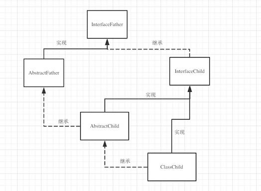

# Java基础-集合2

::: tip 此文为转载 （通常一篇文章会参考多处，也会添加自己的理解，引用地址如有遗漏，请指出）

- https://www.jianshu.com/p/407afb4a267a
- https://blog.csdn.net/shuaijunlan/article/details/51378019

:::

在[Java基础-集合1](http://heyan.site:8001/Java/JavaBasic/Java基础-集合1.html)中我们了解了整个Java集合的框架以及具体的实现类。本转载主要关注具体的源码方面的理解。


## 抽象类和接口理解

上文的最后，我们给出了”**代码的层级关系**“，这有助于我们去阅读并理解源码。但初学者一开始面对这一堆的抽象类、接口的定义，会觉得很混乱。此小节，我们稍作解释，并梳理一个最简单的关系实例来帮助理解


### 概念与对比

|          | Abstract class                                               | Interface                                                    |
| -------- | ------------------------------------------------------------ | ------------------------------------------------------------ |
| 实例化   | 不能                                                         | 不能                                                         |
| 类       | 一种继承关系，一个类只能使用一次继承关系。可以通过继承多个接口实现多重继承 | 一个类可以实现多个interface                                  |
| 数据成员 | 可有自己的                                                   | 静态的不能被修改即必须是static final，一般不在此定义         |
| 方法     | 可以私有的，非abstract方法，必须实现                         | 不可有私有的，默认是public，abstract 类型                    |
| 变量     | 可有私有的，默认是friendly 型，其值可以在子类中重新定义，也可以重新赋值 | 不可有私有的，默认是public static final 型，且必须给其初值，实现类中不能重新定义，不能改变其值。 |
| 设计理念 | 表示的是“is-a”关系                                           | 表示的是“like-a”关系                                         |
| 实现     | 需要继承，要用extends                                        | 要用implements                                               |

声明方法的存在而不去实现它的类被叫做抽象类（abstract class），它用于要创建一个体现某些基本行为的类，并为该类声明方法，但不能在该类中实现该类的情况。不能创建abstract 类的实例。然而可以创建一个变量，其类型是一个抽象类，并让它指向具体子类的一个实例。不能有抽象构造函数或抽象静态方法。Abstract 类的子类为它们父类中的所有抽象方法提供实现，否则它们也是抽象类为。取而代之，在子类中实现该方法。知道其行为的其它类可以在类中实现这些方法。

接口（interface）是抽象类的变体。在接口中，所有方法都是抽象的。多继承性可通过实现 这样的接口而获得。接口中的所有方法都是抽象的，没有一个有程序体。接口只可以定义static final成员变量。接口的实现与子类相似，除了该实现类不能从接口定义中继承行为。当类实现特殊接口时，它定义（即将程序体给予）所有这种接口的方法。 然后，它可以在实现了该接口的类的任何对象上调用接口的方法。由于有抽象类，它允许使用接口名作为引用变量的类型。通常的动态联编将生效。引用可以转换到 接口类型或从接口类型转换，instanceof 运算符可以用来决定某对象的类是否实现了接口。

接口可以继承接口。抽象类可以实现(implements)接口，抽象类是可以继承实体类，但前提是实体类必须有明确的构造函数。接口更关注“能实现什么功能”，而不管“怎么实现的”。

**1. 相同点**

- 两者都是抽象类，都不能实例化。
- interface实现类及abstrct class的子类都必须要实现已经声明的抽象方法。

**2. 不同点**

- interface需要实现，要用implements，而abstract class需要继承，要用extends。
- 一个类可以实现多个interface，但一个类只能继承一个abstract class。
- interface强调特定功能的实现，而abstract class强调所属关系。 
- 尽管interface实现类及abstrct class的子类都必须要实现相应的抽象方法，但实现的形式不同。interface中的每一个方法都是抽象方法，都只是声明的 (declaration, 没有方法体)，实现类必须要实现。而abstract class的子类可以有选择地实现。
  - 这个选择有两点含义：
    - 一是Abastract class中并非所有的方法都是抽象的，只有那些冠有abstract的方法才是抽象的，子类必须实现。那些没有abstract的方法，在Abstrct class中必须定义方法体。
    - 二是abstract class的子类在继承它时，对非抽象方法既可以直接继承，也可以覆盖；而对抽象方法，可以选择实现，也可以通过再次声明其方法为抽象的方式，无需实现，留给其子类来实现，但此类必须也声明为抽象类。既是抽象类，当然也不能实例化。
- abstract class是interface与Class的中介。<br/>interface是完全抽象的，只能声明方法，而且只能声明pulic的方法，不能声明private及protected的方法，不能定义方法体，也不能声明实例变量。然而，interface却可以声明常量变量，并且在	JDK中不难找出这种例子。但将常量变量放在interface中违背了其作为接 口的作用而存在的宗旨，也混淆了interface与类的不同价值。如果的确需要，可以将其放在相应的abstract class或Class中。<br>abstract class在interface及Class中起到了承上启下的作用。一方面，abstract class是抽象的，可以声明抽象方法，以规范子类必须实现的功能；另一方面，它又可以定义缺省的方法体，供子类直接使用或覆盖。另外，它还可以定义自己 的实例变量，以供子类通过继承来使用。

**3. interface的应用场合**

- 类与类之前需要特定的接口进行协调，而不在乎其如何实现。
- 作为能够实现特定功能的标识存在，也可以是什么接口方法都没有的纯粹标识。
- 需要将一组类视为单一的类，而调用者只通过接口来与这组类发生联系。
- 需要实现特定的多项功能，而这些功能之间可能完全没有任何联系。

**4. abstract class的应用场合**

 一句话，在既需要统一的接口，又需要实例变量或缺省的方法的情况下，就可以使用它。最常见的有：

- 定义了一组接口，但又不想强迫每个实现类都必须实现所有的接口。可以用abstract class定义一组方法体，甚至可以是空方法体，然后由子类选择自己所感兴趣的方法来覆盖。
- 某些场合下，只靠纯粹的接口不能满足类与类之间的协调，还必需类中表示状态的变量来区别不同的关系。abstract的中介作用可以很好地满足这一点。
- 规范了一组相互协调的方法，其中一些方法是共同的，与状态无关的，可以共享的，无需子类分别实现；而另一些方法却需要各个子类根据自己特定的状态来实现特定的功能。

### 简单的实例

下面这个关系模拟Arraylist。(除去最上层的Interator和最下面其他的接口)

<div style="display:flex;"></div>
```java
package com.demo;

public interface InterfaceFather {
    //接口抽象方法  （接口的方法都是public的，抽象的）
    void methodInterfaceFather();
}
```

```java
package com.demo;

public interface InterfaceChild extends InterfaceFather {
    //接口抽象方法 
    void methodInterfaceChild1();
    void methodInterfaceChild2();
}
```

```java
package com.demo;

public abstract class AbstractFather implements InterfaceFather{

    //抽象类中的抽象
    public abstract void TestAbstract();

    //抽象类中的普通方法
    public String TestAbsA(){
        return "test string in abstract father";
    }

}
```

```java
package com.demo;

public abstract class AbstractChild extends AbstractFather implements InterfaceChild {
    //可以定义新的抽象方法，需要实现类去实现
    public abstract void TestAbstractChild();
    
    //对继承的抽象类的抽象方法，可以选择实现，也可以通过再次声明其方法为抽象方法，无需实现，留给其子类来实现，但此类必须也声明为抽象类。
    //所以此处，这里写跟不写都一样。只是再次声明了一下。。。
    public abstract void TestAbstract();
    
    //对于实现的接口抽象方法，可以在此实现 - （例如，公共的方法可以在此完成，这样后面具体实现类就可以直接用了）
    //此例中对于接口的另外一个抽象方法methodInterfaceChild2()，留给后面实现类实现
    public void methodInterfaceChild1(){
        System.out.println("implement in abstract child class");
    }
    
    //可以覆盖父类的普通方法
    public String TestAbsA(){
        return "test string in abstract child";
    }
}
```

实现类

```java
package com.demo;

public class ClassChild extends AbstractChild implements InterfaceChild {

    //下面4个为必须实现的方法
    @Override
    public void TestAbstract(){

    }
    @Override
    public void TestAbstractChild(){

    }
    @Override
    public void methodInterfaceFather(){

    }
    @Override
    public void methodInterfaceChild2(){

    }

}
```


## 源码理解

内容比较多，暂时还是直接参考原文：[Java集合源码分析](https://www.jianshu.com/p/407afb4a267a)

