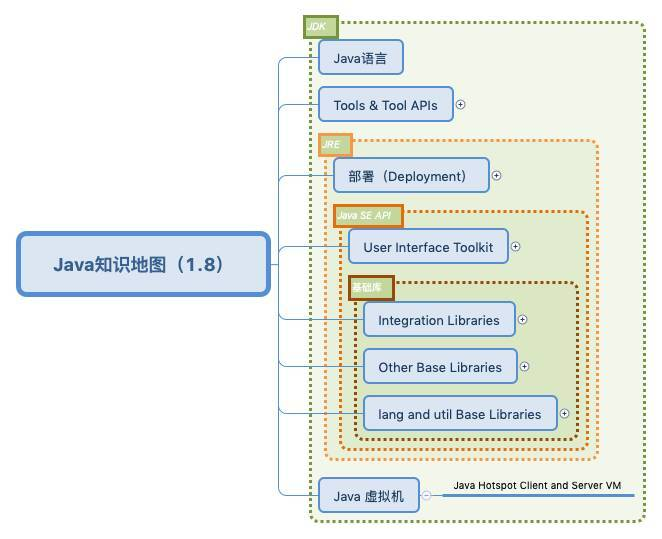
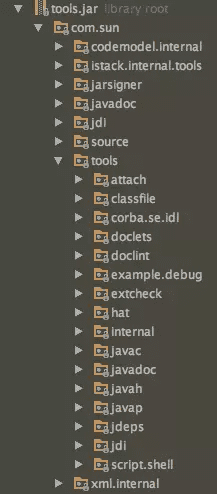

# JavaBasic

在Java Basic板块，主要会涉及一些Java编程方面的基础知识。但不会涉及特别基础的，例如语法，面向对象特性等...的知识。希望给一些学习中，或是工作中的人一点参考意义。同时，一些Java更高级的特性，例如并发等，会在专门的专题中单独阐述。


## 目录

主要知识点包括：

- [Java基础-集合1](https://heyan.site:8001/Java/JavaBasic/Java基础-集合1.html)
- [Java基础-集合2](https://heyan.site:8001/Java/JavaBasic/Java基础-集合2.html)
- [Java基础-IO流1](https://heyan.site:8001/Java/JavaBasic/Java基础-IO流1.html)
- [Java基础-IO流2](https://heyan.site:8001/Java/JavaBasic/Java基础-IO流2.html)
- [Java基础-反射](https://heyan.site:8001/Java/JavaBasic/Java基础-反射.html)
- [Java基础-注解](https://heyan.site:8001/Java/JavaBasic/Java基础-注解.html)
- [Java基础-泛型](https://heyan.site:8001/Java/JavaBasic/Java基础-泛型.html)
- [Java基础-JVM](https://heyan.site:8001/Java/JavaBasic/Java基础-JVM.html)
- ...


## Java概览

### 概览图

在学习具体topic之前，先总览以下Java，借用JSE 8的官方概念图

<div style="display:flex;"></div>

从图中可以大概看到整个JDK的框架，包括JRE、JVM等，以及它们之间的关系。

JDK = JRE + Java语言 + 工具(开发、调试、编译等的工具）<br>JRE = Jave SE API(Java标准库) + JVM + Deployment


这张图看着密密麻麻的，下面这份脑图看着更清晰一点（利用虚线框表示包含关系）

> 下图不正确的部分：
>
> **JRE 包含JVM**

<div style="display:flex;"></div>

<br />

还有Java SE API 包含了 User Interface 库 + Integration 库 + Other Base库 + Lang and util Base 库 ...<br>我们要重点研究使用的一些专题就散落在这些库中。

<br />


### **JRE、JDK、JVM 之间的区别与联系**

**JVM** ：英文名称（Java Virtual Machine），就是我们耳熟能详的 Java 虚拟机。它只认识 xxx.class 这种类型的文件，它能够将 class 文件中的字节码指令进行识别并调用操作系统向上的 API 完成动作。所以说，jvm 是 Java 能够跨平台的核心。所以，JVM对上层的Java源文件是不关心的，它关心的只是由源文件生成的类文件。

**JRE** ：英文名称（Java Runtime Environment），我们叫它：Java 运行时环境。它主要包含两个部分，jvm 的标准实现和 Java 的一些基本类库。它相对于 jvm 来说，多出来的是一部分的 Java 类库。在Java平台下，所有的Java程序都需要在JRE下才能运行。只有JVM还不能进行class的执行，因为解释class的时候，JVM需要调用解释所需要的类库lib。JRE里面有两个文件夹bin和lib，这里可以认为bin就是JVM，lib就是JVM所需要的类库，而JVM和lib合起来就称为JRE。

JRE包括JVM和JAVA核心类库与支持文件。与JDK不同，它不包含开发工具—-编译器、调试器和其它工具。

**JDK** ：英文名称（Java Development Kit），Java 开发工具包。JDK是整个JAVA的核心，包括了Java的运行环境（Java Runtime Environment）、一堆Java工具（javac、java、jdb等）和Java基础的类库（即Java API包括rt.jar）。<br>Java API是Java的应用程序接口，里面有很多已经写好的Java Class，包括一些重要的语言结构以及基本图形，网络和文件I/O等等，我们可以直接调用使用。<br>现在已经有很多版本的JDK，除了Sun公司，还有很多公司都开发了属于自己的JDK，如IBM、淘宝等。据说IBM的JDK运行效率比Sun的还要高，但是不管怎么说还是先把基础的Sun JDK学好。 

所以JDK = JRE(JVM) + Java语言 + JDK辅助工具（javac、jmap ... 等）

<br>

**总结：**

- 有JVM就可以解释执行字节码文件(.class).
- JVM解释执行这些字节码文件的时候需要调用类库，如果没有这些类库JVM就不能正确的执行字节码文件，JVM+类库=JRE,
- 有了JRE就可以正确的执行java程序了，但是光有JRE不能开发Java程序，所以JRE+开发工具=JDK，有了JDK，就可同时开发，执行JRE.

<br>

**相关知识**

>**为什么我们的电脑在装完 jdk 后会有两个版本的 jre**？
>
>> 装好后，可以看到如下两个folder<br>`/xxx/java/jre1.8.0_91`<br>`/xxx/java/jdk1.8.0_91/jre`
>
><br>
>
>JDK里面的JRE是JDK自带的为其开发工具提供运行环境的JRE，在JDK中有很多用Java编写的开发工具（如： javac.exe、jar.exe），这些工具的实现代码在JDK下面的lib目录下的tools.jar中，也就是路径：`xxx\java\jdk1.8.0_91\lib\tools.jar`里面。其实这些可执行文件只是外层的一层封装而已，这样的目的是避免输入的命令过长。例如 javac.exe 内部调用的其实是 JDK 中 lib 目录中的 tools.jar 中 `com.sun.tools.javac.Main` 类，也就是说这些工具只是入口而已。而实际上它们本身又都是由 Java 编写的，所以在 jdk 目录下的 jre 既提供了这些工具的运行时环境，也提供了我们编写完成的 Java 程序的运行时环境。
>
>JDK外面JRE直接用于为Java程序提供运行环境。
>
><br>
>
>**两个JRE的异同**
>
>- 相同点：这两个JRE都可以作为开发Java程序的运行环境。
>- 不同点：JDK自带的开发工具需要使用JDK自己目录下的JRE，不能使用JDK外面的JRE。

### **JDK目录结构**

**JDK1.8目录结构：**

```
[~]$ ls -l jdk
drwxr-xr-x 2 10 143     4096 4月   1 2016 bin
-r--r--r-- 1 10 143     3244 4月   1 2016 COPYRIGHT
drwxr-xr-x 4 10 143     4096 4月   1 2016 db
drwxr-xr-x 3 10 143     4096 4月   1 2016 include
-rwxr-xr-x 1 10 143  5092228 4月   1 2016 javafx-src.zip
drwxr-xr-x 5 10 143     4096 4月   1 2016 jre
drwxr-xr-x 5 10 143     4096 4月   1 2016 lib
-r--r--r-- 1 10 143       40 4月   1 2016 LICENSE
drwxr-xr-x 4 10 143     4096 4月   1 2016 man
-r--r--r-- 1 10 143      159 4月   1 2016 README.html
-rw-r--r-- 1 10 143      525 4月   1 2016 release
-rw-r--r-- 1 10 143 21103627 4月   1 2016 src.zip
-rwxr-xr-x 1 10 143   110114 4月   1 2016 THIRDPARTYLICENSEREADME-JAVAFX.txt
-r--r--r-- 1 10 143   177094 4月   1 2016 THIRDPARTYLICENSEREADME.txt
```

下面是其中比较重要的目录或文件的含义：

> **bin目录**：	Java工具的可执行文件，包括: java、Java编译器javac、反编译.class文件javap、密钥管理工具keytool、Java文档工具javadoc等。
>
> **COPYRIGHT文件**：	版权信息。
>
> **db目录**：	Java实现的数据库。
>
> **include目录**：	.h头文件，C语言开发时用到的头文件。比如jni.h是开发jni程序时必须引用的头文件。
>
> **lib目录**：	Java类库，我们经常看到的dt.jar和tools.jar就在这个目录下。
>
> **src.zip文件**：		Java类库源码，包括了rt.jar库中的关键部分；除了Java类库，还包含了启动器（launcher）的源码（C语言实现）。
>
> **jre目录**：	Java运行环境。


### **dt.jar和tools.jar文件作用**

**dt.jar**包含了Swing包，是运行环境的类库。目前的发展趋势是Java越来越少的用作GUI开发，所以这个类库基本不会用到了。

<div style="display:flex;"></div>

**tools.jar**是工具类库，bin目录下的可执行程序，好多都会用到这个类库。比如javac[.exe]，javadoc[.exe]等。

<div style="display:flex;"></div>

平时我们经常会将这两个文件配置到CLASSPATH的当前目录（.）后面。

``` batch
CLASSPATH=.:$JAVA_HOME/lib/dt.jar:$JAVA_HOME/lib/tools.jar
```

原因就是有些可执行程序在运行时是依赖这些类库的，比如javac[.exe]就依赖tools.jar类库的javac包。

### 其他一些知识

在JDK中有很多java编写的工具（如javac.exe, jar.exe等），这些工具的实现代码在JDK下面的lib目录下的tools.jar中。其实可执行文件只是一个路口，对jar包中的一些类进行了封装，如：javac.exe 内部调用的其实是 JDK 中 lib 目录中的 tools.jar 中 com.sun.tools.javac.Main 类。

这也是为什么我们在配置classpath的时候，经常要加两个jar包进环境变量

```java
CLASSPATH=.:$JAVA_HOME/lib/dt.jar:$JAVA_HOME/lib/tools.jar
```


