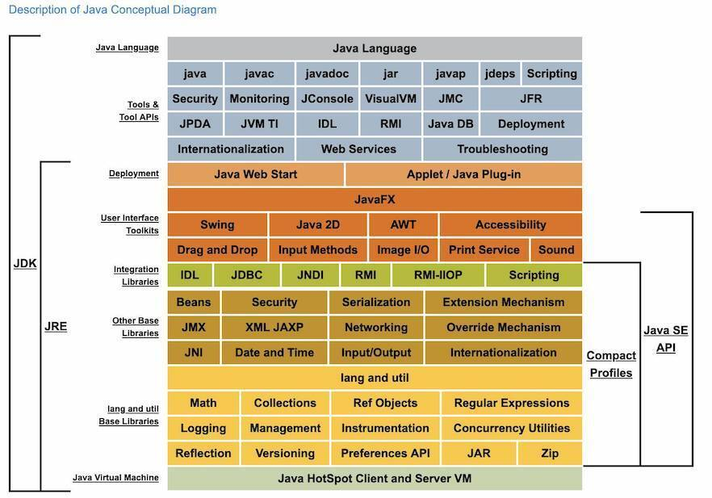

# JavaBasic

在Java Basic板块，主要会涉及一些Java编程方面的基础知识。但不会涉及特别基础的，例如语法，面向对象特性等...的知识。希望给一些学习中，或是工作中的人一点参考意义。同时，一些Java更高级的特性，例如并发等，会在专门的专题中单独阐述。


## 目录

主要知识点包括：

- [Java基础-集合1](https://heyan.site:8001/Java/JavaBasic/Java基础-集合1.html)
- [Java基础-集合2](https://heyan.site:8001/Java/JavaBasic/Java基础-集合2.html)
- [Java基础-IO流1](https://heyan.site:8001/Java/JavaBasic/Java基础-IO流1.html)
- [Java基础-IO流2](https://heyan.site:8001/Java/JavaBasic/Java基础-IO流2.html)
- [Java基础-反射](https://heyan.site:8001/Java/JavaBasic/Java基础-反射.html)
- [Java基础-注解](https://heyan.site:8001/Java/JavaBasic/Java基础-注解.html)
- [Java基础-泛型](https://heyan.site:8001/Java/JavaBasic/Java基础-泛型.html)
- [Java基础-JVM](https://heyan.site:8001/Java/JavaBasic/Java基础-JVM.html)
- ...


## Java概览

在学习具体topic之前，先总览以下Java，借用JSE 8的官方概念图

<div style="display:flex;"></div>
从图中可以大概看到整个JDK的框架，包括JRE、JVM等，以及它们之间的关系。

JDK = JRE + Java语言 + 工具(开发、调试、编译等的工具）

JRE = Jave SE API(Java标准库) + JVM

<br />

还有Java SE API 包含了 User Interface 库 + Integration 库 + Other Base库 + Lang and util Base 库 ...

我们要重点研究使用的一些专题就散落在这些库中。

<br />

#### 其他一些知识

在JDK中有很多java编写的工具（如javac.exe, jar.exe等），这些工具的实现代码在JDK下面的lib目录下的tools.jar中。其实可执行文件只是一个路口，对jar包中的一些类进行了封装，如：javac.exe 内部调用的其实是 JDK 中 lib 目录中的 tools.jar 中 com.sun.tools.javac.Main 类。

这也是为什么我们在配置classpath的时候，经常要加两个jar包进环境变量

```java
CLASSPATH=.:$JAVA_HOME/lib/dt.jar:$JAVA_HOME/lib/tools.jar
```


