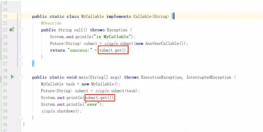

# 0 - 并发相关概念

::: tip 转

- to be add .

:::

本文介绍一些关于并发的基本概念

## 基本概念

### **同步（Synchronous）和异步（Asynchronous）**

同步和异步通常来形容一次方法调用，**同步方法调用一旦开始，调用者必须等到方法调用返回后，才能继续后续的行为**。**异步方法调用更像一个消息传递，一旦开始，方法调用就会立即返回，调用者就可以继续后续的操作**。而异步方法通常会在另外一个线程中“真实”地执行。整个过程，不会阻碍调用者的工作。

### **并发（Concurrency）和并行（Parallelism）**

并发和并行是两个非常容易被混淆的概念。他们都可以表示两个或者多个任务一起执行，但是侧重点有所不同。并发偏重于多个任务**交替**执行，而多个任务之间有可能还是串行的，而并行是真正意义上的“同时执行”。

**并发**说的是在**一个时间段内**，多件事情在这个时间段内**交替执行**。<br>**并行**说的是多件事情在**同一个时刻**同事发生。

实际上，如果系统内只有一个CPU，而使用多进程或者多线程任务，那么真实环境中这些任务不可能是真实并行的，毕竟一个CPU一次只能执行一条指令，在这种情况下多进程或者多线程就是并发的，而不是并行的（操作系统会不停地切换多任务）。真实的并行也只可能出现在拥有多个CPU的系统中（比如多核CPU）。

### **临界区**

临界区用来表示一种公共资源或者说共享数据，可以被多个线程使用，但是每一次只能有一个线程使用它，一旦临界区资源被占用，其他线程要想使用这个资源就必须等待。

比如，一个办公室里有一台打印机，打印机一次只能执行一个任务。如果小王和小明同时需要打印文件，很明显，如果小王先发了打印任务，打印机就开始打印小王的文件，小明的任务就只能等待小王打印结束后才能打印，这里的打印机就是一个临界区的例子。

在并行程序中，临界区资源是保护的对象，如果意外出现打印机同时执行两个任务的情况，那么最有可能的结果就是打印出来的文件是损坏的文件，它既不是小王想要的，也不是小明想要的。

### **阻塞（Blocking）和非阻塞（Non-Blocking）**

阻塞和非阻塞通常用来形容很多线程间的相互影响。比如一个线程占用了临界区资源，那么其他所有需要这个资源的线程就必须在这个临界区中等待。等待会导致线程挂起，这种情况就是阻塞。此时，如果占用资源的线程一直不愿意释放资源，那么其他线程阻塞在这个临界区上的线程都不能工作。

非阻塞的意思与之相反，它强调没有一个线程可以妨碍其他线程执行，所有的线程都会尝试不断向前执行。

### **死锁（Deadlock）、饥饿（Starvation）和活锁（Livelock）**

**死锁**、**饥饿**和**活锁**都属于多线程的活跃性问题。如果发现上述几种情况，那么相关线程就不再活跃，也就是说它可能很难再继续往下执行了。

**死锁**应该是最糟糕的一种情况了（当然，其他几种情况也好不到哪里去），如下图显示了一个死锁的发生：（脑补经典的图）<br>A、B、C、D四辆小车都在这种情况下都无法继续行驶了。他们彼此之间相互占用了其他车辆的车道，如果大家都不愿意释放自己的车道，那么这个状况将永远持续下去，谁都不可能通过，死锁是一个很严重的并且应该避免和实时小心的问题，后面的文章中会做更详细的讨论。

**饥饿**是指某一个或者多个线程因为种种原因无法获得所要的资源，导致一直无法执行。比如它的优先级可能太低，而高优先级的线程不断抢占它需要的资源，导致低优先级线程无法工作。在自然界中，母鸡给雏鸟喂食很容易出现这种情况：由于雏鸟很多，食物有限，雏鸟之间的事务竞争可能非常厉害，经常抢不到事务的雏鸟有可能被饿死。线程的饥饿非常类似这种情况。此外，某一个线程一直占着关键资源不放，导致其他需要这个资源的线程无法正常执行，这种情况也是饥饿的一种。于死锁想必，饥饿还是有可能在未来一段时间内解决的（比如，高优先级的线程已经完成任务，不再疯狂执行）。

**活锁**是一种非常有趣的情况。不知道大家是否遇到过这么一种场景，当你要做电梯下楼时，电梯到了，门开了，这是你正准备出去。但很不巧的是，门外一个人当着你的去路，他想进来。于是，你很礼貌地靠左走，礼让对方。同时，对方也非常礼貌的靠右走，希望礼让你。结果，你们俩就又撞上了。于是乎，你们都意识到了问题，希望尽快避让对方，你立即向右边走，同时，他立即向左边走。结果，又撞上了！不过介于人类的智慧，我相信这个动作重复两三次后，你应该可以顺利解决这个问题。因为这个时候，大家都会本能地对视，进行交流，保证这种情况不再发生。但如果这种情况发生在两个线程之间可能就不那么幸运了。如果线程智力不够。且都秉承着“谦让”的原则，主动将资源释放给他人使用，那么久会导致资源不断地在两个线程间跳动，而没有一个线程可以同时拿到所有资源正常执行。这种情况就是活锁。

#### **死锁的例子**

``` java
package com.jvm.visualvm;

/**
 * <a href="http://www.itsoku.com/archives">Java干货铺子,只生产干货，公众号：javacode2018</a>
 */
public class Demo4 {

    public static void main(String[] args) {
        Obj1 obj1 = new Obj1();
        Obj2 obj2 = new Obj2();
        Thread thread1 = new Thread(new SynAddRunalbe(obj1, obj2, 1, 2, true));
        thread1.setName("thread1");
        thread1.start();
        Thread thread2 = new Thread(new SynAddRunalbe(obj1, obj2, 2, 1, false));
        thread2.setName("thread2");
        thread2.start();
    }

    /**
     * 线程死锁等待演示
     */
    public static class SynAddRunalbe implements Runnable {
        Obj1 obj1;
        Obj2 obj2;
        int a, b;
        boolean flag;

        public SynAddRunalbe(Obj1 obj1, Obj2 obj2, int a, int b, boolean flag) {
            this.obj1 = obj1;
            this.obj2 = obj2;
            this.a = a;
            this.b = b;
            this.flag = flag;
        }

        @Override
        public void run() {
            try {
                if (flag) {
                    synchronized (obj1) {
                        Thread.sleep(100);
                        synchronized (obj2) {
                            System.out.println(a + b);
                        }
                    }
                } else {
                    synchronized (obj2) {
                        Thread.sleep(100);
                        synchronized (obj1) {
                            System.out.println(a + b);
                        }
                    }
                }
            } catch (InterruptedException e) {
                e.printStackTrace();
            }
        }
    }

    public static class Obj1 {
    }

    public static class Obj2 {
    }
}
```

运行上面代码，可以通过jstack查看到死锁信息:

```
"thread2" #13 prio=5 os_prio=0 tid=0x0000000029225000 nid=0x3c94 waiting for monitor entry [0x0000000029c9f000]
   java.lang.Thread.State: BLOCKED (on object monitor)
    at com.jvm.visualvm.Demo4$SynAddRunalbe.run(Demo4.java:50)
    - waiting to lock <0x00000007173d40f0> (a com.jvm.visualvm.Demo4$Obj1)
    - locked <0x00000007173d6310> (a com.jvm.visualvm.Demo4$Obj2)
    at java.lang.Thread.run(Thread.java:745)

   Locked ownable synchronizers:
    - None

"thread1" #12 prio=5 os_prio=0 tid=0x0000000029224800 nid=0x6874 waiting for monitor entry [0x0000000029b9f000]
   java.lang.Thread.State: BLOCKED (on object monitor)
    at com.jvm.visualvm.Demo4$SynAddRunalbe.run(Demo4.java:43)
    - waiting to lock <0x00000007173d6310> (a com.jvm.visualvm.Demo4$Obj2)
    - locked <0x00000007173d40f0> (a com.jvm.visualvm.Demo4$Obj1)
    at java.lang.Thread.run(Thread.java:745)

   Locked ownable synchronizers:
    - None
```

> thread1持有com.jvm.visualvm.Demo4\$Obj1的锁，等待获取com.jvm.visualvm.Demo4\$Obj2的锁 
>
> thread2持有com.jvm.visualvm.Demo4\$Obj2的锁，等待获取com.jvm.visualvm.Demo4​\$Obj1的锁，
>
> 两个线程相互等待获取对方持有的锁，出现死锁。

#### **饥饿死锁的例子**

``` java
package com.jvm.jconsole;

import java.util.concurrent.*;

/**
 * <a href="http://www.itsoku.com/archives">Java干货铺子,只生产干货，公众号：javacode2018</a>
 */
public class ExecutorLock {
    private static ExecutorService single = Executors.newSingleThreadExecutor();

    public static class AnotherCallable implements Callable<String> {
        @Override
        public String call() throws Exception {
            System.out.println("in AnotherCallable");
            return "annother success";
        }
    }


    public static class MyCallable implements Callable<String> {
        @Override
        public String call() throws Exception {
            System.out.println("in MyCallable");
            Future<String> submit = single.submit(new AnotherCallable());
            return "success:" + submit.get();
        }
    }

    public static void main(String[] args) throws ExecutionException, InterruptedException {
        MyCallable task = new MyCallable();
        Future<String> submit = single.submit(task);
        System.out.println(submit.get());
        System.out.println("over");
        single.shutdown();
    }
}
```

执行代码，输出：

`in MyCallable`

使用jstack命令查看线程堆栈信息:

```
"pool-1-thread-1" #12 prio=5 os_prio=0 tid=0x0000000028e3d000 nid=0x58a4 waiting on condition [0x00000000297ff000]
   java.lang.Thread.State: WAITING (parking)
    at sun.misc.Unsafe.park(Native Method)
    - parking to wait for  <0x0000000717921bf0> (a java.util.concurrent.FutureTask)
    at java.util.concurrent.locks.LockSupport.park(LockSupport.java:175)
    at java.util.concurrent.FutureTask.awaitDone(FutureTask.java:429)
    at java.util.concurrent.FutureTask.get(FutureTask.java:191)
    at com.jvm.jconsole.ExecutorLock$MyCallable.call(ExecutorLock.java:25)
    at com.jvm.jconsole.ExecutorLock$MyCallable.call(ExecutorLock.java:20)
    at java.util.concurrent.FutureTask.run(FutureTask.java:266)
    at java.util.concurrent.ThreadPoolExecutor.runWorker(ThreadPoolExecutor.java:1142)
    at java.util.concurrent.ThreadPoolExecutor$Worker.run(ThreadPoolExecutor.java:617)
    at java.lang.Thread.run(Thread.java:745)

   Locked ownable synchronizers:
    - <0x00000007173f2690> (a java.util.concurrent.ThreadPoolExecutor$Worker)

"main" #1 prio=5 os_prio=0 tid=0x00000000033e4000 nid=0x5f94 waiting on condition [0x00000000031fe000]
   java.lang.Thread.State: WAITING (parking)
    at sun.misc.Unsafe.park(Native Method)
    - parking to wait for  <0x00000007173f1d48> (a java.util.concurrent.FutureTask)
    at java.util.concurrent.locks.LockSupport.park(LockSupport.java:175)
    at java.util.concurrent.FutureTask.awaitDone(FutureTask.java:429)
    at java.util.concurrent.FutureTask.get(FutureTask.java:191)
    at com.jvm.jconsole.ExecutorLock.main(ExecutorLock.java:32)

   Locked ownable synchronizers:
    - None
```

<div style="display:flex;"></div>

堆栈信息结合图中的代码，可以看出主线程在32行处于等待中，线程池中的工作线程在25行处于等待中，等待获取结果。由于线程池是一个线程，AnotherCallable得不到执行，而被饿死，最终导致了程序死锁的现象。

## **并发级别**

由于临界区的存在，多线程之间的并发必须受到控制。根据控制并发的策略，我们可以把并发的级别分为**阻塞**、**无饥饿**、**无障碍**、**无锁**、**无等待**几种。

### **阻塞**

一个线程是阻塞的，那么在其他线程释放资源之前，当前线程无法继续执行。当我们使用synchronized关键字或者重入锁时，我们得到的就是阻塞的线程。

synchronize关键字和重入锁都试图在执行后续代码前，得到临界区的锁，如果得不到，线程就会被挂起等待，直到占有了所需资源为止。

### **无饥饿(Starvation-Free)**

如果线程之间是有优先级的，那么线程调度的时候总是会倾向于先满足高优先级的线程。也就是说，对于同一个资源的分配，是不公平的！图1.7中显示了非公平锁与公平锁两种情况(五角星表示高优先级线程)。对于非公平锁来说，系统允许高优先级的线程插队。这样有可能导致低优先级线程产生饥饿。但如果锁是公平的，按照先来后到的规则，那么饥饿就不会产生，不管新来的线程优先级多高，要想获得资源，就必须乖乖排队，这样所有的线程都有机会执行。

### **无障碍(Obstruction-Free)**

无障碍是一种最弱的非阻塞调度。两个线程如果无障碍地执行，那么不会因为临界区的问题导致一方被挂起。换言之，大家都可以大摇大摆地进入临界区了。那么大家一起修改共享数据，把数据改坏了怎么办呢？对于无障碍的线程来说，一旦检测到这种情况，它就会立即对自己所做的修改进行回滚，确保数据安全。但如果没有数据竞争发生，那么线程就可以顺利完成自己的工作，走出临界区。

如果说阻塞的控制方式是悲观策略，也就是说，系统认为两个线程之间很有可能发生不幸的冲突，因此以保护共享数据为第一优先级，相对来说，非阻塞的调度就是一种乐观的策略。它认为多个线程之间很有可能不会发生冲突，或者说这种概率不大。因此大家都应该无障碍地执行，但是一旦检测到冲突，就应该进行回滚。

从这个策略中也可以看到，无障碍的多线程程序并不一定能顺畅运行。因为当临界区中存在严重的冲突时，所有的线程可能都会不断地回滚自己的操作，而没有一个线程可以走出临界区。这种情况会影响系统的正常执行。所以，我们可能会非常希望在这一堆线程中，至少可以有一个线程能够在有限的时间内完成自己的操作，而退出临界区。至少这样可以保证系统不会在临界区中进行无限的等待。

一种可行的无障碍实现可以依赖一个"一致性标记"来实现。线程在操作之前，先读取并保存这个标记，在操作完成后，再次读取，检查这个标记是否被更改过，如果两者是一致的，则说明资源访问没有冲突。如果不一致，则说明资源可能在操作过程中与其他线程冲突，需要重试操作。而任何对资源有修改操作的线程，在修改数据前，都需要更新这个一致性标记，表示数据不再安全。

数据库中乐观锁，应该比较熟悉，表中需要一个字段version(版本号)，每次更新数据version+1，更新的时候将版本号作为条件进行更新，根据更新影响的行数判断更新是否成功，伪代码如下：

```
1.查询数据，此时版本号为w_v
2.打开事务
3.做一些业务操作
4.update t set version = version+1 where id = 记录id and version = w_v;//此行会返回影响的行数c
5.if(c>0){
        //提交事务
    }else{
        //回滚事务
    }
```

多个线程更新同一条数据的时候，数据库会对当前数据加锁，同一时刻只有一个线程可以执行更新语句。

### **无锁(Lock-Free)**

无锁的并行都是无障碍的。在无锁的情况下，所有的线程都能尝试对临界区进行访问，但不同的是，无锁的并发保证必然有一个线程能够在有限步内完成操作离开临界区。

在无锁的调用中，一个典型的特点是可能会包含一个无穷循环。在这个循环中，线程会不断尝试修改共享变量。如果没有冲突，修改成功，那么程序退出，否则继续尝试修改。但无论如何，无锁的并行总能保证有一个线程是可以胜出的，不至于全军覆没。至于临界区中竞争失败的线程，他们必须不断重试，直到自己获胜。如果运气很不好，总是尝试不成功，则会出现类似饥饿的先写，线程会停止。

下面就是一段无锁的示意代码，如果修改不成功，那么循环永远不会停止。

``` java
while(!atomicVar.compareAndSet(localVar, localVar+1)){
        localVal = atomicVar.get();
}
```

### **无等待**

无锁只要求有一个线程可以在有限步内完成操作，而无等待则在无锁的基础上更进一步扩展。它要求所有线程都必须在有限步内完成，这样不会引起饥饿问题。如果限制这个步骤的上限，还可以进一步分解为有界无等待和线程数无关的无等待等几种，他们之间的区别只是对循环次数的限制不同。

一种典型的无等待结果就是RCU(Read Copy Update)。它的基本思想是，对数据的读可以不加控制。因此，所有的读线程都是无等待的，它们既不会被锁定等待也不会引起任何冲突。但在写数据的时候，先获取原始数据的副本，接着只修改副本数据(这就是为什么读可以不加控制)，修改完成后，在合适的时机回写数据。

## **有关并行的两个重要定律**

关为什么要使用并行程序的问题前面已经进行了简单的探讨。总的来说，最重要的应该是处于两个目的。

第一，为了获得更好的性能；<br>第二，由于业务模型的需要，确实需要多个执行实体。

在这里，我将更加关注第一种情况，也就是有关性能的问题。将串行程序改造为并发程序，一般来说可以提高程序的整体性能，但是究竟能提高多少，甚至说究竟是否真的可以提高，还是一个需要研究的问题。目前，主要有两个定律对这个问题进行解答，一个是Amdahl定律，另外一个是Gustafson定律。

> 具体定律内容可查看相关资料。