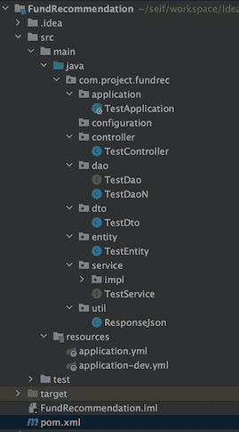
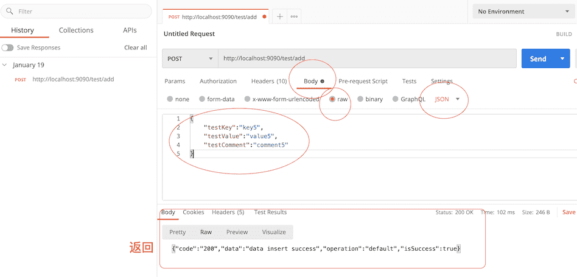
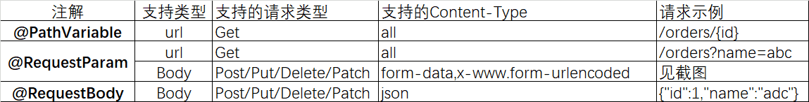

# Spring Boot 系列 1

看完本文，应该可以开发完整的Spring Boot项目，更多功能可以参考[系列 2](/DevLanguage/Java/Spring/SpringBoot2.html)。


::: tip 项目文件介绍部分转载自

- [https://blog.csdn.net/qq_40147863/article/details/84194493](https://blog.csdn.net/qq_40147863/article/details/84194493)

:::


Spring Boot 是由 Pivotal 团队提供的全新框架。Spring Boot 是所有基于 Spring Framework 5.0 开发的项目的起点。Spring Boot 的设计是为了让你尽可能快的跑起来 Spring 应用程序并且尽可能减少你的配置文件。

**设计目的：** 用来简化新 Spring 应用的初始搭建以及开发过程。

从最根本上来讲，Spring Boot 就是一些库的集合，它能够被任意项目的构建系统所使用。它使用 “习惯优于配置” （项目中存在大量的配置，此外还内置一个习惯性的配置）的理念让你的项目快速运行起来。用大佬的话来理解，就是 spring boot 其实不是什么新的框架，它默认配置了很多框架的使用方式，就像 maven 整合了所有的 jar 包，spring boot 整合了所有的框架，总结一下及几点：

- 为所有 Spring 开发提供一个更快更广泛的入门体验。
- 零配置。无冗余代码生成和XML 强制配置，遵循“约定大于配置” 。
- 集成了大量常用的第三方库的配置， Spring Boot 应用为这些第三方库提供了几乎可以零配置的开箱即用的能力。
- 提供一系列大型项目常用的非功能性特征，如嵌入式服务器、安全性、度量、运行状况检查、外部化配置等。
- Spring Boot 不是Spring 的替代者，Spring 框架是通过 IOC 机制来管理 Bean 的。Spring Boot 依赖 Spring 框架来管理对象的依赖。Spring Boot 并不是Spring 的精简版本，而是为使用 Spring 做好各种产品级准备

**Spring Boot 在应用中的角色**

- Spring Boot 是基于 Spring Framework 来构建的，Spring Framework 是一种 J2EE 的框架
- Spring Boot 快速构建 Spring 应用
- Spring Cloud 是构建 Spring Boot 分布式环境，也就是常说的云应用
- Spring Boot 中流砥柱，承上启下 `Spring Framework` -> `Spring Boot ` -> `Spring Cloud`


## Spring Boot项目文件介绍

### **解析 pom.xml 文件**

1）让我们来看看默认生成的 pom.xml 文件中到底有些什么：

``` xml
<?xml version="1.0" encoding="UTF-8"?>
<project xmlns="http://maven.apache.org/POM/4.0.0" xmlns:xsi="http://www.w3.org/2001/XMLSchema-instance"
         xsi:schemaLocation="http://maven.apache.org/POM/4.0.0 http://maven.apache.org/xsd/maven-4.0.0.xsd">
    <modelVersion>4.0.0</modelVersion>

    <groupId>com.xpwi</groupId>
    <artifactId>springboot</artifactId>
    <version>0.0.1-SNAPSHOT</version>
    <packaging>jar</packaging>

    <name>springboot</name>
    <description>Demo project for Spring Boot</description>

    <parent>
        <groupId>org.springframework.boot</groupId>
        <artifactId>spring-boot-starter-parent</artifactId>
        <version>2.1.0.RELEASE</version>
        <relativePath/> <!-- lookup parent from repository -->
    </parent>

    <properties>
        <project.build.sourceEncoding>UTF-8</project.build.sourceEncoding>
        <project.reporting.outputEncoding>UTF-8</project.reporting.outputEncoding>
        <java.version>1.8</java.version>
    </properties>

    <dependencies>
        <dependency>
            <groupId>org.springframework.boot</groupId>
            <artifactId>spring-boot-starter-web</artifactId>
        </dependency>

        <dependency>
            <groupId>org.springframework.boot</groupId>
            <artifactId>spring-boot-starter-test</artifactId>
            <scope>test</scope>
        </dependency>
    </dependencies>

    <build>
        <plugins>
            <plugin>
                <groupId>org.springframework.boot</groupId>
                <artifactId>spring-boot-maven-plugin</artifactId>
            </plugin>
        </plugins>
    </build>


</project>

```

2）我们可以看到一个比较陌生一些的标签 ，这个标签是在配置 Spring Boot 的父级依赖

```xml
<parent>
  	<groupId>org.springframework.boot</groupId>
  	<artifactId>spring-boot-starter-parent</artifactId>
  	<version>2.1.0.RELEASE</version>
  	<relativePath/> <!-- lookup parent from repository -->
</parent>
```

有了这个，当前的项目才是 Spring Boot 项目，spring-boot-starter-parent 是一个特殊的 starter ，它用来提供相关的 Maven 默认依赖，使用它之后，常用的包依赖就可以省去 version 标签。

> 关于具体 Spring Boot 提供了哪些 jar 包的依赖，我们可以查看本地 Maven 仓库下：\repository\org\springframework\boot\spring-boot-dependencies\2.1.0.RELEASE\spring-boot-dependencies-2.1.0.RELEASE.pom 文件来查看

### **应用入口类 SpringbootApplication.java**

Spring Boot 项目通常有一个名为 `*Application` 的入口类，入口类里有一个 main 方法， 这个 main 方法其实就是一个标准的 Java 应用的入口方法。

**@SpringBootApplication** 是 Spring Boot 的核心注解，它是一个组合注解，该注解组合了：**@Configuration**、**@EnableAutoConfiguration、@ComponentScan；** 若不是用 **@SpringBootApplication** 注解也可以使用这三个注解代替。

- 其中，**@EnableAutoConfiguration 让 Spring Boot 根据类路径中的 jar 包依赖为当前项目进行自动配置**，例如，添加了 spring-boot-starter-web 依赖，会自动添加 Tomcat 和 Spring MVC 的依赖，那么 Spring Boot 会对 Tomcat 和 Spring MVC 进行自动配置。
- **Spring Boot 还会自动扫描 @SpringBootApplication 所在类的同级包以及下级包里的 Bean** ，所以入口类建议就配置在 grounpID + arctifactID 组合的包名下（这里为 com.xpwi.springboot 包）

### **Spring Boot 的配置文件**

Spring Boot 使用一个全局的配置文件 `application.properties` 或 `application.yml`，放置在`【src/main/resources】`目录或者类路径的 `/config` 下。

> Spring Boot 不仅支持常规的 properties 配置文件，还支持 yaml 语言的配置文件。yaml 是以数据为中心的语言，在配置数据的时候具有面向对象的特征。

Spring Boot 的全局配置文件的作用是对一些默认配置的配置值进行修改。

> 在配置文件中设置的属性，我们可以在类中使用`@Value`来获取


## Spring Boot项目实例

`Test`项目，使用Springboot搭建restful api接口（供前端项目直接调用），数据接入使用`Mybatis`，数据库使用`mysql`，其他使用到了`lombok`，`fastjson`

### 项目结构

<div style="display:flex;"></div>

### 实例代码

0. 准备数据库，插入测试数据

   ```sql
   CREATE TABLE `TEST` (
     `TEST_KEY` varchar(100) CHARACTER SET utf8 COLLATE utf8_general_ci DEFAULT NULL,
     `TEST_VALUE` varchar(100) CHARACTER SET utf8 COLLATE utf8_general_ci DEFAULT NULL,
     `TEST_COMMENT` varchar(100) CHARACTER SET utf8 COLLATE utf8_general_ci DEFAULT NULL
   ) ENGINE=InnoDB DEFAULT CHARSET=utf8
   ;
   
   insert into Test values('key1','value1','comment1');
   insert into Test values('key2','value2','comment2');
   commit;
   ```

   

1. 创建Maven工程，引入相应的包

   ``` xml
   <?xml version="1.0" encoding="UTF-8"?>
   <project xmlns="http://maven.apache.org/POM/4.0.0"
            xmlns:xsi="http://www.w3.org/2001/XMLSchema-instance"
            xsi:schemaLocation="http://maven.apache.org/POM/4.0.0 http://maven.apache.org/xsd/maven-4.0.0.xsd">
       <modelVersion>4.0.0</modelVersion>
   
       <groupId>site.heyan.projects</groupId>
       <artifactId>FundRecommendation</artifactId>
       <version>1.0-SNAPSHOT</version>
   
       <properties>
           <maven.compiler.source>8</maven.compiler.source>
           <maven.compiler.target>8</maven.compiler.target>
       </properties>
   		<!-- 继承父包 -->
       <parent>
           <groupId>org.springframework.boot</groupId>
           <artifactId>spring-boot-starter-parent</artifactId>
           <version>2.4.2</version>
       </parent>
   
       <dependencies>
           <!-- web启动jar -->
           <dependency>
               <groupId>org.springframework.boot</groupId>
               <artifactId>spring-boot-starter-web</artifactId>
           </dependency>
           <!-- test包 -->
           <dependency>
               <groupId>org.springframework.boot</groupId>
               <artifactId>spring-boot-starter-test</artifactId>
           </dependency>
         	<!-- 此处因为后面使用到了mybatis 会包含jdbc包，所以实际可以不引入 -->
           <dependency>
               <groupId>org.springframework.boot</groupId>
               <artifactId>spring-boot-starter-jdbc</artifactId>
           </dependency>
         	<!-- lombok -->
           <dependency>
               <groupId>org.projectlombok</groupId>
               <artifactId>lombok</artifactId>
               <version>1.18.6</version>
               <scope>provided</scope>
           </dependency>
           <dependency>
               <groupId>mysql</groupId>
               <artifactId>mysql-connector-java</artifactId>
               <version>8.0.16</version>
           </dependency>
         	<!-- mybatis -->
           <dependency>
               <groupId>org.mybatis.spring.boot</groupId>
               <artifactId>mybatis-spring-boot-starter</artifactId>
               <version>2.1.3</version>
           </dependency>
         	<!-- fastjson -->
           <dependency>
               <groupId>com.alibaba</groupId>
               <artifactId>fastjson</artifactId>
               <version>1.2.73</version>
           </dependency>
       </dependencies>
   
   </project>
   ```

2. 配置数据库连接池

   - 创建application.yml

     ```yaml
     spring:
       profiles:
         active: dev
     ```

   - 创建application-dev.yml 

     > 分环境（dev / production）

     ```yaml
     server:
       port: 9090
     
     Spring:
       datasource:
         driver-class-name: com.mysql.cj.jdbc.Driver
         url: jdbc:mysql://localhost:3307/FundRecommendation?useUnicode=true&characterEncoding=UTF-8&zeroDateTimeBehavior=convertToNull&allowMultiQueries=true
         username: root
         password: root
         hikari:
           connection-timeout: 20000 #maximum number of milliseconds that a client will wait for a connection
           minimum-idle: 10 #minimum number of idle connections maintained by HikariCP in a connection pool
           maximum-pool-size: 10 #maximum pool size
           idle-timeout: 10000 #maximum idle time for connection
           max-lifetime: 1000 #maximum lifetime in milliseconds of a connection in the pool after it is closed.
           auto-commit: true #default auto-commit behavior.
     ```

3. 创建实体类Entity

   ```java
   package com.project.fundrec.entity;
   
   import lombok.AllArgsConstructor;
   import lombok.Data;
   import lombok.NoArgsConstructor;
   
   @Data
   @AllArgsConstructor
   @NoArgsConstructor
   public class TestEntity {
       private String testKey;
       private String testValue;
       private String testComment;
   }
   ```

4. 创建数据传输对象 - DTO层

   > 这里利用fastjson，预定义`toJson()`方法返回`JSONObject`对象

   ``` java
   package com.project.fundrec.dto;
   
   import lombok.Data;
   import com.alibaba.fastjson.JSONObject;
   
   @Data
   public class TestDto {
       private String testKey;
       private String testValue;
       private String testComment;
   
       public static final String LABEL_TEST_KEY = "testKey";
       public static final String LABEL_TEST_VALUE = "testValue";
       public static final String LABEL_TEST_COMMENT = "testComment";
   
       public JSONObject toJson(){
           JSONObject jsonObject = new JSONObject();
           jsonObject.put(LABEL_TEST_KEY, getTestKey());
           jsonObject.put(LABEL_TEST_VALUE, getTestValue());
           jsonObject.put(LABEL_TEST_COMMENT, getTestComment());
   
           return jsonObject;
       }
   }
   ```

5. 创建DAO层

   （实际使用中，我们会直接使用Mybatis开发。这里为了学习目的，我们首先尝试直接操作数据库）

   - 未使用Mybatis框架

     ``` java
     package com.project.fundrec.dao;
     
     import com.project.fundrec.entity.TestEntity;
     import org.springframework.beans.factory.annotation.Autowired;
     import org.springframework.stereotype.Repository;
     
     import javax.sql.DataSource;
     import java.sql.*;
     import java.util.HashMap;
     import java.util.Map;
     
     @Repository
     public class TestDaoN {
         /**
          * Native DAO class - with directly call JDBC
          * - Alternatively, we will use Mybatis for this
          * - Please check TestDao
          */
     
         /** Field injection is not recommended */
         //      @Autowired
         //      private DataSource dataSource; //hikariCP
     
         /** Autowired - Spring recommends “Always use constructor based dependency injection in your beans. */
         /**             Always use assertions for mandatory dependencies” */
         private DataSource dataSource;
         /** option 1 - constructor injection */
         //      @Autowired
         //      public TestDao(DataSource dataSource) {
         //          this.dataSource = dataSource;
         //      }
         /** option 2 - setter injection */
         @Autowired
         public void setDataSource(DataSource dataSource) {
             this.dataSource = dataSource;  //使用setter方法注入dataSource 
             //（这里使用配置好的hikari连接池中的datasource来直接获取连接 - 具体连接池的知识，参考JavaBasic中相关专题）
         }
     
         private void close(ResultSet rs, Statement stmt, Connection conn){
             if(rs!=null) try{rs.close();} catch(Exception e){e.printStackTrace();}
             if(stmt!=null) try{stmt.close();} catch(Exception e){e.printStackTrace();}
             //这里的连接是返回到了池中
             if(conn!=null) try{conn.close();} catch(Exception e){e.printStackTrace();}
         }
     
         public Map<Integer,Object> findAll() {
     
             Connection conn = null;   //java.sql.*
             Statement stmt = null;
             ResultSet rs = null;
     
             String sql = "select * from Test";
     
             try {
                 //1.获取连接(从连接池获取)
                 conn = dataSource.getConnection();
                 //2.创建statement对象
                 stmt = conn.createStatement();
                 //3.发送sql
                 rs = stmt.executeQuery(sql);
                 //4.处理结果
                 Map<Integer, Object> map=new HashMap<>();
                 Integer mapI = 1;
                 while (rs.next()) {
                     // getString(String columnName)-------------根据列名获取本列的值；
                     // getString(int index)--------------根据索引获取指定位置的值；
                     // example:     System.out.println("key" + "\t" + rs.getString(1));
                     map.put(
                             mapI, new TestEntity(
                             rs.getString("TEST_KEY"),
                             rs.getString("TEST_VALUE"),
                             rs.getString("TEST_COMMENT")
                     ));
                     mapI++;
                 }
                 return map;
             } catch (SQLException e) {
                 e.printStackTrace();
                 throw new RuntimeException(e); //转换为非检查异常(编译时不检测的异常)
             } finally {
                 //5. 释放资源
                 close(rs, stmt, conn);
             }
         }
     }
     ```

   - 使用Mybatis框架

     ``` java
     package com.project.fundrec.dao;
     
     import com.project.fundrec.entity.TestEntity;
     import org.apache.ibatis.annotations.Insert;
     import org.apache.ibatis.annotations.Param;
     import org.apache.ibatis.annotations.Select;
     import org.springframework.stereotype.Repository;
     
     import java.util.List;
     
     @Repository
     public interface TestDao {
         @Select("SELECT TEST_KEY testKey,TEST_VALUE testValue,TEST_COMMENT testComment " +
                 "FROM TEST")
         List<TestEntity> getAll();
     
         @Select("SELECT TEST_KEY testKey,TEST_VALUE testValue,TEST_COMMENT testComment  " +
                 "FROM TEST " +
                 "WHERE TEST_KEY = #{testKey}")
         List<TestEntity> getTestByKey(@Param("testKey") String testKey);
     
         @Insert("INSERT INTO TEST (TEST_KEY,TEST_VALUE,TEST_COMMENT) " +
                 "VALUES (#{testKey}, #{testValue}, #{testComment})")
         int addTest(TestEntity testEntity) throws Exception;
     }
     ```

6. 创建Service 接口 / Service Implementation类

   ```java
   package com.project.fundrec.service;
   
   import com.project.fundrec.dto.TestDto;
   import java.util.List;
   
   public interface TestService {
   
       // get all records
       public List<TestDto> getAll();
   
       // get record by key
       public  List<TestDto> getTestByKey(String testKey);
   
       // add record
       boolean addTest(TestDto testDto) throws Exception;
   }
   ```

   ```java
   package com.project.fundrec.service.impl;
   
   import org.springframework.beans.BeanUtils;
   import org.springframework.beans.factory.annotation.Autowired;
   import org.springframework.stereotype.Repository;
   import com.project.fundrec.dao.TestDao;
   import com.project.fundrec.dto.TestDto;
   import com.project.fundrec.entity.TestEntity;
   import com.project.fundrec.service.TestService;
   import org.springframework.transaction.annotation.Transactional;
   
   import java.util.ArrayList;
   import java.util.List;
   
   @Repository
   public class TestServiceImpl implements TestService {
   
       private TestDao testDao;
       /* setter injection - replace @Autowired as recommended */
       @Autowired
       public void setTestDao(TestDao testDao) {
           this.testDao = testDao;
       }
   
       @Override
       public List<TestDto> getAll() {
           List<TestDto> result = new ArrayList<>();
           List<TestEntity> testEntityList = testDao.getAll();
           testEntityList.forEach(item -> {
               TestDto dto = new TestDto();
               BeanUtils.copyProperties(item, dto);
               result.add(dto);
           });
   
           return result; //返回 dto list
       }
   
       @Override
       public List<TestDto> getTestByKey(String testKey) {
           List<TestDto> result = new ArrayList<>();
           List<TestEntity> testEntityList = testDao.getTestByKey(testKey);
           testEntityList.forEach(item -> {
               TestDto dto = new TestDto();
               BeanUtils.copyProperties(item, dto);
               result.add(dto);
           });
   
           return result;
       }
   
       @Override
       @Transactional(rollbackFor = Exception.class)
       public boolean addTest(TestDto testDto) throws Exception {
           TestEntity testEntity = new TestEntity();
           BeanUtils.copyProperties(testDto, testEntity);
   
           return testDao.addTest(testEntity) > 0;
       }
   }
   ```

7. 创建controller层 / Util类

   (通常在项目初始时，规划需要使用的工具类。)

   <br />

   - Util 类 - ResponseJson

   由于我们最终是需要创建供前台使用的restful api结构，而对于insert/update/delete等方法，通常返回int/boolen格式。所以需要有一个公共的处理方法能够将所有的返回到前台的数据最终都被封装成json格式。

   ```java
   package com.project.fundrec.util;
   
   import java.io.Serializable;
   import java.util.HashMap;
   
   public class ResponseJson extends HashMap<String, Object> implements Serializable {
   
       private static final String KEY_OP = "operation";
       private static final String KEY_SUCC = "isSuccess";
       private static final String KEY_CODE = "code";
       private static final String KEY_DATA = "data";
   
       private static final String DEF_OP = "default";
       private static final boolean DEF_SUCCESS = true;
       private static final boolean DEF_FAIL = false;
       private static final String SUCC_CODE = "200";
       private static final String FAIL_CODE = "500";
   
       public ResponseJson(){
           this.put(KEY_OP, DEF_OP);
           this.put(KEY_SUCC, DEF_SUCCESS);
           this.put(KEY_CODE, SUCC_CODE);
       }
   
       public ResponseJson(Object data){
           this();
           this.put(KEY_DATA, data);
       }
   }
   
   ```

   <br />

   - 具体controller类

   > JSON数组语法规则
   >
   > - JSONArray 最外层是“[”和“]”包裹起来的：如`[{"domain":"sojson.com"}]`。
   > - JSONArray 是由一个或多个 JSONObject 组合起来的：如`[{"domain":"sojson.com"},{"age":"5年"}]`。
   > - 多个 JSONObject 由逗号分隔。
   > - JSONArray 取值通过下标或者迭代获取每一个element：如`[{"domain":"sojson.com"},{"age":"5年"}][0].domain`。

   ```java
   package com.project.fundrec.controller;
   
   import com.alibaba.fastjson.JSONArray;
   import com.alibaba.fastjson.JSONObject;
   import com.alibaba.fastjson.serializer.SerializerFeature;
   import com.project.fundrec.dto.TestDto;
   import com.project.fundrec.service.TestService;
   import com.project.fundrec.util.ResponseJson;
   import org.springframework.beans.factory.annotation.Autowired;
   import org.springframework.web.bind.annotation.*;
   
   import java.util.List;
   
   @RestController
   @RequestMapping("/test")
   public class TestController {
   
       JSONArray jsonArray = new JSONArray();
   
       /* constructor injection - replace @Autowired as recommended */
       private final TestService testService;
       @Autowired
       public TestController(TestService testService) {
           this.testService = testService;
       }
   
       @GetMapping("/welcom")
       public String Welcome(){
           String message = "Welcome !";
           ResponseJson responseJson = new ResponseJson(message);
           return new JSONObject(responseJson).toString();
       }
   
       @GetMapping("/getAll")
       public String getAll(){
           List<TestDto> testDtoList = testService.getAll();
   
         	jsonArray.clear();
           testDtoList.forEach(item -> jsonArray.add(item.toJson())); //将JSONObject对象插入JSONArray数组
           String arrayJson = JSONArray.toJSONString(jsonArray, SerializerFeature.WriteMapNullValue);
   
           JSONObject jsonObject = new JSONObject(new ResponseJson(arrayJson));
           return jsonObject.toString();
       }
   
       @RequestMapping(value = "/key/{testKey}", method = {RequestMethod.GET})
       public String getTestByKey(@PathVariable String testKey){
           List<TestDto> testDtoList = testService.getTestByKey(testKey);
   
         	jsonArray.clear();
           testDtoList.forEach(item -> jsonArray.add(item.toJson()));
           String arrayJson = JSONArray.toJSONString(jsonArray, SerializerFeature.WriteMapNullValue);
   
           JSONObject jsonObject = new JSONObject(new ResponseJson(arrayJson));
           return jsonObject.toString();
       }
   
       @RequestMapping(value = "/add", method = {RequestMethod.POST})
       public String addTest(@RequestBody TestDto testDto) throws Exception{
           boolean result = testService.addTest(testDto);
   
           // will replace with common Asset function
           if (!result) {
               throw new Exception("data insert failed"); // will replace with common Exception function
           }
   
           String message = "data insert success";
           ResponseJson responseJson = new ResponseJson(message);
           return new JSONObject(responseJson).toString();
       }
   }
   ```

   > Note: <font color=blue>实际使用中，需要创建公共的Exception 和 Assert 断言类。</font>

8. 启动类

   ```java
   package com.project.fundrec.application;
   
   import org.mybatis.spring.annotation.MapperScan;
   import org.springframework.boot.SpringApplication;
   import org.springframework.boot.autoconfigure.SpringBootApplication;
   import org.springframework.context.annotation.ComponentScan;
   
   @SpringBootApplication
   @ComponentScan("com.project.fundrec")
   @MapperScan("com.project.fundrec.dao")
   public class TestApplication {
       public static void main(String[] args) {
           try {
               SpringApplication.run(TestApplication.class, args);
           }catch (Throwable e){
               e.printStackTrace();
           }
       }
   }
   
   ```

### 测试

**GET测试**

我们输入网址 

```
http://localhost:9090/test/welcome
http://localhost:9090/test/getAll
http://localhost:9090/test/key/key2
```

分别得到结果

```
{"code":"200","data":"Welcome !","operation":"default","isSuccess":true}
```

```
{"code":"200","data":"[{\"testComment\":\"comment1\",\"testKey\":\"key1\",\"testValue\":\"value1\"},{\"testComment\":\"comment2\",\"testKey\":\"key2\",\"testValue\":\"value2\"},{\"testComment\":\"comment3\",\"testKey\":\"key3\",\"testValue\":\"value3\"},{\"testComment\":\"comment4\",\"testKey\":\"key4\",\"testValue\":\"value4\"},{\"testComment\":\"comment1\",\"testKey\":\"key1\",\"testValue\":\"value1\"},{\"testComment\":\"comment2\",\"testKey\":\"key2\",\"testValue\":\"value2\"},{\"testComment\":\"comment3\",\"testKey\":\"key3\",\"testValue\":\"value3\"},{\"testComment\":\"comment4\",\"testKey\":\"key4\",\"testValue\":\"value4\"},{\"testComment\":\"comment5\",\"testKey\":\"key5\",\"testValue\":\"value5\"}]","operation":"default","isSuccess":true}
```

```
{"code":"200","data":"[{\"testComment\":\"comment2\",\"testKey\":\"key2\",\"testValue\":\"value2\"}]","operation":"default","isSuccess":true}
```

**POST测试**

使用Postman

<div style="display:flex;"></div>

## @RequestParam @RequestBody @PathVariable的作用

::: tip 部分内容引用

- [https://www.xjyili.cn/3415.html](https://www.xjyili.cn/3415.html)

:::

上面实例中`Controller`层使用到了`@PathVariable`,`@RequestBody`来接收参数，这里做个总结。

<div style="display:flex;"></div>

<br />

### @PathVariable

`@PathVariable`接收绑定在路由上的参数，如上面的`/key/{testKey}`

```java {1,2}
@RequestMapping(value = "/key/{testKey}", method = {RequestMethod.GET})
    public String getTestByKey(@PathVariable String testKey){
        List<TestDto> testDtoList = testService.getTestByKey(testKey);

      	jsonArray.clear();
        testDtoList.forEach(item -> jsonArray.add(item.toJson()));
        String arrayJson = JSONArray.toJSONString(jsonArray, SerializerFeature.WriteMapNullValue);

        JSONObject jsonObject = new JSONObject(new ResponseJson(arrayJson));
        return jsonObject.toString();
    }
```

这里`getTestByKey`的`参数名`必须和`路由变量`同名，即`testKey`，如果想要不一致，可以给`@PathVariable`加上`name`属性，如：

```java {2}
@RequestMapping(value = "/key/{testKey}", method = {RequestMethod.GET})
    public String getTestByKey(@PathVariable(name = "testKey") String key){
        List<TestDto> testDtoList = testService.getTestByKey(testKey);

      	jsonArray.clear(); 
      	testDtoList.forEach(item -> jsonArray.add(item.toJson()));
        String arrayJson = JSONArray.toJSONString(jsonArray, SerializerFeature.WriteMapNullValue);

        JSONObject jsonObject = new JSONObject(new ResponseJson(arrayJson));
        return jsonObject.toString();
    }
```

### @RequestParam

对于GET方法，`@RequestParam`和`@PathVariable`的区别就在于参数是在url路由上还是在请求的body上，修改上面代码

``` java
    @RequestMapping(value = "/key", method = {RequestMethod.GET})
    public String getTestByKey(@RequestParam(value = "keyParameter", required=true) String testKey){
        List<TestDto> testDtoList = testService.getTestByKey(testKey);

        jsonArray.clear();
        testDtoList.forEach(item -> jsonArray.add(item.toJson()));
        String arrayJson = JSONArray.toJSONString(jsonArray, SerializerFeature.WriteMapNullValue);

        JSONObject jsonObject = new JSONObject(new ResponseJson(arrayJson));
        return jsonObject.toString();
    }
```

此时，访问url需要变成：

`http://localhost:9090/test/key?keyParameter=key2`

如开头总结所述，事实上，`@RequestParam`同样支持Body类型，支持RequestMethod.POST。

```java
//示例 - 参考下面Order示例代码 - POST非json格式数据

/**
*
* 若后端使用@RequestParam 来接收前端传过来的参数的，Content-Type要设置为 application/x-www-form-urlencoded，
* (并且需要对data使用qs.stringify来进行转换 ?)；
* 
* 若后端使用@RequestBody 来接收前端传过来的参数的，Content-Type要设置为 application/json;
*
*/

```

### @RequestBody

`@RequestBody`能把简单`json`结构参数转换成实体类，如：

``` java
    @RequestMapping(value = "/add", method = {RequestMethod.POST})
    public String addTest(@RequestBody TestDto testDto) throws Exception{
        boolean result = testService.addTest(testDto);

        // will replace with common Asset function
        if (!result) {
            throw new Exception("data insert failed"); // will replace with common Exception function
        }

        String message = "data insert success";
        ResponseJson responseJson = new ResponseJson(message);
        return new JSONObject(responseJson).toString();
    }
```

### 实例总结

springboot 获取接口请求中的参数(@PathVariable，@RequestParam，@RequestBody)

Order：

```java
package com.example.demo.controller.user.entity;

public class Order {
    private Integer id;
    private String name;
    private Integer price;

    public Integer getId() {
        return id;
    }

    public void setId(Integer id) {
        this.id = id;
    }

    public String getName() {
        return name;
    }

    public void setName(String name) {
        this.name = name;
    }

    public Integer getPrice() {
        return price;
    }

    public void setPrice(Integer price) {
        this.price = price;
    }
}
```

orderController

```java
package com.example.demo.controller.user.controller;

import com.example.demo.controller.user.entity.Order;
import org.springframework.web.bind.annotation.*;

@RestController
public class OrderController {

    /**
     * Get请求的参数可以通过@PathVariable和@RequestParam获取
     * @param id 必填
     * @param name 必填
     * @param price 选填，默认值为0
     * @return
     */
    @GetMapping("/orders/{id}")
    public String getOrder(@PathVariable(value = "id")Integer id,
                           @RequestParam(value = "name")String name,
                           @RequestParam(value = "price",required = false,defaultValue = "0") Integer price){
        String result = "id:"+id+",name:"+name+",price:"+price;
        return result;
    }

    /**
     * Post使用@RequestBody注解将Json格式的参数自动绑定到Entity类
     * @param order
     * @return
     */
    @PostMapping("/order/check")
    public String checkOrder(@RequestBody Order order){
        String result = "id:"+order.getId()+",name:"+order.getName()+",price:"+order.getPrice();
        return result;
    }

    /**
     * Post使用@RequestParam获取请求体中非Json格式的数据
     * @param amount
     * @param discount
     * @return
     */
    @PostMapping("/order/checkmore")
    public String checkMore(@RequestParam(value = "amount")Integer amount, @RequestParam(value = "discount")float discount){
        String result = "amount:"+amount+",discount:"+discount;
        return result;
    }

    /**
     * Post请求也可以直接与对象类绑定，但需要参数名一致，不支持json格式，只支持form-data和x-www.form-urlencoded格式
     * @param order
     * @return
     */
    @PostMapping("/order/add")
    public String addOrder(Order order){
        String result = "id:"+order.getId()+",name:"+order.getName()+",price:"+order.getPrice();
        return result;
    }

    /**
     * Put请求可以直接与对象类绑定，但需要参数名一致
     * @param id
     * @param order
     * @return
     */
    @PutMapping("/order/{id}/update")
    public String updateOrder(@PathVariable(value = "id")Integer id,Order order){
        String result = "pathid:"+id+"===Order(id:"+order.getId()+",name:"+order.getName()+",price:"+order.getPrice()+")";
        return result;
    }

}
```

**注意点：**

1.针对一些非必填的参数，可以使用required关键字来标识，同时必须设置默认值defaultValue,如getOrder方法中对price参数的获取：

```java
@RequestParam(value = "price",required = false,defaultValue = "0") Integer price
```

2.参数可以直接与Entity类绑定，但不支持json格式，只支持form-data和x-www.form-urlencoded格式

```java
@PostMapping("/order/add")
public String addOrder(Order order){
```

**部分测试：**

```
# get url:
http://localhost:8080/orders/123?name=abc&price=2

# 结果
> id:123,name:abc,price:2
```

