# Spring Framework 运行原理

::: tip 转载参考

- [https://blog.csdn.net/song_jiangtao/article/details/79949633](https://blog.csdn.net/song_jiangtao/article/details/79949633)

<br />

:::

## **Spring运行原理图**

<div style="display:flex;">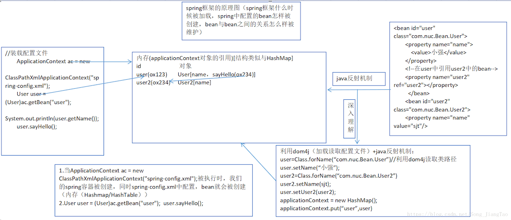</div>


**什么是spring ?**

- **spring是一个容器框架，它可以接管web层，业务层，dao层，持久层的各个组件，并且可以配置各种bean， 并可以维护bean与bean的关系，当我们需要使用某个bean的时候，我们可以直接getBean(id)，使用即可**

## 接口编程实例

- **spring就提倡接口编程，在配合di技术就可以达到层与层解耦的目的**
- 举案例说明： <br />这个项目实现的是**大小写转换** <br />**基本思路：**
  - 创建一个接口
  - 创建两个类实现接口
  - 配置bean
  - 使用

下面是项目目录

<div style="display:flex;">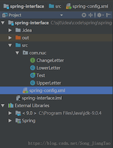</div>

**ChangeLetter.java**

``` java
package com.nuc;

public interface ChangeLetter {
    public String change();
}
```

**LowerLetter.java**

``` java
package com.nuc;

public class LowerLetter implements ChangeLetter {
    private String str;

    public String getStr() {
        return str;
    }

    public void setStr(String str) {
        this.str = str;
    }

    public String change(){
        //大小字母转小写
        return str.toLowerCase();
    }
}
```

**UpperLetter.java**

``` java
package com.nuc;

public class UpperLetter implements ChangeLetter {
    private String str;

    public String getStr() {
        return str;
    }

    public void setStr(String str) {
        this.str = str;
    }

    public String change(){
        //把小写字母转成大写
       return str.toUpperCase();
    }
}
```

**spring-config.xml**

> 说明：**其中的两个bean id名相同是为了调试方便，可通过注释来调试** 

``` xml
<?xml version="1.0" encoding="UTF-8"?>
<beans xmlns="http://www.springframework.org/schema/beans"
       xmlns:xsi="http://www.w3.org/2001/XMLSchema-instance"
       xsi:schemaLocation="http://www.springframework.org/schema/beans
       http://www.springframework.org/schema/beans/spring-beans.xsd">
    <!--<bean id="changeLetter" class="com.nuc.UpperLetter">-->
        <!--<property name="str">-->
            <!--<value>sjt</value>-->
        <!--</property>-->
    <!--</bean>-->

    <bean id="changeLetter" class="com.nuc.LowerLetter">
        <property name="str" value="SJT"/>
    </bean>
</beans>
```

**Test.java**

``` java
package com.nuc;

import org.springframework.context.ApplicationContext;
import org.springframework.context.support.ClassPathXmlApplicationContext;

public class Test {
    public static void main(String[] args) {
        ApplicationContext ac = new ClassPathXmlApplicationContext("spring-config.xml");
        //调用change不使用接口
//        UpperLetter changeLetter = (UpperLetter) ac.getBean("changeLetter");
//        System.out.println(changeLetter.change());

        //使用接口
        ChangeLetter changeLetter = (ChangeLetter)ac.getBean("changeLetter");
        System.out.println(changeLetter.change());
    }
}
```

以上这个案例，我们可以初步体会到，di和接口编程，可以减少层（web层）和层（业务层）之间的耦合度

## **获取Bean的方法**

- **ApplicationContext 应用上下文容器取**

  `ApplicationContext ac = new ClassPathXmlApplicationContext("spring-config.xml");`

  当这句代码被执行，spring-config.xml文件中配置的bean就会被实例化。（但要注意bean的生命周期要为singleton），也就是说，不管没有getBean()，使用上下文容器获取bean，就会实例化该bean

- **Bean工厂容器取**

  `BeanFactory factory = new XmlBeanFactory(new ClassPathResource("spring-config.xml"));`

  这句代码被执行，spring-config.xml文件中配置的bean不会被实例化，即光实例化容器，并不会实例化bean <br />而是在执行以下代码时才会被实例化，即使用bean的时候：

  `factory.getBean("beanId");`

  如何验证上述说法呢？每一个java类都有一个默认的构造方法。给这个构造方法输出一句话。**具体如下**：

  - 创建一个类，类有一个属性，装配，该属性
  - 重写该类的构造方法，输出bean被创建
  - 创建测试类，测试

> **使用ApplicationContext应用上下文容器** 

<div style="display:flex;">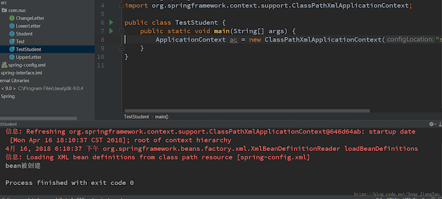</div>

> **使用bean工厂** 

<div style="display:flex;">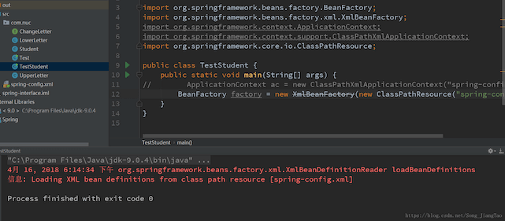</div>

可以看到，这一行代码，并不能时bean实例化，接下来加`factory.getBean(“student”)`;试试 

<div style="display:flex;">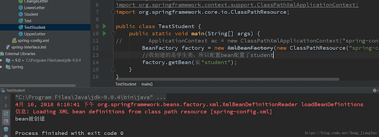</div>

这样就是bean实例化了

**那么在实际开发中选择哪种方式？**

在移动开发中，即项目运行在移动设备中使用BeanFactory（节约内存，所以，你想节约内存开发就是使用bean工厂，但速度会受影响），但大部分的项目都是使用ApplicationContext（可以提前加载，缺点是消耗一点内存） 

## **三种获取ApplicationContext对象引用的方法**

- **ClassPathXmlApplicationContext （从类路径中加载）** 
  - 这个不在赘述，上面所有例子都是利用这种方式加载的
- **FileSystemXmlApplicationContext （从文件系统中加载）**

<div style="display:flex;">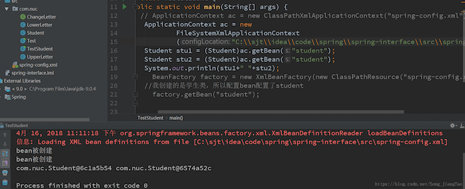</div>

可以看到是没有问题的，需要注意的是，文件路径为绝对路径，且注意使用转义符，直接使用`“C:\sjt\idea\code\spring\spring-interface\src”`，会报错，需要将`“\”`转义，但实际开发中应用不多，了解即可

- **XmlWebApplicationContext** **（从web系统中加载）**
  - 这种方式，注意，在tomcat启动时就会加载，此处不做说明，在web应用中说明

## **Bean的生命周期详解**

生命周期是一个重点吗？答案是肯定的！！<br />不了解生命周期难道不能开发了吗？那自然是可以的，但如果你想实现更加高级的功能，你不了解那可能是会出问题的！而在面试过程中也是经常提及的。

**生命周期分为以下几步：**

1. **实例化** <br />当我们加载sping-config.xml文件时，bean就会被实例化到内存（前提是scope=singleton）
2. **设置属性值** <br />调用set方法设置属性，前提是有对应的set方法
3. **如果你调用BeanNameAware的set’Bean’Name()方法** <br />这是个接口，该方法可以给出正在被调用的bean的id
4. **如果你调用BeanFactoryAware的setBeanFactory()方法** <br />这也是个接口，该方法可以传递beanFactory
5. **如果你调用了ApplicationContextAeare的setApplicationContext()方法** <br />同样为接口，该方法传递一个ApplicationContext
6. **BeanPostProcessor的预初始化方法Before** <br />这个东西很厉害了，可以叫做后置处理器，它不是接口，具体细节，代码体现
7. **如果你调用了InitializingBean的afterPropertiesSet()方法**
8. **调用自己的init方法，具体为在bean中有一个属性inin-method=”init”**
9. **BeanPostProcessor的方法After**
10. **使用bean，体现为调用了sayHi()方法**
11. **容器关闭**
12. **可以实现DisposableBean接口的destory方法**
13. **可以在调用自己的销毁方法，类似于8**

实际开发过程中，并没有这么复杂，常见过程为，**1，2，6，9，10，11**<br />实例代码：

<div style="display:flex;">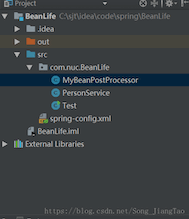</div>

> **MyBeanPostProcessor.java** 

``` java
package com.nuc.BeanLife;

import org.springframework.beans.BeansException;
import org.springframework.beans.factory.config.BeanPostProcessor;

public class MyBeanPostProcessor implements BeanPostProcessor {
    @Override
    public Object postProcessAfterInitialization(Object bean, String beanName) throws BeansException {
        System.out.println("第九步，postProcessAfterInitialization方法被调用");
        return null;
    }

    @Override
    public Object postProcessBeforeInitialization(Object bean, String beanName) throws BeansException {
        System.out.println("第六步，postProcessBeforeInitialization方法被调用");
        System.out.println("第六步，"+bean+"被创建的时间为"+new java.util.Date());
        /*
        在这里，能做的事情可就不止上面的这么简单的一句输出了，它还可以过滤每个对象的ip
        还可以给所有对象添加属性或者函数，总之就是所有对象！
        其实，这里体现了AOP编程的思想，AOP呢就是面向切成编程（针对所有对象编程）
         */

        return null;
    }
}
```

> **PersonService.java**

``` java
package com.nuc.BeanLife;

import org.springframework.beans.BeansException;
import org.springframework.beans.factory.*;
import org.springframework.context.ApplicationContext;
import org.springframework.context.ApplicationContextAware;

public class PersonService implements BeanNameAware,BeanFactoryAware,ApplicationContextAware,InitializingBean,DisposableBean{
    private String name;

    public String getName() {
        return name;
    }

    public void setName(String name) {
        this.name = name;
        System.out.println("第二步调用set方法");
    }
    public void sayHi(){
        System.out.println("第十步，hi"+ name);
    }
    public PersonService(){
        System.out.println("第一步，实例化bean");
    }
    @Override
    public void setBeanName(String arg0){
        //该方法可以给出正在被调用的bean的id
        System.out.println("第三步，setBeanName被调用，调用的id名为："+arg0);
    }

    @Override
    public void setBeanFactory(BeanFactory beanFactory) throws BeansException {
        //该方法可以传递beanFactory
        System.out.println("第四步，setBeanFactory被调用，beanFactory为："+beanFactory);
    }

    @Override
    public void setApplicationContext(ApplicationContext applicationContext) throws BeansException {
        //该方法传递一个ApplicationContext
        System.out.println("第五步，调用setApplicationContext方法："+applicationContext);
    }

    @Override
    public void afterPropertiesSet() throws Exception {
        System.out.println("第七步，调用afterPropertiesSet()方法");
    }
    public void init(){
        System.out.println("第八步、调用我自己的init()方法");
    }

    @Override
    public void destroy() throws Exception {
        //关闭数据连接，socket，文件流，释放资源
        //这个函数的打印你看不到，应为
        System.out.println("第十步，销毁方法（但不建议使用这种方式释放资源）");
    }
    public void destory(){
				//也看到不
        System.out.println("销毁");
    }
}
```

> **Test.java**

``` java
package com.nuc.BeanLife;

import org.springframework.context.ApplicationContext;
import org.springframework.context.support.ClassPathXmlApplicationContext;

public class Test {
    public static void main(String[] args) {
        ApplicationContext ac = new ClassPathXmlApplicationContext("spring-config.xml");
        PersonService person1= (PersonService) ac.getBean("personService");
        person1.sayHi();
    }
}
```

> **spring-config.xml**

``` xml
<?xml version="1.0" encoding="UTF-8"?>
<beans xmlns="http://www.springframework.org/schema/beans"
       xmlns:xsi="http://www.w3.org/2001/XMLSchema-instance"
       xsi:schemaLocation="http://www.springframework.org/schema/beans http://www.springframework.org/schema/beans/spring-beans.xsd">
    <bean id="personService" init-method="init" destroy-method="destroy" scope="singleton" class="com.nuc.BeanLife.PersonService">
        <property name="name" value="sjt"></property>
    </bean>
    <bean id="personService2" class="com.nuc.BeanLife.PersonService">
        <property name="name" value="sjt2"></property>
    </bean>
    <!--配置自己的后置处理器，优点类似filter-->
    <bean id="myBeanPostProcessor" class="com.nuc.BeanLife.MyBeanPostProcessor">

    </bean>
</beans>
```

> **测试结果**

``` 
信息: Loading XML bean definitions from class path resource [spring-config.xml]
第一步，实例化bean
第二步调用set方法
第三步，setBeanName被调用，调用的id名为：personService
第四步，setBeanFactory被调用，beanFactory为：org.springframework.beans.factory.support.DefaultListableBeanFactory@ae13544: defining beans [personService,personService2,myBeanPostProcessor]; root of factory hierarchy
第五步，调用setApplicationContext方法：org.springframework.context.support.ClassPathXmlApplicationContext@646d64ab: startup date [Tue Apr 17 16:57:26 CST 2018]; root of context hierarchy
第六步，postProcessBeforeInitialization方法被调用
第六步，com.nuc.BeanLife.PersonService@2e6a8155被创建的时间为Tue Apr 17 16:57:27 CST 2018
第七步，调用afterPropertiesSet()方法
第八步、调用我自己的init()方法
第九步，postProcessAfterInitialization方法被调用
第一步，实例化bean
第二步调用set方法
第三步，setBeanName被调用，调用的id名为：personService2
第四步，setBeanFactory被调用，beanFactory为：org.springframework.beans.factory.support.DefaultListableBeanFactory@ae13544: defining beans [personService,personService2,myBeanPostProcessor]; root of factory hierarchy
第五步，调用setApplicationContext方法：org.springframework.context.support.ClassPathXmlApplicationContext@646d64ab: startup date [Tue Apr 17 16:57:26 CST 2018]; root of context hierarchy
第六步，postProcessBeforeInitialization方法被调用
第六步，com.nuc.BeanLife.PersonService@6221a451被创建的时间为Tue Apr 17 16:57:27 CST 2018
第七步，调用afterPropertiesSet()方法
第九步，postProcessAfterInitialization方法被调用
第十步，hisjt
```

**使用bean工厂获取bean对象，生命周期是和上下文获取的不一样的，如下图** 

<div style="display:flex;">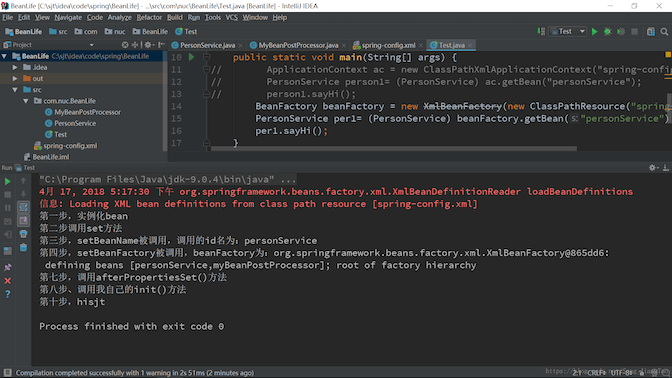</div>

> 其中只装配了一个bean，可见执行步骤的短缺

## **装配Bean**

**使用xml装配**

- **上下文定义文件的根元素是`<beans></beans>`，有多个子元素`<bean></bean>`，每个`<bean>`元素定义了bean如何被装配到spring容器中**
- **对子元素bean最基本的配置包括bean的ID和它的全称类名**
- **对bean的`scope`装配，默认情况下为单例模式，具体情况上面已经说过，建议查看文档，更加具体，尽量不要使用原型bean，即`scope`设置为`propotype`，这样子会对性能有较大的影响**
- **bean的`init-method`和`destory-method`的书写，在生命周期那一块儿已经很清楚了，此处不再赘述，需要说明的是，可以通过注解的方式来配置，而不是在bean中使用`init-method`和`destory-method`属性** 

<div style="display:flex;">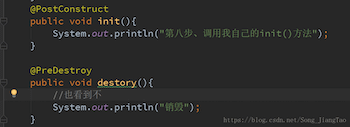</div>

- **注入集合类型的数据，例如，map，set，list，数组，Properties….**

> 举例: **目录结构**

<div style="display:flex;">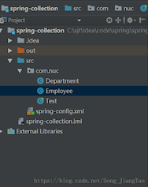</div>

> **Department.java**

``` java
package com.nuc;

import java.util.List;
import java.util.Map;
import java.util.Set;

public class Department {
    private String name;
    private String []empName;//这里int的数组也可以注入成功
    private List<Employee> empList;
    private Map<String,Employee> empMap;
    private Properties pp;

    public Properties getPp() {
        return pp;
    }

    public void setPp(Properties pp) {
        this.pp = pp;
    }

    public Set<Employee> getEmpSet() {
        return empSet;
    }

    public void setEmpSet(Set<Employee> empSet) {
        this.empSet = empSet;
    }

    private Set<Employee> empSet;
    public List<Employee> getEmpList() {
        return empList;
    }

    public void setEmpList(List<Employee> empList) {
        this.empList = empList;
    }

    public String getName() {
        return name;
    }

    public void setName(String name) {
        this.name = name;
    }

    public String[] getEmpName() {
        return empName;
    }

    public void setEmpName(String[] empName) {
        this.empName = empName;
    }

    public Map<String, Employee> getEmpMap() {
        return empMap;
    }

    public void setEmpMap(Map<String, Employee> empMap) {
        this.empMap = empMap;
    }
}
```

> **Employee.java**

``` java
package com.nuc;

public class Employee {
    private String name;

    public String getName() {
        return name;
    }

    public void setName(String name) {
        this.name = name;
    }
}
```

> **Test.java**

``` java
package com.nuc;

import org.springframework.context.ApplicationContext;
import org.springframework.context.support.ClassPathXmlApplicationContext;

import java.util.Iterator;
import java.util.Map;
import java.util.Map.Entry;

public class Test {
    public static void main(String[] args) {
        ApplicationContext ac = new ClassPathXmlApplicationContext("spring-config.xml");
        Department department = (Department)ac.getBean("department");
        System.out.println(department.getName());
//        取集合
        for(String empName:department.getEmpName()){
            System.out.println(empName);
        }
        System.out.println("取list...");
        for (Employee e:department.getEmpList()){
            System.out.println("name="+e.getName());
        }
        System.out.println("取set...");
        for (Employee e:department.getEmpSet()){
            System.out.println("name="+e.getName());
        }
        System.out.println("迭代器取map...");
        //1.迭代器
        Map<String,Employee> employeeMap = department.getEmpMap();
        Iterator iterator = employeeMap.keySet().iterator();
        while (iterator.hasNext()){
            String key = (String)iterator.next();
            Employee employee=employeeMap.get(key);
            System.out.println("key="+key+" "+ employee.getName());
        }
        System.out.println("entry取map...");
        //2.简洁(建议使用这种方式)
        for (Entry<String,Employee> entry:department.getEmpMap().entrySet()){
            System.out.println(entry.getKey()+" "+entry.getValue().getName());
        }
    }
    System.out.println("通过properties取数据");
    Properties properties = department.getPp();
    for (Entry<Object,Object> entry:properties.entrySet()){
        System.out.println(entry.getKey().toString()+" "+entry.getValue());
    }
}
```

> **spring-config.xml**

``` xml
<?xml version="1.0" encoding="UTF-8"?>
<beans xmlns="http://www.springframework.org/schema/beans"
       xmlns:xsi="http://www.w3.org/2001/XMLSchema-instance"
       xsi:schemaLocation="http://www.springframework.org/schema/beans http://www.springframework.org/schema/beans/spring-beans.xsd">
    <bean id="department" class="com.nuc.Department">
        <property name="name" value="财务部"></property>

        <!--给数组注入-->
        <property name="empName">
            <list>
                <value>小明</value>
                <value>小花</value>
            </list>
        </property>

        <!--给list注入-->
        <!--list可以存放相同的对象，并当作不同对象输出-->
        <property name="empList">
            <list>
                <ref bean="employee1"></ref>
                <ref bean="employee2"></ref>
            </list>
        </property>

        <!--给set注入-->
        <!--set集合不可以存放相同对象-->
        <property name="empSet">
            <set>
                <ref bean="employee1"></ref>
                <ref bean="employee2"></ref>
            </set>
        </property>

        <!--给map注入-->
        <!--输出的对象取决于key值，key值不同，对象相同也可以打出-->
        <!--当key值相同时，对象相同或者不同都打出最后一个key所对应的对象-->
        <property name="empMap">
            <map>
                <entry key="1" value-ref="employee1"></entry>
                <entry key="2" value-ref="employee2"></entry>
                <entry key="3" value-ref="employee2"></entry>
            </map>
        </property>
        <!--给属性集合注入-->
        <property name="pp">
            <props>
                <prop key="1">hello</prop>
                <prop key="2">world</prop>
            </props>
        </property>
    </bean>

    <bean id="employee1" class="com.nuc.Employee">
        <property name="name" value="北京"></property>
    </bean>
    <bean id="employee2" class="com.nuc.Employee">
        <property name="name" value="太原"></property>
    </bean>
</beans>
```

测试结果：

<div style="display:flex;">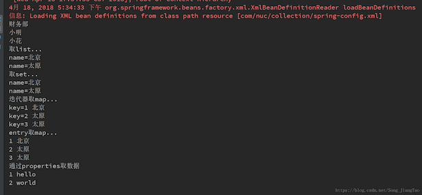</div>

- **内部bean**
  - 具体自行了解，实际中应用不多，不符合重用度高的原则
- **继承配置bean**
  - 举例如下，结构图：

<div style="display:flex;">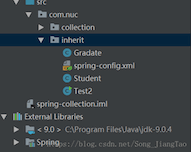</div>

> **Student.java**

``` java
package com.nuc.inherit;

public class Student {
    protected String name;
    protected int age;

    public String getName() {
        return name;
    }

    public void setName(String name) {
        this.name = name;
    }

    public int getAge() {
        return age;
    }

    public void setAge(int age) {
        this.age = age;
    }
}
```

> **Gradate.java**

``` java
package com.nuc.inherit;

public class Gradate extends Student {
    private String degree;

    public String getDegree() {
        return degree;
    }

    public void setDegree(String degree) {
        this.degree = degree;
    }
}
```

> **spring-config.xml**

``` xml
<?xml version="1.0" encoding="UTF-8"?>
<beans xmlns="http://www.springframework.org/schema/beans"
       xmlns:xsi="http://www.w3.org/2001/XMLSchema-instance"
       xsi:schemaLocation="http://www.springframework.org/schema/beans http://www.springframework.org/schema/beans/spring-beans.xsd">
    <!--配置一个学生对象-->
    <bean id="student" class="com.nuc.inherit.Student">
        <property name="name" value="sjt"></property>
        <property name="age" value="22"></property>
    </bean>
    <!--配置gradate对象-->
    <bean id="gradate" parent="student" class="com.nuc.inherit.Gradate">
        <!--如果子类重新赋值，则覆盖父类的-->
        <property name="name" value="小明"></property>
        <property name="degree" value="博士"></property>
    </bean>
</beans>
```

> **Test2.java**

``` java
package com.nuc.inherit;

import org.springframework.context.ApplicationContext;
import org.springframework.context.support.ClassPathXmlApplicationContext;

public class Test2 {
    public static void main(String[] args) {
        ApplicationContext ac = new ClassPathXmlApplicationContext("com/nuc/inherit/spring-config.xml");
        Gradate gradate = (Gradate) ac.getBean("gradate");
        System.out.println(gradate.getName()+" "+gradate.getAge()+" "+gradate.getDegree());
    }
}
```

结果：

```
小明 22 博士
```

- **以上我们都是用set注入依赖的，下面介绍构造函数注入依赖**

``` xml
<bean name="user" class="com.nuc.Bean.User">
    <!--通过constructor-arg标签完成了对构造方法的传参-->
    <!--如果是属性是类类型，则使用ref=""-->
    <constructor-arg index="0" type="java.lang.String" value="小强"></constructor-arg>
    <constructor-arg index="1" type="java.lang.String" value="男"></constructor-arg>
    <constructor-arg index="2" type="int" value="20"></constructor-arg>
</bean>
```

当然对应的User要有相应的构造方法。 

**set注入的缺点是无法清晰的表达哪个属性是必须的，哪些是可选的，构造器注入的优势，是可以通过构造强制依赖关系，不可能实例化不完全或者不能使用的bean**

**但其实实际开发中还是set注入较多，即property注入**

- **bean的自动装配：**

<div style="display:flex;">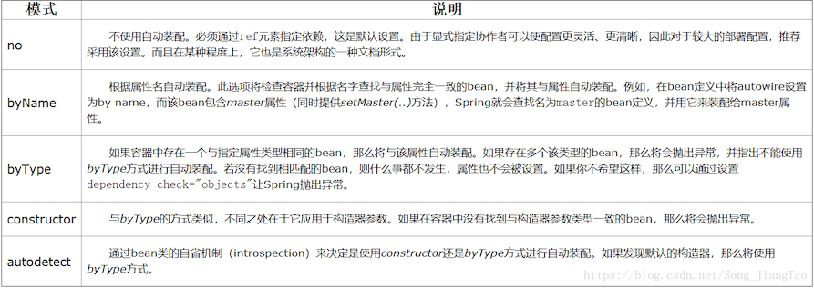</div>

实例:

<div style="display:flex;">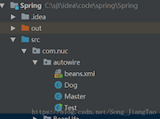</div>

> **Dog.java**

``` java
package com.nuc.autowire;

public class Dog {
    private String name;
    private int age;

    public String getName() {
        return name;
    }

    public void setName(String name) {
        this.name = name;
    }

    public int getAge() {
        return age;
    }

    public void setAge(int age) {
        this.age = age;
    }
}
```

> **Master.java**

``` java
package com.nuc.autowire;

public class Master {
    private String name;
    private Dog dog;

    private Master(Dog dog){
        //为了自动装配的constructor
        this.dog= dog;
    }

    public String getName() {
        return name;
    }

    public void setName(String name) {
        this.name = name;
    }

    public Dog getDog() {
        return dog;
    }

    public void setDog(Dog dog) {
        this.dog = dog;
    }
}
```

> **Test.java**

``` java
package com.nuc.autowire;

import org.springframework.context.ApplicationContext;
import org.springframework.context.support.ClassPathXmlApplicationContext;

public class Test {
    public static void main(String[] args) {
        ApplicationContext ac = new ClassPathXmlApplicationContext("com\\nuc\\autowire\\beans.xml");
        Master master = (Master)ac.getBean("master");
        System.out.println(master.getName()+"养了只狗，它的名字叫"+ master.getDog().getName()+"，他今年"+master.getDog().getAge()+"岁了");
    }
}
```

> **beans.xml**

``` xml
<?xml version="1.0" encoding="UTF-8"?>
<beans xmlns="http://www.springframework.org/schema/beans"
       xmlns:xsi="http://www.w3.org/2001/XMLSchema-instance"
       xsi:schemaLocation="http://www.springframework.org/schema/beans http://www.springframework.org/schema/beans/spring-beans.xsd">
    <!--配置master对象-->
    <bean id="master" class="com.nuc.autowire.Master" autowire="constructor">
        <property name="name" value="sjt"></property>
        <!--传统方式-->
        <!--<property name="dog" ref="dog"></property>-->
    </bean>

    <!--配置dog对象，byName时使用-->
    <!--<bean id="dog" class="com.nuc.autowire.Dog">-->
        <!--<property name="name" value="小黄"></property>-->
        <!--<property name="age" value="2"></property>-->
    <!--</bean>-->

    <!--配置dog对象，byType时使用-->
    <!--<bean id="dog11" class="com.nuc.autowire.Dog">-->
        <!--<property name="name" value="小黄"></property>-->
        <!--<property name="age" value="2"></property>-->
    <!--</bean>-->

    <!--配置dog对象，constructor时使用-->
    <bean id="dog22" class="com.nuc.autowire.Dog">
        <property name="name" value="小黄"></property>
        <property name="age" value="2"></property>
    </bean>
</beans>
```

autodetect:是在constructor和byType之间选一种<br />default：这种方式在文档中没有提及，需要在beans中指定，当你在beans中指定以后，所有的bean都是你所指定的装配方式，如果没有指定，则默认为no，所以，no之所以为默认指定装配方式，其实是从beans那里来的 

**其实在实际开发中，很少用到自动装配， 一般都是手动set装配的（property），而且自动装配也是在bean中没有配置才取执行自动装配的**

