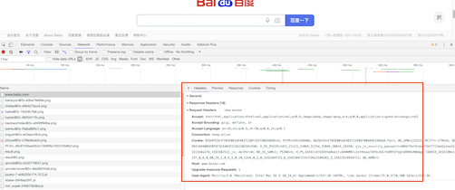

# Python 爬虫概述

::: tip 此文为转载 （通常一篇文章会参考多处，也会添加自己的理解，引用地址如有遗漏，请指出）

- https://www.cnblogs.com/sthu/p/8850110.html
- https://cuiqingcai.com/

:::


## 爬虫的基本流程

**发起请求**
通过HTTP库向目标站点发起请求，也就是发送一个Request，请求可以包含额外的header等信息，等待服务器响应

**获取响应内容**
如果服务器能正常响应，会得到一个Response，Response的内容便是所要获取的页面内容，类型可能是HTML,Json字符串，二进制数据（图片或者视频）等类型

**解析内容**
得到的内容可能是HTML,可以用正则表达式，页面解析库进行解析，可能是Json,可以直接转换为Json对象解析，可能是二进制数据，可以做保存或者进一步的处理

**保存数据**
保存形式多样，可以存为文本，也可以保存到数据库，或者保存特定格式的文件


## 什么是Request,Response

浏览器发送消息给网址所在的服务器，这个过程就叫做HTPP Request<br>服务器收到浏览器发送的消息后，能够根据浏览器发送消息的内容，做相应的处理，然后把消息回传给浏览器，这个过程就是HTTP Response;浏览器收到服务器的Response信息后，会对信息进行相应的处理，然后展示

### Request中包含什么？

#### **请求方式**

主要有：GET/POST两种类型常用，另外还有HEAD/PUT/DELETE/OPTIONS；<br>GET和POST的区别就是：请求的数据GET是在url中，POST则是存放在头部

- GET:向指定的资源发出“显示”请求。使用GET方法应该只用在读取数据，而不应当被用于产生“副作用”的操作中，例如在Web Application中。其中一个原因是GET可能会被网络蜘蛛等随意访问
- POST:向指定资源提交数据，请求服务器进行处理（例如提交表单或者上传文件）。数据被包含在请求本文中。这个请求可能会创建新的资源或修改现有资源，或二者皆有。
- HEAD：与GET方法一样，都是向服务器发出指定资源的请求。只不过服务器将不传回资源的本文部分。它的好处在于，使用这个方法可以在不必传输全部内容的情况下，就可以获取其中“关于该资源的信息”（元信息或称元数据）。
- PUT：向指定资源位置上传其最新内容。
- OPTIONS：这个方法可使服务器传回该资源所支持的所有HTTP请求方法。用'*'来代替资源名称，向Web服务器发送OPTIONS请求，可以测试服务器功能是否正常运作。
- DELETE：请求服务器删除Request-URI所标识的资源。

#### **请求URL**

URL，即统一资源定位符，也就是我们说的网址，统一资源定位符是对可以从互联网上得到的资源的位置和访问方法的一种简洁的表示，是互联网上标准资源的地址。互联网上的每个文件都有一个唯一的URL，它包含的信息指出文件的位置以及浏览器应该怎么处理它。

URL的格式由三个部分组成：

- 协议(或称为服务方式)。
- 存有该资源的主机IP地址(有时也包括端口号)。
- 主机资源的具体地址，如目录和文件名等。

```txt {10}
# 借用nodejs中URL模块中的一张图：
┌────────────────────────────────────────────────────────────────────────────────────────────────┐
│                                              href                                              │
├──────────┬──┬─────────────────────┬────────────────────────┬───────────────────────────┬───────┤
│ protocol │  │        auth         │          host          │           path            │ hash  │
│          │  │                     ├─────────────────┬──────┼──────────┬────────────────┤       │
│          │  │                     │    hostname     │ port │ pathname │     search     │       │
│          │  │                     │                 │      │          ├─┬──────────────┤       │
│          │  │                     │                 │      │          │ │    query     │       │
"  https:   //    user   :   pass   @ sub.example.com : 8080   /p/a/t/h  ?  query=string   #hash "
│          │  │          │          │    hostname     │ port │          │                │       │
│          │  │          │          ├─────────────────┴──────┤          │                │       │
│ protocol │  │ username │ password │          host          │          │                │       │
├──────────┴──┼──────────┴──────────┼────────────────────────┤          │                │       │
│   origin    │                     │         origin         │ pathname │     search     │ hash  │
├─────────────┴─────────────────────┴────────────────────────┴──────────┴────────────────┴───────┤
│                                              href                                              │
└────────────────────────────────────────────────────────────────────────────────────────────────┘
```

#### **请求头**

包含请求时的头部信息，如User-Agent,Host,Cookies等信息，下图是请求请求百度时，所有的请求头部信息参数

<div style="display:flex;"></div>

#### 请求体

请求时携带的数据，如提交表单数据时候的表单数据（POST）

### Response中包含了什么

所有HTTP响应的第一行都是状态行，依次是当前HTTP版本号，3位数字组成的状态代码，以及描述状态的短语，彼此由空格分隔。

#### 响应状态

有多种响应状态，如：200代表成功，301跳转，404找不到页面，502服务器错误

- 1xx消息——请求已被服务器接收，继续处理
- 2xx成功——请求已成功被服务器接收、理解、并接受
- 3xx重定向——需要后续操作才能完成这一请求
- 4xx请求错误——请求含有词法错误或者无法被执行
- 5xx服务器错误——服务器在处理某个正确请求时发生错误 常见代码： 200 OK 请求成功 400 Bad Request 客户端请求有语法错误，不能被服务器所理解 401 Unauthorized 请求未经授权，这个状态代码必须和WWW-Authenticate报头域一起使用 403 Forbidden 服务器收到请求，但是拒绝提供服务 404 Not Found 请求资源不存在，eg：输入了错误的URL 500 Internal Server Error 服务器发生不可预期的错误 503 Server Unavailable 服务器当前不能处理客户端的请求，一段时间后可能恢复正常 301 目标永久性转移 302 目标暂时性转移

#### 响应头

如内容类型，类型的长度，服务器信息，设置Cookie 等... 看法如上面request header

#### 响应体

最主要的部分，包含请求资源的内容，如网页HTMl,图片，二进制数据等


## Python爬虫主要知识点

**1	请求 -** Urllib / **Requests**

**2	解析 -** **BeautifulSoup**库 / **XPath** / **正则表达式** / PyQuery / Json解析 (如果返回的是Json数据)...

**3	解决javascript渲染的问题** - **Selenium库** / 分析ajax / Splash / PyV8...

**4	Advanced -** **动态代理池** **/** **动态Cookies池 ...**

**5	框架 -** **PySpider** **/** **Scrapy**

**6	其他 -** 验证码 ... 

**7	数据保存 -** 文本：纯文本，Json,Xml等<br>		关系型数据库：如mysql,oracle,sql server等结构化数据库<br>		非关系型数据库：MongoDB,Redis等key-value形式存储


<style scoped>
    h4{
        color: #00578a;
    }
</style>