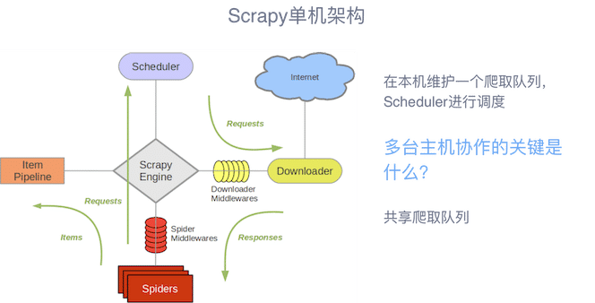
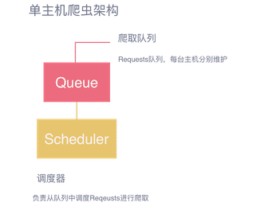
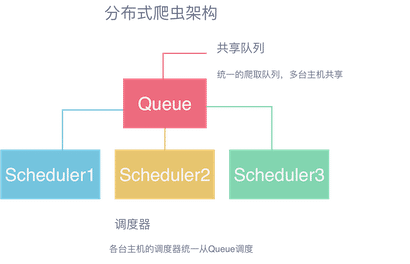
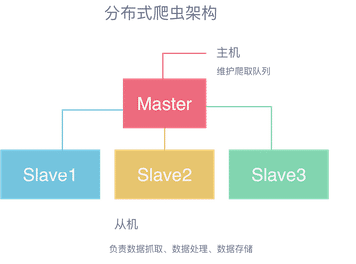

# Scrapy 框架

::: tip 此文为转载 （通常一篇文章会参考多处，也会添加自己的理解，引用地址如有遗漏，请指出）

- https://cuiqingcai.com/
- others ...

:::

## 原理

**Scrapy中的数据流由执行引擎控制，其过程如下:**  

1. **引擎打开一个网站(open a domain)，找到处理该网站的Spider并向该spider请求第一个要爬取的URL(s)。**
2. **引擎从Spider中获取到第一个要爬取的URL并在调度器(Scheduler)以Request调度。**
3. **引擎向调度器请求下一个要爬取的URL。**
4. **调度器返回下一个要爬取的URL给引擎，引擎将URL通过下载中间件(请求(request)方向)转发给下载器(Downloader)。**
5. **一旦页面下载完毕，下载器生成一个该页面的Response，并将其通过下载中间件(返回(response)方向)发送给引擎。**
6. **引擎从下载器中接收到Response并通过Spider中间件(输入方向)发送给Spider处理。**
7. **Spider处理Response并返回爬取到的Item及(跟进的)新的Request给引擎。**
8. **引擎将(Spider返回的)爬取到的Item给Item Pipeline，将(Spider返回的)Request给调度器。**
9. **(从第二步)重复直到调度器中没有更多地request，引擎关闭该网站。**

## **架构**

|  |                                                              |
| ------------------------------------------------------------ | ------------------------------------------------------------ |
|  |  |

## Demo

Demo 代码在github上：

[**ScrapyDemo**](https://github.com/heyan0616/learning/tree/master/python/Demo_ScrapyDemo/ScrapyDemo)

