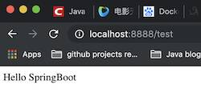

# Docker Case - Springboot项目部署

此为Docker实战系列之-部署Springboot项目


## 准备项目

**1. 创建springboot项目**

```java
package com.test.demo1;

import org.springframework.boot.SpringApplication;
import org.springframework.boot.autoconfigure.SpringBootApplication;
import org.springframework.web.bind.annotation.RequestMapping;
import org.springframework.web.bind.annotation.RestController;

@SpringBootApplication
@RestController
public class Demo1Application {

    @RequestMapping("/test")
    public String index(){
        return "Hello SpringBoot";
    }

    public static void main(String[] args) {

        SpringApplication.run(Demo1Application.class, args);
    }

}
```

**2.打包springboot项目为可执行jar包**

demo1-0.0.1-SNAPSHOT.jar


## Docker部署

这里使用dockerfile来构建springboot项目镜像

**3. 编写Dockerfile文件**

```yaml
# Docker image for springboot file run
# VERSION 0.0.1
# Author: heyan
# 基础镜像使用java
FROM java:8
# 作者
MAINTAINER heyan
workdir /Users/heyan/self/workspace/docker_workspace/demo1
# 将jar包添加到容器中并更名为springbootdemo1.jar
add demo1-0.0.1-SNAPSHOT.jar springbootdemo1.jar
# 运行jar包
cmd java -jar springbootdemo1.jar
```

> **WORKDIR**
>
> 格式： WORKDIR /path
>
> 为后续的RUN CMD ENTRYPOINT指定配置工作目录，可以使用多个WORKDIR指令，若后续指令用得是相对路径，则会基于之前的命令指定路径


**4. 部署文件**

将maven打包好的jar包和dockerfile文件复制到服务器的同一文件夹下 （workdir 目录）


**5. 制作镜像**

执行下面命令， 看好，最后面有个"."点！

```sh
docker build -t springbootdemo4docker .
```

> <font style="font-size:12px;">
>
> hy_mac:demo1 heyan$ docker build -t springbootdemo1 .
>
> Sending build context to Docker daemon  16.79MB
>
> Step 1/6 : FROM java:8
>
>  ---> d23bdf5b1b1b
>
> Step 2/6 : MAINTAINER heyan
>
>  ---> Running in ea4c80ade7a8
>
> Removing intermediate container ea4c80ade7a8
>
>  ---> 8c5f5c9556fc
>
> Step 3/6 : VOLUME /tmp
>
>  ---> Running in 5c2e325067e8
>
> Removing intermediate container 5c2e325067e8
>
>  ---> 75cde7993860
>
> Step 4/6 : workdir /Users/heyan/self/workspace/docker_workspace/demo1
>
>  ---> Running in fc70ba09eb90
>
> Removing intermediate container fc70ba09eb90
>
>  ---> 91f670d8ed0f
>
> Step 5/6 : add demo1-0.0.1-SNAPSHOT.jar springbootdemo1.jar
>
>  ---> 041fdf5f09d5
>
> Step 6/6 : cmd java -jar springbootdemo1.jar
>
>  ---> Running in c58803923667
>
> Removing intermediate container c58803923667
>
>  ---> 4ed376d2550e
>
> Successfully built 4ed376d2550e
>
> Successfully tagged springbootdemo1:latest
>
> </font>

"docker images"命令查看我们制作的镜像

><font style="font-size:12px;">
>
>hy_mac:demo1 heyan$ docker images
>
>REPOSITORY          TAG                 IMAGE ID            CREATED             SIZE
>
>springbootdemo1     latest              4ed376d2550e        15 minutes ago      660MB
>
></font>


**6.启动容器**

```sh
docker run -d -p 8888:8080 springbootdemo1
```

>-d **参数是让容器后台运行** 
>
>-p **是做端口映射，此时将服务器中的8888端口映射到容器中的8080(项目中使用默认端口配置的是8080)端口**


**7. 访问网站**

如下输入 localhost:8888/test

<div style="display:flex;"></div>