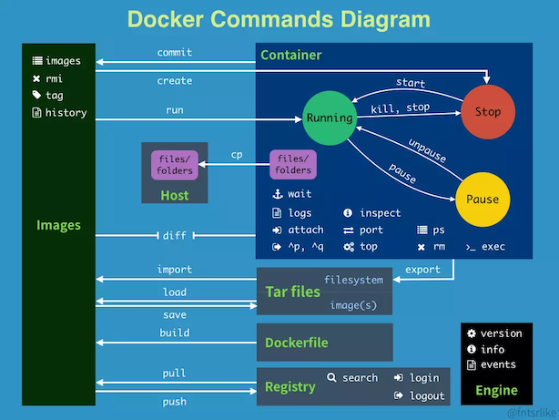

# Docker - 常用基本命令

常用的基本命令

<div style="display:flex;"></div>

<br>

``` sh
docker search **    // 查找镜像
docker pull nginx   // 载入镜像
    # -a 拉取所有tagged镜像
    # --disable-content-trust 忽略镜像的校验，默认开启
docker create       // 创建一个容器但不启动它 run
docker run -d -P -it --name mynginx  nginx
    # -t 在新容器内指定一个伪终端
    # -i 允许对容器内的标准输入进行交互
    # -d 让容器在后台运行
    # -P 将容器内部使用的网络端口随机映射到主机高端口
    # -p 指定绑定端口 -p [127.0.0.1:]5001:5000[ /tcp|udp]（容器中的5000绑定到主机上的5001）
    # --name 创建容器时命名
    # -v $PWD/www:/www：将主机中当前目录下的www挂载到容器的/www
docker run -i -t ubuntu:15.10 /bin/bash     // 进入容器伪终端，退出后容器将停止运行
docker attach ##    // 连接到正在运行的容器
docker exec -it 775c7c9ee1e1 /bin/bash      // 进入容器中
docker network ls   //  查看网络
docker port **      // 查看端口映射
docker logs -f **   //查看容器内的标准输出
    # -f 让docker logs像使用tail -f一样来输出容器内部的标准输出
    # --since 显示某个开始时间的所有日志（docker logs --since="2018-11-02" --tail=10 mynginx）
    # -t 显示时间戳
    # --tail 仅列出最新N条容器日志
docker top **       // 查看容器的进程
docker inspect **   //  查看docker底层信息（返回一个JSON文件记录着Docker容器的配置和状态信息）
    # -f 指定返回值的模板文件（docker inspect --format='{{.NetworkSettings.IPAddress}}' myphp7.1   // 查看容器ip）
    # -s 显示总的文件大小
    # --type 为指定类型返回JSON
docker stop **      // 停止容器
docker start ** 
docker restart  **
docker rm **        // 删除容器
docker rmi **       // 删除镜像（前提必须先删除相关容器）
    # -f 强制删除
    # --no-prune 不溢出该镜像的过程镜像，默认移出
docker ps -l        // 查看最后一次创建的容器
docker ps -a        // 查看所有的容器（默认只显示runnig的）
docker images       // 列出本地主机上的镜像
    # -a 列出本地所有的镜像
    # --digests 显示镜像的摘要信息
    # -f 显示满足条件的镜像
    # -format 指定返回值的模板文件
    # -no-trunc 显示完整的镜像信息
    # -q 只显示进行id
docker ps           //运行的容器 
    # -a 查看全部容器
    # -f 根据条件过滤显示的内容(-f name=myphp)
    # --format 指定返回值的模板文件(docker ps --format  "{{.ID}}: {{.Ports}} {{.Image}}--- {{.Status}}----")
    # -l 显示最近创建的容器
    # -n 列出最近创建的n个容器
    # -no-trunc 不截断输出
    # -q  静默木事，只显示容器编号
    # -s  显示总的文件大小

// 创建新镜像  
// 1、从已经创建容器中更新镜像，并提交这个镜像  
// 2、使用Dockerfile指令来创建一个新的镜像  
docker commit -m="has update" -a="runoob" e218edb10161 runoob/ubuntu:v2
    # -m 提交的描述信息
    # -a 指定镜像作者
    # e218edb10161 容器id
    # runoob/ubuntu:v2 指定创建的目标镜像名称 -这里runoob/ubuntu为镜像名
// 使用dockerfile从零开始建立一个新镜像
docker build -t runoob/centos:6.7 .
    # -t 指定创建的目标镜像名字
    # . Dockerfile文件位置
设置镜像标签  
docker build -t runoob/centos:6.7 .
docker tag          // 标记本地镜像，将其归入某创库

docker kill -s KILL mynginx   // 杀掉一个进行中的容器
docker pause/unpause          // 暂停/恢复容器中所有进程
docker events       // 从服务器获取实时时间
    # -f 根据条件过滤时间（-f "image"="mysql:5.6"）
    # --since 从指定的时间戳后显示所有事件（docker events  --since="1467302400"）
    # --until 流水时间显示到指定的时间为止
docker wait         // 阻塞运行直到容器停止，然后打印出它的退出代码
docker export       // 将文件系统作为一个tar归档文件导出到STDOUT
    # -o 将输出内容写到文件（docker export -o mysql-`date +%Y%m%d`.tar a404c6c174a2）
docker cp           // 用于容器与主机之间的数据拷贝
    # -L 保持源目录中的链接
    # eg1: docker cp /www/test 96f7f14e99ab:/www/   主机拷入容器（不需要/则改名）
    # eg2: docker cp 96f7f14e99ab:/www /www/test    容器拷到主机
docker diff         // 检查容器里文件结构的更改
docker loginout     // 登出
docker login        // 登录到一个docker镜像创库，若未指定镜像创库地址则默认为官方创库
    # -u 用户名
    # -p 密码
docker push         // 将本地镜像上传到镜像创库，要先登录镜像创库
docker history      // 查看指定镜像的创建历史
    # -H 以可读的格式打印镜像大小和日期，默认为true
    # --no-trunc 显示完整的提交记录
    # -q 仅列出提交记录ID
docker save         // 将指定镜像保存成tar归档文件
    # -o 输出到文件
docker import       // 从归档文件中创建镜像
    # -c 应用docker指令创建镜像
    # -m 提交时的说明文字
docker info         // 显示Docker系统信息，包括镜像和容器数
docker version      // 显示Docker版本信息
    # -f 指定返回值的模板文件
```

