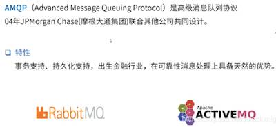
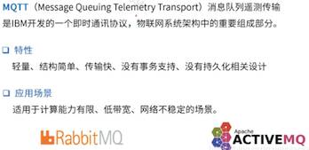
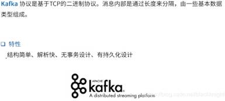
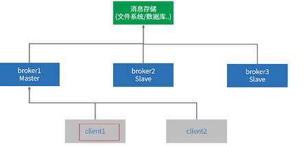
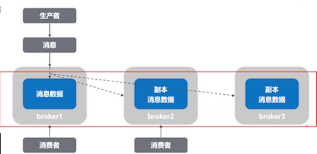
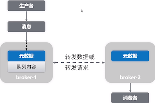
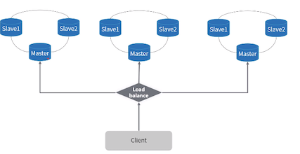

# 消息队列相关知识

::: tip 此文为转载 （通常一篇文章会参考多处，也会添加自己的理解，引用地址如有遗漏，请指出）

- https://www.jianshu.com/p/4cca7c51eff0
- https://segmentfault.com/a/1190000014958916
- https://www.bbsmax.com/A/E35pGOgRJv/
- http://www.uml.org.cn/itnews/2016050908.asp
- https://www.infoq.cn/article/s*RvY8D1jrNIsfOJylPE
- https://www.jianshu.com/p/ca8a823c26fa
- https://blog.csdn.net/blackknightt/article/details/102847835
- ... ...

:::

## 面向消息的中间件

消息队列中间件是分布式系统中重要的组件，主要解决应用耦合、异步消息、流量削锋等问题。实现高性能、高可用、可伸缩和最终一致性架构。是大型分布式系统不可缺少的中间件。

 

## 应用场景

- 应用解耦
- 异步处理
- 削峰填谷（秒杀、大促等场景）
- 数据分发（广播）
- 分布式事务  
...

 

## 消息中间件核心设计

### **本质** 

一种具备接收请求、保存数据、发送数据等功能的网络应用。和一般网络应用程序的区别是它主要负责数据的接收和传递，所以性能一般都高于普通程序

### **5大核心组成（for referene only - to be think）**

- **协议**
- **持久化机制**
- **消息分发机制**
- **高可用设计**
- **高可靠设计**

 

## 异步消息传递技术

> 帮助理解，此分类是否精确，有待商榷

消息传递作为基本通信机制已经在全世界成功运用。无论是人与人、机器与人还是机器与机器之间，消息传递一直都是唯一常用的通信方式。在双方（或更多）之间交换消息有两种基本机制。
1. 同步消息传递
2. 异步消息传递

同步消息传递在这种情况下使用，当消息发送者希望在某个时间范围内收到响应，然后再进行下一个任务。基本上就是他在收到响应前一直处于“阻塞”状态。 
异步消息意味着发送者并不要求立即收到响应，而且也不会阻塞整个流程。响应可有可无，发送者总会执行剩下的任务。
上面提到的技术，当两台计算机上的程序相互通信的时候，就广泛使用了异步消息传递。随着微服务架构的兴起，很明显我们需要使用异步消息传递模型来构建服务。
这一直是软件工程中的基本问题，而且不同的人和组织机构会提出不同的方法。（**JMS/AMQP/MQTT等**就是几种广泛使用的异步消息传递技术）

 

## JMS(Java Message Service)

JMS即Java消息服务（Java Message Service）应用程序接口，是一个Java平台中关于面向消息中间件（MOM）的API，用于在两个应用程序之间，或分布式系统中发送消息，进行异步通信。Java消息服务是一个与具体平台无关的API，绝大多数MOM提供商都对JMS提供支持。

JMS是最成功的异步消息传递技术之一。随着Java在许多大型企业应用中的使用，JMS就成为了企业系统的首选。它定义了构建消息传递系统的API。

下面是JMS的主要特性：
- 面向Java平台的标准消息传递API
- 在Java或JVM语言比如Scala、Groovy中具有互用性
- 无需担心底层协议
- 有queues和topics两种消息传递模型
- 支持事务
- 能够定义消息格式（消息头、属性和内容）

> 在JMS之前，大部分消息队列产品都支持点对点和发布/订阅两种方式传递消息。基于此，JMS将这两种消息模型抽象成两种规范，它们相互独立，由JMS的提供商（即消息队列产品的具体厂商）自己选择实现其中的一种还是两种模型。JMS的作用是提供通用的接口保证基于JMS API编写的程序适用于任何一种模型，使得在更换消息队列提供商的情况下应用程序相关代码不需要做太大的改动。 
 
**传统企业型消息队列 ActiveMQ、IBM 的 MQSeries 等 就是基于 JMS 规范实现的。但其他流行的消息队列如RabbitMQ、Kafka等并没有遵循JMS规范。**

### JMS两种消息模型

（1）点对点模型

在点对点模型中，应用程序由队列、发送者和接受者组成，每一条消息都被发送到特定的队列中，接受者从队列中获取相应的消息。

特点：
1. 每一条消息只有一个消费者，消息一旦被消费了就不在保留在消息队列中。
2. 发送者和消费者之间在时间上没有依赖。
4. 当接受者接受到消息后，会发送确认收到通知

（2）发布订阅模型

在发布订阅模型中，应用程序由主题、发布者和订阅者组成。发布者发布每一条消息，该消息通过主题传递给所有的订阅者。

特点：
1. 每一条消息可以有多个订阅者
2. 发布者和订阅者之间有时间上的依赖关系 (针对某个主题（Topic）的订阅者，它必须创建一个订阅者之后，才能消费发布者的消息。)
3. 为了消费消息，订阅者必须保持运行的状态。（ *to be confirm:* JMS允许创建一个可持久化的订阅，这样即使订阅者没有运行也能接收到所订阅的消息）
4. 通常发布者不会知道也意识不到哪一个订阅者在接受消息

### JMS消息消费

在JMS中，消息的产生和消费都是异步的。对于消费来说，JMS的消息者可以通过两种方式来消费消息。

1. 同步 - 订阅者或接收者通过receive方法来接收消息，receive方法在接收到消息之前（或超时之前）将一直阻塞；
2. 异步 - 订阅者或接收者可以注册为一个消息监听器。当消息到达之后，系统自动调用监听器的onMessage方法。

> JNDI：Java命名和目录接口,是一种标准的Java命名系统接口。可以在网络上查找和访问服务。通过指定一个资源名称，该名称对应于数据库或命名服务中的一个记录，同时返回资源连接建立所必须的信息。 
> JNDI在JMS中起到查找和访问发送目标或消息来源的作用。

 

## 消息协议

### 协议是什么

协议是计算机之间通信时共同遵从的一组约定，都遵守相同的约定，计算机之间才能相互交流。 是对数据格式和计算机之间交换数据时必须遵守的规则的正式描述。

### 协议三要素

1. 语法：即数据与控制信息的结构或格式；
2. 语义：即需要发出何种控制信息，完成何种动作以及做出何种响应；
3. 时序（同步）：即事件实现顺序的详细说明。

> Http协议三要素举例：
> 语法：http规定了请求报文和响应报文的具体格式
> 语义：客户端主动发起的操作称为请求；
> 时序：一个请求对应一个响应。

### **消息协议**

**消息协议**是指用于实现消息队列功能时候所涉及的协议。消息协议可分为开放协议和私有协议，常见的开放协议有OpenWire、AMQP、MQTT、STOMP、XMPP等。但是并不是MQ框架一定需要实现以上的协议，有的特殊框架（比如Kafka`(kafka)`、Redis、ZeroMQ、RocketMQ`(OpenMessage)`）自己基于TCP封装了一套协议，实现了MQ的功能。

### **为什么消息中间件不直接使用Http协议?**

1. http需要的内容太多，太复杂
2. http大部分情况都是短连接，请求响应之后就会中断，而消息中间件会长期的连接

### 主要的协议介绍

**高级消息队列协议（Advanced Message Queueing Protocol (AMQP)）**

JMS非常棒而且人们也非常乐意使用它。微软开发了NMS（.NET消息传递服务）来支持他们的平台和编程语言，它效果还不错。但是碰到了互用性的问题。两套使用两种不同编程语言的程序如何通过它们的异步消息传递机制相互通信呢。此时就需要定义一个异步消息传递的通用标准。JMS或者NMS都没有标准的底层协议。它们可以在任何底层协议上运行，但是API是与编程语言绑定的。AMQP解决了这个问题，它使用了一套标准的底层协议，加入了许多其他特征来支持互用性，为现代应用丰富了消息传递需求。

 

**消息队列遥测传输（Message Queueing Telemetry Transport (MQTT)）**

现在我们已经有了面向基于Java的企业应用的JMS和面向所有其他应用需求的AMQP。为什么我们还需要第三种技术？它是专门为小设备设计的。计算性能不高的设备不能适应AMQP上的复杂操作，它们需要一种简单而且可互用的方式进行通信。这是MQTT的基本要求，而如今，MQTT是物联网（IOT）生态系统中主要成分之一。

 

**kafka协议**

 

 

**OpenMessage协议**

 

 

## 持久化

简单来说持久化就是将数据存入磁盘，而不是存在内存中随服务重启而消失，使数据能够永久保存叫做持久化。下面是几款产品的简单比较：

| ActiveMQ | RabbitMQ | Kafka | RocketMQ |      |
| -------- | -------- | ----- | -------- | ---- |
| 文件系统 | 支持     | 支持  | 支持     | 支持 |
| 数据库   | 支持     | /     | /        | /    |

 

## 分发机制（Pull/Push）

在消费中，一般有推消息和拉消息两种模式。推模式即服务端收到消息后，主动将消息推送给消费者，由消费者进行处理，这种模式具有更高的实时性，但是由于服务端不能准确评估消费端的消费性能，所以有可能造成消息推送过多使客户端来不及处理收到的消息； 拉模式则是服务端收到消息后将消息保存在服务端，被动的等待客户端来拉取消息，这种模式下客户端可以根据自己的处理能力来决定拉消息的频率，但是缺点就是消息处理可能有延迟，不过可以通过长轮询的方式来提高实时性。

产品比较 (for reference only - to be think)：

|          | ActiveMQ | RabbitMQ | Kafka | RocketMQ |
| -------- | -------- | -------- | ----- | -------- |
| 发布订阅 | 支持     | 支持     | 支持  | 支持     |
| 轮询分发 | 支持     | 支持     | 支持  | /        |
| 公平分发 | /        | 支持     | 支持  | /        |
| 重发     | 支持     | 支持     | /     | 支持     |
| 消息拉取 | /        | 支持     | 支持  | 支持     |

- 发布订阅：可以指定某个队列或者某个topic主题去接收消息，mq标配功能
- 重发：kafka是不支持重发的，因为kafka是consumer拉取消息
- 公平分发：公平分发也就是能者多劳模式，当有消费者处理完成后，MQ就会继续给它分发消息，直到MQ中所有消息都被消费。

 

## 高可用设计

高可用是指产品在规定的条件和规定的时刻或时间区间内处于可执行规定功能状态的能力。 当业务量大时，一台消息中间件服务器可能无法满足需求，所以需要消息中间件能够集群部属，来达到高可用的目的。

### Master-Slave主从共享数据的部属方式

共享数据，数据只有一份

 

### Master-Slave主从同步部属方式

这种模式，写入、修改只能在主服务器；数据不仅在master中，还会同步到slave中，把数据放在多个地方，可以进行负载均衡；同步会占用，网络带宽。

 

### **Broker-Cluster多主集群同步部署方式**

存在多个主机，相互进行数据同步；这种模式，写入可以在多个主服务器写入；读写，都可以实现负载均衡

 

### **Broker-Cluster多主集群转发部属方式**

消息不会在多个主服务器之间同步，比如生产者将消息发送给broker-1，那么消息就会只存储在broker-1上 消息会产生对应的元数据（地址信息，哪条数据存放在哪个服务器上），元数据会在主服务器之间同步，同步元数据的开销比同步消息要小一些。 弊端：如果有一个节点挂掉，那么该节点的数据就无法读取出来

 

### **Master-Slave与Broker-Cluster结合**

即实现负载均衡，也实现备份

 

## 高可靠设计

### 高可靠是什么

高可靠性是指系统可以无故障地持续运行。比如一个系统从来不崩溃、报错，或者崩溃、报错的几率低，就是高可靠。 在高并发业务场下，如果不能保证系统的高可靠，那造成的损失将会是非常严重。

通常对于高可靠需要多个方面，如：生产端可靠性；消息和队列可靠性（消息确认机制、事务、消息幂等性、回退策略、消息投递策略等...）；消费端可靠性等 ... （*下面主要介绍下经常会遇到的概念*）

### 投递策略（Delivery policies）

消息传递过程中，会有各种异常导致消息不能正常发送，这时候，我们有以下三种选择：

- **At most once** - 下游允许部分消息丢失，不进行处理，这种方式一般适用于监控信息和 log 的传递，少一两条影响不大，称为至多一次（Qos=0）
- **At least once** - 还有一种是消息必须全部送达，不允许任何消息丢失，但是可以接受部分消息重复，这种我们称为至少一次（Qos=1），此种方式一般适用于订单，支付等场景（当然，这要求下游系统实现去重或幂等）
- **Exactly once** - 还有一种最严格的要求，就是消息只能送达一次，不能多也不能少，这种我们称为正好一次（Qos=2）

 

## 常见的消息队列总结比较

当前使用较多的消息队列有RabbitMQ、ActiveMQ、RocketMQ、Kafka等等，redis数据库也可以实现消息队列，不过不推荐，redis本身设计就不是用来做消息队列的。

