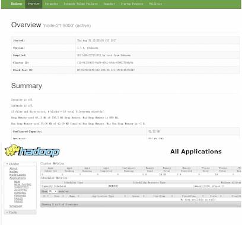

# Hadoop安装初体验

::: tip 此文为转载 （通常一篇文章会参考多处，也会添加自己的理解，引用地址如有遗漏，请指出）

- https://www.bilibili.com/video/av79967392?p=1

:::

<br />

## **集群安装**

集群模式主要用于生产环境部署。会使用N台主机组成一个Hadoop集群。这种部署模式下，主节点和从节点会分开部署在不同的机器上。我们以3节点为例进行搭建，角色分配如下：

- node-01- NameNode,DataNode,ResourceManager
- node-02 - DataNode,NodeManager,SecondaryNameNode
- node-03 - DataNode,NodeManager

### **服务器准备**

使用VMware Workstation Pro虚拟机创建虚拟服务器来搭建HADOOP集群，所用软件及版本如下：<br>VMware Workstation Pro 12.0<br>Centos 6.7 64bit

### **网络环境准备**

采用NAT方式联网。<br>如果创建的是桌面版的Centos系统，可以在安装完毕后通过图形页面进行编辑。如果是mini版本的，可通过编辑ifcfg-eth*配置文件进行配置。<br>注意BOOTPROTO、GATEWAY、NETMASK。

### **服务器系统设置**

**同步时间**

```sh
#手动同步集群各机器时间
date -s "2017-03-03 03:03:03"
yum install ntpdate
#网络同步时间
ntpdate cn.pool.ntp.org
```

**设置主机名**

```sh
vi /etc/sysconfig/network
NETWORKING=yes
HOSTNAME=node-1 
```

**配置IP、主机名映射**

```sh
vi /etc/hosts
192.168.33.101     node-1
192.168.33.102     node-2
192.168.33.103     node-3
```

**配置ssh免密登陆**

```sh
#生成ssh免登陆密钥
ssh-keygen -t rsa （四个回车）

#执行完这个命令后，会生成id_rsa（私钥）、id_rsa.pub（公钥）
#将公钥拷贝到要免密登陆的目标机器上
ssh-copy-id node-02
```

**配置防火墙**

```sh
#查看防火墙状态
service iptables status

#关闭防火墙
service iptables stop

#查看防火墙开机启动状态
chkconfig iptables --list

#关闭防火墙开机启动
chkconfig iptables off
```


### **JDK环境安装**

```sh
#上传jdk安装包
jdk-8u65-linux-x64.tar.gz
#解压安装包
tar zxvf jdk-8u65-linux-x64.tar.gz -C /root/apps

#配置环境变量 /etc/profile
export JAVA_HOME=/root/apps/jdk1.8.0_65
export PATH=$PATH:$JAVA_HOME/bin
export CLASSPATH=.:$JAVA_HOME/lib/dt.jar:$JAVA_HOME/lib/tools.jar
#刷新配置
source /etc/profile
```


### **Hadoop安装包目录结构**

解压hadoop-2.7.4-with-centos-6.7.tar.gz，目录结构如下：

- **bin**：Hadoop最基本的管理脚本和使用脚本的目录，这些脚本是sbin目录下管理脚本的基础实现，用户可以直接使用这些脚本管理和使用Hadoop。
- **etc**：Hadoop配置文件所在的目录，包括core-site,xml、hdfs-site.xml、mapred-site.xml等从Hadoop1.0继承而来的配置文件和yarn-site.xml等Hadoop2.0新增的配置文件。
- **include**：对外提供的编程库头文件（具体动态库和静态库在lib目录中），这些头文件均是用C++定义的，通常用于C++程序访问HDFS或者编写MapReduce程序。
- **lib**：该目录包含了Hadoop对外提供的编程动态库和静态库，与include目录中的头文件结合使用。
- **libexec**：各个服务对用的shell配置文件所在的目录，可用于配置日志输出、启动参数（比如JVM参数）等基本信息。
- **sbin**：Hadoop管理脚本所在的目录，主要包含HDFS和YARN中各类服务的启动/关闭脚本。
- **share**：Hadoop各个模块编译后的jar包所在的目录。


### **Hadoop配置文件修改**

Hadoop安装主要就是配置文件的修改，一般在主节点进行修改，完毕后scp下发给其他各个从节点机器。

**1． hadoop-env.sh**

文件中设置的是Hadoop运行时需要的环境变量。JAVA_HOME是必须设置的，即使我们当前的系统中设置了JAVA_HOME，它也是不认识的，因为Hadoop即使是在本机上执行，它也是把当前的执行环境当成远程服务器。

```sh
vi hadoop-env.sh 

export JAVA_HOME=/root/apps/jdk1.8.0_65
```

**2． core-site.xml**

hadoop的核心配置文件，有默认的配置项core-default.xml。<br>core-default.xml与core-site.xml的功能是一样的，如果在core-site.xml里没有配置的属性，则会自动会获取core-default.xml里的相同属性的值。

```xml
<!-- 用于设置Hadoop的文件系统，由URI指定 -->
		<property>
                 <name>fs.defaultFS</name>
                 <value>hdfs://node-1:9000</value>
    	</property>
<!-- 配置Hadoop的临时目录,默认/tmp/hadoop-${user.name} -->
     	<property>
                 <name>hadoop.tmp.dir</name>
                 <value>/home/hadoop/hadoop-2.4.1/tmp</value>
    	</property>
```

**3． hdfs-site.xml**

HDFS的核心配置文件，有默认的配置项hdfs-default.xml。<br>hdfs-default.xml与hdfs-site.xml的功能是一样的，如果在hdfs-site.xml里没有配置的属性，则会自动会获取hdfs-default.xml里的相同属性的值。

```xml
<!-- 指定HDFS副本的数量 -->
     	<property>
                 <name>dfs.replication</name>
                 <value>2</value>
    	</property>
<!-- secondary namenode 所在主机的ip和端口-->
    	<property>
                  <name>dfs.namenode.secondary.http-address</name>
                  <value>192.168.1.152:50090</value>
    	</property>
```

**4． mapred-site.xml**

MapReduce的核心配置文件，有默认的配置项mapred-default.xml。<br>mapred-default.xml与mapred-site.xml的功能是一样的，如果在mapred-site.xml里没有配置的属性，则会自动会获取mapred-default.xml里的相同属性的值。

```xml
<!-- 指定mr运行时框架，这里指定在yarn上，默认是local -->
     	<property>
                 <name>mapreduce.framework.name</name>
                 <value>yarn</value>
    	</property>
```

**5． yarn-site.xml**

YARN的核心配置文件，有默认的配置项yarn-default.xml。<br>yarn-default.xml与yarn-site.xml的功能是一样的，如果在yarn-site.xml里没有配置的属性，则会自动会获取yarn-default.xml里的相同属性的值。

```xml
<!-- 指定YARN的老大（ResourceManager）的地址 -->
     	<property>
                 <name>yarn.resourcemanager.hostname</name>
                 <value>node-1</value>
    	</property>
 <!-- NodeManager上运行的附属服务。需配置成mapreduce_shuffle，才可运行MapReduce程序默认值："" -->
   		<property>
                 <name>yarn.nodemanager.aux-services</name>
                 <value>mapreduce_shuffle</value>
   		</property>
```

**6． slaves**

slaves文件里面记录的是集群主机名。一般有以下两种作用：<br>一是：配合一键启动脚本如start-dfs.sh、stop-yarn.sh用来进行集群启动。这时候slaves文件里面的主机标记的就是从节点角色所在的机器。<br>二是：可以配合hdfs-site.xml里面dfs.hosts属性形成一种白名单机制。<br>dfs.hosts指定一个文件，其中包含允许连接到NameNode的主机列表。必须指定文件的完整路径名。如果值为空，则允许所有主机。例如：

```xml
		<property>
                 <name> dfs.hosts </name>
                 <value>/root/apps/hadoop/etc/hadoop/slaves </value>
		</property>
```

那么所有在slaves中的主机才可以加入的集群中。

### **Hadoop环境变量**

```sh
#编辑环境变量的配置文件：
vi /etc/profile

export JAVA_HOME= /root/apps/jdk1.8.0_65
export HADOOP_HOME= /root/apps/hadoop-2.7.4
export PATH=$PATH:$JAVA_HOME/bin:$HADOOP_HOME/bin:$HADOOP_HOME/sbin

#保存配置文件，刷新配置文件：                                        
source /etc/profile
```


## **集群启动初体验**

### **启动方式**

要启动Hadoop集群，需要启动HDFS和YARN两个集群。<br>注意：**首次启动HDFS时，必须对其进行格式化操作**。本质上是一些清理和准备工作，因为此时的HDFS在物理上还是不存在的。

`hdfs namenode–format`或者`hadoop namenode –format`

**1． 单节点逐个启动**

```sh
#在主节点上使用以下命令启动HDFS NameNode：
hadoop-daemon.sh start namenode

#在每个从节点上使用以下命令启动HDFS DataNode：
hadoop-daemon.sh start datanode

#在主节点上使用以下命令启动YARN ResourceManager：
yarn-daemon.sh start resourcemanager

#在每个从节点上使用以下命令启动YARN nodemanager：
yarn-daemon.sh start nodemanager
```

以上脚本位于$HADOOP_PREFIX/sbin/目录下。如果想要停止某个节点上某个角色，只需要把命令中的**start**改为**stop**即可。

**2． 脚本一键启动**

如果配置了etc/hadoop/slaves和ssh免密登录，则可以使用程序脚本启动所有Hadoop两个集群的相关进程，在主节点所设定的机器上执行。

```sh
hdfs：$HADOOP_PREFIX/sbin/start-dfs.sh
yarn: $HADOOP_PREFIX/sbin/start-yarn.sh

停止集群：stop-dfs.sh、stop-yarn.sh
```


### **集群web-ui**

一旦Hadoop集群启动并运行，可以通过web-ui进行集群查看，如下所述：

NameNode &emsp;&emsp;&emsp;&emsp;&emsp; http://nn_host:port/  	&emsp;&emsp;默认50070.<br>ResourceManager   &emsp;&emsp;	http://rm_host:port/  		&emsp;&emsp;默认 8088.

<div style="display:flex;"></div>


### **Hadoop初体验**

**1． HDFS使用**

从Linux本地上传一个文本文件到hdfs的/test/input目录下

```sh
hadoop fs -mkdir -p /wordcount/input
hadoop fs -put /root/somewords.txt  /test/input
```

**2． 运行mapreduce程序**

在Hadoop安装包的hadoop-2.7.4/share/hadoop/mapreduce下有官方自带的mapreduce程序。我们可以使用如下的命令进行运行测试。

示例程序jar:<br>hadoop-mapreduce-examples-2.7.4.jar

计算圆周率:

```sh
hadoop jar hadoop-mapreduce-examples-2.7.4.jar pi 20 50
```

关于圆周率的估算，感兴趣的可以查询资料Monte Carlo方法来计算Pi值。