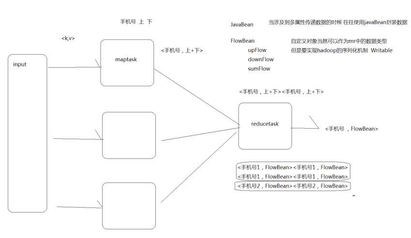

# MapReduce案例

::: tip 此文为转载 （通常一篇文章会参考多处，也会添加自己的理解，引用地址如有遗漏，请指出）

- https://blog.csdn.net/CoderBoom/article/details/84194042

:::

<br />

## **MapReduce的输入和输出**

MapReduce执行流程图

<br>

<div style="display:flex;"></div>
<br>

详细图解如下

<div style="display:flex;"></div>
<br>

> maptask通过自带的TextInputFormat将数据按照一行一行的读取 , 用每一行的起始偏移量作为k , 每行的内容作为value构成<k1,v1>键值对 , 在map中经过业务逻辑 , 对数据进行的"分" , 形成新的键值对<k2,v2>传递给reduce ; reduce将传递过来的键值对按照字典序排序分组 , 然后经过业务逻辑形成新的<k3,v3>键值对 , 通过自带的TextOutputFormat进行"合" , 最后存储结果

整个流程中会有三组<key,value>键值对类型的存在

<br>

<div style="display:flex;"></div>
<br>

## **MapReduce的处理流程解析**

**Mapper任务执行过程详解**

- 第一阶段 , 将文件按照一定的标准逐个进行逻辑切片 , 形成切片规划 . 默认情况下 . Split size = Block size ==128M. 每一个切片由一个MapTask处理 . (getSplits)
- 第二阶段 , 将切片中数据按照一定规则解析成<k,v>对 . 默认规则是把每一行文本内容解析成键值对 , 即每行起始偏移量是k , 每行的内容为v . (TextInputFormat)
- 第三阶段 , 调用Mapper中的map方法 , 每解析出来一个<k,v> , 调用一次map方法
- 第四阶段 , 将第三阶段的键值对进行分区 , 默认只有一个分区 . 分区的数量就是Reducer任务运行的数量 .
- 第五阶段 , 对每个分区中的键值对进行字典序排序 , 一般不是读取一行就向内存中存储一行 , 而一般是存储在缓冲区中 , 缓冲区默认大小是100M , 缓冲区溢出(满) , 就向内存中存储 , 此时存储的数据是分区且排序的 . 如果有combiner则进入第六阶段 , 否则直接输出到文件中
- 第六阶段 , 对数据进行局部聚合处理 , 即combiner处理 . 本阶段默认是没有的

**Reducer任务执行过程详解**

- 第一阶段 , Reducer主动从Mapper中复制其输出的键值对
- 第二阶段 , 对复制的数据进行合并 , 合并后进行排序
- 第三阶段 , 对排序后的键值对调用reduce方法 , 键相等的键值对调用一次reduce方法 , 最后将输出的键值对写入到HDFS文件中

<font color="red">整个MapReduce程序开发过程中 , 我们最大的工作量就是覆盖map函数和reduce函数</font>

**完整的MapReduce执行流程图**

<br>

<div style="display:flex;"></div>
<br>

1. 将目标文件按照一定的规则进行逻辑分块 , 一般分块的大小等于block大小128M (分区注意事项就是数据不能重复 , 不能遗漏) , 有多少个切片最终就启动多少个maptask
2. 通过自带的TextInputFormat一行一行的读取 , 通过重写map方法将数据写入新的kv对 , 然后为了较少频繁的调用磁盘读写操作 , 将新的kv对先存储到内存缓冲区 , 待内存缓冲区溢出(满)之后写入到磁盘
3. 在写入内存缓冲区之前 , 我们进行分区操作
4. 因此写入到磁盘中的数据是分区且排序(字典序)的
5. reducetask会主动从磁盘中拉取数据进行处理
6. 首先reducetask会对拉取的数据进行字典序的排序操作 , 然后将k相同的分为一组 , 这一组中共同的k成为新的key , 所有的v构造迭代器成为新的v
7. 最后通过业务逻辑后 , 使用TextOutputFormat方法相应写入到hdfs中属于各自的分区中


## **MapReduce的序列化**

### **概述**

**序列化**（Serialization）是指把结构化对象转化为字节流。<br>**反序列化**（Deserialization）是序列化的逆过程。把字节流转为结构化对象。<br>hadoop 自己开发了一套序列化机制（Writable），精简，高效。<br>Writable是Hadoop的序列化格式，hadoop定义了这样一个Writable接口。一个类要支持可序列化只需实现这个接口即可.

### **自定义Writable 序列化接口**

```java
import java.io.DataInput;
import java.io.DataOutput;
import java.io.IOException;

/**
 * @author CoderCK
 * @Title: com.itck.mr.pojo
 * @ProjectName example-mr
 * @Description: TODO
 * @create 2018/11/16  14:52
 **/
public class FlowBean implements WritableComparable<FlowBean> {
    private long upFlow;
    private long downFlow;
    private long sumFlow;

    //这里反序列化的时候会用到
    public FlowBean() {
    }

    

    public long getUpFlow() {
        return upFlow;
    }

    public void setUpFlow(long upFlow) {
        this.upFlow = upFlow;
    }

    public long getDownFlow() {
        return downFlow;
    }

    public void setDownFlow(long downFlow) {
        this.downFlow = downFlow;
    }

    public long getSumFlow() {
        return sumFlow;
    }

    public void setSumFlow(long sumFlow) {
        this.sumFlow = sumFlow;
    }

    @Override
    public String toString() {
        return upFlow+"\t"+downFlow+"\t"+sumFlow;
    }


    //这里是序列化方法
    @Override
    public void write(DataOutput out) throws IOException {
        out.writeLong(upFlow);
        out.writeLong(downFlow);
        out.writeLong(sumFlow);

    }

    //这里是反序列化方法
    @Override
    public void readFields(DataInput in) throws IOException {
        //注意反序列化的顺序跟序列化的顺序一致
        this.upFlow = in.readLong();
        this.downFlow = in.readLong();
        this.sumFlow = in.readLong();
    }


    //这里进行bean的自定义比较大小
    @Override
    public int compareTo(FlowBean o) {
        //实现进行bean的自定义比较大小
        return this.sumFlow>o.getSumFlow()?-1:1;
    }
}
```

compareTo方法用于将当前对象与方法的参数进行比较<br>如果指定的数与参数相等返回0<br>如果指定的数小于参数返回-1<br>如果指定的数大于参数返回1<br>例如：o1.compareTo(o2);<br>返回正数的话，当前对象（调用 compareTo 方法的对象 o1）要排在比较对象（compareTo 传参对象 o2）后面，返回负数的话，放在前面。

```java
a.compreTo(b)   0 相等  负数小于  正数大于   谁大谁在后面
```


## **MapReduce的排序初步**

在mr编程中，牢牢把握住k是什么 因为在mr中，k有很多默认的行为

- 排序 k的字典序
- 分区 k的哈希值取模
- 分组 k相同的作为一组

**案例 : 统计每个用户(手机号)的总上行流量、下行流量 , 总流量 , 并按总流量倒序排序** - 案例数据:

```yaml
1363157985066	13726230503	00-FD-07-A4-72-B8:CMCC	120.196.100.82	i02.c.aliimg.com		24	27	2481	24681	200
1363157995052 	13826544101	5C-0E-8B-C7-F1-E0:CMCC	120.197.40.4			4	0	264	0	200
1363157991076 	13926435656	20-10-7A-28-CC-0A:CMCC	120.196.100.99			2	4	132	1512	200
1363154400022 	13926251106	5C-0E-8B-8B-B1-50:CMCC	120.197.40.4			4	0	240	0	200
1363157993044 	18211575961	94-71-AC-CD-E6-18:CMCC-EASY	120.196.100.99	iface.qiyi.com	视频网站	15	12	1527	2106	200
1363157995074 	84138413	5C-0E-8B-8C-E8-20:7DaysInn	120.197.40.4	122.72.52.12		20	16	4116	1432	200
1363157993055 	13560439658	C4-17-FE-BA-DE-D9:CMCC	120.196.100.99			18	15	1116	954	200
1363157995033 	15920133257	5C-0E-8B-C7-BA-20:CMCC	120.197.40.4	sug.so.360.cn	信息安全	20	20	3156	2936	200
1363157983019 	13719199419	68-A1-B7-03-07-B1:CMCC-EASY	120.196.100.82			4	0	240	0	200
1363157984041 	13660577991	5C-0E-8B-92-5C-20:CMCC-EASY	120.197.40.4	s19.cnzz.com	站点统计	24	9	6960	690	200
1363157973098 	15013685858	5C-0E-8B-C7-F7-90:CMCC	120.197.40.4	rank.ie.sogou.com	搜索引擎	28	27	3659	3538	200
1363157986029 	15989002119	E8-99-C4-4E-93-E0:CMCC-EASY	120.196.100.99	www.umeng.com	站点统计	3	3	1938	180	200
1363157992093 	13560439658	C4-17-FE-BA-DE-D9:CMCC	120.196.100.99			15	9	918	4938	200
1363157986041 	13480253104	5C-0E-8B-C7-FC-80:CMCC-EASY	120.197.40.4			3	3	180	180	200
1363157984040 	13602846565	5C-0E-8B-8B-B6-00:CMCC	120.197.40.4	2052.flash2-http.qq.com	综合门户	15	12	1938	2910	200
1363157995093 	13922314466	00-FD-07-A2-EC-BA:CMCC	120.196.100.82	img.qfc.cn		12	12	3008	3720	200
1363157982040 	13502468823	5C-0A-5B-6A-0B-D4:CMCC-EASY	120.196.100.99	y0.ifengimg.com	综合门户	57	102	7335	110349	200
1363157986072 	18320173382	84-25-DB-4F-10-1A:CMCC-EASY	120.196.100.99	input.shouji.sogou.com	搜索引擎	21	18	9531	2412	200
1363157990043 	13925057413	00-1F-64-E1-E6-9A:CMCC	120.196.100.55	t3.baidu.com	搜索引擎	69	63	11058	48243	200
1363157988072 	13760778710	00-FD-07-A4-7B-08:CMCC	120.196.100.82			2	2	120	120	200
1363157985066 	13726238888	00-FD-07-A4-72-B8:CMCC	120.196.100.82	i02.c.aliimg.com		24	27	2481	24681	200
1363157993055 	13560436666	C4-17-FE-BA-DE-D9:CMCC	120.196.100.99			18	15	1116	954	200
```

思路分析 : 实现自定义的bean来封装流量信息，并将bean作为map输出的key来传输。分析图如下:

<br>

<div style="display:flex;"></div>
<br>

由于默认的hadoop的序列化已经没法满足我们的需求 , 因此我们自定义了一个javaBean来继承hadoop的Writable来实现新的数据类型。具体代码如下:

FlowBean类

```java
import org.apache.hadoop.io.Writable;

import java.io.DataInput;
import java.io.DataOutput;
import java.io.IOException;

/**
 * @author CoderCK
 * @Title: com.itck.mr.flow
 * @ProjectName example-mr
 * @Description: TODO
 * @create 2018/11/17  20:26
 **/
public class FlowBean implements Writable {

    private long upFlow;
    private long downFlow;
    private long sumFlow;

    public FlowBean() {
    }

    public FlowBean(long upFlow, long downFlow, long sumFlow) {
        this.upFlow = upFlow;
        this.downFlow = downFlow;
        this.sumFlow = sumFlow;
    }
    public FlowBean(long upFlow, long downFlow) {
        this.upFlow = upFlow;
        this.downFlow = downFlow;
        this.sumFlow = upFlow+downFlow;
    }
    public void set(long upFlow, long downFlow) {
        this.upFlow = upFlow;
        this.downFlow = downFlow;
        this.sumFlow = upFlow+downFlow;
    }

    public long getUpFlow() {
        return upFlow;
    }

    public void setUpFlow(long upFlow) {
        this.upFlow = upFlow;
    }

    public long getDownFlow() {
        return downFlow;
    }

    public void setDownFlow(long downFlow) {
        this.downFlow = downFlow;
    }

    public long getSumFlow() {
        return sumFlow;
    }

    public void setSumFlow(long sumFlow) {
        this.sumFlow = sumFlow;
    }

    @Override
    public String toString() {
        return upFlow+"\t"+downFlow+"\t"+sumFlow;
    }

    /**
     *
     * @Description  序列化
     * @Param out
     * @return void
     **/
    @Override
    public void write(DataOutput out) throws IOException {
        out.writeLong(upFlow);
        out.writeLong(downFlow);
        out.writeLong(sumFlow);
    }


    /**
     *
     * @Description  反序列化 , 注意顺序
     * @Param in
     * @return void
     **/
    @Override
    public void readFields(DataInput in) throws IOException {
        this.upFlow=in.readLong();
        this.downFlow=in.readLong();
        this.sumFlow=in.readLong();
    }
}
```

> 又因为如果读取一次 , new一次对象 , 性能不友好 , 因此我们自定义构造了两个的构造函数 , 因此我们构造了`public FlowBean(long upFlow, long downFlow)`
>
> 又由于设置参数较为麻烦 , 我们在FlowBean中新增了一个 `public void set(long upFlow, long downFlow)`方法
>
> 上述两个的sumFlow都用`sumFlow = upFlow+downFlow`表示即可

Mapper类FlowCountMapper.java

```java
public class FlowCountMapper extends Mapper<LongWritable,Text,Text,FlowBean> {
    Text k = new Text();
    FlowBean v = new FlowBean();

    @Override
    protected void map(LongWritable key, Text value, Context context) throws IOException, InterruptedException {
        String line = value.toString();
        String[] fields = line.split("\t");
        String phoNum = fields[1];
        long upFlow = Long.parseLong(fields[fields.length-3]);
        long downFlow = Long.parseLong(fields[fields.length-2]);
        k.set(phoNum);
        v.set(upFlow,downFlow);
        context.write(k,v);
    }
}
```

Reducer类FlowCountReducer.java

```java
public class FlowCountReducer extends Reducer<Text,FlowBean,Text,FlowBean> {
    FlowBean v = new FlowBean();
    @Override
    protected void reduce(Text key, Iterable<FlowBean> values, Context context) throws IOException, InterruptedException {
        long upFlow = 0;
        long downFlow = 0;
        for (FlowBean value : values) {
            upFlow+=value.getUpFlow();
            downFlow+=value.getDownFlow();
        }
        v.set(upFlow,downFlow);
        context.write(key,v);
    }
}
```

主类FlowCountRunner.java

```java
public class FlowCountRunner {
    public static void main(String[] args) throws Exception{
        Configuration conf = new Configuration();
        //设置mr本地执行
        conf.set("mapreduce.framework.name","local");
        Job job = Job.getInstance(conf);

        //指定本次mr程序运行的主类是
        job.setJarByClass(FlowCountRunner.class);

        //指定本次mr程序map reduce类是什么
        job.setMapperClass(FlowCountMapper.class);
        job.setReducerClass(FlowCountReducer.class);

        //指定map阶段输出的数据类型
        job.setMapOutputKeyClass(Text.class);
        job.setMapOutputValueClass(FlowBean.class);

        //指定reduce阶段输出的数据类型  也就是mr最终的输出
        job.setOutputKeyClass(Text.class);
        job.setOutputValueClass(FlowBean.class);

        //指定mr程序输入 输出的数据位置 , 此处是在hdfs上进行的
        //FileInputFormat.setInputPaths(job,("/wordcount/input"));
        //FileOutputFormat.setOutputPath(job,new Path("/wordcount/output"));

        //指定mr程序输入 输出的数据位置
        FileInputFormat.setInputPaths(job,new Path("J:\\bigdatatest\\flowsum\\in"));
        FileOutputFormat.setOutputPath(job,new Path("J:\\bigdatatest\\flowsum\\out"));

        //job提交
        boolean b = job.waitForCompletion(true);

        //程序退出
        System.exit(b?0:1);
    }
}
```

此时得出的结果如下 : 按照默认排序规则 : 即k的字典序正序

```yaml
13480253104	180	180	360
13502468823	7335	110349	117684
13560436666	1116	954	2070
13560439658	2034	5892	7926
13602846565	1938	2910	4848
13660577991	6960	690	7650
13719199419	240	0	240
13726230503	2481	24681	27162
13726238888	2481	24681	27162
13760778710	120	120	240
13826544101	264	0	264
13922314466	3008	3720	6728
13925057413	11058	48243	59301
13926251106	240	0	240
13926435656	132	1512	1644
15013685858	3659	3538	7197
15920133257	3156	2936	6092
15989002119	1938	180	2118
18211575961	1527	2106	3633
18320173382	9531	2412	11943
84138413	4116	1432	5548
```

在mr中 , k是有默认排序行为的字典序正序<br>在实际需求中 , 如果需要根据某个属性排序 , 不妨把该属性作为key ,<br>如果默认排序符合需求 , 直接用 ;<br>如果默认排序不符合需求(倒序 , 自定义对象) , 改写默认排序规则compareTo<br>由于后续需求又要求根据总流量倒序排序 , 因此我们需要修改FlowBean , 让其重写compareTo方法<br>并且我们将map的输出端修改为<FlowBean,手机号> , reduce的输出端在修改回来<手机号,FlowBean>

具体代码如下:

```java
public class FlowBean implements WritableComparable<FlowBean> {
 ........
 /**
     *
     * @Description  排序的方法
     * @Param o
     * @return int
     **/
    @Override
    public int compareTo(FlowBean o) {
        //默认是返回值大的在后面
        //这里我们将原始数据大的放前面 , 因此符合条件就返回-1 , 这样就排在前面了
        return this.sumFlow > o.sumFlow ? -1:1;
    }
}
```

排序的mapper , FlowSortCountMapper.java

```java
public class FlowSortCountMapper extends Mapper<LongWritable,Text,FlowBean,Text> {
    FlowBean k = new FlowBean();
    Text v = new Text();
    @Override
    protected void map(LongWritable key, Text value, Context context) throws IOException, InterruptedException {
        String line = value.toString();
        String[] fields = line.split("\t");
        String phoNum = fields[0];
        long upFlow = Long.parseLong(fields[1]);
        long downFlow = Long.parseLong(fields[2]);
        k.set(upFlow,downFlow);
        v.set(phoNum);
        context.write(k,v);
    }
}
```

排序的reduce , FlowSortCountReducer.java

```java
public class FlowSortCountReducer extends Reducer<FlowBean,Text,Text,FlowBean> {

    @Override
    protected void reduce(FlowBean key, Iterable<Text> values, Context context) throws IOException, InterruptedException {
        //TODO 如果迭代器中只有一个元素 , 可以使用下属api获取 不需要for迭代
        Text phoNum = values.iterator().next();
        context.write(new Text(phoNum),key);
    }
}
```

排序的主类FlowSortCountDriver.java

```java
public class FlowSortCountDriver {
    public static void main(String[] args) throws Exception{
        Configuration conf = new Configuration();
        //设置mr本地执行
        conf.set("mapreduce.framework.name","local");
        Job job = Job.getInstance(conf);

        //指定本次mr程序运行的主类是
        job.setJarByClass(FlowSortCountDriver.class);

        //指定本次mr程序map reduce类是什么
        job.setMapperClass(FlowSortCountMapper.class);
        job.setReducerClass(FlowSortCountReducer.class);

        //指定map阶段输出的数据类型
        job.setMapOutputKeyClass(FlowBean.class);
        job.setMapOutputValueClass(Text.class);

        //指定reduce阶段输出的数据类型  也就是mr最终的输出
        job.setOutputKeyClass(Text.class);
        job.setOutputValueClass(FlowBean.class);

        //指定mr程序输入 输出的数据位置 , 此处是在hdfs上进行的
        //FileInputFormat.setInputPaths(job,("/wordcount/input"));
        //FileOutputFormat.setOutputPath(job,new Path("/wordcount/output"));

        //指定mr程序输入 输出的数据位置
        FileInputFormat.setInputPaths(job,new Path("J:\\bigdatatest\\flowsum\\out"));
        FileOutputFormat.setOutputPath(job,new Path("J:\\bigdatatest\\flowsum\\sortout"));

        //job提交
        boolean b = job.waitForCompletion(true);

        //程序退出
        System.exit(b?0:1);
    }

}
```

> 在mr编程中，可以把上一个mr的输出目录直接作为下一个mr的输入 mr程序能够自动识别里面什么是检验性文件 什么是成功标识文件 什么是真正的数据文件

输出结果如下 : 按照自定义排序规则(此处是总流量的降序)

```yaml
13502468823	7335	110349	117684
13925057413	11058	48243	59301
13726238888	2481	24681	27162
13726230503	2481	24681	27162
18320173382	9531	2412	11943
13560439658	2034	5892	7926
13660577991	6960	690	7650
15013685858	3659	3538	7197
13922314466	3008	3720	6728
15920133257	3156	2936	6092
84138413	4116	1432	5548
13602846565	1938	2910	4848
18211575961	1527	2106	3633
15989002119	1938	180	2118
13560436666	1116	954	2070
13926435656	132	1512	1644
13480253104	180	180	360
13826544101	264	0	264
13926251106	240	0	240
13760778710	120	120	240
13719199419	240	0	240
```


## MapReduce的分区–Partitioner

**分区概念图解**

<br>

<div style="display:flex;"></div>

<br>

> 规律 : reducetask个数和最终结果文件被分成几个部分有关系(对等关系)<br>如果不写默认是1个 , 全局最终只有一个结果文件 : part-r-00000<br>如果serNumReduceTasks(N) , 最终就分为N个部分 : part-r-00000…part-r-0000(N-1)<br>分区规则 : 默认的分区规则是k的哈希值对reducetask个数取模<==>`k.hashcode%ReduceTask`个数 余数为几 , 分区编号就是几<br>哈希是一个算法 , 可以计算出一串特征值 , 如果数据不变 , 特征值也不变 , 因此k相同一定会分到同一个分区


<font color="#420420">**案例 : 将流量汇总统计结果按照手机归属地不同省份输出到不同的文件中**</font>

思路分析 : 默认的分发规则为：根据 key 的 hashcode%reducetask 数来分发<br>mr的输出多个文件—>reducetask至少两个及以上---->数据分区（partition）—>默认分区规则（HashPartitioner ）—>默认分区规则符不符合需求—>如果满足直接用—>如果不满足—>自定义分区规则

具体代码如下:

```java
//自定义Partitioner类ProvincePartitioner.java
public class ProvincePartitioner extends Partitioner<Text, FlowBean> {
    
    
    public static HashMap<String, Integer>  provinceMap = new HashMap<String, Integer>();
    
    static{
        provinceMap.put("134", 0);
        provinceMap.put("135", 1);
        provinceMap.put("136", 2);
        provinceMap.put("137", 3);
        provinceMap.put("138", 4);
    }
    @Override
    public int getPartition(Text key, FlowBean value, int numPartitions) {
        Integer code = provinceMap.get(key.toString().substring(0, 3));
        
        if (code != null) {
            return code;
        }   
        return 5;
    }

}
```

主类即Mapper , Reducer类(三者可以写在一个类中)

```java
public class FlowSumProvince {
    
 public static class FlowSumProvinceMapper extends Mapper<LongWritable, Text, Text, FlowBean>{
        
     Text k = new Text();
     FlowBean  v = new FlowBean();
     
     @Override
     protected void map(LongWritable key, Text value,Context context)
             throws IOException, InterruptedException {
             //拿取一行文本转为String
             String line = value.toString();
             //按照分隔符\t进行分割
             String[] fileds = line.split("\t");
             //获取用户手机号
             String phoneNum = fileds[1];
             
             long upFlow = Long.parseLong(fileds[fileds.length-3]);
             long downFlow = Long.parseLong(fileds[fileds.length-2]);
             
             k.set(phoneNum);
             v.set(upFlow, downFlow);
             
             context.write(k,v);
                
        }
        
    }
    
    
    public static class FlowSumProvinceReducer extends Reducer<Text, FlowBean, Text, FlowBean>{
        
        FlowBean  v  = new FlowBean(); 
        
        @Override
        protected void reduce(Text key, Iterable<FlowBean> flowBeans,Context context) throws IOException, InterruptedException {
            
            long upFlowCount = 0;
            long downFlowCount = 0;
            
            for (FlowBean flowBean : flowBeans) {
                
                upFlowCount += flowBean.getUpFlow();
                
                downFlowCount += flowBean.getDownFlow();
                
            }
            v.set(upFlowCount, downFlowCount);
            
            context.write(key, v);
    }
    
    
    public static void main(String[] args) throws Exception{
        

        Configuration conf = new Configuration();

        Job job = Job.getInstance(conf);

        //指定我这个 job 所在的 jar包位置
        job.setJarByClass(FlowSumProvince.class);
        
        //指定我们使用的Mapper是那个类  reducer是哪个类
        job.setMapperClass(FlowSumProvinceMapper.class);
        job.setReducerClass(FlowSumProvinceReducer.class);
        
        // 设置我们的业务逻辑 Mapper 类的输出 key 和 value 的数据类型
        job.setMapOutputKeyClass(Text.class);
        job.setMapOutputValueClass(FlowBean.class);
        
        // 设置我们的业务逻辑 Reducer 类的输出 key 和 value 的数据类型
        job.setOutputKeyClass(Text.class);
        job.setOutputValueClass(FlowBean.class);
        
        
        //这里设置运行reduceTask的个数
        //正常情况：reducetasks个数要跟分区个数一致
        // reducetasks  > 分区个数   可以执行  多的产生空文件  浪费资源
        // reducetasks  < 分区个数   程序报错  Illegal partition
        job.setNumReduceTasks(6);
        
        
        //这里指定使用我们自定义的分区组件
        job.setPartitionerClass(ProvincePartitioner.class);
        
        
        FileInputFormat.setInputPaths(job, new Path("J:\bigdatatest\flowsum\in"));
        // 指定处理完成之后的结果所保存的位置
        FileOutputFormat.setOutputPath(job, new Path("J:\bigdatatest\flowsum\pout"));
        
        boolean res = job.waitForCompletion(true);
        System.exit(res ? 0 : 1);
        
    }
  }
}
```

>正常情况：reducetasks个数要跟分区个数一致<br>reducetasks > 分区个数 可以执行 多的产生空文件 浪费资源<br>reducetasks < 分区个数 程序报错 Illegal partition
>
>指定自定义分区组件: `job.setPartitionerClass(ProvincePartitioner.class);`

输出结果有6个part-r-0000(0-5)文件 , 依次对应134 , 135 ,136 ,137 ,138以及其他的分区

<br>

<div style="display:flex;"></div>

<br>

## **MapReduce的combiner**

combiner就是对map端的输出先做一次合并 , 减少在map和reduce节点之间的数据传输量 , 以提高网络IO性能 , 是MapReduce的一种优化手段之一 .

- combiner是MR程序中Mapper和Reducer之外的一种组件
- combiner组件的父类就是Reducer
- combiner和reducer的区别在于所在的节点运行
  - Combiner是在每个maptask所在的节点运行
  - Reducer是接收全局所有的Mapper的输出结果
- combiner的意义就是对每一个maptask的输出进行局部汇总 , 以减少网络传输量
- 具体实现步骤
  - 自定义一个combiner继承Reducer , 重写reduce方法
  - 在job中设置 : job.setCombinerClass(CustomCombiner.class)
- combiner能够应用的前提是不能影响最终的业务逻辑 , 而且 , combiner的输出kv应该跟reducer的输入kv类型要对应起来

扩展 : 如果遇到复杂对象 , 如我们自定义的对象 , 利用对象进行分组 , 两个对象比较是不相等的 , 因此这里需要我们自定义分组<br>自定义分组 : GroupingComparator<br>默认分组：比较k是否相同 相同的作为一组<br>如果key不同 又想来到同一分组 自定义分组

```java
<FlowBean>
upFlow
downFlow
sumFlow

example:如果上行流量相同就认为是一组
100      100
150      300
250      400
由于两个对象比较肯定是不相等的 , 因此我们这里重写比较方法
    @Override
    public int compare(WritableComparable a, WritableComparable b) {
        FlowBean t1 = (FlowBean) a;
        FlowBean t2 = (FlowBean) b;
        return t1.getUpFlow().compareTo(t2.getUpFlow());
    }
```

