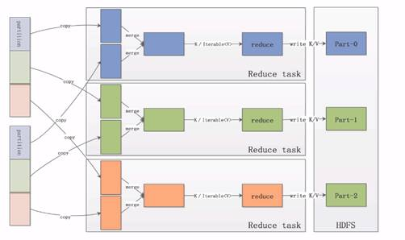
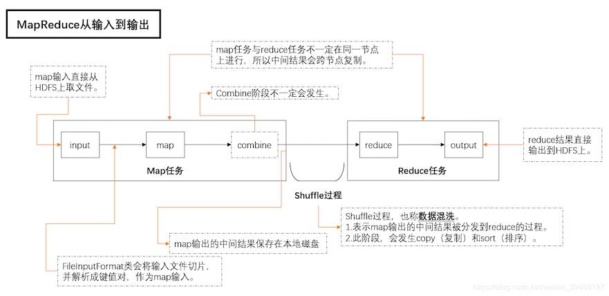
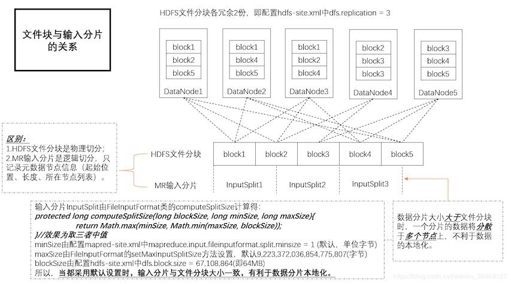
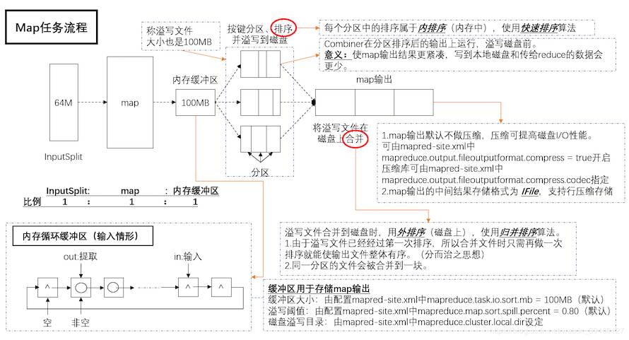
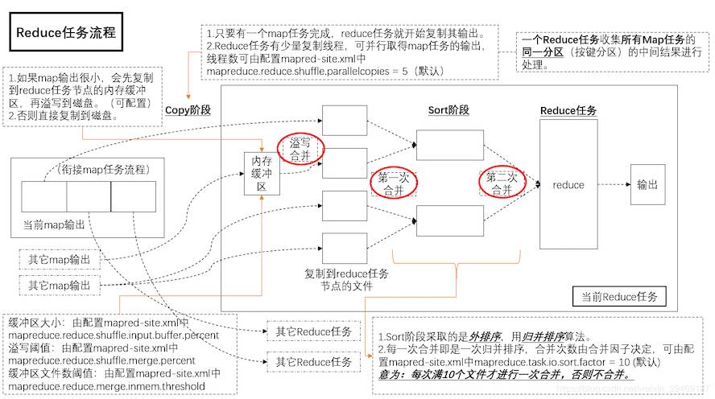
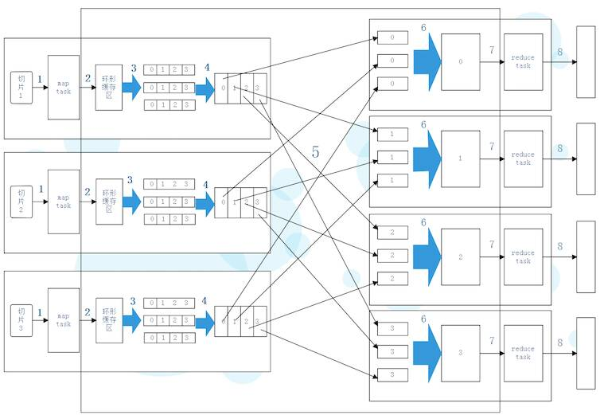
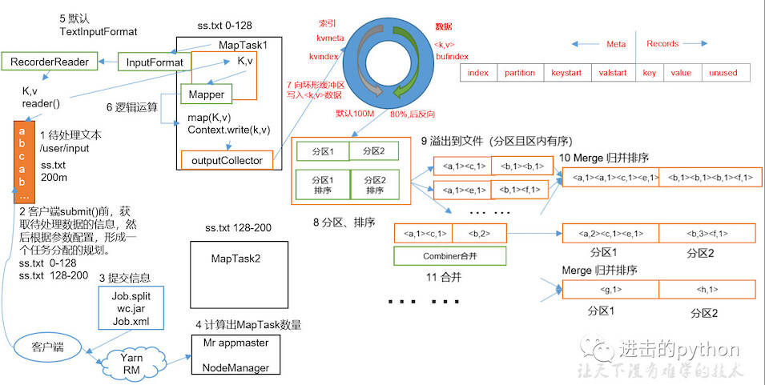
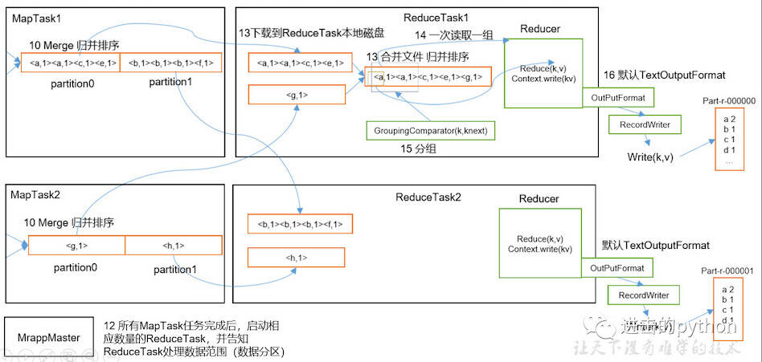
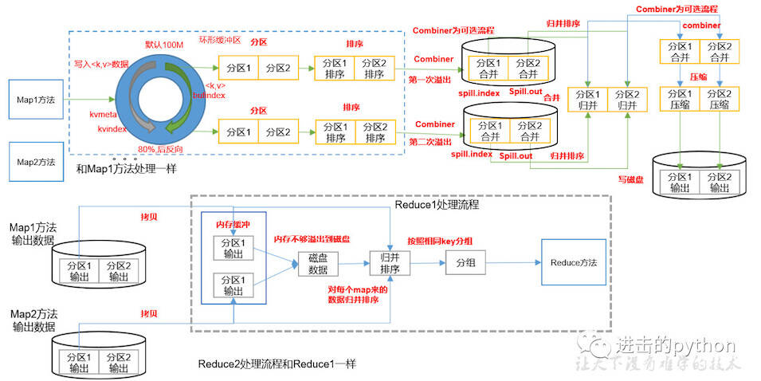
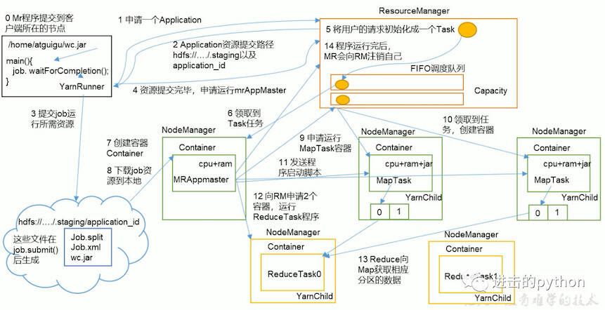

# MapReduce

::: tip 此文为转载 （通常一篇文章会参考多处，也会添加自己的理解，引用地址如有遗漏，请指出）

- https://www.cnblogs.com/yx-zhang/p/9572221.html
- https://www.cnblogs.com/52mm/p/p15.html
- https://blog.csdn.net/weixin_39469127/article/details/89381223
- https://www.cnblogs.com/kocdaniel/p/11637888.html

:::

<br />

多篇文章转载，原文内容参考上面的链接


## 文章1

### **Map的原理和运行流程**

**Map的输入数据源是多种多样的，我们使用hdfs作为数据源**。文件在hdfs上是以block(块，Hdfs上的存储单元)为单位进行存储的。

<div style="display:flex;"></div>
<br>

**1.分片**

<div style="display:flex;"></div>
<br>

我们将这一个个block划分成数据分片，即Split（分片，逻辑划分，不包含具体数据，只包含这些数据的位置信息）,那么上图中的第一个Split则对应两个个文件块，第二个Split对应一个块。需要注意的是一个Split只会包含一个File的block,不会跨文件。

**2. 数据读取和处理**

<div style="display:flex;"></div>
<br>

当我们把数据块分好的时候，MapReduce(以下简称mr)程序将这些分片以key-value的形式读取出来，并且将这些数据交给用户自定义的Map函数处理。

**3.**

<div style="display:flex;"></div>
<br>

用户处理完这些数据后同样以key-value的形式将这些数据写出来交给mr计算框架。mr框架会对这些数据进行划分，此处用进行表示。不同颜色的partition矩形块表示为不同的partition，同一种颜色的partition最后会分配到同一个reduce节点上进行处理。

**Map是如何将这些数据进行划分的？**

默认使用Hash算法对key值进行Hash,这样既能保证同一个key值的数据划分到同一个partition中，又能保证不同partition的数据梁是大致相当的。

<br>

**总结**：

- 一个map指挥处理一个Split  
- map处理完的数据会分成不同的partition
- 一类partition对应一个reduce

那么一个mr程序中 map的数量是由split的数量决定的，reduce的数量是由partiton的数量决定的。


### Shuffle

Shuffle,翻译成中文是混洗。mr没有排序是没有灵魂的，shuffle是mr中非常重要的一个过程。他在Map执行完，Reduce执行前发生。

<div style="display:flex;"></div>
<br>

**Map阶段的shuffle**

数据经过用户自定的map函数处理完成之后，数据会放入内存中的环形缓冲区之内，，他分为两个部分，数据区和索引区。数据区是存放用户真实的数据，索引区存放数据对应的key值，partition和位置信息。当环形缓冲区数据达到一定的比例后，会将数据溢写到一个文件之中，即途中的spill（溢写）过程。<br>在溢写前，会将数据根据key和partition进行排序，排好序之后会将数据区的数据按照顺序一个个写入文件之中。这样就能保证文件中数据是按照key和parttition进行排序的。最后会将溢写出的一个个小文件合并成一个大的文件，并且保证在每一个partition中是按照Key值有序的。

**总结**:

1. Collect阶段将数据放进环形缓冲区，缓冲区分为数据区和索引区。
2. Sort阶段对在同一partition内的索引按照key排序。
3. Spill阶段跟胡排好序的索引将数据按照顺序写到文件中。
4. Merge阶段将Spill生成的小文件分批合并排序成一个大文件。

**Reduce阶段的shuffle**

reduce节点会将数据拷贝到自己的buffer缓存区中，当缓存区中的数据达到一定的比例的时候，同样会发生溢写过程，我们任然要保证每一个溢写的文件是有序的。与此同时，后台会启一个线程，将这些小文件合并成一个大文件，经过一轮又一轮的合并，最后将这些文件合并成一个大的数据集。在这个数据集中，数据是有序的，相同的key值对应的value值是挨在一起的。最后，将这些数据交给reduce程序进行聚合处理。

**总结：**

1. Copy阶段将Map端的数据分批拷贝到Reduce的缓冲区。
2. Spill阶段将内存缓存区的数据按顺序写到文件中。
3. Merge阶段将溢出的文件合并成一个排序的数据集。


### **Reduce运行过程**

<br>

<div style="display:flex;"></div>
<br>

在map处理完之后，reduce节点会将各个map节点上属于自己的数据拷贝到内存缓冲区中，最后将数据合并成一个大的数据集，并且按照key值进行聚合，把聚合后的value值作为iterable(迭代器)交给用户使用，这些数据经过用户自定义的reduce函数进行处理之后，同样会以key-value的形式输出出来，默认输出到hdfs上的文件。


### **Combine优化**

我们说mr程序最终是要将数据按照key值进行聚合，对value值进行计算，那么我们是不是可以提前对聚合好的value值进行计算？of course,我们将这个过程称为Combine。哪些场景可以进行conbine优化。如下。

**Map端：**

1. 在数据排序后，溢写到磁盘前，运行combiner。这个时候相同Key值的value值是挨在一起的，可以对这些value值进行一次聚合计算，比如说累加。
2. 溢写出的小文件合并之前，我们也可以执行一次combiner,需要注意的是mr程序默认至少存在三个文件才进行combiner,否则mr会认为这个操作是不值得的。当然这个值可以通过min.num.spills.for.combine设置。

**Reduce端：**

1. 和map端一样，在合并溢出文件输出到磁盘之前，运行combiner。


### **整个MR过程图**

<br>

<div style="display:flex;"></div>


## 文章二

### **MapReduce从输入到输出**

<br>

<div style="display:flex;"></div>
<br>

### **文件块与输入分片的关系**

<br>

<div style="display:flex;"></div>
<br>

### **map及中间结果的输出**

<br>

<div style="display:flex;"></div>
<br>

### **shuffle及reduce过程**

<br>

<div style="display:flex;"></div>
<br>


## 文章三

### **mapreduce的简介和优点**

- mapreduce是一个分布式运算程序的编程框架,是hadoop数据分析的核心.
- mapreduce的核心思想是将用户编写的逻辑代码和架构中的各个组件整合成一个分布式运算程序,实现一定程序的并行处理海量数据,提高效率.
- 海量数据难以在单机上处理,而一旦将单机版程序扩展到集群上进行分布式运行势必将大大增加程序的复杂程度.引入mapreduce架构,开发人员可以将精力集中于数据处理的核心业务逻辑上,而将分布式程序中的公共功能封装成框架,以降低开发的难度.
- 一个完整的mapreduce程序有三类实例进程
  - **MRAppMaster:负责整个程序的协调过程**
  - **MapTask:负责map阶段的数据处理**
  - **ReduceTask:负责reduce阶段的数据处理**


### **案例(统计各个手机号的上传和下载流量总和)**

数据展示

```yaml
1363157985066   13726230503 00-FD-07-A4-72-B8:CMCC  120.196.100.82  24  27  2481    24681   200
1363157995052   13826544101 5C-0E-8B-C7-F1-E0:CMCC  120.197.40.4    4   0   264 0   200
1363157991076   13926435656 20-10-7A-28-CC-0A:CMCC  120.196.100.99  2   4   132 1512    200
1363154400022   13926251106 5C-0E-8B-8B-B1-50:CMCC  120.197.40.4    4   0   240 0   200
1363157985066   13726230503 00-FD-07-A4-72-B8:CMCC  120.196.100.82  24  27  2481    24681   200
1363157995052   13826544101 5C-0E-8B-C7-F1-E0:CMCC  120.197.40.4    4   0   264 0   200
1363157991076   13926435656 20-10-7A-28-CC-0A:CMCC  120.196.100.99  2   4   132 1512    200
1363154400022   13926251106 5C-0E-8B-8B-B1-50:CMCC  120.197.40.4    4   0   240 0   200
```

> 数据解释:<br>每行数据的第二列数据是手机号,倒数第三列表示上行流量,倒数第二列表示下行流量
>
> 要求:<br>根据总流量降序排列
>
> 输出格式要求:<br>手机号 上行流量    下行流量    总流量

创建bean对象用于封装上行流量,下行流量和总流量:

```java
package com.xiaojie.flowcount;
import java.io.DataInput;
import java.io.DataOutput;
import java.io.IOException;
import org.apache.hadoop.io.Writable;
import org.apache.hadoop.io.WritableComparable;

//作为key输出的时候都要排序
//不要排序的话，可实现Writable
//实现WritableComparable是为了实现比较大小，排序的功能
public class FlowBean implements WritableComparable<FlowBean>{
    private Long upFlow;
    private Long downFlow;
    private Long sumFlow;

    //反序列化时需要反射调用空参构造函数，显示地定义一个
    public FlowBean(){}

    public FlowBean(Long upFlow, Long downFlow) {
        this.upFlow = upFlow;
        this.downFlow = downFlow;
        this.sumFlow = upFlow + downFlow; 
    }
    public void set(Long upFlow, Long downFlow) {
        this.upFlow = upFlow;
        this.downFlow = downFlow;
        this.sumFlow = upFlow + downFlow; 
    }
    public Long getUpFlow() {
        return upFlow;
    }
    public void setUpFlow(Long upFlow) {
        this.upFlow = upFlow;
    }
    public Long getDownFlow() {
        return downFlow;
    }
    public void setDownFlow(Long downFlow) {
        this.downFlow = downFlow;
    }

    //反序列化方法
    public void readFields(DataInput in) throws IOException {
        //反序列化的顺序和序列化的顺序一致
        upFlow = in.readLong();
        downFlow = in.readLong();
        sumFlow = in.readLong();
    }

    //序列化方法
    public void write(DataOutput out) throws IOException {
        // TODO Auto-generated method stub
        out.writeLong(upFlow);
        out.writeLong(downFlow);
        out.writeLong(sumFlow);
    }
    public Long getSumFlow() {
        return sumFlow;
    }

    public void setSumFlow(Long sumFlow) {
        this.sumFlow = sumFlow;
    }
    //toString方法可控制bean对象被写出在文件时的格式
    @Override
    public String toString() {
        return  upFlow + "\t" + downFlow + "\t" + sumFlow ;
    }
    //大的话返回-1,表示排在前面,即降序排序
    public int compareTo(FlowBean o) {  
        return this.sumFlow > o.getSumFlow()?-1:1;
    }
}
```

第一个map方法:

```java
static class FlowCountMapper extends Mapper<LongWritable, Text, Text, FlowBean>{
  @Override
  protected void map(LongWritable key, Text value, Mapper<LongWritable, Text, Text, FlowBean>.Context context)
    throws IOException, InterruptedException {
    //每一行读进来的数据转化为String类型
    String line = value.toString();
    //根据tab分割
    String[] fields = line.split("\t");
    //取出手机号
    String phonenum = fields[1];
    //取出上行流量  将String转为Long
    Long upFlow = Long.parseLong(fields[fields.length-3]);
    //取出下行流量
    long downFlow = Long.parseLong(fields[fields.length-2]);
    //把数据发送给reduce
    context.write(new Text(phonenum), new FlowBean(upFlow, downFlow));
  }
}
```

partition(分区方法):

```java
//根据省份分发给不同的reduce程序，其输入数据是map的输出
public class ProvincePartitioner extends Partitioner<Text, FlowBean>{
    public static HashMap<String, Integer> provinceDict = new HashMap<String, Integer>();
    static{
        provinceDict.put("136", 0);
        provinceDict.put("137", 1);
        provinceDict.put("138", 2);
        provinceDict.put("139", 3);
    }
    //返回的是分区号  给哪个reduce
    @Override
    public int getPartition(Text key, FlowBean value, int num_partitioner) {
		//根据手机号前三位分省份，分给不同的reduce
        String phone_num = key.toString().substring(0, 3);
        Integer provinceId = provinceDict.get(phone_num);
        return provinceId==null?4:provinceId;
    }
}
```

第一个reduce方法:

```java
static class FlowCountReducer extends Reducer<Text, FlowBean, Text, FlowBean>{
    //(18989,[bean1,bean2,bean3])
    @Override
    protected void reduce(Text key, Iterable<FlowBean> values, Context context)
            throws IOException, InterruptedException {
        long sum_upflow = 0;
        long sum_downflow = 0;
        
				//将上行流量和下行流量分别累加
        
        for(FlowBean bean:values){
            sum_upflow += bean.getUpFlow();
            sum_downflow += bean.getDownFlow();
        }
        FlowBean resultBean = new FlowBean(sum_upflow,sum_downflow);
        context.write(key, resultBean);
    }
}
```

第一个驱动类

```java
public static void main(String[] args) throws IOException, ClassNotFoundException, InterruptedException {
        Configuration conf = new Configuration();
//      将默认配置文件传给job
        Job job = Job.getInstance(conf);
//      告诉yarn  jar包在哪
        job.setJarByClass(FlowCount.class);
        //指定job要使用的map和reduce
        job.setMapperClass(FlowCountMapper.class);
        job.setReducerClass(FlowCountReducer.class);
//      指定map的输出类型
        job.setMapOutputKeyClass(Text.class);
        job.setMapOutputValueClass(FlowBean.class);
//      指定最终输出的类型
        job.setOutputKeyClass(Text.class);
        job.setOutputValueClass(FlowBean.class);
//      job的输入数据所在的目录
//      第一个参数：给哪个job设置
//      第二个参数：输入数据的目录，多个目录用逗号分隔
        FileInputFormat.setInputPaths(job, new Path("/home/miao/input/flowcount/"));
//      job的数据输出在哪个目录
        FileOutputFormat.setOutputPath(job, new Path("/home/miao/output/flowcount/"));
        //将jar包和配置文件提交给yarn
//      submit方法提交作业就退出该程序
//      job.submit();
//      waitForCompletion方法提交作业并等待作业执行
//      true表示将作业信息打印出来，该方法会返回一个boolean值，表示是否成功运行
        boolean result = job.waitForCompletion(true);
//      mr运行成功返回true，输出0表示运行成功，1表示失败
        System.exit(result?0:1);
}
```

执行结果:

```yaml
13726230503 4962    49362   54324
13826544101 528 0   528
13926251106 480 0   480
13926435656 264 3024    3288
```

结果分析:<br>输出数据的格式已经符合了要求,但是并没有按照总流量大小降序排列,需要再写第二个mapreduce来达到最终结果

第二个map方法:

```java
static class FlowCountSortMapper extends Mapper<LongWritable, Text, FlowBean, Text>{

  FlowBean bean = new FlowBean();
  Text phone = new Text();

  @Override
  protected void map(LongWritable key, Text value, Context context)
    throws IOException, InterruptedException {
    //拿到的是上一个mapreduce程序的输出结果，各手机号和流量信息
    String line = value.toString();
    String[] fields = line.split("\t");
    //获取手机号
    String phonenum = fields[0];
    //获取上行流量
    long upFlow = Long.parseLong(fields[1]);
    //获取下行流量
    long downFlow = Long.parseLong(fields[2]);
    //多次调用map函数时，只创建一个对象
    bean.set(upFlow, downFlow);
    phone.set(phonenum);

    //          write时，就将bean对象序列化出去了  reducer那边反序列化回对象  根据bean对象的sumFlow排序
    //map结束后会分发给reduce，默认根据key的hash函数进行分发
    //reduce要实现全局有序，必须只有一个reduce，否则分成多个reduce，只有在每个reduce产生的文件里是有序的
    context.write(bean, phone);
}
```

第二个reduce方法:

```java
static class FlowCountSortReducer extends Reducer<FlowBean, Text, Text, FlowBean>{
    
    //<bean(),phonenum> 相同key的被分为一组，一起执行一次reduce
    //对于key是对象的情况下，不可能有两个对象相同（即使上行流量下行流量都相同），所以每组都只有一条数据
    @Override
    protected void reduce(FlowBean bean, Iterable<Text> values, Context context)
            throws IOException, InterruptedException {
        context.write(values.iterator().next(), bean);
    }
}
```

第二个驱动方法:

```java
    public static void main(String[] args) throws IOException, ClassNotFoundException, InterruptedException {
        Configuration conf = new Configuration();
//      将默认配置文件传给job
        Job job = Job.getInstance(conf);
        //指定自定义的map数据分区器
        //job.setPartitionerClass(ProvincePartitioner.class);
        //根据partitioner里的分区数量，设置reduce的数量
        //job.setNumReduceTasks(5);
//      告诉yarn  jar包在哪
        job.setJarByClass(FlowCountSort.class);
        //指定job要使用的map和reduce
        job.setMapperClass(FlowCountSortMapper.class);
        job.setReducerClass(FlowCountSortReducer.class);
//      指定map的输出类型
        job.setMapOutputKeyClass(FlowBean.class);
        job.setMapOutputValueClass(Text.class);
//      指定最终输出的类型
        job.setOutputKeyClass(Text.class);
        job.setOutputValueClass(FlowBean.class);
//      job的输入数据所在的目录
//      第一个参数：给那个job设置
//      第二个参数：输入数据的目录，多个目录用逗号分隔
        FileInputFormat.setInputPaths(job, new Path(args[0]));
        //适用于做测试，不建议这么做 
        Path outpath = new Path(args[1]);
        //根据配置文件获取hdfs客户端对象
        FileSystem fs = FileSystem.get(conf);
//      如果输出目录存在就将其删除
        if(fs.exists(outpath)){
           fs.delete(outpath, true);
        }
//      job的数据输出在哪个目录
        FileOutputFormat.setOutputPath(job, outpath);
        //将jar包和配置文件提交给yarn
//      submit方法提交作业就退出该程序
//      job.submit();
//      waitForCompletion方法提交作业并等待作业执行
//      true表示将作业信息打印出来，该方法会返回一个boolean值，表示是否成功运行
        boolean result = job.waitForCompletion(true);
//      mr运行成功返回true，输出0表示运行成功，1表示失败
        System.exit(result?0:1);
    }
```

输出结果:

```yaml
13726230503 4962    49362   54324
13926435656 264 3024    3288
13826544101 528 0   528
13926251106 480 0   480
```

结果分析:<br>已满足格式要求,并按总流量降序

### **mapreduce详细流程图文详解**

<br>

<div style="display:flex;"></div>

<br>

**1.切片**

- 在FileInputFormat中，计算切片大小的逻辑：Math.max(minSize, Math.min(maxSize, blockSize))
- minSize的默认值是1,而maxSize的默认值是long类型的最大值,即可得切片的默认大小是blockSize(128M)
- maxSize参数如果调得比blocksize小，则会让切片变小，而且就等于配置的这个参数的值
- minSize参数调的比blockSize大，则可以让切片变得比blocksize还大
- hadoop为每个分片构建一个map任务,可以并行处理多个分片上的数据,整个数据的处理过程将得到很好的负载均衡,因为一台性能较强的计算机能处理更多的数据分片.
- 分片也不能切得太小,否则多个map和reduce间数据的传输时间,管理分片,构建多个map任务的时间将决定整个作业的执行时间.(大部分时间都不在计算上)

如果文件大小小于128M,则该文件不会被切片,不管文件多小都会是一个单独的切片,交给一个maptask处理.如果有大量的小文件,将导致产生大量的maptask,大大降低集群性能.

**大量小文件的优化策略:**

- 在数据处理的前端就将小文件整合成大文件，再上传到hdfs上，即避免了hdfs不适合存储小文件的缺点,又避免了后期使用mapreduce处理大量小文件的问题。(最提倡的做法)
- 小文件已经存在hdfs上了，可以使用另一种inputformat来做切片(CombineFileInputFormat),它的切片逻辑和FileInputFormat（默认）不同，它可以将多个小文件在逻辑上规划到一个切片上，交给一个maptask处理。

**2.环形缓存区**

- 经过map函数的逻辑处理后的数据输出之后，会通过OutPutCollector收集器将数据收集到环形缓存区保存。
- 环形缓存区的大小默认为100M,当保存的数据达到80%时,就将缓存区的数据溢出到磁盘上保存。

**3.溢出**

- 环形缓存区的数据达到其容量的80%时就会溢出到磁盘上进行保存,在此过程中,程序会对数据进行分区(默认HashPartition)和排序(默认根据key进行快排)
- 缓存区不断溢出的数据形成多个小文件

**4.合并**

- 溢出的多个小文件各个区合并在一起(0区和0区合并成一个0区),形成大文件
- 通过归并排序保证区内的数据有序

**5.shuffle**

从过程2到过程7之间,即map任务和reduce任务之间的数据流称为shuffle(混洗),而过程5最能体现出混洗这一概念。一般情况下，一个reduce任务的输入数据来自与多个map任务，多个reduce任务的情况下就会出现如过程5所示的，每个reduce任务从map的输出数据中获取属于自己的那个分区的数据。

**6.合并**

运行reducetask的节点通过过程5，将来自多个map任务的属于自己的分区数据下载到本地磁盘工作目录。这多个分区文件通过归并排序合并成大文件，并根据key值分好组（key值相同的，value值会以迭代器的形式组在一起）。

**7.reducetask**

reducetask从本地工作目录获取已经分好组并且排好序的数据，将数据进行reduce函数中的逻辑处理。

**8.输出**

每个reducetask输出一个结果文件。


### **partition（分区）**

数据从环形缓存区溢出到文件的过程中会根据用户自定义的partition函数进行分区，如果用户没有自定义该函数，程序会用默认的partitioner通过哈希函数来分区，hash partition 的好处是比较弹性，跟数据类型无关，实现简单，只需要设置reducetask的个数。分区的目的是将整个大数据块分成多个数据块，通过多个reducetask处理后，输出多个文件。通常在输出数据需要有所区分的情况下使用自定义分区，如在上述的**流量统计**的案例里，如果需要最后的输出数据再根据手机号码的省份分成几个文件来存储，则需要自定义partition函数，并在驱动程序里设置reduce任务数等于分区数（job.setNumReduceTasks(5);）和指明自己定义的partition（job.setPartitionerClass(ProvincePartitioner.class)）。在需要获取统一的输出结果的情况下，不需要自定义partition也不用设置reducetask的数量（默认1个）。

自定义的分区函数有时会导致数据倾斜的问题，即有的分区数据量极大，各个分区数据量不均匀，这会导致整个作业时间取决于处理时间最长的那个reduce，应尽量避免这种情况发生。

### **combiner（map端的reduce）**

集群的带宽限制了mapreduce作业的数量，因此应该尽量避免map和reduce任务之间的数据传输。hadoop允许用户对map的输出数据进行处理，用户可自定义combiner函数（如同map函数和reduce函数一般），其逻辑一般和reduce函数一样，combiner的输入是map的输出，combiner的输出作为reduce的输入，很多情况下可以直接将reduce函数作为conbiner函数来使用（job.setCombinerClass(FlowCountReducer.class);）。combiner属于优化方案，所以无法确定combiner函数会调用多少次，可以在环形缓存区溢出文件时调用combiner函数，也可以在溢出的小文件合并成大文件时调用combiner。但要保证不管调用几次combiner函数都不会影响最终的结果，所以不是所有处理逻辑都可以使用combiner组件，有些逻辑如果在使用了combiner函数后会改变最后rerduce的输出结果（如求几个数的平均值，就不能先用combiner求一次各个map输出结果的平均值，再求这些平均值的平均值，这将导致结果错误）。

combiner的意义就是对每一个maptask的输出进行局部汇总，以减小网络传输量。（原先传给reduce的数据是（a，（1,1,1,1,1,1...））,使用combiner后传给reduce的数据变为（a，（4,2,3,5...）））

### **分组**

分组和上面提到的partition（分区）不同，分组发生在reduce端，reduce的输入数据，会根据key是否相等而分为一组，如果key相等的，则这些key所对应的value值会作为一个迭代器对象传给reduce函数。以单词统计为例，reduce输入的数据就如：第一组：（a，（1,3,5,3,1））第二组：（b，（6,2,3,1,5））。上述例子也可以看出在map端是执行过combiner函数的，否则reduce获得的输入数据是：第一组：（a，（1,1,1,1,1，...））第二组：（b，（1,1,1,1,1...））。对每一组数据调用一次reduce函数。

值得一提的是如果key是用户自定义的bean对象，那么就算两个对象的内容都相同，这两个bean对象也不相等，也会被分为两组。如上述流量统计案例里自定义的flowbean对象，就算是上行流量下行流量相等的两个flowbean对象也不会被分为一组。这种bean作为key的情况下，如果处理逻辑需要将两个bean归为一个组，则需要另外的方法（我会在之后的文章中给出）。

### **排序**

在整个mapreduce过程中涉及到多处对数据的排序，环形缓存区溢出的文件，溢出的小文件合并成大文件，reduce端多个分区数据合并成一个大的分区数据等都需要排序，而这排序规则是根据key的compareTo方法来的。

map端输出的数据的顺序不一定是reduce端输入数据的顺序，因为在这两者之间数据经过了排序，但reduce端输出到文件上显示的顺序就是reduce函数的写出顺序。在没有reduce函数的情况下，显示地在驱动函数里将reduce的数量设置为0（设置为0后表示没有reduce阶段，也就没有shuffle阶段，也就不会对数据进行各种排序分组），否则虽然没有reduce逻辑，但是还是会有shuffle阶段，map端处理完数据后将数据保存在文件上的顺序也不是map函数的写出顺序，而是经过shuffle分组排序过后的顺序

### **MapTask和ReduceTask的并行度**

有几个maptask是由程序决定的，默认情况下使用FileInputFormat读入数据，maptask数量的依据有一下几点：

- 文件大小小于128M（默认）的情况下，有几个文件就有几个maptask
- 大于128M的文件，根据切片规则，有几个分片就有几个maptask
- 并不是maptask数量越多越好，太多maptask可能会占用大量数据传输等时间，降低集群计算时间，降低性能。大文件可适当增加blocksize的大小，如将128M的块大小改为256M或512M，这样切片的大小也会增大，切片数量也就减少了，相应地减少maptask的数量。如果小文件太多，可用上述提到过的小文件优化策略减少maptask的数量。

有几个reducetask是用户决定的，用户可以根据需求，自定义相应的partition函数，将数据分成几个区，相应地将reducetask的数量设置成分区数量。（设置5个reducetask，job.setNumReduceTasks(5)）

### **YARN**

- 用户提交的程序的运行逻辑对yarn是透明的，yarn并不需要知道。
- yarn只提供运算资源的调度（用户程序向yarn申请资源，yarn就负责分配资源）。
- yarn中的老大叫ResourceManager（知道所有小弟的资源情况，以做出资源分配），yarn中具体提供运算资源的角色叫NodeManager（小弟）。
- yarn与运行的用户程序完全解耦，就意味着yarn上可以运行各种类型的分布式运算程序（mapreduce只是其中的一种），比如mapreduce、storm程序，spark程序...只要他们各自的框架中有符合yarn规范的资源请求机制即可。
- Yarn是一个通用的资源调度平台，企业中存在的各种运算集群都可以整合在一个物理集群上，提高资源利用率，方便数据共享。
- Yarn是一个资源调度平台，负责为运算程序提供服务器运算资源，相当于一个分布式的操作系统平台，而mapreduce等运算程序则相当于运行于操作系统之上的应用程序。

### **MapReduce与Yarn**

*to see in Yarn section*

### **数据本地化优化**

在第7步，MRAppmaster向ResourceManager请求容器用于运行maptask时，在请求信息中有map所需要处理的分片数据所在的主机和相应的机架信息（即告诉MRAppmaster需要处理的数据在哪里），调度器根据这些信息做出调度决策。

1. 最理想的情况是将任务分配到数据本地化的节点上，这样一来map的输入数据不需要从其他节点通过网络传输过来，大大提高了性能。
2. 如果存储所需处理的三个HDFS数据块备份的三个节点都在运行其他map任务，处于忙碌状态，资源不足以再开辟一个容器来运行maptask。此时调度器会选择一个与数据所在节点同机架的节点来开辟容器，运行maptask。
3. 如果在同一机架上的节点都处于忙碌状态，调度器才会选择跨机架的节点，这会导致机架与机架之间的数据传输，是三种方式中性能最低的。

### **map和reduce的输出结果存放位置**

map任务将其输出写到本地硬盘而不是HDFS，因为map任务的输出结果是中间结果，并不是最终结果，在mr程序结束后，map的输出结果就可以被删除，将其存在可靠的HDFS上一来是没必要浪费HDFS集群的空间，二来是没有存在本地硬盘的速度快。

reduce任务的输出是最终的输出结果，将其存在HDFS上可保证数据的安全。

### **map，reduce任务分配**

默认情况下小于10个mapper且只有1个reducer且所需处理的数据总大小小于1个HDFS块的作业是小作业（可通过mapreduce.job.ubertask.maxmaps，mapreduce.job.ubertask.maxreduces，mapreduce.job.ubertask.maxbytes改变一个作业的默认配置），对于小作业，MRAppmaster会选择在与它同一个容器里运行任务（顺序运行），而不会去向ResourceManager请求资源。（mapreduce.job.ubertask.enable设为false将关闭小作业这一性质）。

作业不是小作业的情况下，MRAppmaster会向ResourceManager请求资源，ResourceManager根据数据本地化优化原则分配相应的容器。在默认情况下map任务和reduce任务都分配到1024MB的内存（可通过mapreduce.map.memory.mb和mapreduce.map.memory.mb来设置map任务和reduce任务的使用内存空间）。

调度器在分配容器时有两个参数，yarn.schedule.capacity.minimum-allocation-mb和yarn.schedule.capacity.minimum-allocation-mb，分别表示容器的最小可分配内存和最大可分配内存，默认值分别是1024MB和10240MB，手动给map，reduce任务分配内存空间时，应设置为容器最小可分配内存的整数倍且不大于最大可分配内存。在不设置map和reduce任务的使用内存情况下，调度器会自己根据任务的需要分配最接近的倍数的内存给容器。

### **map，reduce任务的并行**

小作业的情况下，所有的map任务会在一个容器里顺序执行，所有map任务处理完后再执行1个reduce任务。是大作业的话，所有map任务会分别发送到不同容器里并行运行。而在一个节点上可以并行运行几个map，reduce任务，取决于节点的资源和每个任务所需的资源（如节点资源为8核8G可用内存，每个任务需要1个核1G内存，则该节点理论上可以开辟8个容器，并行执行8个任务）。在多个节点上的任务并行更是理所当然的，值得一提的是属于同一个作业的map任务和reduce任务不能并行，reduce任务一定是在接收到来自所有map任务的分区数据后再执行。

### **mapreduce输出数据压缩**

map或reduce函数的输出可以压缩，减少网络io时间和存储空间，但相应地增加了cpu负担。

- 计算密集型的任务，少用压缩，将更多的cpu性能用在计算上
- io密集型的任务，使用压缩提高mr速度

相应配置：

```properties
#map输出压缩
mapreduce.map.output.compress=true
mapreduce.map.output.compress.codec=org.apache.hadoop.io.compress.DefaultCodec
#也可在驱动类中写相应的代码
conf.setBoolean(Job.MAP_OUTPUT_COMPRESS, true);
conf.setClass(Job.MAP_OUTPUT_COMPRESS_CODEC, GzipCodec.class, CompressionCodec.class);

#reduce输出压缩
mapreduce.output.fileoutputformat.compress=true
mapreduce.output.fileoutputformat.compress.codec=org.apache.hadoop.io.compress.DefaultCodec
mapreduce.output.fileoutputformat.compress.type=RECORD
#也可在驱动类中写相应代码
Job job = Job.getInstance(conf);
FileOutputFormat.setCompressOutput(job, true);
FileOutputFormat.setOutputCompressorClass(job, (Class<? extends CompressionCodec>) Class.forName(""));
```


## 文章4

### **MapReduce详细工作流程之Map阶段**

<br>

<div style="display:flex;"></div>

<br>

- 首先有一个200M的待处理文件
- 切片：在客户端提交之前，根据参数配置，进行任务规划，将文件按128M每块进行切片
- 提交：提交可以提交到本地工作环境或者Yarn工作环境，本地只需要提交切片信息和xml配置文件，Yarn环境还需要提交jar包；本地环境一般只作为测试用
- 提交时会将每个任务封装为一个job交给Yarn来处理（详细见后边的Yarn工作流程介绍），计算出MapTask数量（等于切片数量），每个MapTask并行执行
- MapTask中执行Mapper的map方法，此方法需要k和v作为输入参数，所以会首先获取kv值；
  - 首先调用InputFormat方法，默认为TextInputFormat方法，在此方法调用createRecoderReader方法，将每个块文件封装为k，v键值对，传递给map方法
- map方法首先进行一系列的逻辑操作，执行完成后最后进行写操作
- map方法如果直接写给reduce的话，相当于直接操作磁盘，太多的IO操作，使得效率太低，所以在map和reduce中间还有一个shuffle操作
  - map处理完成相关的逻辑操作之后，首先通过outputCollector向环形缓冲区写入数据，环形缓冲区主要两部分，一部分写入文件的元数据信息，另一部分写入文件的真实内容
  - 环形缓冲区的默认大小是100M，当缓冲的容量达到默认大小的80%时，进行**反向**溢写
- 在溢写之前会将缓冲区的数据按照指定的分区规则进行分区和排序，之所以反向溢写是因为这样就可以边接收数据边往磁盘溢写数据
- 在分区和排序之后，溢写到磁盘，可能发生多次溢写，溢写到多个文件
- 对所有溢写到磁盘的文件进行归并排序
- 在9到10步之间还可以有一个Combine合并操作，意义是对每个MapTask的输出进行局部汇总，以减少网络传输量
  - Map阶段的进程数比Reduce阶段要多，所以放在Map阶段处理效率更高
  - Map阶段合并之后，传递给Reduce的数据就会少很多
  - 但是Combiner能够应用的前提是不能影响最终的业务逻辑，而且Combiner的输出kv要和Reduce的输入kv类型对应起来

> 整个MapTask分为Read阶段，Map阶段，Collect阶段，溢写（spill）阶段和combine阶段
>
> - Read阶段：MapTask通过用户编写的RecordReader，从输入InputSplit中解析出一个个key/value
> - Map阶段：该节点主要是将解析出的key/value交给用户编写map()函数处理，并产生一系列新的key/value
> - Collect收集阶段：在用户编写map()函数中，当数据处理完成后，一般会调用OutputCollector.collect()输出结果。在该函数内部，它会将生成的key/value分区（调用Partitioner），并写入一个环形内存缓冲区中
> - Spill阶段：即“溢写”，当环形缓冲区满后，MapReduce会将数据写到本地磁盘上，生成一个**临时文件**。需要**注意**的是，将数据写入本地磁盘之前，先要对数据进行一次本地排序，并在必要时对数据进行合并、压缩等操作

### **MapReduce详细工作流程之Reduce阶段**

<br>

<div style="display:flex;"></div>

<br>

如上图所示

1. 所有的MapTask任务完成后，启动相应数量的ReduceTask（和分区数量相同），并告知ReduceTask处理数据的范围
2. ReduceTask会将MapTask处理完的数据拷贝一份到磁盘中，并合并文件和归并排序
3. 最后将数据传给reduce进行处理，一次读取一组数据
4. 最后通过OutputFormat输出

> 整个ReduceTask分为Copy阶段，Merge阶段，Sort阶段（Merge和Sort可以合并为一个），Reduce阶段。
>
> - Copy阶段：ReduceTask从各个MapTask上远程拷贝一片数据，并针对某一片数据，如果其大小超过一定阈值，则写到磁盘上，否则直接放到内存中
> - Merge阶段：在远程拷贝数据的同时，ReduceTask启动了两个后台线程对内存和磁盘上的文件进行合并，以防止内存使用过多或磁盘上文件过多
> - Sort阶段：按照MapReduce语义，用户编写reduce()函数输入数据是按key进行聚集的一组数据。为了将key相同的数据聚在一起，Hadoop采用了基于排序的策略。由于各个MapTask已经实现对自己的处理结果进行了局部排序，因此，ReduceTask只需对所有数据进行一次归并排序即可
> - Reduce阶段：reduce()函数将计算结果写到HDFS上


### **Shuffle机制**

<br>

<div style="display:flex;"></div>

<br>

Map方法之后，Reduce方法之前的数据处理过程称之为Shuffle。shuffle流程详解如下：

1. MapTask收集map()方法输出的kv对，放到环形缓冲区中
2. 从环形缓冲区不断溢出到本地磁盘文件，可能会溢出多个文件
3. 多个溢出文件会被合并成大的溢出文件
4. 在溢出过程及合并的过程中，都要调用Partitioner进行分区和针对key进行排序
5. ReduceTask根据自己的分区号，去各个MapTask机器上取相应的结果分区数据
6. ReduceTask将取到的来自同一个分区不同MapTask的结果文件进行归并排序
7. 合并成大文件后，shuffle过程也就结束了，进入reduce方法


### **Yarn工作机制**

<br>

<div style="display:flex;"></div>

<br>

job提交全过程

1. MR程序提交到客户端所在的节点，YarnRunner向ResourceManager申请一个Application
2. RM将该Application的资源路径和作业id返回给YarnRunner
3. YarnRunner将运行job所需资源提交到HDFS上
4. 程序资源提交完毕后，申请运行mrAppMaster
5. RM将用户的请求初始化成一个Task
6. 其中一个NodeManager领取到Task任务
7. 该NodeManager创建容器Container，并产生MRAppmaster
8. Container从HDFS上拷贝资源到本地
9. MRAppmaster向RM 申请运行MapTask资源
10. RM将运行MapTask任务分配给另外两个NodeManager，另两个NodeManager分别领取任务并创建容器
11. MR向两个接收到任务的NodeManager发送程序启动脚本，这两个NodeManager分别启动MapTask，MapTask对数据分区排序
12. MrAppMaster等待所有MapTask运行完毕后，向RM申请容器，运行ReduceTask
13. ReduceTask向MapTask获取相应分区的数据
14. 程序运行完毕后，MR会向RM申请注销自己

