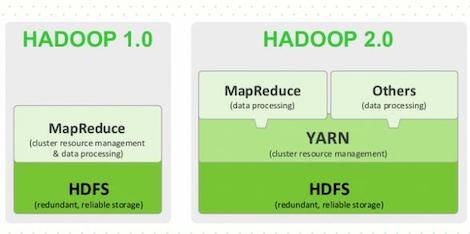

# 分布式系统基础框架Hadoop

一段来自官网的介绍：

The Apache™ Hadoop® project develops open-source software for reliable, scalable, distributed computing.

The Apache Hadoop software library is a framework that allows for the distributed processing of large data sets across clusters of computers using simple programming models. It is designed to scale up from single servers to thousands of machines, each offering local computation and storage. Rather than rely on hardware to deliver high-availability, the library itself is designed to detect and handle failures at the application layer, so delivering a highly-available service on top of a cluster of computers, each of which may be prone to failures.

Hadoop 是一个由 Apache 基金会用java 语言实现的分布式系统基础架构，它可以使用户在不了解分布式底层细节的情況下开发分布式程序，充分利用集群的威力进行高速运算和存储。它解決了两大问题：大数据存储、大数据分析。也就是 Hadoop 的两大核心：**HDFS** 和 **MapReduce**。

## **Hadoop是什么**

狭义上说，Hadoop 指 Apache 这款开源框架，它的核心组件有: 

- `HDFS(分布式文件系统)`:解决海量数据存储 
- `YARN(作业调度和集群资源管理的框架)`:解决资源任务调度 
- `MAPREDUCE(分布式运算编程框架)`:解决海量数据计算

广义上来说，Hadoop 通常是指一个更广泛的概念—**Hadoop 生态圈**。当下的 Hadoop 已经成长为一个庞大的体系，随着生态系统的成长，新出现 的项目越来越多，其中不乏一些非 Apache 主管的项目，这些项目对 HADOOP 是很 好的补充或者更高层的抽象。比如:

- `HDFS`:分布式文件系统
- `MAPREDUCE`:分布式运算程序开发框架
- `HIVE`:基于 HADOOP 的分布式数据仓库，提供基于 SQL 的查询数据操作 HBASE:基于 HADOOP 的分布式海量数据库 ZOOKEEPER:分布式协调服务基础组件
- `Mahout`:基于 mapreduce/spark/flink 等分布式运算框架的机器学习算法库 
- `Oozie`:工作流调度框架
- `Sqoop`:数据导入导出工具(比如用于 mysql 和 HDFS 之间) 
- `Flume`:日志数据采集框架
- `Impala`:基于 Hadoop 的实时分析
- `HBase`:分布式数据库
- ... ...

## **版本变迁**

Hadoop1.x 版本MapReduce不仅负责计算部分，同时还要负责资源管理；但自从2.0开始，Hadoop将资源管理独立出来，也就是后来的YARN。

## **Hadoop集群**

HADOOP 集群具体来说包含两个集群:`HDFS 集群`和 `YARN 集群`，两者逻辑上分 离，但物理上常在一起。

- `HDFS 集群负责海量数据的存储`，集群中的角色主要有: NameNode、DataNode、SecondaryNameNode
- `YARN 集群负责海量数据运算时的资源调度`，集群中的角色主要有: ResourceManager、NodeManager

那 mapreduce 是什么呢?它其实是一个分布式运算编程框架，是应用程序开发包，由用户按照编程规范进行程序开发，后打包运行在 HDFS 集群上，并且受到 YARN 集群的资源调度管理。

Hadoop 部署方式分三种：`Standalone mode(独立模式)`、`Pseudo-Distributed mode(伪分布式模式)`、`Cluster mode(群集模式)`，其中前两种都是在单机部署。

- 独立模式又称为单机模式，仅 1 个机器运行 1 个 java 进程，主要用于调试。 
- 伪分布模式也是在 1 个机器上运行 HDFS 的 NameNode 和 DataNode、YARN 的ResourceManger 和 NodeManager，但分别启动单独的 java 进程，主要用于调试。 
- 集群模式主要用于生产环境部署。会使用 N 台主机组成一个 Hadoop 集群。这种部署模式下，主节点和从节点会分开部署在不同的机器上。