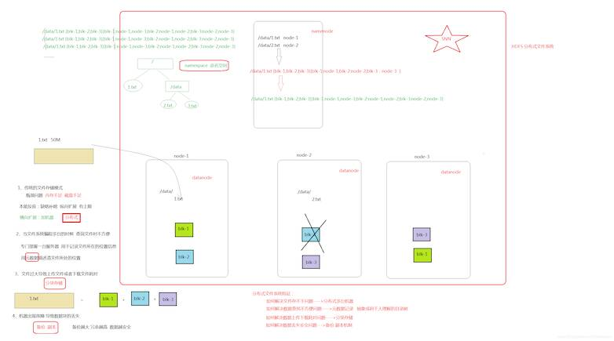
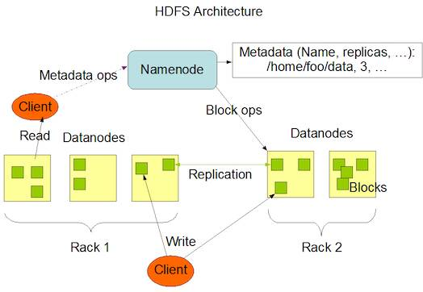
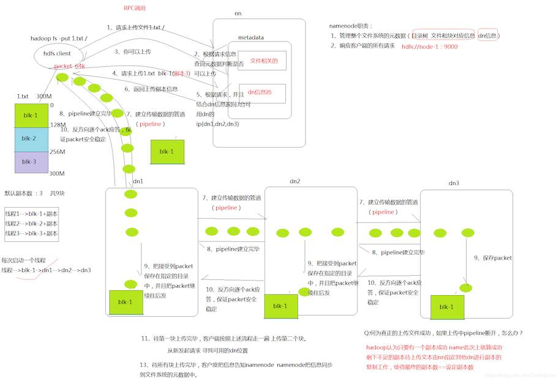
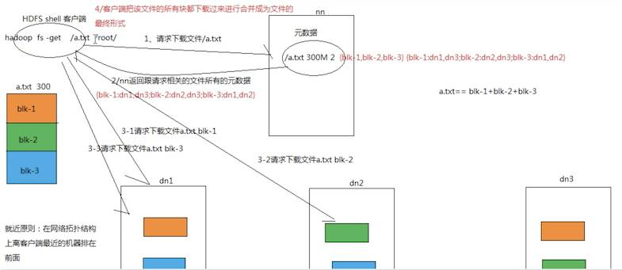
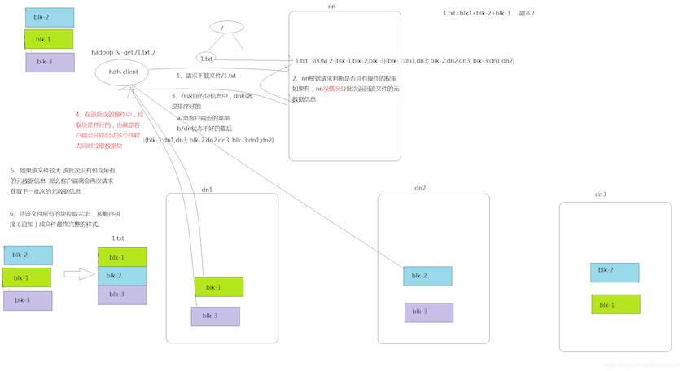

# HDFS

::: tip 此文为转载 （通常一篇文章会参考多处，也会添加自己的理解，引用地址如有遗漏，请指出）

- https://www.bilibili.com/video/av79967392?p=1
- https://blog.csdn.net/CoderBoom/article/details/84112476

:::

<br />

## **基本概念**

HDFS是Hadoop Distribute File System 的简称，意为：Hadoop分布式文件系统。是Hadoop核心组件之一，作为最底层的分布式存储服务而存在。

分布式文件系统解决的问题就是大数据存储。它们是横跨在多台计算机上的存储系统。分布式文件系统在大数据时代有着广泛的应用前景，它们为存储和处理超大规模数据提供所需的扩展能力。

### **HDFS设计目标**

- 硬件故障是常态， HDFS将有成百上千的服务器组成，每一个组成部分都有可能出现故障。因此故障的检测和自动快速恢复是HDFS的核心架构目标。
- HDFS上的应用与一般的应用不同，它们主要是以流式读取数据。HDFS被设计成适合批量处理，而不是用户交互式的。相较于数据访问的反应时间，更注重数据访问的高吞吐量。
- 典型的HDFS文件大小是GB到TB的级别。所以，HDFS被调整成支持大文件。它应该提供很高的聚合数据带宽，一个集群中支持数百个节点，一个集群中还应该支持千万级别的文件。
- 大部分HDFS应用对文件要求的是write-one-read-many访问模型。一个文件一旦创建、写入、关闭之后就不需要修改了。这一假设简化了数据一致性问题，使高吞吐量的数据访问成为可能。
- 移动计算的代价比之移动数据的代价低。一个应用请求的计算，离它操作的数据越近就越高效，这在数据达到海量级别的时候更是如此。将计算移动到数据附近，比之将数据移动到应用所在显然更好。
- 在异构的硬件和软件平台上的可移植性。这将推动需要大数据集的应用更广泛地采用HDFS作为平台。


## **HDFS重要特性**

首先，它是一个文件系统，用于存储文件，通过统一的命名空间目录树来定位文件；<br>其次，它是分布式的，由很多服务器联合起来实现其功能，集群中的服务器有各自的角色。

1. **master/slave架构**<br>HDFS采用master/slave架构。一般一个HDFS集群是有一个Namenode和一定数目的Datanode组成。Namenode是HDFS集群主节点，Datanode是HDFS集群从节点，两种角色各司其职，共同协调完成分布式的文件存储服务。
2. **分块存储**<br>HDFS中的文件在物理上是分块存储（block）的，块的大小可以通过配置参数来规定，默认大小在hadoop2.x版本中是128M。
3. **名字空间（NameSpace）**<br>HDFS支持传统的层次型文件组织结构。用户或者应用程序可以创建目录，然后将文件保存在这些目录里。文件系统名字空间的层次结构和大多数现有的文件系统类似：用户可以创建、删除、移动或重命名文件。<br>Namenode负责维护文件系统的名字空间，任何对文件系统名字空间或属性的修改都将被Namenode记录下来。<br>HDFS会给客户端提供一个统一的抽象目录树，客户端通过路径来访问文件，形如：hdfs://namenode:port/dir-a/dir-b/dir-c/file.data。
4. **Namenode元数据管理**<br>我们把目录结构及文件分块位置信息叫做元数据。Namenode负责维护整个hdfs文件系统的目录树结构，以及每一个文件所对应的block块信息（block的id，及所在的datanode服务器）。
5. **Datanode数据存储**<br>文件的各个block的具体存储管理由datanode节点承担。每一个block都可以在多个datanode上。Datanode需要定时向Namenode汇报自己持有的block信息。<br>存储多个副本（副本数量也可以通过参数设置dfs.replication，默认是3）。
6. **副本机制**<br>为了容错，文件的所有block都会有副本。每个文件的block大小和副本系数都是可配置的。应用程序可以指定某个文件的副本数目。副本系数可以在文件创建的时候指定，也可以在之后改变。
7. **一次写入，多次读出**<br>HDFS是设计成适应一次写入，多次读出的场景，且不支持文件的修改。<br>正因为如此，HDFS适合用来做大数据分析的底层存储服务，并不适合用来做.网盘等应用，因为，修改不方便，延迟大，网络开销大，成本太高。

> namenode作为hdfs的老大 , 管理着文件系统的全部元数据
>
> - 目录树
> - 文件跟块对应信息
> - datanode信息(dn是否存活 , 磁盘是否已满)
>
> 访问 : hdfs://namenode_ip:9000

模拟实现分布式文件系统图解:

<div style="display:flex;"></div>

<br>

## **HDFS基本操作**

**1． Shell 命令行客户端**

Hadoop提供了文件系统的shell命令行客户端，使用方法如下：

```sh
hadoop  fs  <args>
```

文件系统shell包括与Hadoop分布式文件系统（HDFS）以及Hadoop支持的其他文件系统（如本地FS，HFTP FS，S3 FS等）直接交互的各种类似shell的命令。所有FS shell命令都将路径URI作为参数。<br>URI格式为scheme://authority/path。对于HDFS，该scheme是hdfs，对于本地FS，该scheme是file。scheme和authority是可选的。如果未指定，则使用配置中指定的默认方案。

对于HDFS,命令示例如下：

```sh
hadoop fs -ls  hdfs://namenode:host/parent/child

hadoop fs -ls  /parent/child  #fs.defaultFS中有配置
```

对于本地文件系统，命令示例如下：

```sh
hadoop fs -ls file:///root/
```

如果使用的文件系统是HDFS，则使用hdfs dfs也是可以的，此时

```sh
hadoop fs <args> = hdfs dfs <args>
```

**2． 常用Shell 命令**

```sh
ls
使用方法：hadoop fs -ls [-h] [-R] <args>
功能：显示文件、目录信息。
示例：hadoop fs -ls /user/hadoop/file1

mkdir
使用方法：hadoop fs -mkdir [-p] <paths>
功能：在hdfs上创建目录，-p表示会创建路径中的各级父目录。
示例：hadoop fs -mkdir –p /user/hadoop/dir1

put
使用方法：hadoop fs -put [-f] [-p] [ -|<localsrc1> .. ]. <dst>
功能：将单个src或多个srcs从本地文件系统复制到目标文件系统。
-p：保留访问和修改时间，所有权和权限。
-f：覆盖目的地（如果已经存在）
示例：hadoop fs -put -f localfile1 localfile2 /user/hadoop/hadoopdir

get
使用方法：hadoop fs -get [-ignorecrc] [-crc] [-p] [-f] <src> <localdst>
-ignorecrc：跳过对下载文件的CRC检查。
-crc：为下载的文件写CRC校验和。
功能：将文件复制到本地文件系统。
示例：hadoop fs -get hdfs://host:port/user/hadoop/file localfile

appendToFile
使用方法：hadoop fs -appendToFile <localsrc> ... <dst>
功能：追加一个文件到已经存在的文件末尾
示例：hadoop fs -appendToFile localfile  /hadoop/hadoopfile

cat
使用方法：hadoop fs -cat [-ignoreCrc] URI [URI ...]
功能：显示文件内容到stdout
示例：hadoop fs -cat /hadoop/hadoopfile

tail
使用方法：hadoop fs -tail [-f] URI
功能：将文件的最后一千字节内容显示到stdout。
-f选项将在文件增长时输出附加数据。
示例：hadoop fs -tail /hadoop/hadoopfile

chgrp
使用方法：hadoop fs -chgrp [-R] GROUP URI [URI ...]
功能：更改文件组的关联。用户必须是文件的所有者，否则是超级用户。
-R将使改变在目录结构下递归进行。
示例：hadoop fs -chgrp othergroup /hadoop/hadoopfile

chmod
功能：改变文件的权限。使用-R将使改变在目录结构下递归进行。
示例：hadoop fs -chmod 666 /hadoop/hadoopfile

chown
功能：改变文件的拥有者。使用-R将使改变在目录结构下递归进行。
示例：hadoop fs -chown someuser:somegrp  /hadoop/hadoopfile

copyFromLocal
使用方法：hadoop fs -copyFromLocal <localsrc> URI
功能：从本地文件系统中拷贝文件到hdfs路径去
示例：hadoop fs -copyFromLocal /root/1.txt /

copyToLocal 
功能：从hdfs拷贝到本地
示例：hadoop fs -copyToLocal /aaa/jdk.tar.gz

cp      
功能：从hdfs的一个路径拷贝hdfs的另一个路径
示例： hadoop fs -cp /aaa/jdk.tar.gz /bbb/jdk.tar.gz.2

mv           
功能：在hdfs目录中移动文件
示例： hadoop fs -mv /aaa/jdk.tar.gz /

getmerge   
功能：合并下载多个文件
示例：比如hdfs的目录 /aaa/下有多个文件:log.1, log.2,log.3,...
hadoop fs -getmerge /aaa/log.*  ./log.sum

rm        
功能：删除指定的文件。只删除非空目录和文件。-r 递归删除。
示例：hadoop fs -rm -r /aaa/bbb/

df        
功能：统计文件系统的可用空间信息
示例：hadoop fs -df -h /

du
功能：显示目录中所有文件大小，当只指定一个文件时，显示此文件的大小。
示例：hadoop fs -du /user/hadoop/dir1

setrep        
功能：改变一个文件的副本系数。-R选项用于递归改变目录下所有文件的副本系数。
示例：hadoop fs -setrep -w 3 -R /user/hadoop/dir1
```


## **HDFS基本原理**

### **1． NameNode概述**

1. NameNode是HDFS的核心。
2. NameNode也称为Master。
3. NameNode仅存储HDFS的元数据：文件系统中所有文件的目录树，并跟踪整个集群中的文件。
4. NameNode不存储实际数据或数据集。数据本身实际存储在DataNodes中。
5. NameNode知道HDFS中任何给定文件的块列表及其位置。使用此信息NameNode知道如何从块中构建文件。
6. NameNode并不持久化存储每个文件中各个块所在的DataNode的位置信息，这些信息会在系统启动时从数据节点重建。
7. NameNode对于HDFS至关重要，当NameNode关闭时，HDFS / Hadoop集群无法访问。
8. NameNode是Hadoop集群中的单点故障。
9. NameNode所在机器通常会配置有大量内存（RAM）。

<br>

### **2． DataNode概述**

1. DataNode负责将实际数据存储在HDFS中。
2. DataNode也称为Slave。
3. NameNode和DataNode会保持不断通信。
4. DataNode启动时，它将自己发布到NameNode并汇报自己负责持有的块列表。
5. 当某个DataNode关闭时，它不会影响数据或群集的可用性。NameNode将安排由其他DataNode管理的块进行副本复制。
6. DataNode所在机器通常配置有大量的硬盘空间。因为实际数据存储在DataNode中。
7. DataNode会定期（dfs.heartbeat.interval配置项配置，默认是3秒）向NameNode发送心跳，如果NameNode长时间没有接受到DataNode发送的心跳， NameNode就会认为该DataNode失效。
8. block汇报时间间隔取参数dfs.blockreport.intervalMsec,参数未配置的话默认为6小时.

<br>

### **3． HDFS的工作机制**

NameNode负责管理整个文件系统元数据；DataNode负责管理具体文件数据块存储；Secondary NameNode协助NameNode进行元数据的备份。<br>`HDFS的内部工作机制对客户端保持透明，客户端请求访问HDFS都是通过向NameNode申请来进行。`

<div style="display:flex;"></div>

**3.1． HDFS写数据流程**

**详细步骤解析**：

1. client发起文件上传请求，通过RPC与NameNode建立通讯，NameNode检查目标文件是否已存在，父目录是否存在，返回是否可以上传；
2. client请求第一个 block该传输到哪些DataNode服务器上；
3. NameNode根据配置文件中指定的备份数量及机架感知原理进行文件分配，返回可用的DataNode的地址如：A，B，C；<br>*注：Hadoop在设计时考虑到数据的安全与高效，数据文件默认在HDFS上存放三份，**存储策略**为本地一份，同机架内其它某一节点上一份，不同机架的某一节点上一份。*
4. client请求3台DataNode中的一台A上传数据（本质上是一个RPC调用，建立pipeline），A收到请求会继续调用B，然后B调用C，将整个pipeline建立完成，后逐级返回client；
5. client开始往A上传第一个block（先从磁盘读取数据放到一个本地内存缓存），以packet为单位（默认64K），A收到一个packet就会传给B，B传给C；A每传一个packet会放入一个应答队列等待应答。
6. 数据被分割成一个个packet数据包在pipeline上依次传输，在pipeline反方向上，逐个发送ack（命令正确应答），最终由pipeline中第一个DataNode节点A将pipeline ack发送给client;
7. 当一个block传输完成之后，client再次请求NameNode上传第二个block到服务器。

**详细步骤图：(此图与上面步骤略有差别，但基本应该差不多)**

<div style="display:flex;"></div>

**3.2． HDFS读数据流程**

**详细步骤解析：**

1. Client向NameNode发起RPC请求，来确定请求文件block所在的位置；
2. NameNode会视情况返回文件的部分或者全部block列表，对于每个block，NameNode都会返回含有该block副本的DataNode地址；
3. 这些返回的DN地址，会按照集群拓扑结构得出DataNode与客户端的距离，然后进行排序，排序两个规则：网络拓扑结构中距离Client近的排靠前；心跳机制中超时汇报的DN状态为STALE，这样的排靠后；
4. Client选取排序靠前的DataNode来读取block，如果客户端本身就是DataNode,那么将从本地直接获取数据；
5. 底层上本质是建立Socket Stream（FSDataInputStream），重复的调用父类DataInputStream的read方法，直到这个块上的数据读取完毕；
6. 当读完列表的block后，若文件读取还没有结束，客户端会继续向NameNode获取下一批的block列表；
7. 读取完一个block都会进行checksum验证，如果读取DataNode时出现错误，客户端会通知NameNode，然后再从下一个拥有该block副本的DataNode继续读。
8. read方法是并行的读取block信息，不是一块一块的读取；NameNode只是返回Client请求包含块的DataNode地址，并不是返回请求块的数据；
9. 最终读取来所有的block会合并成一个完整的最终文件。

**详细步骤图：**

<div style="display:flex;"></div>

或者参考下图

<div style="display:flex;"></div>


<br>

## **HDFS的应用开发**

### **HDFS的JAVA API操作**

HDFS在生产应用中主要是客户端的开发，其核心步骤是从HDFS提供的api中构造一个HDFS的访问客户端对象，然后通过该客户端对象操作（增删改查）HDFS上的文件。

**1．** **搭建开发环境**

创建Maven工程，引入pom依赖

```xml
<dependencies>
      <dependency>
         <groupId>org.apache.hadoop</groupId>
         <artifactId>hadoop-common</artifactId>
         <version>2.7.4</version>
      </dependency>
      <dependency>
         <groupId>org.apache.hadoop</groupId>
         <artifactId>hadoop-hdfs</artifactId>
         <version>2.7.4</version>
      </dependency>
      <dependency>
         <groupId>org.apache.hadoop</groupId>
         <artifactId>hadoop-client</artifactId>
         <version>2.7.4</version>
      </dependency>
</dependencies>
```

**配置windows平台Hadoop环境**

在windows上做HDFS客户端应用开发，需要设置Hadoop环境,而且要求是windows平台编译的Hadoop,不然会报以下的错误:

> Failed to locate the winutils binary in the hadoop binary path java.io.IOException: Could not locate executable null\bin\winutils.exe in the Hadoop binaries.

为此我们需要进行如下的操作：

- 在windows平台下编译Hadoop源码（可以参考资料编译，但不推荐）
- 使用已经编译好的Windows版本Hadoop：hadoop-2.7.4-with-windows.tar.gz
- 解压一份到windows的任意一个目录下
- 在windows系统中配置HADOOP_HOME指向你解压的安装包目录
- 在windows系统的path变量中加入HADOOP_HOME的bin目录


**2．** **构造客户端对象**

在java中操作HDFS，主要涉及以下Class：

`Configuration：`该类的对象封转了客户端或者服务器的配置;<br>`FileSystem：`该类的对象是一个文件系统对象，可以用该对象的一些方法来对文件进行操作，通过FileSystem的静态方法get获得该对象。<br>`FileSystem fs = FileSystem.get(conf)`

get方法从conf中的一个参数 fs.defaultFS的配置值判断具体是什么类型的文件系统。如果我们的代码中没有指定fs.defaultFS，并且工程classpath下也没有给定相应的配置，conf中的默认值就来自于hadoop的jar包中的core-default.xml，默认值为： file:///，则获取的将不是一个DistributedFileSystem的实例，而是一个本地文件系统的客户端对象。


**3．** **示例代码**

```java
Configuration conf = new Configuration();
//这里指定使用的是hdfs文件系统
conf.set("fs.defaultFS", "hdfs://node-21:9000");
             
//通过如下的方式进行客户端身份的设置
System.setProperty("HADOOP_USER_NAME", "root");
 
//通过FileSystem的静态方法获取文件系统客户端对象
FileSystem fs = FileSystem.get(conf);
//也可以通过如下的方式去指定文件系统的类型 并且同时设置用户身份
//FileSystem fs = FileSystem.get(new URI("hdfs://node-21:9000"), conf, "root");
 
//创建一个目录
fs.create(new Path("/hdfsbyjava-ha"), false);
 
//上传一个文件
fs.copyFromLocalFile(new Path("e:/hello.sh"), new Path("/hdfsbyjava-ha"));
 
//关闭我们的文件系统
fs.close();
```

其他更多操作如文件增删改查请查看实例代码。

**Stream流形式操作**

```java
public void testUpload() throws Exception { 
        FSDataOutputStream outputStream = fs.create(new Path("/1.txt"), true); 
        FileInputStream inputStream = new FileInputStream("D:\\1.txt"); 
        IOUtils.copy(inputStream, outputStream); 
}
```

