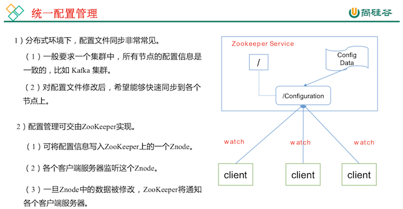

# Zookeeper 入门

::: tip 此文为转载 （通常一篇文章会参考多处，也会添加自己的理解，引用地址如有遗漏，请指出）

- https://www.bilibili.com/video/av32093417?from=search&seid=17225340458456913761

:::

 

## 概述

Zookeeper 是一个开源的分布式的，为分布式应用提供协调服务的 Apache 项目。

## 特点

 

 

1. Zookeeper:一个领导者(Leader)，多个跟随者(Follower)组成的集群。
2. 集群中只要有半数以上节点存活，Zookeeper集群就能正常服务。
3. 全局数据一致:每个Server保存一份相同的数据副本，Client无论连接到哪个Server，数据都是一致的。
4. 更新请求顺序进行，来自同一个Client的更新请求按其发送顺序依次执行。 
5. 数据更新原子性，一次数据更新要么成功，要么失败。 
6. 实时性，在一定时间范围内，Client能读到最新数据。

## 数据结构

 

## 应用场景

提供的服务包括:统一命名服务、统一配置管理、统一集群管理、服务器节点动态上下线、软负载均衡等。

 

 

 

 

