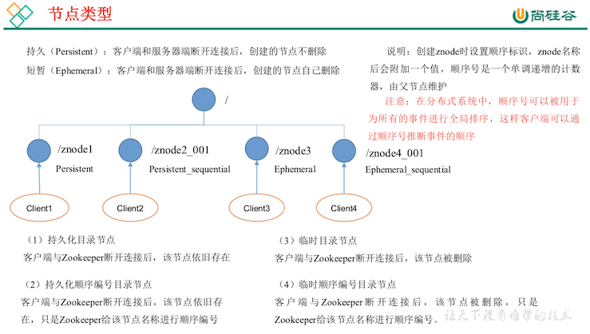
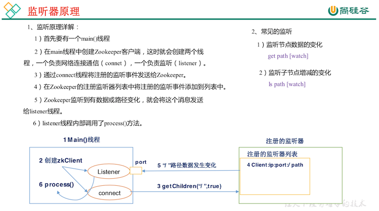
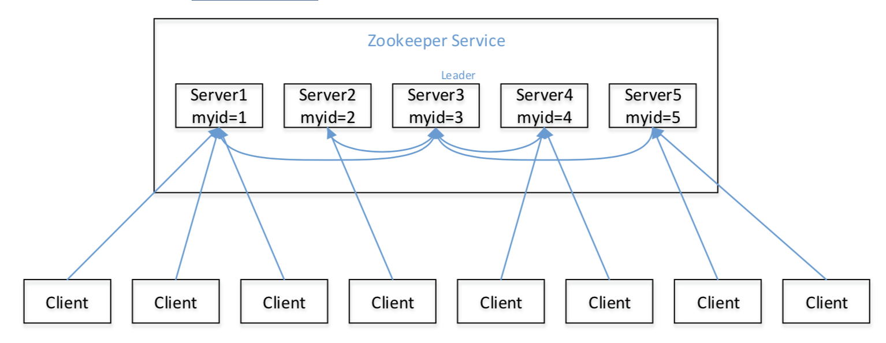
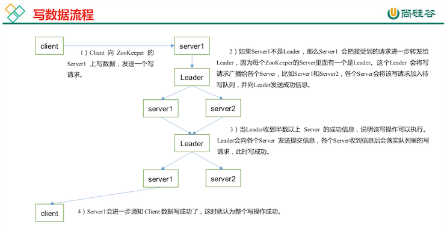

# Zookeeper 内部原理

::: tip 此文为转载 （通常一篇文章会参考多处，也会添加自己的理解，引用地址如有遗漏，请指出）

- https://www.bilibili.com/video/av32093417?from=search&seid=17225340458456913761

:::

 

## 节点类型

 

 

## Stat 结构体

1. czxid - 创建节点的事务 zxid 每次修改 ZooKeeper 状态都会收到一个 zxid 形式的时间戳，也就是 ZooKeeper 事务 ID。 事务 ID 是 ZooKeeper 中所有修改总的次序。每个修改都有唯一的 zxid，如果 zxid1 小于 zxid2，那么 zxid1 在 zxid2 之前发生。
2. ctime - znode 被创建的毫秒数(从 1970 年开始)
3. mzxid - znode 最后更新的事务 zxid
4. mtime - znode 最后修改的毫秒数(从 1970 年开始)
5. pZxid-znode 最后更新的子节点 zxid
6. cversion - znode 子节点变化号，znode 子节点修改次数
7. dataversion - znode 数据变化号
8. aclVersion - znode 访问控制列表的变化号
9. ephemeralOwner- 如果是临时节点，这个是 znode 拥有者的 session id。如果不是临时节 点则是 0。
10. dataLength- znode 的数据长度
11. numChildren - znode 子节点数量

## 监听器原理

 

 

## 选举机制

1. 半数机制:集群中半数以上机器存活，集群可用。所以 Zookeeper 适合安装奇数台 服务器。
2. Zookeeper 虽然在配置文件中并没有指定 **Master 和 Slave**。但是，Zookeeper 工作时， 是有一个节点为 Leader，其他则为 Follower，Leader 是通过内部的选举机制临时产生的。
3. 以一个简单的例子来说明整个选举的过程。 假设有五台服务器组成的 Zookeeper 集群，它们的 id 从 1-5，同时它们都是最新启动的， 也就是没有历史数据，在存放数据量这一点上，都是一样的。假设这些服务器依序启动，来 看看会发生什么，如图所示

- 服务器 1 启动，发起一次选举。服务器 1 投自己一票。此时服务器 1 票数一票，不够半数以上(3 票)，选举无法完成，服务器 1 状态保持为 LOOKING;
- 服务器 2 启动，再发起一次选举。服务器 1 和 2 分别投自己一票并交换选票信息: 此时服务器 1 发现服务器 2 的 ID 比自己目前投票推举的(服务器 1)大，更改选票为推举 服务器 2。此时服务器 1 票数 0 票，服务器 2 票数 2 票，没有半数以上结果，选举无法完成，服务器 1，2 状态保持 LOOKING;
- 服务器 3 启动，发起一次选举。此时服务器 1 和 2 都会更改选票为服务器 3。此次投票结果: 服务器 1 为 0 票，服务器 2 为 0 票，服务器 3 为 3 票。此时服务器 3 的票数已 经超过半数，服务器 3 当选 Leader。服务器 1，2 更改状态为 FOLLOWING，服务器 3 更改 状态为 LEADING;
- 服务器 4 启动，发起一次选举。此时服务器 1，2，3 已经不是 LOOKING 状态， 不会更改选票信息。交换选票信息结果:服务器 3 为 3 票，服务器 4 为 1 票。此时服务器 4 服从多数，更改选票信息为服务器 3，并更改状态为 FOLLOWING;
- 服务器 5 启动，同 4 一样当小弟。

## 写数据流程

 

 