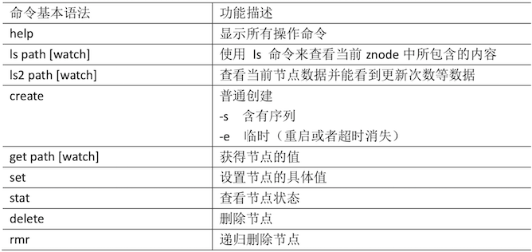

# Zookeeper 实战

::: tip 此文为转载 （通常一篇文章会参考多处，也会添加自己的理解，引用地址如有遗漏，请指出）

- https://www.bilibili.com/video/av32093417?from=search&seid=17225340458456913761

:::

<br />


## 分布式安装部署

### 1.集群规划

在 hadoop102、hadoop103 和 hadoop104 三个节点上部署 Zookeeper。

### 2.解压安装

(1) 解压 Zookeeper 安装包到/opt/module/目录下

```sh
[atguigu@hadoop102 software]$ tar -zxvf zookeeper- 3.4.10.tar.gz -C /opt/module/
```

(2) 同步/opt/module/zookeeper-3.4.10 目录内容到 hadoop103、hadoop104

```sh
[atguigu@hadoop102 module]$ xsync zookeeper-3.4.10/
```

### 3.配置服务器编号

(1) 在/opt/module/zookeeper-3.4.10/这个目录下创建 zkData

```sh
[atguigu@hadoop102 zookeeper-3.4.10]$ mkdir -p zkData
```

(2) 在/opt/module/zookeeper-3.4.10/zkData 目录下创建一个 myid 的文件

```sh
[atguigu@hadoop102 zkData]$ touch myid
```

<font color=red>添加 myid 文件，注意一定要在 linux 里面创建，在 notepad++里面很可能乱码</font>

(3) 编辑 myid 文件

```sh
[atguigu@hadoop102 zkData]$ vi myid
```

在文件中添加与 server 对应的编号:

`2`

(4) 拷贝配置好的 zookeeper 到其他机器上

```sh
[atguigu@hadoop102 zkData]$ xsync myid
```

并分别在 hadoop103、hadoop104 上修改 myid 文件中内容为 3、4

### 4.配置 zoo.cfg 文件

(1) 重命名/opt/module/zookeeper-3.4.10/conf 这个目录下的 zoo_sample.cfg 为 zoo.cfg

```sh
[atguigu@hadoop102 conf]$ mv zoo_sample.cfg zoo.cfg
```

(2) 打开 zoo.cfg 文件

```sh
[atguigu@hadoop102 conf]$ vim zoo.cfg 
```

修改数据存储路径配置

```sh
dataDir=/opt/module/zookeeper-3.4.10/zkData 
```

增加如下配置

```sh
#######################cluster########################## 
server.2=hadoop102:2888:3888 
server.3=hadoop103:2888:3888 
server.4=hadoop104:2888:3888
```

(3) 同步 zoo.cfg 配置文件

```sh
[atguigu@hadoop102 conf]$ xsync zoo.cfg
```

(4) 配置参数解读 

```sh
server.A=B:C:D。
```

> A 是一个数字，表示这个是第几号服务器;
>
> 集群模式下配置一个文件 myid，这个文件在 dataDir 目录下，这个文件里面有一个数据 就是 A 的值，Zookeeper 启动时读取此文件，拿到里面的数据与 zoo.cfg 里面的配置信息比 较从而判断到底是哪个 server。
>
> B 是这个服务器的地址;
>
> C 是这个服务器 Follower 与集群中的 Leader 服务器交换信息的端口;
>
> D 是万一集群中的 Leader 服务器挂了，需要一个端口来重新进行选举，选出一个新的
>
> Leader，而这个端口就是用来执行选举时服务器相互通信的端口。

### 4.集群操作

(1) 分别启动 Zookeeper

```sh
[atguigu@hadoop102 zookeeper-3.4.10]$ bin/zkServer.sh start
[atguigu@hadoop103 zookeeper-3.4.10]$ bin/zkServer.sh start 
[atguigu@hadoop104 zookeeper-3.4.10]$ bin/zkServer.sh start
```

(2) 查看状态

```sh
[atguigu@hadoop102 zookeeper-3.4.10]# bin/zkServer.sh status JMX enabled by default
Using config: /opt/module/zookeeper- 3.4.10/bin/../conf/zoo.cfg
Mode: follower
[atguigu@hadoop103 zookeeper-3.4.10]# bin/zkServer.sh status JMX enabled by default
Using config: /opt/module/zookeeper- 3.4.10/bin/../conf/zoo.cfg
Mode: leader
[atguigu@hadoop104 zookeeper-3.4.5]# bin/zkServer.sh status
JMX enabled by default
Using config: /opt/module/zookeeper- 3.4.10/bin/../conf/zoo.cfg
Mode: follower
```


## 客户端命令行操作

<br>

<div style="display:flex;"></div>

1.启动客户端

```sh
[atguigu@hadoop103 zookeeper-3.4.10]$ bin/zkCli.sh
```

2.显示所有操作命令

```sh
[zk: localhost:2181(CONNECTED) 1] help
```

3.查看当前 znode 中所包含的内容 

```sh
[zk: localhost:2181(CONNECTED) 0] ls / 
[zookeeper]
```

4.查看当前节点详细数据

```sh
[zk: localhost:2181(CONNECTED) 1] ls2 / 
[zookeeper]
cZxid = 0x0
ctime = Thu	Jan 01 08:00:00 CST 1970
mZxid = 0x0
mtime = Thu	Jan 01 08:00:00 CST 1970
pZxid = 0x0
cversion = -1
dataVersion = 0
aclVersion = 0
ephemeralOwner = 0x0
dataLength = 0
numChildren = 1
```

5.分别创建 2 个普通节点

```sh
[zk: localhost:2181(CONNECTED) 3] create /sanguo "jinlian" Created /sanguo
[zk: localhost:2181(CONNECTED) 4] create /sanguo/shuguo "liubei"
Created /sanguo/shuguo
```

6.获得节点的值

```sh
[zk: localhost:2181(CONNECTED) 5] get /sanguo 
jinlian
cZxid = 0x100000003
ctime = Wed Aug 29 00:03:23 CST 2018
mZxid = 0x100000003
mtime = Wed Aug 29 00:03:23 CST 2018
pZxid = 0x100000004
cversion = 1
dataVersion = 0
aclVersion = 0
ephemeralOwner = 0x0
dataLength = 7
numChildren = 1
[zk: localhost:2181(CONNECTED) 6]
[zk: localhost:2181(CONNECTED) 6] get /sanguo/shuguo 
liubei
cZxid = 0x100000004
ctime = Wed Aug 29 00:04:35 CST 2018
mZxid = 0x100000004
mtime = Wed Aug 29 00:04:35 CST 2018
pZxid = 0x100000004
cversion = 0
dataVersion = 0
aclVersion = 0
ephemeralOwner = 0x0
dataLength = 6
numChildren = 0
```

7.创建短暂节点

```sh
[zk: localhost:2181(CONNECTED) 7] create -e /sanguo/wuguo
"zhouyu"
Created /sanguo/wuguo
```

(1) 在当前客户端是能查看到的

```sh
[zk: localhost:2181(CONNECTED) 3] ls /sanguo 
[wuguo, shuguo]
```

(2) 退出当前客户端然后再重启客户端

```sh
[zk: localhost:2181(CONNECTED) 12] quit 
[atguigu@hadoop104 zookeeper-3.4.10]$ bin/zkCli.sh
```

(3) 再次查看根目录下短暂节点已经删除

```sh
[zk: localhost:2181(CONNECTED) 0] ls /sanguo
[shuguo]
```

8.创建带序号的节点

(1) 先创建一个普通的根节点/sanguo/weiguo

```sh
[zk: localhost:2181(CONNECTED) 1] create /sanguo/weiguo "caocao"
Created /sanguo/weiguo
```

(2) 创建带序号的节点

```sh
[zk: localhost:2181(CONNECTED) 2] create -s /sanguo/weiguo/xiaoqiao "jinlian"
Created /sanguo/weiguo/xiaoqiao0000000000
[zk: localhost:2181(CONNECTED) 3] create -s /sanguo/weiguo/daqiao "jinlian"
Created /sanguo/weiguo/daqiao0000000001
[zk: localhost:2181(CONNECTED) 4] create -s /sanguo/weiguo/diaocan "jinlian"
Created /sanguo/weiguo/diaocan0000000002
```

如果原来没有序号节点，序号从 0 开始依次递增。如果原节点下已有 2 个节点，则再 排序时从 2 开始，以此类推。

9.修改节点数据值

```sh
[zk: localhost:2181(CONNECTED) 6] set /sanguo/weiguo "simayi"
```

10.节点的值变化监听

(1) 在 hadoop104 主机上注册监听/sanguo 节点数据变化

```sh
[zk: localhost:2181(CONNECTED) 26] [zk: localhost:2181(CONNECTED) 8] get /sanguo watch
```

(2) 在 hadoop103 主机上修改/sanguo 节点的数据

```sh
[zk: localhost:2181(CONNECTED) 1] set /sanguo "xisi"
```

(3) 观察 hadoop104 主机收到数据变化的监听

```sh
WATCHER::
WatchedEvent state:SyncConnected type:NodeDataChanged path:/sanguo
```

11.节点的子节点变化监听(路径变化)

(1) 在 hadoop104 主机上注册监听/sanguo 节点的子节点变化

```sh
[zk: localhost:2181(CONNECTED) 1] ls /sanguo watch
[aa0000000001, server101]
```

(2) 在 hadoop103 主机/sanguo 节点上创建子节点

```sh
[zk: localhost:2181(CONNECTED) 2] create /sanguo/jin "simayi" 
Created /sanguo/jin
```

(3) 观察 hadoop104 主机收到子节点变化的监听

```sh
WATCHER::
WatchedEvent state:SyncConnected type:NodeChildrenChanged path:/sanguo
```

12.删除节点

```sh
[zk: localhost:2181(CONNECTED) 4] delete /sanguo/jin
```

13.递归删除节点

```sh
[zk: localhost:2181(CONNECTED) 15] rmr /sanguo/shuguo
```

14.查看节点状态

```sh
[zk: localhost:2181(CONNECTED) 17] stat /sanguo cZxid = 0x100000003
ctime = Wed Aug 29 00:03:23 CST 2018
mZxid = 0x100000011
mtime = Wed Aug 29 00:21:23 CST 2018 pZxid = 0x100000014
cversion = 9
dataVersion = 1
aclVersion = 0
ephemeralOwner = 0x0
dataLength = 4
numChildren = 1
```


## API 应用

### Eclipse 环境搭建

1. 创建一个 Maven 工程 
2. 添加 pom 文件

```xml
<dependencies>
     <dependency>
         <groupId>junit</groupId> <artifactId>junit</artifactId> <version>RELEASE</version>
     </dependency>
     <dependency>
         <groupId>org.apache.logging.log4j</groupId> 
       	 <artifactId>log4j-core</artifactId> 
       	 <version>2.8.2</version>
     </dependency>
     <!-- https://mvnrepository.com/artifact/org.apache.zookeeper/zook eeper -->
     <dependency> 
         <groupId>org.apache.zookeeper</groupId> 
         <artifactId>zookeeper</artifactId> 
         <version>3.4.10</version>
    </dependency>
</dependencies>
```

3. 拷贝 log4j.properties 文件到项目根目录

需要在项目的 src/main/resources 目录下，新建一个文件，命名为“log4j.properties”，在文件中填入。

```yaml
log4j.rootLogger=INFO, stdout 
log4j.appender.stdout=org.apache.log4j.ConsoleAppender 
log4j.appender.stdout.layout=org.apache.log4j.PatternLayout 
log4j.appender.stdout.layout.ConversionPattern=%d %p [%c] - %m%n
log4j.appender.logfile=org.apache.log4j.FileAppender 
log4j.appender.logfile.File=target/spring.log
log4j.appender.logfile.layout=org.apache.log4j.PatternLayout 
log4j.appender.logfile.layout.ConversionPattern=%d %p [%c] - %m%n
```

### 创建 ZooKeeper 客户端

```java
private static String connectString = "hadoop102:2181,hadoop103:2181,hadoop104:2181";
private static int sessionTimeout = 2000; private ZooKeeper zkClient = null;

@Before
public void init() throws Exception {
zkClient = new ZooKeeper(connectString, sessionTimeout,
	new Watcher() {
		@Override
		public void process(WatchedEvent event) {
			// 收到事件通知后的回调函数(用户的业务逻辑)
			System.out.println(event.getType() + "--" + event.getPath());
			// 再次启动监听 
			try {
                       zkClient.getChildren("/", true); 
			} catch (Exception e) {
			    e.printStackTrace();
			}
		} 
	});
}
```

### 创建子节点

```java
// 创建子节点
@Test
public void create() throws Exception {
	// 参数 1:要创建的节点的路径; 参数 2:节点数据 ; 参数 3:节点权 限 ;参数 4:节点的类型
	String nodeCreated = zkClient.create("/atguigu", "jinlian".getBytes(), Ids.OPEN_ACL_UNSAFE, CreateMode.PERSISTENT);
}
```

### 获取子节点并监听节点变化

```java
// 获取子节点
@Test
public void getChildren() throws Exception {
	List<String> children = zkClient.getChildren("/", true);
	for (String child : children) {
         System.out.println(child);
    }
	// 延时阻塞
	Thread.sleep(Long.MAX_VALUE); 
}
```

### 判断 Znode 是否存在

```java
// 判断 znode 是否存在
@Test
public void exist() throws Exception {
	Stat stat = zkClient.exists("/eclipse", false); 
	System.out.println(stat == null ? "not exist" : "exist");
}
```


## 监听服务器节点动态上下线案例

### 1.需求

某分布式系统中，主节点可以有多台，可以动态上下线，任意一台客户端都能实时感知 到主节点服务器的上下线。

### 2.需求分析,如图

<br>

<div style="display:flex;"></div>

### 3.具体实现

(0) 先在集群上创建/servers 节点

```sh
[zk: localhost:2181(CONNECTED) 10] create /servers "servers" 
Created /servers
```

(1) 服务器端向 Zookeeper 注册代码

```java
package com.atguigu.zkcase;
import java.io.IOException;
import org.apache.zookeeper.CreateMode; 
import org.apache.zookeeper.WatchedEvent; 
import org.apache.zookeeper.Watcher; 
import org.apache.zookeeper.ZooKeeper; 
import org.apache.zookeeper.ZooDefs.Ids;

public class DistributeServer {
	private static String connectString = "hadoop102:2181,hadoop103:2181,hadoop104:2181";
	private static int sessionTimeout = 2000; 
	private ZooKeeper zk = null;
	private String parentNode = "/servers";

	// 创建到 zk 的客户端连接
	public void getConnect() throws IOException{
		zk = new ZooKeeper(connectString, sessionTimeout, new Watcher() {
			@Override
			public void process(WatchedEvent event) {

			} 
		});
	}

	// 注册服务器
	public void registServer(String hostname) throws Exception{
		String create = zk.create(parentNode + "/server", hostname.getBytes(), Ids.OPEN_ACL_UNSAFE, CreateMode.EPHEMERAL_SEQUENTIAL);
		System.out.println(hostname +" is online "+ create); 
	}

	// 业务功能
	public void business(String hostname) throws Exception{
		System.out.println(hostname+" is working ...");
		Thread.sleep(Long.MAX_VALUE); 
	}

	public static void main(String[] args) throws Exception {
		// 1获取zk连接
		DistributeServer server = new DistributeServer(); server.getConnect();
		// 2 利用 zk 连接注册服务器信息 server.registServer(args[0]);
		// 3 启动业务功能
		server.business(args[0]);
	}
}
```

(2) 客户端代码

```java
package com.atguigu.zkcase;
import java.io.IOException;
import java.util.ArrayList;
import java.util.List;
import org.apache.zookeeper.WatchedEvent; 
import org.apache.zookeeper.Watcher; 
import org.apache.zookeeper.ZooKeeper;

public class DistributeClient {

	private static String connectString = "hadoop102:2181,hadoop103:2181,hadoop104:2181";
	private static int sessionTimeout = 2000; 
	private ZooKeeper zk = null;
	private String parentNode = "/servers";

	// 创建到 zk 的客户端连接
	public void getConnect() throws IOException {
		zk = new ZooKeeper(connectString, sessionTimeout, new Watcher() {
			@Override
			public void process(WatchedEvent event) {
				// 再次启动监听 
				try {
					getServerList();
			    } catch (Exception e) {
			        e.printStackTrace();
			    }
			}
		});
	}

	// 获取服务器列表信息
	public void getServerList() throws Exception {
		// 1获取服务器子节点信息，并且对父节点进行监听
		List<String> children = zk.getChildren(parentNode, true);
		// 2存储服务器信息列表
		ArrayList<String> servers = new ArrayList<>();
		// 3遍历所有节点，获取节点中的主机名称信息 
		for (String child : children) {
			byte[] data = zk.getData(parentNode + "/" + child, false, null);
			servers.add(new String(data)); 
		}
		// 4打印服务器列表信息
		System.out.println(servers); 
	}

	// 业务功能
	public void business() throws Exception{
		System.out.println("client is working ...");
		Thread.sleep(Long.MAX_VALUE); 
	}

	public static void main(String[] args) throws Exception {
		// 1获取zk连接
		DistributeClient client = new DistributeClient();
		client.getConnect();
		// 2获取servers的子节点信息，从中获取服务器信息列表 client.getServerList();
		// 3业务进程启动
	    client.business();
	}

}
```

