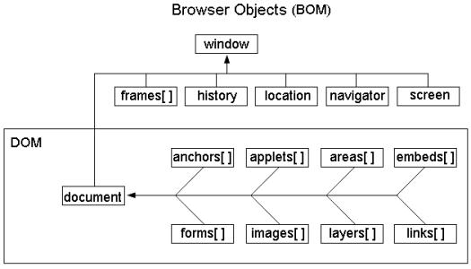
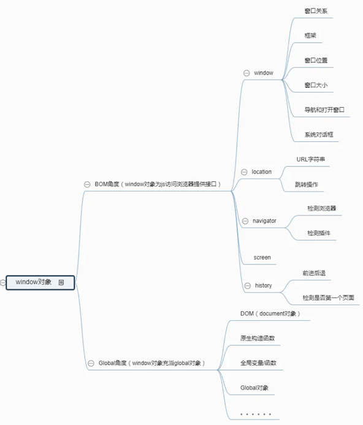

# JavaScript 基础介绍

::: tip 转载原文、视屏、教程

- [https://www.bilibili.com/video/BV1Ft411N7R3](https://www.bilibili.com/video/BV1Ft411N7R3)

:::


## 什么是JavaScript

	JavaScript是运行在浏览器上的脚本语言。简称JS。
	JavaScript是网景公司（NetScape）的 布兰登艾奇（JavaScript之父）开发的，最初叫做LiveScript。
	LiveScript的出现让浏览器更加的生动了，不再是单纯的静态页面了。页面更具有交互性。
	在历史的某个阶段，SUN公司和网景公司他们之间有合作关系，SUN公司把LiveScript的名字修改为JavaScript。
	
	JavaScript这个名字中虽然带有“Java”但是和Java没有任何关系，只是语法上优点类似。
	他们运行的位置不同，Java运行在JVM当中，JavaScript运行在浏览器的内存当中。
	
	JavaScript程序不需要我们程序员手动编译，编写完源代码之后，浏览器直接打开解释执行。
	JavaScript的“目标程序”以普通文本形式保存，这种语言都叫做“脚本语言”。
	Java的目标程序已.class形式存在，不能使用文本编辑器打开，不是脚本语言。
	
	网景公司1998年被美国在线收购。
	网景公司最著名的就是领航者浏览器：Navigator浏览器。
	
	LiveScript的出现，最初的时候是为Navigator浏览器量身定制一门语言，不支持其他浏览器。
	当Navigator浏览器使用非常广泛的时候，微软害怕了，于是微软在最短的时间内组建了一个团队，开始研发只支持IE浏览器的脚本语言，叫做JScript。
	
	JavaScript和JScript并存的年代，程序员是很痛苦的，因为程序员要写两套程序。
	在这种情况下，有一个非营利性组织站出来了，叫做ECMA组织（欧洲计算机协会）
	ECMA根据JavaScript制定了ECMA-262号标准，叫做ECMA-Script。
	
	现代的javascript和jscript都实现了ECMA-Script规范。（javascript和jscript统一了。）


## HTML中嵌入JS三种方式

### 第一种方式

``` html
<!doctype html>
<html>
	<head>
		<title>HTML中嵌入JS代码的第一种方式</title>
	</head>
	<body>
		
		<!--
			1、要实现的功能：
				用户点击以下按钮，弹出消息框。

			2、JS是一门事件驱动型的编程语言，依靠事件去驱动，然后执行对应的程序。
			在JS中有很多事件，其中有一个事件叫做：鼠标单击，单词：click。并且任何
			事件都会对应一个事件句柄叫做：onclick。【注意：事件和事件句柄的区别是：
			事件句柄是在事件单词前添加一个on。】，而事件句柄是以HTML标签的属性存在
			的。

			3、onclick="js代码"，执行原理是什么？
				页面打开的时候，js代码并不会执行，只是把这段JS代码注册到按钮的click事件上了。
				等这个按钮发生click事件之后，注册在onclick后面的js代码会被浏览器自动调用。
			
			4、怎么使用JS代码弹出消息框？
				在JS中有一个内置的对象叫做window，全部小写，可以直接拿来使用，window代表的是浏览器对象。
				window对象有一个函数叫做:alert，用法是：window.alert("消息");这样就可以弹窗了。
			
			5、JS中的字符串可以使用双引号，也可以使用单引号。

			6、JS中的一条语句结束之后可以使用分号“;”，也可以不用。
		-->
		<input type="button" value="hello" onclick="window.alert('hello js')"/>

		<input type="button" value="hello" onclick='window.alert("hello jscode")'/>

		<input type="button" value="hello" onclick="window.alert('hello zhangsan')
													window.alert('hello lis')
													window.alert('hello wangwu')"/>
		
		<!-- window. 可以省略。-->
		<input type="button" value="hello" onclick="alert('hello zhangsan')
													alert('hello lis')
													alert('hello wangwu')"/>
		
		<input type="button" value="hello" onclick="alert('hello zhangsan');
													alert('hello lis');
													alert('hello wangwu');"/>

	</body>
</html>
```

### 第二种方式

``` html

<!--
	javascript的脚本块在一个页面当中可以出现多次。没有要求。
	javascript的脚本块出现位置也没有要求，随意。
-->
<script type="text/javascript">
// alert有阻塞当前页面加载的作用。（阻挡，直到用户点击确定按钮。）
window.alert("first.......");
</script>

<!doctype html>
<html>
	<head>
		<title>HTML中嵌入JS代码的第二种方式</title>

		<!--样式块-->
		<style type="text/css">
			/*
				css代码
			*/
		</style>

		<script type="text/javascript">
			window.alert("head............");
		</script>

	</head>
	<body>

		<input type="button" value="我是一个按钮对象1" />
		
		<!--第二种方式：脚本块的方式-->
		<script type="text/javascript">

			/*
				暴露在脚本块当中的程序，在页面打开的时候执行，
				并且遵守自上而下的顺序依次逐行执行。（这个代
				码的执行不需要事件）
			*/
			window.alert("Hello World!"); // alert函数会阻塞整个HTML页面的加载。
			
			// JS代码的注释，这是单行注释。
			/*
				JS代码的多行注释。和java一样。
			*/
			window.alert("Hello JavaScript!");

		</script>

		<input type="button" value="我是一个按钮对象" />

	</body>
</html>

<script type="text/javascript">
window.alert("last.......");
</script>

<!--
/**
*
* javadoc注释，这里的注释信息会被javadoc.exe工具解析提取生成帮助文档。
*/
-->
```


### 第三种方式

``` html
<!doctype html>
<html>
	<head>
		<title>HTML中嵌入JS代码的第三种方式：引入外部独立的js文件。</title>
	</head>
	<body>
		
		<!--在需要的位置引入js脚本文件-->
		<!--引入外部独立的js文件的时候，js文件中的代码会遵循自上而下的顺序依次逐行执行。-->
		<!--
		<script type="text/javascript" src="js/1.js"></script>
		-->

		<!--同一个js文件可以被引入多次。但实际开发中这种需求很少。-->
		<!--
		<script type="text/javascript" src="js/1.js"></script>
		-->

		<!--这种方式不行，结束的script标签必须有。-->
		<!--
		<script type="text/javascript" src="js/1.js" />
		-->
		<!--
		<script type="text/javascript" src="js/1.js"></script>
		-->

		<script type="text/javascript" src="js/1.js">
			// 这里写的代码不会执行。
			// window.alert("Test");
		</script>

		<script type="text/javascript">
			alert("hello jack!");
		</script>


	</body>
</html>
```

## Javascript 知识点

JavaScript包括三大块：

- **ECMAScript**：JS的核心语法（ES规范 / ECMA-262标准）<br />

  

- **DOM**：Document Object Model（文档对象模型：对网页当中的节点进行增删改的过程。）<br />HTML文档被当做一棵DOM树来看待。
  `var domObj = document.getElementById("id");`

  > DOM即文档对象模型，DOM是W3C标准，**DOM的最根本对象是document（window.document）**，这个对象实际上是window对象的属性，这个对象的独特之处是这个是唯一一个既属于BOM又属于DOM的对象。DOM和文档有关，这里的文档指的是网页，也就是html文档。DOM和浏览器无关，他关注的是网页本身的内容，由于和浏览器没有多大的关系，所以标准就好定了。


- **BOM**：Browser Object Model（浏览器对象模型）<br />关闭浏览器窗口、打开一个新的浏览器窗口、后退、前进、浏览器地址栏上的地址等，都是BOM编程。

  > BOM 即浏览器对象模型，BOM没有相关标准，**BOM的最核心对象是window对象**。window对象既为javascript访问浏览器提供API，同时在ECMAScript中充当Global对象。BOM和浏览器关系密切，浏览器很多东西可以通过javascript控制，例如打开窗口、打开选项卡、关闭页面、收藏夹等。这些功能与网页内容无关。由于没有标准，不同的浏览器实现同一功能，可以通过不同的实现方式。例如，加入收藏夹这个功能：
  >
  > ```js
  > // IE浏览器: 
  > window.external.AddFavorite(url,title);
  > 
  > // FireFox浏览器: 
  > window.sidebar.addPanel(title, url, "");
  > ```
  >
  > 虽然没有统一标准，但是各个浏览器的常用功能的js代码大同小异，对于常用的功能已经有默认的标准了。


### DOM和BOM的区别和联系？
- BOM的顶级对象是：window
- DOM的顶级对象是：document
- 实际上BOM是包括DOM的！

*关系图*：

<div style="display:flex;"></div>

<br />

<div style="display:flex;"></div>