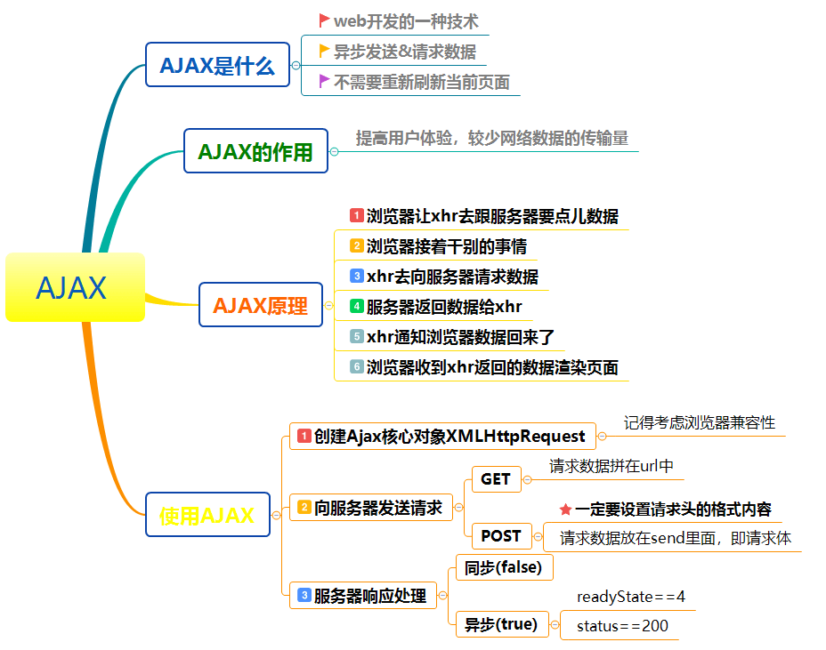

# AJAX

::: tip 转

- [https://www.bilibili.com/video/BV1WC4y1b78y](https://www.bilibili.com/video/BV1WC4y1b78y)
- [https://www.pianshen.com/article/404168956/](https://www.pianshen.com/article/404168956/)
- [https://zhuanlan.zhihu.com/p/97569265](https://zhuanlan.zhihu.com/p/97569265)
- [https://www.w3cschool.cn/ajax/nr583fns.html](https://www.w3cschool.cn/ajax/nr583fns.html)

:::

## 基本介绍、原理

::: warning 理解1

<br />

:::

- Ajax 的全称是Asynchronous JavaScript and XML，意思是：异步 JavaScript 和 XML
- Ajax是使用XMLHttpRequest对象与服务器端通信的脚本语言
- 可以发送及接收各种格式的信息，包括JSON、XML、HTML和文本文件。
- AJAX可以无需刷新页面而与服务器端进行通信。
- 允许你根据用户事件来更新部分页面内容。

#### **Ajax工作原理**

Ajax的工作原理相当于**在用户和服务器之间加了一个中间层(Ajax引擎),使用户操作与服务器响应异步化**。并不是所有的用户请求都提交给服务器,像—些数据验证(比如判断用户是否输入了数据)和数据处理(比如判断用户输入数据是否是数字)等都交给Ajax引擎自己来做, 只有确定**需要从服务器读取新数据时再由Ajax引擎代为向服务器提交请求**。把这些交给了Ajax引擎，用户操作起来也就感觉更加流畅了。

#### Ajax的优点

1. 页面无刷新，用户体验好。
   - AJAX最大优点就是能在不刷新整个页面的前提下与服务器通信维护数据。这使得Web应用程序更为迅捷地响应用户交互，并避免了在网络上发送那些没有改变的信息，减少用户等待时间，带来非常好的用户体验。
2. 异步通信，更加快的响应能力。
   - AJAX使用异步方式与服务器通信，不需要打断用户的操作，具有更加迅速的响应能力。优化了Browser和Server之间的沟通，减少不必要的数据传输、时间及降低网络上数据流量。
3. 减少冗余请求，减轻了服务器负担
   - AJAX的原则是“按需取数据”，可以最大程度的减少冗余请求和响应对服务器造成的负担，提升站点性能。
4. 基于标准化的并被广泛支持的技术，不需要下载插件或者小程序
   - AJAX基于标准化的并被广泛支持的技术，不需要下载浏览器插件或者小程序，但需要客户允许JavaScript在浏览器上执行
5. 界面与应用分离。
   - Ajax使WEB中的界面与应用分离（也可以说是数据与呈现分离），有利于分工合作、减少非技术人员对页面的修改造成的WEB应用程序错误、提高效率、也更加适用于现在的发布系统。

#### AJAX 缺点

1. **AJAX干掉了Back和History功能，即对浏览器机制的破坏**。<br>在动态更新页面的情况下，用户无法回到前一个页面状态，因为浏览器仅能记忆历史记录中的静态页面。一个被完整读入的页面与一个已经被动态修改过的页面之间的差别非常微妙；用户通常会希望单击后退按钮能够取消他们的前一次操作，但是在Ajax应用程序中，这将无法实现。
2. **AJAX的安全问题**。<br />AJAX技术给用户带来很好的用户体验的同时也对IT企业带来了新的安全威胁，Ajax技术就如同对企业数据建立了一个直接通道。这使得开发者在不经意间会暴露比以前更多的数据和服务器逻辑。Ajax的逻辑可以对客户端的安全扫描技术隐藏起来，允许黑客从远端服务器上建立新的攻击。还有Ajax也难以避免一些已知的安全弱点，诸如跨站点脚步攻击、SQL注入攻击和基于Credentials的安全漏洞等等
3. **对搜索引擎支持较弱**。<br />对搜索引擎的支持比较弱。如果使用不当，AJAX会增大网络数据的流量，从而降低整个系统的性能
4. **存在跨域问题(同源)**
5. ... 等等 ...

<br />

::: warning 理解2

<br />

:::

<div style="display:flex;"></div>

**AJAX是基于现有的Internet标准，并且联合使用它们：**

- 核心对象：[XMLHttpRequest 对象](https://www.w3cschool.cn/xml/xml-http.html) (异步的与服务器交换数据)
- JavaScript/DOM (信息显示/交互)
- CSS (给数据定义样式)
- XML (作为转换数据的格式)

> AJAX应用程序与浏览器和平台无关的！

## XMLHTTPRequest对象

Ajax的一个最大的特点是无需刷新页面便可向服务器传输或读写数据(又称无刷新更新页面),这一特点主要得益于XMLHTTP组件XMLHTTPRequest对象。

> XMLHttpRequest 对象方法描述 

| 方  法                                                     | 描  述                                                       |
| ---------------------------------------------------------- | ------------------------------------------------------------ |
| abort()                                                    | 停止当前请求                                                 |
| getAllResponseHeaders()                                    | 把HTTP请求的所有响应首部作为键/值对返回                      |
| getResponseHeader("header")                                | 返回指定首部的串值                                           |
| open("method","URL",[asyncFlag],["userName"],["password"]) | 建立对服务器的调用。method参数可以是GET、POST或PUT。url参数可以是相对URL或绝对URL。这个方法还包括3个可选的参数，是否异步，用户名，密码 |
| send(content)                                              | 向服务器发送请求                                             |
| setRequestHeader("header", "value")                        | 把指定首部设置为所提供的值。在设置任何首部之前必须先调用open()。设置header并和请求一起发送 ('post'方法一定要 ) |

> XMLHttpRequest 对象属性描述

| 属 性              | 描  述                                                       |
| ------------------ | ------------------------------------------------------------ |
| onreadystatechange | 状态改变的事件触发器，每个状态改变时都会触发这个事件处理器，通常会调用一个JavaScript函数 |
| readyState         | 请求的状态。有5个可取值：0 = 未初始化，1 = 正在加载，2 = 已加载，3 = 交互中，4 = 完成 |
| responseText       | 服务器的响应，返回数据的文本。                               |
| responseXML        | 服务器的响应，返回数据的兼容DOM的XML文档对象 ，这个对象可以解析为一个DOM对象。 |
| responseBody       | 服务器返回的主题（非文本格式）                               |
| responseStream     | 服务器返回的数据流                                           |
| status             | 服务器的HTTP状态码（如：404 = "文件末找到" 、200 ="成功" ，等等） |
| statusText         | 服务器返回的状态文本信息 ，HTTP状态码的相应文本（OK或Not Found（未找到）等等） |

## 实例 - 准备

实例代码需要用到服务端，这里使用express 搭建简单的node服务端，供后面ajax请求使用

### express基本使用

``` javascript
//1. 引入express
const express = require('express');

//2. 创建应用对象
const app = express();

//3. 创建路由规则
// request 是对请求报文的封装
// response 是对响应报文的封装
app.get('/', (request, response)=>{
    //设置响应
    response.send('HELLO EXPRESS');
});

//4. 监听端口启动服务
app.listen(8000, ()=>{
    console.log("服务已经启动, 8000 端口监听中....");
});
```

### server.js

最终server端代码

``` javascript
//1. 引入express
const express = require('express');

//2. 创建应用对象
const app = express();

//3. 创建路由规则
// request 是对请求报文的封装
// response 是对响应报文的封装
app.get('/server', (request, response) => {
    //设置响应头  设置允许跨域
    response.setHeader('Access-Control-Allow-Origin', '*');
    //设置响应体
    response.send('HELLO AJAX - 2');
});

//可以接收任意类型的请求 
app.all('/server', (request, response) => {
    //设置响应头  设置允许跨域
    response.setHeader('Access-Control-Allow-Origin', '*');
    //响应头
    response.setHeader('Access-Control-Allow-Headers', '*');
    //设置响应体
    response.send('HELLO AJAX POST');
});

//JSON 响应
app.all('/json-server', (request, response) => {
    //设置响应头  设置允许跨域
    response.setHeader('Access-Control-Allow-Origin', '*');
    //响应头
    response.setHeader('Access-Control-Allow-Headers', '*');
    //响应一个数据
    const data = {
        name: 'atguigu'
    };
    //对对象进行字符串转换
    let str = JSON.stringify(data);
    //设置响应体
    response.send(str);
});

//针对 IE 缓存
app.get('/ie', (request, response) => {
    //设置响应头  设置允许跨域
    response.setHeader('Access-Control-Allow-Origin', '*');
    //设置响应体
    response.send('HELLO IE - 5');
});

//延时响应
app.all('/delay', (request, response) => {
    //设置响应头  设置允许跨域
    response.setHeader('Access-Control-Allow-Origin', '*');
    response.setHeader('Access-Control-Allow-Headers', '*');
    setTimeout(() => {
        //设置响应体
        response.send('延时响应');
    }, 1000)
});

//jQuery 服务
app.all('/jquery-server', (request, response) => {
    //设置响应头  设置允许跨域
    response.setHeader('Access-Control-Allow-Origin', '*');
    response.setHeader('Access-Control-Allow-Headers', '*');
    // response.send('Hello jQuery AJAX');
    const data = {name:'尚硅谷'};
    response.send(JSON.stringify(data));
});

//axios 服务
app.all('/axios-server', (request, response) => {
    //设置响应头  设置允许跨域
    response.setHeader('Access-Control-Allow-Origin', '*');
    response.setHeader('Access-Control-Allow-Headers', '*');
    // response.send('Hello jQuery AJAX');
    const data = {name:'尚硅谷'};
    response.send(JSON.stringify(data));
});

//fetch 服务
app.all('/fetch-server', (request, response) => {
    //设置响应头  设置允许跨域
    response.setHeader('Access-Control-Allow-Origin', '*');
    response.setHeader('Access-Control-Allow-Headers', '*');
    // response.send('Hello jQuery AJAX');
    const data = {name:'尚硅谷'};
    response.send(JSON.stringify(data));
});

//jsonp服务
app.all('/jsonp-server',(request, response) => {
    // response.send('console.log("hello jsonp")');
    const data = {
        name: '尚硅谷atguigu'
    };
    //将数据转化为字符串
    let str = JSON.stringify(data);
    //返回结果
    response.end(`handle(${str})`);
});

//用户名检测是否存在
app.all('/check-username',(request, response) => {
    // response.send('console.log("hello jsonp")');
    const data = {
        exist: 1,
        msg: '用户名已经存在'
    };
    //将数据转化为字符串
    let str = JSON.stringify(data);
    //返回结果
    response.end(`handle(${str})`);
});

//
app.all('/jquery-jsonp-server',(request, response) => {
    // response.send('console.log("hello jsonp")');
    const data = {
        name:'尚硅谷',
        city: ['北京','上海','深圳']
    };
    //将数据转化为字符串
    let str = JSON.stringify(data);
    //接收 callback 参数
    let cb = request.query.callback;

    //返回结果
    response.end(`${cb}(${str})`);
});

app.all('/cors-server', (request, response)=>{
    //设置响应头
    response.setHeader("Access-Control-Allow-Origin", "*");
    response.setHeader("Access-Control-Allow-Headers", '*');
    response.setHeader("Access-Control-Allow-Method", '*');
    // response.setHeader("Access-Control-Allow-Origin", "http://127.0.0.1:5500");
    response.send('hello CORS');
});

//4. 监听端口启动服务
app.listen(8000, () => {
    console.log("服务已经启动, 8000 端口监听中....");
});
```

## 实例 - 原生AJAX

### 1-GET

``` html
<!DOCTYPE html>
<html lang="en">
<head>
    <meta charset="UTF-8">
    <meta name="viewport" content="width=device-width, initial-scale=1.0">
    <title>AJAX GET 请求</title>
    <style>
        #result{
            width:200px;
            height:100px;
            border:solid 1px #90b;
        }
    </style>
</head>
<body>
    <button>点击发送请求</button>
    <div id="result"></div>

    <script>
        //获取button元素
        const btn = document.getElementsByTagName('button')[0];
        const result = document.getElementById("result");
        //绑定事件
        btn.onclick = function(){
            //1. 创建对象
            const xhr = new XMLHttpRequest();
            //2. 初始化 设置请求方法和 url
            xhr.open('GET', 'http://127.0.0.1:8000/server?a=100&b=200&c=300');
            //3. 发送
            xhr.send();
            //4. 事件绑定 处理服务端返回的结果
            // on  when 当....时候
            // readystate 是 xhr 对象中的属性, 表示状态 0 1 2 3 4
            // change  改变
            xhr.onreadystatechange = function(){
                //判断 (服务端返回了所有的结果)
                if(xhr.readyState === 4){
                    //判断响应状态码 200  404  403 401 500
                    // 2xx 成功
                    if(xhr.status >= 200 && xhr.status < 300){
                        //处理结果  行 头 空行 体
                        //响应 
                        // console.log(xhr.status);//状态码
                        // console.log(xhr.statusText);//状态字符串
                        // console.log(xhr.getAllResponseHeaders());//所有响应头
                        // console.log(xhr.response);//响应体
                        //设置 result 的文本
                        result.innerHTML = xhr.response;
                    }else{

                    }
                }
            }


        }
    </script>
</body>
</html>
```

### 2-POST

``` html
<!DOCTYPE html>
<html lang="en">
<head>
    <meta charset="UTF-8">
    <meta name="viewport" content="width=device-width, initial-scale=1.0">
    <title>AJAX POST 请求</title>
    <style>
        #result{
            width:200px;
            height:100px;
            border:solid 1px #903;
        }
    </style>
</head>
<body>
    <div id="result"></div>
    <script>
        //获取元素对象
        const result = document.getElementById("result");
        //绑定事件
        result.addEventListener("mouseover", function(){
            //1. 创建对象
            const xhr = new XMLHttpRequest();
            //2. 初始化 设置类型与 URL
            xhr.open('POST', 'http://127.0.0.1:8000/server');
            //设置请求头
            xhr.setRequestHeader('Content-Type','application/x-www-form-urlencoded');
            xhr.setRequestHeader('name','atguigu');
            //3. 发送
            xhr.send('a=100&b=200&c=300');
            // xhr.send('a:100&b:200&c:300');
            // xhr.send('1233211234567');
            
            //4. 事件绑定
            xhr.onreadystatechange = function(){
                //判断
                if(xhr.readyState === 4){
                    if(xhr.status >= 200 && xhr.status < 300){
                        //处理服务端返回的结果
                        result.innerHTML = xhr.response;
                    }
                }
            }
        });
    </script>
</body>
</html>
```

### 3-JSON

``` html
<!DOCTYPE html>
<html lang="en">
<head>
    <meta charset="UTF-8">
    <meta name="viewport" content="width=device-width, initial-scale=1.0">
    <title>JSON响应</title>
    <style>
        #result{
            width:200px;
            height:100px;
            border:solid 1px #89b;
        }
    </style>
</head>
<body>
    <div id="result"></div>
    <script>
        const result = document.getElementById('result');
        //绑定键盘按下事件
        window.onkeydown = function(){
            //发送请求
            const xhr = new XMLHttpRequest();
            //设置响应体数据的类型
            xhr.responseType = 'json';
            //初始化
            xhr.open('GET','http://127.0.0.1:8000/json-server');
            //发送
            xhr.send();
            //事件绑定
            xhr.onreadystatechange = function(){
                if(xhr.readyState === 4){
                    if(xhr.status >= 200 && xhr.status < 300){
                        //
                        // console.log(xhr.response);
                        // result.innerHTML = xhr.response;
                        // 1. 手动对数据转化
                        // let data = JSON.parse(xhr.response);
                        // console.log(data);
                        // result.innerHTML = data.name;
                        // 2. 自动转换
                        console.log(xhr.response);
                        result.innerHTML = xhr.response.name;
                    }
                }
            }
        }
    </script>
</body>
</html>
```

### 4-IE缓存问题

``` html
<!DOCTYPE html>
<html lang="en">
<head>
    <meta charset="UTF-8">
    <meta name="viewport" content="width=device-width, initial-scale=1.0">
    <title>IE缓存问题</title>
    <style>
        #result{
            width:200px;
            height:100px;
            border:solid 1px #258;
        }
    </style>
</head>
<body>
    <button>点击发送请求</button>
    <div id="result"></div>
    <script>
        const btn = document.getElementsByTagName('button')[0];
        const result = document.querySelector('#result');

        btn.addEventListener('click', function(){
            const xhr = new XMLHttpRequest();
            xhr.open("GET",'http://127.0.0.1:8000/ie?t='+Date.now());
            xhr.send();
            xhr.onreadystatechange = function(){
                if(xhr.readyState === 4){
                    if(xhr.status >= 200 && xhr.status< 300){
                        result.innerHTML = xhr.response;
                    }
                }
            }
        })
    </script>
</body>
</html>
```

### 5-超时与网络异常

``` html
<!DOCTYPE html>
<html lang="en">
<head>
    <meta charset="UTF-8">
    <meta name="viewport" content="width=device-width, initial-scale=1.0">
    <title>请求超时与网络异常</title>
    <style>
        #result{
            width:200px;
            height:100px;
            border:solid 1px #90b;
        }
    </style>
</head>
<body>
    <button>点击发送请求</button>
    <div id="result"></div>
    <script>
        const btn = document.getElementsByTagName('button')[0];
        const result = document.querySelector('#result');

        btn.addEventListener('click', function(){
            const xhr = new XMLHttpRequest();
            //超时设置 2s 设置
            xhr.timeout = 2000;
            //超时回调
            xhr.ontimeout = function(){
                alert("网络异常, 请稍后重试!!");
            }
            //网络异常回调
            xhr.onerror = function(){
                alert("你的网络似乎出了一些问题!");
            }

            xhr.open("GET",'http://127.0.0.1:8000/delay');
            xhr.send();
            xhr.onreadystatechange = function(){
                if(xhr.readyState === 4){
                    if(xhr.status >= 200 && xhr.status< 300){
                        result.innerHTML = xhr.response;
                    }
                }
            }
        })
    </script>
</body>
</html>
```

### 6-取消请求

``` html
<!DOCTYPE html>
<html lang="en">
<head>
    <meta charset="UTF-8">
    <meta name="viewport" content="width=device-width, initial-scale=1.0">
    <title>取消请求</title>
</head>
<body>
    <button>点击发送</button>
    <button>点击取消</button>
    <script>
        //获取元素对象
        const btns = document.querySelectorAll('button');
        let x = null;

        btns[0].onclick = function(){
            x = new XMLHttpRequest();
            x.open("GET",'http://127.0.0.1:8000/delay');
            x.send();
        }

        // abort
        btns[1].onclick = function(){
            x.abort();
        }
    </script>
</body>
</html>
```

### 7-重复请求问题

``` html
<!DOCTYPE html>
<html lang="en">
<head>
    <meta charset="UTF-8">
    <meta name="viewport" content="width=device-width, initial-scale=1.0">
    <title>重复请求问题</title>
</head>
<body>
    <button>点击发送</button>
    <script>
        //获取元素对象
        const btns = document.querySelectorAll('button');
        let x = null;
        //标识变量
        let isSending = false; // 是否正在发送AJAX请求

        btns[0].onclick = function(){
            //判断标识变量
            if(isSending) x.abort();// 如果正在发送, 则取消该请求, 创建一个新的请求
            x = new XMLHttpRequest();
            //修改 标识变量的值
            isSending = true;
            x.open("GET",'http://127.0.0.1:8000/delay');
            x.send();
            x.onreadystatechange = function(){
                if(x.readyState === 4){
                    //修改标识变量
                    isSending = false;
                }
            }
        }

        // abort
        btns[1].onclick = function(){
            x.abort();
        }
    </script>
</body>
</html>
```

## 实例 - jQuery-AJAX

### jQuery

``` html
<!DOCTYPE html>
<html lang="en">
<head>
    <meta charset="UTF-8">
    <meta name="viewport" content="width=device-width, initial-scale=1.0">
    <title>jQuery 发送 AJAX 请求</title>
    <link crossorigin="anonymous" href="https://cdn.bootcss.com/twitter-bootstrap/3.3.7/css/bootstrap.min.css" rel="stylesheet">
    <script crossorigin="anonymous" src="https://cdn.bootcdn.net/ajax/libs/jquery/3.5.1/jquery.min.js"></script>
</head>
<body>
    <div class="container">
        <h2 class="page-header">jQuery发送AJAX请求 </h2>
        <button class="btn btn-primary">GET</button>
        <button class="btn btn-danger">POST</button>
        <button class="btn btn-info">通用型方法ajax</button>
    </div>
    <script>
        $('button').eq(0).click(function(){
            $.get('http://127.0.0.1:8000/jquery-server', {a:100, b:200}, function(data){
                console.log(data);
            },'json');
        });

        $('button').eq(1).click(function(){
            $.post('http://127.0.0.1:8000/jquery-server', {a:100, b:200}, function(data){
                console.log(data);
            });
        });

        $('button').eq(2).click(function(){
            $.ajax({
                //url
                url: 'http://127.0.0.1:8000/jquery-server',
                //参数
                data: {a:100, b:200},
                //请求类型
                type: 'GET',
                //响应体结果
                dataType: 'json',
                //成功的回调
                success: function(data){
                    console.log(data);
                },
                //超时时间
                timeout: 2000,
                //失败的回调
                error: function(){
                    console.log('出错啦!!');
                },
                //头信息
                headers: {
                    c:300,
                    d:400
                }
            });
        });

    </script>
</body>
</html>
```

## 实例 - axios-AJAX

::: tip axios具体使用可参考官网或相关开源教程网站

- [https://www.w3cschool.cn/jquti/](https://www.w3cschool.cn/jquti/)

:::

### axios

``` html
<!DOCTYPE html>
<html lang="en">

<head>
    <meta charset="UTF-8">
    <meta name="viewport" content="width=device-width, initial-scale=1.0">
    <title>axios 发送 AJAX请求</title>
    <script crossorigin="anonymous" src="https://cdn.bootcdn.net/ajax/libs/axios/0.19.2/axios.js"></script>
</head>

<body>
    <button>GET</button>
    <button>POST</button>
    <button>AJAX</button>

    <script>
        // https://github.com/axios/axios
        const btns = document.querySelectorAll('button');

        //配置 baseURL
        axios.defaults.baseURL = 'http://127.0.0.1:8000';

        btns[0].onclick = function () {
            //GET 请求
            axios.get('/axios-server', {
                //url 参数
                params: {
                    id: 100,
                    vip: 7
                },
                //请求头信息
                headers: {
                    name: 'atguigu',
                    age: 20
                }
            }).then(value => {
                console.log(value);
            });
        }

        btns[1].onclick = function () {
            axios.post('/axios-server', {
                username: 'admin',
                password: 'admin'
            }, {
                //url 
                params: {
                    id: 200,
                    vip: 9
                },
                //请求头参数
                headers: {
                    height: 180,
                    weight: 180,
                }
            });
        }
    
        btns[2].onclick = function(){
            axios({
                //请求方法
                method : 'POST',
                //url
                url: '/axios-server',
                //url参数
                params: {
                    vip:10,
                    level:30
                },
                //头信息
                headers: {
                    a:100,
                    b:200
                },
                //请求体参数
                data: {
                    username: 'admin',
                    password: 'admin'
                }
            }).then(response=>{
                //响应状态码
                console.log(response.status);
                //响应状态字符串
                console.log(response.statusText);
                //响应头信息
                console.log(response.headers);
                //响应体
                console.log(response.data);
            })
        }
    </script>
</body>

</html>
```

## 实例 - fetch-AJAX

### fetch

``` html
<!DOCTYPE html>
<html lang="en">
<head>
    <meta charset="UTF-8">
    <meta name="viewport" content="width=device-width, initial-scale=1.0">
    <title>fetch 发送 AJAX请求</title>
</head>
<body>
    <button>AJAX请求</button>
    <script>
        //文档地址
        //https://developer.mozilla.org/zh-CN/docs/Web/API/WindowOrWorkerGlobalScope/fetch
        
        const btn = document.querySelector('button');

        btn.onclick = function(){
            fetch('http://127.0.0.1:8000/fetch-server?vip=10', {
                //请求方法
                method: 'POST',
                //请求头
                headers: {
                    name:'atguigu'
                },
                //请求体
                body: 'username=admin&password=admin'
            }).then(response => {
                // return response.text();
                return response.json();
            }).then(response=>{
                console.log(response);
            });
        }
    </script>
</body>
</html>
```

## 实例 - 跨域

### 1-同源策略

同源策略(Same-Origin Policy)最早由 Netscape 公司提出，是浏览器的一种安全策略。

**同源**: (协议、域名、端口号) 必须完全相同。 **<font color=orange>违背同源策略就是跨域。</font>**

**client**

``` html
<!DOCTYPE html>
<html lang="en">
<head>
    <meta charset="UTF-8">
    <meta name="viewport" content="width=device-width, initial-scale=1.0">
    <title>首页</title>
</head>
<body>
    <h1>尚硅谷</h1>
    <button>点击获取用户数据</button>
    <script>
        const btn = document.querySelector('button');

        btn.onclick = function(){
            const x = new XMLHttpRequest();
            //这里因为是满足同源策略的, 所以 url 可以简写
            x.open("GET",'/data');
            //发送
            x.send();
            //
            x.onreadystatechange = function(){
                if(x.readyState === 4){
                    if(x.status >= 200 && x.status < 300){
                        console.log(x.response);
                    }
                }
            }
        }
    </script>
</body>
</html>
```

**server**

``` javascript
const express = require('express');

const app = express();

app.get('/home', (request, response)=>{
    //响应一个页面
    response.sendFile(__dirname + '/index.html');
});

app.get('/data', (request, response)=>{
    response.send('用户数据');
});

app.listen(9000, ()=>{
    console.log("服务已经启动...");
});
```

### 2-JSONP(跨域解决方案之一)

**1) JSONP 是什么**<br />JSONP(JSON with Padding)，是一个非官方的跨域解决方案，纯粹凭借程序员的聪明才智开发出来，只支持 get 请求。

**2)  JSONP 怎么工作的?**<br />在网页有一些标签天生具有跨域能力，比如:img link iframe script。<br />JSONP 就是利用 script 标签的跨域能力来发送请求的

**3)  JSONP 的使用**<br />

> 1.动态的创建一个 script 标签
>  `var script = document.createElement("script");`
>
> 2.设置 script 的 src，设置回调函数
>
>  ``` js
> script.src = "http://localhost:3000/testAJAX?callback=abc"; 
> function abc(data) {
> 		alert(data.name); 
> };
>  ```
>
> 3.将 script 添加到 body 中 `document.body.appendChild(script)`;
>
> 4.服务器中路由的处理
>
> ``` js
> router.get("/testAJAX" , function (req , res) {
> 		console.log("收到请求");
>  		var callback = req.query.callback; 
>   	var obj = {
>       name:"孙悟空",
> 			age:18 
>     }
>     res.send(callback+"("+JSON.stringify(obj)+")"); 
> });
> ```
>
> 

**原理**

> server.js

*查看上面server.js*

> client - 就是直接使用\<script>标签

``` html
<!DOCTYPE html>
<html lang="en">

<head>
    <meta charset="UTF-8">
    <meta name="viewport" content="width=device-width, initial-scale=1.0">
    <title>原理演示</title>
    <style>
        #result {
            width: 300px;
            height: 100px;
            border: solid 1px #78a;
        }
    </style>
</head>

<body>
    <div id="result"></div>
    <script>
        //处理数据
        function handle(data) {
            //获取 result 元素
            const result = document.getElementById('result');
            result.innerHTML = data.name;
        }
    </script>
    <!-- <script src="http://127.0.0.1:5500/%E8%AF%BE%E5%A0%82/%E4%BB%A3%E7%A0%81/7-%E8%B7%A8%E5%9F%9F/2-JSONP/js/app.js"></script> -->
    <script src="http://127.0.0.1:8000/jsonp-server"></script>
</body>

</html>
```

**原生JSONP实践**

> client

``` html
<!DOCTYPE html>
<html lang="en">
<head>
    <meta charset="UTF-8">
    <meta name="viewport" content="width=device-width, initial-scale=1.0">
    <title>案例</title>
</head>
<body>
    用户名: <input type="text" id="username">
    <p></p>
    <script>
        //获取 input 元素
        const input = document.querySelector('input');
        const p = document.querySelector('p');
        
        //声明 handle 函数
        function handle(data){
            input.style.border = "solid 1px #f00";
            //修改 p 标签的提示文本
            p.innerHTML = data.msg;
        }

        //绑定事件
        input.onblur = function(){
            //获取用户的输入值
            let username = this.value;
            //向服务器端发送请求 检测用户名是否存在
            //1. 创建 script 标签
            const script = document.createElement('script');
            //2. 设置标签的 src 属性
            script.src = 'http://127.0.0.1:8000/check-username';
            //3. 将 script 插入到文档中
            document.body.appendChild(script);
        }
    </script>
</body>
</html>
```

**JQuery发送Jsonp请求** 

``` html
<!DOCTYPE html>
<html lang="en">
<head>
    <meta charset="UTF-8">
    <meta name="viewport" content="width=device-width, initial-scale=1.0">
    <title>jQuery-jsonp</title>
    <style>
        #result{
            width:300px;
            height:100px;
            border:solid 1px #089;
        }
    </style>
    <script crossorigin="anonymous" src='https://cdn.bootcss.com/jquery/3.5.0/jquery.min.js'></script>
</head>
<body>
    <button>点击发送 jsonp 请求</button>
    <div id="result">

    </div>
    <script>
        $('button').eq(0).click(function(){
            $.getJSON('http://127.0.0.1:8000/jquery-jsonp-server?callback=?', function(data){
                $('#result').html(`
                    名称: ${data.name}<br>
                    校区: ${data.city}
                `)
            });
        });
    </script>
</body>
</html>
```

### 3-CORS(跨域解决方案之一)

**1) CORS 是什么?**<br />CORS(Cross-Origin Resource Sharing)，跨域资源共享。CORS 是官方的跨域解决方案，它的特点是不需要在客户端做任何特殊的操作，完全在服务器中进行处理，支持 get 和 post 请求。跨域资源共享标准新增了一组 HTTP 首部字段，允许服务器声明哪些 源站通过浏览器有权限访问哪些资源

**2) CORS 怎么工作的?**<br />CORS 是通过设置一个响应头来告诉浏览器，该请求允许跨域，浏览器收到该响应 以后就会对响应放行。

**3) CORS 的使用**<br />主要是服务器端的设置:

``` js
router.get("/testAJAX" , function (req , res) {

  //通过 res 来设置响应头，来允许跨域请求 
  //res.set("Access-Control-Allow-Origin","http://127.0.0.1:3000");   //指定固定可以访问的源
  res.set("Access-Control-Allow-Origin","*");
  res.send("testAJAX 返回的响应");

});
```

> client

``` html
<!DOCTYPE html>
<html lang="en">
<head>
    <meta charset="UTF-8">
    <meta name="viewport" content="width=device-width, initial-scale=1.0">
    <title>CORS</title>
    <style>
        #result{
            width:200px;
            height:100px;
            border:solid 1px #90b;
        }
    </style>
</head>
<body>
    <button>发送请求</button>
    <div id="result"></div>
    <script>
        const btn = document.querySelector('button');

        btn.onclick = function(){
            //1. 创建对象
            const x = new XMLHttpRequest();
            //2. 初始化设置
            x.open("GET", "http://127.0.0.1:8000/cors-server");
            //3. 发送
            x.send();
            //4. 绑定事件
            x.onreadystatechange = function(){
                if(x.readyState === 4){
                    if(x.status >= 200 && x.status < 300){
                        //输出响应体
                        console.log(x.response);
                    }
                }
            }
        }
    </script>
</body>
</html>
```

