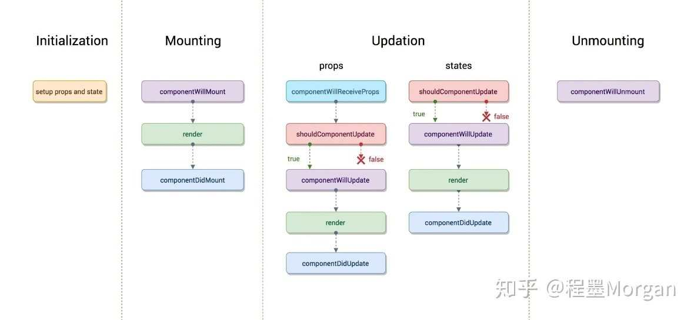
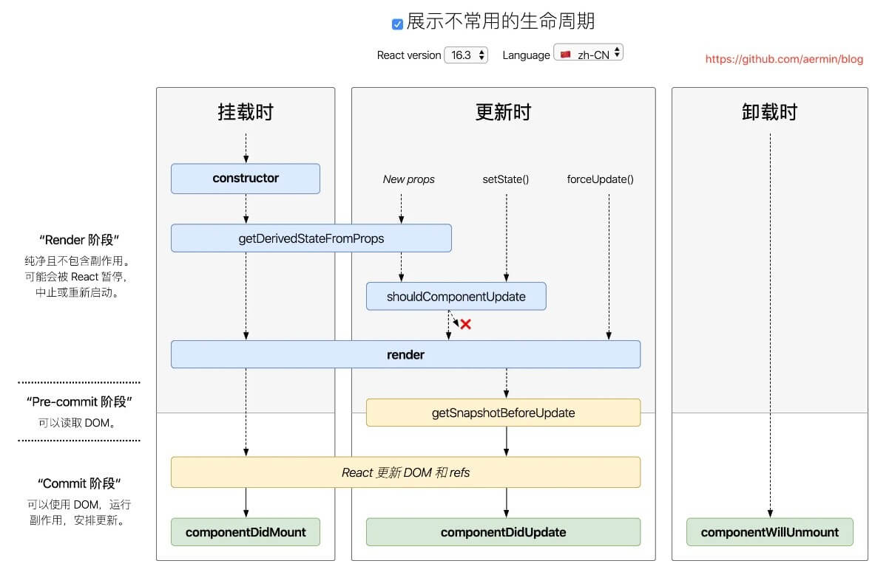
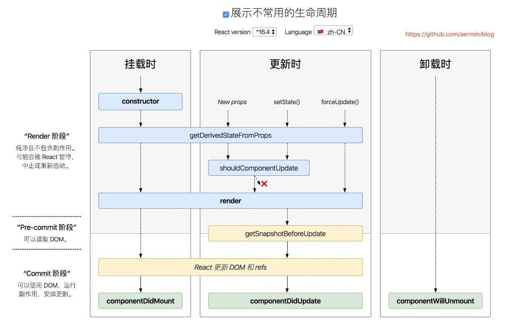
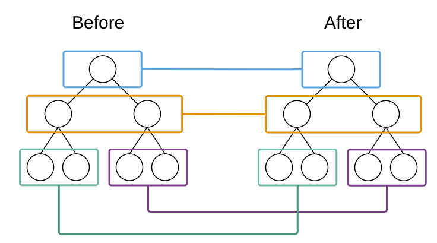
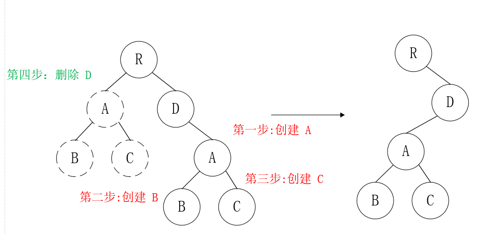
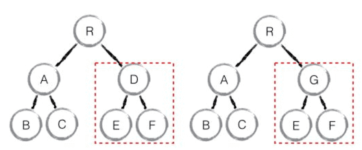
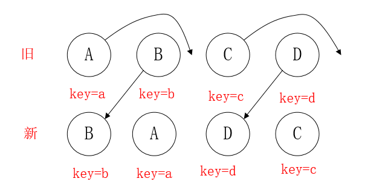

# React 教程

::: tip 转载、参考

- [https://www.taniarascia.com/getting-started-with-react/](https://www.taniarascia.com/getting-started-with-react/)
- [https://react.docschina.org](https://react.docschina.org/)
- [https://github.com/bailicangdu/react-pxq](https://github.com/bailicangdu/react-pxq)
- [https://blog.csdn.net/b954960630/article/details/79822639](https://blog.csdn.net/b954960630/article/details/79822639)
- ...

:::


## React 是什么

- React 是一个声明式，高效且灵活的用于构建用户界面的 JavaScript 库。
- React 不是一个框架 (unlike Angular, which is more opinionated)
- React is used to build user interfaces (UI) on the front end
- React is the **view** layer of an MVC application (Model View Controller)


## React 组件

有一个重要的点是，使用 React 可以将一些简短、独立的代码片段组合成复杂的 UI 界面，这些代码片段被称作“组件”。React 中拥有多种不同类型的组件，我们先从 `React.Component` 的子类开始介绍：

``` jsx
class ShoppingList extends React.Component {
  render() {
    return (
      <div className="shopping-list">
        <h1>Shopping List for {this.props.name}</h1>
        <ul>
          <li>Instagram</li>
          <li>WhatsApp</li>
          <li>Oculus</li>
        </ul>
      </div>
    );
  }
}

// 用法示例: <ShoppingList name="Mark" />
```

我们马上会讨论这些又奇怪、又像 XML 的标签。我们通过使用组件来告诉 React 我们希望在屏幕上看到什么。当数据发生改变时，React 会高效地更新并重新渲染我们的组件。<br />其中，ShoppingList 是一个 **React 组件类**，或者说是一个 **React 组件类型**。一个组件接收一些参数，我们把这些参数叫做 `props`（“props” 是 “properties” 简写），然后通过 `render` 方法返回需要展示在屏幕上的视图的层次结构。<br />`render` 方法的返回值*描述*了你希望在屏幕上看到的内容。React 根据描述，然后把结果展示出来。更具体地来说，`render` 返回了一个 **React 元素**，这是一种对渲染内容的轻量级描述。大多数的 React 开发者使用了一种名为 “JSX” 的特殊语法，JSX 可以让你更轻松地书写这些结构。语法 `<div />` 会被编译成 `React.createElement('div')`。上述的代码等同于：

``` jsx
return React.createElement('div', {className: 'shopping-list'},
  React.createElement('h1', /* ... h1 children ... */),
  React.createElement('ul', /* ... ul children ... */)
);
```

<br />

Almost everything in React consists of components, which can be **class components** or **simple components**.

<blockquote style="color:orange;border-left: 0.2rem solid orange;padding: 0.25rem 0 0.25rem 1rem;margin: 1rem 0;line-height: 1.7;
}">
React元素构成组件，组件又构成应用。<br />
React核心思想是组件化，其中 组件 通过属性(props) 和 状态(state)传递数据。
</blockquote>


### 类组件(**class components**)

Let's create another component. We're going to create a table. Make `Table.js`, and fill it with the following data.

``` jsx
import React, {Component} from 'react'

class Table extends Component {
  render() {
    return (
      <table>
        <thead>
          <tr>
            <th>Name</th>
            <th>Job</th>
          </tr>
        </thead>
        <tbody>
          <tr>
            <td>Charlie</td>
            <td>Janitor</td>
          </tr>
          <tr>
            <td>Mac</td>
            <td>Bouncer</td>
          </tr>
          <tr>
            <td>Dee</td>
            <td>Aspiring actress</td>
          </tr>
          <tr>
            <td>Dennis</td>
            <td>Bartender</td>
          </tr>
        </tbody>
      </table>
    )
  }
}

export default Table
```

This component we created is a custom class component. We capitalize custom components to differentiate them from regular HTML elements. Back in `App.js`, we can load in the Table, first by importing it in, and Then by loading it into the `render()` of `App`, where before we had "Hello, React!". I also changed the class of the outer container.

``` jsx
import React, {Component} from 'react'
import Table from './Table'

class App extends Component {
  render() {
    return (
      <div className="container">
        <Table />
      </div>
    )
  }
}

export default App
```

### 函数组件(Simple Components)

The other type of component in React is the **simple component**, which is a **function**. This component doesn't use the `class` keyword. Let's take our `Table` and make two simple components for it - a table header, and a table body. (We're going to use ES6 arrow functions to create these simple components. First, the table header.)

> before ES6, we can define fuction as example:
>
> ``` js
> function Welcome(props) {
>   return <h1>Hello, {props.name}</h1>;
> }
> ```

``` jsx
const TableHeader = () => {
  return (
    <thead>
      <tr>
        <th>Name</th>
        <th>Job</th>
      </tr>
    </thead>
  )
}
```

``` jsx
const TableBody = () => {
  return (
    <tbody>
      <tr>
        <td>Charlie</td>
        <td>Janitor</td>
      </tr>
      <tr>
        <td>Mac</td>
        <td>Bouncer</td>
      </tr>
      <tr>
        <td>Dee</td>
        <td>Aspiring actress</td>
      </tr>
      <tr>
        <td>Dennis</td>
        <td>Bartender</td>
      </tr>
    </tbody>
  )
}
```

Now our `Table` file will look like this. Note that the `TableHeader` and `TableBody` components are all in the same file, and being used by the `Table` class component.

``` jsx
const TableHeader = () => { ... }
const TableBody = () => { ... }

class Table extends Component {
  render() {
    return (
      <table>
        <TableHeader />
        <TableBody />
      </table>
    )
  }
}
```

Everything should appear as it did before. As you can see, components can be nested in other components, and simple and class components can be mixed.

> A class component must include `render()`, and the `return` can only return one parent element.


## Props & State

### State 与 Props 区别

`props 是组件对外的接口，state 是组件对内的接口`。组件内可以引用其他组件，组件之间的引用形成了一个树状结构（组件树），如果下层组件需要使用上层组件的数据或方法，上层组件就可以通过下层组件的props属性进行传递，因此props是组件对外的接口。组件除了使用上层组件传递的数据外，自身也可能需要维护管理数据，这就是组件对内的接口state。根据对外接口props 和对内接口state，组件计算出对应界面的UI。

**`主要区别`**：

- State是可变的，是一组用于反映组件UI变化的状态集合；
- 而Props对于使用它的组件来说，是只读的，要想修改Props，只能通过该组件的父组件修改。
  在组件状态上移的场景中，父组件正是通过子组件的Props, 传递给子组件其所需要的状态。

### Props

当一个组件被注入一些属性（Props ）值时，属性值来源于它的父级元素，所以人们常说，属性在 React 中是单向流动的：从父级到子元素。

#### ▎1、props(属性) 默认为 “true”

如果你没给 prop(属性) 传值，那么他默认为 true 。下面两个 JSX 表达式是等价的：

``` jsx
<MyTextBox autocomplete />
<MyTextBox autocomplete={true} />
```

通常情况下，我们不建议使用这种类型，因为这会与ES6中的对象shorthand混淆 。ES6 shorthand 中 {foo} 指的是 {foo: foo} 的简写，而不是 {foo: true} 。这种行为只是为了与 HTML 的行为相匹配。<br />
(举个例子，在 HTML 中，< input type=“radio” value=“1” disabled /> 与 < input type=“radio” value=“1” disabled=“true” /> 是等价的。JSX 中的这种行为就是为了匹配 HTML 的行为。)

#### ▎**2、props扩展**

如果你已经有一个 object 类型的 props，并且希望在 JSX 中传入，你可以使用扩展操作符 … 传入整个 props 对象。这两个组件是等效的：

``` jsx
function App1() {
  return <Greeting firstName="Ben" lastName="Hector" />;
}

function App2() {
  const props = {firstName: 'Ben', lastName: 'Hector'};
  return <Greeting {...props} />;
}
```

显然下面的方法更方便：`因为它将数据进行了包装，而且还简化了赋值的书写`

### State

#### ▎State是什么？

React 的`核心思想是组件化`，而组件中最重要的概念是State（状态），State是一个组件的UI数据模型，是组件渲染时的数据依据。<br />状态（state） 和 属性（props） 类似，都是一个组件所需要的一些数据集合，但是state是私有的，可以认为state是组件的“私有属性（或者是局部属性）”。

#### ▎**如何判断是否为State ？**

组件中用到的一个变量是不是应该作为组件State，可以通过下面的4条依据进行判断：

- 这个变量是否是通过Props从父组件中获取？如果是，那么它不是一个状态。
- 这个变量是否在组件的整个生命周期中都保持不变？如果是，那么它不是一个状态。
- 这个变量是否可以通过其他状态（State）或者属性(Props)计算得到？如果是，那么它不是一个状态。
- 这个变量是否在组件的render方法中使用？如果**不是**，那么它不是一个状态。这种情况下，这个变量更适合定义为组件的一个普通属性，例如组件中用到的定时器，就应该直接定义为this.timer，而不是this.state.timer。

> `并不是组件中用到的所有变量都是组件的状态！`当存在多个组件共同依赖一个状态时，一般的做法是状态上移，将这个状态放到这几个组件的公共父组件中。

#### ▎如何正确使用 State

**1、用setState 修改State**

直接修改state，组件并不会重新触发render()

``` jsx
// 错误
this.state.comment = 'Hello';
```

正确的修改方式是使用setState()

``` jsx
// 正确
this.setState({comment: 'Hello'});
```

**2、State 的更新是异步的**

- 调用setState后，setState会把要修改的状态放入一个队列中（因而 组件的state并不会立即改变）；
- 之后React 会优化真正的执行时机，来优化性能，所以优化过程中有可能会将多个 setState 的状态修改合并为一次状态修改，因而state更新可能是异步的。
- 所以不要依赖当前的State，计算下个State。当真正执行状态修改时，依赖的this.state并不能保证是最新的State，因为React会把多次State的修改合并成一次，这时，this.state将还是这几次State修改前的State。<br />
  另外需要注意的事，同样不能依赖当前的Props计算下个状态，因为Props一般也是从父组件的State中获取，依然无法确定在组件状态更新时的值。

**`综上所述：`**<br /><font color=#b30000>this.props 和 this.state 可能是异步更新的，你不能依赖他们的值计算下一个state(状态)</font>

**例**：这样 counter(计数器)会更新失败

```jsx
// 错误
this.setState({
  counter: this.state.counter + this.props.increment,
});
```

要弥补这个问题，使用 setState() 的另一种形式，它接受一个函数而不是一个对象。这个函数有两个参数：<br />
（1）第一个参数: 是当前最新状态的前一个状态（本次组件状态修改前的状态）<br />
（2）第二个参数：是当前最新的属性props

``` jsx
// 正确
this.setState((prevState, props) => ({
  counter: prevState.counter + props.increment
}));

//注意：下面这样是错的
this.setState((prevState, props) => { //没将{}用()括起来，所以会解析成代码块
  counter: prevState.counter + props.increment
});
```

如果你还不懂没关系，看下面例子：我们现在渲染出一个button，想每点击一下，counter就+3 <br />
看下面代码：

``` jsx
class App extends React.Component {
  state = {
    counter: 0,
  }
  handleClick = () => {
    const { counter } = this.state;
    //或者 const counter = this.state.counter;
    this.setState({ counter: counter + 1 });
    this.setState({ counter: counter + 1 });
    this.setState({ counter: counter + 1 });
  }
  render() {
    return (
      <div>
        counter is: {this.state.counter}
        <button onClick={this.handleClick} >点我</button>
      </div>
    )
  }
}
ReactDOM.render(<App />, document.getElementById('root'));
```

输出：

```
counter is: 0
```

每点击一下，加+1，并不是+3

```
counter is: 1
```

之所以+1,不是+3，是因为 state 的更新可能是异步的，React 会把传入多个 setState的多个 Object “batch” 起来合并成一个。`合并成一个就相当于把传入 setState 的多个 Object 进行 shallow merge`,像这样：

``` jsx
const update = {
    counter: counter + 1,
    counter: counter + 1,
    counter: counter + 1
    //因为上面三句话都一样，所以会当一句话执行
 }
```

我们可以这么做就会成功：看下面

``` jsx
class App extends React.Component {
  state = {
    counter: 0,
  }
  handleClick = () => {
    this.setState(prev => ({ counter: prev.counter + 1 }));
    this.setState(prev => ({ counter: prev.counter + 1 }));
    this.setState(prev => ({ counter: prev.counter + 1 }));
    //这样是错的 this.setState(prev => {counter: prev.counter + 1});
    //这样是错的 this.setState(prev => {counter:++prev.counter});
    //这样是错的 this.setState(prev => {counter:prev.counter++});
  }
  render() {
    return (
      <div>
        counter is: {this.state.counter}
        <button onClick={this.handleClick} >点我</button>
      </div>
    )
  }
}
ReactDOM.render(<App />, document.getElementById('root'));
```

之所以成功是因为：`传入多个 setState 的多个 Object 会被 shallow Merge，而传入多个 setState 的多个 function 会被 "queue" 起来，queue 里的 function 接收到的 state(上面是 prev )都是前一个 function 操作过的 state。`

**3、State更新会被合并**

官方文档看不懂不要紧，直接举个例子你就懂了。例如一个组件的状态为：

``` jsx
this.state = {
  title : 'React',
  content : 'React is an wonderful JS library!'
}
```

当只需要修改状态title时，只需要将修改后的title传给setState

``` jsx
this.setState({title: 'Reactjs'});
```

React会合并新的title到原来的组件状态中，同时保留原有的状态content，合并后的State为：

``` jsx
{
  title : 'Reactjs',
  content : 'React is an wonderful JS library!'
}
```

**4、setState里顺序更新**

``` jsx
//history 为数组
   this.setState({
       history: history.concat([1]),  //(1)
       current: history.length,       //(2)
       nextPlayer: !nextPlayer,       //(3)
  });
```

执行setState时：先更新history，然后`再用更新改变后的history计算current的值`，最后再更新nextPlayer

#### ▎根据State类型更新

当状态发生变化时，如何创建新的状态？根据状态的类型，可以分成三种情况：

**1、 状态的类型是不可变类型（数字，字符串，布尔值，null， undefined）**

这种情况最简单，直接给要修改的状态赋一个新值即可

``` jsx
//原state
this.state = {
  count: 0,
  title : 'React',
  success:false
}
//改变state
this.setState({
  count: 1,
  title: 'bty',
  success: true
})
```

**2、 状态的类型是数组**

`数组是一个引用，React 执行 diff 算法时比较的是两个引用，而不是引用的对象。所以直接修改原对象，引用值不发生改变的话，React 不会重新渲染。因此，修改状态的数组或对象时，要返回一个新的数组或对象。`<br />
（1）增加 <br />
如有一个数组类型的状态books，当向books中增加一本书(chinese)时，使用数组的concat方法或ES6的数组扩展语法

``` jsx
// 方法一：将state先赋值给另外的变量，然后使用concat创建新数组
let books = this.state.books; 
this.setState({
  books: books.concat(['chinese'])
})

// 方法二：使用preState、concat创建新数组
this.setState(preState => ({
  books: preState.books.concat(['chinese'])
}))

// 方法三：ES6 spread syntax
this.setState(preState => ({
  books: [...preState.books, 'chinese']
}))
```

（2）截取 <br />
当从books中截取部分元素作为新状态时，使用数组的slice方法：

``` jsx
// 方法一：将state先赋值给另外的变量，然后使用slice创建新数组
let books = this.state.books; 
this.setState({
  books: books.slice(1,3)
})
// 
// 方法二：使用preState、slice创建新数组
this.setState(preState => ({
  books: preState.books.slice(1,3)
}))
```

（3）条件过滤 <br />
当从books中过滤部分元素后，作为新状态时，使用数组的filter方法：

``` jsx
// 方法一：将state先赋值给另外的变量，然后使用filter创建新数组
var books = this.state.books; 
this.setState({
  books: books.filter(item => {
    return item != 'React'; 
  })
})

// 方法二：使用preState、filter创建新数组
this.setState(preState => ({
  books: preState.books.filter(item => {
    return item != 'React'; 
  })
}))
```

> 注意：不要使用push、pop、shift、unshift、splice等方法修改数组类型的状态，因为这些方法都是在原数组的基础上修改，而concat、slice、filter会返回一个新的数组。

**3、状态的类型是普通对象（不包含字符串、数组）**

`对象是一个引用，React 执行 diff 算法时比较的是两个引用，而不是引用的对象。所以直接修改原对象，引用值不发生改变的话，React 不会重新渲染。因此，修改状态的数组或对象时，要返回一个新的对象。`

使用ES6 的Object.assgin方法

``` jsx
// 方法一：将state先赋值给另外的变量，然后使用Object.assign创建新对象
var owner = this.state.owner;
this.setState({
  owner: Object.assign({}, owner, {name: 'Jason'})
})

// 方法二：使用preState、Object.assign创建新对象
this.setState(preState => ({
  owner: Object.assign({}, preState.owner, {name: 'Jason'})
}))
```

使用对象扩展语法（object spread properties）

``` jsx
// 方法一：将state先赋值给另外的变量，然后使用对象扩展语法创建新对象
var owner = this.state.owner;
this.setState({
  owner: {...owner, name: 'Jason'}
})

// 方法二：使用preState、对象扩展语法创建新对象
this.setState(preState => ({
  owner: {...preState.owner, name: 'Jason'}
}))
```

**`综上所述`**：<br>
创建新的状态对象的关键是，`避免使用会直接修改原对象的方法，而是使用可以返回一个新对象的方法。`

#### ▎State向下流动

我们说 props 是组件对外的接口，state 是组件对内的接口。<br />
一个组件可以选择将 state(状态) 向下传递，作为其子组件的 props(属性)：

``` jsx
<MyComponent title={this.state.title}/>
```

这通常称为一个“从上到下”，或者“单向”的数据流。任何 state(状态) 始终由某个特定组件所有，并且从该 state(状态) 导出的任何数据 或 UI 只能影响树中 “下方” 的组件。

如果把组件树想像为 props(属性) 的瀑布，所有组件的 state(状态) 就如同一个额外的水源汇入主流，且只能随着主流的方向向下流动。


## 组件间通信

::: tip 转载

- [https://www.jianshu.com/p/fb915d9c99c4](https://www.jianshu.com/p/fb915d9c99c4)

:::

组件间通信大体有下面几种情况：

- 父组件向子组件通信
- 子组件向父组件通信
- 跨级组件之间通信
- 非嵌套组件间通信

### 父组件向子组件通信

这是最简单也是最常用的一种通信方式：父组件通过向子组件传递 props，子组件得到 props 后进行相应的处理。下面是演示代码：

父组件 App.js：

``` jsx
import React,{ Component } from "react";
import Sub from "./SubComponent.js";
import "./App.css";

export default class App extends Component{

    render(){
        return(
            <div>
                <Sub title = "今年过节不收礼" />
            </div>
        )
    }
}
```

子组件 SubComponent.js：

```jsx
import React from "react";

const Sub = (props) => {
    return(
        <h1>
            { props.title }
        </h1>
    )
}

export default Sub;
```

### 子组件向父组件通信

利用回调函数，可以实现子组件向父组件通信：父组件将一个函数作为 props 传递给子组件，子组件调用该回调函数，便可以向父组件通信。下面是演示代码：

SubComponent.js：

``` jsx
import React from "react";

const Sub = (props) => {
    const cb = (msg) => {
        return () => {
            props.callback(msg)
        }
    }
    return(
        <div>
            <button onClick = { cb("我们通信把") }>点击我</button>
        </div>
    )
}

export default Sub;
```

App.js：

``` jsx
import React,{ Component } from "react";
import Sub from "./SubComponent.js";
import "./App.css";

export default class App extends Component{
    callback(msg){
        console.log(msg);
    }
    render(){
        return(
            <div>
                <Sub callback = { this.callback.bind(this) } />
            </div>
        )
    }
}
```

### 跨级组件通信

所谓跨级组件通信，就是父组件向子组件的子组件通信，向更深层的子组件通信。跨级组件通信可以采用下面两种方式：

- 中间组件层层传递 props
- 使用 context 对象

对于第一种方式，如果父组件结构较深，那么中间的每一层组件都要去传递 props，增加了复杂度，并且这些  props 并不是这些中间组件自己所需要的。不过这种方式也是可行的，当组件层次在三层以内可以采用这种方式，当组件嵌套过深时，采用这种方式就需要斟酌了。

使用 context 是另一种可行的方式，context 相当于一个全局变量，是一个大容器，我们可以把要通信的内容放在这个容器中，这样一来，不管嵌套有多深，都可以随意取用。使用 context 也很简单，需要满足两个条件：

- 上级组件要声明自己支持 context，并提供一个函数来返回相应的 context 对象
- 子组件要声明自己需要使用 context

下面以代码说明，我们新建 3 个文件：父组件 App.js，子组件 Sub.js，子组件的子组件 SubSub.js。

App.js：

``` jsx
import React, { Component } from 'react';
import PropTypes from "prop-types";
import Sub from "./Sub";
import "./App.css";

export default class App extends Component{
    // 父组件声明自己支持 context
    static childContextTypes = {
        color:PropTypes.string,
        callback:PropTypes.func,
    }

    // 父组件提供一个函数，用来返回相应的 context 对象
    getChildContext(){
        return{
            color:"red",
            callback:this.callback.bind(this)
        }
    }

    callback(msg){
        console.log(msg)
    }

    render(){
        return(
            <div>
                <Sub></Sub>
            </div>
        );
    }
} 
```

Sub.js：

``` jsx
import React from "react";
import SubSub from "./SubSub";

const Sub = (props) =>{
    return(
        <div>
            <SubSub />
        </div>
    );
}

export default Sub;
```

SubSub.js：

``` jsx
import React,{ Component } from "react";
import PropTypes from "prop-types";

export default class SubSub extends Component{
    // 子组件声明自己需要使用 context
    static contextTypes = {
        color:PropTypes.string,
        callback:PropTypes.func,
    }
    render(){
        const style = { color:this.context.color }
        const cb = (msg) => {
            return () => {
                this.context.callback(msg);
            }
        }
        return(
            <div style = { style }>
                SUBSUB
                <button onClick = { cb("我胡汉三又回来了！") }>点击我</button>
            </div>
        );
    }
}
```

如果是父组件向子组件单向通信，可以使用变量，如果子组件想向父组件通信，同样可以由父组件提供一个回调函数，供子组件调用，回传参数。在使用 context 时，有两点需要注意：

- 父组件需要声明自己支持 context，并提供 context 中属性的 PropTypes
- 子组件需要声明自己需要使用 context，并提供其需要使用的 context 属性的 PropTypes
- 父组件需提供一个 getChildContext 函数，以返回一个初始的 context 对象

**如果组件中使用构造函数（constructor），还需要在构造函数中传入第二个参数 context，并在 super 调用父类构造函数是传入 context，否则会造成组件中无法使用 context**。

``` jsx
...
constructor(props,context){
  super(props,context);
}
...
```

### 改变 context 对象

我们不应该也不能直接改变 context 对象中的属性，要想改变 context 对象，**只有让其和父组件的 state 或者 props 进行关联，在父组件的 state 或 props 变化时，会自动调用 getChildContext 方法，返回新的 context 对象**，而后子组件进行相应的渲染。修改 App.js，让 context 对象可变：

``` jsx
import React, { Component } from 'react';
import PropTypes from "prop-types";
import Sub from "./Sub";
import "./App.css";

export default class App extends Component{
    constructor(props) {
        super(props);
        this.state = {
            color:"red"
        };
    }
    // 父组件声明自己支持 context
    static childContextTypes = {
        color:PropTypes.string,
        callback:PropTypes.func,
    }

    // 父组件提供一个函数，用来返回相应的 context 对象
    getChildContext(){
        return{
            color:this.state.color,
            callback:this.callback.bind(this)
        }
    }

    // 在此回调中修改父组件的 state
    callback(color){
        this.setState({
            color,
        })
    }

    render(){
        return(
            <div>
                <Sub></Sub>
            </div>
        );
    }
} 
```

此时，在子组件的 cb 方法中，传入相应的颜色参数，就可以改变 context 对象了，进而影响到子组件：

``` jsx
...
return(
    <div style = { style }>
        SUBSUB
        <button onClick = { cb("blue") }>点击我</button>
    </div>
);
...
```

context 同样可以应在无状态组件上，只需将 context 作为第二个参数传入：

``` jsx
import React,{ Component } from "react";
import PropTypes from "prop-types";

const SubSub = (props,context) => {
    const style = { color:context.color }
    const cb = (msg) => {
        return () => {
            context.callback(msg);
        }
    }

    return(
        <div style = { style }>
            SUBSUB
            <button onClick = { cb("我胡汉三又回来了！") }>点击我</button>
        </div>
    );
}

SubSub.contextTypes = {
    color:PropTypes.string,
    callback:PropTypes.func,
}

export default SubSub;
```

### 非嵌套组件间通信

非嵌套组件，就是没有任何包含关系的组件，包括兄弟组件以及不在同一个父级中的非兄弟组件。对于非嵌套组件，可以采用下面两种方式：

- 利用二者共同父组件的 context 对象进行通信
- 使用自定义事件的方式

如果采用组件间共同的父级来进行中转，会增加子组件和父组件之间的耦合度，如果组件层次较深的话，找到二者公共的父组件不是一件容易的事，当然还是那句话，也不是不可以...

这里我们采用自定义事件的方式来实现非嵌套组件间的通信。我们需要使用一个 events 包：

``` bash
npm install events --save
```

新建一个 ev.js，引入 events 包，并向外提供一个事件对象，供通信时使用：

``` jsx
import { EventEmitter } from "events";
export default new EventEmitter();
```

App.js：

``` jsx
import React, { Component } from 'react';

import Foo from "./Foo";
import Boo from "./Boo";

import "./App.css";

export default class App extends Component{
    render(){
        return(
            <div>
                <Foo />
                <Boo />
            </div>
        );
    }
} 
```

Foo.js：

``` jsx
import React,{ Component } from "react";
import emitter from "./ev"

export default class Foo extends Component{
    constructor(props) {
        super(props);
        this.state = {
            msg:null,
        };
    }
    componentDidMount(){
        // 声明一个自定义事件
        // 在组件装载完成以后
        this.eventEmitter = emitter.addListener("callMe",(msg)=>{
            this.setState({
                msg
            })
        });
    }
    // 组件销毁前移除事件监听
    componentWillUnmount(){
        emitter.removeListener(this.eventEmitter);
    }
    render(){
        return(
            <div>
                { this.state.msg }
                我是非嵌套 1 号
            </div>
        );
    }
}
```

Boo.js：

``` jsx
import React,{ Component } from "react";
import emitter from "./ev"

export default class Boo extends Component{
    render(){
        const cb = (msg) => {
            return () => {
                // 触发自定义事件
                emitter.emit("callMe","Hello")
            }
        }
        return(
            <div>
                我是非嵌套 2 号
                <button onClick = { cb("blue") }>点击我</button>
            </div>
        );
    }
}
```

自定义事件是典型的发布/订阅模式，通过向事件对象上添加监听器和触发事件来实现组件间通信。

测试结果：

```
// 初始值
我是非嵌套 1 号
我是非嵌套 2 号 [点击我]

// 点击button [点击我] 后的值
Hello, 我是非嵌套 1 号
我是非嵌套 2 号 [点击我]
```

### 总结

总结了 React 中组件的几种通信方式，分别是：

- 父组件向子组件通信：使用 props
- 子组件向父组件通信：使用 props 回调
- 跨级组件间通信：使用 context 对象
- 非嵌套组件间通信：使用事件订阅


## React 生命周期

::: tip 转载

- [https://www.jianshu.com/p/514fe21b9914](https://www.jianshu.com/p/514fe21b9914)

:::

### React v16.0前的生命周期

其实大部分团队不见得会跟进升到16版本，所以16前的生命周期还是很有必要掌握的，何况16也是基于之前的修改

<div style="display:flex;"></div>

#### 第一个是组件初始化(initialization)阶段

也就是以下代码中类的构造方法( constructor() ),Test类继承了react Component这个基类，也就继承这个react的基类，才能有render(),生命周期等方法可以使用，这也说明为什么`函数组件不能使用这些方法`的原因。

`super(props)`用来调用基类的构造方法( constructor() ), 也将父组件的props注入给子组件，功子组件读取(组件中props只读不可变，state可变)。而`constructor()`用来做一些组件的初始化工作，如定义this.state的初始内容。

``` jsx
import React, { Component } from 'react';

class Test extends Component {
  constructor(props) {
    super(props);
  }
}
```

#### 第二个是组件的挂载(Mounting)阶段

**此阶段分为componentWillMount，render，componentDidMount三个时期。**

- componentWillMount:	在组件挂载到DOM前调用，且只会被调用一次，在这边调用this.setState不会引起组件重新渲染，也可以把写在这边的内容提前到`constructor()`中，所以项目中很少用。
- render: 根据组件的props和state（无两者的重传递和重赋值，论值是否有变化，都可以引起组件重新render） ，return 一个React元素（描述组件，即UI），不负责组件实际渲染工作，之后由React自身根据此元素去渲染出页面DOM。render是纯函数（Pure function：函数的返回结果只依赖于它的参数；函数执行过程里面没有副作用），不能在里面执行`this.setState`，会有改变组件状态的副作用。
- componentDidMount: 组件挂载到DOM后调用，且只会被调用一次

#### 第三个是组件的更新(update)阶段

在讲述此阶段前需要先明确下react组件更新机制。setState引起的state更新或父组件重新render引起的props更新，更新后的state和props相对之前无论是否有变化，都将引起子组件的重新render。

**造成组件更新有两类（三种）情况：**

- 1.父组件重新render

  父组件重新render引起子组件重新render的情况有两种

  a. 直接使用,每当父组件重新render导致的重传props，子组件将直接跟着重新渲染，无论props是否有变化。可通过`shouldComponentUpdate`方法优化。

  ``` jsx
  class Child extends Component {
     shouldComponentUpdate(nextProps){ // 应该使用这个方法，否则无论props是否有变化都将会导致组件跟着重新渲染
          if(nextProps.someThings === this.props.someThings){
            return false
          }
      }
      render() {
          return <div>{this.props.someThings}</div>
      }
  }
  ```

  b.在componentWillReceiveProps方法中，将props转换成自己的state

  ``` jsx
  class Child extends Component {
      constructor(props) {
          super(props);
          this.state = {
              someThings: props.someThings
          };
      }
      componentWillReceiveProps(nextProps) { // 父组件重传props时就会调用这个方法
          this.setState({someThings: nextProps.someThings});
      }
      render() {
          return <div>{this.state.someThings}</div>
      }
  }
  ```

  根据官网的描述

  > 在该函数(componentWillReceiveProps)中调用 this.setState() 将不会引起第二次渲染。

  是因为`componentWillReceiveProps`中判断`props`是否变化了，若变化了，`this.setState`将引起`state`变化，从而引起`render`，此时就没必要再做第二次因重传`props`引起的`render`了，不然重复做一样的渲染了。

- 2.组件本身调用setState，无论state有没有变化。可通过`shouldComponentUpdate`方法优化。

  ``` jsx
  class Child extends Component {
     constructor(props) {
          super(props);
          this.state = {
            someThings:1
          }
     }
     shouldComponentUpdate(nextStates){ // 应该使用这个方法，否则无论state是否有变化都将会导致组件重新渲染
          if(nextStates.someThings === this.state.someThings){
            return false
          }
      }
  
     handleClick = () => { // 虽然调用了setState ，但state并无变化
          const preSomeThings = this.state.someThings
           this.setState({
              someThings: preSomeThings
           })
     }
  
      render() {
          return <div onClick = {this.handleClick}>{this.state.someThings}</div>
      }
  }
  ```

**此阶段分为componentWillReceiveProps，shouldComponentUpdate，componentWillUpdate，render，componentDidUpdate**

- componentWillReceiveProps(nextProps)

  此方法只调用于props引起的组件更新过程中，响应 Props 变化之后进行更新的唯一方式，参数nextProps是父组件传给当前组件的新props。但父组件render方法的调用不能保证重传给当前组件的props是有变化的，所以在此方法中根据`nextProps`和`this.props`来查明重传的props是否改变，以及如果改变了要执行啥，比如根据新的props调用this.setState出发当前组件的重新render

- shouldComponentUpdate(nextProps, nextState)

  此方法通过比较nextProps，nextState及当前组件的this.props，this.state，返回true时当前组件将继续执行更新过程，返回false则当前组件更新停止，以此可用来减少组件的不必要渲染，优化组件性能。<br />ps：这边也可以看出，就算`componentWillReceiveProps()`中执行了`this.setState`，更新了state，但在render前（如`shouldComponentUpdate`，`componentWillUpdate`），`this.state`依然指向更新前的state，不然`nextState`及当前组件的this.state的对比就一直是true了。<br />如果`shouldComponentUpdate` 返回false，那就一定不用rerender(重新渲染 )这个组件了，组件的React elements(React 元素) 也不用去比对。 但是如果`shouldComponentUpdate` 返回true，会进行组件的React elements比对，如果相同，则不用rerender这个组件，如果不同，会调用render函数进行rerender。

- componentWillUpdate(nextProps, nextState)

  此方法在调用render方法前执行，在这边可执行一些组件更新发生前的工作，一般较少用。

- render

  render方法在上文讲过，这边只是重新调用。

- componentDidUpdate(prevProps, prevState)

  此方法在组件更新后被调用，可以操作组件更新的DOM，prevProps和prevState这两个参数指的是组件更新前的props和state

#### 卸载阶段

此阶段只有一个生命周期方法：`componentWillUnmount`

- componentWillUnmount

  此方法在组件被卸载前调用，可以在这里执行一些清理工作，比如清楚组件中使用的定时器，清楚`componentDidMount`中手动创建的DOM元素等，以避免引起内存泄漏。


### React v16.4+ 的生命周期

**变更缘由**

原来（React v16.0前）的生命周期在React v16推出的[**Fiber**]之后就不合适了，因为如果要开启`async rendering`，在render函数之前的所有函数，都有可能被执行多次。

原来（React v16.0前）的生命周期有哪些是在render前执行的呢？

- componentWillMount
- componentWillReceiveProps
- shouldComponentUpdate
- componentWillUpdate

如果开发者开了async rendering，而且又在以上这些render前执行的生命周期方法做AJAX请求的话，那AJAX将被无谓地多次调用。。。明显不是我们期望的结果。而且在`componentWillMount`里发起AJAX，不管多快得到结果也赶不上首次render，而且componentWillMount在服务器端渲染也会被调用到（当然，也许这是预期的结果），这样的IO操作放在`componentDidMount`里更合适。

禁止不能用比劝导开发者不要这样用的效果更好，所以除了`shouldComponentUpdate`，其他在render函数之前的所有函数（`componentWillMount`，`componentWillReceiveProps`，`componentWillUpdate`）都被`getDerivedStateFromProps`替代。

也就是用一个静态函数`getDerivedStateFromProps`来取代被deprecate的几个生命周期函数，就是强制开发者在render之前只做无副作用的操作，而且能做的操作局限在根据props和state决定新的state

React v16.0刚推出的时候，是增加了一个`componentDidCatch`生命周期函数，这只是一个增量式修改，完全不影响原有生命周期函数；但是，到了React v16.3，大改动来了，引入了两个新的生命周期函数： `getDerivedStateFromProps`，`getSnapshotBeforeUpdate`

#### getDerivedStateFromProps

`getDerivedStateFromProps`本来（React v16.3中）是只在创建和更新（由父组件引发部分）中调用。如果不是由父组件引发，那么`getDerivedStateFromProps`也不会被调用，如自身setState引发或者forceUpdate引发。

**React v16.3 的生命周期图**

<div style="display:flex;"></div>

这样的话理解起来有点乱，在React v16.4中改正了这一点，让`getDerivedStateFromProps`无论是Mounting还是Updating，也无论是因为什么引起的Updating，全部都会被调用，具体可看React v16.4 的生命周期图。

#### React v16.4+ 的生命周期图

<div style="display:flex;"></div>

#### **React v16.4后的getDerivedStateFromProps**

***static getDerivedStateFromProps(props, state)*** 在组件创建时和更新时的render方法之前调用，它应该返回一个对象来更新状态，或者返回null来不更新任何内容。

**注意：**

1. getDerivedStateFromProps前面要加上static保留字，声明为静态方法，不然会被react忽略掉
2. getDerivedStateFromProps里面的this为undefined

static静态方法只能Class(构造函数)来调用(App.staticMethod✅)，而实例是不能的( (new App()).staticMethod ❌ )；
 当调用React Class组件时，该组件会实例化；<br />所以，React Class组件中，静态方法getDerivedStateFromProps无权访问Class实例的this，即this为undefined。


#### getSnapshotBeforeUpdate

***getSnapshotBeforeUpdate()*** 被调用于render之后，可以读取但无法使用DOM的时候。它使您的组件可以在可能更改之前从DOM捕获一些信息（例如滚动位置）。此生命周期返回的任何值都将作为参数传递给`componentDidUpdate（）`。

官网给的例子：

``` jsx
class ScrollingList extends React.Component {
  constructor(props) {
    super(props);
    this.listRef = React.createRef();
  }

  getSnapshotBeforeUpdate(prevProps, prevState) {
    //我们是否要添加新的 items 到列表?
    // 捕捉滚动位置，以便我们可以稍后调整滚动.
    if (prevProps.list.length < this.props.list.length) {
      const list = this.listRef.current;
      return list.scrollHeight - list.scrollTop;
    }
    return null;
  }

  componentDidUpdate(prevProps, prevState, snapshot) {
    //如果我们有snapshot值, 我们已经添加了 新的items.
    // 调整滚动以至于这些新的items 不会将旧items推出视图。
    // (这边的snapshot是 getSnapshotBeforeUpdate方法的返回值)
    if (snapshot !== null) {
      const list = this.listRef.current;
      list.scrollTop = list.scrollHeight - snapshot;
    }
  }

  render() {
    return (
      <div ref={this.listRef}>{/* ...contents... */}</div>
    );
  }
}
```


## React Diff算法

::: danger 注意

Diff算法也在一直演进中，所以请总是查阅最新文档。

<br />

:::

::: tip 转载、参考 - 帮助理解

- [http://www.gaoyunjiao.fun/?p=170](http://www.gaoyunjiao.fun/?p=170)

:::

Diff算法一直是React系统最核心的部分，并且由于演化自传统diff，使得比较方式从O(n^3)降级到O(n)，然后又改成了链表方式，所以需要查阅相关文档，了解对应版本/最新版本所使用的算法。

### 传统Diff算法

传统diff算法需要循环比较两棵树，所有节点的循环，那么单纯比较次数就是O(n^2)，n*n

```
P                         L
          A                     A  
         / \                   / \
        /   \                 /   \
       B     D     ====>     D     B
      /                             \
     C                               C
```

刷刷刷，每次都需要循环遍历，于是有以下的查找过程：

```
PA->LA
PA->LB
PA->LC
PA->LD
PB->LA
...
```

除了查找过程消耗了O(n^2)之外，找到差异后还要计算最小转换方式，最终结果为O(n^3)。<br />所以，传统的diff算法的时间复杂度为O(n^3)。

如果React运用这种算法，那么节点过多，将会有大量的开销，虽然CPU的秒速达到30亿次计算，但依旧是非常耗费性能的。

有没有什么方式可以降低时间复杂度呢？<br />于是，React15对传统的diff做了一些限制，使得时间复杂度变为了O(n)。


### React 15的Diff算法

《深入React技术栈》这本书，给出了三种Diff策略分析，文字描述太过抽象，直接表述如下：**Tree diff**、**Component diff**、**Element diff**

#### Tree diff

什么是Tree diff？先上图：

<div style="display:flex;"></div>

首先，进行同级比较，并非循环比较。这样比较次数就降为一层一次，时间复杂度直接降为O(n)。<br />如果同级相同位置节点不一样，则直接删除替换，简单粗暴。<br />而对于节点移动，同样道理，也是简单粗暴的删除重建。如下图所示（图中第四步应该是删除左侧的整棵A树）：

<div style="display:flex;"></div>

<br />

#### Component diff

不多说，先上图：

<div style="display:flex;"></div>

其实component diff相当于是子树的diff，基本方案和tree diff是一致的，如果如上图D变为G，那么直接删除D这一整棵树，然后重新渲染G树。依旧是简单粗暴。

#### Element diff

对于同一节点的元素，diff算法提供了三种操作：插入、移动、删除。还是先上图：

<div style="display:flex;"></div>

此时的操作，是B、D不做任何操作，AC移动到相应位置【前提是都有相同的key】<br />如果，此时的key不相同，全都发生了变化，那么节点全都是要删除重新构建，将会消耗大量性能。


### React 16的Diff算法

React16相比React15的Diff算法发生了很大的变化，其中最主要就是引入了Fiber循环任务调度算法。

#### Fiber

**Fiber是什么**？**干了什么**？Fiber在diff阶段，做了如下的操作：

1. 可以随时将diff操作进行任务拆分。
2. diff阶段的每个任务可以随时执行或者中止。
3. diff阶段任务调度优先级控制。

所以，Fiber相当于是，在15的diff算法阶段，做了优先级的任务调度控制。Fiber是根据一个fiber节点（VDOM节点）来拆分，以fiber node为一个任务单元，一个组件实例都是一个任务单元。任务循环中，每处理完一个fiber node，可以中断/挂起/恢复。

它又是如何能够进行这样的异步操作的呢？这就不得不说一个方法：`requestIdleCallback`<br />浏览器提供的requestIdleCallback API中的Cooperative Scheduling可以让浏览器在空闲时间执行回调（开发者传入的方法），在回调参数中可以获取到当前帧（16ms）剩余的时间。利用这个信息可以合理的安排当前帧需要做的事情，如果时间足够，那继续做下一个任务，如果时间不够就歇一歇，调用requestIdleCallback来获知主线程不忙的时候，再继续做任务

**Fiber Node是什么？**

链表！将要处理的节点，存在链表结构，那么就能够做到节点复用。【这大概是Fiber的核心吧】<br />大体上的Diff引入了Fiber之后，我们就增加了更多的链表复用功能，通过这一点，我们可以使得React Diff的性能得到提升。

<br />

***更多16的Diff算法参考文章***:

- [https://www.jianshu.com/p/7e8ee5dba3c5](https://www.jianshu.com/p/7e8ee5dba3c5)
- ... ...

<br />


## React Router路由


to be added ...

<br />


## Redux

to be added ...

<br />


