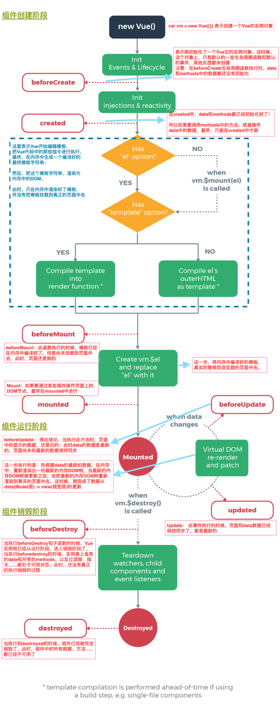

# Vue 实例以及生命周期

::: tip 此文为转载 （通常一篇文章会参考多处，也会添加自己的理解，引用地址如有遗漏，请指出）

- [官方文档](https://cn.vuejs.org/v2/guide/instance.html)
- https://www.bilibili.com/video/BV1sb411M7RT?from=search&seid=18088354913879114762

:::

本文主要有两方面，一个是关于实例，相关概念建议详读官方文档，这里主要复制出重点信息。另外一个是实例的生命周期，具体详细的解释有助于初学理解。

## 创建一个 Vue 实例

每个 Vue 应用都是通过用 `Vue` 函数创建一个新的 **Vue 实例**开始的：

```vue
var vm = new Vue({
  // 选项
})
```

一个 Vue 应用由一个通过 `new Vue` 创建的**根 Vue 实例**，以及可选的嵌套的、可复用的组件树组成。举个例子，一个 todo 应用的组件树可以是这样的：

```vue
根实例
└─ TodoList
   ├─ TodoItem
   │  ├─ DeleteTodoButton
   │  └─ EditTodoButton
   └─ TodoListFooter
      ├─ ClearTodosButton
      └─ TodoListStatistics
```

[*组件概念另外单独介绍*]，不过现在，你只需要明白**所有的 Vue 组件都是 Vue 实例**，并且接受相同的选项对象 (一些根实例特有的选项除外)。


## [数据与方法](https://cn.vuejs.org/v2/guide/instance.html#数据与方法)

（点击标题链接，查看官方原文）

## [实例生命周期钩子](https://cn.vuejs.org/v2/guide/instance.html#实例生命周期钩子)

（点击标题链接，查看官方原文）

## 生命周期图

组件生命周期分为三个阶段：

- 创建阶段
  - 此期间一共有四个钩子函数，`mouted`是其最后一个生命周期函数，当执行完`mounted`函数就表示，实例已经完全被创建好了。（如果没有其他操作，这个实例就静静地存在内存中）
- 运行阶段
  - 此期间只有两个生命周期函数:`beforeUpdate`和`Updated`。这两个函数，会根据`data`的变化，有选择性的触发**0次**或者**多次**！
- 销毁阶段
  - 两个函数`beforeDestroy`和`Destroyed`.

<br/>

*具体查看图中详解*:

<div style="display:flex;"></div>