# Java基础-集合1

::: tip 此文为转载 （通常一篇文章会参考多处，也会添加自己的理解，引用地址如有遗漏，请指出）

- https://www.cnblogs.com/SkyeAngel/p/7808684.html
- https://blog.csdn.net/feiyanaffection/article/details/81394745
- https://www.cnblogs.com/run127/p/5540794.html
- https://www.cnblogs.com/www-123456/p/10896844.html

:::

<br />

本文主要是对Java集合的一些详细介绍与总结。

## 对象的存储：

 ①数组（基本数据类型&引用数据类型）②集合（引用数据类型）

> 数组存储数据的弊端：长度一旦初始化，就不可变；真正给数组元素赋值的个数没有现成的方法可用。


## 集合框架


### 集合框架图

<br />

<div style="display:flex;">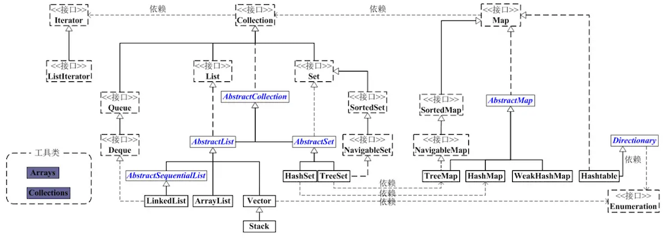</div>


### Collection接口

> 方法：
>
> add(Object obj), addAll(Collection coll), size(), clear(), isEmpty()
>
> remove(Object obj), removeAll(Collection coll), retainAll(Collection coll), equals(Object obj), contains(Object obj), containsAll(Collection coll), hashCode()
>
> iterator(), toArray()


### List 接口

存储有序的，可以重复的元素。--相当于“动态”数组

> 新增的方法：删除remove(int index),修改set(int index,Object obj),获取get(int index),插入add(int index,Object obj)

添加进List集合中的元素（或对象）所在的类一定要重写equals()方法

**主要实现类**

- **ArrayList**：主要的实现类
- **LinkedList**：更适用于频繁的插入，删除操作
- **Vector**：古老的实现类，线程安全的，但效率低于ArrayList


### Set 接口

存储无序的，不可重复的元素。

> Set使用的方法基本上都是Collection接口下定义的。

- 添加进Set集合中的元素所在的类一定要重写equals()和hashCode().要求重写equals和hashCode()方法保持一致。
- 无序性：无序性！=随机性。真正的无序性，指的是元素在底层存储的位置是无序的。
- 不可重复性：当向Set中添加进相同的元素的时候，后面的这个不能添加进去

**主要实现类**

- **HashSet**：主要的实现类 

- **LinkedHashset**：HashSet的子类，当我们遍历集合元素时，是按照添加进去的顺序实现的；频繁的遍历，较少的添加

- **TreeSet**：可以按照添加进集合中的元素的**指定属性**进行排序<br>要求TreeSet添加进的元素必须是同一个类的！<br>两种排序方式：

  1. 自然排序：
     - 要求添加进TreeSet中的元素所在的类implements Comparable接口
     - 重写compareTo(Object obj)，在此方法内指明按照元素的哪个属性进行排序
     - 向TreeSet中添加元素即可。若不实现此接口，会报运行时异常

  2. 定制排序
     - 创建一个实现Comparable接口的实现类的对象。在实现类中重写Comparator的compare(Object ob1, Object ob2)方法
     - 在此compare()方法中指明按照元素所在类的哪个属性进行排序
     - 将此实现Comparator接口的实现类的对象作为形参递给TreeSet的构造器中
     - 向TreeSet中添加元素即可。若不实现此接口，会报运行时异常
     - 要求重写的compareTo()或者compare()方法与equals()和hashCode方法保持一致。


### Queue接口

队列是一种特殊的线性表，它只允许在表的前端（front）进行删除操作，而在表的后端（rear）进行插入操作。进行插入操作的端称为队尾，进行删除操作的端称为队头。队列中没有元素时，称为空队列。

**在队列这种数据结构中，最先插入的元素将是最先被删除的元素；反之最后插入的元素将是最后被删除的元素，因此队列又称为“先进先出”（FIFO—first in first out）的线性表。**

在java5中新增加了java.util.Queue接口，用以支持队列的常见操作。该接口扩展了java.util.Collection接口。

Queue使用时要尽量避免Collection的add()和remove()方法，而是要使用offer()来加入元素，使用poll()来获取并移出元素。它们的优点是通过返回值可以判断成功与否，add()和remove()方法在失败的时候会抛出异常。 如果要使用前端而不移出该元素，使用
element()或者peek()方法。

值得注意的是LinkedList类实现了Queue接口，因此我们可以把LinkedList当成Queue来用。


### **Map接口**

存储“键-值”对的数据。key是不可重复的，使用Set存放，value可以重复，使用Collection来存放的，一个key-value对构成一个entry(Map.Entry),entry使用Set来存放。

> 添加、修改put(Object key, Object value)，删除remove(Object key)，获取get(Object key)，size() / keySet，values()，entrySet() -> 遍历方法

- **HashMap**：主要的实现类,可以添加null键
- **LinkedHashMap**：时HashMap的子类，可以按照添加进Map的顺序实现遍历
- **TreeMap**：需要按照key所在类的指定属性进行排序，要求key时同一个类的对象。对key考虑使用自然排序 或 定制排序
- **HashTable**：古老的实现类，线程安全。不可以添加null键，null值不建议使用
  - 子类：**Properties**：常用来处理属性文件


### 总结

**Collection** 接口的接口 对象的集合（单列集合） 

- │——-**List** 接口：元素按进入先后有序保存，可重复
- │—————|-**LinkedList** 接口实现类， 链表， 插入删除， 没有同步， 线程不安全 
- │—————|-**ArrayList** 接口实现类， 数组， 随机访问， 没有同步， 线程不安全 
- │—————|-**Vector** 接口实现类 数组， 同步， 线程安全 
- │ ———————|-**Stack** 是Vector类的实现类 
- │——-**Set** 接口： 仅接收一次，不可重复，并做内部排序 
- │—————|-**HashSet** 使用hash表（数组）存储元素 
- │———————|-**LinkedHashSet** 链表维护元素的插入次序 
- │—————|-**TreeSet** 底层实现为二叉树，元素排好序

<div style="display:flex;">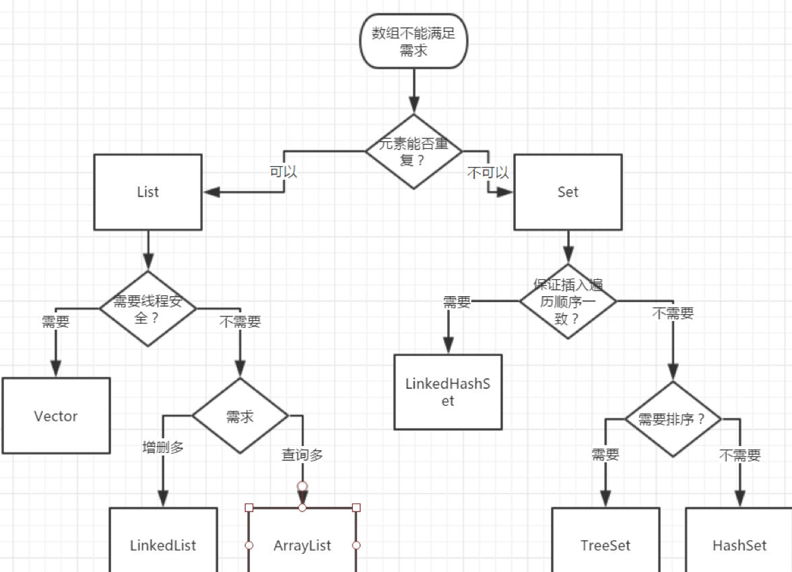</div>
**Map** 接口 键值对的集合 （双列集合） 

- │———**Hashtable** 接口实现类， 同步， 线程安全 
- │———**HashMap** 接口实现类 ，没有同步， 线程不安全- 
- │—————–│-**LinkedHashMap** 双向链表和哈希表实现 
- │—————–│-**WeakHashMap** 
- │———**TreeMap** 红黑树对所有的key进行排序 
- │———**IdentifyHashMap**


## 具体介绍与实例

### **Collection体系**

Collection接口有两个主要的子接口**List**和**Set**，注意Map不是Collection的子接口哦这个要牢记

- **List的特点**：存取有序，有索引，可以根据索引来进行取值，元素可以重复
- **Set的特点**：存取无序，元素不可以重复


### **List**

下面有**ArrayList，LinkedList，Vector**(已过时)

集合的的最大目的就是为了存取；List集合的特点就是存取有序，可以存储重复的元素，可以用下标进行元素的操作。

<br />

**ArrayList:** 底层是使用数组实现，所以查询速度快，增删速度慢

- 如果在初始化ArrayList的时候没有指定初始化长度的话，默认的长度为10.  
- ArrayList在增加新元素的时候如果超过了原始的容量的话，ArrayList扩容ensureCapacity的方案为“原始容量3/2+1哦。
- ArrayList是线程不安全的，在多线程的情况下不要使用。如果一定在多线程使用List的，您可以使用Vector，因为Vector和ArrayList基本一致，区别在于Vector中的绝大部分方法都使用了同步关键字修饰，这样在多线程的情况下不会出现并发错误哦，还有就是它们的扩容方案不同，ArrayList是通过原始容量*3/2+1,而Vector是允许设置默认的增长长度，Vector的默认扩容方式为原来的2倍。切记Vector是ArrayList的多线程的一个替代品。
- ArrayList实现遍历的几种方法

```java
public class Test{
public static void main(String[] args) {
     List<String> list=new ArrayList<String>();
     list.add("Hello");
     list.add("World");
     list.add("HAHAHAHA");
     //第一种遍历方法使用foreach遍历List
     for (String str : list) {            //也可以改写for(int i=0;i<list.size();i++)这种形式
        System.out.println(str);
    }
 
     //第二种遍历，把链表变为数组相关的内容进行遍历
    String[] strArray=new String[list.size()];
    list.toArray(strArray);
    for(int i=0;i<strArray.length;i++) //这里也可以改写为foreach(String str:strArray)这种形式
    {
        System.out.println(strArray[i]);
    }
     
    //第三种遍历 使用迭代器进行相关遍历
     
     Iterator<String> ite=list.iterator();
     while(ite.hasNext())
     {
         System.out.println(ite.next());
     }
 }
}
```

<br />

**LinkedList**:是基于链表结构实现的，所以查询速度慢，增删速度快，提供了特殊的方法，对头尾的元素操作（进行增删查）. 使用LinkedList来实现栈和队列；栈是先进后出，而队列是先进先出

- LinkedList的内部实现 - 对于这个问题，你最好看一下jdk中LinkedList的源码。这样你会醍醐灌顶的。这里我大致说一下:LinkedList的内部是基于双向循环链表的结构来实现的。在LinkedList中有一个类似于c语言中结构体的Entry内部类。在Entry的内部类中包含了前一个元素的地址引用和后一个元素的地址引用类似于c语言中指针。
- LinkedList不是线程安全的，注意LinkedList和ArrayList一样也不是线程安全的，如果在对线程下面访问可以自己重写LinkedList，然后在需要同步的方法上面加上同步关键字synchronized。
- LinkedList的遍历方法

```java
package com.yonyou.test;
 
import java.util.LinkedList;
import java.util.List;
 
public class Test{
public static void main(String[] args) {
     
    List<String> list=new LinkedList<String>();
    list.add("Hello");
    list.add("World");
    list.add("龙不吟，虎不啸");
    //LinkedList遍历的第一种方式使用数组的方式
    String[] strArray=new String[list.size()];
    list.toArray(strArray);
    for(String str:strArray)
    {
        System.out.println(str);
    }
    //LinkedList遍历的第二种方式
    for(String str:list)
    {
        System.out.println(str);   
    }
    //至于还是否有其它遍历方式，我没查，感兴趣自己研究研究
  }
}
```

<br />

**LinkedList和ArrayList的区别和联系**

- ArrayList数组线性表的特点为:类似数组的形式进行存储，因此它的随机访问速度极快。
- ArrayList数组线性表的缺点为:不适合于在线性表中间需要频繁进行插入和删除操作。因为每次插入和删除都需要移动数组中的元素。
-  LinkedList的链式线性表的特点为: 适合于在链表中间需要频繁进行插入和删除操作。
- LinkedList的链式线性表的缺点为: 随机访问速度较慢。查找一个元素需要从头开始一个一个的找。速度你懂的。


### Set

Set集合的特点：元素不重复，存取无序，无下标

Set集合下面有：**HashSet，LinkedHashSet，TreeSet**

<br />

**HashSet**: 是Set接口的最常见的实现类了。其底层是基于Hash算法进行存储相关元素的。部分源码如下:

```java
/**
    * Constructs a new, empty set; the backing <tt>HashMap</tt> instance has
    * default initial capacity (16) and load factor (0.75).
    */
   public HashSet() {
   map = new HashMap<E,Object>();
   }
```

你看到了什么，没错，对于HashSet的底层就是基于HashMap来实现的哦。我们都知道在HashMap中的key是不允许重复的，你换个角度看看，那不就是说Set集合吗？这里唯一一个需要处理的就是那个Map的value弄成一个固定值即可。看来一切水到渠成啊~哈哈~这里的就是Map中的Key。

> *那哈希表是怎么来保证元素的唯一性的呢，哈希表是通过hashCode和equals方法来共同保证的。<br>哈希表的存储数据过程（哈希表底层也维护了一个数组）：根据存储的元素计算出hashCode值，然后根据计算得出的hashCode值和数组的长度进行计算出存储的下标；如果下标的位置无元素，那么直接存储；如果有元素，那么使用要存入的元素和该元素进行equals方法，如果结果为真，则已经有相同的元素了，所以直接不存；如果结果假，那么进行存储，以链表的形式存储**。*

下面讲解一下HashSet使用和理解中容易出现的误区:

- HashSet中存放null值 - HashSet中时允许出入null值的，但是在HashSet中仅仅能够存入一个null值哦。
- HashSet中存储元素的位置是固定的 - HashSet中存储的元素的是无序的，这个没什么好说的，但是由于HashSet底层是基于Hash算法实现的，使用了hashcode，所以HashSet中相应的元素的位置是固定的哦。
- 遍历HashSet的几种方法

```java
package com.yonyou.test;
 
import java.util.HashSet;
import java.util.Iterator;
import java.util.Set;
 
public class Test{
public static void main(String[] args) {
     Set<String> set=new HashSet<String>();
     set.add("Hello");
     set.add("world");
     set.add("Hello");
     //遍历集合的第一种方法，使用数组的方法
     String[] strArray=new String[set.size()];
     strArray=set.toArray(strArray);
     for(String str:strArray)//此处也可以使用for(int i=0;i<strArray.length;i++)
     {
         System.out.println(str);
     }
     //遍历集合的第二中方法，使用set集合直接遍历
     for(String str:set)
     {
         System.out.println(str);
     }
      
     //遍历集合的第三种方法，使用iterator迭代器的方法
     Iterator<String> iterator=set.iterator();
     while(iterator.hasNext())
     {
         System.out.println(iterator.next());
     }
}
}
```

HashSet存储字符串:

```java
package  好好学java;

import java.util.HashSet;
import java.util.Iterator;
import java.util.Set;

public class Test {
    public static void main(String[] args) {
        // 利用HashSet来存取
        Set<String> set = new HashSet<String>();
        
        set.add("我的天");
        set.add("我是重复的");
        set.add("我是重复的");
        set.add("welcome");
        
        // 遍历 第一种方式 迭代器
        Iterator<String> it = set.iterator();
        while(it.hasNext()){
            String str = it.next();
            System.out.println(str);
        }
        
        System.out.println("--------------");
        for (String str : set){
            System.out.println(str);
        }
        // 打印结果，重复的已经去掉了
        /*我的天
        welcome
        我是重复的
        --------------
        我的天
        welcome
        我是重复的*/
    }
```

演示HashSet来存储自定义对象：

```java
public class Person {
    // 属性
    private String name;
    private int age;
    
    // 构造方法
    public Person() {
        super();
        
    }
    public Person(String name, int age) {
        super();
        this.name = name;
        this.age = age;
    }
    
    // 要让哈希表存储不重复的元素，就必须重写hasCode和equals方法
    @Override
    public int hashCode() {
        final int prime = 31;
        int result = 1;
        result = prime * result + age;
        result = prime * result + ((name == null) ? 0 : name.hashCode());
        return result;
    }
    @Override
    public boolean equals(Object obj) {
        if (this == obj)
            return true;
        if (obj == null)
            return false;
        if (getClass() != obj.getClass())
            return false;
        Person other = (Person) obj;
        if (age != other.age)
            return false;
        if (name == null) {
            if (other.name != null)
                return false;
        } else if (!name.equals(other.name))
            return false;
        return true;
    }
    
    
    @Override
    public String toString() {
        return "Person [name=" + name + ", age=" + age + "]";
    }
    // getter & setter
   
    ...
    
}

package  好好学java;

import java.util.HashSet;
import java.util.Set;

public class Test {
    public static void main(String[] args) {
        // 利用HashSet来存取自定义对象 Person
        Set<Person> set = new HashSet<Person>();
        
        set.add(new Person("张三", 12));
        set.add(new Person("李四", 13));
        set.add(new Person("王五", 22));
        set.add(new Person("张三", 12));
        
        // 遍历
        for (Person p : set){
            System.out.println(p);
        }
        // 结果：向集合中存储两个张三对象，但是集合中就成功存储了一个
        /*Person [name=王五, age=22]
        Person [name=李四, age=13]
        Person [name=张三, age=12]*/
    }
}
```

所以在向HashSet集合中存储自定义对象时，为了保证set集合的唯一性，那么必须重写hashCode和equals方法。

<br />

**LinkedHashSet**:不仅是Set接口的子接口而且还是上面HashSet接口的子接口。部分源码如下:

```java
..<br> * @see     Hashtable
 * @since   1.4
 */
 
public class LinkedHashSet<E>
    extends HashSet<E>
    implements Set<E>, Cloneable, java.io.Serializable {
 
    private static final long serialVersionUID = -2851667679971038690L;
 
    /**
     * Constructs a new, empty linked hash set with the specified initial
<br>  ...
```

这里就可以发现Set接口时HashSet接口的一个子接口了吧~通过查看LinkedHashSet的源码可以发现,其底层是基于LinkedHashMap来实现的哦。对于LinkedHashSet而言，它和HashSet主要区别在于LinkedHashSet中存储的元素是在哈希算法的基础上增加了链式表的结构。

是基于链表和哈希表共同实现的，所以具有存取有序，元素唯一

```java
package  好好学java;

import java.util.LinkedHashSet;

public class Test {
    public static void main(String[] args) {
        // 利用LinkedHashSet来存取自定义对象 Person
        LinkedHashSet<Person> set = new LinkedHashSet<Person>();
        
        set.add(new Person("张三", 12));
        set.add(new Person("李四", 13));
        set.add(new Person("王五", 22));
        set.add(new Person("张三", 12));
        
        // 遍历
        for (Person p : set){
            System.out.println(p);
        }
        // 结果：向集合中存储两个张三对象，但是集合中就成功存储了一个,
        // 并且存进的顺序，和取出来的顺序是一致的
        /*Person [name=张三, age=12]
        Person [name=李四, age=13]
        Person [name=王五, age=22]*/
    }
}
```

<br />

**TreeSet**：是一种排序二叉树。存取无序, 但是可以排序 (自然排序)。存入Set集合中的值，会按照值的大小进行相关的排序操作。底层算法是基于红黑树来实现的。

二叉树的存储过程：如果是第一个元素，那么直接存入，作为根节点，下一个元素进来是会跟节点比较，如果大于节点放右边的，小于节点放左边；等于节点就不存储。后面的元素进来会依次比较，直到有位置存储为止

TreeSet和HashSet的主要区别在于TreeSet中的元素会按照相关的值进行排序~TreeSet和HashSet的区别和联系:

1. HashSet是通过HashMap实现的,TreeSet是通过TreeMap实现的,只不过Set用的只是Map的key
2. Map的key和Set都有一个共同的特性就是集合的唯一性.TreeMap更是多了一个排序的功能.
3. hashCode和equal()是HashMap用的, 因为无需排序所以只需要关注定位和唯一性即可.
   1. hashCode是用来计算hash值的,hash值是用来确定hash表索引的.
   2. hash表中的一个索引处存放的是一张链表, 所以还要通过equal方法循环比较链上的每一个对象才可以真正定位到键值对应的Entry.
   3. put时,如果hash表中没定位到,就在链表前加一个Entry,如果定位到了,则更换Entry中的value,并返回旧value
4. 由于TreeMap需要排序,所以需要一个Comparator为键值进行大小比较.当然也是用Comparator定位的.
   1. Comparator可以在创建TreeMap时指定
   2. 如果创建时没有确定,那么就会使用key.compareTo()方法,这就要求key必须实现Comparable接口.
   3. TreeMap是使用Tree数据结构实现的,所以使用compare接口就可以完成定位了.

TreeSet集合存储String对象

```java
package  好好学java;

import java.util.TreeSet;

public class Test {
    public static void main(String[] args) {
        TreeSet<String> treeSet = new TreeSet<String>();
        treeSet.add("abc");
        treeSet.add("zbc");
        treeSet.add("cbc");
        treeSet.add("xbc");
        
        for (String str : treeSet){
            System.out.println(str);
        }
        // 结果：取出来的结果是经过排序的
        /*
        abc
        cbc
        xbc
        zbc*/
    }
}
```

TreeSet保证元素的唯一性是有两种方式：

- 自定义对象实现Comparable接口，重写comparaTo方法，该方法返回0表示相等，小于0表示准备存入的元素比被比较的元素小，否则大于0；
- 在创建TreeSet的时候向构造器中传入比较器Comparator接口实现类对象，实现Comparator接口重写compara方法。

如果向TreeSet存入自定义对象时，自定义类没有实现Comparable接口，或者没有传入Comparator比较器时，会出现ClassCastException异常，下面就是演示用两种方式来存储自定义对象:

```java
package  好好学java;
public class Person implements Comparable<Person>{
    // 属性
    private String name;
    private int age;
    
    // 构造方法
    public Person() {
        super();
        
    }
    public Person(String name, int age) {
        super();
        this.name = name;
        this.age = age;
    }
    
    // 要让哈希表存储不重复的元素，就必须重写hasCode和equals方法
    @Override
    public int hashCode() {
        final int prime = 31;
        int result = 1;
        result = prime * result + age;
        result = prime * result + ((name == null) ? 0 : name.hashCode());
        return result;
    }
    @Override
    public boolean equals(Object obj) {
        if (this == obj)
            return true;
        if (obj == null)
            return false;
        if (getClass() != obj.getClass())
            return false;
        Person other = (Person) obj;
        if (age != other.age)
            return false;
        if (name == null) {
            if (other.name != null)
                return false;
        } else if (!name.equals(other.name))
            return false;
        return true;
    }
    
    @Override
    public String toString() {
        return "Person [name=" + name + ", age=" + age + "]";
    }
    // getter & setter
   ...
    
    @Override
    public int compareTo(Person o) {
        int result = this.age - o.age;
        if (result == 0){
            return this.name.compareTo(o.name);
        }
        return result;
    }
    
}

package  好好学java;

import java.util.TreeSet;

public class Test {
    public static void main(String[] args) {
        // 利用TreeSet来存储自定义类Person对象
        TreeSet<Person> treeSet = new TreeSet<Person>();
        // Person类实现了Comparable接口，并且重写comparaTo方法
        // 比较规则是先按照 年龄排序，年龄相等的情况按照年龄排序
        treeSet.add(new Person("张山1", 20));
        treeSet.add(new Person("张山2", 16));
        treeSet.add(new Person("张山3", 13));
        treeSet.add(new Person("张山4", 17));
        treeSet.add(new Person("张山5", 20));
        
        for (Person p : treeSet){
            System.out.println(p);
        }
        // 结果：按照comparaTo方法内的逻辑来排序的
        /*
        Person [name=张山3, age=13]
        Person [name=张山2, age=16]
        Person [name=张山4, age=17]
        Person [name=张山1, age=20]
        Person [name=张山5, age=20]
         */
        
    }
    
}
```

另一种方式：使用比较器Comparator

```java
package  好好学java;

public class Person{
    // 属性
    private String name;
    private int age;
    
    // 构造方法
    public Person() {
        super();
        
    }
    public Person(String name, int age) {
        super();
        this.name = name;
        this.age = age;
    }
    
    // 要让哈希表存储不重复的元素，就必须重写hasCode和equals方法
    @Override
    public int hashCode() {
        final int prime = 31;
        int result = 1;
        result = prime * result + age;
        result = prime * result + ((name == null) ? 0 : name.hashCode());
        return result;
    }
    @Override
    public boolean equals(Object obj) {
        if (this == obj)
            return true;
        if (obj == null)
            return false;
        if (getClass() != obj.getClass())
            return false;
        Person other = (Person) obj;
        if (age != other.age)
            return false;
        if (name == null) {
            if (other.name != null)
                return false;
        } else if (!name.equals(other.name))
            return false;
        return true;
    }
    
    
    @Override
    public String toString() {
        return "Person [name=" + name + ", age=" + age + "]";
    }
    // getter & setter
   ...
    
}

package  好好学java;

import java.util.Comparator;
import java.util.TreeSet;

public class Test {
    public static void main(String[] args) {
        // 利用TreeSet来存储自定义类Person对象
        // 创建TreeSet对象的时候传入Comparator比较器，使用匿名内部类的方式
        // 比较规则是先按照 年龄排序，年龄相等的情况按照年龄排序
        TreeSet<Person> treeSet = new TreeSet<Person>(new Comparator<Person>() {
            @Override
            public int compare(Person o1, Person o2) {
                if (o1 == o2){
                    return 0;
                }
                int result = o1.getAge() - o2.getAge();
                if (result == 0){
                    return o1.getName().compareTo(o2.getName());
                }
                return result;
            }
            
        });

        treeSet.add(new Person("张山1", 20));
        treeSet.add(new Person("张山2", 16));
        treeSet.add(new Person("张山3", 13));
        treeSet.add(new Person("张山4", 17));
        treeSet.add(new Person("张山5", 20));
        
        for (Person p : treeSet){
            System.out.println(p);
        }
        // 结果：按照compara方法内的逻辑来排序的
        /*
        Person [name=张山3, age=13]
        Person [name=张山2, age=16]
        Person [name=张山4, age=17]
        Person [name=张山1, age=20]
        Person [name=张山5, age=20]
         */
    }
}
```


### **Map接口**

说到Map接口的话大家也许在熟悉不过了。Map接口实现的是一组Key-Value的键值对的组合。 Map中的每个成员方法由一个关键字（key）和一个值（value）构成。Map接口不直接继承于Collection接口（需要注意啦），因为它包装的是一组成对的“键-值”对象的集合，而且在Map接口的集合中也不能有重复的key出现，因为每个键只能与一个成员元素相对应。在我们的日常的开发项目中，我们无时无刻不在使用者Map接口及其实现类。Map有两种比较常用的实现：HashMap和TreeMap等。HashMap也用到了哈希码的算法，以便快速查找一个键，TreeMap则是对键按序存放，因此它便有一些扩展的方法，比如firstKey(),lastKey()等，你还可以从TreeMap中指定一个范围以取得其子Map。键和值的关联很简单，用pub(Object key,Object value)方法即可将一个键与一个值对象相关联。用get(Object key)可得到与此key对象所对应的值对象。另外前边已经说明了，Set接口的底层是基于Map接口实现的。Set中存储的值，其实就是Map中的key，它们都是不允许重复的。

Map接口的常见实现类HashMap、TreeMap、LinkedHashMap、Properties(继承HashTable)以及老版本的HashTable等

<br />

**HashMap**:	HashMap实现了Map、CloneMap、Serializable三个接口，并且继承自AbstractMap类。HashMap基于hash数组实现，若key的hash值相同则使用链表方式进行保存。

<div style="display:flex;">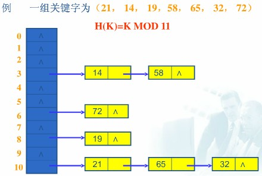</div>
存储自定义对象作为键时，必须重写hasCode和equals方法。存取无序的。下面演示HashMap以自定义对象作为键

```java
package  好好学java;

import java.util.HashMap;
import java.util.Iterator;
import java.util.Map.Entry;
import java.util.Set;

public class Test {
    public static void main(String[] args) {
        // 利用HashMap存储，自定义对象Person作为键
        // 为了保证键的唯一性，必须重写hashCode和equals方法
        HashMap<Person,String> map = new HashMap<Person,String>();
        
        map.put(new Person("张三", 12), "JAVA");
        map.put(new Person("李四", 13), "IOS");
        map.put(new Person("小花", 22), "JS");
        map.put(new Person("小黑", 32), "PHP");
        map.put(new Person("张三", 12), "C++");
        
        Set<Entry<Person, String>> entrySet = map.entrySet();
        Iterator<Entry<Person, String>> it = entrySet.iterator();
        while (it.hasNext()){
            Entry<Person, String> entry = it.next();
            System.out.println(entry.getKey() + "---" + entry.getValue());
        }
        // 结果：存入的时候添加了两个张三，如果Map中键相同的时候，当后面的值会覆盖掉前面的值
        /*
        Person [name=李四, age=13]---IOS
        Person [name=张三, age=12]---C++
        Person [name=小黑, age=32]---PHP
        Person [name=小花, age=22]---JS
        */    
    }
}
```

<br />

**LinkedHashMap**:	继承自HashMap并且实现了Map接口。和HashMap一样，LinkedHashMap允许key和value均为null；用法跟HashMap基本一致，它是基于链表和哈希表结构的所以具有存取有序，键不重复的特性。下面演示利用LinkedHashMap存储，注意存的顺序和遍历出来的顺序是一致的:

```java
package  好好学java;

import java.util.LinkedHashMap;
import java.util.Map.Entry;

public class Test {
    public static void main(String[] args) {
        // 利用LinkedHashMap存储，自定义对象Person作为键
        // 为了保证键的唯一性，必须重写hashCode和equals方法
        LinkedHashMap<Person,String> map = new LinkedHashMap<Person,String>();
        
        map.put(new Person("张三", 12), "JAVA");
        map.put(new Person("李四", 13), "IOS");
        map.put(new Person("小花", 22), "JS");
        map.put(new Person("小黑", 32), "PHP");
        map.put(new Person("张三", 12), "C++");
        
        // foreach遍历
        for (Entry<Person,String> entry : map.entrySet()){
            System.out.println(entry.getKey()+"==="+entry.getValue());
        }
        // 结果：存入的时候添加了两个张三，如果Map中键相同的时候，当后面的值会覆盖掉前面的值
        // 注意：LinkedHashMap的特点就是存取有序，取出来的顺序就是和存入的顺序保持一致
        /*
        Person [name=张三, age=12]===C++
        Person [name=李四, age=13]===IOS
        Person [name=小花, age=22]===JS
        Person [name=小黑, age=32]===PHP
        */
    }
}
```

<br />

**TreeMap**:	给TreeMap集合中保存自定义对象，自定义对象作为TreeMap集合的key值。由于TreeMap底层使用的二叉树，其中存放进去的所有数据都需要排序，要排序，就要求对象具备比较功能。对象所属的类需要实现Comparable接口。或者给TreeMap集合传递一个Comparator接口对象。下面利用TreeMap存入自定义对象作为键：

```java
package  好好学java;

import java.util.Comparator;
import java.util.Map.Entry;
import java.util.TreeMap;

public class Test {
    public static void main(String[] args) {
        // 利用TreeMap存储，自定义对象Person作为键
        // 自定义对象实现Comparable接口或者传入Comparator比较器
        TreeMap<Person,String> map = new TreeMap<Person,String>(new Comparator<Person>() {
            @Override
            public int compare(Person o1, Person o2) {
                if (o1 == o2){
                    return 0;
                }
                int result = o1.getAge() - o2.getAge();
                if (result == 0){
                    return o1.getName().compareTo(o2.getName());
                }
                return result;
            }
        });
        
        map.put(new Person("张三", 12), "JAVA");
        map.put(new Person("李四", 50), "IOS");
        map.put(new Person("小花", 32), "JS");
        map.put(new Person("小黑", 32), "PHP");
        map.put(new Person("张三", 12), "C++");
        
        // foreach遍历
        for (Entry<Person,String> entry : map.entrySet()){
            System.out.println(entry.getKey()+"==="+entry.getValue());
        }
        // 结果：存入的时候添加了两个张三，如果Map中键相同的时候，当后面的值会覆盖掉前面的值
        // 注意：TreeMap 取出来的顺序是经过排序的，是根据compara方法排序的
        /*
        Person [name=张三, age=12]===C++
        Person [name=小花, age=32]===JS
        Person [name=小黑, age=32]===PHP
        Person [name=李四, age=50]===IOS
        */
    }
}
```


## 代码层级关系

集合和数组的比较

1. 集合和数组都是存储对象的容器，不同的是，数组可以存储基本数据类型(int、short、long、char、Boolean、double、float、byte)，集合只能存储任意类型的对象。
2. 数组长度是固定的，集合的长度是可变的(根据加载因子和扩容增量来完成扩容)。

数组操作复杂，在java中可用方法少，集合操作简单，有很多操作方法。<br>
对于集合，顶层都实现了Iterable接口，表明集合都是可迭代的，可以视同iterable()方法获取集合对于的迭代器，也可以使用增强的for循环进行迭代。

**1**. Collection:collection为所以集合的定级接口，继承了Iterable类，表明所有集合类都是可迭代的。

<div style="display:flex;">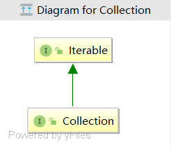</div>
**2**. List: 实现了Collection接口，存储的数据是有序的、可重复的，可通过索引进行元素访问。

<div style="display:flex;">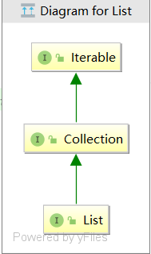</div>
**3**. ArrayList:底层实现为数组，线程不安全，查找效率高，增删效率低。

<div style="display:flex;">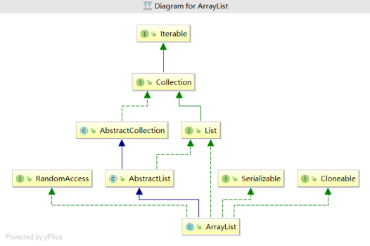</div>
**4**. Vector:由下图可知vector和ArrayList实现原理相同，但是vector是线程安全的(synchronized)，效率略低于ArrayList。

<div style="display:flex;">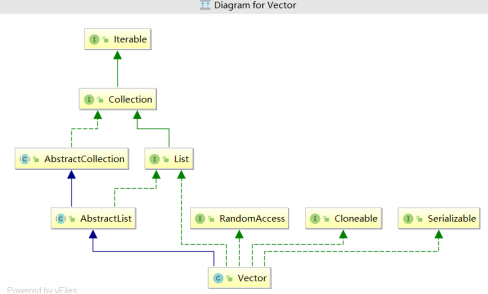</div>
**5**. Stack:继承Vector，是一个先进后出的栈。

<div style="display:flex;">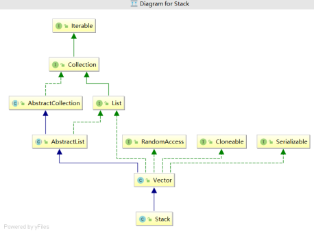</div>
**6**. LinkedList:底层实现为双向链表，进行元素的增删效率高，查询效率低。

<div style="display:flex;">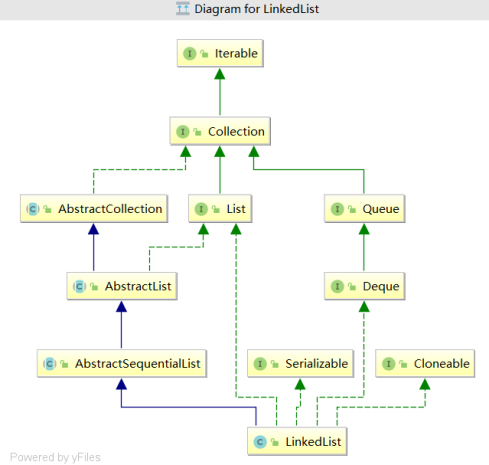</div>
**7**. Queue:队列，先进先出(FIFO)

<div style="display:flex;">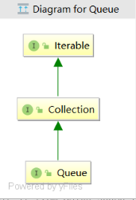</div>
**8**. Set:存储的元素是无序的、唯一的。在程序运行中，如果使用add添加一个已经存在的元素，将返回false。

<div style="display:flex;">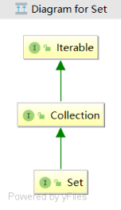</div>
**9**. HashSet:底层实现为哈希表(链表+数组)，线程不安全，查找效率高，增删效率低，通过元素的hashCode和equels方法保证了元素的唯一性。

<div style="display:flex;">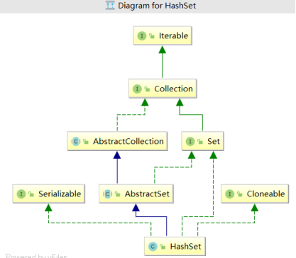</div>
<div style="display:flex;">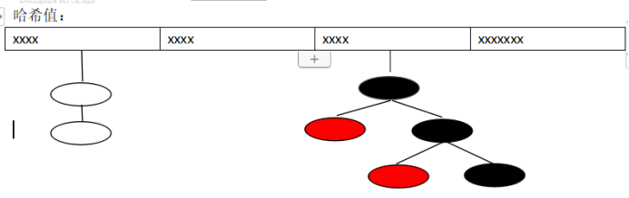</div>
上图为HashSet底层实现模式哈希表(数组+链表)，当一条链上元素超过8个以上后，会自动转换为红黑树来存储元素，提高查询效率。

**11**. TreeSet:底层实现为二叉树，线程不安全，可对元素进行自动排序，保证元素唯一性的方式是compareTo方法返回0。

<div style="display:flex;">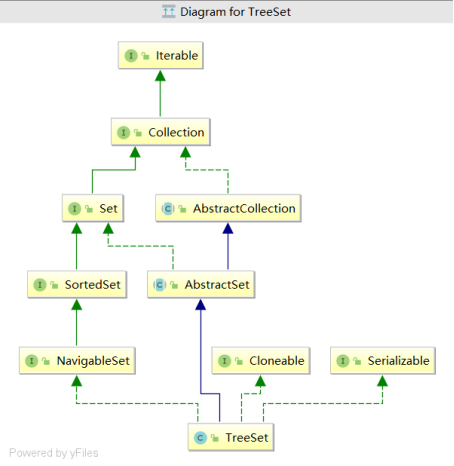</div>
**12**. LinkedHashSet:底层实现为链表和哈希表，线程不安全，存储的元素时有序的、唯一的，通过元素的hashCode和equels方法保证了元素的唯一性。

<div style="display:flex;">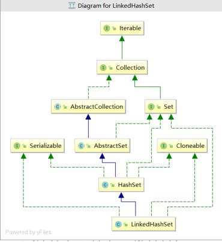</div>
Arrays：类Arrays为集合的工具类，可使用该类的方法对集合进行排序、转换为list等操作。

Collections：为所有直接或间接实现了Collection接口的集合类的工具类，该类封装了对集合的各种操作，如排序、反转、替换等操作。