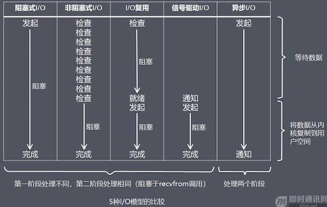
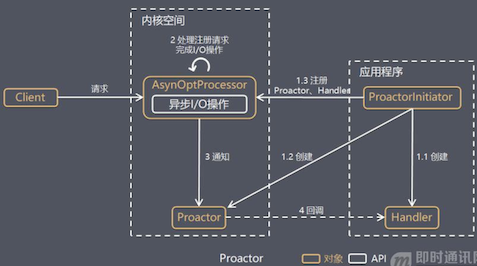

# 高性能网络编程中的IO模型与线程模型

::: tip 此文为转载 （通常一篇文章会参考多处，也会添加自己的理解，引用地址如有遗漏，请指出）

- http://www.52im.net/thread-561-1-1.html

:::

 

## 高性能网络编程中的IO模型

### 互联网服务端处理网络请求的原理

 

**由上图可以看到，主要处理步骤包括：** 

- 1）获取请求数据，客户端与服务器建立连接发出请求，服务器接受请求（1-3）；
- 2）构建响应，当服务器接收完请求，并在用户空间处理客户端的请求，直到构建响应完成（4）；
- 3）返回数据，服务器将已构建好的响应再通过内核空间的网络 I/O 发还给客户端（5-7）。

**设计服务端并发模型时，主要有如下两个关键点：** 

- 1）服务器如何管理连接，获取输入数据；
- 2）服务器如何处理请求。

以上两个关键点最终都与操作系统的 I/O 模型以及线程(进程)模型相关，下面先详细介绍这I/O模型。

### “I/O 模型”的基本认识

**介绍操作系统的 I/O 模型之前，先了解一下几个概念：** 

- 1）阻塞调用与非阻塞调用；
- 2）阻塞调用是指调用结果返回之前，当前线程会被挂起，调用线程只有在得到结果之后才会返回；
- 3）非阻塞调用指在不能立刻得到结果之前，该调用不会阻塞当前线程。

两者的最大区别在于被调用方在收到请求到返回结果之前的这段时间内，调用方是否一直在等待。

**阻塞**是指调用方一直在等待而且别的事情什么都不做；**非阻塞**是指调用方先去忙别的事情。

**同步处理与异步处理**:同步处理是指被调用方得到最终结果之后才返回给调用方；异步处理是指被调用方先返回应答，然后再计算调用结果，计算完最终结果后再通知并返回给调用方。

**阻塞、非阻塞和同步、异步的区别（阻塞、非阻塞和同步、异步其实针对的对象是不一样的）**

- 1）阻塞、非阻塞的讨论对象是调用者；
- 2）同步、异步的讨论对象是被调用者。

**recvfrom 函数：**

recvfrom 函数(经 Socket 接收数据)，这里把它视为系统调用。

**一个IO输入操作通常包括两个不同的阶段：**

- 1）等待数据准备好；
- 2）从内核向进程复制数据。

对于一个套接字上的输入操作，第一步通常涉及等待数据从网络中到达。当所等待分组到达时，它被复制到内核中的某个缓冲区。第二步就是把数据从内核缓冲区复制到应用进程缓冲区。 实际应用程序在系统调用完成上面的 2 步操作时，调用方式的阻塞、非阻塞，操作系统在处理应用程序请求时，处理方式的同步、异步处理的不同，可以分为 5 种 I/O 模型（下面的章节将逐个展开介绍）。（参考《[UNIX网络编程卷1](http://www.52im.net/thread-1015-1-1.html)》）

#### I/O模型1：阻塞式 I/O 模型(blocking I/O）

#### I/O模型2：非阻塞式 I/O 模型(non-blocking I/O）

#### I/O模型3：I/O 复用模型(I/O multiplexing）

#### I/O模型4：信号驱动式 I/O 模型(signal-driven I/O)

#### I/O模型5：异步 I/O 模型(即AIO，全称asynchronous I/O）

亦可参考 “[IO - 同步，异步，阻塞，非阻塞](https://heyan.site:8001/Java/JavaNIO/IOTheory.html)”；

### **5 种 I/O 模型总结**

 

从上图中我们可以看出，越往后，阻塞越少，理论上效率也是最优。 这五种 I/O 模型中，前四种属于同步 I/O，因为其中真正的 I/O 操作(recvfrom)将阻塞进程/线程，只有异步 I/O 模型才与 POSIX 定义的异步 I/O 相匹配。

## 高性能网络编程中的线程模型

上面介绍完服务器如何基于 I/O 模型管理连接，获取输入数据，下面将介绍基于进程/线程模型，服务器如何处理请求。 值得说明的是，具体选择线程还是进程，更多是与平台及编程语言相关。 例如 C 语言使用线程和进程都可以(例如 Nginx 使用进程，Memcached 使用线程)，Java 语言一般使用线程(例如 Netty)，为了描述方便，下面都使用线程来进行描述。

### **线程模型1：传统阻塞 I/O 服务模型**

 

**特点：**

- 1）采用阻塞式 I/O 模型获取输入数据；
- 2）每个连接都需要独立的线程完成数据输入，业务处理，数据返回的完整操作。

**存在问题：**

- 1）当并发数较大时，需要创建大量线程来处理连接，系统资源占用较大；
- 2）连接建立后，如果当前线程暂时没有数据可读，则线程就阻塞在 Read 操作上，造成线程资源浪费。

### **线程模型2：Reactor 模式**

#### 1-基本介绍

**针对传统阻塞 I/O 服务模型的 2 个缺点，比较常见的有如下解决方案：** 

- **1）基于 I/O 复用模型**：多个连接共用一个阻塞对象，应用程序只需要在一个阻塞对象上等待，无需阻塞等待所有连接。当某条连接有新的数据可以处理时，操作系统通知应用程序，线程从阻塞状态返回，开始进行业务处理；
- **2）基于线程池复用线程资源**：不必再为每个连接创建线程，将连接完成后的业务处理任务分配给线程进行处理，一个线程可以处理多个连接的业务。

**I/O 复用结合线程池，这就是 Reactor 模式基本设计思想，如下图：**

Reactor 模式，是指通过一个或多个输入同时传递给服务处理器的服务请求的事件驱动处理模式。  服务端程序处理传入多路请求，并将它们同步分派给请求对应的处理线程，Reactor 模式也叫 Dispatcher 模式。 即 I/O 多路复用统一监听事件，收到事件后分发(Dispatch 给某进程)，是编写高性能网络服务器的必备技术之一。

**Reactor 模式中有 2 个关键组成：**

- **1）Reactor**：Reactor 在一个单独的线程中运行，负责监听和分发事件，分发给适当的处理程序来对 IO 事件做出反应。 它就像公司的电话接线员，它接听来自客户的电话并将线路转移到适当的联系人；
- **2）Handlers**：处理程序执行 I/O 事件要完成的实际事件，类似于客户想要与之交谈的公司中的实际官员。Reactor 通过调度适当的处理程序来响应 I/O 事件，处理程序执行非阻塞操作。

**根据 Reactor 的数量和处理资源池线程的数量不同，有 3 种典型的实现：**

- 1）单 Reactor 单线程；
- 2）单 Reactor 多线程；
- 3）主从 Reactor 多线程。

下面详细介绍这 3 种实现方式。

#### 2-单 Reactor 单线程

 

其中，Select 是前面 I/O 复用模型介绍的标准网络编程 API，可以实现应用程序通过一个阻塞对象监听多路连接请求，其他方案示意图类似。

**方案说明：**

- 1）Reactor 对象通过 Select 监控客户端请求事件，收到事件后通过 Dispatch 进行分发；
- 2）如果是建立连接请求事件，则由 Acceptor 通过 Accept 处理连接请求，然后创建一个 Handler 对象处理连接完成后的后续业务处理；
- 3）如果不是建立连接事件，则 Reactor 会分发调用连接对应的 Handler 来响应；
- 4）Handler 会完成 Read→业务处理→Send 的完整业务流程。

**优点**：模型简单，没有多线程、进程通信、竞争的问题，全部都在一个线程中完成。 **缺点**：性能问题，只有一个线程，无法完全发挥多核 CPU 的性能。Handler 在处理某个连接上的业务时，整个进程无法处理其他连接事件，很容易导致性能瓶颈；可靠性问题，线程意外跑飞，或者进入死循环，会导致整个系统通信模块不可用，不能接收和处理外部消息，造成节点故障。 **使用场景**：客户端的数量有限，业务处理非常快速，比如 Redis，业务处理的时间复杂度 O(1)。

#### 3-单 Reactor 多线程

 

**方案说明：**

- 1）Reactor 对象通过 Select 监控客户端请求事件，收到事件后通过 Dispatch 进行分发；
- 2）如果是建立连接请求事件，则由 Acceptor 通过 Accept 处理连接请求，然后创建一个 Handler 对象处理连接完成后续的各种事件；
- 3）如果不是建立连接事件，则 Reactor 会分发调用连接对应的 Handler 来响应；
- 4）Handler 只负责响应事件，不做具体业务处理，通过 Read 读取数据后，会分发给后面的 Worker 线程池进行业务处理；
- 5）Worker 线程池会分配独立的线程完成真正的业务处理，如何将响应结果发给 Handler 进行处理；
- 6）Handler 收到响应结果后通过 Send 将响应结果返回给 Client。

**优点**：可以充分利用多核 CPU 的处理能力。 **缺点**：多线程数据共享和访问比较复杂；Reactor 承担所有事件的监听和响应，在单线程中运行，高并发场景下容易成为性能瓶颈。

#### 4-主从 Reactor 多线程

 

针对单 Reactor 多线程模型中，Reactor 在单线程中运行，高并发场景下容易成为性能瓶颈，可以让 Reactor 在多线程中运行。

**方案说明：**

- 1）Reactor 主线程 MainReactor 对象通过 Select 监控建立连接事件，收到事件后通过 Acceptor 接收，处理建立连接事件；
- 2）Acceptor 处理建立连接事件后，MainReactor 将连接分配 Reactor 子线程给 SubReactor 进行处理；
- 3）SubReactor 将连接加入连接队列进行监听，并创建一个 Handler 用于处理各种连接事件；
- 4）当有新的事件发生时，SubReactor 会调用连接对应的 Handler 进行响应；
- 5）Handler 通过 Read 读取数据后，会分发给后面的 Worker 线程池进行业务处理；
- 6）Worker 线程池会分配独立的线程完成真正的业务处理，如何将响应结果发给 Handler 进行处理；
- 7）Handler 收到响应结果后通过 Send 将响应结果返回给 Client。

**优点**：父线程与子线程的数据交互简单职责明确，父线程只需要接收新连接，子线程完成后续的业务处理。 父线程与子线程的数据交互简单，Reactor 主线程只需要把新连接传给子线程，子线程无需返回数据。 这种模型在许多项目中广泛使用，包括 Nginx 主从 Reactor 多进程模型，Memcached 主从多线程，Netty 主从多线程模型的支持。

#### 5-小结

**3 种模式可以用个比喻来理解：**（餐厅常常雇佣接待员负责迎接顾客，当顾客入坐后，侍应生专门为这张桌子服务）

- 1）单 Reactor 单线程，接待员和侍应生是同一个人，全程为顾客服务；
- 2）单 Reactor 多线程，1 个接待员，多个侍应生，接待员只负责接待；
- 3）主从 Reactor 多线程，多个接待员，多个侍应生。

**Reactor 模式具有如下的优点：**

- 1）响应快，不必为单个同步时间所阻塞，虽然 Reactor 本身依然是同步的；
- 2）编程相对简单，可以最大程度的避免复杂的多线程及同步问题，并且避免了多线程/进程的切换开销；
- 3）可扩展性，可以方便的通过增加 Reactor 实例个数来充分利用 CPU 资源；
- 4）可复用性，Reactor 模型本身与具体事件处理逻辑无关，具有很高的复用性。

### **线程模型2：Proactor 模型**

在 Reactor 模式中，Reactor 等待某个事件或者可应用或者操作的状态发生（比如文件描述符可读写，或者是 Socket 可读写）。 然后把这个事件传给事先注册的 Handler（事件处理函数或者回调函数），由后者来做实际的读写操作。 其中的读写操作都需要应用程序同步操作，所以 Reactor 是非阻塞同步网络模型。 如果把 I/O 操作改为异步，即交给操作系统来完成就能进一步提升性能，这就是异步网络模型 Proactor。

**Proactor 是和异步 I/O 相关的，详细方案如下：**

- 1）Proactor Initiator 创建 Proactor 和 Handler 对象，并将 Proactor 和 Handler 都通过 AsyOptProcessor（Asynchronous Operation Processor）注册到内核；
- 2）AsyOptProcessor 处理注册请求，并处理 I/O 操作；
- 3）AsyOptProcessor 完成 I/O 操作后通知 Proactor；
- 4）Proactor 根据不同的事件类型回调不同的 Handler 进行业务处理；
- 5）Handler 完成业务处理。

**可以看出 Proactor 和 Reactor 的区别：**

- 1）Reactor 是在事件发生时就通知事先注册的事件（读写在应用程序线程中处理完成）；
- 2）Proactor 是在事件发生时基于异步 I/O 完成读写操作（由内核完成），待 I/O 操作完成后才回调应用程序的处理器来进行业务处理。

理论上 Proactor 比 Reactor 效率更高，异步 I/O 更加充分发挥 DMA(Direct Memory Access，直接内存存取)的优势。

**但是Proactor有如下缺点：** 

- 1）编程复杂性，由于异步操作流程的事件的初始化和事件完成在时间和空间上都是相互分离的，因此开发异步应用程序更加复杂。应用程序还可能因为反向的流控而变得更加难以 Debug；
- 2）内存使用，缓冲区在读或写操作的时间段内必须保持住，可能造成持续的不确定性，并且每个并发操作都要求有独立的缓存，相比 Reactor 模式，在 Socket 已经准备好读或写前，是不要求开辟缓存的；
- 3）操作系统支持，Windows 下通过 IOCP 实现了真正的异步 I/O，而在 Linux 系统下，Linux 2.6 才引入，目前异步 I/O 还不完善。

因此在 Linux 下实现高并发网络编程都是以 Reactor 模型为主。